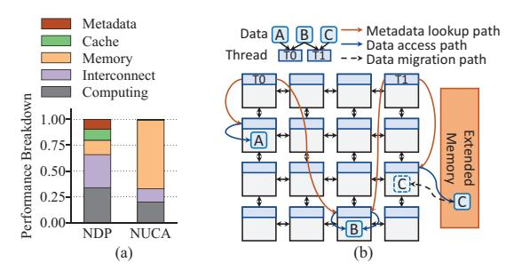
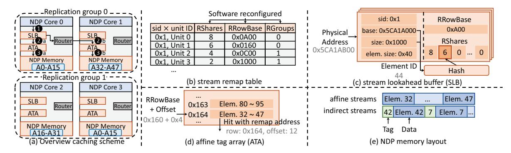

# III. NDP WITH EXTENDED MEMORY

In this work, we focus on 3D-stacked NDP systems and address their main limitation of memory capacity, as discussed in Section II-A. Following the seminal idea of memory hierarchy in conventional computer architecture research, the fast but small NDP memory devices could be extended with more traditional memory modules that have larger capacity but possibly slower access speed. We call this architecture *NDP with extended memory*. While adding extended memory could now support large-scale applications, it does incur higher latency and energy to access, and may offset the benefits of NDP if not well designed. Therefore, careful architectural optimizations must be done to ensure we could achieve the best of both worlds, i.e., the fast access speed of NDP, and the large memory capacity of extended memory. We first discuss the choices of the overall architecture in Section III-A, and its specific design challenges in Section III-B. We propose novel optimizations to address the challenges in the next sections.

## *A. Overall Architecture*

NDP. Our NDP modules align with prior 3D-stacked NDP designs [1], [8], [17], [20], [21], [43], [45], [69], [79], [82]. As shown in Fig. 1, several NDP stacks are interconnected with inter-stack links. Each stack consists of 16 NDP units arranged in an internal 4×4 mesh, with each NDP unit including the computing logic on the bottom die and the corresponding memory region above. The *NDP unit* is the basic hardware granularity in our architecture. We use generalpurpose, energy-efficient cores as the NDP logic, but other types such as reconfigurable logic and ASIC can also fit in our architecture. Besides the computing logic, each unit has a memory controller to access the corresponding local memory, and a router to access remote memory regions through the inter-stack and intra-stack networks. We connect the NDP modules with the host processor through PCIe interfaces [1], similar to accelerators and GPUs. Coarse-grained program kernels could be offloaded to the NDP modules.

Connecting NDP to extended memory. We further connect CXL-based extended memory modules to the above NDP stacks, through a central CXL controller as shown in Fig. 1. The requests from NDP are parsed by the CXL endpoint in the extended memory, which then issues DDR commands to the corresponding memory channels. In this design, the NDP system and the extended memory module can be manufactured fully independently by different vendors to save the integration cost, as long as both expose the standard CXL interface to the other. The host processor also does not need any modification. We note that while we specifically use CXL, other technologies, such as adding traditional DIMM-based memory, or reusing the host memory by relaying accesses through the host processor, are also possible. Nevertheless, it is believed that CXL has much better scalability in bandwidth, capacity, and pin count than traditional DDR (Section II-A), and will gradually replace DDR in the future [12]. Because our system does not have any backward-compatibility issues as CPUs and GPUs, CXL is a particularly suitable choice.

Cache vs. part-of-memory. As we now have both the fast and small NDP memory and the slow and large extended memory, another decision to make is whether to manage the NDP as a cache of the extended memory space, or expose both as parts of the physical memory visible to the OS. This is a well-studied debate in previous heterogeneous memory research [37], [50], [53], [62], [67], [72]. In this work, we assume a cache-based approach, where data are initially loaded into the extended memory, and fetched on demand to the NDP stacks at runtime. This choice is preferred for its simplicity and transparency to the application software. In addition, the NDP stack capacity is relatively small compared to the extended memory, so treating the former as part of the memory does not significantly increase the overall capacity. Furthermore, we manage the combination of the NDP memory across all stacks as a global, distributed cache. Compared to making each NDP unit use its own private cache space, this would enable better data sharing and reuse, especially for applications with finegrained irregular access patterns like graph computing.

## *B. Design Challenges*

To our best knowledge, NDPExt is the first work to use the entire NDP memory as a cache, and to extend the system capacity using CXL-based memory. The key design goal in NDPExt is to efficiently manage the cache, which is composed of the 3D-stacked DRAM distributed across the many NDP units. We can quickly see the similarity between this architec-

Fig. 2. (a) Comparison of the access latency breakdown in NDP and NUCA systems. (b) Challenges of a distributed DRAM cache in NDP systems.

ture and the conventional NUCA systems, which motivates us to design optimized data access and placement mechanisms.

Nevertheless, despite the same distributed cache organization with non-uniform access characteristics, NDP also exhibits unique challenges. To illustrate these differences, we simulate the PageRank workload on both systems using a simple static cacheline-interleaving policy. Both systems use 64 (processor or NDP) cores. The NUCA system mimics Jigsaw [6], with a 512 kB LLC bank per core, and a 9-cycle access latency plus a 3-cycle routing latency. The NDP system uses HMC-style memory, following Table II. Fig. 2(a) shows their average access latency breakdown. We observe two unique bottlenecks in NDP illustrated in Fig. 2(b).

(1) Interconnect overheads. In conventional static NUCA systems, all data elements are randomly cached across all units, resulting in high hop counts to gather all data to one core. By using the same random placement policy, the NDP system incurs a much higher latency portion on the interconnect (intra-stack and inter-stack) compared to the NUCA system, 32% vs. 13%. This overhead greatly affects the overall performance. NDP has higher interconnect latencies than NUCA because there are usually more NDP cores than NUCA cores and thus more interconnect hops, and we need to go off-chip more often due to the many 3D memory stacks. Actually, thanks to the much larger capacity, the NDP system achieves a significantly higher cache hit rate than the NUCA one (70% vs. 47%), which contributes to the much smaller portion of the next-level memory. However, most of these hits still exhibit long latencies, as they may be served from a remote NDP stack of multiple hops away.

(2) Metadata overheads. In the NDP system, the distributed DRAM cache is too large to have its metadata (i.e., tags) stored fully on-chip on the logic die, an issue similar to prior hardware-based DRAM caches [37], [50], [62], [67], [69], [72]. For instance, for a 256 MB DRAM cache, the metadata would need 16 MB space assuming each 64 B cacheline needs a 4-byte entry. Such a size cannot be entirely placed on-chip. As a result, there is significant extra access traffic (one metadata lookup per cacheline access, illustrated in Fig. 2(b)) consumed on accessing the cache metadata stored in the DRAM of local/remote NDP stacks. We observe that 10% of cycles are spent on remote tag accesses.

Consequently, design optimizations for the NDP cache

should incorporate additional considerations beyond the existing NUCA schemes. Specifically, previous designs such as Jigsaw [6], CDCS [7], and Whirlpool [56] proposed to monitor the data use patterns of each core, and iteratively adjust the data placement to move data to the "center-of-mass" locations to reduce access distances. For Fig. 2(b), by placing the common data B in the middle of the T0 and T1 units, the interconnect hops can decrease from 4.5 to 1.5. If the cache capacity is insufficient, some data are gradually evicted to nearby places. These approaches have two issues. First, they treat the cache space at the center of the interconnect more valuable than the corner ones, because the preferred centerof-mass data locations are more likely to fall into the center NDP units. Second, if not all data can be put in the desired locations, some are placed at suboptimal positions, incurring extra hops. Both issues may not be severe in conventional NUCA because the interconnect impact is only a few cycles, but with NDP, data placement should be carefully handled.

One way to alleviate the long interconnect distance issue is to apply data replication, i.e., cache multiple data copies at different places so each core can get a nearby replica. Data replication is particularly suitable for our NDP scenario, where we could trade the abundant DRAM cache capacity for lower access distances. For example, in Fig. 2(b) if we replicate data B at both T0 and T1, we can eliminate remote accesses to it on the interconnect. Prior NUCA systems like R-NUCA [28] and Nexus [71] used a global replication degree that was applied uniformly to all the read-only data and instructions. This rather rigid scheme may not result in the best cache utilization, but the fine-grained cacheline-level management prohibits more complex designs. As mentioned above, the metadata lookup cost is already quite high in the NDP cache, not yet considering the needs of flexible data replication.

## C. Our Approaches

NDPExt addresses the above issues using two co-designed techniques. On the hardware side (Section IV), NDPExt uses a stream cache organization on the NDP memory, with a coarsegrained stream abstraction instead of tracking fine-grained cachelines. The coarse granularity alleviates metadata cost and also supports more flexible data placement and replication at the stream level. On the software side (Section V), NDPExt uses a runtime on the host processor to periodically derive optimized cache configuration schemes that allocate the NDP cache space to the streams, based on efficient sampling techniques to profile the miss behaviors, and a novel algorithm to co-optimize capacity sizing, spatial placement, and data replication. Better allocation near data consumers and data replication both reduce the interconnect overheads and thus decrease the hit latency. However, replicating data may reduce the cache hit rate as well. Our algorithm carefully balances this hit rate vs. hit latency tradeoff.

#### IV. STREAM CACHE DESIGN

NDPExt adopts software-defined streams as a coarsegrained abstraction for caching, in order to support flexible data placement and replication, without excessive metadata overheads. Compared to conventional NUCA, tracking streams rather than individual cachelines reduces metadata storage and lookup cost. Furthermore, we can now use customized replication schemes for each stream rather than being limited to a single global policy as in R-NUCA [28] and Nexus [71].

### A. Using Streams for NDP Caching

NDP is mainly used for memory-intensive applications, where there are large amounts of data to be accessed. These data are typically organized into certain dense or sparse structures and accessed through well-defined patterns. Streams, including the affine and indirect types, are thus a suitable coarsegrained abstraction to model such NDP data. For example, in parallelized graph traversal, the vertices are partitioned to multiple threads, and the edge list is sequentially accessed to obtain the outgoing edges for each vertex. Both the vertex list and the edge list are affine streams. In contrast, the order of the visited boolean array depends on the edge list, making it an indirect stream. As another example, our quantitative investigation finds that over 99% data accesses in PageRank in Fig. 2(a) can be captured by streams, with 55% as affine and 44% as indirect. These accesses are to various data structures like the vertex list, the edge list, and the rank score array. Many other NDP workloads also exhibit ample stream accesses [75].

Previous work has demonstrated that the stream model can effectively capture the access behaviors of various applications, and can be used to facilitate instruction prefetching [74], instruction offloading [75], [76], and automated parallelization [73]. We are the first to adopt the stream model to simplify DRAM cache organization and lookup. We adopt a similar model to prior work [74]–[76]. Streams are configured using the following API, which is made after each data allocation and before actual accesses to the data structure.

configure\_stream(type, base, size, elemSize,

All streams should provide the first four arguments to configure the stream type (affine or indirect), the starting address, the total size, and the size of each element. Multi-dimensional affine streams can optionally supply the last three arguments, if the access order is different from the storage order, e.g., column-major accesses to a row-major matrix. We use similar strategies as in previous work [76] to support reordered affine iterators for at most 3 dimensions. The order is given in the 3-bit order argument. The hardware would cache the elements following their access order. Element reordering significantly improves data spatial locality, resulting in higher hit rates and reduced unnecessary DRAM row activations.

Table I explains the arguments in detail. These configurations are stored with a unique stream ID called sid, and will be sent to the hardware for stream management, as discussed below. Similar to previous work [73]–[76], currently we only support manually inserting stream configuration hints, and defer automatic compiler-based methods to future work. Note that the rest hardware components, such as the upper-

TABLE I STREAM METADATA.

|             | Field                                       | Bits                    | Description                                                                            |
|-------------|---------------------------------------------|-------------------------|----------------------------------------------------------------------------------------|
| Common      | sid base size elemSize readOnly | 9 48 48 4 1 | Stream ID Base physical address Total stream size Element size Read-only or not        |
| Affine only | stride length order                   | 48×3 48×2 3       | Access stride along dim X/Y/Z Stream length along dim Y/Z Access dimension order |

level SRAM caches, still work with the conventional physical-address-based cachelines, and are not affected.

### B. Overall Caching Scheme

Similar to shared-cache-based D-NUCA, NDPExt maintains a remapping scheme to determine where a stream could be cached. Each stream could be remapped to multiple cache locations if it is read-only, supporting data replication to reduce the interconnect overheads when accessed. As we maintain the remapping metadata in the unit of coarse-grained streams rather than individual fine-grained cachelines, the metadata storage and lookup cost is well confined. Furthermore, the low-cost metadata scheme also enables us to use more complex replication policies, i.e., each stream is allowed to have its own replication scheme. This is the key difference from previous NUCA designs like Nexus [71].

We now describe the overall caching scheme in detail. Recall that the whole system is composed of multiple NDP units, each of which contains some local DRAM space that is used as part of the distributed DRAM cache capacity. Each stream is allocated a specific amount of cache space (in units of DRAM rows) from each NDP unit in the system. To further support data replication, the allocated cache space in these NDP units can be partitioned into multiple replication groups, and each group can independently cache a copy. For example, in Fig. 3(a), a specific stream A has cache space in all the four NDP units, organized into two replication groups of (0, 1) and (2, 3). The memory accesses missed from the local SRAM caches (1) will first look up the local metadata structures (SLB) and ATA, described later in Section IV-C), and then are either served by the local memory controller (2a, 3a) or routed to a remote NDP unit within its replication group (2b, 3b). If the data are not cached, we fetch from the extended memory.

As illustrated in Fig. 3(b), we use a structure called *remap shares* (RShares) to record the allocation of DRAM cache space to streams. RShares is a vector whose length is equal to the number of NDP units. Each item represents how many DRAM rows in the corresponding NDP unit are allocated to this stream as cache space. The exact locations are kept in another *remap row base* vector RRowBase. We use another structure called RGroups of the same length as RShares, to represent the replication group ID that each NDP unit belongs to. For example, with RShares = (8,6,4,2) and RGroups = (0,0,1,1), the first two units use 8 and 6 DRAM rows to

Fig. 3. (a) Overall caching scheme. SRAM caches and memory controllers are omitted. (b) Stream remap table for centralized remapping information. (c) Stream lookahead buffer (SLB) of unit 0. (d) Affine tag array (ATA) of unit 1. The valid and dirty bits are omitted. (e) Data layouts in DRAM caches for affine and indirect streams.

cache the stream as replication group 0, while the next two units contribute 4 and 2 DRAM rows to form replication group 1. Within each replication group, we use hash functions to determine the exact location for each element of the stream [6].

The above information fully determines the stream-based, distributed DRAM caching scheme in NDPExt. Such a scheme is configured by the runtime software (Section V) and enforced by the hardware (Section IV-C). To support dynamic changes in program behaviors, the scheme is also periodically reconfigured by the runtime. The runtime maintains a centralized *stream remap table* as Fig. 3(b) to keep the information, stored in the host processor memory together with the stream configurations (Table I). Currently, NDPExt supports up to 512 streams (9-bit sid) and 64 NDP units. Each item in RShares, RRowBase, and RGroups is 16 bits (at most 64k DRAM rows allocated in each NDP unit), 18 bits (256k DRAM rows in total per NDP unit), and 6 bits (maximum 64 groups). In total the stream remap table is  $512 \times 64 \times 40$  bits = 160 kB.

Replication only for read-only streams. NDPExt only allows replication of read-only streams. For read-write streams, NDPExt allows only a single global replication group, so there is only a single copy of the stream data in the cache, ensuring coherence. To detect read-only streams, NDPExt keeps a readOnly bit for each stream, initialized to 1. In the event of a write operation to a read-only stream, an exception is sent to the host processor, which updates the stream remap table states [6], [7], [56], [71]. As the host processor has the information of all remap shares for all remap groups, it then sends invalidates to the relevant NDP units. No writebacks are needed because the data are still clean thus far, and this exception only happens at most once per stream. So the overhead is minor. Only stream status changes involve the host processor, while subsequent writes are handled by the NDP units. Such exceptions are rare and incur minor overheads in typical applications [28]. Alternatively, we can augment the stream API to let programmers mark read-only streams.

#### C. Hardware Structures

Besides the stream remap table as the global metadata, we further design a hardware structure called *stream lookahead* 

buffer (SLB) to locally cache the metadata in each NDP unit for faster probing, similar to TLB vs. page table. Fig. 3(c) shows the structure of SLB. Each SLB has 32 entries, one entry for one stream. Each entry is simplified and thus consumes less space compared to the full stream remap table entry. Specifically, we avoid storing RGroups by zeroing out all RShares items except for those in the same replication group, because only the cache space within the same group could be used by this NDP core. We also store only one remap row base item in RRowBase that corresponds to this NDP unit. Overall, each SLB only uses 4.6 kB of SRAM space, comparable to previous NDP hardware metadata cost [69].

Given a miss request, the physical address is searched in the local SLB using a modified content-addressable memory (CAM) structure, to identify the stream it falls in, by comparing with the base and size fields of each entry. It further calculates the corresponding element ID using the elemSize. In Fig. 3(c), 0x5CA1AB00 is within stream 0x1 and corresponds to an element ID of 44. To conduct range matching, we use a ternary CAM (TCAM) design [2]. We search for the common prefix of base and base+size, while the rest lower bits are set to "don't care". Then we check each of the hit ranges with digital comparators to identify the actual hit.

If the address misses in the SLB, we ask the host processor to check the complete stream remap table and refill the SLB entry. This method, akin to virtual memory translation, has been previously employed in NUCA systems [6], [7], [56], [71]. If the address is not identified as a stream element, we bypass the DRAM cache and directly access the extended memory. This case is rare (less than 0.1% in our experiments), because most of such data, e.g., local variables, are covered within the local SRAM caches. For simplicity, NDPExt currently supports associating one address with at most one stream. We ignore the rare cases where the same data participate in different access patterns in some applications. Otherwise, coherence is not guaranteed as these streams are separately cached and synonyms appear. On the other hand, dynamic-sized streams can be supported with oversubscription, e.g., over-allocating space, and updating stream configurations and invalidating cached data for each memory reallocation. Untouched data are not cached, so oversubscription does not hurt performance. The rare stream configuration updates are done by the host processor.

With the obtained element ID in the stream, we further determine which NDP unit within this replication group should cache this element, using the RShares information in the SLB entry. For example in Fig. 3(c), the replication group has 8 and 6 DRAM rows in NDP units 0 and 1 as cache space. After hashing the element ID 44, we can determine this element is at NDP unit 1, with a certain DRAM row offset within its total 6 rows. Then the request is sent to the destination NDP unit through the interconnect. At the destination unit, we look up the SLB again to obtain the remap row base for this stream, and add the row offset to it to get the final DRAM row address.

With the DRAM row address, the last step is to determine the DRAM column address of the target element. NDPExt adopts different schemes for the two stream types.

Affine streams. Affine streams use a simple SRAM-based tag array (called the affine tag array, ATA, in Fig. 3(d)) to look up the exact DRAM column address of an element. We use a cache block size of 1 kB for affine streams, i.e., a 4-byte tag for each 1 kB data. A set-associative structure suffices for the ATA since affine streams are mostly regular. The block size should be large enough to amortize the tag overheads, but not exceed the available spatial locality. However, even with large 1 kB blocks, the required SRAM tag size is still too large to cover the entire 256 MB local DRAM. Fortunately, affine streams mostly exhibit scan-like patterns with mainly spatial locality, and do not need large cache space. Thus we restrict the total cache space per NDP unit for all affine streams to be within 16 MB, reducing the SRAM tags to a reasonable 64 kB onchip storage. If there are too many streams or some streams are too long, they would miss in the DRAM cache and are accessed (mostly in a streaming manner) from the extended memory. Section VII-C assesses the performance impact.

Indirect streams. Data elements in indirect streams are cached individually without forming a larger block, considering that indirect streams exhibit little spatial locality, and sequentially prefetching additional data is useless. Because the caching granularity is a single element, much smaller than the block size in affine streams, indirect streams cannot use SRAM-based tag storage. To support flexible element sizes, NDPExt stores the tag with the data element, a strategy used in some DRAM cache designs [62]. The DRAM column address is also obtained through a hash function on the element ID. Then, a single DRAM access is performed to get both the tag and the data. Essentially, this is a direct-mapped cache where the location of an element is completely determined by hashing. Nevertheless, prior DRAM cache literature showed that high associativities only brought marginal hit rate benefits but introduced overheads for tags and replacement [62]. Some DRAM caches used small associativities with way prediction [15], [36]. We regard this as a potential alternative design. For simplicity we adopt the direct-mapped approach, but evaluate higher associativities in Section VII-C.

