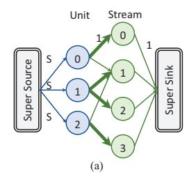
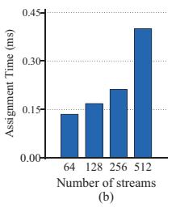

# V. CACHE CONFIGURATION POLICIES

As mentioned before, the software runtime on the host processor periodically (e.g., every 50 million cycles [6], called an *epoch*) generates the cache configuration, i.e., the stream remap table including RShares, RRowBase, and RGroups. Such a configuration essentially determines how to partition and allocate the DRAM cache space of all NDP units to the streams to achieve the highest overall efficiency. This section describes the configuration policies. First, we use hardware samplers to obtain the miss curve statistics of the data streams to guide our cache configuration (Section V-A), and develop an algorithm to assign the limited samplers to cover the many data streams in the workload (Section V-B). With the miss curve of each stream, we propose an effective approach to derive the optimized cache configuration (Section V-C), in which each stream can use its own best replication scheme, and the sizing and placement are co-optimized in one loop to avoid the inefficiencies in previous NUCA designs [6], [7], [56]. Finally, we discuss an optimization leveraging consistent hashing, to reduce data movements and cache misses during cache reconfiguration (Section V-D).

## *A. Set-Based Miss Curve Samplers*

State-of-the-art NUCA partitioning policies [6], [7], [56] heavily rely on the miss curves (the miss rates at different cache capacities) of the workload to assign cache space to the data that can benefit the most from the extra space. Conventional LLCs usually have high associativities and thus can easily adopt way partitioning. However, as in Section IV, NDPExt uses DRAM caches with low associativities or even as direct-mapped, hence it can only be partitioned along sets. This poses challenges for miss curve profiling, as set partitioning does not have the stack property (if an access hits at a capacity *C*, it must also hit at capacities larger than *C*). As a result, previous utility monitor designs [63], where a single size-*C* monitor can capture the miss curve at all capacities from 1 to *C*, cannot be used anymore.

Nevertheless, because NDPExt uses hash functions to determine the set, we can assume all sets see relatively uniform accesses. We can thus sample a small number (i.e., *k* = 32) of sets to infer the overall miss behaviors of all sets. Specifically, for a stream that uses a total of *K* sets across multiple NDP units, if we sample *k* sets in one unit, we can scale the miss statistics by *K*/*k* for the total misses of this stream [6], [63].

Accordingly, we design our set-based hardware miss curve sampler as follows. Each sampler is used to derive the miss curve for one stream, by simultaneously capturing *c* = 64 different capacity cases, ranging from 32 kB to 256 MB (the full DRAM space per NDP unit). We geometrically partition [7] this range with a per-step multiplicative factor of 1.16 = 63-256MB/32 kB. The complete curve can be interpolated as in [6]. Each capacity case needs *k* = 32 sets. We use simple static interleaving [63] to select the *k* sample sets among the total capacity in each case, and count the hits/misses to these sample sets. Without storing data, each set occupies 4 bytes for the address. In total, a sampler requires 32×64×4B = 8 kB





Fig. 4. (a) Modeling sampler assignment as a max-flow problem. The bold edges indicate the streams are selected by those units. (b) Host processor execution time to assign different numbers of streams.

storage. We put four samplers per unit, which are 32 kB, easily implemented with on-chip SRAM. Our sampler configuration is similar to prior work [6], [71] and could result in sufficient accuracy, which we further evaluate in Section VII-C.

## B. Assigning Samplers to Streams

As described in Section V-A, each NDP unit has four miss curve samplers that each can monitor one stream. A constraint is that each sampler can only monitor a stream that is accessed by the local NDP unit. But each stream may be accessed by multiple units, so any sampler in these units can be used. Therefore, we need to collaboratively assign the samplers in different NDP units to the data streams in the workload, aiming to cover as many streams as possible.

First of all, we add a 512-length bitvector in each NDP unit, indicating which streams are accessed in this unit during this epoch. At the end of each epoch, the bitvectors of all units are sent to the host processor, as the input to determine the sampler assignment for the next epoch.

We then formalize the sampler assignment problem as a max-flow problem, which can be solved by the runtime software on the host processor, e.g., with the efficient Edmonds-Karp algorithm [19]. Specifically, as in Fig. 4(a), we construct a directed bipartite graph with NDP units and streams as the nodes. A unit-weight edge is added between an NDP unit and a stream if this unit has accessed this stream. We then connect the "super source" node to each unit, with an edge of weight S = 4, which is the number of samplers per unit, and thus the number of streams to be sampled on this unit. The "super sink" node is connected to all streams, with a unit-weight edge from each stream node. The max-flow algorithm identifies the maximum flow from the super source node to the super sink node while respecting to the capacity (weight) of each edge. The result would indicate that each stream node receives a unit flow from one of the unit nodes, and each unit node at most sends out S units of flow. This corresponds to the sampler assignment constraints. For example as shown by the bold edges in Fig. 4(a), if unit 0 samples stream 0, unit 1 samples streams 1 and 2, and unit 2 samples stream 3, all the edge capacity restrictions are satisfied while the total flow is maximized, because each stream node can flow to the super sink node, indicating every stream is sampled. This algorithm runs fast on the host processor, in less than half a millisecond to assign 512 streams as in Fig. 4(b).

When there are too many streams, it is possible that a fully covered solution cannot be obtained, meaning that some streams are not captured by any sampler. In these rare cases, we first sample a subset of the streams and buffer their results in the host processor, and in the next epoch sample the rest of the streams, until covering all streams. However, in our evaluated workloads we never encounter such a case.

## C. Configuration Algorithm

With the miss curve information of all the streams sent to the host processor at the end of an epoch, the runtime will start its reconfiguration process to find the best scheme to allocate the DRAM cache space to the streams. Traditionally in NUCA, the sizing problem (i.e., how much capacity to allocate to each stream) and the placement problem (i.e., from which banks to obtain the allocated capacity) are solved separately [6], [7], [56]. Specifically, to determine sizing, the lookahead algorithm and its variants [6], [63] first identify the steepest slope at the current positions on all the miss curves, which implies the maximum utility margin. Then it allocates extra cache space to this data stream. However, in NDP systems, we know that the interconnect is a key bottleneck (Section III-B), calling for much more careful placement decisions. Furthermore, existing NUCA solutions have only limited support for data replication, requiring all data to apply the same replication degree.

To overcome these issues, we propose our configuration algorithm, with two key advantages. First, it determines the size of each stream cache and the corresponding placement across NDP units *simultaneously in an iterative manner*, so the interconnect overheads are thoroughly considered in the process. Second, it enables more flexible data replication, where each stream can use different replication schemes, corresponding to the replication groups (RGroups) in Section IV.

Algorithm 1 illustrates the algorithm details. The allocCap array stores the cache capacity allocated on each NDP unit to each stream. It is initialized to all zeros. At each iteration, the algorithm first finds the next steepest slope among the miss curves, and allocates cache space to this stream (Line 4), similar to the conventional lookahead algorithm [6], [63]. The space is allocated to all the units that have accessed this stream (i.e., accUnits[sid], identified by the bitvector in Section V-B), assuming that each unit forms its own replication group at the beginning (Lines 6 to 8). When the available NDP memory is sufficient, this approach ensures maximum data replication and minimizes access distances.

As the allocation goes on, at some point we may fail to allocate the desired space on a unit. In this case, we consider either extending the current replication group to use space from nearby units, or merging two existing groups to reallocate space for the current unit. Note that these changes to the replication groups are for a specific stream, so different streams could evolve into different replication schemes. In a nutshell, each stream is initially replicated locally in each unit with the maximum replication degree. Later when local space is used up, we gradually use nearby unit space or reduce the replication degree to free up more space.

#### **Algorithm 1:** Cache configuration.

```
input: number of streams S, number of NDP units N, stream miss
          curves missCurves[S], lists of units that have accessed each
          stream accUnits[S][].
   output: allocated capacity on each unit to each stream
           allocCap[N][S].
1 allocCap ← all 0;
2 do
       found ← False:
       sid, seqSize ← NextSteepestSlopeSeg(missCurves);
4
5
       for uid in accUnits[sid] do
            if HasAvailSpace(segSize) then
                allocCap[uid][sid]+ = segSize;
8
            extendUnit \leftarrow \texttt{NearestAvailableUnit(uid)} \ ;
            if extendUnit then
11
                extendGroup ← (curRepGroup, extendUnit);
                extendUtil ← CalcUtil(extendGroup);
12
                found ← True:
13
14
            groupA ← FindMergeGroup(uid) ;
            groupB \leftarrow \texttt{NearestGroup}(groupA) \ ;
15
            if groupA and groupB then
16
17
                mergeGroup \leftarrow (groupA,\,groupB) \; ;
                mergeUtil \leftarrow CalcUtil(mergeGroup);
18
                found \leftarrow True;
19
            if found then
20
                allocCap ← AdjustAlloc(allocCap, extendUtil,
                  extendGroup, mergeUtil, mergeGroup);
22 while found;
```

To extend the current group (Lines 9 to 13), we start by searching for nearby units with sufficient space to accommodate the allocation. We use CalcUtil to select the grouping case with the highest utility. We apply an attenuation factor to the nearby unit to reflect the extra remote access cost when calculating the gained utility of this allocation. The attenuation factor is defined as the DRAM access latency divided by the sum of the DRAM latency and the interconnect latency, so farther units have smaller factors, decreasing their utility values. The utility of the extended group is the sum of the utilities of the units in it, weighted by their allocated space. For example, an existing replication group may contain 60 and 40 elements in units A and B, respectively. Its utility is thus  $60 + 40 \times k_{AB} = 96$  for A and  $40 + 60 \times k_{BA} = 94$  for B, in total 190. We assume all attenuation factors k are 0.9 here. To extend the next 20-element space to a nearby unit C, we calculate the utility of A as  $60 + 40 \times k_{AB} + 20 \times k_{AC} = 114$ . Similarly the utility of B is 112. The utility of the extended group is thus 226. Note that unit C does not access this stream so its utility contribution is 0.

To merge existing groups (Lines 14 to 19), we first find the group that contains the current unit, and has the lowest group utility (groupA). The low utility ensures that squeezing its space does not significantly affect performance. Then we try to merge this group with the nearest group of the same stream (groupB), to form a larger group. After merging, the algorithm frees up some elements of the stream in the current unit, and replaces them with those same ones in the units of the other merged group, which are remote. It then recalculates the

group utility, where the attenuation factor is applied because some elements are now cached remotely.

Following the previous example, instead of extending to unit C, we merge the replication group (A, B) with another qualified replication group containing unit D with the same 100 elements. After merging, only one copy of the 100 elements are distributed to the three units in the new group, e.g., 30, 30, 40 for A, B, D, respectively. Hence the total utility for this stream decreases from 290 (190 for group A and B, plus 100 for D) to 280 (93 + 93 + 94 for A, B, D), but some space has been freed up. Note that the stream selected to be merged may not necessarily be the same as the stream currently under allocation. As long as a replication group could free up some space from merging, the allocation can continue.

Finally, the algorithm compares the gained utilities of group extending and group merging, and selects the better one (Line 21). By employing this iterative algorithm, NDPExt is able to simultaneously allocate and place cache space for each stream, with similar cost as in [6].

Similar to prior conventional NUCA placement schemes [7], our configuration process cannot always guarantee the global optimal placement. But it still works well in practice. For example, while sampling is based on previous epochs, using history to predict future is a widely used technique in computer architecture [33], [63]. Similarly, while our placement strategies are greedy, previous work has empirically demonstrated lookahead algorithms [63] work well. We leave complicated policies for future work. Furthermore, our configuration algorithm is able to result in proper degrees of replication for read-only streams to balance between high cache hit rates (less replication) and low remote access latencies (more replication). We find that for applications with most readonly streams, a modest amount of cache space is used by replicated data, e.g., up to 33% and 27% for mv and gnn, respectively. For backprop that contains two phases, the readintensive layerforward kernel uses 91% cache space for replication, while no replication occurs in the adjustweights kernel which needs to write data.

