# PIM-MMU: A Memory Management Unit for Accelerating Data Transfers in Commercial PIM Systems

Dongjae Lee Bongjoon Hyun Taehun Kim Minsoo Rhu

School of Electrical Engineering KAIST

{dongjae.lee, bongjoon.hyun, taehun.kim, mrhu}@kaist.ac.kr

*Abstract*—Processing-in-memory (PIM) has emerged as a promising solution for accelerating memory-intensive workloads as they provide high memory bandwidth to the processing units. This approach has drawn attention not only from the academic community but also from the industry, leading to the development of real-world commercial PIM devices. In this work, we first conduct an in-depth characterization on UPMEM's generalpurpose PIM system and analyze the bottlenecks caused by the data transfers across the DRAM and PIM address space. Our characterization study reveals several critical challenges associated with DRAM↔PIM data transfers in memory bus integrated PIM systems, for instance, its high CPU core utilization, high power consumption, and low read/write throughput for both DRAM and PIM. Driven by our key findings, we introduce the PIM-MMU architecture which is a hardware/software codesign that enables energy-efficient DRAM↔PIM transfers for PIM systems. PIM-MMU synergistically combines a hardwarebased data copy engine, a PIM-optimized memory scheduler, and a heterogeneity-aware memory mapping function, the utilization of which is supported by our PIM-MMU software stack, significantly improving the efficiency of DRAM↔PIM data transfers. Experimental results show that PIM-MMU improves the DRAM↔PIM data transfer throughput by an average 4.1× and enhances its energy-efficiency by 4.1×, leading to a 2.2× end-to-end speedup for real-world PIM workloads.

*Index Terms*—Processing-in-memory; near-memory processing; parallel architecture

## I. INTRODUCTION

Modern data-intensive workloads (e.g., AI inference tasks for large language models [10], [17], [40], [47], [48], [92], [97], [114], recommendation systems [63], [72], [73], [86], and graph processing [2], [19], [35], [113], [117]) are memorybound as they pose unprecedented demand for large data. Despite the increasing demand for high memory bandwidth, integrating a larger number of DRAM I/O pins at the processor die is challenging because of form factor constraints and issues related to signal integrity [67].

To address such limitation, processing-in-memory (PIM) architectures gained interest by integrating compute logic close to DRAM. Because of its potential to alleviate the memory bandwidth bottleneck modern processors face, PIM has been extensively explored in both academia [2], [3], [8], [9], [15], [23], [24], [28], [29], [34], [45], [49], [50], [66], [78], [90], [91], [93], [103], [104], [110] and industry with several realworld PIM integrated systems introduced to the market [22], [70], [77], [95]. These PIM designs can be classified into two categories: (1) PIM integrated at the I/O bus (e.g., Samsung CXL-PNM [95] and SK Hynix AiMX [70]), and (2) PIM integrated at the host processor's memory bus (e.g. UPMEM-PIM integrated with the CPU [22]). In this work, we focus on the system-level challenges associated with memory bus integrated PIM architectures employing a *bank-level* PIM core design (i.e., each memory bank contains a single PIM core) as they represent a state-of-the-art, commercially available PIM architecture, i.e., UPMEM-PIM [22].

An important property memory bus integrated PIM commonly exhibits is its need to separate the address space of DRAM vs. PIM (Section II-B). Without such clear separation, the host processor (whether it be CPU [22] or GPU [77]) and PIM cores can simultaneously access the same memory bank within the PIM device, leading to a structural hazard at shared resources (e.g., I/O bus within the PIM device). Properly arbitrating host and PIM core's simultaneous memory accesses requires the host processor's memory controller to be heavily modified, making it challenging to support such feature while still abiding by the strict latency constraints defined within DRAM protocols (e.g., DDR4). Consequently, commercial PIM systems integrated at the memory bus circumvent this challenge by employing *separate* physical address spaces for DRAM and PIM, allowing only a single entity (either the host processor or the PIM core) to access the PIM address space at any given time. As such, current PIM programming model requires programmers to first allocate input data in the DRAM address space and then "explicitly" copy that data to the PIM address space when the PIM core is idle.

In this work, we first uncover fundamental challenges associated with data transfers across DRAM and PIM by characterizing UPMEM's commercial PIM integrated system. The data transfer operations in UPMEM-PIM employ several optimization strategies including (1) the usage of AVX-512 vector load/store instructions [54] to migrate data across DRAM↔PIM, (2) which are heavily multi-threaded to maximize data transfer throughput over the off-chip memory channels. Unfortunately, despite the heavy use of CPU cores and high power consumption to explicitly orchestrate such data movements, we observe that the achieved data transfer throughput is far from optimal e.g., only 11.6% memory bandwidth utilization for DRAM reads and 15.5% for PIM writes during DRAM→PIM data copy operations, causing non-negligible performance overhead to the end-to-end program execution time. Through our detailed characterization and analysis, we identify the following two factors as the primary causes of suboptimal read (write) throughput from (to) *both* PIM and DRAM:

- Low PIM read/write throughput due to softwarebased, coarse-grained memory scheduling. In conventional memory systems, the memory mapping function that translates a physical address to a DRAM address partitions the data and distributes them across the DRAM subsystem in fine granularity to maximize memory-level parallelism (MLP) using channel/bank-group/bank-level parallelism. Such fine-grained "hardware-based" memory mapping architecture (and the associated memory scheduling algorithm) is completely transparent to the software layer and helps improve memory bandwidth utilization. However, data transfers targeting the PIM address space cannot fully harness MLP because the data being transferred in and out of the PIM address space must be *localized* to a specific memory bank (due to the bank-level PIM architecture design [22], [70], [77]), rather than fine-grained interleaving them across the DRAM subsystem for maximum MLP. Although the PIM runtime library attempts to better utilize MLP by employing software multi-threading (e.g., each thread handles data transfers targeting different banks within a given memory channel), we observe that such softwarebased coarse-grained memory scheduling falls short compared to conventional memory system's hardware-based fine-grained memory scheduling, leaving significant performance left on the table.
- Low DRAM read/write throughput due to localitycentric (and not MLP-centric) memory mapping. As mentioned above, memory bus integrated PIM systems separate the physical address space of DRAM and PIM to obviate the need to modify the host processor's memory controller, granting only a single entity (either the host processor or a PIM core) to access PIM memory. This separation of DRAM vs. PIM address space is implemented with a system BIOS update which employs a memory mapping function that logically divides up the overall physical address space into two mutually exclusive regions, one for DRAM and the other for PIM. We observe that such modification in memory mapping throttles the MLP that normal DRAM read/write operations can reap out because it "homogeneously" enforces a single, *locality-centric* memory mapping function to both DRAM and PIM physical addresses. Such design nullifies all the sophisticated MLP-enhancing features of conven-

tional memory mapping functions (e.g., XOR hashing), leading to aggravated DRAM read/write throughput.

To this end, we propose a Memory Management Unit for PIM (PIM-MMU) which is designed to fundamentally address the challenges associated with DRAM↔PIM data transfers in memory bus integrated PIM system, synergistically combining the following three key components:

- Data Copy Engine. In our proposed system, PIM programmers are provided with a software interface that completely *offloads* DRAM↔PIM data transfers to a Data Copy Engine (DCE). DCE not only handles the data copy operations but also the data preprocessing operations (e.g., data transpose), accelerating the end-to-end DRAM↔PIM data transfers without CPU intervention.
- PIM-aware Memory Scheduler. To overcome the limitations of PIM's software-based coarse-grained memory scheduling, we propose a hardware-based, PIM-aware Memory Scheduler (PIM-MS) which is integrated inside our DCE. PIM-MS enhances PIM read/write throughput by leveraging the unique properties of DRAM↔PIM data transfers where coarse-grained data copy operations targeting different PIM cores (designated by PIM programmers at the software level) can be reordered without affecting program correctness. PIM-MS utilizes such property to enable fine-grained memory scheduling at the hardware level, drastically improving MLP and thus the PIM read/write throughput.
- Heterogeneous Memory Mapping Unit. We also introduce a unique hardware-based memory mapping architecture named Heterogeneous Memory Mapping Unit (HetMap) that enables PIM-MMU to separate the address space of DRAM and PIM while also enabling high DRAM read/write throughput. HetMap maintains a dual set of memory mapping functions: (1) an *MLP-centric* mapping function for memory transactions targeting the normal DRAM address space, and (2) a *locality-centric* mapping function that is designed to honor the per-bank PIM address spaces by localizing the mapped regions within each PIM core's memory bank.

Putting everything together, PIM-MMU improves the DRAM↔PIM data transfer throughput by an average 4.1× (max 6.9×) and enhances its energy-efficiency by 4.1× (max 6.9×), resulting in a 2.2× end-to-end speedup (max 4.0×) for real-world PIM workloads.

## II. BACKGROUND

## *A. Memory Mapping Architecture*

The memory mapping function within the memory controller is designed to map the physical address space to the DRAM subsystem (i.e., channels, ranks, banks, and rows) while maximizing MLP. To enhance channel-level parallelism, for instance, the memory mapping function maps memory channels using bits within the physical address that change frequently. In general, bits closer to the least significant bit

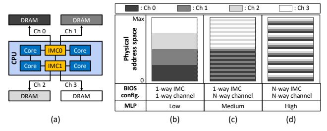

**Fig. 1:** (a) Intel Xeon CPU server's memory system topology. (b)-(d) show the BIOS configuration related to different memory mapping functions and how they translate into exploiting MLP. While the BIOS configuration also supports N-way NUMA/rank/bank-level interleaving, we omit discussing them for brevity.

(LSB) are likely to change more often, so the memory mapping function tries to utilize these bits to distribute memory requests evenly across the memory channels [82]. However, the frequency in which bits within the address closer to the LSB change can vary depending on the program's memory access pattern. To better accommodate such variability, advanced memory mapping functions utilize XOR hashing [115]. Specifically, XOR hashing takes multiple physical address bits, from the LSB to the most significant bit (MSB), to compute the channel address which enables the DRAM subsystem to better adapt to diverse memory access patterns.

In modern high-end server class x86 CPUs (or GPUs), the memory mapping function can be customized by adjusting the BIOS configuration (or vBIOS in the context of GPUs [99]). In Intel Xeon CPUs, for instance, the BIOS configuration provides a knob to enable (aka N-way) or disable (aka 1-way) address interleaving across different hierarchical levels of the DRAM subsystem (Figure 1). Turning on N-way interleaving that targets a specific DRAM subsystem (e.g., Integrated Memory Controller (IMC) level interleaving, channel level interleaving, ...) thus enables the memory mapping function to exploit MLP at that particular DRAM subsystem. As shown in Figure 1(b), configuring the memory mapping function as 1-way interleaving for both IMC level and channel level positions their corresponding address bits closer to the MSB, making it challenging to fully exploit MLP. Conversely, in the configuration shown in Figure 1(c), adjusting channel level interleaving to N-way moves the channel bits closer to the LSB, which helps better exploit MLP. However, maintaining the IMC level interleaving at 1-way results in the IMC bits to be placed near the MSB, rendering the lower physical address space to be mapped only at channels 0 and 1, connected to IMC0 (and the higher physical address space to be mapped at channel 2 and 3, connected to IMC1). To fully exploit MLP, the BIOS must be configured as N-way interleaving across all DRAM subsystems which positions both the IMC and channel bits closer to the LSB (Figure 1(d)).

## B. PIM Integrated System and Its Address Space Management

Real-world industrial PIM devices such as HBM-PIM [77] and UPMEM-PIM [22] employ a *bank-level* PIM architecture (one or two memory banks contain a single PIM core) which

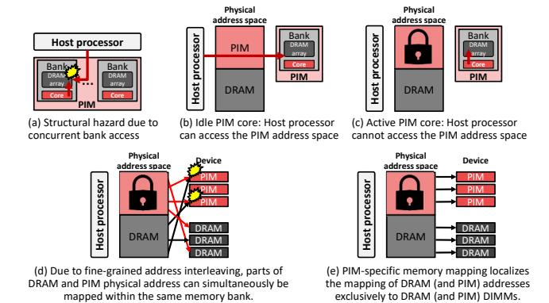

**Fig. 2:** Example showing how current PIM systems manage its DRAM and PIM physical address space.

are integrated at the host processor's memory bus alongside conventional DRAM. Below we discuss the unique address space management employed in memory bus integrated PIM.

Current PIM systems employ a PIM-specific BIOS update to maintain separate physical address spaces for PIM and DRAM [77], [106]. This design decision is due to the limitations coming from existing DRAM-specific protocols (e.g., DDR4 [98]), which dictate a deterministic latency behavior. To better explain the intricacy of our problem in hand, consider the example in Figure 2(a) where both the host processor and the PIM core tries to access the same memory bank within the PIM device simultaneously. Such situation complicates the task for the baseline host-side memory controller in managing this structural hazard, unless it is heavily modified to properly handle this conflicting scenarios. For instance, the memory controller would have to arbitrate memory accesses between the host processor and PIM core, which can lead to violation of the DRAM-specific protocols as their access latency changes (i.e., arbitration cannot guarantee deterministic latency). Consequently, PIM manufacturers have designed their systems to prevent this situation from happening by employing the following two techniques. First, only a single entity, either the host processor (Figure 2(b)) or the PIM core (Figure 2(c)), can access the PIM address space at any given time. This design decision obviates the need to modify the host processor's memory controller, easing PIM's integration in conventional systems. Second, fine-grained address interleaving employed in conventional memory mapping (Figure 1(d)) is disabled so that it prevents segments of both the DRAM and PIM physical addresses from being mapped to the same memory bank. As depicted in Figure 2(d), having parts of the DRAM and PIM physical address both be mapped at a common memory bank causes the resource conflicting scenario discussed in Figure 2(a). As such, the PIM-specific memory mapping in current PIM systems make sure that the physical DRAM (and PIM) addresses are mapped *locally* within a DRAM (and PIM) DIMM (Figure 2(e)). A tradeoff made with this design is that the PIM programmer must explicitly copy data across the DRAM address space and the PIM address space, whenever a data is offloaded from DRAM to PIM, and vice versa.

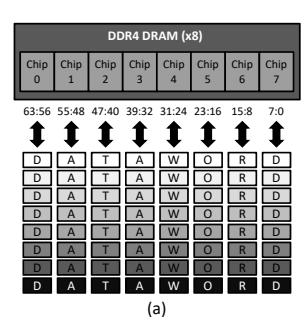

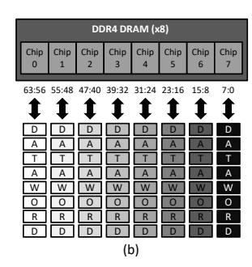

**Fig. 3:** Bytes that constitute a given data word ('D', 'A', 'T', 'A', 'W', 'O', 'R', 'D') is colored identically. (a) Chip interleaving in a conventional DIMM-based memory system and (b) why UPMEM-PIM requires a transpose operation to be applied to the copied data beforehand to localize them within a single chip.

#### C. UPMEM-PIM Hardware/Software Architecture

Hardware architecture. UPMEM-PIM is based on a DDR4-2400 DIMM form factor, equipped with eight UPMEM-PIM chips per rank. Each UPMEM-PIM chip contains eight PIM cores (called DPUs by UPMEM), one PIM core per each DRAM bank. A single host CPU can support up to 1,280 PIM cores and a single PIM core is capable of achieving a peak memory bandwidth of 1 GB/s, allowing the aggregate memory bandwidth to exceed 1 TB/sec.

Programming model. Similar to CUDA [89], UPMEM-PIM adopts the co-processor computing model, where the CPU offloads a memory-intensive task to PIM. To offload a task to UPMEM-PIM, programmers are required to write two distinct segments of code: the PIM-side code and the host-side code. In the PIM-side code, the programmer describes the task to be offloaded to PIM which follows the single-program multiple-data (SPMD) model, i.e., a single program gets executed by multiple PIM cores. Within the host-side code, the programmer designates the total number of PIM cores to utilize, which input data to transfer over to the PIM address space (DRAM→PIM), and which output results derived by the PIM cores to transfer back into the DRAM address space (PIM→DRAM), all of which is programmed using APIs provided in UPMEM-PIM's software stack.

Runtime library for data transfers. The UPMEM-PIM runtime library offers a layer of abstraction that hides low-level details of the PIM hardware from the programmer, one notable example being the need for preprocessing data before they are transferred over to PIM. The need for data preprocessing arises due to the way chip interleaving is employed within the DIMM. Each data word (8 bytes) is partitioned in a 1-byte granularity and distributed across multiple UPMEM-PIM chips (8 UPMEM-PIM chips in a ×8 configuration), an example we illustrate in Figure 3(a). Such data interleaving across UPMEM-PIM chips presents a significant challenge for PIM computation because each (bank-level) PIM core only receives a fraction of a data word. To address this issue, the UPMEM-PIM runtime library transposes the data into an  $(8\times8)$  byte matrix and copies the transposed matrix across the 8 UPMEM-PIM chips, allowing each PIM core to receive the full 8-byte

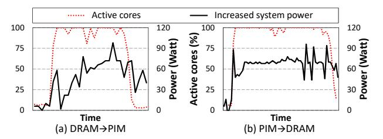

**Fig. 4:** The fraction of active CPU cores (left axis) and system power consumption (right axis) during (a) DRAM→PIM and (b) PIM→DRAM data transfer. System power consumption is measured using Intel's Performance Counter Monitor (PCM) [55].

data word within its own memory bank (Figure 3(b)).

When it comes to the actual DRAM↔PIM data transfer implementation (using dpu\_push\_xfer [106]), the runtime library employs several software optimizations to enhance the DRAM↔PIM data transfer throughput. These include (1) the usage of AVX-512 *vector* load/store instructions to transfer data in large chunks, and (2) using *multi-threaded* implementations to initiate a large number of parallel data transfers concurrently as means to maximize data transfer throughput. Unfortunately, despite these efforts to optimize performance, our characterization reveals that the observed performance is far from ideal, which we root-cause in Section III-A.

#### III. MOTIVATION AND SYSTEM CHARACTERIZATION

#### A. Motivation

This paper explores the system-level challenges associated with memory bus integrated PIM systems employing a *bank-level* PIM architecture as they represent a state-of-the-art, commercially available PIM system, i.e., UPMEM-PIM [22]. In particular, we focus on UPMEM's general purpose PIM system due to their immediate market availability but more importantly their open-source software ecosystem driven by both industry [106], [107] and academia [13], [32], [33], [36]–[38], [42]–[44], [51], [57], [58], [81], [88].

This section conducts a characterization on UPMEM-PIM to root-cause the underlying challenges of its DRAM $\leftrightarrow$ PIM data transfers (Section V details our evaluation methodology). Memory bus integrated PIM systems employ separate physical addresses for DRAM and PIM, necessitating explicit DRAM $\leftrightarrow$ PIM data transfers (Section II-B). As we quantify in Section VI, the latency to transfer data across these two regions incur significant performance overhead, accounting to as much as 99.7% (average 63.7%) of end-to-end execution time of our evaluated PIM workloads [43]. Such observation is inline with prior work [1], [42]–[44], [51], underscoring the importance of optimizing this critical system-level bottleneck. Next we root-cause the reason behind the sub-optimal performance of DRAM $\leftrightarrow$ PIM data transfers.

### B. System Characterization and Key Challenges

(Challenge #1) High CPU core utilization and power consumption. The DRAM→PIM data transfer involves three main stages: (1) reading from DRAM, (2) preprocessing, (3) and writing to PIM, with the reverse sequence applied for

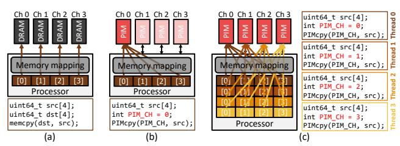

Fig. 5: (a) MLP-optimized, hardware-based data transfer that maximally utilizes memory bandwidth. (b) Software-based data transfer using a *single* PIM thread which transfers data to its designated memory bank, leading to underutilization of memory bandwidth. Such limitation is better addressed in (c) which utilizes *multiple* concurrent PIM threads that target different channels/banks for data transfers, achieving higher memory throughput. In the pseudo-code in (b-c), the role of PIMcpy is conceptually identical to UPMEM-PIM's dpu\_push\_xfer or CUDA's cudaMemcpy APIs.

PIM→DRAM transfers. Our first key observation is that, because the CPU is in charge of orchestrating the entire process of data transfers, it significantly taxes the host processor, leading to high power overheads. Figure 4 illustrates the effect of DRAM↔PIM data transfers on CPU core utilization and system power consumption. As discussed in Section II-C, the data transfer operation in the UPMEM-PIM runtime library is implemented using AVX-512 vector load/store instructions, which are known to be power hungry [39], [105]. Consequently, data transfers across DRAM vs. PIM addresses push CPU core utilization to near maximum levels and reach close to 70 Watts of system power consumption.

Despite such high power overheads, DRAM↔PIM data transfers exhibit limited efficiency from a throughput perspective, significantly underutilizing available memory bandwidth. Below we root-cause the reason behind *why* contemporary PIM system achieves such low data transfer throughput.

(Challenge #2) Sub-optimal PIM read/write throughput. Conventional DRAM systems are provisioned with MLP-enhancing microarchitectural support. For instance, the memory mapping function, which translates physical addresses to DRAM addresses, partitions/distributes the data across the DRAM subsystem in fine granularity to maximize MLP. Such "hardware-based" memory mapping is entirely transparent to the software layer and helps evenly distribute the memory read/write traffic across the memory channels (Figure 5(a)).

In contrast, UPMEM-PIM is unable to fully reap out the MLP enhancing opportunities inherent within such hardware-based memory mapping architectures due to its bank-level PIM design. One key characteristic of bank-level PIM systems is their need for input data to be made locally available within the target PIM core's memory bank (Figure 3(b)), before the PIM kernel is executed. Consequently, PIM programmers must explicitly designate which input data should be transferred over to which PIM core's memory bank using software APIs that enable DRAM $\leftrightarrow$ PIM data transfers (e.g., dpu\_push\_xfer in UPMEM-PIM). Unfortunately, because the transferred data is targeted for a specific memory bank, it becomes challenging to fully leverage channel/bank-group/bank-level parallelism in transferring such data, leading to underutilization of PIM

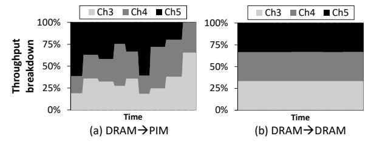

Fig. 6: Breakdown of data write throughput during (a) a software-based, coarse-grained DRAM→PIM data transfer and (b) a hardware-based, fine-grained DRAM→DRAM data transfer (i.e., memcpy). Examples assume that channels 0, 1, 2 are (read) source channels and channels 3, 4, 5 are (write) destination channels. We measure the per-channel write throughput using Intel VTune [56] by executing microbenchmarks over real UPMEM-PIM systems. Section V details the microbenchmarks and our evaluated system configuration. Note that in (a) DRAM→PIM data transfer, we manually assigned DRAM to channels 0-2 (read requests) and PIM to channels 3-5 (write requests) by adjusting the BIOS configuration.

read/write throughput (Figure 5(b)).

Given the limitation of bank-level PIM architectures in leveraging MLP, UPMEM-PIM exploits thread-level parallelism (TLP) to maximally utilize available memory bandwidth. As depicted in Figure 5(c), the UPMEM-PIM runtime library launches *multiple* software threads for DRAM↔PIM data transfers by having each thread to perform read/write operations targeting different levels in the PIM hierarchy (e.g., thread ID=0 targets PIM channel 0/bank 0 while thread ID=1 targets PIM channel 1/bank 0, ...), the goal of which is to maximize data transfer throughput and MLP. While utilizing TLP does help improve PIM read/write throughput, our key observation is that such software-based multi-threaded approach falls short in fully leveraging MLP for enhanced performance. This is because the effectiveness of the multithreaded PIM data transfers is contingent upon how the Operating System (OS) schedules these threads, which may not necessarily be aligned with the optimal distribution of data accesses across the PIM hierarchy. In general, the OS thread scheduling policy prioritize fairness [94] which may not necessarily lead to threads being scheduled in a manner that balances its memory accesses across the memory subsystem. This is natural as the OS is (and should be) unaware of the existence of PIM. For instance, if the OS thread scheduler prioritizes the execution of three PIM threads transferring data in channel A and one thread in channel B during a time interval of T, channel A will experience a higher concentration of data accesses. To maintain system-wide fairness, the scheduler may adjust the scheduling priority during the next time interval of T to allow more threads to execute in channel B. While such scheduling policy better guarantees fairness, it can lead to inefficient utilization of memory bandwidth because certain memory channels are preferentially accessed for longer periods of time, i.e., time interval T is in the order of several ms. In Figure 6(a), we illustrate the implication of such coarse-grained, software-based DRAM-PIM data transfer. As shown, such software-based approach is not able to fully utilize MLP due to traffic congestion happening

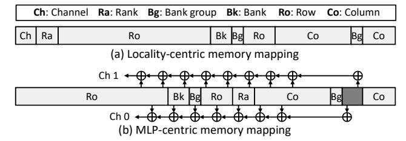

**Fig. 7:** (a) The locality-centric memory mapping employed in UPMEM-PIM and (b) the MLP-centric memory mapping utilized in conventional systems without PIM, i.e., memory mapping (a) and (b) corresponds to those shown in Figure 1(b) and Figure 1(d), respectively. We referred to [52], [65], [96] for the MLP-centric memory mapping of our baseline system without PIM.

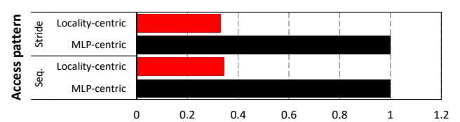

**Fig. 8:** Normalized DRAM bandwidth utilization (x-axis) with a locality-centric mapping (red) and MLP-centric memory mapping (black) over sequential and strided memory access patterns.

at certain PIM channels, unlike the conventional hardware-based data transfers (Figure 6(b)), which evenly distributes data traffic across all memory channels, leading to higher memory bandwidth utilization. Overall, data transfers targeting PIM exhibits sub-optimal memory bandwidth utilization, only achieving around 15.5% of its theoretical peak value, e.g., averaging at 8.9 GB/sec vs. the maximum value of 57.6 GB/sec during DRAM $\rightarrow$ PIM data transfer.

(Challenge #3) Sub-optimal DRAM read/write through**put.** Section II-B discussed the need for separating the physical addresses of DRAM vs. PIM using alternative memory mapping functions via BIOS updates (Figure 2(e)). An unfortunate side-effect of such memory mapping is that it introduces a decrease in DRAM read/write throughput. We observe that the adjustment in memory mapping used for PIM integrated systems removes MLP-optimized XOR hashing techniques [115] employed in conventional memory mapping functions. Specifically, the adjusted memory mapping function (Figure 7(a)) places the channel bits closer to the MSB to localize the mapping of PIM physical addresses to PIM DIMMs (and DRAM physical addresses to DRAM DIMMs), unlike the standard practice of positioning them closer to the LSB while also employing XOR hashing to enhance MLP (Figure 7(b)). Because only a *single* memory mapping function can be employed "homogeneously" within the overall memory system, both PIM and DRAM DIMMs integrated at the memory bus are enforced with such locality-centric memory mapping (Figure 7(a)), limiting the level of parallelism normal DRAM physical addresses can reap out<sup>1</sup>. In Figure 8, we

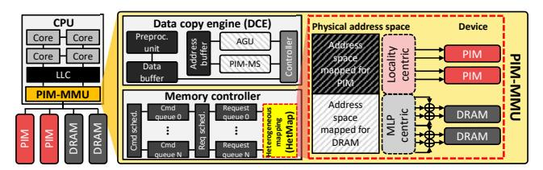

Fig. 9: PIM-MMU architecture overview.

compare the read/write throughput targeting normal DRAM physical addresses using locality-centric memory mapping (red) vs. MLP-centric memory mapping (black). As depicted, the DRAM read/write throughput under the locality-centric mapping is only 30% of what is achievable with conventional MLP-centric mapping, regardless of the memory access pattern. This substantial throughput difference highlights the inability of PIM integrated system in fully exploiting MLP.

#### IV. PIM-MMU ARCHITECTURE

#### A. High-Level Overview

Through our characterization in Section III, we root-caused the low performance and high resource usage of DRAM↔PIM data transfers. We propose a Memory Management Unit for PIM (PIM-MMU), a hardware/software co-design that enables energy-efficient DRAM↔PIM transfers for memory bus integrated PIM systems. Figure 9 provides a high-level overview of PIM-MMU which contains the following three key hardware components: (1) Data Copy Engine (DCE), (2) PIM-aware Memory Scheduler (PIM-MS), and (3) Heterogeneous Memory Mapping Unit (HetMap). User-level applications are able to utilize our PIM-MMU architecture via a dedicated software interface that completely offloads DRAM↔PIM data transfers. In the remainder of this section, we first discuss PIM-MMU's software stack followed by a detailed description of PIM-MMU's hardware architecture.

## B. Software Architecture

In our proposed system, PIM programmers are provided with the software interface to leverage PIM-MMU for accelerating DRAM $\leftrightarrow$ PIM data transfers. Specifically, our software stack contains the following two components, the PIM-MMU runtime library and the PIM-MMU device driver. We use the example in Figure 10 that conducts a DRAM $\rightarrow$ PIM data transfer to describe our software interface.

User-level runtime library. The PIM-MMU runtime library offers a user-level API (pim\_mmu\_transfer) that provides an abstraction to offload data transfers to our hardware DCE. This API utilizes a custom struct data type (pim\_mmu\_op) as an input argument to acquire the necessary information to offload DRAM↔PIM data transfers to the DCE (e.g., data transfer direction (DRAM\_TO\_PIM), data transfer size per bank (XFER\_PER\_BANK), and an array of pointers that designate where the source data (src\_arr) as well as destination data (dest\_pim\_id\_arr and DPU\_MRAM\_HEAP\_POINTER\_NAME) are located (line 18−23 in Figure 10(b)). Unlike the baseline UPMEM-PIM

<sup>&</sup>lt;sup>1</sup>It is worth clarifying that enabling MLP-enhancing address interleaving knobs (i.e., N-way interleaving, see Figure 1) only within the DRAM physical address space while disabling them for the PIM physical address space is not supported under the current system BIOS configuration.

```
#define NUM_PIMCORES 512
2
   #define XFER_PER_BANK 131072
   struct dpu_set_t dpu_set, dpu;
6
   int i:
   data = malloc(NUM_PIMCORES * XFER_PER_BANK * sizeof(int));
8
   data = initRandomData();
11 DPU_FOREACH(dpu_set, dpu, i) {
     dpu_prepare_xfer(dpu, data + XFER_PER_BANK * i);
13 }
14
15 dpu_push_xfer(dpu_set, DPU_XFER_TO_DPU,
16 DPU_MRAM_HEAP_POINTER_NAME, XFER_PER_BANK * sizeof(int),
17 DPU_XFER_DEFAULT);
   #define NUM PTMCORES 512
   #define XFER PER BANK 131072
   struct pim_mmu_op ops = { };
5
   int **src arr;
   int *data, dest pim id arr:
8
   data = malloc(NUM_PIMCORES * XFER_PER_BANK * sizeof(int));
   data = initRandomData();
   src_arr = malloc(NUM_PIMCORES * sizeof(int*));
11 dest_pim_id_arr = malloc(NUM_PIMCORES * sizeof(int));
12
13 for (int i = 0: i < NUM PIMCORES: i++) {
     src_arr[i] = data + (XFER_PER_BANK * i);
15
     dest_pim_id_arr[i] = i; // PIM core ID
16 }
18 ops.type = DRAM_to_PIM;
19 ops.size_per_pim = XFER_PER_BANK;
20 ops.dram_addr_arr = src_arr;
21 ops.pim_id_arr = dest_pim_id_arr;
22 ops.pim_base_heap_ptr = DPU_MRAM_HEAP_POINTER_NAME;
23 pim_mmu_transfer(ops);
```

Fig. 10: Example pseudo-code showing how input data (128K elements for each PIM core) is transferred over to UPMEM-PIM using (a) conventional PIM programming APIs provided with UPMEM-PIM, and (b) our proposed PIM-MMU specific APIs. It is worth pointing out that the PIM address (whether it be used as source or destination for data transfers) can be derived precisely using the PIM core ID (dest\_pim\_id\_arr) and the base heap pointer value (DPU\_MRAM\_HEAP\_POINTER\_NAME) [106] (line 21–22 in (b)).

implementation (dpu\_push\_xfer) where *multiple* threads orchestrate DRAM↔PIM data transfers (line 11-15 in Figure 10(a)), a call to pim\_mmu\_transfer invokes a *single* thread that offloads all the necessary information required for DRAM↔PIM data transfers to the DCE.

Device driver. The DCE is registered as an I/O device by mapping its corresponding Base Address Register (BAR) in the memory address space using MMIO (memory-mapped I/O). Existing on-chip components, such as the host processor's memory controller, already employ an MMIO-based approach for software-hardware communication [65], so our DCE can similarly be integrated into current software systems seamlessly. To support MMIO-based communication for the user-level pim\_mmu\_transfer API, the PIM-MMU device driver interacts with the runtime library and manages MMIO access at the kernel-level. Specifically, when the pim\_mmu\_transfer API sends pim\_mmu\_op information to the PIM-MMU device driver, the driver writes this information to the MMIO region mapped to the DCE and finalizes the offloading of DRAM⇔PIM data transfer, putting

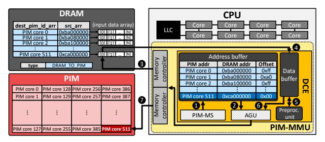

**Fig. 11:** Example illustrating PIM-MMU's overall dataflow in transferring data from DRAM to PIM.

the requesting user process into sleep mode. Upon a successful data transfer completion, the PIM-MMU device driver receives an interrupt signal from the DCE, enabling the host processor to wake up and handle the interrupt appropriately.

#### C. Data Copy Engine (DCE)

The DCE contains the following components: (1) an Address Generation Unit (AGU), (2) PIM-MS, (3) two SRAMbased buffers (data buffer and address buffer), and (4) a preprocessing unit (Figure 9). We use the example in Figure 11 to illustrate PIM-MMU's overall dataflow during a DRAM→PIM data transfer (PIM→DRAM data transfer is orchestrated similarly but we omit its explanation for brevity).

When the CPU launches the pim\_mmu\_transfer kernel for execution, the address buffer is copied with both (1) the physical DRAM addresses (src\_arr) that point to all the source data arrays (input data array in Figure 11) and (2) the physical PIM addresses that point to all the destination locations within PIM (dest\_pim\_id\_arr) to which the source data will be written into. Each entry in the address buffer stores the following information: (1) the base DRAM address of the source input data array (DRAM addr field in Figure 11), (2) the destination PIM core's ID (PIM addr field), and (3) an offset counter value (Offset field) that keeps track of the total number of data elements successfully read from the source data. A data transfer operation is managed by the PIM-MS, which not only decides which memory requests to schedule to the DRAM subsystem (PIM-MS's memory scheduling algorithm and the key intuitions that drive its design is detailed in the following Section IV-D), but it also goes over the address buffer entries and coordinates the translation of the source/destination physical addresses to DRAM/PIM addresses with the memory controller. In the example in Figure 11, we will assume that PIM-MS has chosen to transfer data targeting PIM core ID=511. PIM-MS first reads an entry from the address buffer (step 0 in Figure 11) and sends it to the AGU (step 2). The AGU then translates the source physical address to the corresponding DRAM address with the memory controller and places the translated memory read request to the memory controller's read request queue. These two steps  $(\mathbf{0},\mathbf{2})$  are iteratively done over all the entries in the address buffer until the memory controller's request queue is full. When the memory controller services a read operation (step 3), the retrieved data is temporarily stored

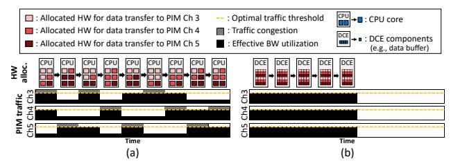

**Fig. 12:** Example of (a) conventional software-level/coarse-grained scheduling approach vs. (b) hardware-level/fine-grained scheduling approach of PIM-MS within DCE.

inside the data buffer (0) and the corresponding address buffer entry's Offset counter value is incremented to keep track of the data transfer progress made so far. The returned data, stored inside the data buffer, is then read out by the preprocessing unit and is transposed on-the-fly (0), the output of which is sent to the AGU (0). The AGU generates the translated, destination PIM address and places the memory write request to the memory controller's write request queue, which eventually gets serviced by the memory controller and finalizes the DRAM $\rightarrow$ PIM data transfer (0).

#### D. PIM-aware Memory Scheduler (PIM-MS)

We now discuss the design principles behind our PIM-MS. The key observation that drives PIM-MS's design is that memory transactions targeting the PIM address space (for both reads and writes) during DRAM↔PIM data transfer are guaranteed to have mutually exclusive addresses. Such mutual exclusiveness ensures that there are no true data dependencies across different PIM memory transactions. To better understand this unique property, it is important to understand how PIM programmers go about partitioning input/output data. Before computation begins on the PIM cores, the programmer partitions the input data, assigns each partition to a specific PIM address, and transfers the partitioned data to the corresponding PIM core. To maintain the integrity of the offloading process and to ensure that all input data are transferred correctly, the programmer must carefully assign each segment of the partitioned data to a unique PIM address. Consequently, each segment stored within the PIM address space is mapped independently to other segments.

With such property in mind, recall from our discussion in Section III-B (Figure 5) where we root-caused the reason behind PIM's sub-optimal read/write throughput to the following two factors: (1) the software-level multi-threaded DRAM↔PIM data transfer, and (2) the fact that the OS thread scheduling policy issues data transfer threads in coarse granularity, failing to evenly distribute read/write traffic across the memory channels (Figure 12(a)). Our PIM-MS is designed to overcome such limitation by employing a "hardware-level" fine-grained memory scheduling that maximizes MLP (Figure 12(b)). As explained in Section IV-B, upon a DRAM→PIM data transfer, the pim\_mmu\_transfer API is invoked using a *single* thread that relays *all* source and destination addresses to the DCE. Therefore, when the OS schedules this (single) thread for execution, the source and

#### Algorithm 1 PIM-MS Scheduling Algorithm

```
1: Input: (Number of PIM cores)-sized list of tuples of (source base address
     destination base address);
     base\_addrs = [(src\_base_0, dst\_base_0) \dots (src\_base_N, dst\_base_N)]
    Output: List of tuples of (source address, destination address), determining the
     sequence in which memory transactions are scheduled;
     addrs = [(src_0, dst_0) \dots (src_N, dst_N)]
 3.
 4:
    {\bf procedure} \; {\tt get\_pim\_core\_id}(ra,bg,bk)
 5:
        return ra*num\_banks*num\_bankgroups +bg*num\_banks+bk
    procedure AGU(id)
 8.
 9.
        src\_base, dst\_base = base\_addrs[id]
10:
        src\_addr = src\_base + pim\_cores[id].offset
        dst\_addr = dst\_base + pim\_cores[id].offset
12.
        pim\_cores[id].offset += min\_access\_granularity
13:
        {\bf return}\ src\_addr, dst\_addr
14:
    end procedure
16: #do-parallel channel
17:
    begin initialization
18:
    for ra \leftarrow 0 to num \ ranks do
        for ba \leftarrow 0 to num\ bankaroups\ do
           for bk \leftarrow 0 to num\_banks do
21:
              id = get\_pim\_core\_id(ra, bg, bk)
22.
              pim\_cores[id].offset = 0
23:
           end for
24:
        end for
25.
26.
    end initialization
27.
28:
    #do-parallel channel
29:
    for bk \leftarrow 0 to num banks do
        for ra \leftarrow 0 to num\_ranks do
31.
           for bg \leftarrow 0 to num\_bankgroups do
32.
              id = \text{get\_pim\_core\_id}(ra, bg, bk)
33:
              src\ addr.\ dst\ addr = AGU(id)
              addrs.append(src addr.dst addr)
           end for
        end for
37: end for
```

destination physical addresses stored inside the address buffer gets translated into DRAM read/write requests that are targeted for *all* destination PIM banks (unlike baseline's software-level/multi-threaded/coarse-grained thread scheduling where the memory requests available for scheduling only target a *single* destination PIM bank at any given time). This in effect allows our PIM-MS to have much higher visibility and flexibility regarding which memory read/write requests to schedule to which PIM bank.

Given this opportunity, PIM-MS employs a memory scheduling algorithm that exploits its enhanced visibility to maximize channel/bank-group/bank-level parallelism, aggressively reordering the sequence in which PIM read/write memory requests are issued to each PIM bank. We use Algorithm 1 to describe PIM-MS's scheduling algorithm. The input to Algorithm 1 is the contents stored inside the address buffer, as detailed in Section IV-C (Figure 11). During initialization, the metadata representing the number of bytes to be transferred to each PIM core (i.e., pim\_cores[id].offset, the "Offset" field in the address buffer entry in Figure 11) is set to 0 (line 16-26). PIM-MS then seeks to maximize channel-level parallelism by concurrently issuing memory requests to all PIM channels (line 28). To minimize columnto-column DRAM timing delay (tCCD), PIM-MS prioritizes bank group interleaving by issuing successive column commands to access different bank groups (line 31). Lastly, using AGU translated DRAM address information, PIM-MS seeks to minimize row buffer conflicts while maximizing bank-level parallelism (line 8-14). Overall, such hardware-level/fine-grained memory scheduling helps better utilize MLP, significantly improving PIM read/write throughput vs. baseline's software-level/coarse-grained memory scheduling (Figure 12).

#### E. Heterogeneous Memory Mapping Unit (HetMap)

PIM manufacturers adjust the memory mapping function to prevent conflicts between DRAM and PIM, which inevitably leads to decreased DRAM read/write throughput (Figure 8, Section III-B). To achieve the dual goals of preserving high DRAM throughput while also separating the physical address space for DRAM and PIM, we introduce a unique memory mapping strategy called *HetMap*. Illustrated on the right side of Figure 9, HetMap employs two separate memory mapping functions, each optimized for a different design objective: the physical address space reserved for PIM utilizes a localitycentric mapping (Figure 7(a)) whereas the physical address space allocated for DRAM employs an MLP-centric mapping (Figure 7(b)). Depending on what the physical address the incoming memory request is targeted for, HetMap dynamically determines whether the memory request falls within the address space of DRAM or PIM. If the memory request is targeted for the DRAM space, it is mapped using the MLP-centric mapping, which incorporates MLP-enhancing optimizations, i.e., XOR hashing and placing channel bits near the LSB. If the memory request belongs to the PIM space, the locality-centric mapping is employed which adopts a simpler memory mapping strategy, i.e., the order in which the DRAM hierarchy is laid out is preserved in the locality-centric mapping (referred to as ChRaBgBkRoCo mapping in the remainder of this paper). For example, starting from the MSB of the physical address space, channel bits (Ch) are mapped first, followed by rank (Ra), bank-group (Bg), bank (Bk), row (Ro), and finally column (Co). As the sub-optimal PIM read/write throughput observed in conventional PIM devices is due to the software-level/coarse-grained/multi-threaded data transfers (a limitation which our PIM-MS effectively addresses), HetMap's locality-centric mapping does not degrade PIM throughput, a property we quantitatively demonstrate in Section VI.

In terms of implementation complexity, HetMap is codesigned with the BIOS firmware and hardware microarchitecture as follows. During system bootstrapping, the BIOS identifies the memory system configuration (number of channels/ranks/...) as well as the total memory capacity available in both DRAM DIMMs and PIM DIMMs. After the memory configuration is identified, the BIOS firmware informs the CPU's memory controller the range in which the physical address space is partitioned across DRAM vs. PIM. Following this procedure, the separate address mappings are established for DRAM and PIM which HetMap utilizes to enforce the locality-centric and MLP-centric mapping for PIM and DRAM access requests, respectively.

**TABLE I:** Baseline system and PIM-MMU configuration.

| Host Processor         |                                                 |
|------------------------|-------------------------------------------------|
| CPU                    | 8 core, 3.2GHz, 4-wide Out-of-Order,            |
|                        | 224 entry instruction window, 64 MSHRs per core |
| Last Level Cache (LLC) | 8MB shared, 64B cacheline, 16-way associative   |
| Memory Controller      | 64-entry read & write request queues, FR-FCFS,  |
|                        | locality-centric memory mapping                 |
| DRAM System            |                                                 |
| Timing Parameter       | DDR4-2400                                       |
| System Configuration   | 4 channels, 2 ranks per channel                 |
| PIM System             |                                                 |
| Timing Parameter       | DDR4-2400                                       |
| System Configuration   | 4 channels, 2 ranks per channel (512 PIM cores) |
| PIM-MMU                |                                                 |
| DCE                    | 3.2GHz clock frequency,                         |
|                        | 16 KB data buffer, 64 KB address buffer         |
| PIM-MS                 | Detailed in Algorithm 1                         |
| HetMap                 | (DRAM side): MLP-centric memory mapping         |
|                        | (PIM side): ChRaBgBkRoCo                        |

## F. PIM-MMU vs. Conventional DMA Engines

To alleviate the performance overhead of memory copy operations (e.g., memcpy, memmove), there exists several Direct Memory Access (DMA) engines that orchestrate data copy without CPU's intervention, e.g., Intel I/OAT [83], [108], [109], [116], Intel DSA [53], [69], and AMD PTDMA [21]. One might wonder whether the challenges of DRAM↔PIM data transfers can be effectively addressed by utilizing existing DMA engines. However, memory bus integrated PIM systems have fundamental architectural differences compared to conventional systems without PIM, limiting the efficacy of these DMA engines. As discussed in Section III, data partitioning as well as transferring partitioned data in/out of PIM is at the programmer's discretion, unlike conventional DRAM-only memory systems where the allocation of data, its partitioning, and its transfers are transparently handled at the hardware-level to maximize MLP. Consequently, current PIM systems rely on coarse-grained, multi-threaded data transfers to maximize MLP at the software-level. Because DMA engines are not designed to utilize this unique property of PIM systems for performance optimizations, they are not able to fully reap out the abundant parallelism inherent in DRAM↔PIM data transfers. As discussed in Section IV-D, PIM-MMU's DCE and PIM-MS can collaboratively utilize such opportunity with our hardware/software co-design, maximizing memory bandwidth utilization for both PIM read and write operations.

Overall, while some of the functionalities provided with DCE (especially its ability to independently orchestrate data transfers without the CPU's assistance) does resemble those of existing DMA engines, the features provided with our PIM-MMU is far beyond what current DMAs are capable of providing, e.g., the fine-grained scheduling of PIM-MS and HetMap's dual-mapping function. In Section VI, we quantitatively demonstrate the limitations of existing DMA engines vs. our PIM-MMU architecture.

#### V. METHODOLOGY

The system characterization in Section III is conducted using a real UPMEM-PIM system, containing an Intel Xeon Gold 5222 CPU attached with 3 channels of DDR4-3200

DIMM (total bandwidth of 76.8 GB/s) and 3 channels of DDR4-2400 based UPMEM-PIM DIMM (total bandwidth of 57.6 GB/s) with one DIMM per each channel. To demonstrate the effectiveness of PIM-MMU in Section VI, we employ a hybrid evaluation methodology that utilizes both cycle-level simulation and wall-clock time measurements from our real UPMEM-PIM system as follows.

Simulation framework. Since our proposed PIM-MMU is designed to improve the performance of DRAM↔PIM data transfers and not the performance of executing the PIM kernels itself, we measure the PIM kernel execution time using our real UPMEM-PIM server. When estimating the performance and energy-efficiency of DRAM↔PIM data transfers over both baseline UPMEM-PIM and our proposed PIM-MMU, we utilize cycle-level simulation by extending Ramulator [68] (the configuration of the host CPU and its DRAM/PIM memory system is summarized in Table I). To simulate the cycle count of baseline UPMEM-PIM's data transfers without PIM-MMU, we compile UPMEM-PIM runtime library's dpu\_push\_xfer function (one that handles DRAM↔PIM transfers) using gcc 9.4.0 and extract the instruction traces that will be executed by the CPU, one which Ramulator's CPU-trace driven mode executes to evaluate the DRAM↔PIM data transfer time. Note that the CPU model in Ramulator currently does not support AVX instructions, which are utilized by UPMEM-PIM to orchestrate DRAM↔PIM transfers. To model the effect of AVX vector load (PIM read) and store (PIM writes) instructions in our evaluation, we modified Ramulator and its core model and emulate the behavior of AVX load/store instructions by executing them as "wide" 64B read (PIM read) and 64B write (PIM write) memory accesses. Because memory requests targeting the PIM address space are non-cacheable, we implement these 64B read/write operations to bypass the cache, unlike the normal, cacheable (8B) read/write operations which target the DRAM address space. To model the effect of OS thread scheduling on baseline UPMEM-PIM's multi-threaded data transfers (Figure 5), we configure Ramulator to concurrently execute 8 data transfer operations targeting 8 PIM cores (i.e., the baseline CPU contains 8 cores, Table I) which are preempted every 1.5 ms based on a round-robin thread scheduling policy [94]. Our PIM-MMU's simulation time is evaluated by properly modeling the cycle-level behavior of DCE, PIM-MS, and HetMap inside Ramulator.

**Evaluated workloads.** The evaluation in Section VI is divided into two parts: (1) microbenchmarks that strictly focus on evaluating the effect of PIM-MMU on DRAM⇔PIM data transfer, and (2) real-world PIM benchmarks that evaluate PIM-MMU's effect on end-to-end performance improvement. As for the microbenchmarks, we establish two data transfer workloads as follows. First, to measure the data transfer throughput of DRAM⇔PIM, we use the microbenchmark provided in the open-source PrIM [43] benchmark suite (named CPU-DPU). Second, to measure the data transfer throughput of DRAM⇔DRAM (i.e., memcpy), we design a custom microbenchmark which employs multi-threading

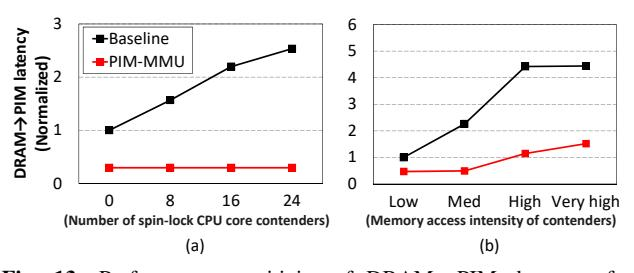

Fig. 13: Performance sensitivity of DRAM→PIM data transfer operation when it is co-located with (a) compute-intensive and (b) memory-intensive contender workloads. We only present results for DRAM→PIM data transfer because similar trends were observed for PIM→DRAM data transfer.

to transfer data using AVX-512 vector instructions (e.g., \_mm512\_stream\_si512) to maximize the throughput of DRAM. As for the real-world PIM benchmarks, we utilize the 16 memory-intensive workloads from PrIM [43].

Energy and area overhead estimation. The design overhead of PIM-MMU is primarily dominated by the 16 KB (data buffer) and 64 KB (address buffer) of SRAM buffers provisioned within the DCE. To estimate PIM-MMU's energy consumption and area overhead on top of the baseline and proposed system, we utilize McPAT [79] and CACTI [85] under 32nm CMOS technology, respectively.

#### VI. EVALUATION

All results presented in Section VI-A are based on cycle-level simulation whereas evaluations conducted in Section VI-B employ a hybrid of simulation augmented with wall-clock time measurements over a real UPMEM-PIM system (Section V details our methodology).

#### A. Microbenchmarks

Here we evaluate PIM-MMU's effectiveness in improving DRAM⇔PIM data transfer performance, demonstrating: (1) the importance of offloading DRAM⇔PIM data transfers to our DCE when *other* CPU-side contenders fight over CPU compute and memory resources, (2) the improvement in DRAM read/write throughput, and finally (3) the importance of enhancing PIM read/write throughput via an ablation study.

Resource contention with co-located workloads. In real systems, multiple workloads are typically co-located within the same server, sharing CPU compute and memory resources. In Figure 13, we evaluate the sensitivity of PIM-MMU vs. baseline UPMEM-PIM's DRAM-PIM data transfer performance when it is co-located with (a) compute-intensive and (b) memory-intensive workloads. For the co-located computeintensive workload, we instantiate an increasing number of spinlock-like CPU core contenders (each contender's memory accesses are primarily captured at its on-chip caches, exhibiting compute-boundedness) that concurrently execute with DRAM-PIM data transfers (Figure 13(a)). As for the colocated memory-intensive workload, we allocate half of the CPU cores to run the resource contending workload, each contender gradually increased with higher memory access intensity (from "low" to "very high" intensity, which we tune

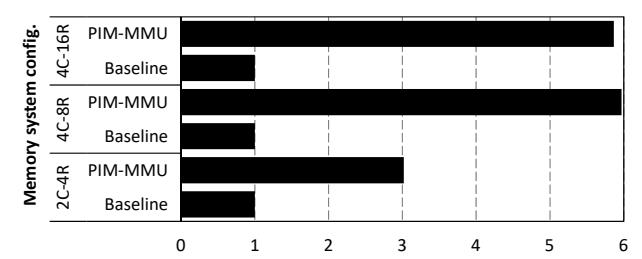

**Fig. 14:** Normalized DRAM throughput (x-axis) during DRAM→DRAM data copy operation. A 'xC-yR' system configuration corresponds to a memory system containing x Channels and y **R**anks (e.g., '2C-4R' refers to a setup with two channels and four ranks).

by gradually increasing the ratio of memory instructions vs. non-memory instructions) to increasingly stress the memory subsystem and thus directly interfere with the concurrently running DRAM—PIM data transfers (Figure 13(b)).

In our experiment in Figure 13(a), with an increasing number of compute-intensive CPU core contenders, the baseline system's data transfer latency sharply increases. Such performance degradation is due to the baseline's multi-threaded data transfer implementation (which require multiple CPU cores to achieve high performance), experiencing resource contention with the CPU-side contenders and leading to a reduction in the average number of CPU threads it can leverage for data transfer operations. Our proposed PIM-MMU, on the other hand, is virtually insensitive to the level of CPU-side resource contention as the entire data transfer process is offloaded to our DCE, exhibiting high robustness.

When the DRAM→PIM data transfer operation is colocated with memory-intensive workloads (Figure 13(b)), both PIM-MMU and baseline suffer from aggravated performance. This is because of the memory bandwidth contention both of these design points experience, with higher (lower) resource contention occurring when the memory-intensive contender exhibits higher (lower) memory access intensity. Nonetheless, PIM-MMU is able to achieve consistently higher performance than baseline as PIM-MMU's data transfer operation does not require any CPU compute resources. Under the baseline system, on the other hand, the data transfer process is orchestrated using CPU threads which fight over CPU cores with memory-intensive contenders, resulting in higher performance loss.

DRAM throughput. In Figure 14, we show the DRAM throughput during DRAM-to-DRAM data transfers (memcpy) as means to demonstrate how well PIM-MMU's HetMap unlocks the MLP available in normal DRAM channels. Overall, PIM-MMU consistently outperforms baseline, achieving an average throughput improvement of 4.9× (maximum 6.0×). This significant increase in DRAM throughput is enabled by our HetMap which not only supports separate address spaces for DRAM and PIM but also facilitates MLP-centric mapping just for the DRAM address space. Because MLP-centric mapping effectively leverages channel-level parallelism, PIM-MMU's DRAM throughput increases linearly with the number of channels. It is important to note that, when the number of

ranks increases, DRAM throughput does not increase correspondingly because adding more ranks only helps increase memory capacity but not memory bandwidth.

**Ablation study.** We summarize our ablation study that quantifies how much the baseline system's (denoted "Base") DRAM↔PIM data transfer throughput (Figure 15(a)) and energy-efficiency (Figure 15(b)) can improve by adding PIM-MMU's key features in an additive manner: (**D**) DCE that does not utilize PIM-MS, (**H**) HetMap, and (**P**) PIM-MS.

Starting with the "Base+D" design (i.e., baseline system utilizing DCE's DMA capability but without the hardwarelevel/fine-grained memory scheduling enabled with PIM-MS), this design point functions as a proxy for conventional DMA engines like Intel's I/OAT [83] or DSA [53]. Interestingly, "Base+D" actually incurs a degradation in data transfer throughput for 7 out of the 10 experiments we conduct in Figure 15(a). Careful analysis of such phenomenon reveals that, compared to "Base+D" (i.e., the vanilla DCE that does not employ HetMap and PIM-MS), the baseline system that does not utilize DMA actually does a better job in utilizing memory bandwidth thanks to its AVX-512 based wide vector read/write requests which are aggressively issued concurrently using the out-of-order execution cores. With the addition of HetMap, the "Base+D+H" design point is able to significantly improve the DRAM read/write throughput (as demonstrated through our microbenchmark study in Figure 14), but the improvement in end-to-end DRAM↔PIM performance is still marginal. This is because the performance of "Base+D+H" gets bottlenecked on the low PIM read/write throughput as it is still based on a software-level/coarse-grained data transfer, throttling the level of MLP it can exploit. Once PIM-MS is employed, however, the "Base+D+H+P" design (i.e., PIM-MMU) fully unlocks the PIM read/write throughput and significantly improves the performance of DRAM↔PIM transfers.

When it comes to energy-efficiency, the energy consumed by the processor-side components dominates the system-wide energy consumption (Figure 15(b)). Consequently, the overall energy-efficiency is determined by how long it takes to finalize the DRAM $\leftrightarrow$ PIM data transfer operations. Because both "Base+D" and "Base+D+H" experience longer data transfer time, these two data points suffer from higher energy consumption than "Base". In contrast, with all three of our proposals in place ("Base+D+H+P"), PIM-MMU can significantly reduce data transfer latency which directly translates into lower energy consumption, achieving an average  $3.3\times$  (max  $3.8\times$ ) and  $4.9\times$  (max  $6.9\times$ ) higher energy-efficiency for DRAM $\rightarrow$ PIM and PIM $\rightarrow$ DRAM transfers, respectively.

#### B. Real-World PIM Benchmarks

Figure 16 shows the normalized execution time of 16 memory-intensive PIM workloads from PrIM [43]. As shown, the latency to transfer input/output data across the DRAM and PIM address space incurs non-trivial performance overhead, accounting to as much as 99.7% (average 63.7%) of end-to-end execution time and underscoring the importance of resolving this system-level bottleneck. PIM-MMU provides an

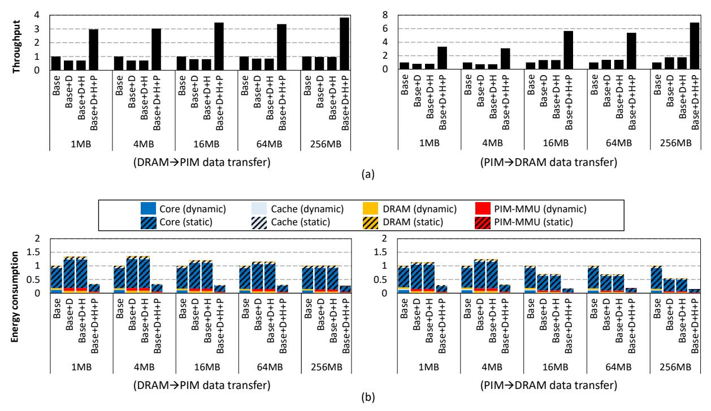

Fig. 15: Ablation study to explore the effectiveness of PIM-MMU's three key features in (a) improving the data transfer throughput and (b) reducing the chip-wide energy consumption during DRAM—PIM and PIM—DRAM data transfers with different data transfer sizes (x-axis). We incrementally add (D) DCE that does not utilize PIM-MS, (H) HetMap, and (P) PIM-MS on top of the baseline system (Base) to evaluate PIM-MMU's effectiveness.

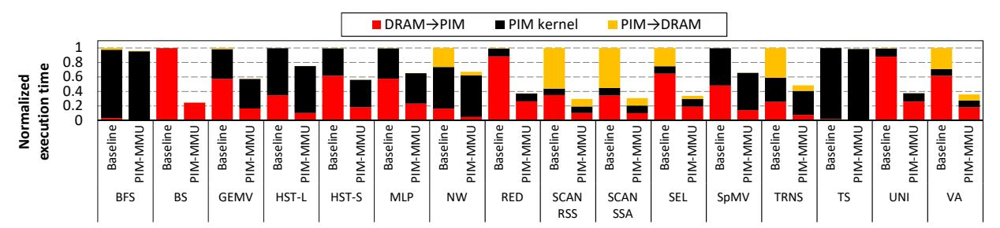

Fig. 16: Normalized end-to-end execution time of PIM benchmarks. PIM kernel execution time is measured using our real UPMEM-PIM system while DRAM↔PIM data transfer time is properly scaled between baseline vs. PIM-MMU based on our simulation results.

average  $3.3\times$  (max  $4.1\times$ ) and an average  $3.8\times$  (max  $5.7\times$ ) reduction in DRAM $\rightarrow$ PIM and PIM $\rightarrow$ DRAM data transfer latency, respectively. The level of end-to-end performance improvement PIM-MMU provides is obviously dependent on how critical the DRAM $\leftrightarrow$ PIM data transfer is, e.g., TS shows marginal performance improvement with our proposed system since data transfer is not a bottleneck. Nonetheless, PIM-MMU provides an average  $2.2\times$  (max  $4.0\times$ ) improvement in end-to-end performance across the entire PrIM benchmark suite, justifying its adoption in memory bus integrated PIM systems.

## C. Implementation Overhead

Implementation of PIM-MS and HetMap is primarily dominated by logic gates, so PIM-MMU's most significant area overhead comes from the DCE's SRAM buffers whose size is 16 KB and 64 KB for data buffer and address buffer, respectively. The area overhead of these buffers are evaluated

as 0.85 mm<sup>2</sup> using CACTI [85] which amounts to only a 0.37% increase in CPU die size. Given the significant energy-efficiency improvement PIM-MMU provides, we believe such implementation overhead is reasonable.

#### VII. RELATED WORK

Data movement support. To alleviate CPU's burden during data movement operations (e.g., memcpy), there exists a variety of DMA engines. These include Intel's I/OAT [83], [108], [109], [116] and DSA [53], [69], along with AMD's PTDMA [21]. Kuper et al. [69], for instance, highlights the efficiency of Intel's DSA in offloading DRAM⇔DRAM data transfers. Additionally, NVIDIA's H100 GPU [18] introduced a memory copy engine called Tensor Memory Accelerator which efficiently transfers data between off-chip DRAM and on-chip scratchpad. In general, the concept of offloading a

data copy operation to a dedicated data movement accelerator is similar between PIM-MMU and these DMA engines. However, as we quantitatively demonstrated through our ablation study in Section VI-A (Figure 15, existing DMA engines are not optimized to exploit the unique characteristics of PIM let alone its implication from a system's perspective, failing to fully reap out MLP to accelerate DRAM↔PIM data transfers. There also exists several prior work proposing architectures for bulk data transfer acceleration [11], [30], [45], [100]–[103]. RowClone [101] and SIMDRAM [45], for instance, proposes an in-DRAM bulk data transfer acceleration scheme where multiple DRAM rows are concurrently activated as means to enable fast row to row data copies. These solutions, however, can only copy data between rows that reside within the same DRAM chip, rendering PIM-MMU's contribution orthogonal these prior work as we focus on accelerating DRAM↔PIM data transfers. These results highlight the unique contribution and novelty of PIM-MMU vs. conventional DMA engines or bulk data transfer architectures.

Characterization of commercial PIM device. Several recent work conducted a detailed characterization of commercial PIM systems. For instance, [42]–[44] provides a detailed workload characterization on the UPMEM-PIM system with another line of research investigating how to exploit the UPMEM-PIM system to accelerate data-intensive workloads, e.g., dense/sparse linear algebra, databases, data analytics, graph processing, bioinformatics, image processing, compression, simulation, and encryption [6], [7], [14], [20], [25], [41], [57], [59], [60], [74], [81], [87], [88]. There also exists a series of studies exploring the hardware/software architectural support for Samsung's HBM-PIM architecture [71], [77], as well as studies on using Samsung's near-memory processing based AxDIMM for accelerating recommendation models [64] and database operations [75]. While these prior work provide invaluable insights on commercial PIM devices, to the best of our knowledge, PIM-MMU, which is an extension of our prior work [76], is the first to uncover the unique systemlevel challenges of DRAM↔PIM data transfers in memory bus integrated PIM systems.

Memory management for PIM systems. Prior work explored the designs of memory management targeting PIM systems [5], [8], [9], [16], [23], [34], [46], [49], [50], [112]. Hall et al. [46] described memory management requirements associated with virtual memory, specifically for the Data Inten-Sive Architecture (DIVA) [27]. Azarkhish et al. [5] presented a zero-copy pointer passing mechanism to allow low overhead data sharing between the host and PIM with virtual memory support. Zhang et al. [112] presented an IOMMU design that efficiently handles massive memory requests while supporting virtual memory for PIM. While these works present memory management schemes for PIM-enabled systems, they mainly focus on aspects related to virtual memory, distinguishing PIM-MMU's contribution from them.

Memory mapping. There also exists several prior work exploring efficient memory mapping architectures [4], [12], [26], [31], [61], [62], [80], [82], [84], [111], [115]. Ghasempour et al. [31] employed multiple DRAM address mapping functions, dynamically choosing the optimal address mapping function at runtime based on the target workload's unique memory access pattern for improved DRAM performance. Zhang et al. [111] proposed user-program behavior-aware memory mapping, which can efficiently exploit channel-level parallelism. Meswani et al. [84] proposed hardware/software co-designed memory management for die-stacked DRAM. Li et al. [80] introduced a hybrid memory management approach that quantitatively assesses the performance gains of migrating a page between various memory types within a hybrid memory system. While these prior work bears some similarity with PIM-MMU's HetMap architecture, the unique aspect of PIM-MMU lies in demonstrating the importance of synergistically combining DCE, PIM-MS, and HetMap to fully unlock performance, rendering our contribution unique.

## VIII. CONCLUSION

Current PIM-integrated systems suffer from high performance overheads during DRAM↔PIM data transfers. We propose PIM-MMU, a hardware/software co-design that enables energy-efficient data transfers in memory bus integrated PIM. Compared to baseline, PIM-MMU incurs negligible implementation overheads while providing energy-efficiency improvements in DRAM↔PIM data transfers, leading to an end-to-end 2.2× speedup for real-world PIM workloads.

## ACKNOWLEDGMENT

This work was partly supported by the National Research Foundation of Korea (NRF) grant funded by the Korea government (MSIT) (NRF-2021R1A2C2091753), Institute of Information & Communications Technology Planning & Evaluation (IITP) grant funded by the Korea government (MSIT) (No.RS-2024-00438851, (SW Starlab) Highperformance Privacy-preserving Machine Learning System and System Software), (No. 2022-0-01037, Development of High Performance Processing-in-Memory Technology based on DRAM), (No.RS-2024-00395134, DPU-Centric Datacenter Architecture for Next-Generation AI Devices), (No.RS-2024- 00402898, Simulation-based High-speed/High-Accuracy Data Center Workload/System Analysis Platform), and IITP under the Graduate School of Artificial Intelligence Semiconductor (IITP-2024-RS-2023-00256472) grant funded by MSIT. The EDA tool was supported by the IC Design Education Center (IDEC), Korea. We also appreciate the support from Samsung Electronics. Minsoo Rhu is the corresponding author.

## REFERENCES

- [1] "PrIM (Processing-In-Memory Benchmarks)," 2021. [Online]. Available: https://github.com/CMU-SAFARI/prim-benchmarks
- [2] J. Ahn, S. Hong, S. Yoo, O. Mutlu, and K. Choi, "A Scalable Processing-in-Memory Accelerator for Parallel Graph Processing," in *Proceedings of the International Symposium on Computer Architecture (ISCA)*, 2015.
- [3] J. Ahn, S. Yoo, O. Mutlu, and K. Choi, "PIM-Enabled Instructions: A Low-Overhead, Locality-Aware Processing-in-Memory Architecture," in *Proceedings of the International Symposium on Computer Architecture (ISCA)*, 2015.

- [4] B. Akin, F. Franchetti, and J. C. Hoe, "Data Reorganization in Memory Using 3D-Stacked DRAM," in *Proceedings of the International Symposium on Computer Architecture (ISCA)*, 2015.
- [5] E. Azarkhish, D. Rossi, I. Loi, and L. Benini, "Design and Evaluation of a Processing-In-Memory Architecture for the Smart Memory Cube," in *Architecture of Computing Systems–ARCS 2016: 29th International Conference, Nuremberg, Germany, April 4–7, 2016, Proceedings 29*. Springer, 2016.
- [6] A. Baumstark, M. A. Jibril, and K.-U. Sattler, "Adaptive Query Compilation with Processing-in-Memory," in *Proceedings of the International Conference on Data Engineering Workshops (ICDEW)*, 2023.
- [7] A. Bernhardt, A. Koch, and I. Petrov, "pimDB: From Main-Memory DBMS to Processing-In-Memory DBMS-Engines on Intelligent Memories," in *Proceedings of the International Workshop on Data Management on New Hardware*, 2023.
- [8] A. Boroumand, S. Ghose, M. Patel, H. Hassan, B. Lucia, R. Ausavarungnirun, K. Hsieh, N. Hajinazar, K. T. Malladi, H. Zheng, and O. Mutlu, "CoNDA: Efficient Cache Coherence Support for Neardata Accelerators," in *Proceedings of the International Symposium on Computer Architecture (ISCA)*, 2019.
- [9] A. Boroumand, S. Ghose, M. Patel, H. Hassan, B. Lucia, K. Hsieh, K. T. Malladi, H. Zheng, and O. Mutlu, "LazyPIM: An Efficient Cache Coherence Mechanism for Processing-in-Memory," *IEEE Computer Architecture Letters*, vol. 16, no. 1, pp. 46–50, 2017.
- [10] T. Brown, B. Mann, N. Ryder, M. Subbiah, J. D. Kaplan, P. Dhariwal, A. Neelakantan, P. Shyam, G. Sastry, A. Askell, S. Agarwal, A. Herbert-Voss, G. Krueger, T. Henighan, R. Child, A. Ramesh, D. Ziegler, J. Wu, C. Winter, C. Hesse, M. Chen, E. Sigler, M. Litwin, S. Gray, B. Chess, J. Clark, C. Berner, S. McCandlish, A. Radford, I. Sutskever, and D. Amodei, "Language Models are Few-Shot Learners," in *Proceedings of the International Conference on Neural Information Processing Systems (NeurIPS)*, 2020.
- [11] K. K. Chang, P. J. Nair, D. Lee, S. Ghose, M. K. Qureshi, and O. Mutlu, "Low-Cost Inter-Linked Subarrays (LISA): Enabling Fast Inter-Subarray Data Movement in DRAM," in *Proceedings of the International Symposium on High-Performance Computer Architecture (HPCA)*, 2016.
- [12] N. Chatterjee, M. O'Connor, G. H. Loh, N. Jayasena, and R. Balasubramonia, "Managing DRAM Latency Divergence in Irregular GPGPU Applications," in *Proceedings of the International Conference on High Performance Computing, Networking, Storage and Analysis (SC)*, 2014.
- [13] J. Chen, J. Gomez-Luna, I. El Hajj, Y. Guo, and O. Mutlu, "SimplePIM: ´ A Software Framework for Productive and Efficient Processing-in-Memory," in *Proceedings of the International Conference on Parallel Architectures and Compilation Techniques (PACT)*, 2023.
- [14] L.-C. Chen, C.-C. Ho, and Y.-H. Chang, "UpPipe: A Novel Pipeline Management on In-Memory Processors for RNA-seq Quantification," in *Design Automation Conference (DAC)*, 2023.
- [15] B. Y. Cho, J. Jung, and M. Erez, "Accelerating Bandwidth-Bound Deep Learning Inference with Main-Memory Accelerators," in *Proceedings of the International Conference on High Performance Computing, Networking, Storage and Analysis (SC)*, 2021.
- [16] B. Y. Cho, Y. Kwon, S. Lym, and M. Erez, "Near Data Acceleration with Concurrent Host Access," in *Proceedings of the International Symposium on Computer Architecture (ISCA)*, 2020.
- [17] J. Choi, J. Park, K. Kyung, N. S. Kim, and J. H. Ahn, "Unleashing the Potential of PIM: Accelerating Large Batched Inference of Transformer-Based Generative Models," *IEEE Computer Architecture Letters*, vol. 22, no. 2, pp. 113–116, 2023.
- [18] J. Choquette, "Nvidia Hopper GPU: Scaling Performance," in *Hot Chips: A Symposium on High Performance Chips*, 2022.
- [19] G. Dai, T. Huang, Y. Chi, J. Zhao, G. Sun, Y. Liu, Y. Wang, Y. Xie, and H. Yang, "GraphH: A Processing-in-Memory Architecture for Large-Scale Graph Processing," *IEEE Transactions on Computer-Aided Design of Integrated Circuits and Systems*, vol. 38, no. 4, pp. 640–653, 2019.
- [20] P. Das, P. R. Sutradhar, M. Indovina, S. M. P. Dinakarrao, and A. Ganguly, "Implementation and Evaluation of Deep Neural Networks in Commercially Available Processing in Memory Hardware," in *Proceedings of the International System-on-Chip Conference (SOCC)*, 2022.
- [21] DELL Technologies, "Accelerating Intra-Host Data Movement with Vmware PVRDMA on a Dell AMD PowerEdge Server," 2020.
- [22] F. Devaux, "The True Processing In Memory Accelerator," in *Hot Chips: A Symposium on High Performance Chips*, 2019.

- [23] A. Devic, S. B. Rai, A. Sivasubramaniam, A. Akel, S. Eilert, and J. Eno, "To PIM or Not for Emerging General Purpose Processing in DDR Memory Systems," in *Proceedings of the International Symposium on Computer Architecture (ISCA)*, 2022.
- [24] S. Diab, A. Nassereldine, M. Alser, J. Gomez Luna, O. Mutlu, and ´ I. El Hajj, "A Framework for High-throughput Sequence Alignment Using Real Processing-in-Memory Systems," *Bioinformatics*, vol. 39, no. 5, 2023.
- [25] S. Diab, A. Nassereldine, M. Alser, J. G. Luna, O. Mutlu, and I. E. Hajj, "High-throughput Pairwise Alignment with the Wavefront Algorithm Using Processing-in-Memory," in *Proceedings of the International Parallel and Distributed Processing Symposium Workshops (IPDPSW)*, 2022.
- [26] X. Dong, Y. Xie, N. Muralimanohar, and N. P. Jouppi, "Simple But Effective Heterogeneous Main Memory with On-Chip Memory Controller Support," in *Proceedings of the International Conference on High Performance Computing, Networking, Storage and Analysis (SC)*, 2010.
- [27] J. Draper, J. Chame, M. Hall, C. Steele, T. Barrett, J. LaCoss, J. Granacki, J. Shin, C. Chen, C. W. Kang, I. Kim, and G. Daglikoca, "The Architecture of the DIVA Processing-In-Memory Chip," in *Proceedings of the 16th International Conference on Supercomputing (ICS)*, 2002.
- [28] D. Elliott, M. Stumm, W. Snelgrove, C. Cojocaru, and R. Mckenzie, "Computational RAM: Implementing Processors in Memory," *IEEE Design & Test of Computers*, vol. 16, no. 1, pp. 32–41, 1999.
- [29] I. Fernandez, C. Giannoula, A. Manglik, R. Quislant, N. M. Ghiasi, J. Gomez-Luna, E. Gutierrez, O. Plata, and O. Mutlu, "MATSA: An ´ MRAM-based Energy-Efficient Accelerator for Time Series Analysis," *IEEE Access*, 2024.
- [30] J. D. Ferreira, G. Falcao, J. Gomez-Luna, M. Alser, L. Orosa, ´ M. Sadrosadati, J. S. Kim, G. F. Oliveira, T. Shahroodi, A. Nori *et al.*, "pluto: Enabling Massively Parallel Computation in DRAM via Lookup Tables," in *Proceedings of the International Symposium on Microarchitecture (MICRO)*, 2022.
- [31] M. Ghasempour, A. Jaleel, J. D. Garside, and M. Lujan, "Dream: ´ Dynamic Re-Arrangement of Address Mapping to Improve the Performance of DRAMs," in *Proceedings of the Second International Symposium on Memory Systems*, 2016.
- [32] C. Giannoula, I. Fernandez, J. Gomez-Luna, N. Koziris, G. Goumas, ´ and O. Mutlu, "SparseP: Towards Efficient Sparse Matrix Vector Multiplication on Real Processing-In-Memory Architectures," *Proceedings of the ACM on Measurement and Analysis of Computing Systems*, vol. 6, no. 1, pp. 1–49, 2022.
- [33] C. Giannoula, I. Fernandez, J. Gomez-Luna, N. Koziris, G. Goumas, ´ and O. Mutlu, "SparseP: Towards Efficient Sparse Matrix Vector Multiplication on Real Processing-In-Memory Architectures," in *arxiv.org*, 2022.
- [34] C. Giannoula, N. Vijaykumar, N. Papadopoulou, V. Karakostas, I. Fernandez, J. Gomez-Luna, L. Orosa, N. Koziris, G. Goumas, and ´ O. Mutlu, "SynCron: Efficient Synchronization Support for Near-Data-Processing Architectures," in *Proceedings of the International Symposium on High-Performance Computer Architecture (HPCA)*, 2021.
- [35] C. Giannoula, P. Yang, I. F. Vega, J. Yang, Y. X. Li, J. G. Luna, M. Sadrosadati, O. Mutlu, and G. Pekhimenko, "Accelerating Graph Neural Networks on Real Processing-In-Memory Systems," in *arxiv.org*, 2024.
- [36] J. Gomez-Luna, Y. Guo, S. Brocard, J. Legriel, R. Cimadomo, G. F. ´ Oliveira, G. Singh, and O. Mutlu, "Machine Learning Training on a Real Processing-in-Memory System," in *IEEE Computer Society Annual Symposium on VLSI (ISVLSI)*, 2022.
- [37] J. Gomez-Luna, Y. Guo, S. Brocard, J. Legriel, R. Cimadomo, G. F. ´ Oliveira, G. Singh, and O. Mutlu, "An Experimental Evaluation of Machine Learning Training on a Real Processing-in-Memory System," in *arxiv.org*, 2023.
- [38] J. Gomez-Luna, Y. Guo, S. Brocard, J. Legriel, R. Cimadomo, G. F. ´ Oliveira, G. Singh, and O. Mutlu, "Evaluating Machine Learning Workloads on Memory-Centric Computing Systems," in *Proceedings of the International Symposium on Performance Analysis of Systems Software (ISPASS)*, 2023.
- [39] M. Gottschlag, P. Machauer, Y. Khalil, and F. Bellosa, "Fair Scheduling for AVX2 and AVX-512 Workloads," in *Proceedings of the USENIX Symposium on Annual Technical Conference (ATC)*, 2021.
- [40] C. Guo, J. Tang, W. Hu, J. Leng, C. Zhang, F. Yang, Y. Liu, M. Guo, and Y. Zhu, "Olive: Accelerating Large Language Models via

- Hardware-Friendly Outlier-Victim Pair Quantization," in *Proceedings of the International Symposium on Computer Architecture (ISCA)*, 2023.
- [41] H. Gupta, M. Kabra, J. Gomez-Luna, K. Kanellopoulos, and O. Mutlu, ´ "Evaluating Homomorphic Operations on a Real-World Processing-In-Memory System," in *Proceedings of the International Symposium on Workload Characterization (IISWC)*, 2023.
- [42] J. Gomez-Luna, I. El Hajj, I. Fernandez, C. Giannoula, G. F. Oliveira, ´ and O. Mutlu, "Benchmarking Memory-Centric Computing Systems: Analysis of Real Processing-In-Memory Hardware," in *Proceedings of the International Green and Sustainable Computing Conference (IGSC)*, 2021.
- [43] J. Gomez-Luna, I. E. Hajj, I. Fernandez, C. Giannoula, G. F. Oliveira, ´ and O. Mutlu, "Benchmarking a New Paradigm: An Experimental Analysis of a Real Processing-in-Memory Architecture," in *arxiv.org*, 2021.
- [44] J. Gomez-Luna, I. E. Hajj, I. Fernandez, C. Giannoula, G. F. Oliveira, ´ and O. Mutlu, "Benchmarking a New Paradigm: Experimental Analysis and Characterization of a Real Processing-in-Memory System," *IEEE Access*, vol. 10, pp. 52 565–52 608, 2022.
- [45] N. Hajinazar, G. F. Oliveira, S. Gregorio, J. a. D. Ferreira, N. M. Ghiasi, M. Patel, M. Alser, S. Ghose, J. Gomez-Luna, and O. Mutlu, ´ "SIMDRAM: A Framework for Bit-Serial SIMD Processing Using DRAM," in *Proceedings of the International Conference on Architectural Support for Programming Languages and Operating Systems (ASPLOS)*, 2021.
- [46] M. Hall and C. Steele, "Memory Management in a PIM-Based Architecture," in *International Workshop on Intelligent Memory Systems*. Springer, 2000.
- [47] G. Heo, S. Lee, J. Cho, H. Choi, S. Lee, H. Ham, G. Kim, D. Mahajan, and J. Park, "NeuPIMs: NPU-PIM Heterogeneous Acceleration for Batched LLM Inferencing," in *arxiv.org*, 2024.
- [48] S. Hong, S. Moon, J. Kim, S. Lee, M. Kim, D. Lee, and J.-Y. Kim, "DFX: A Low-latency Multi-FPGA Appliance for Accelerating Transformer-based Text Generation," in *Proceedings of the International Symposium on Microarchitecture (MICRO)*, 2022.
- [49] K. Hsieh, E. Ebrahim, G. Kim, N. Chatterjee, M. O'Connor, N. Vijaykumar, O. Mutlu, and S. W. Keckler, "Transparent Offloading and Mapping (TOM): Enabling Programmer-Transparent Near-Data Processing in GPU Systems," in *Proceedings of the International Symposium on Computer Architecture (ISCA)*, 2016.
- [50] K. Hsieh, S. Khan, N. Vijaykumar, K. K. Chang, A. Boroumand, S. Ghose, and O. Mutlu, "Accelerating Pointer Chasing in 3D-Stacked Memory: Challenges, Mechanisms, Evaluation," in *Proceedings of the International Conference on Computer Design (ICCD)*, 2016.
- [51] B. Hyun, T. Kim, D. Lee, and M. Rhu, "Pathfinding Future PIM Architectures by Demystifying a Commercial PIM Technology," in *Proceedings of the International Symposium on High-Performance Computer Architecture (HPCA)*, 2024.
- [52] Intel, "Second Generation Intel Xeon Scalable Processors Datasheet Volume Two: Registers," 2019. [Online]. Available: https://www.intel.com/content/dam/www/public/us/ en/documents/datasheets/2nd-gen-xeon-scalable-datasheet-vol-2.pdf
- [53] Intel, "Intel Data Streaming Accelerator Architecture Specification," 2022.
- [54] Intel, "Intel 64 and IA-32 Architectures Software Developer's Manual," 2023.
- [55] Intel, "Intel Performance Counter Monitor," 2023.
- [56] Intel, "Intel VTune Profiler," 2023.
- [57] M. Item, G. F. Oliveira, J. Gomez-Luna, M. Sadrosadati, Y. Guo, ´ and O. Mutlu, "TransPimLib: Efficient Transcendental Functions for Processing-in-Memory Systems," in *Proceedings of the International Symposium on Performance Analysis of Systems Software (ISPASS)*, 2023.
- [58] M. Item, G. F. Oliveira, J. Gomez-Luna, M. Sadrosadati, Y. Guo, ´ and O. Mutlu, "TransPimLib: Efficient Transcendental Functions for Processing-in-Memory Systems," in *arxiv.org*, 2023.
- [59] G. Jonatan, H. Cho, H. Son, X. Wu, N. Livesay, E. Mora, K. Shivdikar, J. L. Abellan, A. Joshi, D. Kaeli, and J. Kim, "Scalability Limitations ´ of Processing-in-Memory Using Real System Evaluations," in *Proceedings of the ACM on Measurement and Analysis of Computing Systems (SIGMETRICS)*, 2024.
- [60] H. Kang, Y. Zhao, G. E. Blelloch, L. Dhulipala, Y. Gu, C. McGuffey, and P. B. Gibbons, "PIM-Tree: A Skew-Resistant Index for Processingin-Memory," *Proc. VLDB Endow.*, vol. 16, no. 4, p. 946–958, 2022.

- [61] D. Kaseridis, J. Stuecheli, J. Chen, and L. K. John, "A Bandwidth-Aware Memory-Subsystem Resource Management using Non-Invasive Resource Profilers for Large CMP Systems," in *Proceedings of the International Symposium on High-Performance Computer Architecture (HPCA)*, 2010.
- [62] D. Kaseridis, J. Stuecheli, and L. K. John, "Minimalist Open-Page: A DRAM Page-Mode Scheduling Policy for the Many-Core Era," in *Proceedings of the International Symposium on Microarchitecture (MICRO)*, 2011.
- [63] L. Ke, U. Gupta, B. Y. Cho, D. Brooks, V. Chandra, U. Diril, A. Firoozshahian, K. Hazelwood, B. Jia, H.-H. S. Lee, M. Li, B. Maher, D. Mudigere, M. Naumov, M. Schatz, M. Smelyanskiy, X. Wang, B. Reagen, C.-J. Wu, M. Hempstead, and X. Zhang, "RecNMP: Accelerating Personalized Recommendation with Near-Memory Processing," in *Proceedings of the International Symposium on Computer Architecture (ISCA)*, 2020.
- [64] L. Ke, X. Zhang, J. So, J.-G. Lee, S.-H. Kang, S. Lee, S. Han, Y. Cho, J. H. Kim, Y. Kwon, K. Kim, J. Jung, I. Yun, S. J. Park, H. Park, J. Song, J. Cho, K. Sohn, N. S. Kim, and H.-H. S. Lee, "Near-Memory Processing in Action: Accelerating Personalized Recommendation with AxDIMM," *IEEE Micro*, vol. 42, no. 1, pp. 116–127, 2022.
- [65] L. Kernel, "Error Detection And Correction (EDAC) Devices," 2024. [Online]. Available: https://docs.kernel.org/driver-api/edac.html
- [66] D. Kim, J. Kung, S. Chai, S. Yalamanchili, and S. Mukhopadhyay, "Neurocube: A Programmable Digital Neuromorphic Architecture with High-Density 3D Memory," in *Proceedings of the International Symposium on Computer Architecture (ISCA)*, 2016.
- [67] J. H. Kim, S.-H. Kang, S. Lee, H. Kim, Y. Ro, S. Lee, D. Wang, J. Choi, J. So, Y. Cho, J. Song, J. Cho, K. Sohn, and N. S. Kim, "Aquabolt-XL HBM2-PIM, LPDDR5-PIM with In-Memory Processing, and AXDIMM with Acceleration Buffer," *IEEE Micro*, vol. 42, no. 3, pp. 20–30, 2022.
- [68] Y. Kim, W. Yang, and O. Mutlu, "Ramulator: A Fast and Extensible DRAM Simulator," *IEEE Computer Architecture Letters*, vol. 15, no. 1, pp. 45–49, 2015.
- [69] R. Kuper, I. Jeong, Y. Yuan, J. Hu, R. Wang, N. Ranganathan, and N. S. Kim, "A Quantitative Analysis and Guideline of Data Streaming Accelerator in Intel 4th Gen Xeon Scalable Processors," in *Proceedings of the International Conference on Architectural Support for Programming Languages and Operating Systems (ASPLOS)*, 2024.
- [70] Y. Kwon, G. Kim, N. Kim, W. Shin, J. Won, H. Joo, H. Choi, B. An, G. Shin, D. Yun, J. Kim, C. Kim, I. Kim, J. Park, C. Park, Y. Song, B. Yang, H. Lee, S. Park, W. Lee, S. Lee, K. Kim, D. Kwon, C. Jeong, J. Kim, E. Lim, and J. Chun, "Memory-Centric Computing with SK Hynix's Domain-Specific Memory," in *Hot Chips: A Symposium on High Performance Chips*, 2023.
- [71] Y.-C. Kwon, S. H. Lee, J. Lee, S.-H. Kwon, J. M. Ryu, J.-P. Son, O. Seongil, H.-S. Yu, H. Lee, S. Y. Kim, Y. Cho, J. G. Kim, J. Choi, H.-S. Shin, J. Kim, B. Phuah, H. Kim, M. J. Song, A. Choi, D. Kim, S. Kim, E.-B. Kim, D. Wang, S. Kang, Y. Ro, S. Seo, J. Song, J. Youn, K. Sohn, and N. S. Kim, "25.4 A 20nm 6GB Function-In-Memory DRAM, Based on HBM2 with a 1.2TFLOPS Programmable Computing Unit Using Bank-Level Parallelism, for Machine Learning Applications," in *Proceedings of the International Solid State Circuits Conference (ISSCC)*, 2021.
- [72] Y. Kwon, Y. Lee, and M. Rhu, "TensorDIMM: A Practical Near-Memory Processing Architecture for Embeddings and Tensor Operations in Deep Learning," in *Proceedings of the International Symposium on Microarchitecture (MICRO)*, 2019.
- [73] Y. Kwon, Y. Lee, and M. Rhu, "Tensor Casting: Co-Designing Algorithm-Architecture for Personalized Recommendation Training," in *Proceedings of the International Symposium on High-Performance Computer Architecture (HPCA)*, 2021.
- [74] D. Lavenier, J.-F. Roy, and D. Furodet, "DNA Mapping Using Processor-in-Memory Architecture," in *IEEE International Conference on Bioinformatics and Biomedicine (BIBM)*, 2016.
- [75] D. Lee, J. So, M. Ahn, J.-G. Lee, J. Kim, J. Cho, R. Oliver, V. C. Thummala, R. s. JV, S. S. Upadhya, M. Khan, and J. H. Kim, "Improving In-Memory Database Operations with Acceleration DIMM (AxDIMM)," in *Proceedings of the 18th International Workshop on Data Management on New Hardware (DaMoN)*, 2022.
- [76] D. Lee, B. Hyun, T. Kim, and M. Rhu, "Analysis of Data Transfer Bottlenecks in Commercial PIM Systems: A Study with UPMEM-PIM," *IEEE Computer Architecture Letters*, 2024.

- [77] S. Lee, S.-h. Kang, J. Lee, H. Kim, E. Lee, S. Seo, H. Yoon, S. Lee, K. Lim, H. Shin, J. Kim, O. Seongil, A. Iyer, D. Wang, K. Sohn, and N. S. Kim, "Hardware Architecture and Software Stack for PIM Based on Commercial DRAM Technology : Industrial Product," in *Proceedings of the International Symposium on Computer Architecture (ISCA)*, 2021.
- [78] M. Lenjani, A. Ahmed, M. Stan, and K. Skadron, "Gearbox: A Case for Supporting Accumulation Dispatching and Hybrid Partitioning in PIMbased Accelerators," in *Proceedings of the International Symposium on Computer Architecture (ISCA)*, 2022.
- [79] S. Li, J. H. Ahn, R. D. Strong, J. B. Brockman, D. M. Tullsen, and N. P. Jouppi, "McPAT: An Integrated Power, Area, and Timing Modeling Framework for Multicore and Manycore Architectures," in *Proceedings of the International Symposium on Microarchitecture (MICRO)*, 2009.
- [80] Y. Li, S. Ghose, J. Choi, J. Sun, H. Wang, and O. Mutlu, "Utility-Based Hybrid Memory Management," in *IEEE International Conference on Cluster Computing (CLUSTER)*, 2017, pp. 152–165.
- [81] C. Lim, S. Lee, J. Choi, J. Lee, S. Park, H. Kim, J. Lee, and Y. Kim, "Design and Analysis of a Processing-in-DIMM Join Algorithm: A Case Study with UPMEM DIMMs," in *Proceedings of the International Conference on Management of Data (SIGMOD)*, 2023.
- [82] Y. Liu, X. Zhao, M. Jahre, Z. Wang, X. Wang, Y. Luo, and L. Eeckhout, "Get Out of the valley: Power-Efficient Address Mapping for GPUs," in *Proceedings of the International Symposium on Computer Architecture (ISCA)*, 2018.
- [83] M. Marty, M. de Kruijf, J. Adriaens, C. Alfeld, S. Bauer, C. Contavalli, M. Dalton, N. Dukkipati, W. C. Evans, S. Gribble, N. Kidd, R. Kononov, G. Kumar, C. Mauer, E. Musick, L. Olson, E. Robow, M. Ryan, K. Springborn, P. Turner, V. Valancius, X. Wang, and A. Vahdat, "Snap: A Microkernel Approach to Host Networking," in *Proceedings of the ACM Symposium on Operating System Principles (SOSP)*, 2019.
- [84] M. R. Meswani, S. Blagodurov, D. Roberts, J. Slice, M. Ignatowski, and G. H. Loh, "Heterogeneous Memory Architectures: A HW/SW Approach for Mixing Die-Stacked and Off-Package Memories," in *Proceedings of the International Symposium on High-Performance Computer Architecture (HPCA)*, 2015.
- [85] N. Muralimanohar, R. Balasubramonian, and N. P. Jouppi, "Cacti 6.0: A tool to model large caches," *HP laboratories*, vol. 27, p. 28, 2009.
- [86] M. Naumov, D. Mudigere, H.-J. M. Shi, J. Huang, N. Sundaraman, J. Park, X. Wang, U. Gupta, C.-J. Wu, A. G. Azzolini, D. Dzhulgakov, A. Mallevich, I. Cherniavskii, Y. Lu, R. Krishnamoorthi, A. Yu, V. Kondratenko, S. Pereira, X. Chen, W. Chen, V. Rao, B. Jia, L. Xiong, and M. Smelyanskiy, "Deep Learning Recommendation Model for Personalization and Recommendation Systems," in *arxiv.org*, 2019.
- [87] J. Nider, J. Dagger, N. Gharavi, D. Ng, and A. Fedorova, "Bulk JPEG Decoding on In-Memory Processors," in *Proceedings of the 15th ACM International Conference on Systems and Storage (SYSTOR)*, 2022.
- [88] J. Nider, C. Mustard, A. Zoltan, J. Ramsden, L. Liu, J. Grossbard, M. Dashti, R. Jodin, A. Ghiti, J. Chauzi, and A. Fedorova, "A Case Study of Processing-in-Memory in Off-the-Shelf Systems," in *USENIX Annual Technical Conference (ATC)*, 2021.
- [89] NVIDIA, "CUDA, release: 10.2.89," 2020. [Online]. Available: https://developer.nvidia.com/cuda-toolkit
- [90] G. F. Oliveira, J. Gomez-Luna, S. Ghose, A. Boroumand, and O. Mutlu, ´ "Accelerating Neural Network Inference with Processing-in-DRAM: From the Edge to the Cloud," *IEEE Micro*, vol. 42, no. 6, pp. 25–38, 2022.
- [91] G. F. Oliveira, J. Gomez-Luna, L. Orosa, S. Ghose, N. Vijaykumar, ´ I. Fernandez, M. Sadrosadati, and O. Mutlu, "DAMOV: A New Methodology and Benchmark Suite for Evaluating Data Movement Bottlenecks," *IEEE Access*, vol. 9, pp. 134 457–134 502, 2021.
- [92] OpenAI, "GPT-4 Technical Report," in *arxiv.org*, 2023.
- [93] M. Oskin, F. Chong, and T. Sherwood, "Active Pages: A Computation Model for Intelligent Memory," in *Proceedings of the International Symposium on Computer Architecture (ISCA)*, 1998.
- [94] C. S. Pabla, "Completely Fair Scheduler," *Linux Journal*, vol. 2009, no. 184, p. 4, 2009.
- [95] S.-S. Park, K. Kim, J. So, J. Jung, J. Lee, K. Woo, N. Kim, Y. Lee, H. Kim, Y. Kwon, J. Kim, J. Lee, Y. Cho, Y. Tai, J. Cho, H. Song, J. H. Ahn, and N. S. Kim, "An LPDDR-based CXL-PNM Platform for TCO-Efficient GPT Inference," in *Proceedings of the International Symposium on High-Performance Computer Architecture (HPCA)*, 2024.

- [96] P. Pessl, D. Gruss, C. Maurice, M. Schwarz, and S. Mangard, "DRAMA: Exploiting DRAM addressing for Cross-CPU Attacks," in *USENIX Security Symposium (USENIX Security)*, 2016.
- [97] A. Radford, J. Wu, R. Child, D. Luan, D. Amodei, and I. Sutskever, "Language Models are Unsupervised Multitask Learners," *OpenAI blog*, 2019.
- [98] Samsung, "8Gb C-die DDR4 SDRAM x16," 2017.
- [99] Samsung Advanced Institute of Technology (SAIT), "PIMLibrary," 2024. [Online]. Available: https://github.com/SAITPublic/PIMLibrary
- [100] V. Seshadri, K. Hsieh, A. Boroum, D. Lee, M. A. Kozuch, O. Mutlu, P. B. Gibbons, and T. C. Mowry, "Fast Bulk Bitwise AND and OR in DRAM," *IEEE Computer Architecture Letters*, 2015.
- [101] V. Seshadri, Y. Kim, C. Fallin, D. Lee, R. Ausavarungnirun, G. Pekhimenko, Y. Luo, O. Mutlu, P. B. Gibbons, M. A. Kozuch, and T. C. Mowry, "RowClone: Fast and Energy-Efficient In-DRAM Bulk Data Copy and Initialization," in *Proceedings of the International Symposium on Microarchitecture (MICRO)*, 2013.
- [102] V. Seshadri, D. Lee, T. Mullins, H. Hassan, A. Boroumand, J. Kim, M. A. Kozuch, O. Mutlu, P. B. Gibbons, and T. C. Mowry, "Buddy-RAM: Improving the Performance and Efficiency of Bulk Bitwise Operations Using DRAM," in *arxiv.org*, 2016.
- [103] V. Seshadri, D. Lee, T. Mullins, H. Hassan, A. Boroumand, J. Kim, M. A. Kozuch, O. Mutlu, P. B. Gibbons, and T. C. Mowry, "Ambit: In-Memory Accelerator for Bulk Bitwise Operations Using Commodity DRAM Technology," in *Proceedings of the International Symposium on Microarchitecture (MICRO)*, 2017.
- [104] H. S. Stone, "A Logic-in-Memory Computer," *IEEE Transactions on Computers*, vol. C-19, no. 1, pp. 73–78, 1970.
- [105] K. Troester and R. Bhargava, "AMD Next Generation "Zen 4" Core and 4th Gen AMD EPYC™ 9004 Server CPU," in *Hot Chips: A Symposium on High Performance Chips*, 2023.
- [106] UPMEM, "UPMEM SDK," 2021. [Online]. Available: https://sdk. upmem.com
- [107] UPMEM, 2022. [Online]. Available: https://www.upmem.com
- [108] K. Vaidyanathan, L. Chai, W. Huang, and D. K. Panda, "Efficient Asynchronous Memory Copy Operations on Multi-Core Systems and I/OAT," in *IEEE International Conference on Cluster Computing*, 2007.
- [109] K. Vaidyanathan, W. Huang, L. Chai, and D. K. Panda, "Designing efficient asynchronous memory operations Using hardware copy engine: A case study with I/OAT," in *IEEE International Parallel & Distributed Processing Symposium (IPDPS)*, 2007.
- [110] X. Xie, Z. Liang, P. Gu, A. Basak, L. Deng, L. Liang, X. Hu, and Y. Xie, "SpaceA: Sparse Matrix Vector Multiplication on Processing-in-Memory Accelerator," in *Proceedings of the International Symposium on High-Performance Computer Architecture (HPCA)*, 2021.
- [111] J. Zhang, M. Swift, and J. Li, "Software-Defined Address Mapping: A Case on 3d Memory," in *Proceedings of the International Conference on Architectural Support for Programming Languages and Operating Systems (ASPLOS)*, 2022.
- [112] J. Zhang, Y. Zha, N. Beckwith, B. Liu, and J. Li, "MEG: A RISCVbased System Emulation Infrastructure for Near-Data Processing Using FPGAs and High-Bandwidth Memory," *ACM Transactions on Reconfigurable Technology and Systems (TRETS)*, 2020.
- [113] M. Zhang, Y. Zhuo, C. Wang, M. Gao, Y. Wu, K. Chen, C. Kozyrakis, and X. Qian, "GraphP: Reducing Communication for PIM-based Graph Processing with Efficient Data Partition," in *Proceedings of the International Symposium on High-Performance Computer Architecture (HPCA)*, 2018.
- [114] S. Zhang, S. Roller, N. Goyal, M. Artetxe, M. Chen, S. Chen, C. Dewan, M. Diab, X. Li, X. V. Lin, T. Mihaylov, M. Ott, S. Shleifer, K. Shuster, D. Simig, P. S. Koura, A. Sridhar, T. Wang, and L. Zettlemoyer, "OPT: Open Pre-Trained Transformer Language Models," in *arxiv.org*, 2022.
- [115] Z. Zhang, Z. Zhu, and X. Zhang, "A Permutation-Based Page Interleaving Scheme to Reduce Row-Buffer Conflicts and Exploit Data Locality," in *Proceedings of the International Symposium on Microarchitecture (MICRO)*, 2000.
- [116] S. Zhuang, J. Zhao, J. Li, P. Yu, Y. Zhang, and H. Guan, "Havs: Hardware-Accelerated Shared-Memory-Based VPP Network Stack," in *IEEE International Conference on Computer Communications (INFO-COM)*, 2021.
- [117] Y. Zhuo, C. Wang, M. Zhang, R. Wang, D. Niu, Y. Wang, and X. Qian, "GraphQ: Scalable PIM-Based Graph Processing," in *Proceedings of the International Symposium on Microarchitecture (MICRO)*, 2019.