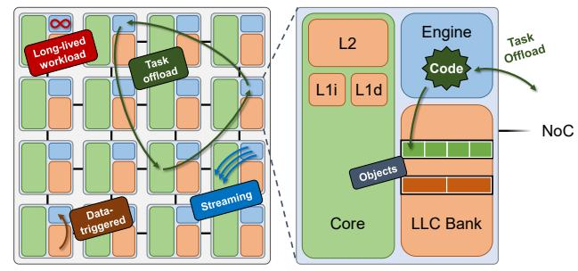
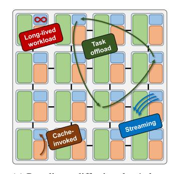
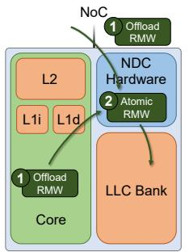
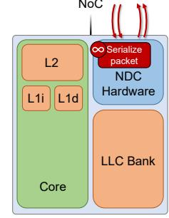
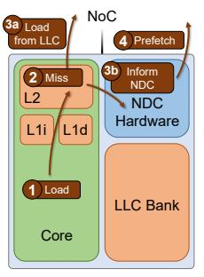
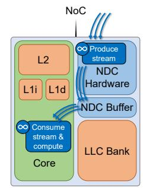
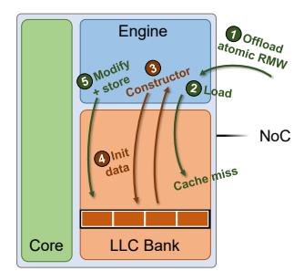
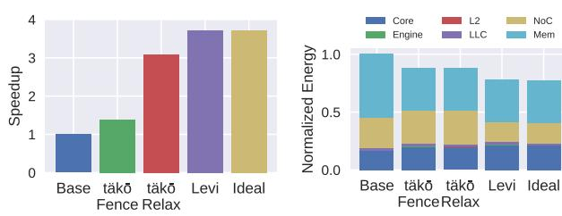

# I. INTRODUCTION

Computer systems are increasingly bottlenecked by the rising cost of data movement [20, 28, 32, 44, 84]. The inclusion of data-movement accelerators in recent commercial processors [15, 41, 72] indicates that traditional CPU scaling can no longer meet processing demands. Addressing the data-movement challenge has sparked a wave of architecture innovation on data-centric computing. A popular approach is *near-data computing (NDC)*, which reduces data movement by moving compute closer to data, unlike conventional memory hierarchies that pull data closer to compute.

Traditional near-memory NDC shows large benefits for applications with little data reuse, but it fails to exploit the locality present in most workloads. Blindly moving all compute to main memory can actually harm performance [4, 34, 47, 76, 91]. This limitation is addressed by *near-cache* NDC [1, 2, 5, 6, 8, 18, 22, 24, 33, 37, 38, 42, 43, 47, 48, 52, 56, 57, 64, 66, 69, 74, 77, 85, 88–90, 92–95], which augments a cache hierarchy with processing capability. Near-cache NDC allows systems to move compute closer to data while also exploiting locality, unlocking the full potential of data-centric computing. *The problem: Prior NDC is too limited and hard to use.* Despite the large benefits promised by NDC, there remain significant roadblocks to its practical adoption in generalpurpose systems. Most proposals target a narrow range of



Fig. 1: We divide prior near-data computing (NDC) into four paradigms. Leviathan supports all paradigms, executing code on near-data engines at the time and location dictated by the paradigm. Programmers write Leviathan programs via a simple reactive-programming interface, and Leviathan hardware ensures that objects are efficiently packed within cache banks.

application domains and only support a subset of NDC's design paradigms (Table I). But it is not scalable or practical to add new hardware for every potential application domain. Some recent work has started to address this challenge via *programmable* NDC, where software can configure the operations that execute near data [6, 11, 47, 54, 66, 79, 81, 90]. However, *existing programmable NDC is still insufficient because it only targets a limited subset of the broad NDC design space.*

Beyond limited scope, prior designs also expose too many microarchitectural details to the programmer. Specifically, since existing NDCs rely on the underlying caches or DRAM for data storage, their designs often require data to fit within and align to cache lines [18, 31, 47, 52, 66, 94, 95]. Exposing such microarchitectural details to software, let alone forcing programmers to reason about them, increases programming difficulty and makes NDC unapproachable.

*Opportunity and insight.* We observe that neither of these issues is fundamental to NDC. With the goal of designing a practical NDC system, we first perform an extensive study on prior NDC proposals and build a taxonomy that captures their similarities and differences (Sec. II). We find that *prior designs largely fall into only one of four main paradigms* (Fig. 1), but *many applications require multiple paradigms to see the full benefits of NDC.*

Prior work has treated each paradigm separately, but we observe that a similar structure underlies them. Each paradigm can be roughly broken down into three components: *what* to execute, *where* to execute, and *when* to execute. By placing general-purpose hardware near caches, programmable NDC addresses "what," but "when" and "where" remain unsolved.

<sup>∗</sup>This work was completed while the author was affiliated with Carnegie Mellon University.

```
1 class Actor: # Combines data and near-data action
2 int data
3
4 # Action executes near ''data'' in the hierarchy
5 void action(int update):
6 atomicAdd(data, update)
7
8 # Core offloads an action to execute on an ''actor''
9 invoke actor->action(newUpdate)
```

Fig. 2: Example implementation of a remote memory operation (RMO) in Leviathan using the actor interface. The actor encompasses a near-data action and the data which the action accesses. A core (or other action) explicitly invokes the action to execute near the data.

A system can support all paradigms only if it has flexibility to trigger computation at the right time and place.

The other challenge is to avoid exposing microarchitectural details to the programmer. The main issue is that NDC requires data to be entirely within a single cache bank to maximize locality. Prior work put this burden on the programmer [18, 31, 47, 52, 66, 94, 95], requiring them to be aware of and optimize for the cache microarchitecture, but this need not be the case. Instead, the programmer can tell the NDC system the structure of its data, and the system itself can optimize locality.

Our approach. We propose Leviathan, a polymorphic cache hierarchy that unifies a wide range of prior NDC designs under a simple, actor-based reactive-programming interface. Fig. 1 illustrates a Leviathan system executing exemplar NDC workloads from each paradigm in our taxonomy. Task offload involves short tasks explicitly invoked by a core (or another NDC action) to execute near a target object in the hierarchy. Long-lived workloads perform large tasks independently from cores and run near memory or cache to avoid polluting cores' caches. Data-triggered actions are implicitly executed on objects as they move through the cache hierarchy. And streaming allows a decoupled, near-data producer to continually feed a core with data.

To support all paradigms, Leviathan provides a reactive-programming interface. In actor-based reactive programming, an *actor* is an *object* associated with specific *actions* that are invoked by external triggers [61]. In Leviathan, actions are NDC functions executed near data in response to paradigm-specific triggers. Fig. 2 shows an example actor which implements a remote memory operation (RMO). The actor includes the data to be accessed and a function that implements the desired RMO (atomic add in this example).

Leviathan provides data locality transparently to programmers. Leviathan can manage data itself because it knows an action's access granularity — i.e., the actor's object. Leviathan's memory allocator ensures that objects are located entirely within one cache bank to maximize locality (right of Fig. 1).

Leviathan hardware takes inspiration from prior NDCs that incorporate programmable compute within the cache hierarchy [11, 47, 66, 80] by distributing *near-data engines* to execute actions on actors. The engines also contain hardware scheduling logic that, in combination with microarchitectural support in the cores and caches, execute code near data at the right time and place. We explain how each NDC paradigm maps to a combination of actions and triggers, and describe

the necessary runtime and microarchitectural support.

The end result is a polymorphic cache hierarchy that *unifies prior NDC systems* on the same hardware while providing a *simple-to-use programming interface. Leviathan is the first system to support all NDC paradigms.* Unifying all paradigms in a single system is essential to reach the true potential of NDC, particularly on applications that require multiple paradigms (see Sec. IV).

Contributions. This paper contributes the following:

- NDC taxonomy. We analyze prior NDCs to identify their similarities and differences. This leads us to the necessary mechanisms for a practical, unified NDC system.
- Programming interface. We propose a simple and flexible reactive-programming interface which allows programmers to implement a wide range of NDC applications without worrying about hardware details.
- Architecture. We propose a single architecture that supports all four NDC paradigms and provides microarchitectural support to control data placement so that objects reside entirely within the same cache bank.
- *Evaluation*. We demonstrate Leviathan's benefits through four diverse case studies, across which Leviathan provides  $1.5 \times -3.7 \times$  speedup and 22% -77% energy savings.

Summary of results. We evaluate Leviathan on four case studies to demonstrate (i) the importance of supporting multiple NDC paradigms on a single system, (ii) the ease of developing a Leviathan application with its unified programming interface, and that (iii) Leviathan improves performance while hiding microarchitectural details from the programmer.

- Commutative scatter-updates: Leviathan implements PHI [52], an accelerator which uses multiple NDC paradigms to improve the performance of commutative scatter-updates in graph applications. Leviathan is the first system to provide all the necessary NDC support in a general-purpose way, achieving 3.7× speedup.
- Near-cache data transformation: Leviathan decompresses objects as they move through the hierarchy. Leviathan's programming interface abstracts away microarchitectural details to handle objects of any size without added programming complexity, and Leviathan achieves 2.4× speedup.
- Hash-table lookups: Leviathan reduces on-chip network overheads when traversing hash-table buckets by accelerating lookups near cache. Leviathan performs well across a wide range of object sizes, achieving up to 2.0× speedup.
- Decoupled graph traversals: Leviathan implements HATS [51], a complex decoupled streaming application, achieving 1.7× speedup. Leviathan's streaming interface allows arbitrary data access patterns, unlike prior affine-based designs [80, 81], and its stream interface is much simpler to program and more effective than prior general-purpose NDC designs that do not explicitly support streams [66].

Leviathan adds just  $\approx\!6\%$  area overhead compared to a baseline multicore's last-level cache, similar to prior NDC systems, and achieves performance within 4.8% of using an idealized near-data engine.

TABLE I: Taxonomy of prior work on near-data computing (NDC) within the memory hierarchy.

| NDC paradigm           | Small tasks? | Talks to cores? | Prior work                                                                                                                                                                                                       |
|------------------------|--------------|-----------------|------------------------------------------------------------------------------------------------------------------------------------------------------------------------------------------------------------------|
| Task offload           | ✓            | ✓               | Remote memory operations (RMOs) [39, 67], Minnow [89, 90], hash tables [95], memoization [94], BSSync [43], pointer chasing [31, 35], data remapping [7], Compute Caches [1], Livia [47], Dist-DA [11]           |
| Long-lived workloads   | X            | X               | PageForge [71], SerDes [37, 58], garbage collection [48], COREx [26]                                                                                                                                             |
| Data-triggered actions | ✓            | ×               | Prefetching [5, 6, 74, 88], compression [8, 24, 56, 57, 64, 77], HTM [92], coherence and synchronization [2, 22, 33, 42, 59, 69, 85, 93], Impulse [18], Relational Memory [62], Tvarak [38], PHI [52], täkō [66] |
| Streaming              | X            | ✓               | Stream Dataflow [54], Stream ISA [79], Stream Floating [81], Near-Stream Computing [80], Task Stream [19], Infinity Stream [78], HATS [51], SpZip [86], Cohort [82]                                              |



(a) Paradigms differ in *when/where* actions execute as well as communication patterns with cores.



(b) Task offload: cores push short operations to caches, e.g., atomic add.



(c) Long-lived: near-data thread avoids cache pollution, e.g., serialization.



(d) Data-triggered: compute when data moves, e.g., prefetching.



(e) Streaming: caches push data to cores, e.g., CSR traversal.

Fig. 3: Breakdown of NDC taxonomy across paradigms.

#### II. BACKGROUND

With the goal of developing a unified NDC system (Fig. 3a), our first step was exploring the diverse prior work on near-data computing. We found that prior designs largely fall into one of four main paradigms:

- Task offload. A core explicitly offloads a small amount of work into the memory hierarchy (e.g., atomic read-modifywrite) and often expects a response quickly.
- Long-lived workloads. A long-lived thread runs within the memory hierarchy, typically processing a large amount of data (e.g., packet serialization) without frequent communication to or from cores.
- Data-triggered tasks. Computation is triggered when data moves through the hierarchy (e.g., prefetching). Tasks are short-lived and do not communicate at all with cores.
- *Streaming*. A near-data producer generates a stream of data to be processed by a separate consumer (e.g., decoupled access-execute). Tasks are long-lived and communicate continuously with cores.

Table I provides examples of recent NDC designs and where they fit in this taxonomy.

#### A. A Taxonomy of Near-Data Computing

Task offload. Task offload encompasses designs where a core or other near-data task offloads a small amount of work into the memory hierarchy to execute closer to a specific piece of data. The traditional example is remote memory operations (RMOs), where a core requests a single atomic operation to execute directly on the data within the cache or main memory [39, 67] (Fig. 3b). This avoids the expensive

ping-ponging of data between cores for heavily shared data. Over time, offloaded tasks have become increasingly complex, potentially involving many operations, multiple locations in the memory hierarchy, and tasks spawning additional tasks (e.g., for pointer chasing [31, 35]). A major challenge in these designs is dynamically determining the right location to execute a task; e.g., where is the data *now*?

Long-lived workloads. In contrast to task offload, long-lived workloads execute long computations that operate on large amounts of data. They run independently of cores without direct communication (Fig. 3c). Typically, applications in this paradigm perform some background processing and run low in the cache hierarchy to avoid polluting private caches. One example is serialization/deserialization (SerDes), where an object is transformed near memory while the core continues to operate asynchronously [37, 58]. Long-lived workloads often want to execute at a fixed location in the memory hierarchy (e.g., LLC or memory controller). Accordingly, the system needs to allow software to request a specific location for execution.

Data-triggered actions. These are actions triggered implicitly by data movement within the memory hierarchy, not explicitly by software. Typically, the triggering mechanism is when data is inserted in or evicted from a cache bank. A popular example is hardware prefetching (Fig. 3d), where the prefetcher monitors cache misses and optionally triggers additional data requests before the underlying core needs the data.

The benefits of data-triggered actions are increased visibility and control over data movement. For example, hardware compression has been proposed to decompress data as it moves from main memory to the core, improving the effective capacity of main memory while avoiding the need to decompress data on cache hits [8, 24, 56, 57, 64, 77].

The unique characteristic of data-triggered actions is that they execute when data moves, which is traditionally invisible to software. Hardware support is required to trigger actions when data moves across levels of the memory hierarchy.

*Streaming.* Streaming is when applications access data in a pattern that can be decoupled from other application logic. Typically confined to simple affine patterns, recent work has proposed general-purpose streaming engines [54, 79–81] and sophisticated stream logic that supports complex, irregular access patterns [51, 88]. The benefits of streaming are that the stream producer can run ahead of the consumer to hide memory latency, control flow is regularized on the consumer, and stream generation can often use simplified hardware logic.

The unique characteristic of streaming as an NDC paradigm is that the stream is long-lived within the memory hierarchy *and* communicates frequently with cores (Fig. 3e), pushing data and waiting for an acknowledgment that data has been consumed. Streams benefit from explicit ISA support for this frequent communication [79].

## *B. Applications need multiple NDC paradigms*

Fig. 3 separates the four NDC paradigms, but they often interact and do not operate independently. Prior work shows significant benefits from combining multiple paradigms.

PHI [52], discussed further below (Sec. IV), combines task offload and data-triggered paradigms. PHI offloads atomic updates near data (task offload) to avoid ping-ponging of data between private caches, which is important because frequent, concurrent updates are expected. It also modifies cache insertion and eviction (data-triggered) to initialize data and decide upon eviction how to apply updates, saving memory bandwidth.

Similarly, Near-Stream Computing (NSC) [80] combines both task offload and streaming. NSC observed that it is more efficient to process stream output near the cache than on a core. So NSC offloads tasks to the stream's location, reducing data movement and avoiding pollution of cores' private caches.

Finally, Dist-DA [11] provides a flexible design for supporting task offload and long-lived workloads by providing a common mechanism for cores to offload work near caches.

### *C. Limitations of prior work*

Despite providing large benefits, prior NDC designs suffer two major deficiencies: *scope* and *software abstraction*. They benefit too few applications to justify integration in a generalpurpose system, and they expose inessential hardware details to software, complicating the programming interface.

*Limited scope.* Every NDC design requires new hardware and interfaces across the system stack. The simplest designs are ISA extensions that enable single operations on cached data (e.g., RMOs); these are broadly useful and easy to implement. However, more complex tasks (e.g., SerDes) cannot be efficiently reduced to RMOs and require much more disruptive changes that benefit fewer applications. Recent programmable designs require the most disruptive changes of all and still only target a subset of the NDC design space [6, 11, 47, 54, 66, 79, 81, 90]. Many only support a single paradigm: e.g., task offload [47], streams [54, 79, 81], or datatriggered [6, 66, 90]. A few support two paradigms (Sec. II-B), but *no prior NDC system supports all paradigms*.

To justify the cost of adding new features to a generalpurpose processor, features must benefit a wide range of applications. It is simply infeasible to re-design hardware and software for every potential application of NDC. However, that is exactly the trend in prior work (accelerators for graphs, compression, etc), and the reason it is unlikely to see widespread adoption.

*Poor hardware abstraction.* One of the consistent lessons in the history of computer architecture is the importance of *ease of programming* to the real-world success of hardware. Hardware details are typically abstracted away from application software, so that the programmer can focus on developing application features and only rarely worry about microarchitecture for performance-critical code. Exposing microarchitectural details, such as the cache's line size, is unnatural for a programming interface, but that is exactly what prior work on NDC does.

Since near-cache NDCs are co-located with cache banks, it is highly desirable for an action's data to reside entirely in one cache bank or tile. Prior NDCs have placed that burden on the programmer, forcing applications to properly align and pad data to cache lines or suffer massive performance penalties [18, 31, 47, 52, 66, 94, 95]. This low-level programming interface limits NDC to a narrow subset of programmers and adds burden when porting code across microarchitectures.

*Incompatibility of programming interfaces.* Prior NDC interfaces are ad hoc and make paradigms mutually incompatible. For a rough analogy, task-offload is akin to calling a function; long-lived is like spawning a thread; data-triggered is like registering an interrupt handler; and streaming is like opening a network socket. These are all different beasts. We aim to bring them under one roof and let them work together, which is essential for applications that require multiple paradigms and to enable rapid exploration of different paradigms.

## *D. Actor-based reactive programming*

Reactive programming is a model for designing event-driven applications [10]. While traditionally geared towards largescale distributed applications [61], reactive programming can be a good fit for any application that breaks down into units of work that often execute asynchronously from each other. Accordingly, we find that reactive programming enables a clean description of NDC functions.

There are different variations of reactive programming, including, but not limited to, actor-based [29, 61], objectoriented [63, 65], functional [25], and imperative [23]. In actorbased reactive programming, messages are sent to actors to trigger actions on the actors' data. Each NDC paradigm involves triggering actions, typically on a specific piece of data, which aligns with the design of actors. Also, the flexibility permitted in message creation (e.g., core-triggered vs. data-triggered) and composition (e.g., variable number of arguments) enable all

TABLE II: Actions associated with each NDC paradigm.

| Paradigm       | Actions                           |
|----------------|-----------------------------------|
| Task offload   | Arbitrary actor-specific function |
| Long-lived     | Arbitrary actor-specific function |
| Data-triggered | Actor constructor & destructor    |
| Streaming      | Actor-specific producer function  |

NDC paradigms to fit within the model. Consequently, we find that actor-based reactive programming is a good fit for unifying NDC paradigms.

### III. LEVIATHAN OVERVIEW

Leviathan's goal is to provide a polymorphic cache hierarchy that *unifies prior NDC paradigms* and *is easy to program*. Like recent programmable NDC systems [6, 11, 47, 54, 66, 79, 81, 90], Leviathan adds general-purpose engines near the cache banks of a multicore, letting software run arbitrary compute near data. To support all four NDC paradigms, Leviathan further adds microarchitectural support to execute software at the right time and place. And Leviathan exposes all this capability to programmers via a simple programming interface that hides unnecessary microarchitectural detail from software.

*Programming interface.* The programming model comprises an object-oriented memory allocator and an actor-based interface for each of the NDC paradigms. Each paradigm operates on actors provided by the allocator to ensure that Leviathan maintains intra-bank data locality.

NDC paradigms mainly consist of three components: *what* action to execute, *when* to execute it, and *where* to execute it. In Leviathan, the application provides the actions to execute and indicates the NDC paradigm to use. It is the responsibility of Leviathan's runtime and hardware support to correctly execute the action, depending on the paradigm.

Table II breaks down the actions associated with each paradigm, and Fig. 2 gives pseudocode for an example taskoffload actor. Task offload and long-lived workloads both involve actor-specific actions explicitly triggered by a core or another near-data action, so Leviathan needs to execute the action when requested at the appropriate location. Datatriggered NDC involves two actions — actor constructors and destructors — that are triggered on specified actors when they are either inserted in or evicted from the cache. And streaming involves a producer (long-lived workload) and consumer (regular thread) along with additional support to push and pop objects from a shared communication channel. *Hardware.* On top of a baseline, cache-coherent multicore, each tile is augmented with a near-data engine (Fig. 1). The commonality across NDC paradigms is executing an application-defined action on a specified object, so Leviathan's engine contains a lightweight, programmable processor to execute actions. The difference across paradigms is the *way in which actions are triggered*. This is handled by the engine's hardware scheduler, which provides microarchitectural support for each paradigm. The other main engine components are a small, coherent cache and a task-context buffer to manage local state for currently running actions. Additional minor support is also added to the cores and caches.

## IV. MOTIVATION

We demonstrate the power of a unified NDC system by implementing a design that requires functionality from multiple paradigms. Leviathan's unification of all four paradigms is essential to providing a truly polymorphic cache hierarchy.

## *A. Accelerating commutative scatter-updates*

PHI [52] is a push-based cache hierarchy optimized for commutative scatter-updates, e.g., in graph applications. In PHI, the cache is a large write-combining buffer for commutative operations (e.g., addition) that contains partial updates (i.e., deltas) instead of raw data. When cache lines are evicted, PHI either immediately applies the updates in-place or logs them for later processing [14, 40], dynamically choosing the policy that minimizes memory bandwidth.

PHI spans multiple NDC paradigms. PHI's key mechanism is data-triggered: PHI changes cache insertion to initialize lines and changes eviction to perform updates in-place or log them. However, a large portion of PHI's benefits come from task offload by using remote memory operations (RMOs) [39, 67] to execute read-modify-write (RMW) operations within the cache. Offloading RMW operations to the shared cache both reduces ping-ponging of data between cores and avoids expensive fenced atomics on the cores. This aspect of PHI is not emphasized in prior work, which assumed that the cache supports whichever RMOs are needed. Given the diversity of graph applications [13], *it is essential that NDC systems support multiple paradigms* to make techniques like PHI practical.



Fig. 4: Leviathan implements PHI [52] by enabling multiple NDC paradigms to work together. The figure demonstrates how an offloaded RMW task leads to a data-triggered action that implements PHI's insertion semantics. A similar process happens on cache evictions.

## *B. Leviathan's implementation of PHI*

Fig. 4 illustrates Leviathan's implementation of PHI, where task offload and data-triggered actions work together to treat the LLC cache as a write-combining buffer. 1 A core offloads a RMW task to this LLC bank to perform an atomic RMW on an object; e.g., updating a vertex's rank in PageRank (see Fig. 2 for pseudocode). 2 The RMW task loads an object which is not cached. 3 The cache miss triggers an insertion action; several objects are packed into one cache line. 4 The insertion action (i.e., object constructor) initializes each object with zero and completes the cache insertion. 5 The RMW task now updates the object.

As long as the objects remain cached, subsequent RMW tasks will directly update the same objects without triggering further insertion actions. And when the objects are finally evicted, the destructor action will either update the values in-place, or log them for later (not shown).

#### C. Why Leviathan?

PHI's proposed design requires significant hardware and software changes to a multicore system to benefit a single application domain. Cache-triggered operations, RMOs, and a new CPU instruction are all needed to support just a subset of graph processing applications. No prior general-purpose system can fully support PHI's design. Leviathan's multiparadigm design makes it the only general-purpose system that can implement PHI, along with other multiparadigm NDCs.

#### D. Evaluation

We evaluate Leviathan to demonstrate the benefits of multiparadigm support. The comparisons are a baseline implementation of push-based PageRank and täkō's [66] implementation of PHI. täkō is a programmable NDC for **data-triggered actions**. Since täkō does *not* support task offload, it approximates RMOs by assuming *cores* support atomic instructions without memory fences (i.e., relaxed atomics [9, 70]). We evaluate täkō with and without relaxed atomics to demonstrate the importance of this dimension of PHI.



Fig. 5: PHI results for PageRank on a 4M vertex, 40M edge synthetic graph. Leviathan improves performance by  $3.7\times$ .

Fig. 5 shows results for PageRank with 16 threads. (Methodology in Sec. VII.) Leviathan achieves  $3.7\times$  speedup, whereas täkō gets  $3.1\times$  speedup with relaxed atomics and  $1.4\times$  without. Leviathan also reduces energy by 22%, vs. 12% for täkō. Finally, Leviathan comes within 1.3% speedup and energy of an idealized engine, demonstrating that Leviathan's modest engines are sufficient for performant NDC.

Leviathan achieves its benefits by (i) reducing memory accesses with data-triggered actions; (ii) eliminating memory-fence overheads with task offload; and (iii) reducing NoC traffic with task offload. Both Leviathan and täkō reduce memory accesses by conditionally binning updates on cache evictions using data-triggered actions. The benefit of eliminating memory fences is shown by comparing täkō Fence and täkō Relax. Fences serialize memory accesses and impose a severe performance penalty; relaxed atomics are essential for täkō to realize large benefits. Meanwhile, Leviathan simply offloads tasks near data, eliminating the need for relaxed atomics while also reducing NoC traffic by 40% vs. täkō. These benefits are unachievable in täkō because it does not support task offload. Discussion. All in all, Leviathan's ability to support multiple NDC paradigms enables a variety of performance optimizations

that are unsupported by prior NDC systems. Leviathan is the

only multi-paradigm, general-purpose NDC system, and thus

the first truly polymorphic cache hierarchy.

