# V. LEVIATHAN PROGRAMMING INTERFACE

Leviathan's programming interface works to overcome the two major limitations of prior work: *scope* and *hardware abstraction*. Leviathan extracts the commonalities across NDC paradigms while supporting their differences. The commonalities are *actors* with paradigm-specific, near-data *actions* that execute asynchronously from the main thread and communicate results via *futures*. The key differences across paradigms are when and where to execute the actions. Leviathan's interface abstracts hardware by letting applications specify the data it wants to access, and then Leviathan performs all data management behind the scenes via a custom memory allocator.

#### A. Building blocks

#### 1) Actors

The underlying mechanism for implementing all paradigms is the actor model [29, 61]. An actor is an object (i.e., class) associated with one or more near-data actions (i.e., methods). Note that we distinguish "actor" and "object", where object just refers to data, because not all objects in Leviathan are actors (specifically, with streams, as discussed in Sec. V-B3).

A programmer uses Leviathan by defining an actor class which implements the necessary actions for the paradigm of interest (e.g., Fig. 2). All actor instances are allocated with Leviathan's allocator (Sec. V-A3) so that data management is hidden from the application. Near-data actions are then executed on allocated actor instances at a time and place in the cache hierarchy according to the designated NDC paradigm.

## 2) Communicating results with Futures

```
1 class Future<R>:
2 R wait() # for receiver
3 void send(R result) # for sender
```

Fig. 6: Leviathan's Future interface.

Task offload and streaming require the ability to communicate results from near-data actions back to a core. For this functionality, Leviathan provides a Future<R> (Fig. 6) which is filled with an object of type R from an action running asynchronously from the core. To receive a result, the core simply waits on the Future<R> until the object is available.

#### 3) Memory allocator

The purpose of Leviathan's memory allocator is to abstract away microarchitectural details so that the application can specify the actors it wants to operate on, and Leviathan manages packing and padding of their data into cache lines.

```
1 class Allocator<T>:
2 T* allocate()
3 void deallocate(T* object)
```

Fig. 7: Leviathan's object-oriented memory allocator.

Application interface. Leviathan's Allocator<T> (Fig. 7) provides simple methods to allocate and deallocate objects of type T. Depending on the NDC paradigm, applications may not use the allocator directly; data-triggered actors are allocated and freed implicitly by hardware.

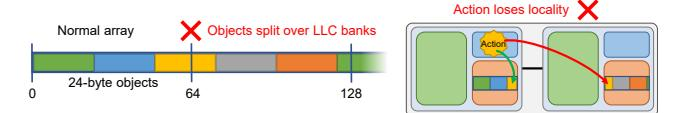

(a) Allocating a normal array of objects splits objects across LLC banks, losing data locality for NDC actions.

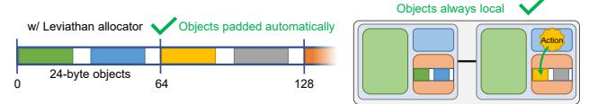

(b) Leviathan's allocator pads objects to maintain data locality for NDC actions.

Fig. 8: Padding objects in the cache is necessary to maintain data locality for NDC actions. This example demonstrates allocating 24B objects for a cache with 64B lines.

*Implementation.* The allocator has three jobs: padding objects to be cache-aligned; mapping large objects to the same LLC bank; and packing objects to not waste main memory.

Small objects. When objects smaller than a cache line do not evenly divide the line size, allocating an array of objects normally will result in some objects spanning multiple lines (see Fig. 8a). This hurts NDC because actions are forced to fetch part of the object from another cache bank, rather than finding all data locally. To avoid this issue, Leviathan's allocator pads objects to the next power-of-two size (see Fig. 8b).

Large objects. Objects larger than a cache line reside on multiple banks because consecutive cache lines typically map to distinct banks [87]. Mapping such objects to a single bank is impossible to achieve in software alone. Leviathan solves this problem by modifying the LLC's bank-index function to ignore LSBs of an address, depending on the object size, in addition to padding as described above. For example, for an object that is four cache lines in size, ignoring two  $(\log(4) = 2)$  LSBs will map all lines of the object to the same bank.

Memory compaction. Padding causes fragmentation that wastes memory. Our insight is that padding matters for NDC in the cache, but is unnecessary in memory. Leviathan thus aligns objects to cache lines in the cache, but packs them densely in memory to avoid fragmentation.

Leviathan uses a one-to-one translation between cache address and memory address, similar to a phantom address or memory overlay [18, 66, 68]. The translation is a simple computation which only requires the object size and array base address both for cache and memory (see Fig. 14). Such dynamic padding is impossible in software alone because software has no control over the cache-to-memory interface.

This design requires contiguous address ranges in both cache and memory. Accordingly, Leviathan's allocator is pool-based and allocates from a large, contiguous physical memory range. Alternatively, one could add an additional page-level translation layer between the LLC and memory at some additional overhead and complexity [68].

#### B. NDC paradigms in Leviathan

## 1) Task offload & long-lived NDC

The first NDC paradigms we discuss are task offload and long-lived workloads. We observe that, although their usage and underlying hardware can differ, the software interface is essentially the same [11]. They both involve a core or action explicitly invoking another action, be it short- or long-lived. Accordingly, we group both paradigms into a single interface with options to distinguish the aforementioned differences.

```
l class A: # example actor

U f(...) # action 1

V g(...) # action 2

# invoke creates a future, holding return value

A* a = Allocator<A>::allocate()

Future<U> u = invoke a->f(...) # location is dynamic

Future<V> v = invoke[REMOTE] a->g(...) # vs. static
```

Fig. 9: Leviathan's task offload actor interface.

Invoking tasks. Offloaded tasks operate on an object, which is expressed in Leviathan as actions on an actor. The application first allocates an actor and triggers an action using the invoke keyword (see Fig. 9), similarly to Livia [47]. In the figure, invoke offloads the method f to execute near the actor a, returning a Future<U> that is filled when the task completes.

Offloaded tasks can take any number of arguments and return any type, including void (no return value). The optional [location] parameter indicates in which level of cache hierarchy the task should execute. There are three options:

- LOCAL: The invoker's local engine.
- REMOTE: The engine near the object's LLC bank.
- DYNAMIC (default): Leviathan probes down the cache hierarchy to locate the object, and executes the task nearby. The user can also indicate a task wants EXCLUSIVE (i.e., write) permissions as hint to DYNAMIC scheduling.

Offloaded tasks can themselves invoke further tasks in continuation-passing style, eventually sending a single value back to the original caller using return (which the compiler translates into executing send on the future.

#### 2) Data-triggered actions

Data-triggered NDC interposes on cache misses and evictions to perform application-specific handling of the data being moved. As prior work identified [66], letting *software* handle insertions and evictions (instead of fetching from or evicting to the next level of the hierarchy) unlocks many NDC optimizations that otherwise require custom hardware. This "phantom" data only resides in cache and is not backed by off-chip memory [18, 66], since it is constructed when filling a cache line and destructed when evicting the cache line. Accordingly, in Leviathan, the *actors* are the phantom data themselves, and the *actions* are constructors and destructors (Fig. 11), which are invoked implicitly by the cache controller.

For example, in Leviathan's implementation of PHI (Sec. IV-B), the actor's data is initialized with zero on a cache miss and conditionally logged or written back to memory on a cache eviction. Later, in Sec. VIII-A, we will show a data-triggered constructor for near-cache data decompression.

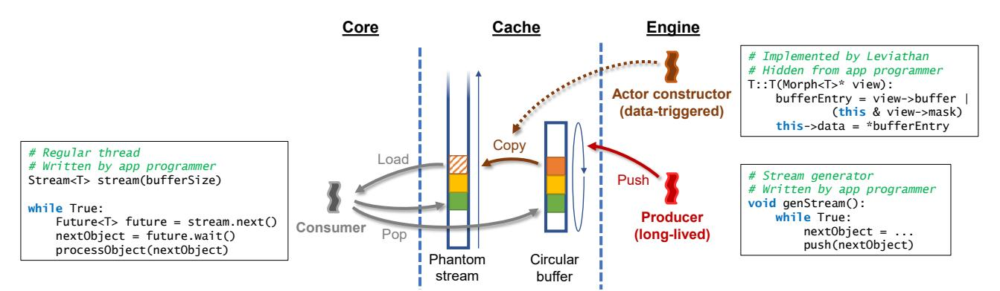

Fig. 10: Leviathan supports streaming through a combination of long-lived and data-triggered NDC. The programmer implements the producer (long-lived NDC thread) and consumer (regular thread), while Leviathan's API handles the data-triggered thread.

```
| class A: # example actor
| # actions
| A (Morph<A>* view) # constructor
| 4 ~ A(Morph<A>* view, bool isDirty) # destructor
| 5 | class Morph<T>: # T is an actor type
| 7 | TPadded* actors # base address of padded actors
| 8 | int size # number of actors
| 9 | Morph<T>[] views # per-engine local state
| 10 | T& getActor(int offset) # for use by cores
| 12 | int getOffset(T* actor) # for use by actions
| 13 | Morph<T>* register(Type morphType, CacheLevel level, int numActors) | ioud unregister(Morph<T>* morph)
```

Fig. 11: Leviathan's data-triggered actor interface.

**Registration.** Data-triggered functionality is encapsulated in a Morph object, which gathers state for an address range of phantom actors. Applications register a Morph to allocate an address range for the actors' phantom data. Actors are allocated via Leviathan's Allocator to maintain intra-bank locality. Since a Morph's address range may span LLC banks, each engine has a separate view (i.e., copy) of the Morph, which may contain engine-local state for actions running on that engine.

Actions. The two data-triggered actions are an actor's constructor and destructor (similar to täkō's onMiss and onEviction/onWriteback [66]), triggered on insertions/evictions at the registered CacheLevel. Both actions are provided a pointer to the engine's Morph::view. The destructor is also passed a boolean denoting whether the cache line(s) containing the actor is clean or dirty. The major advantage over prior work [66] is that code can be much simpler because actions execute on objects, not cache lines. The application just needs to handle construction and deconstruction of single objects, vs. worrying about layout and alignment of data within cache lines.

#### 3) Streaming

Leviathan's streaming interface takes inspiration from decoupled streaming accelerators in which a near-data thread pushes data to a core [51, 79–81, 86]. But, unlike prior work, Leviathan is not restricted to a specific data size for stream entries, and streams can execute arbitrary logic for any desired pattern (vs. pre-defined affine or indirect patterns).

Streams are essentially long-lived NDC threads, but they are

so ubiquitous and their communication pattern with cores so regular that it is worth treating them as a separate paradigm with a custom interface and architectural support. In fact, Leviathan's stream implementation uses both long-lived and data-triggered paradigms under the hood.

Fig. 10 demonstrates how Leviathan implements streaming. The crux of the stream is a long-lived thread on an engine ("Producer") that pushes new entries onto a circular buffer in shared memory. Consuming the stream, however, involves data-triggered actions ("Actor constructor") to copy the stream into a phantom address space, where it can be consumed by an application thread on a core ("Consumer"). This approach simplifies stream consumption because (i) the core merely issues sequential loads, which are prefetchable and involve very regular control, and (ii) the cache controller can easily stall phantom loads if the core runs past the end of the stream. Importantly, Leviathan's interface hides all the data-triggered details from the application, exposing only a simple Future-based API to consume stream entries.

```
1 class Stream<T> extends Morph<T>: # base class
2 # Consumer interface
3 Stream<T>(int bufferSize)
4 Future<T> next() # consume stream
5 void terminate()
6
7 # Producer interface
8 void genStream() # action: generate stream
9 void push(T object) # called by genStream, blocks
10 # when the buffer is full
```

Fig. 12: Leviathan's stream actor interface.

*Initialization.* A stream is initialized by specifying the object type and the size of the stream buffer (Fig. 12). The buffer is a circular queue in shared memory that contains objects, using the Leviathan allocator.

**Producer.** Data is pushed onto the stream by a long-lived thread, genStream, running on the tile's local engine. genStream calls push, a blocking function, to push onto the stream buffer. When the buffer is full, push blocks until the core consumes an entry.

**Consumer.** next provides a Future-T> which will contain the next stream entry when available. Under the hood, next performs two actions: (i) initializes the Future-T> with the next entry and (ii) pops the entry off the stream. To fill the

Future<T>, next loads from a phantom address range. The load causes T's data-triggered constructor to read from the stream buffer, which blocks if empty. After the load is issued, next pops the entry off the stream by incrementing the core's stream head pointer and sends a message to the engine when the head pointer has incremented to a new cache line, unblocking push to allow the producer to continue.

## *4) Leviathan supports interaction across paradigms*

One of Leviathan's major strengths is that it allows multiple NDC paradigms to directly interact with each other. We already demonstrated an example with PHI [52], which combines task offload with data-triggered actions (Sec. IV). It is possible to further combine PHI with streaming by decoupling the graph traversal from the cores to improve cache locality (see Sec. VIII-C). And Leviathan's streams themselves are implemented through a combination of long-lived workloads and data-triggered actions. Leviathan is the first system to support all paradigms, and its interface is carefully designed to enable interaction across paradigms.

### VI. LEVIATHAN ARCHITECTURE

Leviathan's hardware support includes a near-cache engine for executing each NDC paradigm's actions along with core, cache, and memory-controller modifications to assist in both executing actions at the right time and place, and managing object placement throughout the memory hierarchy.

### *A. Shared infrastructure*

### *1) Near-cache engines*

Similar to recent NDC architectures [6, 47, 55, 66, 81, 90], Leviathan extends a baseline multicore processor with near-cache engines (Fig. 13). The compute logic, which can be any programmable resource (e.g., core, FPGA, dataflow fabric), executes all application-provided NDC actions. We evaluate Leviathan with dataflow fabrics due to their high performance-perarea on short, repeated functions [66]. The L1d and TLB

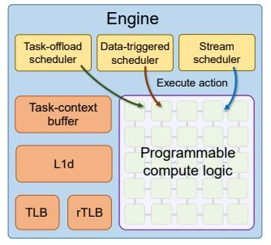

Fig. 13: Each near-cache engine contains programmable compute to execute actions, a task context for each running action, schedulers for each NDC paradigm, and an L1d, TLB, and rTLB.

give engines coherent access to the shared memory space.

Engine L1ds are implemented using clustered coherence within each tile to avoid increasing the LLC's directory state [16, 27, 45, 49]. The engine L1d and L2 on the same tile both snoop on coherence traffic within the tile so that they look like one combined cache to the LLC directory.

The rTLB (reverse TLB) translates cached physical addresses back to virtual addresses, and it is needed specifically for data-triggered actions. Cache insertions and evictions trigger the actions, but whereas the caches operate on physical addresses, actions are user-space functions that operate on

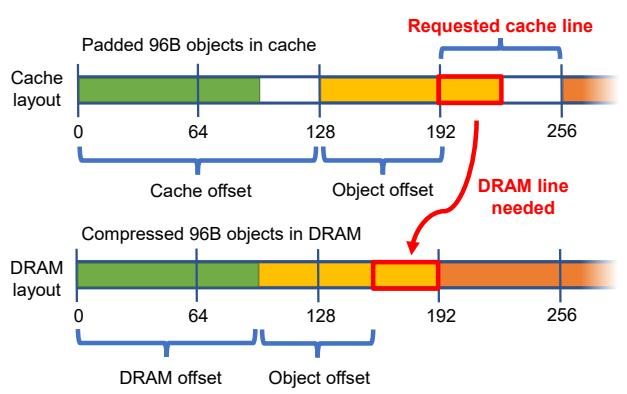

Fig. 14: Leviathan pads objects in the cache but stores them compressed in DRAM. Simple computation translates between the cache and DRAM addresses for an object.

virtual addresses. Leviathan's engines require an object's virtual address before invoking its constructor or destructor.

Finally, a task-context buffer stores local state for all executing actions. To prevent deadlock, there must always be at least one task context not reserved by an offloaded task. Otherwise, all tasks might be waiting for a data-triggered constructor to execute, but the constructor is waiting for a free context. In our evaluation, we evenly split contexts between offloaded and data-triggered actions.

## *2) Support for* Future*s*

The Future::send function communicates a result from a near-data task to the thread waiting on the future through a store-update instruction [30, 47]. store-update, which executes on an engine, sends a message containing the future pointer and value over the NoC to the waiting thread. The message instructs the thread to perform the store itself so that the result becomes immediately available without waiting for any additional coherence traffic.

### *3) Support for data mapping and packing*

There are three main hardware mechanisms in support of Leviathan's data management: LLC object mapping, DRAM object compaction, and a memory controller cache.

*LLC object mapping.* As discussed in Sec. V-A3, it is important for objects larger than a cache line to map entirely to the same LLC bank. Thus, Leviathan modifies the input to the index function such that every cache line of an object provides the same input. This is accomplished by zeroing out the LSBs of the address that equate to the object offset (e.g., for objects spanning two cache lines, zeroing out one LSB is sufficient).

In our evaluation, Leviathan supports objects up to four cache lines in size (see Sec. VI-C), so two bits are needed to indicate the number of LSBs that should be ignored. Page table entries and L2 tags are augmented with these two bits, which are passed along with cache requests up to the LLC.

*DRAM object compaction.* Although we pad objects in the cache to improve locality, we do not want to waste DRAM capacity. Prior NDCs required software to manually pad data, leading to an unattractive tradeoff between locality and memory fragmentation. However, since Leviathan has full control over

TABLE III: Per-paradigm microarchitecture support across the system.

| Paradigm       | Core                  | Cache    | Engine                      |
|----------------|-----------------------|----------|-----------------------------|
| Task offload   | invoke instr & buf    | N/A      | DYNAMIC scheduling          |
| Data-triggered | flush instr, TLB bits | tag bits | actor buffer, vtable map    |
| Streaming      | pop instr             | N/A      | push instr, stream metadata |

data management, it can eliminate DRAM fragmentation with minor hardware support, invisibly to applications.

On an LLC miss or writeback, the LLC controller checks a small translation buffer to determine if the address needs translating. Fig. 14 shows the breakdown for determining the DRAM address of an object based on its cache address. Since all objects of a given type are addressed contiguously both in the cache and DRAM (see Sec. V-A3), the translation is simply a matter of calculating offsets, which adds no latency by running in parallel with the LLC tag lookup. Each translation buffer entry contains the cache address base and bound, DRAM address base, and object size, totaling 25 B.

*Memory controller cache.* Because we store objects compacted in DRAM, lines fetched from DRAM will frequently contain portions of multiple objects. For example, see the second DRAM line in Fig. 14. When an application iterates through objects sequentially, loading the second and third *cache* lines will both incur a memory access to the same *DRAM* line. To alleviate these excess DRAM accesses, we place a small FIFO cache (32 lines) at each memory controller. This small cache can reduce DRAM accesses by up to  $\approx 3 \times$ .

#### B. Support for NDC paradigms

Table III breaks down the microarchitecture additions that support each paradigm, which are explained as follows.

## 1) Task offload

**invoke.** A new ISA instruction corresponding to the invoke function is added to the cores. If the location is designated as LOCAL, then the core sends a message to the engine on the local tile; if it is REMOTE, then the core maps the object pointer to its LLC bank and sends a message to its engine.

If the location is DYNAMIC, then invoke dynamically locates the actor in the cache hierarchy [47]. invoke first probes the L1D and executes the action locally if the data is cached. Otherwise, invoke sends a packet containing a data pointer (actor), function pointer (action), flags, and arguments to the local engine, whose task-offload scheduler checks whether the actor is cached in the local L2. If so, the L2 engine executes the action, otherwise it forwards the packet to the actor's LLC bank. If the invoke has the EXCLUSIVE flag, then the LLC engine checks whether another L2 already has exclusive permissions in the directory, and forwards the packet to the remote L2 if so. Otherwise, the LLC engine executes the action.

**Backpressure.** Each core contains a small "invoke buffer" to apply backpressure when cores offload tasks faster than they can execute. The invoke buffer is similar to a store buffer: task-offload requests first enter the invoke buffer and drain to engines. If a task-offload request arrives at an engine with no space in its task-context buffer, the engine NACKs the invoke,

spilling the task back to the core [47]. Otherwise, the engine ACKs the request, and it is removed from the invoke buffer. Finally, invoke instructions cannot commit in the core until there is space in the invoke buffer. However, when offloaded tasks include a Future, the invoke buffer is skipped because waiting on futures generally provides sufficient backpressure.

Migrating data. In order to allow objects to settle at their natural location in the cache hierarchy, whenever a DYNAMIC task would be executed remotely, the scheduler will instead with small probability (1/32) execute locally to pull the data up the hierarchy. This allows objects with high temporal locality to gradually move to the private caches.

#### 2) Data-triggered actions

Data-triggered actions are executed *when* and *where* data moves, so most of the changes are in the cache controllers. The data-triggered scheduler in the engine manages a buffer containing the actors with pending actions, since the actors cannot be accessible by any other threads during that time. The scheduler also contains a small cache that maps address ranges to their associated actions, i.e., the Morph's vtable.

Core modifications. One new flush ISA instruction is required for sending a message to the caches to flush the objects in a Morph's address range when unregistered. Additionally, two extra bits are added to TLB entries to indicate (i) whether a Morph is registered on the data, and (ii) if so, whether the location is L2 or LLC.

Cache modifications. Cache requests are augmented with the two TLB bits indicating if a cache miss should trigger the data's constructor at the L2 or LLC, respectively. The L2 and LLC tags are augmented with one extra bit to indicate whether the destructor should trigger on eviction.

With this extra information, the cache controller triggers actions when data is inserted or evicted. For small objects, the scheduler executes the actions on all the objects within the line in parallel. For large objects, only one action is triggered, which inserts (or evicts) multiple lines at once. Construction inserts multiple lines to fit the entire object, and destruction evicts all lines corresponding to the object.

#### 3) Streams

As discussed in Sec. V-B3, whereas the stream's data is stored in a circular buffer in shared memory, the core reads from the stream by accessing a contiguous phantom address range that maps to the buffer through data-triggered actions. Managing the stream and buffer involves support at both the core (consumer) and engine (producer).

Core modifications. Streams require a new ISA instruction to pop the stream in Stream::next. pop increments a register containing the head pointer for the phantom stream. When the head pointer increments to a new cache line, it sends a request (a new message type) to the local engine (where the stream is generated) to bump the stream's head pointer forward. The request also invalidates the old stream head at the L2 since it will not be used anymore.

TABLE IV: Hardware overhead (state per LLC bank).

| LLC tags<br>LLC translation buffer<br>Engine L1d, TLB, rTLB<br>Data-triggered buffer<br>Dataflow fabric [66] | 8K lines × 3 bits = 3 KB<br>8 entries × 25 B = 200 B<br>8 KB + 2 KB + 2 KB = 12 KB<br>16 objects × 256 B = 4 KB<br>13.6 KB |
|--------------------------------------------------------------------------------------------------------------|----------------------------------------------------------------------------------------------------------------------------|
| Total per LLC bank                                                                                           | 32.8 KB / 512 KB = 6.4%                                                                                                    |
|                                                                                                              |                                                                                                                            |

*Engine stream scheduler.* For each active stream, the engine needs to track the buffer size and phantom head/tail pointers. The tail pointer is used to stall the core if it loads data after the tail (i.e., stream entries not yet pushed), and the head pointer is used to NACK prefetches and throw exceptions on loads to data before the head (i.e., stream entries already popped). When the core sends a pop message, the head is incremented, and, if an NDC action is blocked on push, it is unblocked.

*Deadlock prevention.* Out-of-order cores must be careful to avoid deadlock with streams. Speculatively reordered loads could reserve all L1 MSHRs, without any load able to proceed if they all are past the end of the currently generated stream. This condition is rare, but possible in principle. To prevent this, systems could NACK speculative loads to addresses past the end of the current stream buffer, and re-execute them on commit, when they must point to the current stream head.

## *C. Handling very large objects*

Leviathan can only support objects up to a microarchitecturally defined size, as it is impractical to support individual objects of many KBs, MBs, or GBs with lightweight hardware extensions. (Supporting larger objects requires larger buffers and metadata state.) It is also impossible to preserve the benefits of near-cache NDC as object sizes continue to scale.

Without requiring any changes to the programming interface, Leviathan offers a functionally correct fallback implementation of each NDC paradigm for arbitrary object sizes. Task offloading works like normal, except the allocator just resorts to malloc, so objects are spread across LLC banks and padded in DRAM. For data-triggered actions, all constructors are triggered on the core when a page of objects is paged in, and destructors are triggered on the core when paged out. For streams, the producer and consumer are spawned as conventional threads with a message-passing queue between them.

In our evaluation, we present hardware overheads with support for up to 256 B objects (i.e., four cache lines), which is more than sufficient for our case studies.

## *D. Putting it all together*

Leviathan adds relatively small area overheads to a baseline multicore. The total per-tile storage cost, when modeling a dataflow fabric with parameters from prior work [66], totals 32.8 KB, or 6.4% compared to the data array of an LLC bank (Table IV). This is similar to recent work [53, 60, 66, 83].

Importantly, Leviathan's hardware additions do not impact the performance of non-NDC workloads. We consciously designed Leviathan to be minimally disruptive to the baseline system and have negligible impact on non-NDC workloads

TABLE V: System parameters in our experimental evaluation.

| Cores   | 16 cores, x86-64 ISA, 2.4 GHz, OOO Skylake<br>µarch [3], 4-entry invoke buffer                                            |  |  |  |
|---------|---------------------------------------------------------------------------------------------------------------------------|--|--|--|
| Engines | 16 engines, dataflow fabric, 15 int FUs (1-cycle<br>latency), 10 mem FUs, 8 KB L1d, 256-entry rTLB,<br>32 thread contexts |  |  |  |
| L1      | 32 KB, 8-way set-assoc, split data and instr. caches                                                                      |  |  |  |
| L2      | 128 KB, 8-way set-assoc, 2-cycle tag, 4-cycle data<br>array, t˜rrîp repl. [66], strided prefetcher                        |  |  |  |
| LLC     | 8 MB (512 KB per tile), 16-way set-assoc, 3-cycle<br>tag, 5-cycle data array, inclusive, t˜rrîp repl. [66]                |  |  |  |
| NoC     | mesh, 128-bit flits and links, 2/1-cycle router/link<br>delay                                                             |  |  |  |
| Memory  | 4 controllers, 100-cycle latency, 11.8 GB/s per<br>controller, 32 entry FIFO cache                                        |  |  |  |

by leaving the underlying cache hierarchy largely unchanged. An early iteration of Leviathan involved radical changes to the hierarchy, where caches compactly stored objects without any padding to avoid wasting cache space. While this design improved cache utilization, the amount of changes to a traditional cache hierarchy, and potential impact on non-NDC workloads, did not seem worth the NDC benefits. We instead opted for a design that provides large benefits to NDC workloads without negatively impacting non-NDC workloads.

### VII. EXPERIMENTAL METHODOLOGY

*Simulation framework.* We evaluate Leviathan in executiondriven microarchitectural simulation, using the same simulation infrastructure as recent NDC work [47, 66]. The simulator is based on SwarmSim [36], with extensive modifications to support cycle-level timing throughout the memory hierarchy as well as Leviathan's interface and near-cache engines.

*System parameters.* Except where specified otherwise, our system parameters are given in Table V. We model a tiled multicore system with 16 cores connected in a mesh on-chip network. Each tile contains a conventional out-of-order core (modeled after Intel Skylake), one bank of the shared LLC, and Leviathan engines (to ease implementation, our simulator models engines at both the L2 and LLC bank). Sec. IX varies these parameters and shows that Leviathan is effective across a variety of system configurations.

We model the near-cache engine as a dataflow fabric of processing elements (PE), where each PE can execute one instruction per cycle. The engines contain a 5 × 5 dataflow fabric (15 integer PEs and 10 memory PEs) with 1-cycle PE latency. All NDC systems are evaluated with single-issue PEs in the engines to compare systems with iso-compute resources. For simulation convenience, instructions are mapped onto a specific PE when they first execute, but one could compile code statically [73, 83]. Once mapped, instructions execute whenever all inputs are available. We also evaluate an *idealized engine* with unlimited, 0-cycle latency and energy-free PEs; i.e., latency is only affected by memory latency and data dependencies.

*Metrics.* We present speedup and dynamic execution energy. Core, cache, memory, and NoC energy parameters are

```
l class Decompressor extends Leviathan::Morph<Pixel>:\nuint16* bases[3]
3 uint8* deltas[3]
4
5 # Actor with data (colors) and an action (constructor)
6 class Pixel: # Leviathan is agnostic to object size\nuint16 colors[3] # 3 uints do not divide cache line
8
9 Pixel(Decompressor* decomp): # action: constructor\nidx = decomp->getOffset(this)
bases = decomp->bases
12 deltas = decomp->deltas
13
14 for i in range(len(colors)):
15 base = bases[i][idx >> 3] # 1 base per 8 pixels
16 delta = deltas[i][idx]
17 mantissa = delta & 0bl111
18 exponent = delta >> 4
19 colors[i] = base + (mantissa << exponent)
```

Fig. 15: Leviathan uses data-triggered actions to decompress objects when their data is loaded by the core.

from [75], while engine energy parameters are from [60]. Additional metrics are also provided to breakdown performance benefits when helpful.

#### VIII. EVALUATION — CASE STUDIES

Leviathan is a polymorphic cache hierarchy that unifies prior NDC paradigms without exposing microarchitectural details to the programmer. We now evaluate three more applications, in addition to PHI in Sec. IV, to demonstrate:

- Leviathan provides strong performance and energy benefits across NDC paradigms.
- Leviathan's actor-based interface is intuitive to program and provides benefits across object sizes.
- Leviathan scales well across system and data sizes (Sec. IX) and is close to an idealized design.

#### A. Near-cache data transformation

Prior work on hardware compression has shown significant memory and cache savings [8, 24, 56, 57, 64, 77]. But prior designs fix the (de)compression mechanism in hardware, so there is no flexibility of scheme or data sizes. In this study, we analyze Leviathan's ability to transform data using data-triggered actions to decompress objects of arbitrary size as they are brought into a core's private cache.

**Decompression with Leviathan.** Fig. 15 shows the code for a data-triggered NDC application that uses a Morph to decompress data stored in a lossy, compressed format in memory as a base plus offset, similar to [57]. The application registers the Morph at the L2 (not shown). The actor's constructor is then triggered when each object is accessed by the core.

To decompress data of different types, the programmer implements the constructor to perform the appropriate decompression. Prior work requires decompressed data to evenly fit into cache lines, restricting the programmer to a limited subset of data types and requiring careful alignment and padding. By contrast, Leviathan simply asks the programmer to provide the data type of interest (see line 6). Fig. 15 decompresses a 6 B Pixel, which does not evenly divide a cache line.

Application. Leviathan improves performance, saves energy, and reduces redundant work even on objects that do not evenly divide a cache line. We analyze an application which computes an average over an array of 16 K decompressed 6 B Pixels

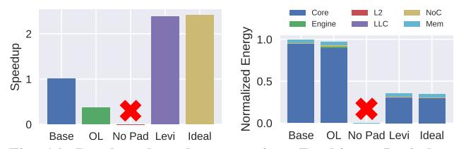

Fig. 16: Results when decompressing 6B objects. Leviathan improves performance by  $2.4 \times$  and reduces energy by 65%.

(Fig. 15). The array is indexed using a Zipfian distribution [17] of 32 K accesses.

We evaluate a baseline software implementation that decompresses on every access, an NDC version that uses task offload (OL) to decompress at the local engine, and Leviathan with and without padding, which accesses decompressed data through the Morph in Fig. 15. The results without padding are similar to täkō [66], which does not provide any data-layout support for the programmer. Results are shown in Fig. 16.

Observation: Not all NDC paradigms are right for every application. Although task-offload performs decompressions at the local engine like data-triggered NDC, it does not retain the decompressed data in the private cache. In fact, it is actually worse by 2.8× because decompressing at the L2 loses locality in the L1s, without reducing overall work.

Observation: Padding is necessary. Data-triggered actions do not work without padding. Since 6 B does not evenly divide a 64 B cache line, lines would contain partial objects, but constructors cannot initialize a portion of an object. This is the outcome of prior work such as täkō [66] that do not provide implicit data-layout support, forcing the programmer to explicitly account for the system's microarchitecture.

*Observation: Leviathan boosts performance.* Leviathan addresses both issues while significantly outperforming the baseline. Leviathan improves performance by 2.4× and reduces energy by 65% by decompressing data while it traverses the cache hierarchy, allowing the core to reuse decompressed data in the L1. Moreover, Leviathan comes within 1.6% speedup and 1.5% energy of ideal.

## B. Hash table lookups via task offload

Hash tables are a popular data structure due to theoretical O(1) lookup time. However, practical lookup time is determined by collision resolution because multiple keys may hash to the same value [50]. Collisions are commonly resolved via a linked-list per hash bucket. Unfortunately, linked lists are notoriously slow due to their sequential, pointer-chasing search. Prior work offloads lookups into the memory hierarchy, avoiding constant round-trips between core and cache.

**Pointer chasing of hash-table buckets with Leviathan.** Fig. 17 shows the code for an application that uses **task offloading** for hash-table pointer chasing with Leviathan. Lines 8-13 implement an offloaded task that compares a single hash-table node with a key, near the node's location. If the node contains the key, a Future is notified that the key was found (by returning the node's value). Otherwise, if the node is not at the end of the list, the task invokes another Lookup task on the next node.

```
1  # Actor with data and an action (Lookup)
2  class Node:
3  int64 key, value
4  int64 metadata[N] # large objects are fine
5  Node* next
6  # int64 padding[LINE_SIZE-3-N] # no padding needed
7
8  int64 Lookup(key): # action: runs near ''this'' Node
9  if this->key == key:
10  return value
11  if next == nullptr:
12  return -1
13  return invoke next->Lookup(key)
```

Fig. 17: Leviathan uses task offloading to traverse linked nodes in a hash-table bucket, without concern for node size.

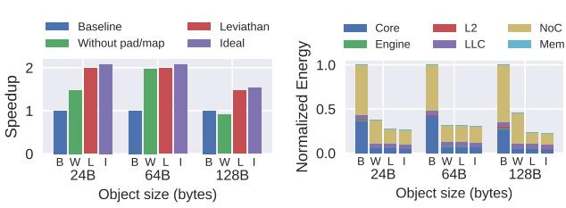

Fig. 18: Results when performing hash-table lookups across different object sizes with a uniform distribution over keys. Leviathan performs well across object sizes, improving performance up to  $2.0\times$  and reducing energy by up to 77%.

Each node must reside entirely within a single tile to maintain the locality benefits of NDC (see Fig. 8). As a result, prior work required the application to manually pad and align nodes to cache lines, an unnecessary exposure of microarchitecture to programmers. Instead, with Leviathan, the application simply allocates each node using Leviathan's allocator (not shown) without concern for object size or alignment. Prior NDCs cannot provide spatial locality for nodes larger than a cache line, whereas Leviathan's LLC mapping mechanism easily maps large objects to the same cache bank (Sec. VI-A3).

Application. We evaluate an application with 16 threads each performing 1 K hash-table lookups across different object sizes (24 B, 64 B, and 128 B) by varying line 4 in Fig. 17. We initialize a hash table with an average of 32 nodes per bucket whose (padded) size totals 4 MB. To perform a lookup, we generate a key from a uniform distribution, hash the key, and scan the corresponding bucket. (Results are similar with a Zipfian [17] distribution.) We evaluate a baseline software implementation and Leviathan, with and without Leviathan's padding and LLC object mapping support. The results without padding and mapping are similar to Livia [47], which does not provide any data-layout support for the programmer.

Observation: Leviathan performs well across object sizes. Leviathan performs similarly across all object sizes (Fig. 18), achieving up to  $2.0\times$  speedup and 77% energy savings. A majority of the benefits come from reducing NoC traffic by offloading a chain of tasks within the LLC, instead of constant round-trips to the caches to fetch each Node. The buckets fit in the LLC, but not L1d or L2, so almost all lookups in the baseline require pulling data from the LLC.

**Observation: Padding improves object locality.** Without padding, 24 B performance is reduced to  $1.5 \times$  due to extra NoC traffic, as many offloaded tasks have only part of the

```
struct Edge { uint src, dst } # obj. can be anything
           Actor with an action (genStream)
lass LeviathanHATS extends Leviathan::Stream<Edge>:
Stack bdfs = {Vertex* vec, uint top}
            void genStream(): # action: fill stream
               pld genstream(). " = while True:
   if bdfs.top == 0:
    root = G.getNextRootVertex()
   if root == INVALID: return

 8
10
 11
12
                      if root == INVALID: return
bdfs.vec[++bdfs.top] = roo
13
14
                      active[root++] = false
                         = bdfs.vec[bdfs.top]
15
16
                   while dst.nextNeigh <
                                                          dst.inDearee:
                      src = dst.neighbors[dst.nextNeigh++]
push(Edge(src, dst)) # stalls when full
18
19
                      if bdfs.top < depth and !active[src]:
  bdfs.vec[++bdfs.top] = src
  active[src] = false</pre>
20
21
22
23
24
25
26
27
28
29
                   --hdfs.top
        # Main thread reads off stream
       for range(G.numEdges):
    # Get future for nex
           # Get future for next edge and process when ready
Future<Edge> future = stream.next()
           processEdge(future.wait())
```

Fig. 19: Leviathan implements HATS with streams.

Node locally.

Observation: LLC object mapping improves object locality. Without LLC mapping, 128 B performance is reduced to  $0.91 \times$  (worse than the baseline) because nearly all offloaded tasks need to fetch part of its node remotely. Note that prior work does not support objects larger than a cache line.

Leviathan reduces memory fragmentation. Another quantitative benefit of Leviathan is compact storage in DRAM for nodes padded in the cache. Specifically, padding the 24 B nodes to 32 B would cause 25% memory fragmentation in prior work. Leviathan performs padding in-cache and compacts objects in DRAM, getting the best of both worlds.

## C. Decoupled graph traversal via streaming

Lastly, we demonstrate **streaming** on HATS [51], a recent optimization for locality in graphs. HATS observed that, without expensive pre-processing, it is inefficient to process the edges in the order they are laid out in memory. Many graphs exhibit strong community structure [12, 46], so it is much better to process graphs one community at a time. A bounded, depth-first search (BDFS) is a simple traversal order that significantly improves locality. The challenge is that BDFS executes inefficiently on cores due to unpredictable control flow and coupling of the graph traversal with vertex processing. Additionally, BDFS is infeasible for many prior streaming NDC designs because it cannot be easily reduced to a combination of simple affine or indirect patterns.

**BDFS streaming with Leviathan.** Fig. 19 shows how Leviathan implements HATS using the streaming interface. The application registers a Stream with an Edge type, without worrying about padding, alignment, or size of the Edge. genStream is populated with the BDFS algorithm, which continually generates Edges and pushes them onto the stream. The main thread running on the core processes edges with next.

Application. We compare baseline PageRank, software BDFS, BDFS in täkō, and Leviathan. täkō [66] only supports data-

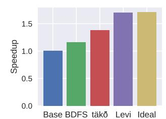

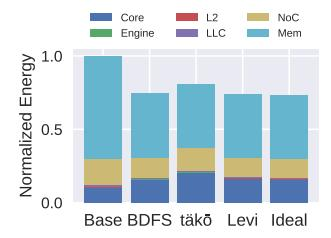

Fig. 20: HATS results for one iteration of PageRank on uk-2002 graph [21]. Leviathan improves performance by 1.7 $\times$  and reduces energy by 26% vs. the software baseline.

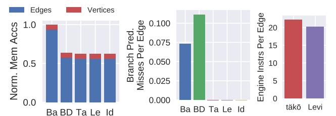

Fig. 21: HATS performance breakdown. Left: DRAM accesses split by PageRank phase. Middle: core branch mispredictions per graph edge processed. Right: average engine instructions per edge.

triggered actions and implements HATS by having constructors on cache misses trigger BDFS traversal (instead of stream pushing). The täkō version of BDFS is more complex and has unintuitive corner cases; e.g., it cannot guarantee that the stream is generated sequentially, since it depends on the order of misses generated by the core. Fig. 20 presents speedup and energy results for one iteration of PageRank.

**Observation:** Leviathan outperforms prior designs. Whereas software BDFS and täk $\bar{o}$  achieve modest speedups of 1.2× and 1.4×, Leviathan achieves 1.7× speedup (nearly identical to ideal). Additionally, Leviathan reduces energy by 26%.

This speedup is due to (i) better cache locality; (ii) regularizing control flow on the core; (iii) an efficient push-based streaming interface; and (iv) decoupling of stream producer and consumer. Fig. 21 quantifies the first three points. All versions incur the same number of memory accesses during the vertex phase, but the versions that execute the BDFS traversal reduce total accesses by 40%. täkō and Leviathan both eliminate branch mispredictions by turning the complex BDFS traversal into a simple loop over a sequential array.

Observation: Dedicated streaming support matters. täkö's pseudo-streaming requires more engine instructions per edge generated. Since täkö's implementation triggers a new action to resume the BDFS traversal every eight edges (one cache line), it must "reinitialize" the BDFS stack each time. In contrast, Leviathan's stream is a continually running action, reducing average instructions per edge. Leviathan also lets the stream run far ahead, whereas täkō streams are implicitly triggered by loads and thus dependent on the consumer.

## IX. EVALUATION — SENSITIVITY STUDIES

Invoke buffer. PHI is the most sensitive to the invoke buffer because it offloads tasks rapidly and does not wait for them to

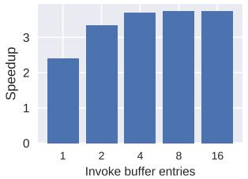

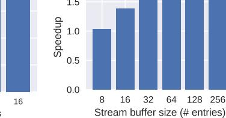

Fig. 22: Sensitivity to invoke buffer with PHI.

Fig. 23: Sensitivity to stream buffer with HATS.

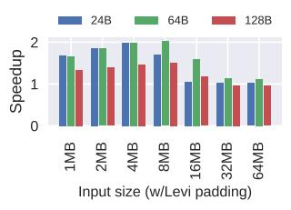

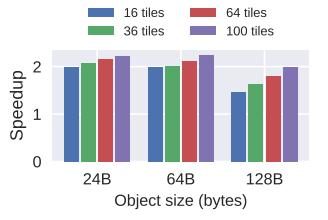

Fig. 24: Sensitivity to input size with hash table.

Fig. 25: Sensitivity to number of tiles with hash table.

complete. Fig. 22 evaluates Leviathan across buffer sizes. With one or two entries, Leviathan slows due to queueing effects causing backpressure, but performance plateaus after four.

*Stream buffer.* Fig. 23 evaluates HATS' performance across stream-buffer sizes. Performance plateaus at 64 entries. Note that the stream buffer resides in memory, not a separate hardware structure, so its overhead is negligible.

*Input size.* Fig. 24 evaluates hash-table lookups across total hash-table size. As long as most of the data fits in the LLC, Leviathan performs well. Once the data is larger than the LLC, Leviathan's performance drops as NoC savings are swamped by DRAM latency. Future work on incorporating near-memory engines can further improve performance for non-cache-fitting workloads, as evidenced by prior work [31, 35, 47].

*System size*. Finally, Fig. 25 evaluates hash table lookups across system sizes. Leviathan performs even better with larger systems due to the increased NoC savings.

#### X. CONCLUSION

Near-data computing is essential to tackle the rising cost of data movement. Prior work has proven that NDC yields large gains in performance and energy efficiency. Unfortunately, prior designs do not provide a holistic approach to NDC because they have limited applicability and unintuitive programming models. Leviathan overcomes these challenges by unifying prior NDC techniques in a single, polymorphic cache hierarchy with a simple, actor-based reactive programming interface.

#### ACKNOWLEDGMENTS

We thank the anonymous reviewers, Nikhil Agarwal, Jennifer Brana, Mitchell Fream, Souradip Ghosh, Sara McAllister, and Tony Nowatzki for their feedback. This work was supported by NSF grant CCF-1845986 and a gift from AMD.

## REFERENCES

- [1] S. Aga, S. Jeloka, A. Subramaniyan, S. Narayanasamy, D. Blaauw, and R. Das, "Compute caches," in *Proc. of the 23rd IEEE intl. symp. on High Performance Computer Architecture (Proc. HPCA-23)*, 2017.
- [2] A. Agarwal, R. Bianchini, D. Chaiken, K. L. Johnson, D. Kranz, J. Kubiatowicz, B.-H. Lim, K. Mackenzie, and D. Yeung, "The MIT Alewife machine: architecture and performance," *Proc. of the 22nd annual Intl. Symp. on Computer Architecture*, 1995.
- [3] Agner Fog, "The microarchitecture of Intel, AMD and VIA CPUs," https://www.agner.org/optimize/microarchitecture.pdf, 2020.
- [4] J. Ahn, S. Yoo, O. Mutlu, and K. Choi, "Pim-enabled instructions: a lowoverhead, locality-aware processing-in-memory architecture," in *Proc. of the 42nd annual Intl. Symp. on Computer Architecture (Proc. ISCA-42)*, 2015.
- [5] S. Ainsworth and T. M. Jones, "Graph prefetching using data structure knowledge," in *Proc. of the Intl. Conf. on Supercomputing (Proc. ICS'16)*, 2016.
- [6] S. Ainsworth and T. M. Jones, "An event-triggered programmable prefetcher for irregular workloads," in *Proc. of the 23rd intl. conf. on Architectural Support for Programming Languages and Operating Systems (Proc. ASPLOS-XXIII)*, 2018.
- [7] B. Akin, F. Franchetti, and J. C. Hoe, "Data reorganization in memory using 3d-stacked dram," in *Proc. of the 42nd annual Intl. Symp. on Computer Architecture (Proc. ISCA-42)*, 2015.
- [8] A. R. Alameldeen and D. A. Wood, "Adaptive cache compression for high-performance processors," in *Proc. of the 31st annual Intl. Symp. on Computer Architecture (Proc. ISCA-31)*, 2004.
- [9] A. Asgharzadeh, J. M. Cebrian, A. Perais, S. Kaxiras, and A. Ros, "Free atomics: Hardware atomic operations without fences," in *Proc. of the 49th annual Intl. Symp. on Computer Architecture (Proc. ISCA-49)*, 2022.
- [10] E. Bainomugisha, A. L. Carreton, T. v. Cutsem, S. Mostinckx, and W. d. Meuter, "A survey on reactive programming," *ACM Computing Surveys (CSUR)*, 2013.
- [11] S. Baskaran, M. T. Kandemir, and J. Sampson, "An architecture interface and offload model for low-overhead, near-data, distributed accelerators," in *Proc. of the 55th annual IEEE/ACM intl. symp. on Microarchitecture (Proc. MICRO-55)*, 2022.
- [12] S. Beamer, K. Asanovic, and D. Patterson, "Locality exists in graph processing: Workload characterization on an Ivy Bridge server," in *Proc. of the IEEE Intl. Symp. on Workload Characterization (Proc. IISWC)*, 2015.
- [13] S. Beamer, K. Asanovic, and D. Patterson, "The GAP benchmark suite," ´ *arXiv preprint arXiv:1508.03619*, 2015.
- [14] S. Beamer, K. Asanovic, and D. Patterson, "Reducing pagerank com- ´ munication via propagation blocking," in *Proc. of the 31st IEEE Intl. Parallel and Distributed Processing Symp. (Proc. IPDPS)*, 2017.
- [15] A. Biswas, "Sapphire rapids," in *2021 IEEE Hot Chips 33 Symposium (HCS)*, 2021.
- [16] J. Brana, B. C. Schwedock, Y. A. Manerkar, and N. Beckmann, "Kobold: Simplified cache coherence for cache-attached accelerators," *IEEE Computer Architecture Letters*, 2023.
- [17] L. Breslau, P. Cao, L. Fan, G. Phillips, and S. Shenker, "Web caching and Zipf-like distributions: Evidence and implications," in *IEEE INFOCOM*, 1999, pp. 126–134.
- [18] J. Carter, W. Hsieh, L. Stoller, M. Swanson, L. Zhang, E. Brunvand, A. Davis, C.-C. Kuo, R. Kuramkote, M. Parker, L. Schaelicke, and T. Tateyama, "Impulse: Building a smarter memory controller," in *Proc. of the 5th IEEE intl. symp. on High Performance Computer Architecture (Proc. HPCA-5)*, 1999.
- [19] V. Dadu and T. Nowatzki, "Taskstream: Accelerating task-parallel workloads by recovering program structure," in *Proc. of the 27th intl. conf. on Architectural Support for Programming Languages and Operating Systems (Proc. ASPLOS-XXVII)*, 2022.
- [20] W. J. Dally, "GPU Computing: To Exascale and Beyond," in *Supercomputing '10, Plenary Talk*, 2010.
- [21] T. A. Davis and Y. Hu, "The University of Florida sparse matrix collection," *ACM TOMS*, vol. 38, no. 1, 2011.
- [22] C. De Sa, M. Feldman, C. Ré, and K. Olukotun, "Understanding and optimizing asynchronous low-precision stochastic gradient descent," in *Proc. of the 44th annual Intl. Symp. on Computer Architecture (Proc. ISCA-44)*, 2017.

- [23] C. Demetrescu, I. Finocchi, and A. Ribichini, "Reactive imperative programming with dataflow constraints," in *Proceedings of the 2011 ACM International Conference on Object Oriented Programming Systems Languages and Applications*, 2011.
- [24] M. Ekman and P. Stenstrom, "A robust main-memory compression scheme," in *Proc. of the 32nd annual Intl. Symp. on Computer Architecture (Proc. ISCA-32)*, 2005.
- [25] C. Elliott and P. Hudak, "Functional reactive animation," in *Proceedings of the Second ACM SIGPLAN International Conference on Functional Programming*, 1997.
- [26] A. Fuchs and D. Wentzlaff, "Scaling datacenter accelerators with computereuse architectures," in *Proc. of the 45th annual Intl. Symp. on Computer Architecture (Proc. ISCA-45)*, 2018.
- [27] A. Gupta, W.-D. Weber, and T. Mowry, "Reducing memory and traffic requirements for scalable directory-based cache coherence schemes," in *Scalable shared memory multiprocessors*. Springer, 1992, pp. 167–192.
- [28] J. Hennessy and D. Patterson, "A new golden age for computer architecture: Domain-specific hardware/software co-design, enhanced security, open instruction sets, and agile chip development," in *Turing Award Lecture*, 2018.
- [29] C. Hewitt, P. Bishop, and R. Steiger, "A universal modular actor formalism for artificial intelligence," in *Proceedings of the 3rd International Joint Conference on Artificial Intelligence*, 1973.
- [30] H. Hoffmann, D. Wentzlaff, and A. Agarwal, "Remote store programming," in *Proc. of the 5th intl. conf. on High Performance Embedded Architectures and Compilers (Proc. HiPEAC)*, 2010.
- [31] B. Hong, G. Kim, J. H. Ahn, Y. Kwon, H. Kim, and J. Kim, "Accelerating linked-list traversal through near-data processing," in *Proc. of the 25th Intl. Conf. on Parallel Architectures and Compilation Techniques (Proc. PACT-25)*, 2016.
- [32] M. Horowitz, "Computing's energy problem (and what we can do about it)," in *ISSCC*, 2014.
- [33] M. Horowitz, M. Martonosi, T. C. Mowry, and M. D. Smith, "Informing memory operations: Providing memory performance feedback in modern processors," 1996.
- [34] K. Hsieh, E. Ebrahimi, G. Kim, N. Chatterjee, M. O'Connor, N. Vijaykumar, O. Mutlu, and S. W. Keckler, "Transparent Offloading and Mapping (TOM): Enabling Programmer-Transparent Near-Data Processing in GPU Systems," in *Proc. of the 43rd annual Intl. Symp. on Computer Architecture (Proc. ISCA-43)*, 2016.
- [35] K. Hsieh, S. Khan, N. Vijaykumar, K. K. Chang, A. Boroumand, S. Ghose, and O. Mutlu, "Accelerating pointer chasing in 3d-stacked memory: Challenges, mechanisms, evaluation," in *Proc. of the 34th Intl. Conf. on Computer Design (Proc. ICCD)*, 2016.
- [36] M. C. Jeffrey, S. Subramanian, C. Yan, J. Emer, and D. Sanchez, "A scalable architecture for ordered parallelism," in *Proc. of the 48th annual IEEE/ACM intl. symp. on Microarchitecture (Proc. MICRO-48)*, 2015.
- [37] S. Karandikar, C. Leary, C. Kennelly, J. Zhao, D. Parimi, B. Nikolic, K. Asanovic, and P. Ranganathan, "A hardware accelerator for protocol buffers," in *Proc. of the 54th annual IEEE/ACM intl. symp. on Microarchitecture (Proc. MICRO-54)*, 2021.
- [38] R. Kateja, N. Beckmann, and G. R. Ganger, "Tvarak: software-managed hardware offload for redundancy in direct-access nvm storage," in *Proc. of the 47th annual Intl. Symp. on Computer Architecture (Proc. ISCA-47)*, 2020.
- [39] R. E. Kessler and J. L. Schwarzmeier, "CRAY T3D: A new dimension for Cray Research," in *Compcon Spring'93, Digest of Papers.*, 1993.
- [40] V. Kiriansky, Y. Zhang, and S. Amarasinghe, "Optimizing indirect memory references with milk," in *Proc. of the 25th Intl. Conf. on Parallel Architectures and Compilation Techniques (Proc. PACT-25)*, 2016.
- [41] R. Kuper, I. Jeong, Y. Yuan, R. Wang, N. Ranganathan, N. Rao, J. Hu, S. Kumar, P. Lantz, and N. S. Kim, "A quantitative analysis and guidelines of data streaming accelerator in modern intel xeon scalable processors," in *Proc. of the 29th intl. conf. on Architectural Support for Programming Languages and Operating Systems*, 2024.
- [42] J. Kuskin, D. Ofelt, M. Heinrich, J. Heinlein, R. Simoni, K. Gharachorloo, J. Chapin, D. Nakahira, J. Baxter, M. Horowitz, A. Gupta, M. Rosenblum, and J. Hennessy, "The Stanford FLASH multiprocessor," in *Proc. of the 21st annual Intl. Symp. on Computer Architecture (Proc. ISCA-21)*, 1994.
- [43] J. H. Lee, J. Sim, and H. Kim, "Bssync: Processing near memory for machine learning workloads with bounded staleness consistency models," in *Proc. of the 24th Intl. Conf. on Parallel Architectures and Compilation Techniques (Proc. PACT-24)*, 2015.

- [44] C. E. Leiserson, N. C. Thompson, J. S. Emer, B. C. Kuszmaul, B. W. Lampson, D. Sanchez, and T. B. Schardl, "There's plenty of room at the top: What will drive computer performance after moore's law?" *Science*, vol. 368, no. 6495, 2020.
- [45] D. Lenoski, J. Laudon, K. Gharachorloo, A. Gupta, and J. Hennessy, "The directory-based cache coherence protocol for the dash multiprocessor," 1990.
- [46] J. Leskovec, K. J. Lang, A. Dasgupta, and M. W. Mahoney, "Statistical properties of community structure in large social and information networks," in *Proc. of the intl. World Wide Web conf. (WWW-17)*, 2008.
- [47] E. Lockerman, A. Feldmann, M. Bakhshalipour, A. Stanescu, S. Gupta, D. Sanchez, and N. Beckmann, "Livia: Data-centric computing throughout the memory hierarchy," in *Proc. of the 25th intl. conf. on Architectural Support for Programming Languages and Operating Systems (Proc. ASPLOS-XXV)*, 2020.
- [48] M. Maas, K. Asanovic, and J. Kubiatowicz, "A hardware accelerator for tracing garbage collection," in *Proc. of the 45th annual Intl. Symp. on Computer Architecture (Proc. ISCA-45)*, 2018.
- [49] M. Martin, M. D. Hill, and D. J. Sorin, "Why on-chip cache coherence is here to stay," *Commun. ACM*, 2012.
- [50] W. D. Maurer and T. G. Lewis, "Hash table methods," *ACM Computing Surveys (CSUR)*, 1975.
- [51] A. Mukkara, N. Beckmann, M. Abeydeera, X. Ma, and D. Sanchez, "Exploiting Locality in Graph Analytics through Hardware-Accelerated Traversal Scheduling," in *Proc. of the 51st annual IEEE/ACM intl. symp. on Microarchitecture (Proc. MICRO-51)*, 2018.
- [52] A. Mukkara, N. Beckmann, and D. Sanchez, "PHI: Architectural Support for Synchronization- and Bandwidth-Efficient Commutative Scatter Updates," in *Proc. of the 52nd annual IEEE/ACM intl. symp. on Microarchitecture (Proc. MICRO-52)*, 2019.
- [53] Q. M. Nguyen and D. Sánchez, "Fifer: Practical acceleration of irregular applications on reconfigurable architectures," in *Proc. of the 54th annual IEEE/ACM intl. symp. on Microarchitecture (Proc. MICRO-54)*, 2021.
- [54] T. Nowatzki, V. Gangadhar, N. Ardalani, and K. Sankaralingam, "Streamdataflow acceleration," in *ISCA 44*, 2017.
- [55] A. Pattnaik, X. Tang, O. Kayiran, A. Jog, A. Mishra, M. T. Kandemir, A. Sivasubramaniam, and C. R. Das, "Opportunistic computing in gpu architectures," in *Proc. of the 46th annual Intl. Symp. on Computer Architecture (Proc. ISCA-46)*, 2019.
- [56] G. Pekhimenko, V. Seshadri, Y. Kim, H. Xin, O. Mutlu, P. B. Gibbons, M. A. Kozuch, and T. C. Mowry, "Linearly compressed pages: a lowcomplexity, low-latency main memory compression framework," in *Proc. of the 46th annual IEEE/ACM intl. symp. on Microarchitecture (Proc. MICRO-46)*, 2013.
- [57] G. Pekhimenko, V. Seshadri, O. Mutlu, P. B. Gibbons, M. A. Kozuch, and T. C. Mowry, "Base-delta-immediate compression: Practical data compression for on-chip caches," in *Proc. of the 21st Intl. Conf. on Parallel Architectures and Compilation Techniques (Proc. PACT-21)*, 2012.
- [58] A. Pourhabibi, S. Gupta, H. Kassir, M. Sutherland, Z. Tian, M. P. Drumond, B. Falsafi, and C. Koch, "Optimus prime: Accelerating data transformation in servers," in *Proc. of the 25th intl. conf. on Architectural Support for Programming Languages and Operating Systems (Proc. ASPLOS-XXV)*, 2020.
- [59] S. K. Reinhardt, J. R. Larus, and D. A. Wood, "Tempest and Typhoon: User-level shared memory," in *Proc. of the 21st annual Intl. Symp. on Computer Architecture (Proc. ISCA-21)*, 1994.
- [60] T. J. Repetti, J. P. Cerqueira, M. A. Kim, and M. Seok, "Pipelining a triggered processing element," in *Proc. of the 50th annual IEEE/ACM intl. symp. on Microarchitecture (Proc. MICRO-50)*, 2017.
- [61] R. Roestenburg, R. Williams, and R. Bakker, *Akka in action*. Simon and Schuster, 2016.
- [62] S. Roozkhosh, D. Hoornaert, J. Mun, T. I. Papon, A. Sanaullah, U. Drepper, R. Mancuso, and M. Athanassoulis, "Relational memory: Native in-memory accesses on rows and columns," in *26th International Conference on Extending Database Technology*, 2023.
- [63] G. Salvaneschi and M. Mezini, *Towards Reactive Programming for Object-Oriented Applications*, 2014.
- [64] S. Sardashti and D. A. Wood, "Decoupled compressed cache: exploiting spatial locality for energy-optimized compressed caching," in *Proc. of the 46th annual IEEE/ACM intl. symp. on Microarchitecture (Proc. MICRO-46)*, 2013.

- [65] C. Schuster and C. Flanagan, "Reactive programming with reactive variables," in *Companion Proceedings of the 15th International Conference on Modularity*, 2016.
- [66] B. C. Schwedock, P. Yoovidhya, J. Seibert, and N. Beckmann, "täko:¯ A polymorphic cache hierarchy for general-purpose optimization of data movement," in *Proc. of the 49th annual Intl. Symp. on Computer Architecture (Proc. ISCA-49)*, 2022.
- [67] S. L. Scott, "Synchronization and communication in the T3E multiprocessor," in *Proc. of the 7th intl. conf. on Architectural Support for Programming Languages and Operating Systems (Proc. ASPLOS-VII)*, 1996.
- [68] V. Seshadri, G. Pekhimenko, O. Ruwase, O. Mutlu, P. B. Gibbons, M. A. Kozuch, T. C. Mowry, and T. Chilimbi, "Page overlays: An enhanced virtual memory framework to enable fine-grained memory management," in *Proc. of the 42nd annual Intl. Symp. on Computer Architecture (Proc. ISCA-42)*, 2015.
- [69] O. Shacham, Z. Asgar, H. Chen, A. Firoozshahian, R. Hameed, C. Kozyrakis, W. Qadeer, S. Richardson, A. Solomatnikov, D. Stark, M. Wachs, and M. Horowitz, "Smart memories polymorphic chip multiprocessor," in *Proc. of the 46th Design Automation Conf. (Proc. DAC-46)*, 2009.
- [70] M. D. Sinclair, J. Alsop, and S. V. Adve, "Chasing away rats: Semantics and evaluation for relaxed atomics on heterogeneous systems," in *Proc. of the 44th annual Intl. Symp. on Computer Architecture (Proc. ISCA-44)*, 2017.
- [71] D. Skarlatos, N. S. Kim, and J. Torrellas, "Pageforge: a near-memory content-aware page-merging architecture," in *Proc. of the 50th annual IEEE/ACM intl. symp. on Microarchitecture (Proc. MICRO-50)*, 2017.
- [72] Y. Sugawara, D. Chen, R. A. Haring, A. Kayi, E. Ratzlaff, R. M. Senger, K. Sugavanam, R. Bellofatto, B. J. Nathanson, and C. Stunkel, "Data movement accelerator engines on a prototype power10 processor," *IEEE Micro*, 2023.
- [73] S. Swanson, K. Michelson, A. Schwerin, and M. Oskin, "Wavescalar," in *Proc. of the 36th annual IEEE/ACM intl. symp. on Microarchitecture (Proc. MICRO-36)*, 2003.
- [74] N. Talati, K. May, A. Behroozi, Y. Yang, K. Kaszyk, C. Vasiladiotis, T. Verma, L. Li, B. Nguyen, J. Sun *et al.*, "Prodigy: Improving the memory latency of data-indirect irregular workloads using hardwaresoftware co-design," in *Proc. of the 27th IEEE intl. symp. on High Performance Computer Architecture (Proc. HPCA-27)*, 2021.
- [75] P.-A. Tsai, N. Beckmann, and D. Sanchez, "Jenga: Software-Defined Cache Hierarchies," in *Proc. of the 44th annual Intl. Symp. on Computer Architecture (Proc. ISCA-44)*, 2017.
- [76] P.-A. Tsai, C. Chen, and D. Sanchez, "Adaptive Scheduling for Systems with Asymmetric Memory Hierarchies," in *Proc. of the 51st annual IEEE/ACM intl. symp. on Microarchitecture (Proc. MICRO-51)*, 2018.
- [77] P.-A. Tsai and D. Sanchez, "Compress objects, not cache lines: An objectbased compressed memory hierarchy," in *Proc. of the 24th intl. conf. on Architectural Support for Programming Languages and Operating Systems (Proc. ASPLOS-XXIV)*, 2019.
- [78] Z. Wang, C. Liu, A. Arora, L. John, and T. Nowatzki, "Infinity stream: Portable and programmer-friendly in-/near-memory fusion," in *Proc. of the 28th intl. conf. on Architectural Support for Programming Languages and Operating Systems (Proc. ASPLOS-XXVIII)*, 2023.
- [79] Z. Wang and T. Nowatzki, "Stream-based memory access specialization for general purpose processors," in *Proc. of the 46th annual Intl. Symp. on Computer Architecture (Proc. ISCA-46)*, 2019.
- [80] Z. Wang, J. Weng, S. Liu, and T. Nowatzki, "Near-stream computing: General and transparent near-cache acceleration," 2022.
- [81] Z. Wang, J. Weng, J. Lowe-Power, J. Gaur, and T. Nowatzki, "Stream floating: Enabling proactive and decentralized cache optimizations," in *Proc. of the 27th IEEE intl. symp. on High Performance Computer Architecture (Proc. HPCA-27)*, 2021.
- [82] T. Wei, N. Turtayeva, M. Orenes-Vera, O. Lonkar, and J. Balkind, "Cohort: Software-oriented acceleration for heterogeneous socs," in *Proc. of the 28th intl. conf. on Architectural Support for Programming Languages and Operating Systems (Proc. ASPLOS-XXVIII)*, 2023.
- [83] J. Weng, S. Liu, Z. Wang, V. Dadu, and T. Nowatzki, "A hybrid systolicdataflow architecture for inductive matrix algorithms," in *Proc. of the 26th IEEE intl. symp. on High Performance Computer Architecture (Proc. HPCA-26)*, 2020.
- [84] W. A. Wulf and S. A. McKee, "Hitting the memory wall: implications of the obvious," *ACM SIGARCH computer architecture news*, vol. 23, no. 1, 1995.

- [85] Q. Yang, G. Thangadurai, and L. Bhuyan, "Design of an adaptive cache coherence protocol for large scale multiprocessors," *IEEE Transactions on Parallel and Distributed Systems*, vol. 3, no. 3, 1992.
- [86] Y. Yang, J. S. Emer, and D. Sanchez, "Spzip: Architectural support for effective data compression in irregular applications," in *Proc. of the 48th annual Intl. Symp. on Computer Architecture (Proc. ISCA-48)*, 2021.
- [87] Y. Yarom, Q. Ge, F. Liu, R. B. Lee, and G. Heiser, "Mapping the intel last-level cache," *Cryptology ePrint Archive*, 2015.
- [88] X. Yu, C. J. Hughes, N. Satish, and S. Devadas, "IMP: Indirect memory prefetcher," in *Proc. of the 48th annual IEEE/ACM intl. symp. on Microarchitecture (Proc. MICRO-48)*, 2015.
- [89] D. Zhang, X. Ma, and D. Chiou, "Worklist-directed Prefetching," *IEEE Computer Architecture Letters*, 2016.
- [90] D. Zhang, X. Ma, M. Thomson, and D. Chiou, "Minnow: Lightweight offload engines for worklist management and worklist-directed prefetching," in *Proc. of the 23rd intl. conf. on Architectural Support for Programming Languages and Operating Systems (Proc. ASPLOS-XXIII)*, 2018.

- [91] D. Zhang, N. Jayasena, A. Lyashevsky, J. L. Greathouse, L. Xu, and M. Ignatowski, "Top-pim: Throughput-oriented programmable processing in memory," in *Proc. HPDC*, 2014.
- [92] G. Zhang, V. Chiu, and D. Sanchez, "Exploiting Semantic Commutativity in Hardware Speculation," in *Proc. of the 49th annual IEEE/ACM intl. symp. on Microarchitecture (Proc. MICRO-49)*, 2016.
- [93] G. Zhang, W. Horn, and D. Sanchez, "Exploiting commutativity to reduce the cost of updates to shared data in cache-coherent systems," in *Proc. of the 48th annual IEEE/ACM intl. symp. on Microarchitecture (Proc. MICRO-48)*, 2015.
- [94] G. Zhang and D. Sanchez, "Leveraging Hardware Caches for Memoization," *Computer Architecture Letters (CAL)*, vol. 17, no. 1, 2018.
- [95] G. Zhang and D. Sanchez, "Leveraging caches to accelerate hash tables and memoization," in *Proceedings of the 52nd Annual IEEE/ACM International Symposium on Microarchitecture*, 2019, pp. 440–452.