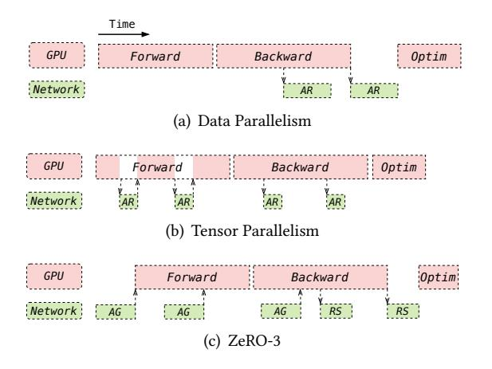

# 2.1 Parallelism in distributed training.

Parallelization is important for large-scale DL training and commonly used parallelism include data parallelism and model parallelism.

2.1.1 Data Parallelism. In data parallelism, each device stores a copy of the parameters and trains them using different mini-batches. Subsequently, the gradients from all devices are synchronized through all-reduce, after which each device updates its local parameters. To efficiently utilize the communication channel, a commonly used technique is the bucket technique in general data-parallel implementations. This technique splits the parameters into multiple buckets, allowing gradient reduction in each bucket to potentially

overlap with backward computation. The default bucket size for PyTorch is typically set to 25 MB [27]. As model parameters grow, the ZeRO Redundancy Optimizer (ZeRO) [37] has been introduced to alleviate GPU memory consumption related to model parameters, gradients, and optimizer states by sharding them. Similar to DDP, implementations of ZeRO incorporate default settings akin to buckets or wrappers to enable efficient computation and communication overlap.

2.1.2 Model Parallelism. As model sizes increase, model parallelism has emerged as a crucial technique, mainly including tensor model parallelism and pipeline model parallelism. Tensor model parallelism employs parallel matrix multiplication algorithms to distribute model parameters across different devices. Once local matrix multiplication is completed on each device, global results may need synchronization through all-reduce. Megatron-LM v2.7 [31] introduces asynchronous all-reduce in the backward pass of tensor parallelism linear layers, as depicted in Figure 1. For the synchronize all-reduce in the forward pass, some approaches [47] decompose the antecedent matrix multiplication, thus overlapping it with all-reduce operations.

Pipeline model parallelism involves partitioning the model across different devices based on layers. Intermediate activations must be transmitted to neighboring devices using Peer-to-Peer (P2P) communication. These P2P communication overhead are relatively small and, in this work, we do not focus on the communication overhead from pipeline model parallelism.

**Figure 1.** Communication for different parallel approaches. a training step typically involves Forward computation, Backward computation, and the optimizer step (*Optim*). (*AR*: Allreduce, *AG*: all-gather, *RS*: reduce-scatter).

