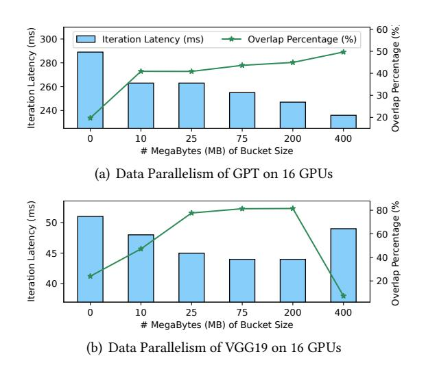
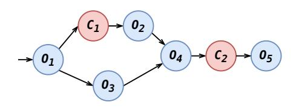
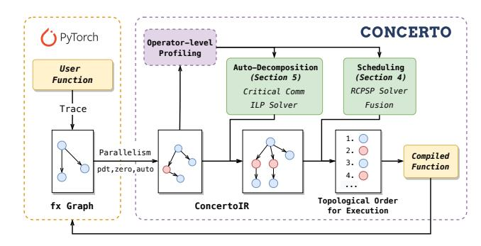
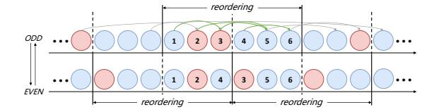
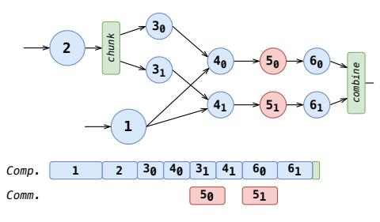

# **2.1.3** Other Parallelism and Automatic Parallelism. In certain instances, novel parallelism techniques may be proposed for specific models. One such example is Dynamic Axial Parallelism (DAP), introduced in FastFold [7] for the

AlphaFold model. FastFold employs asynchronous communication with *Duality Async Operations* to mitigate the communication overhead associated with DAP. For more intricate scenarios, there are ongoing efforts in automatic parallelism [44, 52] aimed at generating parallel strategies for diverse models. These approaches typically utilize algorithms such as integer linear programming to determine the parallel strategy with the minimal communication cost. However, due to the inherent uncertainty in both parallelism and communication, existing communication optimization implementations face challenges in accommodating automatic parallelism.

#### 2.2 Motivating Examples

In both Data Parallelism and ZeRO, buckets are utilized to optimize communication efficiency. In Figure 2, we illustrate the correlation between training performance and bucket size for GPT 2.5 Billion and VGG19 [40] on 16 A800 GPUs. The DDP implementation of PyTorch defaults to a bucket size of 25 MB. In GPT, better overlap percentage (percentage of total communication time spent on overlapping communications) and training performance is achieved with a bucket size of 400 MB. For VGG, improved overlap percentage and training performance are observed with a bucket size ranging from 70 to 200 MB. This observation indicates that the default bucket size fails to deliver optimal performance. ZeRO similarly employs buckets to enhance all-gather and reduce-scatter, processes that are more intricate for performance tuning and thus offer opportunities for optimization.

<span id="page-2-1"></span>

**Figure 2.** Relationship between training performance and communication bucket size in data parallelism.

In complex scenarios, such as illustrated in Figure 3, where the graph involves two communications,  $C_1$  and  $C_2$ . For modern deep learning frameworks like PyTorch, scheduling typically follows the order of definition. Consequently, the execution order proceeds as  $O_1 \rightarrow C_1 \rightarrow O_2 \rightarrow O_3$ . However,

it's evident that  $C_1$  and  $O_3$  are independent and can be overlapped. Thus, we can achieve computation-communication overlap by rearranging the order of operators, such as scheduling them as  $O_1 \rightarrow C_1 \rightarrow O_3 \rightarrow O_2$ . Regarding  $C_2$ , there's no scheduling opportunity because the execution order is  $O_4 \rightarrow C_2 \rightarrow O_5$ . However, we can still overlap computation and communication by decomposing  $O_4$  and  $O_5$ . For instance,  $O_4$  could compute a portion of the tensor first, then  $C_2$  could communicate this portion while  $O_4$  computes another part, and so forth, allowing part of the tensor to be processed using  $O_5$ . Some works [47] has been done with some related attempts, but all of them are limited to fixed patterns, such as decomposing matmul and all-reduce for overlap.

<span id="page-3-0"></span>

**Figure 3.** A simple example of computational graph where  $O_1$  to  $O_5$  are computational operators.  $C_1$  and  $C_2$  are communication operators.

Hence, to minimize communication costs, we observe: 1) For asynchronous communication operators, maximizing parallel processing through operator order scheduling for overlap, coupled with techniques like bucket-like communication fusion, is essential. 2) For critical (synchronous) communication operators, decomposing their contextual computation creates optimization opportunities for overlap.

#### 3 Concerto Overview

This section presents the design of Concerto. Concerto decouples parallel approach and communication optimization to achieve better performance, programmability and generality. Serving as a versatile communication-optimization compiler framework, Concerto abstracts communication optimization as a resource-constrained project scheduling problem (RCPSP) [36]. Leveraging off-the-shelf solvers [35], Concerto generates optimized topological sorting. Additionally, Concerto introduces auto-decomposition to expand the optimization space for critical communication. Through these two compilation passes, Concerto can be applied broadly to optimize communication across various parallel methods. Concerto Workflow Overview. The workflow of Concerto is illustrated in the Figure 4. Initially, Concerto traces the PyTorch functions provided by the user (e.g., train\_step) into an fx Graph (the graph's data structure in PyTorch). Then, depending on the parallel\_method specified by the user, we can transform the traced fx graph into ConcertoIR. ConcertoIR is a hybrid graph with computation and

communication operators that incorporates additional operator information. The next steps involve two core compilation passes in Concerto: auto-decomposition and scheduling. Auto-decomposition identifies critical communications within the graph and decomposes their context automatically. Scheduling generates the topological order of this graph for runtime execution and applies optimizations such as communication fusion.

<span id="page-3-1"></span>

Figure 4. System Overview of Concerto.

### 4 Concerto Scheduling

Concerto minimizes execution time of a computational graph through proper execution ordering. The ordering is restricted by the graph's topological structure and resources available. Thus, the problem can be seen as a classic resource constrained project scheduling problem (RCPSP) [36] that can be solved using existing solvers.

#### 4.1 Encoding graph execution

Following the customary manner, we denote the computational graph as G = (V, E), where  $V = \{v_1, \ldots, v_n\}$  are nodes which represent operators and  $E = \{e_1, \ldots, e_m\}$  represent multi-dimensional tensors which can be the input or output of operators. Following the definition of RCPSP, we refer to the execution of one node as a task. We view the graph execution as the execution of tasks, where each task has its own resource requirements and dependencies. Different tasks can be executed concurrently as long as their resource usage together does not exceed the resource limit.

Considering N types of resources, we define the resource set as  $R = \{R_1, \ldots, R_N\}$ , where  $R_i$  denotes the amount of available resource i. The resource usage of task i is denoted as  $U_i = \{u_{i1}, \ldots, u_{iN}\}$ , with  $u_{ir} \in \{0, \ldots, R_i\}$  for all  $i \in \{1, \ldots, n\}$  and  $r \in \{1, \ldots, N\}$ . In modern deep learning frameworks, it's common for one computation and one communication to be performed simultaneously in most cases. Therefore, we consider that each task only requires one unit of computation resource or one unit of communication. The total amount of each resource is one unit. That is,  $R = \{computation, communication\}$ ,  $R_i = 1$  and  $u_{ir} \in \{0, 1\}$ . For simplicity, in the remainder of this section, comp represents

tasks requiring computation resource and *comm* represents tasks requiring communication resource.

The execution time of task  $v_i$ , obtained through profiling, is denoted as  $T_i$ , while the set of tasks depended on by  $v_i$  to execute is denoted as  $dep_i$ . The duration set  $T = \{T_1, \ldots, T_n\}$  is normalized and rounded to integers, as only the relative time consumption is useful.

#### 4.2 ILP formulation

We model the execution duration of task i as an interval variable in discrete time:  $I_i = [S_i, E_i]$ . Both  $S_i$  and  $E_i$  are integers representing moments in a discrete timeline. Note that task i starts at the beginning of  $S_i$  and ends at the beginning of  $E_i$ . Once task i begins execution, it will continue running until completed. Therefore:

$$\forall i \in \{1, \dots, n\} \ E_i = S_i + T_i \tag{1}$$

Then to preserve the dependencies, for task i, it should not start before all its dependent tasks are finished:

$$\forall i \in \{1, \dots, n\}, \forall j \in dep_i E_j \le S_i \tag{2}$$

Finally, for each time step, the resource usage should be under limit. Here, *M* stands for the makespan of all tasks:

$$\forall t \in \{1, \dots, M\}, \forall r \in \{1, \dots, N\} \sum_{i: S_i \le t \le E_i} u_{ir} \le R_r \quad (3)$$

We want to minimize the duration of the whole process:

$$\arg\min_{I} E_n \quad subject \ to(1), (2), (3) \tag{4}$$

#### 4.3 Decoding

Given a feasible solution to the ILP above, we generate a topological order of the group according to the execution time of each task  $(S_1, \ldots, S_n)$ . We first order the tasks by their start time. Then, for each *comp* we bring *comms* launched during its execution time ahead of it. This adjustment is made because *comms* requires a few GPU Streaming Multiprocessors (SMs) to launch, and during the execution of *comp*, all SMs might be occupied, delaying the launch of *comms* scheduled during this period. Consequently, these *comms* might miss their overlap with *comp*. From another perspective, this reordering helps maintain the assumption that *comms* and *comps* utilize separate resources for execution.

#### 4.4 Optimization

**4.4.1 Fusion.** To improve communication efficiency and avoid kernel launch overhead, we group all *interchangeable* and *fusible comms*. Here two *comms* being interchangeable means that they can be exchanged in execution order without breaking dependencies and being fusible means that two *comms* do the same type of communication with same parameters. We group these *comms* using Algorithm 1.

#### **Algorithm 1:** Communication Fusion

```
input :fx_graph
{\bf output:} new\_fx\_graph
sched \leftarrow \texttt{TopoOrder}(\textit{fx\_graph}), \textit{selected} \leftarrow []
idx \leftarrow 0, retrive task \leftarrow None
while idx < len(sched) do
     task \leftarrow sched[idx]
     if task a fusible comm then
           if selected is empty then
                selected.append(task)
           else if task fusible with selected then
                if task interchangeable with selected then
                 selected.append(task)
                else
                      FuseNodes (selected, fx graph)
                      selected \leftarrow []
                      sched \leftarrow TopoOrder(fx\_graph)
                      if retrive_task is None then
                          retrive\_task \leftarrow task
                      idx \leftarrow sched.index(retrive task)
                      retrive task ← None
                     continue
           else if retrive_task is None then
               retrive\_task \leftarrow task
     end
     idy += 1
     if idx == len(sched) and selected not empty then
           FuseNodes(selected, fx_graph)
           selected ← []
           sched \leftarrow TopoOrder(fx\_graph)
           if retrive_task not None then
                idx \leftarrow sched.index(retrive\_task)
                retrive\_task \leftarrow None
           end
     end
end
```

<span id="page-4-0"></span>Note that solver will maximize overlap between *comps* and *comms*, thus minimizing the total execution time. Therefore, *comps* and *comms* tend to be scheduled in an interleaving pattern. However, in many cases *comps* between two adjacent *comms* are auxiliary tasks that take little time (or no GPU time at all, for tasks like *getitem* and *view*) to execute. We can move these auxiliary tasks forward to make more space for communication fusion while having no impact on the efficiency of execution.

**4.4.2 Odd-even Method.** RCPSP is known NP-hard [4]. Therefore, to make the ILP tractable for large neural networks with tens of thousands of nodes, we come up with a method that restrain solving time complexity to be polynomial while keeping the solution quality close to the optimum.

Inspired by odd-even sort algorithm, we divide the computational graph into equally-sized block where each block is a consecutive sequence of nodes in the current feasible execution order. Default execution order is obtained from program definition. Thus, the original program definition might have an impact on the final result quality. Then we feed solver with one block at a time. After all blocks are reordered by

<span id="page-5-0"></span>

**Figure 5.** Illustration of odd-even scheduling. Distances between adjacent vertical lines are half of the block size, where solid ones represent the block division points at this round and dashed ones represent points in the next round.

the solver to their local optimums, we offset the blocks by half of the block size and repeat the reordering process. For example, in figure 5, in the odd round (top), tasks are reordered within the block while ignoring the dependencies from outside (i.e. edges with at least one end being outside of the block). Then in the even round (bottom), the block is offset by half and the reordering is repeated. By doing so, we facilitate communication of information between blocks, and this information is transmitted to blocks far away as we continue with rounds in an odd-even manner.

Assuming the time for solver to find the optimal solution for blocks of size b is constantly  $t_b$ , the solving time for one round is  $\frac{n}{b}t_b$ . Therefore, time complexity for k rounds is  $O(kt_b\frac{n}{b})$ . We can control the number of rounds to balance between time consumption and solution quality.

Because that the odd-even method is based on local reordering, the optimality of result is lost. However, after several iteration, the performance will gradually improve and approach the optimal. And since there should be multiple rounds of iterations for odd-even and gradually approaching the optimal scheduling, the initial topological order has little effect on the final performance.

#### 5 Auto-Decomposition

Having already attained overlap between communication and computation in evident scenarios, Concerto goes a step further to optimize *critical communication* and unlock additional overlap opportunities by auto-decomposition. The example depicted in Figure 6 illustrates how decomposition aids in identifying overlapping opportunities. Auto-decomposition serves as a compilation pass that automatically identifies critical communication and defines the decomposition context for it.

#### 5.1 Find the set of critical communication.

The critical communication operators represent those communication operators that cannot be entirely overlapped through scheduling. We iterate through all communication operators and categorize other nodes into predecessor nodes (P), successor nodes (S) and independent nodes (I). For example, in Figure 7, consider the communication operator (P), whose predecessor nodes include (P), successor nodes

<span id="page-5-1"></span>

(a) Original Graph and Execution Timeline



<span id="page-5-3"></span>(b) Decomposed Graph and Execution Timeline

**Figure 6.** An example of auto-decomposition. *Comp.* represents computation stream and *Comm.* presents communication stream.

include G, H, I, and independent nodes include C, E, F. The computational nodes in I can offer overlap for D. By conservatively estimating the overlap opportunities provided, D is deemed the critical communication operator if the sum of the times of all computing nodes in independent nodes  $(I_{comp})$  minus the time of the communicating nodes in independent nodes  $(I_{comp})$  exceeds the time of D, formulated as  $\sum_{n \in I_{comp}} Time_n - \sum_{n \in I_{comm}} Time_n < Time_D$ . All critical communications in the graph form a set C.

<span id="page-5-2"></span>

**Figure 7.** Illustration of the critical communication and the decomposition strategies. D is a critical communication operator if  $Time_C + Time_E - Time_F < Time_D$ . The red and green circles represent two possible decomposition strategies.

<span id="page-6-0"></span>**Table 1.** SPMDSpec of some common operators. SSpec for ShardSpec, CSpec for CombineSpec.

| Operators | Input                                  | SPMDSpec                                                                                                                                                                                                     |
|-----------|----------------------------------------|--------------------------------------------------------------------------------------------------------------------------------------------------------------------------------------------------------------|
| MatMul    | $X_1: [D_1, D_2]$<br>$X_2: [D_2, D_3]$ | $\begin{aligned} & \text{SSpec: } [S_1, S_2], [S_2, S_3] \\ & \text{CSpec: } [S_1: \text{gather}(\text{dim=0}) \\ & S_2: \text{reduce}(\text{op=SUM}) \\ & S_3: \text{gather}(\text{dim=1}) ] \end{aligned}$ |
| ReLU      | $X_1:[D_1,D_2]$                        | $\begin{array}{c} \text{SSpec:} \left[S_1, S_2\right] \\ \text{CSpec:} \left[S_1 \text{: gather(dim=0)} \right. \\ \left. S_2 \text{: gather(dim=1)} \right] \end{array}$                                    |
| LayerNorm | $X_1:[D_1,D_2]$                        | $\begin{array}{c} SSpec: \; [S_1, N] \\ CSpec: \; [\; S_1 \text{: } gather(dim=0) \; ] \end{array}$                                                                                                          |

