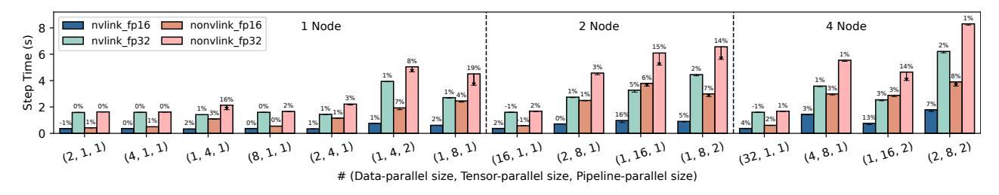
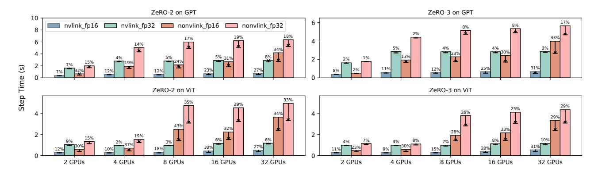
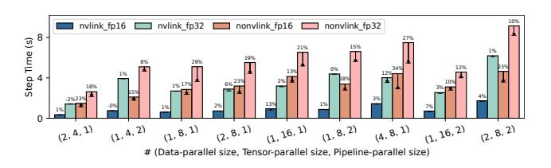
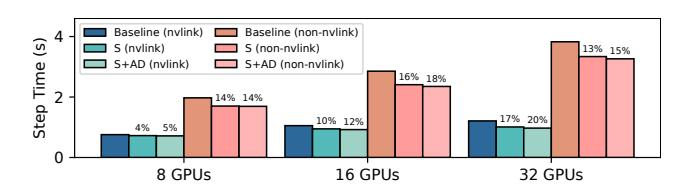

# 7 Evaluation

In this section, we present an evaluation of Concerto's performance on large-scale training tasks employing PTD (pipelinetensor-data) parallelism, ZeRO-powered data parallelism, DAP (dynamic axial parallelism) [\[7\]](#page-14-7), and automatic parallelism for billion-scale deep learning models such as GPT [\[5\]](#page-14-2), ViT [\[14\]](#page-14-1), Evoformer [\[22\]](#page-14-11), and WideResNet [\[49\]](#page-15-15).

All experiments were conducted on a public cloud platform with a configuration comprising 4 nodes equipped with a total of 32 GPUs. Each node is furnished with 8 NVIDIA A800-80GB GPUs connected via NVLink (400 GB/s bandwidth), 800 GB of memory, and 64 vCPUs. Inter-node communication is facilitated by 800 Gbps cross-node bandwidth. The software environment includes CUDA 12.0, PyTorch v2.1.2, and NCCL v2.18.6.

We conduct comparative analyses of Concerto against leading distributed systems designed for training large-scale models on GPUs. Specifically, for PDT Parallelism, we compare Concerto with Megatron-LM v3.0 and Jax 0.4.30 (for Google Decomposition [\[47\]](#page-15-5)). For ZeRO, we evaluate against DeepSpeed v0.12.4 [\[38\]](#page-15-7). For DAP, we evaluate against the implementation from FastFold [\[7\]](#page-14-7). Lastly, for auto-parallelism, we benchmark Concerto against Alpa v0.2.3 [\[52\]](#page-15-8). To cover a more diverse hardware environment of computing and communication, we performed performance tests in both float16 and float32 precision, with NVLink enabled or disabled.

We use step time and acceleration ratio as our performance metrics. Step time refers to the duration required for a single step during the training process, while acceleration ratio represents the speedup compared to the baseline. Since all optimizations do not affect computational semantics, the training curve keep consistency and the ratio indicates the overall end-to-end training acceleration.

Table 2. Specification for benchmark models.

| Model            | Hidden Size | #heads       | #layers |
|------------------|-------------|--------------|---------|
| GPT-0.9B         | 2048        | 16           | 18      |
| GPT-3.6B         | 4096        | 32           | 18      |
| GPT-5.7B         | 5120        | 32           | 18      |
| GPT-14.5B        | 8192        | 32           | 18      |
| GPT-32.6B        | 12288       | 48           | 18      |
| Model            | Hidden Size | #heads       | #layers |
| ViT-0.8B         | 2048        | 8            | 16      |
| ViT-3.2B         | 4096        | 16           | 16      |
| ViT-5.0B         | 5120        | 20           | 16      |
| Model            | Hidden Size | d_node       | d_pair  |
| Evoformer-0.04B  | 128         | 1024         | 512     |
| Evoformer-0.10B  | 192         | 1536         | 768     |
| Evoformer-0.19B  | 256         | 2048         | 1024    |
| Model            | Channel     | Width Factor | #layers |
| WideResNet-1.2B  | 320         | 2            | 50      |
| WideResNet-4.7B  | 640         | 2            | 50      |
| WideResNet-10.5B | 960         | 2            | 50      |

#### 7.1 End-to-End Performance

In this section, we conduct end-to-end performance comparison under four parallel settings: PTD Parallelism, ZeRO Parallelism, DAP, and Automatic Parallelism. PTD Parallelism is one of the highest-performing parallel methods and includes extensive manual communication optimizations. By comparing Concerto with the state-of-the-art PTD Parallelism systems, we aim to demonstrate that Concerto fully encompasses these manual communication optimization spaces. Furthermore, in commodity communication (non-NVLink), Concerto is more adaptable compared to manual communication optimizations. Next, in ZeRO Parallelism, we will showcase Concerto's scheduling and fusion capabilities by comparing it to DeepSpeed. For more complex models and

**Figure 9.** End-to-end performance improvement compared with Megatron-LM for GPT. The bars represent Megatron-LM's step time and the short lines within each bar indicate Concerto's step time. The acceleration ratio is displayed above each bar.

parallelization methods, such as Evoformer with DAP, Concerto can achieve better performance than manual optimization. Finally, the automatic parallelism comparison aims to prove that Concerto can effectively perform communication optimization across any model and parallel method.

#### 7.1.1 PTD Parallelism compared with Megatron-LM.

Megatron-LM employs PTD Parallelism and is regarded as one of the top-performing solutions for training large models. It undergoes extensive manual parallelization and communication optimization on NVIDIA platforms. In our comparison of PTD Parallelism, we utilize Megatron-LM v3.0 [31] as the baseline system and evaluate it with the GPT model. With different test cases and varying sizes of model parallelism (MP), we employed multiple sizes of GPT models. Specifically, we used 0.9B when MP = 1, 3.6B when MP = 4, 14.5B when MP = 8, and 32.6B when  $MP \geq 16$ .

Comparing Concerto's performance to Megatron-LM's, Concerto achieves a maximum acceleration of 19.0% and an average of 3.5%. Notably, in scenarios involving tensor parallelism, Concerto demonstrates significant superiority. The primary communication cost in tensor parallelism occurs during the all-reduce in both the forward and backward passes. Leveraging auto-decomposition, Concerto enables the all-reduce in the forward pass to overlap with computations within the decomposition context. Additionally, in the backward pass, Concerto's scheduling identifies more computations that can overlap with the all-reduce.

We find that the effectiveness of optimization is greatly influenced by the communication-computation ratio. Due to the significant differences in computational capabilities between FP32 and FP16, and the substantial differences in communication capabilities between NVLink and non-NVLink, the overlap of computation and communication is less effective when there are large disparities between them. This is because the part that can be accelerated constitutes a smaller proportion of the total time. However, when computational and communication capabilities are well-matched, such as with NVLink FP16 and non-NVLink FP32, we observe more significant optimization results.

With the optimal plan for GPT end-to-end training, the best configuration for GPT-32.6B training on 32 GPUs is (4, 8, 1). This means that in an end-to-end experimental setup,

data parallelism is implemented inter-node, while tensor parallelism is implemented intra-node. Concerto achieves a 3% performance improvement over Megatron-LM. However, in the context of NVLink, Megatron-LM has undergone extensive manual optimization, resulting in minimal communication overhead. Therefore, the end-to-end optimization effect is not very significant. Under these conditions, Concerto's main optimization comes from auto-decomposition, which reduces the exposure time of forward all-reduce operations. As described in the motivation, Concerto aims to achieve performance optimization through automatic communication optimization in more general models and parallel settings. In the PTD parallel scenario, we have achieved optimization effects comparable to extensive manual optimizations.

7.1.2 PTD Parallelism compared with Jax/XLA. Google Composition [47] is implemented in the XLA compiler and can be used in JAX by setting specific environment variables. The xla\_gpu\_enable\_latency\_hiding\_scheduler enables latency hiding schedulers to overlap communication. The xla\_gpu\_multi\_streamed\_windowed\_einsum enables optimizations from Google Decomposition. Figure 11 presents the performance comparison. With NVLink disabled, Concerto demonstrates a significant performance advantage, upto 34%. Notably, Jax/XLA's performance is even lower than that of Megatron-LM because the inefficient scheduling strategy. This highlights Concerto's solver's superior adaptability and advantage over heuristic algorithms and fixed decomposition strategies. With NVLink enabled, Concerto still maintains a notable improvement over Jax/XLA, upto 13.4%. For detailed analysis of the impact of scheduling and decomposition, please refer to Section 7.2.

Regarding performance differences between PyTorch and Jax/XLA at the framework level, we observed the total time for computation and communication (without overlap) under the (2, 4, 1) parallel strategy. PyTorch's computation time was slightly higher than Jax/XLA's: 290.3 vs 280.0 ms in FP16, and 1384.5 vs 1358.4 ms in FP32. However, PyTorch's communication time was slightly lower: 73.1 vs 75.6 ms with NVLink, and 1099.6 vs 1199.6 ms without NVLink. The main reasons are that Jax/XLA achieved better operator fusion for some memory-bound operators, while its bucket and communication balance is suboptimal.

**Figure 10.** End-to-end performance improvement compared with DeepSpeed for GPT and ViT. The bars represent DeepSpeed's step time and the short lines within each bar indicate Concerto's step time. The acceleration ratio is displayed above each bar.

**Figure 11.** End-to-end performance improvement from Concerto compared with Jax/XLA for GPT.

**7.1.3 ZeRO-powered data parallelism.** ZeRO exists several variations, with ZeRO-2 and ZeRO-3 being the most prevalent in practical applications. For our performance evaluation, we selected GPT [5] and ViT [14] as benchmark models. We used different model size depending on the number of GPUs. With 2 GPUs and 4 GPUs, we used GPT-0.9B / ViT-0.8B. For 8 GPUs and 16 GPUs, we used GPT-3.6B / ViT-3.2B. For 32 GPUs, we used GPT-5.7B / ViT-5.0B.

Figure 10 illustrates the performance enhancements of two models under ZeRO-2 and ZeRO-3 compared to Deep-Speed. For ZeRO-2, Concerto demonstrates a maximum performance improvement of 42.9% and an average improvement of 19.1% compared to DeepSpeed. Regarding ZeRO-3, Concerto exhibits a maximum performance improvement of 33.2% and an average improvement of 15.1% compared to DeepSpeed. In scenarios with NVLink, where communication time constitutes a smaller proportion of the overall runtime, the benefits of scheduling are minimal. However, in situations with slower communication, Concerto's advantages become evident. Compared to the fixed communication optimization strategies in DeepSpeed, Concerto's primary performance improvement comes from better communication scheduling and the application of communication fusion. Additionally, Concerto determines communication strategies at compile time, eliminating additional overhead at runtime. Furthermore, we observe that ZeRO-2 achieves slightly higher acceleration ratios. This is primarily due to Concerto enable overlap between all-gather operations and

the forward computation of the next step. Further details are provided in Section 7.3.

**7.1.4 Dynamic Axial Parallelism.** DAP is proposed in FastFold [7], specifically for the backbone network Evoformer in AlphaFold2 [22]. Although Evoformer has a relatively small number of parameters, it requires substantial activation memory due to the two sequence axes data. DAP involves switching and combining sequence axes, introducing all-to-all and all-gather. Despite FastFold's have handcrafted optimization to achieve asynchronous communication, the communication cost remains significant. We benchmark Concerto's optimization performance with parameter sizes of 0.04B, 0.10B, and 0.19B on 8, 16, and 32 GPUs, as shown in Figure 12. S means using only scheduling in Concerto, while S+AD indicates using scheduling with auto-decomposition. The individual contributions of scheduling and auto-decomposition can be observed. Endto-end, Concerto achieves an average acceleration of 12.5% and 15.6%, and a maximum acceleration of 19.7% and 17.7%, compared to manually optimized DAP.

**Figure 12.** End-to-end performance of baseline and Concerto for DAP. S means only use scheduling, S+AD means use scheduling with auto-decomposition. Acceleration ratio is labeled above the bars.

**7.1.5 Automatic Parallelism.** Unlike the three types of parallelism above, automatic parallelism tends to introduce more complex and irregular communication patterns. Specific communication optimizations are more difficult to apply in this scenario. We use Alpa v0.2.3 [52], an auto-parallel

compiler based on JAX [16] and XLA [17], as our baseline. For model selection, we refer to Alpa and choose GPT [5] and WideResNet [49], with WideResNet being more heterogeneous in terms of model structure. With 8 GPUs, we employed GPT-3.6B and WideResNet-1.2B. For 16 GPUs, we used GPT-14.5B and WideResNet-4.7B. For 32 GPUs, we utilized GPT-32.6B and WideResNet-10.5B.

Since communication optimization primarily targets intraoperator parallelism, we focus solely on intra-operator parallelism. In Figure 13, it is evident that Concerto demonstrates significant performance improvements, reaching up to a maximum of 22.7% and averaging 11.1%. This is particularly notable in scenarios without NVLink or across multiple nodes. It can be observed that GPT experiences some performance degradation when NVLink is enabled on 8 GPUs, primarily due to the inherent computational performance differences between JAX and PyTorch.

**Figure 13.** End-to-end performance improvement compared with Alpa for GPT and WideResNet. Acceleration ratio is labeled above the bars.

#### 7.2 Ablation Study

For ablation study, we focus on the effectiveness of autodecomposition and the fused communication.

The performance improvement from Scheduling and Auto-decomposition. We can observe the optimization effect of scheduling and auto-decomposition separately through an example of Tensor Parallelism. Table 3 illustrates the performance comparison of running GPT with Concerto(S) (only use scheduling) and Concerto(S+AD) (use scheduling with auto-decomposition) on 16 GPUs. Regarding the improvement from scheduling, we can see that under the NVLink FP16 and no-NVLink FP32 experimental setups, the optimization effect of Concerto is significantly more pronounced. In comparing JAX/XLA on S and S+GD, we have made the following observations: 1) it is hard to achieve genuine optimization with XLA when GD is enabled. 2) with NVLink enabled, Concerto's scheduling optimization is superior to XLA. 3) with NVLink disabled, XLA's performance

significantly deteriorates, indicating that its heuristic algorithm cannot adapt to different hardware environments.

The effectiveness of optimization depends on the ratio of communication. In scenarios with NVLink FP16 and no-NVLink FP32, where there is a balanced ratio, the benefits become more pronounced. For the improvement from auto-decomposition, under FP16 precision, the overhead introduced by decomposition becomes more apparent. However, under FP32, the optimization effect of auto-decomposition becomes more significant. In scenarios without NVLink, where communication is more of a bottleneck, the effectiveness of Concerto becomes even more evident.

**Table 3.** Comparison of step time (s) for GPT models. (S) means only use scheduling, (S+AD) means use scheduling with auto-decomposition in Concerto, (S+GD) means enable scheduling and Google Decomposition in JAX/XLA.

| GPT on 16 GPUs |              | NVLink |       | no-NVLink |       |
|----------------|--------------|--------|-------|-----------|-------|
|                | ro (P, T, D) | FP16   | FP32  | FP16      | FP32  |
| Megatron-LM    | (1, 16, 1)   | 0.974  | 3.276 | 3.793     | 6.093 |
|                | (1, 8, 2)    | 0.907  | 4.455 | 2.996     | 6.566 |
| Jax/XLA        | (1, 16, 1)   | 0.956  | 3.258 | 4.389     | 6.823 |
|                | (1, 8, 2)    | 0.896  | 4.400 | 3.502     | 6.689 |
| Jax/XLA (S)    | (1, 16, 1)   | 0.942  | 3.192 | 4.219     | 6.773 |
|                | (1, 8, 2)    | 0.872  | 4.396 | 3.394     | 6.634 |
| Jax/XLA        | (1, 16, 1)   | 0.943  | 3.193 | 4.135     | 6.530 |
| (S+GD)         | (1, 8, 2)    | 0.871  | 4.385 | 3.392     | 6.606 |
| Concerto       | (1, 16, 1)   | 0.86   | 3.252 | 3.723     | 5.544 |
| (S)            | (1, 8, 2)    | 0.883  | 4.446 | 2.897     | 6.295 |
| Concerto       | (1, 16, 1)   | 0.817  | 3.127 | 3.584     | 5.178 |
| (S+AD)         | (1, 8, 2)    | 0.866  | 4.366 | 2.788     | 5.616 |

The Effectiveness of Fused Communication. In scheduling, communication fusion is a crucial optimization technique to ensure efficiency. In ZeRO scenarios, numerous communications need to be fused. We observe the effectiveness of communication fusion in Concerto Scheduling within this scenario. Table 4 shows the improvement from communication fusion. It can be observed that as the scale increases, the improvement brought by communication fusion becomes more significant.

**Table 4.** Step time (s) improvement from communication fusion for GPT models with Concerto ZeRO-3 Parallelism.

| GPUs | FP16                      | FP32                      |  |
|------|---------------------------|---------------------------|--|
| 8    | $0.517 \to 0.505$         | $2.732 \rightarrow 2.723$ |  |
| 16   | $0.531 \rightarrow 0.504$ | $2.742 \rightarrow 2.722$ |  |
| 32   | $0.614 \rightarrow 0.468$ | $2.801 \rightarrow 2.771$ |  |
|      |                           |                           |  |

#### 7.3 In-Depth Analysis

Case study. Through an examination of Concerto's scheduling results, we identify several specific enhancements compared to the baseline. These scheduling optimizations are challenging to discover manually and difficult to implement, but Concerto's scheduling can automatically uncover such optimization opportunities.

1. In tensor parallelism, Megatron-LM re-implement the forward and backward of Linear layers, enabling overlap between the all-reduce during backward computation and the calculation of parameter gradients (matrix multiplication). However, we observed that sometimes the computation time of this matrix multiplication is lower than the communication time. In such cases, Megatron-LM cannot achieve optimal performance. However, in Concerto, we observe that the scheduling algorithm schedules other operations in the backward pass to overlap with the all-reduce (in general, there is significant scheduling flexibility for computing parameter gradients during the backward pass). This provides noticeable scheduling opportunities, especially in scenarios without NVLink. Additionally, Megatron-LM cannot make any optimizations for the all-reduce in the forward pass. However, in Concerto, thanks to auto-decomposition, computation and communication can also overlap.

2. In ZeRO parallelism, In DeepSpeed's ZeRO-2 implementation, because the optimizer state is sharded but the weights are not, there is a synchronized all-gather at the end of the optimizer. This all-gather is not overlapped. This obviously becomes a serious problem, especially without NVLink and cross-machine. In Concerto, we introduce an asynchronous return mechanism, i.e., we allow the computational graph to directly return unsynchronized communication tensors and complete the synchronization the next time the computational graph uses these tensors. By introducing such a mechanism, we can overlap this all-gather communication with the next forward computation.

Compilation Time. The compilation process consists of three phases: profiling, auto-decomposition, and scheduling. Profiling typically takes only a few tens of seconds for benchmark models with caching mechanism. The autodecomposition phase usually completes within one second, largely because the number of communication operators is relatively small, and there are few overlapping of decomposition contexts, allowing for rapid solution computation. Figure 14 illustrates the acceleration ratios and solution times under different odd-even scheduling rounds for two cases. At 0 rounds, equivalent to no scheduling, the runtime is the baseline. As the number of rounds increases, the acceleration ratio gradually becomes higher, and the solution time almost linearly increases. In the first case, ViT is parallelized with ZeRO-3 across 8 GPUs, involving a substantial amount of communication operators requiring scheduling. Each round

takes around 30 seconds. It achieves nearly optimal acceleration ratio around 4 rounds. For WideResNet with automatic parallelization across 8 GPUs, each scheduling round takes about 2 seconds. It reaches close to optimal acceleration ratio around 6 rounds. In practical scenarios, the compilation can typically be completed within several minutes, which is negligible compared to the days-long training duration.

**Figure 14.** The acceleration ratio and solver time with increased rounds of odd-even scheduling.

#### 8 Related Work

Parallelism for Large-Scale Deep Learning. Parallelism serves two primary purposes: 1) scaling computation to leverage more computational resources; 2) partitioning parameters of large models to facilitate training models with significantly greater capacity than the HBM of a single GPU. Presently, main parallelism approaches include data parallelism [27], tensor model parallelism [23, 31], pipeline model parallelism [20, 26, 28], and DeepSpeed ZeRO [37]. During training, different parallelisms introduce varying communication costs. Some work, such as Alpa [52] and Unity [44], employs automation algorithms to determine optimal parallelism combinations. Concerto optimizes any parallelism approach, including auto-parallelism, reducing communication overhead through improved overlap with computation. Communication Optimization. Communication optimization is a widely used technique in high performance computing [9, 18, 33]. Existing work on DL workload can be divided into two categories: scheduling optimization and primitive optimizing. Many works aim to minimize communication overhead for specific parallel approaches, such as TicTac[19] and ByteScheduler[34] for data parallelism (parameter server and all-reduce). Recently, Google[47] has introduced decomposition as a method to effectively overlap communication introduced by tensor parallelism. CoCoNet[21] enables fine-grained overlap and fusion of computation and communication. CocoNet proposes a scheduling space for

fine-grained communication optimization and focuses on implementing overlap under decomposition but lacks an automated algorithm to explore this search space. T3 [\[32\]](#page-15-19) is a hardware-software co-design approach that reduces the mutual interference between computation and communication, achieving fine-grained communication and computation with lower overhead. Concerto, through scheduling and auto-decomposition, identifies more opportunities for overlapping computation and communication. Concerto can complement T3 to achieve better performance. In contrast, Concerto emphasizes exploring decomposition and scheduling spaces through automated algorithms. Others, like Blink [\[46\]](#page-15-20) and MSCCLang [\[8\]](#page-14-20), focus on optimizing the performance of the communication primitives in sophisticated network and topology. These primitive optimizing and Concerto are orthogonal and can be combined in future works. Compilers for Machine Learning. Most ML Compilers, such as TVM [\[6,](#page-14-21) [15\]](#page-14-22), primarily focus on optimizing inference performance. A smaller subset, including XLA [\[17\]](#page-14-6) and AStitch [\[53\]](#page-15-21), also support training. These efforts concentrate on kernel fusion and generating high-performance code. Many compiler projects, particularly those based on XLA, are oriented towards parallel training, such as GSPMD [\[48\]](#page-15-22), GShard [\[25\]](#page-14-23), and Alpa [\[52\]](#page-15-8). Some projects schedule the order of operators or employ chunking strategies to reduce peak GPU memory usage, as seen in MODeL [\[42\]](#page-15-23) and AutoChunk [\[50\]](#page-15-24). There are several works on inter-operator scheduling, such as IOS [\[13\]](#page-14-24), Rammer [\[30\]](#page-15-25), and AutoGraph [\[51\]](#page-15-26), which improve GPU computational resource utilization by scheduling the order of operators to enable inter-operator parallelism. The purpose of Concerto's scheduling is to overlap communication, and its main difference from these works is that due to the lack of metrics for communication operators, such as inter-GPU bandwidths, previous approaches treated communication operators as atomic black boxes, leading to missed optimization opportunities. However, with Concerto's auto-decomposition, it can create overlap opportunities and partition these atomic communication operators, thereby expanding the scheduling space.

