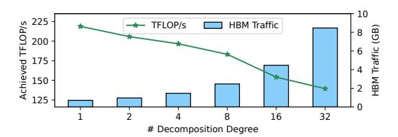

# **Algorithm 2:** BFS Algorithm for Decomposition Context Exploration in the Successor Direction

```
Input: N_{comm}, Axis_{N_{comm}}

S \leftarrow \{N_{comm}: Axis_{N_{comm}}\}

Q \leftarrow EmptyQueue

t_d \leftarrow 0

Q.enqueue(all computation children of N_{comm})

while Q is not empty and t_d \ge t_{N_{comm}} do

N = Q.dequeue()

Axis_N = SPMDPropagate(N, S[N.predecessor])
\nif Axis_N is found then

S[N] = Axis_N

t_d + t_N

Q.enqueue(all computation children of N);
\nend
\nend

return S
```

#### <span id="page-6-2"></span>5.3 Cost of Each Strategy

The cost of a decomposition strategy is determined by the non-overlapped portion of communication. Let's define the parameters *decomposition degree*: N represents the number of decomposition partitions;  $\alpha$  denotes the slowdown ratio of the computation stream when overlapping;  $T_C$  is the time taken for critical communication;  $T_{pre}$  ( $T_{post}$ ) is the sum of the time taken for the predecessor (successor) node in the decomposition context. There are three scenarios where the

communication portion cannot be overlapped with computation. For example, in Figure 6(b), both the preceding and succeeding computations can only offer (N-1)/N overlapping opportunities for communication; thus, nodes  $3_0$ ,  $4_0$ , and  $6_1$  cannot overlap with communication. Therefore, case one corresponds to the total time provided by the preceding and succeeding computations being less than  $T_C$ . Additionally, when either the preceding or succeeding computation time is too short, providing fewer overlapping opportunities than  $T_C/N$ , for example, when the times for nodes  $3_0$  and  $4_0$  are less than  $5_0$ , the succeeding computation cannot overlap the remaining first communication. These three scenarios correspond to the three costs in the following formulas, with the final cost being the maximum among these three costs:

$$cost_1 = T_C - \alpha * (N-1) * (T_{pre} + T_{post})/N$$

$$cost_2 = T_C/N - \alpha * (N-1) * T_{pre}/N$$

$$cost_3 = T_C/N - \alpha * (N-1) * T_{post}/N$$

$$cost = max\{cost_1, cost_2, cost_3, 0\}$$
(5)

We empirically set  $\alpha$  to 1.2. Micro-benchmark tests revealed the performance degradation ratios for three categories of operators: 1) *General Matrix Multiply*, 2) *Batch Reduction*, and 3) *Element-wise Operators*. The benchmarks with MatMul, LayerNorm, and Elementwise-Add, when overlapping with communication operations, showed degradation ratios of 18.2%, 21.9%, and 23.8%, respectively. Based on these results, we used 20% as an empirical estimate, leading to the choice of  $\alpha = 1.2$ .

#### <span id="page-7-1"></span>5.4 Overhead Cost

Decomposition effectively enhances the opportunity for overlap. However, it also introduces certain overheads. Decomposed operators typically exhibit lower degrees of parallelism, resulting in reduced resource utilization. Additionally, decomposition may lead to increased High Bandwidth Memory traffic. Furthermore, it introduces kernel launch overhead and recovery overhead, such as the incorporation of tensor concatenation as a combination function.

Figure 8 illustrates a example to observe the quantifiable impact of decomposition overhead. In the GPT Feed-Forward module, we can see that as the decomposition degree, N (the number of decomposition partitions), increases, the Achieved TFLOP/s decreases. Additionally, the HBM Traffic, estimated from the input and output tensors of each operator, shows a significant increase.

To model the overhead cost, we profile the runtime difference between the decomposition operators and the original operators across various decomposition strategies. The *decomposition overhead cost* is calculated as the total runtime of the decomposition operators subtracted from the execution time of the original operators. We add this overhead to the cost of each decomposition strategy to ensure that we select

<span id="page-7-0"></span>

**Figure 8.** Achieved TFLOP/s and HBM Traffic for different decomposition degrees of Feed-Forward. Benchmarked on an NVIDIA A800 with an input shape of (4, 1024, 4096).

the strategy with the smallest overhead. In cases where decomposition results in significant performance degradation, the non-decomposition strategy will be chosen.

#### 5.5 Solve the optimal strategy

If there is no intersection between nodes involved in critical communication and all other critical communication decomposition strategies, we simply adopt the strategy with the lowest cost for each. However, if there is an intersection, we need to consider the additional cost of their mutual influence. Assuming two critical communications each choosing strategies  $S_{C_i,m}$  and  $S_{C_i,n}$  respectively, with their node intersection denoted as U. We calculate the additional cost  $(M_{ijmn})$  in two scenarios: 1) When the decomposition axes in the intersection of the two strategies are different, nodes can only overlap for one critical communication. Thus, the cost is  $\sum_{i \in U} T_i * (N-1)/N$ . 2) When the decomposition axes in the intersection of the two strategies are the same, nodes can only provide overlap equal to their own runtime. Therefore, the cost is  $\sum_{i \in U} T_i * (2 * (N-1)/N - 1)$ . If we have  $k_i$  strategies for  $C_i$  and  $k_j$  for  $C_j$ , the cost matrix between node  $C_i$  and node  $C_j$  can be calculated as  $M_{ij} \in \mathbb{R}^{k_i \times k_j}$ .

We utilize ILP (Integer Linear Programming) to determine the optimal decomposition strategy for each critical communication. For each node  $C_i$ , we define a one-hot decision vector  $s_i \in \{0,1\}^{k_i}$  to represent the strategy it employs. Here,  $s_{ix} = 1$  indicates that we select the x-th strategy for  $C_i$ . The cost vector for node  $C_i$ , denoted as  $cost_i$ , can be calculated as illustrated in Sections 5.3 and 5.4. All nodes that have intersections in the decomposition strategies will form an edge, which we denote as E. The objective of the problem is formulated as  $min_s \sum_{C_i \in C} s_i^T cost_i + \sum_{C_i, C_j \in E} s_i^T M_{ij} s_j$ , where the first term is to minimize the cost for each critical communication node, while the second term is to minimize mutual influence of different nodes.

#### 6 Implementations

Concerto is built on top of the PyTorch 2.0 [2] compiler stack. This section will outline some key implementation details.

#### 6.1 ConcertoIR and Profiling Module

ConcertoIR extends ATen IR by enriching it with additional operator-level information while maintaining torch.fx [\[39\]](#page-15-14) as the underlying data structure. Each operator in ConcertoIR is annotated with SPMD information (SPMDSpec) using EasyDist [\[1\]](#page-13-1) which is utilized by the auto-decomposition module to explore decomposition strategies. To reduce the overhead of the profiling module, the profiling results are persisted using the operator name and input as unique identifiers to skip profiling for identical operators and inputs.

#### 6.2 Runtime

After the Concerto compiler completes auto-decomposition and scheduling, we obtain an optimized topological sequence. The runtime is lightweight; it simply traverses this topological sequence, dispatching all computational operators to the default CUDA Stream and all communication operators to an another CUDA Stream dedicated for communication. And we design a special end-of-communication marker operator ensures that by the time the default CUDA Stream needs to use the buffer produced by a communication operator, the communication has already been completed.

#### 6.3 Extensibility

Concerto leverages torch.\_custom\_ops, allowing the registration of custom kernels as ATen operators to utilize highperformance implementations of operators like Megatron-LM or flash attention [\[10\]](#page-14-10).

Users can extend Concerto to support other type of parallelism, simply express their desired parallel method as a transformation of the fx Graph and then register it using concerto.register\_parallel\_method. Communication optimizations can then be directly applied to the transformed computational graph, encompassing both communication and computation operators, thus supporting userdefined parallel methods.

