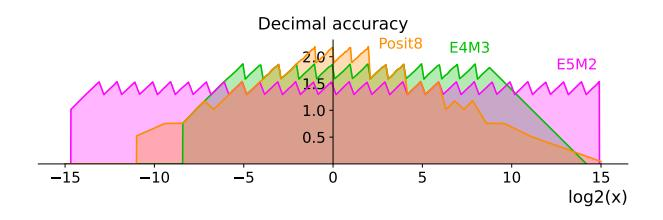
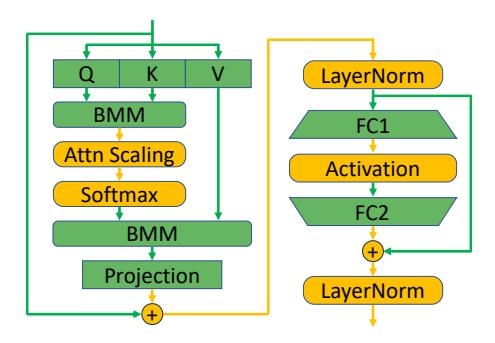
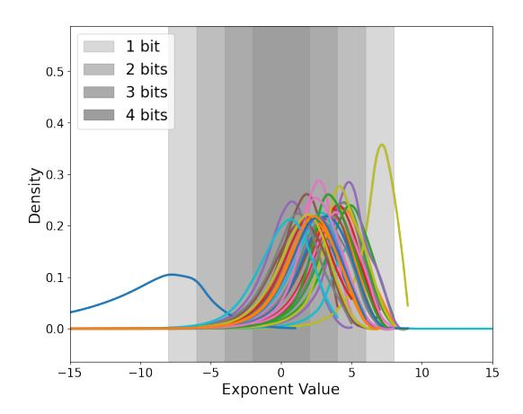
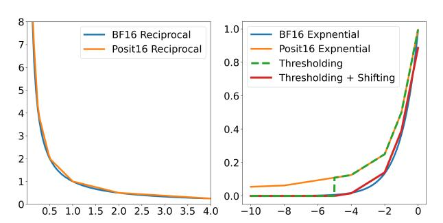
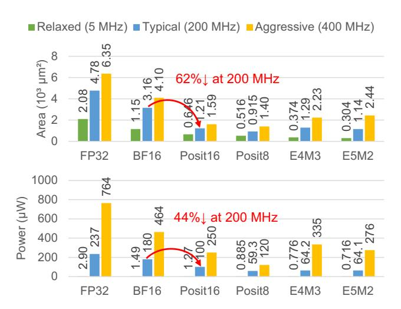
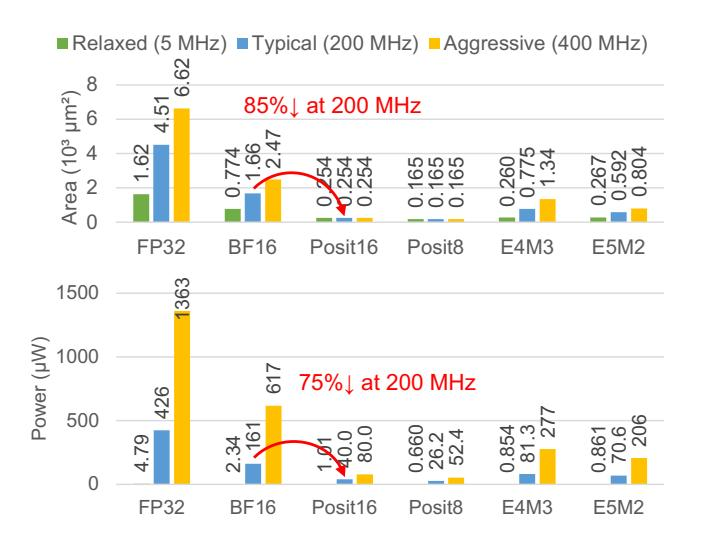

# 3 Posit for DNN Training

Posit is the third generation of universal numbers, designed to supersede IEEE Standard 754 floating-point numbers [10]. Compared to floating-point, posit numbers have more extensive dynamic range, tapered precision, and reduced space requirements. These benefits render posit numbers well-suited for DNN training and inference.

Figure 4. Decimal accuracy of FP8 (E5M2, E4M3) vs. Posit8.

Posits comprise of four fields: sign, regime, exponent, and fraction, as shown in Figure 1. Aside from the sign bit, all fields are variable length. This is one of the key differences versus traditional floating-point formats, which only contain fixed length fields, as shown in Figure 2. The sign bit denotes the number's positive or negative nature. The following regime field is a series of identical bits terminated by a contrasting bit, whose the numerical value, k, depends on the run length. Let m be the number of identical bits in the run and k be the value of regime; if the repeating bits are 0, then k = -m; if they are 1, then k = m - 1. Regime is unique to posits and is not present in floating-point. The regime signifies a scaling factor of  $useed^k$ , where  $useed = 2^{2^{es}}$  and es represents the number of exponent bits. Following the regime bits are the exponent bits. Posits do not always have exponent bits; they can contain up to es exponent bits that represent a scaling factor of  $2^e$ , where e is the unsigned value of the exponent bits. The remaining bits are allocated to the fraction field. Similar to floats, there is an implicit 1 before the fraction part. As shown in Figure 3, numbers are represented with different number of regime, exponent, and fraction bits, depending on their magnitude. Combining all elements, the value of posit numbers is derived from the sign (s), regime, exponent (e), and fraction (f) fields as follows:

$$x = (-1)^{s} \cdot 1.f \cdot (2^{2^{es}})^{k} \cdot 2^{e} \tag{1}$$

As a result of the variable-length fields, posits have a tapered precision, which means that their precision decreases more rapidly vs. floating-point as the true numerical value moves further away from 1. This property is illustrated in Figure 4 for Posit8 vs. FP8. For DNNs, where most tensor values typically follow a Gaussian distribution, this property of posits can be leveraged effectively.

In this paper, we use 8-bit posit with 1 exponent bit (es = 1), denoted as Posit (8, 1), or simply Posit8. When contrasted with Posit (8, 0), the range of Posit (8, 1) is considerably more extensive, spanning from  $2^{-12}$  to  $2^{12}$ . In comparison, Posit (8, 0) is limited in its representational capacity, only able to cover numbers from  $2^{-6}$  to  $2^6$ . The extended range is necessary for representing activations and gradients.

#### 3.1 Posit Encoding and Decoding

Posits must be decoded into a format resembling floatingpoint before most arithmetic operations can be performed. The decoding process for a posit proceeds from left to right, following the order of regime, exponent, and fraction. The regime value is decoded by counting the number of repeating bits immediately following the sign bit. This step can be implemented using a leading one counter in hardware. The regime value carries a weight of  $2^{es}$ , resulting in an effective power of 2 scaling of  $2^{es} \cdot k$ . If any bits remain after decoding the regime, they are first allocated to the exponent, leading to a total power of 2 scaling of  $2^{es} \cdot k + e$ , where e is the unsigned exponent value. All remaining bits after the exponent are the fraction.

Values must be converted back to posit format before being stored in memory. The encoding process for posits also proceeds from left to right. First, the floating-point exponent is decomposed into the posit regime and exponent. The length of the regime is determined by dividing the exponent by  $2^{es}$ , and the posit exponent is obtained by taking the floating-point exponent modulo  $2^{es}$ . Based on the length of the regime and the value of the exponent, the number of fraction bits can be determined. The sign, regime, exponent, and fraction are then assembled, and rounding is performed using the round-to-even policy.

#### 3.2 Posit Arithmetic with Fused Operations

Similar to floating-point, posits use fused operations, which means deferring rounding until the last operation in a series of operations [10]. Fusing operations enhances efficiency by eliminating continuous encoding and decoding of intermediate outputs. Additionally, bypassing the encoding and decoding stages reduces quantization error during accumulation. This is consistent with modern DNN accelerators which typically employ a high-precision format for accumulation.

#### 3.3 Approximate Operations Using Posits

Sigmoid Approximation. Posits with 0 exponent bits can approximate the sigmoid function by inverting the most significant bit and shifting all bits two positions to the right (shifting in 0 bits on the left) [6]. Note that this approximation is specific to posits with 0 exponent bits. However, Posit8 with one exponent bit achieves better performance for Transformer training and inference due to its extended range. Consequently, a conversion process must be implemented to take advantage of the approximation.

**Reciprocal Approximation.** Using posits with arbitrary exponent bits we can approximate reciprocal by performing a bitwise XOR operation with a negated *signmask* [6]. The *signmask* is defined as 1 for the sign position and 0 elsewhere. This operation is equivalent to inverting all the bits except the sign bit, and it can be implemented using NOT gates. Posit reciprocal is a piece-wise linear function as illustrated in Figure 7. While the approximation of reciprocal using piece-wise linear functions has previously been proposed as a replacement for division in softmax [3], posit takes this

concept further by enabling the execution of this operation through simple bitwise operations, rather than arithmetic calculations, leading to better hardware efficiency.

We apply these two approximations to Transformer training and inference, as explained in next two sections.

#### 3.4 Posit Rounding

Posits adhere to the floating-point rounding mechanism in most instances, rounding numbers to the nearest representable posit values. However, posit saturates values beyond its representable range. For example, for Posit (8, 1), values are saturated at  $2^{12}$ , while values smaller than  $2^{-12}$  are rounded up to  $2^{-12}$ . The former case is a common practice in DNN training while the latter case presents problems. Gradients are often smaller than  $2^{-12}$  and rounding all of them up could easily lead to divergence. We use a round-to-even policy when the values are smaller than posit's minimum representable value, meaning that values smaller than  $2^{-13}$  would be rounded down to 0 instead of rounded up to  $2^{-12}$ . This is different from the original posit definition but proves to be useful in training DNNs with posits.

## 4 8-bit Transformer Inference

Performing Transformer inference using 8-bit number formats reduces both memory capacity and bandwidth requirements, and improves the area and energy-efficiency of MAC units. Existing research mostly focuses on the quantization of inputs to computationally intensive operations like GEMMs. However, GEMMs constitute only a subset of the operations performed during Transformer inference, meaning that a significant proportion of the activations are left in a high-precision format.

We evaluate the post-training quantization (PTQ) accuracy of quantizing GEMMs and different sets of element-wise operations on Transformers of various sizes. Specifically, we demonstrate the effect of quantizing inputs to residual addition, layer normalization, non-linear activation functions (e.g., softmax and GeLU), and attention scaling, as illustrated in Figure 5. To mitigate the accuracy loss from quantization, we fuse element-wise operations with the preceding GEMM operation to reduce quantization error. Note that we do not adhere to the conventional int8 practice of using per-channel scaling factors for weights and per-tensor scaling factors for activations, as our findings show that both Posit8 and FP8 formats can achieve good accuracy through operation fusion alone, without the need for scaling factors.

We first conduct an ablation study to assess the impact of quantizing different operations on accuracy. Table 1 shows MobileBERT and BERT F1 scores on the SQuAD v1.1 question answering dataset [25] when quantizing GEMM with other Transformer operations to Posit (8, 1). Our findings indicate that quantizing attention scaling has the largest impact on accuracy, followed by non-linear activations, layer

**Figure 5.** A typical Transformer block. GEMM operations are colored green while non-GEMM operations are yellow.

| Operations          | MobileBERT | BERT |
|---------------------|------------|------|
| BF16                | 89.9       | 88.2 |
| GEMM                | 89.4       | 88.1 |
| GEMM + Residual     | 89.0       | 88.1 |
| GEMM + LayerNorm    | 88.7       | 88.1 |
| GEMM + Activation   | 86.7       | 88.1 |
| GEMM + Attn Scaling | 70.4       | 87.4 |
|                     |            |      |

**Table 1.** Accuracy impact of quantizing different Transformer operations to Posit8 in MobileBERT and BERT. The table shows F1 scores on the SQuAD v1.1 dataset.

normalization, and finally residual addition. Based on the results, we choose to apply operation fusion in the same order, from those with the greatest impact on accuracy to those with the least.

Table 2 shows the F1 score on the SQuAD v1.1 question answering dataset using post-training quantization with different levels of fusion applied to MobileBERT and BERT models. We apply fusion incrementally from left to right. For instance, the third column (marked "+ Activation Fusion") means the fusion of both attention scaling and activation functions with the previous GEMM, while the last column (marked "+ Residual Fusion") indicates fusing all operations. Our goal is to limit the accuracy loss to within 1%. Our results show that for small models like MobileBERT, we need to fuse all the operations with GEMM to achieve the goal. In contrast, with larger BERT models, we are able to quantize most operations with minimal accuracy loss. The figures in bold are the final configurations utilized for quantized inference. They also provide a benchmark for quantized training.

Our results show a gradual improvement in accuracy with higher levels of fusion, except in the case of MobileBERT where the impact of quantizing unscaled attention (the outputs of the query-key matrix multiplication) is much more drastic. This issue is predominantly due to MobileBERT's use of stacked feed-forward network (FFN) layers which results in a wider distribution of activations as illustrated

| Model                      | Size | BF16 | No Fi  | ısion | l      | l + Attn g Fusion |        | vation ion | + Laye Fus |      | + Res Fus |      |
|----------------------------|------|------|--------|-------|--------|----------------------|--------|---------------|---------------|------|--------------|------|
|                            |      |      | Posit8 | E4M3  | Posit8 | E4M3                 | Posit8 | E4M3          | Posit8        | E4M3 | Posit8       | E4M3 |
| MobileBERT tiny | 16M  | 88.8 | 86.3   | 87.0  | 87.4   | 87.1                 | 87.7   | 87.5          | 87.9          | 87.8 | 88.4         | 88.1 |
| MobileBERT                 | 25M  | 89.9 | 65.1   | 82.7  | 85.0   | 84.9                 | 88.3   | 86.7          | 89.0          | 87.9 | 89.4         | 88.6 |
| $DistilBERT_{base}$        | 66M  | 86.9 | 86.2   | 86.1  | 86.4   | 86.1                 | 86.7   | 86.4          | 86.7          | 86.5 | 86.7         | 86.5 |
| $BERT_{base}$              | 109M | 88.2 | 87.1   | 87.7  | 88.1   | 88.0                 | 88.1   | 88.0          | 88.1          | 88.0 | 88.1         | 88.0 |
| $BERT_{large}$             | 334M | 93.2 | 92.3   | 93.0  | 92.8   | 93.1                 | 93.0   | 93.1          | 93.0          | 93.2 | 93.1         | 93.1 |

**Table 2.** Transformers' F1 scores on SQuAD v1.1 using Posit8 and FP8 with varying levels of operation fusion. Figures in bold indicate the minimum fusion level needed to achieve within 1% accuracy drop. For MobileBERT models, we need to fuse all operations to achieve within 1% drop. For BERT models, we can easily achieve the same goal even without any fusion.

**Figure 6.** The activation distribution of each layer of Mobile-BERT during inference on SQuAD. The areas shaded from the darkest to the lightest represent value ranges where Posit8 has 4 to 1 fraction bits, respectively.

in Figure 6. In such cases, posit's tapered precision struggles to accurately represent most values, while FP8, with its uniform precision across its entire value range, has better performance. Interestingly, MobileBERTtiny, which features two fewer FFN layers, does not exhibit the same level of accuracy degradation when quantizing unscaled attention. This illustrates how the architectural distinctions of Transformer models can influence their numerical behavior, sometimes favoring one data type over another. Overall, Posit8 performs better than FP8 in most cases and both Posit8 and FP8 can reach within 1% of BFloat16 (BF16) accuracy.

#### 4.1 Approximate Softmax Using Posits

The softmax function  $(\sigma)$  occurs repeatedly in Transformer models (i.e., in every attention layer) unlike in CNNs where it appears only once at the end of the network. It is, therefore, critical to create an efficient posit implementation of the softmax function, computed as  $\sigma(\vec{z})_i = \frac{e^{z_i}}{\sum_k e^{z_k}}$ . Implementing softmax requires efficient posit exponential and

division (or reciprocal) functions. As previously described in subsection 3.3, posits enable the approximation of functions such as sigmoid and reciprocal using bitwise operations. The approximated reciprocal closely aligns with the exact reciprocal function (Figure 7, left). Replacing the division in softmax with this approximate reciprocal results in only 0.8% accuracy loss on MobileBERT models and 0.1% on BERT models during inference (Table 4). By utilizing the approximate reciprocal, we can entirely avoid area-consuming floating-point dividers in hardware.

**Figure 7.** Left: Posit reciprocal is a piece-wise linear function that connects points with x-values corresponding to powers of 2. Right: The orange curve shows posit exponential using approximate sigmoid and reciprocal. It fails to converge to 0 as inputs approach negative infinity. The green and red curves show the effect of thresholding and shifting. Inputs smaller than -5 are rounded down to 0, while inputs between -5 and 0 closely mimic the floating-point exponential curve.

To construct the exponential function, we use the sigmoid function (*S*) from subsection 3.3 as follows:

$$S(x) = \frac{1}{1 + e^{-x}} \Rightarrow e^x = \frac{1}{S(-x)} - 1$$
 (2)

That is, exponential is implemented by an approximate sigmoid, a reciprocal and a subtraction. It is important to note that the exponential approximation is valid only for non-positive inputs. However, this is not a concern for numerically stable softmax, as the maximum input value  $\max(\vec{z})$  is

| Threshold $(\theta)$ | Accuracy 1 | Epsilon $(\epsilon)$ | Accuracy 2 |
|----------------------|------------|----------------------|------------|
| -5                   | 80.4       | -1.109               | 89.4       |
| -4                   | 86.5       | -1.125               | 89.6       |
| -3                   | 88.5       | -1.188               | 88.0       |
| -2                   | 87.2       | -1.250               | 84.8       |
| Baseline BF16        | 89.9       |                      |            |

**Table 3.** MobileBERT F1 scores on SQuAD v1.1 using approximate exponential. "Accuracy 1" represents the F1 score after thresholding, while "Accuracy 2" is the F1 score after both thresholding and shifting optimization. The figure in bold denotes the best accuracy achieved.

|        | $e^x$        | 1/ <i>x</i>  | MobileBERT | $BERT_{base}$ |
|--------|--------------|--------------|------------|---------------|
| BF16   | -            | -            | 89.9       | 88.2          |
| Posit8 | -            | -            | 89.4       | 88.0          |
| Posit8 | $\checkmark$ | -            | 88.9       | 88.1          |
| Posit8 | -            | $\checkmark$ | 88.8       | 88.0          |
| Posit8 | $\checkmark$ | $\checkmark$ | 88.6       | 87.9          |

**Table 4.** F1 scores of MobileBERT and BERT on SQuAD v1.1 with softmax built using approximate posit exponential ( $e^x$ ) and posit reciprocal (1/x).

subtracted from  $z_k$ , ensuring that all inputs to the exponential function are less than or equal to 0.

A separate challenge is that the approximate exponential function does not converge to 0 as the input approaches negative infinity, as shown by the orange curve in Figure 7, bottom. This can severely degrade Transformer performance, as Transformers utilize attention masks to ignore tokens beyond the end of a sentence. If the exponential function fails to converge to 0, extraneous tokens will still receive some level of attention, thereby affecting overall accuracy of the model. A direct application of posit's approximate exponential function results in a 9.8% loss in accuracy. We perform two optimizations that reduce accuracy loss to under 1% without increased hardware complexity.

The first optimization involves truncating exponential outputs to 0 for inputs smaller than a specific threshold  $\theta$ , as illustrated in Figure 7. This thresholding ensures proper attention masking. By sweeping the threshold  $\theta$  (Table 3), we find that increasing the threshold initially performs better, with peak accuracy achieved at  $\theta=-3$ . Beyond this value, the accuracy falls. This suggests that small activation values have limited impact during inference and can be zeroed in this manner. However, the 3.3% drop in accuracy is still too large for most applications.

We implement an additional optimization to further narrow this accuracy gap. We shift the entire exponential approximation curve down by subtracting the value of the

Figure 8. Exponential area and post synthesis power at 0.9V.

approximated exponential function at the threshold from the function itself, aligning it more closely with the original exponential function (Figure 7). This modification creates a smoother approximation, rather than a sharp transition at the threshold in the unmodified curve. As a result of this adjustment, the accuracy drop due to the approximation is reduced to just 0.3% (Table 3) without quantization and 0.8% with quantization (Table 4) for MobileBERT.

The final posit approximate exponential function is:

$$f(x) = \begin{cases} \frac{1}{S(-x)} - \epsilon & \text{if } x \ge \theta \\ 0 & \text{if } x < \theta \end{cases}$$
 (3)

where  $\theta$  is the threshold value below which the posit exponential output is rounded to 0 and  $\epsilon$  is the value subtracted from the function to better match the actual exponential curve. The truncation can be implemented through a masking operation. Since the original approximation already involves a subtraction operation, the shifting optimization does not require any hardware change.

#### 4.2 Posit Reciprocal and Exponential Hardware

We implement posit reciprocal and exponential units using high-level synthesis (HLS) and then synthesize them with Design Compiler in a 40 nm technology. We compare these with floating-point counterparts from the HLS library. Figure 8 and Figure 9 illustrate the area and power metrics for exponential and reciprocal units of various data formats, synthesized at different frequencies. At 200 MHz, the 16-bit posit-approximated exponential and reciprocal units are 62% and 85% smaller, respectively, and consume 44% and 75% less power than the BFloat16 hardware units.

| Model        | BF16 | Data Type                    | No Fusion     | Fuse GEMM + Attn Scaling | + Activation Fusion | + LayerNorm Fusion | + Residual Fusion |
|--------------|------|------------------------------|---------------|-----------------------------|------------------------|-----------------------|----------------------|
| Whispertiny  | 7.54 | Posit (8, 1) Posit (8, 2) | 10.42 9.39 | 9.67 9.26                | 9.50 9.87           | 9.65 8.87          | 9.97 8.22         |
| (39M)        |      | E4M3                         | 10.64         | 9.88                        | 11.20                  | 9.70                  | 8.48                 |
| Whispersmall |      | Posit (8, 1)                 | 3.52          | 3.67                        | 3.50                   | 3.62                  | 3.49                 |
| (244M)       | 3.41 | Posit (8, 2)                 | 3.71          | 3.69                        | 3.68                   | 3.63                  | 3.53                 |
|              |      | E4M3                         | 3.62          | 3.58                        | 4.01                   | 3.48                  | 3.41                 |
| Whisperlarge |      | Posit (8, 1)                 | 2.26          | 2.35                        | 2.30                   | 2.66                  | 2.15                 |
| (1550M)      | 2.17 | Posit (8, 2)                 | 2.34          | 2.38                        | 2.48                   | 2.37                  | 2.13                 |
|              |      | E4M3                         | 3.06          | 2.41                        | 2.95                   | 2.39                  | 2.14                 |

Table 5. Whisper models' word error rate (WER) on LibriSpeech, with different levels of operation fusion and data types.

Figure 9. Reciprocal area and post synthesis power at 0.9V.

## 4.3 Extending Posit8 and FP8 Quantization to Larger Transformer Models

We extend our study of 8-bit Transformer inference to larger and more complex Transformers. Unlike the findings from the previous subsection, we observe that Posit8 and FP8 exhibit different behaviors on these models and tasks. In these studies, we also include another data type, 8-bit posit with 2 exponent bits. We find that Posit (8, 2) has a unique advantage in large models due to its wider range.

Table 5 shows the word error rate (WER) of Whisper [23] family of models evaluated on the LibriSpeech dataset [21]. Whisper is a pre-trained, Transformer-based encoderdecoder model, also known as a sequence-to-sequence model, designed for automatic speech recognition (ASR) and speech translation. We select a few models from this family, ranging from the smallest, Whispertiny, with 39 million parameters, to Whisperlarge, having over 1.5 billion parameters. From the results, we make three observations. First, despite a general

improvement in WER as we fuse more operations, we note that fusion can sometimes lead to a degradation in WER. This is caused by hallucination in the transcription process, where the Whisper model occasionally produces repeated text from previous segments, significantly impairing the overall WER. We observe that hallucinations occur more frequently on smaller models and are not associated with any specific fusion scheme. Consequently, WER may increase as more operations are fused due to a poor sample. Second, we find that larger models demonstrate greater robustness to quantization. Despite the occurrence of hallucinations, Whisperlarge achieves WERs within 1% of the BFloat16 results across all data types and fusion schemes. Third, we observe that Posit (8, 2) performs better than Posit (8, 1) and E4M3 on Whispertiny, suggesting that a wider range is more preferable over higher precision in this case.

Table 6 presents the perplexity of GPT-2 and LLaMA 2 models evaluated on the WikiText-103 test set, with experiments conducted using a maximum sequence length of 1024 and a stride of 512. Similar to the findings with the Whisper models, smaller models such as GPT-2 exhibit greater sensitivity to quantization. To maintain performance, these models generally require either fusing all operations or the use of per-tensor scaling. On the other hand, the larger LLaMA 2 models demonstrate robust accuracy across all three data types, without significant accuracy degradation even when quantizing all Transformer operations. Another interesting observation is that FP8 performs better with GPT-2, while Posit (8, 1) and Posit (8, 2) have lower perplexity in LLaMA 2 models. The advantage of posits over FP8 in larger models can be due to their extended range, which facilitates a more precise representation of outliers in residual layers.

Overall, our experiments with Whisper, GPT-2, and LLaMA 2 indicate that both Posit8 and FP8 can match the accuracy of BFloat16 as we scale up to larger and more complex Transformer models. However, certain data types may hold an

| Model                 | BF16  | Data Type                            | No Fusion            | Fuse GEMM + Attn Scaling | + Activation Fusion | + LayerNorm Fusion | + Residual Fusion |
|-----------------------|-------|--------------------------------------|----------------------|-----------------------------|------------------------|-----------------------|----------------------|
| GPT-2 Large (762M) | 16.38 | Posit (8, 1) Posit (8, 2)         | 18.00 17.50       | 17.75 17.50              | 17.50 17.50         | 17.50 17.50        | 16.63 16.63       |
|                       |       | E4M3 Posit (8, 1)                 | 17.13 18.00       | 17.13 17.75              | 17.13 17.75         | 17.13 17.50        | 16.63 14.94       |
| GPT-2 XL (1.5B)    | 14.69 | Posit (8, 2) E4M3                 | 17.75 15.63       | 17.75 15.63              | 17.75 15.63         | 17.75 15.63        | 14.94 14.94       |
| LLaMA 2 (7B)       | 5.19  | Posit (8, 1) Posit (8, 2) E4M3 | 5.56 5.44 5.80 | 5.53 5.40 5.80        | 5.53 5.38 5.77   | 5.52 5.37 5.75  | 5.30 5.29 5.36 |
| LLaMA 2 (13B)      | 4.63  | Posit (8, 1) Posit (8, 2) E4M3 | 4.85 4.86 5.10 | 4.78 4.82 5.09        | 4.78 4.81 5.07   | 4.77 4.80 5.06  | 4.72 4.72 4.73 |

Table 6. Perplexity of LLMs on WikiText-103 using Posit (8, 1), Posit (8, 2), and FP8 with incremental levels of operator fusion.

advantage over others, varying by models and tasks. Therefore, selection of the appropriate data type should be tailored to the specific model and the associated workloads.

