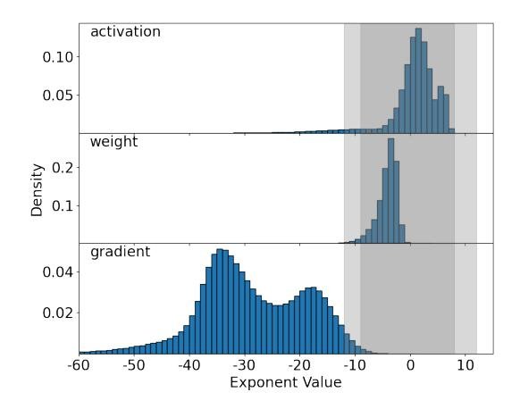
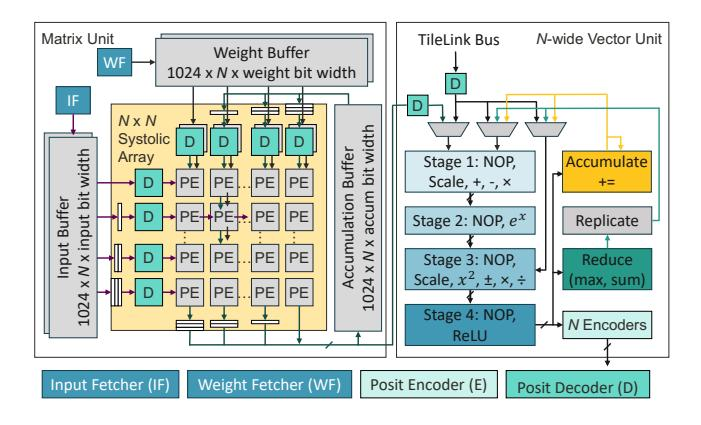
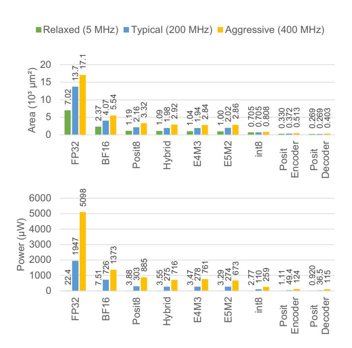
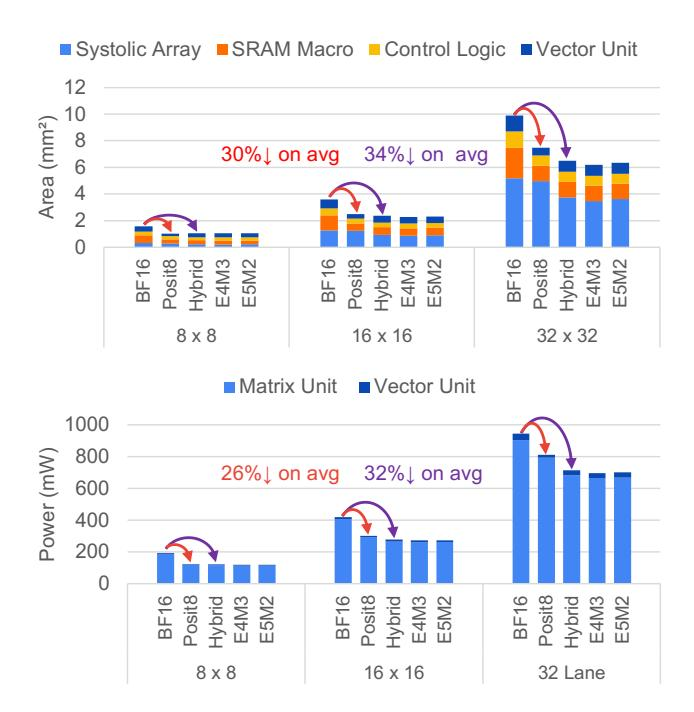
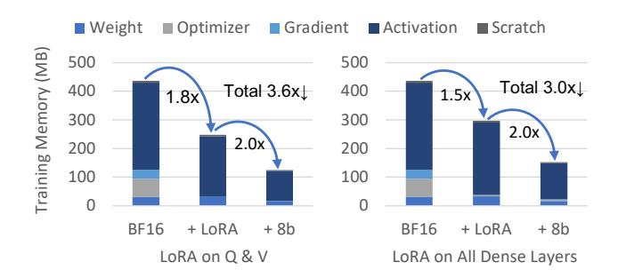

# 5 8-bit Transformer Fine-tuning

Unlike 8-bit Transformer inference, 8-bit training has received less attention. Prior work on using FP8 for DNN training only clips the inputs to GEMM operations to FP8 to take advantage of the more efficient 8-bit MAC kernel, while intermediate outputs are stored in a 16-bit format [19]. Moving intermediate outputs to an 8-bit format is advantageous for devices with limited memory. We introduce several techniques to enable 8-bit Transformer fine-tuning, providing a memory and compute-efficient solution for edge devices.

#### 5.1 Per-tensor Scaling

During the backward pass, activation gradients are predominantly characterized by small magnitude values, and most of these values are beyond Posit8 and FP8's representable range as illustrated in Figure 10. To address the problem, scaling factors must be employed to adjust the values before quantizing them to 8 bits, ensuring that they fall within 8-bit representable range. We select a scaling factor such that the maximum absolute values (amax) in the tensor are close to the maximum representable magnitude in the corresponding format. For example, for FP8 E5M2, we scale the amax to 57344, the largest number E5M2 can represent. However, in the case of Posit8, scaling amax to Posit8's maximum representable value of 4096 would not be effective. Due to posit's tapered precision, large numbers have very few fraction bits and thus cannot be represented accurately. In our experiments, we found that scaling amax to 64 yields the best accuracy.

Figure 10. Tensor value distributions during fine-tuning of MobileBERT on SQuAD. The darker gray region indicates the span of E4M3, whereas the area encompassed by both light and dark gray represents the range achievable by Posit8. While both E4M3 and Posit8 cover the range of activations and weights, they fail to cover the activation gradients.

While most of the fine-tuning tasks can be performed using a single scaling factor, such as loss scaling [18], without any accuracy loss, there are some tasks where the range and distribution of activation gradient values are much wider. Consequently, Posit8 and FP8 cannot cover the union of all tensors' important values even with loss scaling. To address the problem, we apply per-tensor scaling on activation gradients, allowing each tensor to have its own exponent bias. Scaling is typically fused with the preceding operation to avoid writing high precision outputs to memory. Therefore, the scaling factors must be determined at the time the

outputs are produced. A common approach is to use historical gradient statistics to predict the amax for this iteration and compute the scaling factor based on the prediction [19]. We adopt the same approach, maintaining a list of history amaxes for each tensor and selecting the maximum among these values to compute the scaling factor for the current step.

#### 5.2 Handling Approximate Softmax During Training

We use approximate versions of exponential and reciprocal functions in softmax during training to avoid performing exact floating point exponential and division computations. The exponential function can be directly applied without any modification for the backward pass. However, the reciprocal approximation needs a custom backward pass different from the original softmax backward pass operation.

The gradient matrix of the softmax function can be derived using the quotient rule. However, posit reciprocal does not perform exact division. Instead, it can be modeled by a piece-wise linear function, where each segment connects the points  $(2^n, 2^{-n})$  to  $(2^{n+1}, 2^{-(n+1)})$ , as illustrated in Figure 7. A comprehensive mathematical derivation of reciprocal is available in [6]. Performing the usual softmax gradient causes divergence. We re-derive the gradient of the softmax function that uses posit reciprocal.

Let us denote the posit reciprocal as a function f, which takes the sum of exponentials as its input:

$$\sigma(\vec{z})_j = e^{z_j} \cdot f(\sum_{k=1}^K e^{z_k})$$

We can apply the product rule of derivative:

$$\frac{\partial \sigma(\vec{z})_{j}}{\partial z_{i}} = \frac{\partial}{\partial z_{i}} e^{z_{j}} \cdot f(\sum_{k=1}^{K} e^{z_{k}}) + e^{z_{j}} \cdot f'(\sum_{k=1}^{K} e^{z_{k}}) \cdot \frac{\partial}{\partial z_{i}} \sum_{k=1}^{K} e^{z_{k}}$$

$$\frac{\partial \sigma(\vec{z})_{j}}{\partial z_{i}} = \begin{cases} \sigma(\vec{z})_{j} + e^{z_{j}} \cdot f' \cdot e^{z_{i}} & \text{if } i = j \\ e^{z_{j}} \cdot f' \cdot e^{z_{i}} & \text{if } i \neq j \end{cases} \tag{4}$$

where f' is a piece-wise linear function that models the derivative of posit reciprocal (Figure 7):

$$f' = -2^{-\lfloor \log_2(\sum_{k=1}^K e^{z_k}) \rfloor \cdot 2 - 1}$$
 (5)

Like the traditional softmax backward operation, the revised backward operation can still be vectorized on accelerators using the same hardware. While there might be added complexity during backpropagation due to the use of posit approximations, it simplifies the design of the accelerator hardware and enhances softmax efficiency.

#### 5.3 LoRA with FP8 and Posit8

Edge accelerators often have very constrained memory, varying from mere kilobytes to several megabytes. This creates challenges for on-chip training, particularly with larger models, because each parameter requires an associated weight

gradient to be stored. Low-rank adaptation (LoRA) [13] is an effective technique for reducing the number of trainable parameters. It also allows the pre-trained weights to be quantized to low-precision formats, usually int8, to decrease model storage requirements. However, prior LoRA implementations upscale quantized pre-trained weights to a high-precision format and merge them with trainable low-rank matrices before linear operations. This prevents the use of smaller, more efficient MACs with 8-bit arithmetic. Furthermore, merging the floating-point LoRA weights with int8 pre-trained weights can result in considerable accuracy loss. Therefore, the current approach for 8-bit LoRA fine-tuning is far from ideal, as it compromises both efficiency and accuracy.

We address the problem by performing quantization, on both the LoRA matrices and the merged weights, to Posit8 and FP8. The LoRA computation of a dense layer's output (h) on input x is:

$$h = W_0 x + \Delta W x = W_0 x + \alpha \cdot BAx \tag{6}$$

where  $W_0$  is the pre-trained weight matrix,  $\Delta W$  is the weight update to  $W_0$ , and B and A are the low-rank decomposition of  $\Delta W$  with a scaling factor of  $\alpha$ . We store LoRA matrices B and A in 16-bit floating-point, providing sufficient precision for weight updates. Before their multiplication, both matrices are quantized to 8 bits. Subsequently, the LoRA weights  $\alpha BA$  are merged with the 8-bit pre-trained weights, and the combined weights are quantized to 8 bits prior to performing matrix multiplication with the input x. This approach enables the use of more efficient 8-bit GEMM operations and facilitates the integration of LoRA weights into the pre-trained weights without compromising accuracy.

$$h = \operatorname{quant}(W_0^8 + \alpha \cdot \operatorname{quant}(B^{16})\operatorname{quant}(A^{16}))x \tag{7}$$

We evaluate our implementation of LoRA on MobileBERT and BERT models across GLUE and question answering tasks. The results, which are detailed in section 6, show that both Posit8 and FP8 attain an accuracy level comparable to BFloat16 using the same set of hyperparameters.

#### 6 Fine-tuning Results

We perform quantized training experiments on GPUs by clipping tensor values to the Posit8 or FP8 representable range before and after each operation; storing the value back into BFloat16. The arithmetic is then carried out using BFloat16 to utilize the GPU's customized hardware for better performance. For FP8, we use E4M3 for forward pass and E5M2 for backward pass, adhering to NVIDIA's practice for FP8 training [19].

#### 6.1 Models Evaluated

**MobileBERT.** MobileBERT is a streamlined version of BERTlarge, maintaining the same number of encoder layers but with a significantly reduced hidden size. We obtain the

| Model                      | Method                    | # Trainable |      |      | Accuracy | у     |       |
|----------------------------|---------------------------|-------------|------|------|----------|-------|-------|
| Model                      | Method                    | Parameters  | MNLI | QNLI | MRPC     | SST-2 | SQuAD |
| MobileBERT tiny | Full Training FP32 [28]   | 15.1M       | 82.0 | 89.9 | 86.7     | 91.6  | 88.6  |
| (16.5M)                    | LoRA BF16                 | 0.3M        | 82.9 | 90.7 | 88.0     | 91.4  | 88.1  |
|                            | LoRA Posit8               | 0.3M        | 82.2 | 90.6 | 86.8     | 91.4  | 86.4  |
|                            | LoRA Posit8 Approximation | 0.3M        | 82.9 | 90.8 | 87.5     | 91.1  | 86.5  |
|                            | LoRA FP8                  | 0.3M        | 81.9 | 90.7 | 87.8     | 90.8  | 87.5  |
| MobileBERT                 | Full Training FP32 [28]   | 25.3M       | 83.9 | 91.0 | 87.5     | 92.1  | 90.0  |
| (25.3M)                    | LoRA BF16                 | 0.3M        | 83.9 | 91.5 | 87.5     | 92.4  | 89.0  |
|                            | LoRA Posit8               | 0.3M        | 83.3 | 91.5 | 87.8     | 91.7  | 87.4  |
|                            | LoRA Posit8 Approximation | 0.3M        | 83.1 | 91.5 | 87.5     | 92.2  | 88.1  |
|                            | LoRA FP8                  | 0.3M        | 83.0 | 91.1 | 87.8     | 91.7  | 87.8  |
| RoBERTa base    | Full Training FP32 [15]   | 125.0M      | 87.6 | 92.8 | 90.2     | 94.8  | -     |
| (125.0M)                   | LoRA BF16                 | 0.3M        | 87.3 | 92.9 | 89.2     | 94.7  | 91.5  |
|                            | LoRA Posit8               | 0.3M        | 87.1 | 92.5 | 89.5     | 94.6  | 91.2  |
|                            | LoRA Posit8 Approximation | 0.3M        | 86.9 | 92.5 | 89.0     | 94.4  | 91.1  |
|                            | LoRA FP8                  | 0.3M        | 86.8 | 92.9 | 89.5     | 95.0  | 91.2  |
| RoBERTa large   | Full Training FP32 [15]   | 355.0M      | 90.2 | 94.7 | 90.9     | 96.4  | 94.6  |
| (355.0M)                   | LoRA BF16                 | 0.8M        | 90.3 | 94.5 | 91.7     | 96.2  | 94.6  |
|                            | LoRA Posit8               | 0.8M        | 90.0 | 94.3 | 91.9     | 96.0  | 94.0  |
|                            | LoRA Posit8 Approximation | 0.8M        | 90.0 | 94.3 | 91.2     | 96.0  | 93.7  |
|                            | LoRA FP8                  | 0.8M        | 89.9 | 94.6 | 90.2     | 96.1  | 94.1  |

**Table 7.** Accuracy of MobileBERT and RoBERTa models with different fine-tuning methods, data types, and quantization schemes on the GLUE benchmark and SQuAD v1.1. Full training means that the entire model is fine-tuned. Operation fusion scheme is selected based on the results of quantized inference. Per-tensor scaling is applied in all cases. We use the same LoRA configuration and hyperparameters for quantized training experiments as the BFloat16 (BF16) training sessions.

pre-trained MobileBERT from the Hugging Face Transformers library [31]. As Google has not released a pre-trained MobileBERT $_{\rm tiny}$ , we adapt the MobileBERT model by removing three encoder layers and reducing the number of feedforward networks to 2, to match the MobileBERT $_{\rm tiny}$ 's specifications. MobileBERT's stacked FFN architecture results in larger and more unstable network outputs (section 4). To retain full-finetuning accuracy, we insert LoRA layers into every dense layer for MobileBERT and MobileBERT $_{\rm tiny}$ .

**RoBERTa.** RoBERTa uses the same architecture as BERT with an alternative pre-training method to achieve higher accuracies on GLUE benchmarks [15]. We take the pre-trained RoBERTabase (125M) from the HuggingFace Transformers library [31] and evaluate the performance of different quantization approaches on tasks from the GLUE benchmark. For all RoBERTa models, we apply LoRA to query weights  $W_q$  and value weights  $W_v$  of the Transformer's self-attention module and use a rank of 8 as in the original LoRA paper.

#### 6.2 Results on GLUE

The General Language Understanding Evaluation (GLUE) benchmark [30] comprises a collection of nine tasks focused on natural language understanding. We conduct evaluations

of BFloat16, Posit8, and FP8 LoRA training on the validation sets of four GLUE datasets. We find that both Posit8 and FP8 achieve accuracy within 0.5% of BFloat16 accuracy (Table 7). Also, posit approximation does not impact training performance, demonstrating the robustness of Posit8 training.

#### 6.3 Results on SQuAD 1.1

SQuAD 1.1 is a large-scale reading comprehension dataset which only contains questions that have an answer in the given context. SQuAD 1.1 is a considerably harder task than GLUE, especially for smaller Transformers. We observed that gradient statistics are sparser and less stable. The use of the AdamW optimizer often led to divergence in MobileBERT and MobileBERTtiny model training. Consequently, we tested with the SGD optimizer, with which we obtained approximately 1% accuracy drop from BFloat16. In contrast, with larger models, both Posit8 and FP8 managed to maintain accuracy on par with BFloat16 without optimizer changes, as shown in Table 7.

#### 7 Neural Network Accelerator Evaluation

A wide variety of neural network accelerators have been proposed to serve the needs of diverse applications. Typically,

**Figure 11.** A standard neural network accelerator featuring a systolic array for matrix multiplication and a vector unit dedicated to executing element-wise operations and vector reductions. The encoders and decoders are only needed for posit-based accelerators. NOP means no operation.

they comprise a spatial array for efficient GEMM operations, and a vector unit for handling elementwise operations [22]. Our analysis adheres to this paradigm, with Figure 11 showing the architecture we use for area and power analysis. It consists of an N by N systolic array of processing elements (PEs) coupled with an N-lane vector unit. We carry out our analysis using operations in various data types synthesized via high-level synthesis (HLS). We then perform logic synthesis using Design Compiler (DC) in a 40nm technology. We evaluate the hardware at a range of target frequencies at a nominal voltage of 0.9V.

#### 7.1 Multiply-and-Accumulate (MAC) Unit

The main component of our PEs is a MAC unit. For both FP32 and BFloat16, we carry out accumulation in FP32, aligned with the majority of GPU implementations, while FP8 and Posit8 accumulate in BFloat16. As described in section 3, decoded Posit8 has at most four fraction bits and an exponent range from -12 to 12, effectively requiring five exponent bits. A Posit8 MAC can therefore be implemented via a floatingpoint E5M4 MAC. As detailed in section 3 and section 6, FP8 employs both E4M3 and E5M2 formats for training purposes. To enable a fair comparison between FP8 and Posit8, we implement this hybrid FP8 as an E5M3, which can support both E4M3 and E5M2 formats for GEMM. From Figure 12, we can see that Posit8 has slightly larger MAC area and power compared to hybrid FP8 due to the extra fraction bit. However, both FP8 and Posit8 MACs are considerably smaller and lower power than BFloat16.

#### 7.2 Posit Encoding and Decoding

Posit must be decoded into exponent and mantissa before each operation and encoded back into the posit format after the operation is complete (see section 3). Figure 12 shows the

**Figure 12.** MAC area and power without encoding and decoding logic and Posit8 encoder and decoder area and power.

encoder and decoder area and power for Posit8 used in this paper. FP8 does not have an encoding or decoding process, which offers FP8 a slight advantage over Posit8.

#### 7.3 Posit8 and FP8 Based Accelerators

We designed an accelerator with full support for all Transformer operations, as depicted in Figure 11. Both the matrix and vector units are configurable to different data types at design time. In our design, we use FP32 as the accumulation data type and the vector unit data type for BFloat16-based accelerators, and BFloat16 as the accumulation data type and vector unit data type for FP8/Posit8-based accelerators. We synthesized these designs using 40nm technology and compare the total area and power of the accelerators using BFloat16, Posit8, hybrid FP8 (which can accommodate both E4M3 and E5M2), E4M3, and E5M2 based computation units.

The results for  $8\times 8$ ,  $16\times 16$  and  $32\times 32$  accelerators are shown in Figure 13. Both Posit8 and FP8 demonstrate considerable advantages over BFloat16, reducing area by 30% and 34%, and power consumption by 26% and 32% on average, respectively. Compared to the hybrid FP8 accelerator, Posit8 accelerator features a smaller vector unit due to the use of posit approximation, making the overall vector unit 33% smaller and 35% lower power as shown in Table 8. Despite the smaller vector unit, FP8 overall has an area and power advantage over Posit8 due to its smaller MAC, which is a result of having one less fraction bit. We could potentially improve the area and power efficiency of the Posit8 accelerator by employing the same MAC hardware as FP8, by

**Figure 13.** Accelerator standard cell plus SRAM macro area and post-synthesis power at 200 MHz and 0.9V. Hybrid refers to hybrid FP8 which can accommodate both E4M3 and E5M2.

truncating one fraction bit during decoding process. Posit8 would still maintain the advantage of superior range and similar precision compared to FP8.

| Size    | Ar     | ea (mm          | .2)   | Power (mW) |      |       |  |
|---------|--------|-----------------|-------|------------|------|-------|--|
|         | Posit8 | Posit8 FP8 %↓ P |       | Posit8     | FP8  | %↓    |  |
| 8-lane  | 0.208  | 0.304           | 31.5% | 4.27       | 5.76 | 25.9% |  |
| 16-lane | 0.322  | 0.497           | 35.2% | 7.8        | 13.1 | 40.5% |  |
| 32-lane | 0.572  | 0.840           | 32.0% | 18.7       | 30.9 | 39.5% |  |
| Average | -      | -               | 33%   | -          | -    | 35%   |  |

Table 8. Vector unit metrics for Posit8 and FP8 accelerators.

#### 7.4 Fine-tuning Memory

We ran MobileBERT $_{\rm tiny}$  on our accelerator and evaluated the impact of LoRA and 8-bit quantization on fine-tuning memory. We used a sequence length of 128, a batch size of 16, and AdamW optimizer. As illustrated in Figure 14, LoRA significantly reduces the amount of trainable parameters, thereby reducing the memory for weight gradient and optimizer states at the cost of a slight increase in total parameters. However, Transformer training memory is primarily dominated by activations especially with larger batch sizes. Implementing 8-bit quantization cuts the memory requirements for activations and weights by almost 50%, further reducing

**Figure 14.** MobileBERTtiny fine-tuning memory reduction after applying LoRA and 8-bit quantization. Error stands for activation gradient during backward pass.

the fine-tuning memory. Overall, 8-bit LoRA fine-tuning can on average reduce training memory by approximately 3×.

#### 8 Conclusions

We explore the application of Posit8 and FP8 quantization to Transformer inference and fine-tuning for edge accelerators. To the best of our knowledge, this paper is the first to systematically explore quantization of all Transformer operations beyond GEMM. We employ operation fusion to reduce the post-training quantization accuracy loss, simultaneously enhancing the fine-tuning accuracy. Our improvements to 8-bit LoRA, adapted for both FP8 and Posit8, enable us to utilize more efficient 8-bit MAC operations and conduct LoRA with a single data type without compromising accuracy. Furthermore, we design an area- and power-efficient posit softmax to compensate for the larger posit MAC unit. Our experiments on GLUE and SQuAD 1.1 demonstrate that both FP8 and Posit8 achieve accuracy mostly within 1% of the results obtained with BFloat16. We also show that this conclusion can be extended to larger and more complex Transformer models, such as Whisper and LLaMA 2. FP8 and Posit8 emerge as robust solutions for conducting Transformer inference and training on edge accelerators, offering efficient hardware efficiency with minimal accuracy compromise.

#### 9 Acknowledgement

This work was supported by funding from SRC/DARPA JUMP 2.0 CoCoSys Center, SRC AIHW, AI Chip Center for Emerging Smart Systems (ACCESS), Hong Kong SAR, Precourt Institute for Energy, Apple Stanford EE PhD Fellowship in Integrated Systems, Samsung, and NSF FuSe-TG (award number: 2235462).

