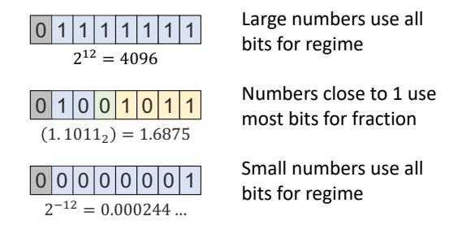

# **8b Posit with 1 exponent bit (es = 1)**

Decimal Value: (−1)!% 1. % (2"!")# % 2\$ 0 0 0 1 1 0 1 1 regime: varies 2-7b **k** from leading bit run length fraction (**f**): varies 0-4b sign (**s**): 1b exponent (**e**): varies 0-1b 1.011 ⋅ 4%" ⋅ 2& = 0.171875

Figure 1. 8-bit posit with 1 exponent bit. The sign, exponent and fraction fields are similar to floating-point, but there is an extra variable length regime that acts as an extra exponent.

#### **NVIDIA's FP8** 0 0 1 0 0 0 1 1 sign (**s**): 1b exponent (**e**): 4b fraction (**f**): 3b 1.011 ⋅ 2!"# = 0.171875 0 0 1 1 0 0 1 0 **E4M3** (−1)\$- 1. - 2%"# **E5M2** (−1)\$- 1. - 2%"&' 1.10 ⋅ 2&("&' = 0.1875 exponent (**e**): 5b sign (**s**): 1b fraction (**f**): 2b

Figure 2. NVIDIA's 8-bit floating-point (FP8) format for DNN training and inference. E4M3 has 4 exponent bits and 3 mantissa bits, while E5M2 has 5 exponent bits and 2 mantissa bits, representing different precision-range trade off choices.

Figure 3. Posits have variable length fields. Very large and very small numbers use all bits for regime, while numbers close to 1 use most of the bits for fraction.

fine-tuning accuracy. As we show in section 5, we leverage this approach to enable full 8-bit training.

