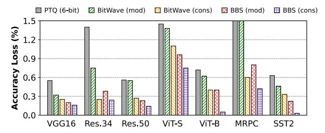
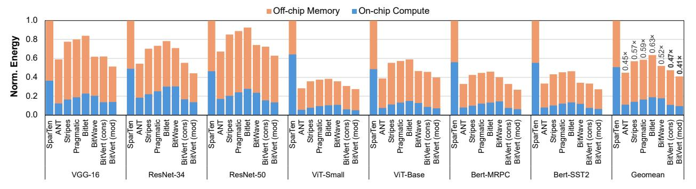
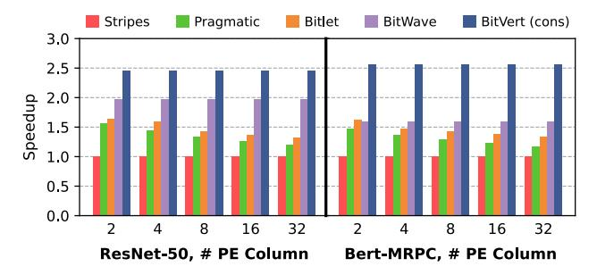
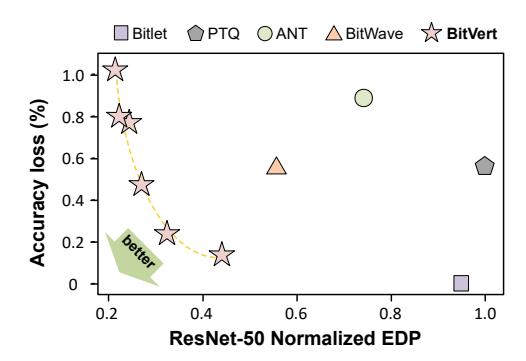

# C. Channel Reordering

With per-channel global binary pruning, the sensitive and normal channels will have different precision, resulting in unaligned memory layout. To address this issue, we adopt a channel reordering mechanism as shown in Fig. 9(a). There are 6 weight channels in this example, and channels with the same precision are grouped together and stored in a memory chunk to avoid unaligned access. Recall from Section III-C that the proposed global binary pruning is hardware-aware, which forces the number of sensitive channels in every layer to be a multiple of the number of channels processed in parallel. Therefore, the grouped channels can be efficiently accessed by *BitVert* to ensure full hardware utilization.

The channel reordering mechanism has also been explored in SparTen's greedy balancing [13]. However, the reordering

Fig. 10: BitVert accelerator.

criteria is completely different. SparTen is a value-based sparse DNN accelerator that reorders weight channels based on their sparsity, while BitVert groups channels based on their sensitivity to binary pruning. Furthermore, SparTen statically unshuffles the next layer's weights in software, which may not guarantee the correctness when different weight tensors need to process the same input. Consider the example shown in Fig. 9(b), where two weight tensors multiply the same input and generate two output tensors that require element-wise addition (e.g., as in the residual block of ResNet). SparTen statically unshuffles the two weight tensors along the Kdimension to align with the channel order of the previous layer, but the different channel order between the two weight tensors remains, which produce two output tensors with different orders. In this example, the second element of output 2 is supposed to be added with the third element of output 1, while a conventional design like SparTen will add the same position of two output tensors, leading to the wrong result.

To solve the above issue, we propose to unshuffle the output tensor when writing back to memory. As shown in Fig. 9(c), after completing the whole dot product between the input tensor and reordered weight, the outputs are directly restored to the original channel order. This restoring only needs to know the original index of every weight channel to calculate the corresponding memory address for storing the final outputs. Fortunately, since a weight channel usually contains hundreds to thousands of values, the overhead of storing one index per channel is trivial. Moreover, because the same weight channel can process many inputs (3 in this example) to compute many outputs simultaneously, these outputs can be unshuffled together to amortize the cost of channel reordering.

#### D. BitVert Accelerator

Fig. 10 shows the overall architecture of the *BitVert* accelerator. The  $16 \times 32$  PE array adopts an output-stationary dataflow, and exploits both weight-sharing and input-sharing by processing 32 weight channels and 16 input windows in parallel. The weight and input buffers are banked to provide adequate bandwidth for the access from PEs. Outputs are read out of the PE array and written to the output buffer, one column at a time. Additionally, *BitVert* incorporates a metadata buffer to store BBS compression metadata, and a channel index buffer to store the original index of weight channels being processed. The  $\Sigma A$  generator calculates the sum of input activations for

BBS-based bit-serial multiplication inside the PE. Since the same input group is multiplied by 32 weight channels, the ΣA generator incurs practically no overhead.

## V. EVALUATION

## *A. Experimental Methodology*

DNN Benchmarks We evaluate seven representative DNN models, including CNNs and transformer networks as summarized in Table I. For CNNs, we evaluate VGG-16, ResNet-34 and ResNet-50 on the ImageNet-1K dataset. For transformers, we choose two vision transformers, ViT-Small and ViT-Base, as well as BERT on MRPC and SST2 tasks from the GLUE dataset [41]. We obtain pre-trained CNNs and transformers from PyTorch Library and HuggingFace, respectively. We then conduct post-training per-channel quantization to obtain the baseline 8-bit models, which shows negligible accuracy loss compared to FP32 models. The 8-bit models are used to evaluate the proposed binary pruning technique and *BitVert* accelerator. For every model, we apply two levels of binary pruning, *conservative* (cons) and *moderate* (mod), with a weight group size of 32. For conservative pruning, 10% sensitive channels are maintained at 8 bits and the remaining channels have 2 bit-columns pruned using the rounded averaging strategy. For moderate pruning, 20% sensitive channels are maintained at 8 bits and the remaining channels have 4 bit-columns pruned using the zero-point shifting strategy.

Accelerator Baselines We compare *BitVert* against six DNN accelerators, including four bit-serial accelerators: Stripes [19], Pragmatic [1], Bitlet [26], BitWave [39], and two value-based accelerators: SparTen [13], ANT [16]. Stripes is an early bitserial accelerator that exploits reduced precision for DNN computation, yet it mainly relies on 16-bit models and does not consider below-8-bit compression. Therefore, we treat Stripes as a dense bit-serial accelerator and use our baseline 8-bit models to evaluate its performance. Pragmatic and Bitlet target zero-bit skipping during on-chip computation only, while BitWave enhances structured bit-column sparsity to save both computation and memory access. SparTen exploits two-sided value sparsity for DNN acceleration. ANT combines different datatypes in a unified manner for low-bit DNN acceleration. We use 6-bit precision to evaluate ANT, a configuration demonstrated by ANT to maintain acceptable accuracy without the need of retraining.

Implementation We implement the proposed binary pruning algotirhm in Pytorch. We design the *BitVert* accelerator at RTL-level using SystemVerilog and synthesize it with Synopsys Design Compiler in TSMC 28nm technology to find

| Type       |          | CNN            | Transformer   |      |       |
|------------|----------|----------------|---------------|------|-------|
| Model      | VGG-16   | ResNet-34 / 50 | ViT-S / B     | BERT |       |
| Dataset    | ImageNet |                |               | MRPC | SST2  |
| FP32 Acc % | 73.36    | 73.31 / 76.13  | 80.16 / 84.54 | 90.7 | 91.8  |
| INT8 Acc % | 73.35    | 73.39 / 76.17  | 80.05 / 84.52 | 90.4 | 91.63 |

TABLE I. Summary of evaluated models and datasets.

Fig. 11: Comparison of accuracy loss between PTQ, BitWave and BBS under conservative (cons) and moderate (mod) compression.

area. We use Synopsys VCS to generate data-driven activity factors at 800 MHz for power estimation. The area and power of on-chip SRAM buffer are modelled with CACTI [4]. To estimate the DRAM power, we use the DDR3 model from DRAMSim3 [22]. For the end-to-end performance evaluation of *BitVert* and other baseline accelerators, we develop cycleaccurate simulators to model the execution time. To ensure a fair comparison, all accelerators are scaled to contain the same number of multipliers, where an 8-bit multiplier is equivalent to eight bit-serial multipliers. For on-chip SRAM, we equip ANT and all bit-serial accelerators with 256 KB activation buffer and 256 KB weight buffer. For SparTen, we reduce the size of its on-chip buffer due to the existence of the local buffer inside every PE.

## *B. Accuracy Comparison*

We first evaluate the accuracy impact of BBS binary pruning compared to naive PTQ and BitWave's bit-flip strategy [39] for compression below 8-bit. When using PTQ for compression, we follow the widely-used calibration [10] by calibrating the quantization parameters based on a subset (1024 images) of the ImageNet dataset. In particular, conventional PTQ relies on the calibration dataset to ensure the optimized quantization parameters and accuracy, while the naive data-free quantization leads to significant accuracy degradation (> 10%). On the contrary, the proposed BBS compresses the model to lower precision without any calibration dataset. For both PTQ and BitWave, we use the same setting as BBS by maintaining 20% and 10% sensitive channels for moderate and conservative pruning, respectively. This ensures that our accuracy benefits purely come from the proposed binary pruning.

Fig. 11 shows the accuracy impact of applying different approaches on the baseline DNNs. On average, the conservative and moderate binary pruning can compress the memory footprint of the baseline 8-bit DNNs by 1.29× and 1.66×, while incurring an accuracy loss of only 0.25% and 0.45%, respectively. Both BitWave and BBS with moderate pruning can attain higher accuracy than PTQ. These accuracy improvements stem from their ability to exploit fine-grained bitlevel redundancy, thereby preserving more information from the original 8-bit models. Additionally, the proposed binary pruning consistently outperforms BitWave. This is because BBS allows any bit significance to be zero or one, thus retaining all quantization levels of the 8-bit precision.

Fig. 12: Speedup results normalized to Stripes (higher is better).

Fig. 13: Energy consumption breakdown normalized to SparTen (lower is better).

Comparison against ANT We compare the accuracy between moderate binary pruning and ANT [16]. As shown in Table II, BBS outperforms ANT in terms of both accuracy and effective weight bit width. While ANT uses adaptive datatypes for lowbit quantization, it cannot take the advantage of inherent bitlevel redundancy. On the other hand, the binary pruning fully exploits the bit-level sparsity to best preserve the original 8-bit weight distribution, resulting in minimal accuracy degradation.

Comparison against PTQ Works We compare the accuracy loss between BBS and state-of-the-art PTQ works, including Microscaling [36] and NoisyQuant [24], on vision transformers. We apply 6-bit weight quantization using the two PTQ methods while maintaining activation to 8-bit. Table III shows that the moderate binary pruning outperforms NoisyQuant with lower memory footprint. Moreover, the conservative binary pruning has much better accuracy than Microscaling at similar bit width. Miscroscaling also has an 8-bit metadata, which represents the shared exponent for a group of 32 weights. However, the exponent is determined by the largest value in every group, which forces small values to become zero due to insufficient operand precision to store the aligned mantissa. On the other hand, BBS exploits bit-level redundancy to better preserve the statistical characteristics of

| Model     | BBS (mod)         | ANT [16]       |
|-----------|-------------------|----------------|
| VGG-16    | 0.2% (4.32 bits)  | 0.68% (6 bits) |
| ResNet-50 | 0.23% (4.79 bits) | 0.89% (6 bits) |

TABLE II. Comparison of accuracy loss and weight bit width between BBS and 6-bit ANT without fine-tuning.

uncompressed weight, thereby achieving higher accuracy.

## *C. Accelerator Performance and Energy*

Performance Fig. 12 presents the accelerator performance normalized to that of Stripes. On average, *BitVert* with conservative and moderate binary pruning achieves 2.48× and 3.03× speedup compared to Stripes, respectively. These speedups are attributed to exploiting both balanced BBS and binary pruning for abundant bit skipping and reduced memory access. Despite leveraging two-sided value sparsity, SparTen demonstrates limited performance on transformer-based models due to the lack of weight value sparsity in 8-bit models and nearly-dense activations from non-ReLU functions. ANT only explores reduced value precision but not fine-grained bit-level sparsity, leading to 1.63× and 1.97× lower speedup than *BitVert* at conservative and moderate pruning, respectively. While Pragmatic and Bitlet utilize variable degrees of bit-level sparsity, they suffer from workload imbalance and lack of exploration in further compressing DNNs below 8-bit. This explains why *BitVert* outperforms Pragmatic and Bitlet by 1.86 – 2.53× across all benchmarks. Although BitWave exploits structured

|                   | ViT-Small       |      | ViT-Base |      |
|-------------------|-----------------|------|----------|------|
|                   | ∆ Acc ↓ Bits |      | ∆ Acc ↓  | Bits |
| Microscaling [36] | 2.49%           | 6.25 | 0.33%    | 6.25 |
| NoisyQuant [24]   | 2.08%           | 6    | 0.64%    | 6    |
| BBS (cons)        | 0.75%           | 6.33 | 0.05%    | 6.25 |
| BBS (mod)         | 0.96%           | 5.19 | 0.39%    | 5.07 |

TABLE III. Comparison of accuracy loss and weight bit width between BBS, Microscaling and NoisyQuant.

Fig. 14: Normalized speedup on ResNet-50 and Bert-MRPC with increasing number of PE columns (*i.e.*, processing more weight groups in parallel).

bit-column pruning to achieve better performance, its moderate pruning results in unacceptable accuracy loss (> 1%) on many DNNs such as ViT-small and Bert-MRPC. Therefore, it has to reduce the degree of pruning for improved accuracy while sacrificing performance. Overall, *BitVert* provides the best accuracy-performance trade-offs, with up to 1.98× speedup over BitWave.

Energy Consumption Fig. 13 presents the normalized energy breakdown of different accelerators. where the on-chip compute energy includes both buffer and core energy. SparTen demonstrates the poorest energy efficiency primarily due to its substantial overhead from the sparse bitmask encoding (12.5% at 8-bit precision) and the expensive hardware required to exploit sparsity. This overhead is particularly pronounced in 8-bit DNNs, where value sparsity is inherently scarce. As a result, SparTen consumes 2.13× and 2.44× higher energy than *BitVert* with conservative and moderate pruning, respectively. Although ANT is able to quantize both activations and weights, it dissipates higher energy than *BitVert* with moderate pruning due to the complicated hardware to support custom data types. Owing to the balanced BBSskipping and substantial reduction in model size, *BitVert* with moderate pruning achieves an average energy reduction of 1.39×, 1.43×, 1.54×, and 1.27× over Stripes, Pragmatic, Bitlet, and BitWave, respectively.

## *D. Analysis of Load Imbalance*

*BitVert* can leverage the structured BBS for improved load balance. Fig. 14 demonstrates this with the performance on ResNet-50 and Bert-MRPC with respect to different number of PE columns, where every PE column processes a different weight group. When there are more PE columns, Pragmatic and Bitlet exhibit a noticeable drop in speedup over Stripes that does not exploit bit sparsity. For instance, when the number of PE columns increases from 2 to 32, the speedup of Bitlet on Bert-MRPC drops from 1.63× to 1.35×. This is because that processing more weight groups in parallel exacerbates the load imbalance across PE columns, and the performance is bottlenecked by the weight group with the lowest bit sparsity. In contrast, the structured bit sparsity allow BitWave and *BitVert* to efficiently scale the performance, thus maintaining nearly constant speedup over Stripes. Moreover, *BitVert* always

Fig. 15: Breakdown of execution cycles w.r.t. the number of PE columns.

achieves the highest performance thanks to the binary pruning that can induce higher BBS with negligible accuracy loss.

Fig. 15 further details the breakdown of execution time with respect to the number of PE columns to highlight its impact on load balance. Since one PE contains many bit-serial multipliers, intra-PE stall can be caused by a multiplier that needs to process more effectual bits. On the other hand, the inter-PE stall arises from variance in bit sparsity across different weight groups. As the number of PE columns increases, Pragmatic and Bitlet experience higher intra-PE and inter-PE loss, which explains their lower resulting speedup. BitWave only exploits coarse-grained bit-column sparsity that has much lower occurrence than fine-grained BBS. Therefore, it shows lower PE utilization than *BitVert*. Furthermore, *BitVert* has minimal inter-PE stall due to the more balanced distribution of BBS across different weight groups, thereby achieving superior performance over other bit-serial accelerators.

## *E. PE Design Space Exploration*

Recall from Section IV-A that the sub-group size within the *BitVert* PE offers a trade-off between area and power. A smaller sub-group has lower mux cost, but increases the number of subtractors. Furthermore, by exploiting the structured nature of BBS and its encoding scheme, we are able to further reduce the PE area by using compact mux and a smaller BBS multiplier. Hence, we conduct a PE design space exploration to evaluate the optimal group size and the proposed optimizations. As shown in Table IV, a sub-group size of 16 without optimization incurs a significant area overhead of 38.2% compared to the optimized design. In the end, a sub-group size of 8 with the proposed PE optimization offers the best trade-off between area and power, which is therefore adopted in our *BitVert* accelerator.

| Sub-group |                              | Without Optimization | With Optimization |            |  |
|-----------|------------------------------|----------------------|-------------------|------------|--|
| Size      | Area (um2 Power (mW) ) |                      | Area (um2 )    | Power (mW) |  |
| 16        | 1342.3                       | 0.61                 | 971.5             | 0.53       |  |
| 8         | 896.6                        | 0.49                 | 739.6             | 0.45       |  |
| 4         | 878.7                        | 0.51                 | 786.5             | 0.47       |  |

TABLE IV. PE area and power of *BitVert* with different sub-group sizes before and after applying our circuit optimizations.

Fig. 16: EDP-accouracy loss pareto frontier for ResNet50.

## F. PE Area and Power Comparison

The BitVert accelerator adopts an area- and energy-efficient PE with low overhead to support BBS. We compare the PE design of BitVert and other bit-serial accelerators, with all PEs containing 8 bit-serial multipliers at 800 MHz target frequency. Table V summarizes the area and power of different PEs. Bitlet experiences the highest area and power consumption due to significant overhead (e.g., a 64-1 mux before every bit-serial multiplier) for zero bit skipping. Pragmatic needs a variable shifter to align the bit significance, leading to a larger bitserial multiplier and non-trivial overhead. BitWave requires 2's complementer to support sign-magnitude arithmetic, resulting in  $1.32 \times$  larger area and  $1.4 \times$  power than Stripes. Moreover, since BitWave can only leverage coarse-grained bit-column sparsity, the potential performance improvement is limited. The proposed BitVert enjoys the optimal trade-off between performance and hardware cost. Its PE occupies 1.39× area and consumes 1.22× power compared to Stripes, yet is able to exploit 50% balanced BBS and binary pruning for efficient bit skipping and model compression, respectively. Since BBS naturally exists in a bit-vector with arbitrary length and does not depend on the operand precision, it provides a promising solution for future bit-serial computing paradigm.

#### G. Accuracy-Efficiency Trade-offs

The proposed binary pruning and *BitVert* can offer good trade-offs between accuracy and efficiency. To demonstrate this, we conduct design-space exploration on ResNet-50 with different pruning ratios. We compare the relationship between energy-delay product (EDP) and accuracy loss of *BitVert* and previous works, including Bitlet, BitWave, ANT and conven-

| Accelerator    |            | PE Power |        |               |      |
|----------------|------------|----------|--------|---------------|------|
| Accelerator    | Multiplier | Others   | Total  | Ratio         | (mW) |
| Stripes [19]   | 286.3      | 246.5    | 532.8  | $1 \times$    | 0.37 |
| Pragmatic [1]  | 319.2      | 603.9    | 923.1  | $1.73 \times$ | 0.51 |
| Bitlet [26]    | 223.2      | 1442.4   | 1665.6 | $3.13 \times$ | 0.57 |
| BitWave [39]   | 286.3      | 416.1    | 702.4  | $1.32 \times$ | 0.49 |
| BitVert (ours) | 332.4      | 407.2    | 739.6  | 1.39×         | 0.45 |

TABLE V. PE area and power of BitVert and prior bit-serial accelerators under 28 nm technology and 800 MHz frequency.

Fig. 17: Comparison between BBS and Olive on compressing Llama-3-8B weights. The accuracy metric is perplexity, **lower is better**.

| - | Accelerator   | Area $(um^2)$ | Power (mW) | Norm. Perf | Norm. Perf / Area |
|---|---------------|---------------|------------|---------------|----------------------|
| • | Olive [15]    | 291.6         | 0.18       | 1×            | 1×                   |
|   | BitVert (mod) | 739.6         | 0.45       | 4×            | 1.58×                |

TABLE VI. Comparison between Olive and BitVert PEs.

tional PTQ. As shown in Fig. 16, the lower left region indicates a good trade-off between accuracy and EDP. Although BitWave and ANT propose different algorithm-hardware codesign approaches for DNN compression and acceleration, they fail to preserve the original value distribution of the baseline model and do not efficiently leverage the balanced bit sparsity that inherently appears in DNNs. In contrast, binary pruning is able to preserve all quantization levels of the original DNN. Combining with BBS and efficient hardware design, *BitVert* is able to always sit on the Pareto frontier.

#### H. Applicability to Large Language Models

Large language models (LLMs) have achieved great success in generative tasks [40], [47]. We compare BBS with a recent PTQ work Olive [15] for LLM weight compression. We evaluate a state-of-the-art LLM, Llama-3-8B [29] on Wikitext [28] and C4 [8] datasets. For BBS, we apply conservative and moderate binary pruning to all weight channels with a group size of 32, resulting in an effective weight precision of 6.25 and 4.25 bits, respectively. Fig. 17 shows the accuracy impact of different compression methods. The moderate BBS pruning achieves better perplexity than Olive with a similar memory footprint (4.25 vs. 4 bits), while the conservative BBS pruning has little perplexity loss compared to the FP32 baseline. To compare the hardware efficiency, we synthesize the Olive PE for 4-bit weight and 8-bit activation. Table VI shows that the proposed BitVert PE with moderate binary pruning can achieve 1.58× better performance per area compared to Olive. The benefits of BitVert are twofold. First, Olive adopts separate datatypes for normal and outlier values, where the latter has a much wider numerical range. Therefore, the Olive PE requires a larger multiplier than fixed-point PE to accommodate outliers. Second, the BitVert PE exploits BBS to efficiently compute 16 multiplications in 4 cycles under moderate pruning, while the Olive PE does not leverage bit sparsity and only computes one multiplication per cycle.

