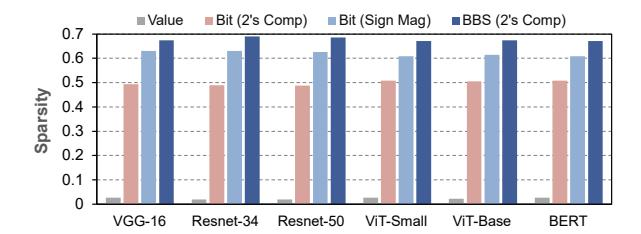
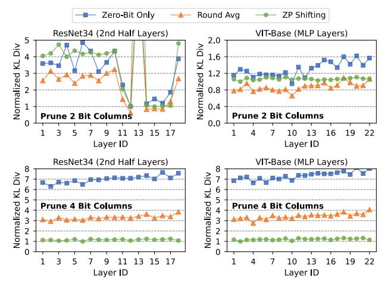
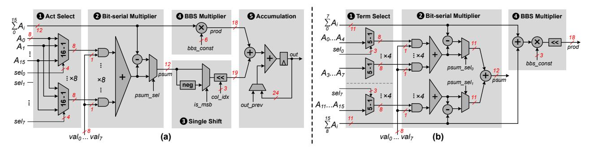
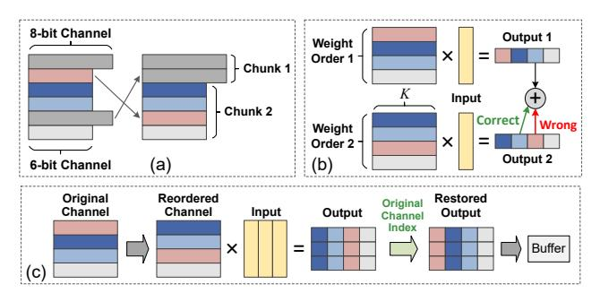

# I. INTRODUCTION

Deep neural networks (DNNs) have demonstrated remarkable accomplishments in many important fields such as computer vision and natural language processing. However, the growth of DNN model size and complexity continues to outpace the scaling of compute performance in existing hardware platforms [12]. Bridging this performance gap is very desirable for wider adoption of DNNs, particularly in edge scenarios that demand both high performance and energy efficiency. Codesigning novel DNN compression algorithms, together with accelerators for the efficient deployment of the compressed models, is a promising way to achieve this goal.

Numerous efficiency algorithms [21], [30], [31] and hardware prototypes [6], [13], [14], [42], [43] have been proposed to leverage *value-based sparsity* in DNNs to reduce the cost of storing and deploying DNNs. Yet the degree of such value sparsity, which depends on the underlying model architecture, can strongly limit the resulting hardware performance. For instance, recent transformer-based DNNs show limited or no activation sparsity with GeLU and sigmoid activation functions [7], [9]. Even for single-sided sparse accelerators that target weight sparsity, plenty of time and cost are spent on retraining the model to balance the degree of sparsity and accuracy loss. Unfortunately, in many real-world cases, retraining may become impractical for end users due to cost constraints and lack of access to the original training dataset [3], [39]. This challenge is particularly pronounced in recent large language models [40], [47] that contain billions of parameters, making retraining even more resource and data intensive. Hence, there is a strong need to further enhance the efficiency of DNN accelerators *without imposing retraining*.

Another line of DNN compression research focuses on *posttraining quantization* (PTQ), which represents DNN operands in lower precision without retraining the model [15], [24], [25], [32], [36], [44], [45]. For example, researchers have designed new quantization data types such as the Microscaling format [36], where a group of low-precision operands can share an 8-bit exponent to balance the accuracy and memory footprint. However, Microscaling still requires a floating-point pipeline to handle the shared 8-bit exponent, resulting in higher hardware cost than integer quantization. On the other hand, state-of-the-art PTQ algorithms can already reduce the operand precision to 8-bit integer with negligible accuracy loss [24], [32], [44]. Unfortunately, a quantized 8-bit DNN shows extremely low value sparsity (less than 5% as will be shown in the next section), since it tries to utilize all quantization levels as much as possible to reduce the quantization error. This fundamental quantization-sparsity tension poses a big performance bottleneck in existing value-based DNN accelerators [16], [38].

In order to jointly exploit the efficiency of quantization and sparsity, a series of bit-serial DNN accelerators exploit *bitlevel sparsity* [1], [19], [20], [26], [37], [39]. Unlike coarsegrained value sparsity that is incompatible with quantization, the bit-level sparsity targets the abundant *zero bits* in the


Fig. 1: Comparison of different model compression approaches. (a) Example of a 4-value group and the weight distribution of a ResNet-50 layer before and after PTQ. (b) 1 Bit-sparsity enhancement by generating three zero bit columns using sign-magnitude format, 2 achieving lower KL divergence than PTQ but still losing many quantization levels. (c) 1 BBS generates three bidirectional sparse bit columns and is able to preserve all quantization levels of 8-bit precision, 2 leading to much lower KL divergence.

binary representation of operands, thus is both compatible and orthogonal to other forms of DNN redundancy. Stripes [19] is an early bit-serial prototype that uses reduced precision for DNNs to scale the performance. Pragmatic [1], Laconic [37] and Bitlet [26] propose to skip zero-bit operations from different perspectives. However, the distribution of zero bits is generally random, whether in an individual operand or a group of operands, leading to significant workload imbalance. A direct consequence is that these accelerators must still fetch all data bits from off-chip memory, and use sophisticated hardware schedulers to skip zero-bit operations as much as possible during on-chip computation. The latter usually incurs non-trivial hardware overhead.

To reduce both memory access and scheduling overhead of bit-serial computing, BitWave [39] employs a bit-columnserial approach, which examines the sparsity of the same bit significance across a group of operands. If a bit column contains all zero-bits, then it does not need to be stored in memory. Moreover, BitWave proposes a bit-sparsity-enhancing technique based on sign-magnitude formatted weights to selectively flip bits to zero. With this *bit-flip* technique, BitWave is able to further compress a quantized 8-bit DNN by generating more zero bit columns. As a result, it has demonstrated the potential to achieve higher performance than other bit-serial accelerators [1], [19], [26].

Despite these approaches exploring bit sparsity at varying degrees, they still suffer from one significant drawback: bit sparsity is only limited to zero bits. To demonstrate this problem, consider Figure 1(a) that shows a group of four INT8 values, as well as the INT8 weight distribution of a layer in ResNet-50. If we want to further reduce the bit-width to, *e.g.*, 5-bit, conventional PTQ needs coarse-grained clipping and re-scaling so that the quantization mean square error (MSE) is minimized. Nevertheless, no matter what PTQ algorithm is used, the resulting distribution can only have 2 <sup>5</sup> = 32 discrete quantization levels, resulting in large KL divergence, a common metric to quantify the difference between two distributions [17]. On the other hand, previous bit-sparsityaware works [23], [35], [39] leverage sign-magnitude format to prune bit columns at the group level as shown in Fig. 1(b). Given that DNN weights are typically small, many inherent zero bit columns exist (*e.g.*, the third bit columns in Fig. 1(b)), leading to less sparse columns enforced (*e.g.*, the seventh and eighth bit columns in Fig. 1(b)) to achieve the effective 5-bit data width. As a result, they can preserve more quantization levels and achieve lower KL divergence and better accuracy than PTQ. However, if there is no inherent sparse bit column in a group, all lower significant bit columns must be flipped to zero, leading to reduced quantization levels especially in intervals with large absolute values (*e.g.*, > |50| in Fig. 1(b)).

Our focus: this work proposes a novel sparsity concept called *bi-directional bit-level sparsity* (BBS) and the associate bit-serial accelerator design named *BitVert*. The key insight of BBS is that the bit-level sparsity can be explored in a symmetrical way, where less zero-bits implies more one-bits, and vice versa. This ensures that any bit vector can exhibit at least 50% BBS, which significantly improves the load balance of bit-serial computing while minimizing the number of ineffectual bit operations. Due to the balanced workload, BBS eliminates the expensive bit synchronization mechanism that is typically associated with prior bit-serial accelerators [1], [20], [26]. Furthermore, unlike previous bit-sparsity-aware works that only prune zero bit columns, BBS offers a new opportunity for model compression—it permits pruning a bit column with entirely zero-bits or entirely one-bits, which we call *bi-directional sparse bit columns*. As shown in Fig. 1(c), by looking for an optimal way to generate 3 bi-directional sparse columns, we can achieve much lower MSE compared to merely pruning zero bit columns with the same compression ratio. Additionally, since BBS allows any bit significance to be one, it preserves all quantization levels of the original INT8 weight and yields much lower KL divergence w.r.t. the original numerical distribution pre-compression. Finally, the balanced nature of BBS can be exploited in a hardware-friendly manner to improve the performance and energy efficiency of bitserial accelerators. The main contributions of this work are summarized as follows:

- 1) We introduce the new BBS concept, and demonstrate that BBS significantly improves the load balance of bitserial accelerators.
- 2) We propose two bit-level *binary pruning* strategies to enhance structured BBS. The binary pruning employs a new encoding scheme to reduce the memory footprint of a quantized DNN without the need of retraining.
- 3) We design *BitVert*, a bit-serial accelerator to exploit BBS for DNN acceleration. *BitVert* adopts an efficient processing element (PE) with low hardware overhead for bit skipping, along with a channel-reordering mechanism to support binary pruning.


Fig. 2: High-level computation flow of (a) bit-parallel PE, (b) Pragmatic [1], (c) Bitlet [26], (d) BitWave [39].

Through extensive evaluation on seven representative DNN benchmarks, including both vision and language models, we demonstrate that BitVert achieves up to  $3.03\times$  speedup and  $2.44\times$  energy saving compared to prior DNN accelerators, while having negligible accuracy loss (<0.5% on average) together with the preserved statistical characteristics of the uncompressed model.

#### II. BACKGROUND AND RELATED WORKS

#### A. Sparse Bit-serial Accelerators

We first describe the computation flow of bit-parallel processing and recent sparse bit-serial accelerators [1], [26], [39] using a 4-way dot product example between 8-bit operands. We focus on weight sparsity in our discussion. In Fig. 2(a), a bit-parallel PE exploits bit-level parallelism by performing the multiplication between an 8-bit activation and all bits of the same weight, but leading to many ineffectual bit operations. Since zero bits do not contribute to the final result, it is desirable to skip as many zero bits as possible for improved performance and efficiency.

Pragmatic [1] processes only non-zero bits of every weight as shown in Fig. 2(b). However, since different bit-significance can be processed simultaneously, Pragmatic requires a variable shifter after every bit-serial multiplier to synchronize the significance of essential bits. Bitlet [26] leverages the sparsity parallelism, motivated by the observation that every bit significance shows similar sparsity among a group of weights. As shown in Fig. 2(c), Bitlet digests multiple weights and activations, and computes every bit-significance independently. However, since every bit lane can absorb the essential bit from an arbitrary weight, Bitlet requires a large multiplexer (e.g., 64:1) to select the correct activation in every lane, leading to non-trivial hardware overhead (35.9% of the PE area as revealed by Bitlet's breakdown report).

Both Pragmatic and Bitlet suffer from load imbalance issues, where the latency of Pragmatic is dominated by the weight with the highest number of one bits, and the latency of Bitlet is dominated by the bit significance with the highest number of one bits. To address this, BitWave [39] attempts to skip zero bits at the coarse bit-column granularity, as illustrated in Fig. 2(d). Because most weight values are typically small in a DNN, BitWave relies on sign-magnitude format which inherently generates many zero bit columns. The bit column sparsity offers balanced workload, but inevitably leads to many



Fig. 3: Comparison of inherent weight value sparsity, bit sparsity and BBS (with a bit-vector size of 8) in INT8 DNNs.

ineffectual bit operations since only a bit column with all zero bits can be skipped during computation. On the top of these three design philosophies, our proposed *BitVert* tries to balance the bit-serial workload while skipping as many sparse bits as possible. By extending bit sparsity to BBS, *BitVert* skips zero bits when a bit column contains many zeros, while it switches to skip one bits when a bit column contains less zero bits. Section III details our BBS methodology.

## B. Rethinking Bit-level Sparsity

While recent advances in PTQ can compress DNNs to 8-bit with little or no accuracy loss [5], [25], [32], [44], [45], the resulting weight tensor exhibits extremely low value sparsity. As shown in Fig. 3, the value-based weight sparsity is less than 5\% in a series of popular 8-bit quantized DNNs. This is because that a well-designed PTQ algorithm tries to utilize all available quantization levels to minimize the quantization MSE compared to original floating-point models. On the other hand, the bit-level sparsity is inherently more abundant and can achieve around 50% in 2's complement format. Owing to the facts that DNN weight tensors usually exhibit Gaussian-like distribution and most values tend to be small [16], [34], [46], the sign-magnitude binary representation yields even higher bit sparsity [2], [39] due to abundant zero bits at higher bit significance. However, adopting sign-magnitude arithmetic for bit-serial computing still has two challenges. First, every bitserial multiplier requires a 2's complementer for partial sum generation, resulting in large area overhead [18]. Second, the irregular distribution of zero bits remains, leading to load imbalance and synchronization overhead. Whereas our proposed BBS maintains the 2's complement binary representation, and treats zero or one that has a higher occurrence as sparse bits. Hence, BBS ensures that any bit-vector exhibits at least 50%


Fig. 4: Example of bit-level binary pruning with rounded column averaging to generate 4 sparse bit columns.

bit sparsity, resulting in higher total bit sparsity than signmagnitude format while achieving balanced workload across different PEs.

#### III. BBS: BI-DIRECTIONAL BIT-LEVEL SPARSITY

In this section, we first introduce the concept of BBS based on 2's complement binary representation. Next, we present binary pruning, a technique that modifies the original weight tensor to generate more structured BBS, together with a new encoding scheme that provides an extra opportunity for model compression. Finally, we propose a hardware-aware strategy to compress different weight channels of a DNN model based on the global awareness of pruning sensitivity, which can achieve favorable accuracy-compression trade-offs.

#### A. BBS Theorem

Without loss of generality, we describe BBS using a dot product operation that multiplies a group of N weights (W) and activations (A) in p-bit precision, where N is referred to as the group size. In the rest of this paper, we use the term "group" to refer to multiple weights or activations that contribute to the same dot product output. The dot product operation can be formally written as:

$$\sum_{i=0}^{N-1} W_i \times A_i = \sum_{b=0}^{p-1} 2^b \times \sum_{i=0}^{N-1} W_i^b \times A_i$$
 (1)

where  $W_i^b$  is the  $b^{th}$  bit of  $W_i$ . Since any bit of W can only be one or zero, the second partial sum on the right-hand side of Eq. 1 can be re-organized as:

$$\sum_{i=0}^{N-1} W_i^b \times A_i = \sum_{\forall i: W_i^b = 1} A_i$$
 (2)

$$= \sum_{j=0}^{N-1} A_j - \sum_{\forall i: W_i^b = 0} A_i$$
 (3)

From Eq. 2 and 3, we can infer that instead of adding the effectual activations associated with non-zero weight bits, the same result can be obtained by subtracting the activations indicated by zero weight bits from the sum of all activations, which is a constant for a given group. Since more zero-bits in a vector implies less one-bits, Eq. 2 and Eq. 3 always process no more than half of the bits—when there are more than 50% zero-bits in a bit-vector, the computation can skip them as in conventional bit-serial accelerators. But if there is less than 50% bit sparsity, the bit-vector can be *inverted* so that the

original one-bits become sparse, and subtract the bit-serial dot product from  $\sum_{i=0}^{N-1} A_i$ . Since both zero and one can become sparse bits, we call this *bi-directional bit sparsity (BBS)*.

The idea of BBS can effectively improve the load balance of bit-serial computing. Although there is  ${\sim}50\%$  zero bit sparsity in 2's complement format and more than 50% zero bit sparsity in sign-magnitude format (Fig. 3), the sparsity within a bit-vector is unpredictable. Moreover, because bit-serial computing relies on strongly increased parallelism to simultaneously process many bit-vectors from different weight groups, any bit-vector with low zero bit sparsity will hamper the performance of the whole PE array. On the other hand, BBS ensures at least 50% sparsity in a bit-vector of arbitrary length, achieving balanced workload during parallel execution while skipping as many ineffectual bit operations as possible.

#### B. Bit-level Binary Pruning

In addition to balanced bit sparsity, BBS offers a new opportunity for model compression through binary pruning—which can prune a bit column that contains all zero-bits or all one-bits within a weight group. Specifically, Eq. 2 implies that if all weight bits at a bit significance are zero, then the bit-serial dot product at that significance is simply zero. Similarly, Eq. 3 implies that if all weight bits at a significance are one, then the bit-serial dot product at that significance is the sum of activations in the group. As a result, a bi-directional sparse bit column can be compressed to just one bit that indicates whether its bit-serial dot product produces zero or sum of activations. Based on this observation, we propose two BBS-enhancing strategies to generate more bi-directional sparse bit columns in the original weight group, which can be effectively pruned through a new encoding scheme.

BBS with Rounded Averaging Fig. 4 describes the procedure of the first BBS-enhancing strategy, rounded averaging, using a group of 4 weights. Given the target number of sparse bit columns (4 in this example), Step  $\blacksquare$  identifies if there are redundant bit columns that immediately follow the most-significant column with the same content (e.g., the second bit column). Removing the redundant columns does not affect the original weight values as long as the remaining bits are interpreted as 2's complement format. For instance, the decimal number -57 in 8-bit 2's complement format is  $11000111_b$ , where the most-significant bit is multiplied by  $-2^7$ . Removing the second bit leads to a 7-bit number  $1000111_b$ , which is still equal to -57 if the most-significant bit is multiplied by  $-2^6$ . After pruning the redundant column, the required number


Fig. 5: An example of bit-level binary pruning with zero-point shifting to generate 4 sparse bit columns.

of bi-directional sparse columns to be generated is 3. These sparse columns are always generated from the lower significant bits, since modifying higher bit significance will increase the MSE exponentially. In Step 2 , this is achieved by calculating the rounded average of the values represented by the 3 lower significant bits of original weights. Essentially, this is replacing the 3 lower significant bits of all weights with a 3-bit constant while minimizing the MSE. Finally, Step 3 compresses the original weight group by storing only the remaining 4 bit columns and an 8-bit encoding metadata.

BBS Compression Encoding The encoding metadata contains 2 bits to specify the number of redundant columns, which can vary from 0 to 3, and 6 bits to store the BBS constant. The size of the metadata is chosen empirically. First, although there may be more than 3 redundant columns in a group, we find that this probability is extremely low for a large group size (*e.g.*, 32) which amortizes the cost of metadata. If there are more than 3 redundant columns, we simply prune the first 3 and average additional lower significant columns instead. Second, using more than 6 bits to store the constant is also unnecessary since pruning 7 columns of an 8-bit tensor leaves only one effective bit, while pruning 8 columns means replacing all weights with the same 8-bit constant. Both situations can lead to unacceptable accuracy loss.

BBS with Zero-point Shifting The rounded column averaging strategy is particularly suitable for pruning a small number of bit columns, where the lower significant bits within a group are likely to have similar values. However, for more eager compression, *i.e.*, pruning many columns, simply taking the rounded average over many lower significant bits of a group may lead to large MSE. Here is a simple example: assume we want to average only the least significant bit within a group of weights, then some weights will have no error after rounded averaging. On the other hand, if we average 4 lower significant bits, then all weights may produce error since any weight can have a different value in the 4 lower significant bits.

To address this, we propose a second BBS-enhancing strategy called *zero-point shifting*. The idea is to add an optimal constant to the original weight group (*i.e.*, shifting its zeropoint), which in turn facilitates the generation of sparse bit columns in the new weight group while minimizing the MSE. Fig. 5 exemplifies this procedure for generating 4 sparse bit columns. In Step 1 , assume a constant −14 is added to the original weight, which changes the binary content of all numbers. Fortunately, the change of binary content makes it easier to generate zero columns in lower significant bits. As

```
Algorithm 1: Finding the optimal constant for zero-point shifting.
  Input : Weight group: W, BBS constant precision: p,
          target number of sparse bit columns: N
  Output : Compressed weight: WC , metadata: D
1 def Compress(W, N, p) :
2 bestMSE = ∞ ;
3 for constant = −2
                   p−1
                       to 2
                          p−1 − 1 do
4 Wtmp = Clip (W + constant)
        // Get number of redundant columns
5 numRedunCol = GetNumRedunCol(Wtmp)
6 Wtmp = RemoveRedunCol(Wtmp , numRedunCol)
        // Generate zero sparse columns
7 numSparseCol = N − numRedunCol
8 Wtmp = GenSparseCol(Wtmp , numSparseCol)
9 newMSE = |Wtmp − W|
10 if newMSE < bestMSE then
11 bestMSE = newMSE
12 WC = Wtmp
13 D = { numRedunCol , constant }
14 return WC , D
```

shown in Step 2 , to minimize the MSE when pruning the 4 lower significant bit columns, a number can either directly zero out the 4 lower bits (e.g., the first number changes from 67 to 64), or round up to the higher bit significance (e.g., the second number changes from −34 to −32). Finally, Step 3 shows the actual values after binary pruning and stores the new zero-point in the encoding metadata.

Algo. 1 details the algorithm to find the optimal BBS constant for a weight group. Given the precision of the constant (6-bit in our proposed BBS encoding), the algorithm iterates through all possible constants (Line 3). In every iteration, it adds the current constant to the original weight group, followed by clipping to avoid overflow (Line 4). Next, similar to *rounded averaging*, we calculate the number of redundant columns, and generate required number of sparse columns while minimizing MSE (Line 5 – 7). Since the best constant will be stored in the BBS constant region of the metadata, we only generate zero sparse bit columns (Line 8) so that no extra encoding information is needed. Lastly, the algorithm checks whether the current constant results in lower MSE and updates the weight group and metadata accordingly (Line 9 – 13).

Although Algo. 1 describes the procedure using a single weight group, the whole algorithm can be vectorized to find the optimal constant of all groups within a DNN layer simultaneously. During real implementation, the algorithm takes several milliseconds to several seconds per layer (totally ∼15s to



Fig. 6: Normalized KL divergence (lower is better) of different bit-level pruning techniques with a weight group size of 32.

compress the whole ResNet50) on a single Nvidia RTX 3090 GPU. Hence, the proposed bit-level binary pruning method exhibits high efficiency and fast compression compared to prior quantization-oriented algorithms [5], [45], [46].

Rationality of Binary Pruning To demonstrate the rationality of the proposed two binary pruning strategies compared to previous zero-bit-only pruning [23], [35], [39], we apply the three techniques to compress the quantized 8-bit ResNet-34 and ViT-Base. Fig. 6 shows the resulting KL divergence of different methods after pruning 2 and 4 bit columns with a weight group size of 32. The KL divergence is a common metric to quantify the difference between two distributions [11], [17]. A lower KL divergence indicates that the compressed weight tensor can better preserve the information of the original 8-bit weight, thus achieving better inference accuracy (evaluated in Section V-B).

Specifically, Fig. 6 shows that when pruning 2 bit columns, *rounded averaging* consistently outperforms other approaches. The reason is that different weights within a group are likely to have similar values in the lower significant bits. On the other hand, *zero-point shifting* yields much lower KL divergence when pruning 4 bit columns. This is because it can better exploit the binary characteristics of a weight group to find the optimal zero point that facilitates the generation of more sparse bit columns. Furthermore, the proposed binary pruning permits the existence of both zero and one in any bit significance after compression, thus are able to preserve all quantization levels of the original 8-bit weights as opposed to zero-bit-only pruning. As a result, both of our strategies show significant improvements when applied to a large number of bit columns.

## *C. Hardware-aware Global Binary Pruning*

So far, we have described binary pruning at the group level. In order to fully exploit the structured BBS sparsity induced by binary pruning while mitigating the accuracy loss for the whole DNN, we propose a hardware-aware global binary pruning approach at the *per-channel* granularity. Specifically,

```
Algorithm 2: Global binary pruning.
  Input : Model: M, per-channel scaling factors: S
           threshold: β, hardware parameter: CH
  Output : Pruned model: MP
1 def GlobalPrune(M, S, β, CH) :
      // Global channel sorting
2 channelSorted = SortChannel(M.channel, S )
3 sensChannel = channelSorted [ 1 : β × Length(S) ]
4 for L in M.layers do
         // Ensure every layer has a multiple
            of CH sensitive channels
5 layerChannel = SortChannel(L.channel, S[L] )
6 numSens = Count(layerChannel ∩ sensChannel)
7 numSens = Ceiling( numSens / CH ) × CH
         // Get sensitive channels of layer L
8 topChannel = layerChannel [ 1 : numSens]
9 sensChannel = sensChannel ∪ topChannel
10 normalChannel = M.channel − sensChannel
11 if eagerCompression then
12 MP = RoundedAveraging(normalChannel)
13 else
14 MP = ZeroPointShifting(normalChannel)
```

we find that the pruning sensitivity of different weight channels can be effectively quantified through magnitude-based proxies. For example, in convolutional neural networks, the sensitive filters (*i.e.,* weight channels) usually contain many outliers with large magnitude. More specifically, in per-channel quantized DNNs, the sensitive channels of a weight tensor will have large scaling factors to accommodate these outliers [27], [44]. The per-channel weight quantization has been widely adopted to achieve high accuracy in state-of-the-art DNN accelerators [3], [16] and acceleration frameworks such as TensorRT [33]. Therefore, we consider per-channel quantized 8-bit DNNs as the baseline for global binary pruning <sup>1</sup> .

15 return M<sup>P</sup>

To apply global binary pruning, we define a hyperparameter β to specify the minimum percentage of sensitive weight channels. Also, we define a hardware-aware parameter CH, which specifies the number of weight channels processed in parallel during hardware acceleration (*e.g.*, C<sup>H</sup> = 32 in our *BitVert* accelerator). Algo. 2 details the procedure of global binary pruning. The algorithm starts with global channel sorting to identify β sensitive channels based on the scaling factors (Line 1 – 2). For every layer, we force the number of sensitive channels to be a multiple of C<sup>H</sup> (Line 4 – 9). For example, in the convolution layer, if the number of sensitive filters is less than C<sup>H</sup> after global channel sorting, then we simply select C<sup>H</sup> filters with the highest scaling factors as new sensitive channels. Finally, we apply binary pruning to the remaining channels (Line 10 – 14), which can either prune a different number of bit columns for different layers [39] or prune the same number of bit columns for all layers.

<sup>1</sup>For 8-bit DNNs that do not use per-channel quantization, other channel importance proxies such as the standard deviation of a weight channel can also be used to identify sensitive channels.



Fig. 7: BitVert PE: (a) baseline design, (b) modified design.

The identification of sensitive channels further reduces the MSE and KL divergence while eliminating the need for resource-intensive and time-consuming retraining. In most of our DNN benchmarks (Section V-A), we are able to set  $\beta=10\%$  or 20% while pruning a large number of bit columns in the remaining channels. However, since the locations of sensitive channels are random within a layer, two challenges arise for efficient hardware acceleration. First, identifying the location of sensitive channels requires significant indexing overhead. Second, different precision will cause unaligned memory access to the weight tensor in DRAM. The proposed *BitVert* accelerator addresses these challenges through a channel-reordering mechanism as will be discussed shortly.

#### IV. BITVERT HARDWARE ARCHITECTURE

To fully exploit the potential of BBS and binary pruning, we design a bit-serial accelerator, named *BitVert*, which includes an efficient PE and scheduler to support BBS with compression, along with the channel reordering mechanism for hardware-aware global binary pruning.

## A. BitVert Processing Element

The BitVert PE performs bit-serial multiplication between a group of 16 weights and activations, where weights are processed bit-serially. Fig. 7(a) shows a baseline BitVert PE that performs the computation in 5 steps. Step 1 receives 16 activations  $A_0, ..., A_{15}$  and selects 8 of them based on  $sel_0, ..., sel_7$  that indicates the position of effectual bits in the weight bit-vector. Step 2 performs bit-serial multiplication using valid signals  $val_0, ..., val_7$  in case there are less than 8 effectual bits (i.e., more than 50% sparsity in the weight bitcolumn). A subtractor subtracts the adder tree result from the sum of activations (Eq. 2), followed by a mux to select the partial sum. Step 3 then shifts the partial sum based on the column index  $col_idx$  that specifies the significance of current weight bits. The col\_idx can vary across different groups according to the number of redundant columns during binary pruning (Section III-B). Recall that BBS compression stores a constant, whose "0" bit indicates a bit-column of all zerobits and "1" bit indicates a bit-column of all one-bits. Hence, Step 4 multiples this constant with the sum of activations. Finally, the product and bit-serial partial sum are accumulated in Step **5**. The activations are reused for multiple clock cycles


Fig. 8: BitVert scheduler.

until all bit-columns belonging to the same weight group are processed. The control signals such as *sel*, *val*, and *col\_idx* are updated by the *BitVert* scheduler in every cycle (described in Section IV-B).

Due to the random distribution of effectual bits within a weight bit-column, the baseline PE accounts for the worst case by using a 16:1 mux for every activation term. Since BBS guarantees at least 50% sparsity in a bit-vector of arbitrary length, it is possible to reduce the mux cost with a smaller group size. Based on this observation, we propose a modified PE that computes bit-serial multiplication within a smaller subgroup as shown in Fig. 7(b). The sub-group size is a design parameter that offers a trade-off between area and power. A smaller sub-group can reduce the mux cost but requires more subtractors. Therefore, we conduct a PE design space exploration (Section V-E) and choose a sub-group size of 8 in our design. Furthermore, because the PE supports 50% bit sparsity, at most 4 activations will be selected within a subgroup. In the worst case, the selected activations within the sub-group  $\{A_0, ..., A_7\}$  will be  $\{A_4, A_5, A_6, A_7\}$ . Hence, we only need four 5:1 muxes to locate all effectual activations, where the first mux selects among  $\{A_0, ..., A_4\}$ , the second mux selects among  $\{A_1, ..., A_5\}$ , and so on. Using 5:1 muxes further reduces the PE area compared to 8:1 muxes.

It is also possible to reduce the cost of the BBS multiplier in Step **4**. Since BBS can prune a maximum of 6 bit columns in a weight group (Section III-B), it requires at least 2 cycles to process the remaining columns when the weight precision is 8 bits. This allows time-multiplexing the BBS multiplier by multiplying 3 bits per cycle, followed by a shifter to align the significance. Section V-E evaluates the reduction in PE area overhead achieved by the proposed optimization.



Fig. 9: Channel reordering: (a) Store channels with the same precision in the same memory chunk. (b) Two weight tensors in a residual block with different channel orders can lead to the wrong result when processing the same input. (c) Unshuffle the output to restore the original channel order.

#### B. BitVert Scheduler

BitVert adopts a low-cost scheduler to control the operation within a PE, as illustrated in Fig. 8. To control the bit-serial dot product, the scheduler first identifies whether there are more zero bits in a bit column. It then sends the original or inverted bit column to a series of 4 priority encoders. Every priority encoder receives 5 consecutive bits from the weight bit column. For example, the first priority encoder receives  $\{w_0,...,w_4\}$ , the second receives  $\{w_1,...,w_5\}$ , and so on. The encoder detects the location of the first "1" bit in the received 5-bit vector. If exists, it will mask the detected "1" bit and sends the remaining bits to the next encoder. On the other hand, if the received 5-bit vector contains all zero-bits, the encoder will signal val = 0 to disable the corresponding bit-serial multiplier in the PE.

The scheduler also generates the  $col\_idx$  signal to control the shifting of bit-serial multiplier in every PE. When a new dot product begins, the scheduler receives the BBS metadata which contains the number of redundant columns, #RedunCol, in a weight group. The highest bit significance of the compressed weight group indicates the initial  $col\_idx$  and is obtained by subtracting the number of redundant columns from 7 (i.e., the highest bit significance of uncompressed weight). The  $col\_idx$  is updated in every cycle by subtracting one until the bit-serial bot product completes.

