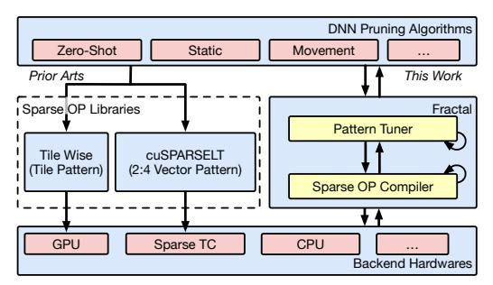
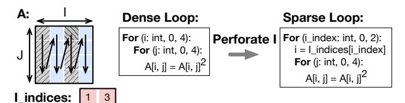

# 1 Introduction

With the rapid development of deep neural network (DNN) models and their success across diverse tasks, their efficient inference deployment becomes a paramount task. Meanwhile, the sizes of the DNN models increase swiftly [30, 36], precipitating an urgent surge in demand for varied computational resources. Consequently, optimizing these models regarding execution time, energy utilization, and serving throughput emerges as a pivotal challenge for both the machine learning and computer system domains.

In this context, model compression, encompassing quantization, pruning, and distillation, among other methods, emerges as a promising approach to reducing the computational complexity of DNNs. These techniques often necessitate collaborative optimization with operator development and novel architectural support to attain substantial enhancements. Among these model compression methods, pruning [31] stands out as a crucial technique, offering significant compression potential but requiring substantial systemlevel support. Pruning involves eliminating redundant model parameters, thereby reducing storage memory footprint and computational complexity. However, in practical scenarios, the current computing systems often achieve limited speedup with the pruned DNN models, if not even no speedup. This acceleration gap arises from the irregular nature of pruned sparse models, posing challenges to hardware memory hierarchy and parallel computing due to the sporadic nature of sparse element access. Additionally, decoding sparse element locations during computation causes extra overhead.

**Figure 1.** Prior sparse operator libraries with different patterns and the proposed pattern auto-tuning system Fractal.

Therefore, prior studies [19, 23, 29, 64] aims to bridge this gap by imposing spatial constraints on post-pruning non-zero elements to enhance memory locality. These non-zero elements are grouped to form local structures, denoted as a **sparse pattern**, and collectively pruned. This concept significantly advances sparse DNN efficiency, spawning numerous innovative sparse pattern designs [19, 23, 64]. However, these empirical sparse pattern designs often accompany handcrafted sparse operator libraries, as in the left of Fig. 1.

On the other hand, dense tensor computation often adopts a multi-level tiling strategy [1] to exploit the locality and parallelism in modern hardware like GPU. Inspired by this observation, we find that there is an opportunity to perform multi-level sparse tiling, as opposed to single-level sparse tiling, to maximize the benefits of sparsity in DNNs. However, this has three following challenges. First, we find that different operators have diverse preferences for sparse patterns so we need to tune the pattern accordingly. Second, the multi-level sparse tiling complicates the corresponding code implementation, making the previous approach of hand-crafted kernels infeasible. Finally, the multi-level sparse tiling impacts both the performance and accuracy, requiring a joint and efficient tuning strategy.

To overcome these challenges, we propose an automated approach to identify the optimal multi-level sparse pattern considering model accuracy and execution efficiency. We first introduce a novel loop-based intermediate representation PatternIR capable of representing diverse structured sparse patterns, thus forming a comprehensive search space. Leveraging this representation, we develop Fractal, a system dedicated to tuning sparse patterns for generating high-performance sparse DNN operators while adhering to accuracy importance score constraints. Furthermore, we employ the PatternIR to generate efficient operators through low-level tensor compilers [4, 37, 60], enabling the reuse of dense operator optimizations to sparse tensors.

To assess our approach, we demonstrate that Fractal yields operators achieving a 3.16× speedup on CUDA Core GPU, 2.52× speedup on Tensor Core GPU compared to the dense baseline under 75% sparsity. Notably, Fractal demonstrates

| Sparse  | Model        | Operator              | OP           | Supported  | Operator   |
|---------|--------------|-----------------------|--------------|------------|------------|
| Pattern | Acc.         | Library               | Perf.        | Backends   | Generation |
|         |              | SparTA[72]            | <b>//</b>    | All        | Template   |
| EW      | <b>V V V</b> | Sputnik[17]           | <b>√</b>     | All        | Auto       |
|         |              | cuSPARSE[48]          | ✓            | All        | Vendor     |
|         | /            | Triton-BW[60]         | <b>//</b>    | CUDA Core  | Template   |
| BW      | *            | cuSPARSE-BlockELL[48] | <b>///</b>   | All        | Vendor     |
|         |              | MagicCube[40]         | <b>V V V</b> | A100       | Manual     |
| TW      | <b>V</b>     | TileWise[23]          | <b>V V V</b> | V100, A100 | Manual     |
|         |              | Oclet Tiling[5]       | <b>///</b>   | V100       | Manual     |
| VW      | <b>V V V</b> | cuSPARSELt [49]       | <b>V</b>     | Sparse TC  | Vendor     |
| Hybrid  | <b>///</b>   | Fractal               | <b>///</b>   | All        | Auto       |

**Table 1.** Sparse operator libraries and pruning patterns.

superior trade-offs between accuracy and speedup compared to previous sparse pattern operators.

In summary, this study contributes as follows.

- We propose the loop-based PatternIR and transformation primitives to represent a broad spectrum of sparse patterns.
- We propose the first sparse pattern tuning system Fractal to search the optimal pattern for DNN considering the model accuracy and execution performance.
- We conduct thorough evaluation of Fractal with comprehensive settings to show its effectiveness and generality.

## 2 Background and Motivation

Initially, we offer a concise introduction to the pruning algorithm and the abstraction of structured sparse patterns as background information. Subsequently, we delve into the complexities inherent in designing sparse patterns, particularly those exhibiting multi-level sparsity.

## 2.1 Sparse Pattern Background

Pruning, a model compression technique, selectively removes unnecessary parameters from a DNN model, consequently improving inference speed and reducing memory usage [31]. The eliminated parameters are zeroed, enabling the sparse DNN model to leverage the efficiency of sparse linear algebra [61]. The pruning process incorporates three essential aspects: **importance score**, **pruning paradigm**, **and sparse pattern** [6, 22, 31]. The importance score assesses weight significance during pruning, which will be discussed in Sec. 4.2. The pruning paradigm dictates the accuracy restoration strategy (e.g., retraining) for the pruned model. This study focuses on the sparse pattern design, pivotal in balancing the efficiency and accuracy of sparse DNN models, while the former two aspects remain orthogonal.

Trivially, parameters in a DNN model are ranked based on their importance scores and pruned independently, commonly known as unstructured or element-wise (EW) pruning, as illustrated in Fig. 2 ①. Due to their irregular memory accesses and unbalanced computations, unstructured sparse operators necessitate a high sparsity ratio exceeding 99% to achieve speedups on hardware backends like GPUs [17, 48]. However, in practice, these models are typically pruned to sparsity ratios ranging from 50% to 90%

**Figure 2.** (I). Pruning hierarchy of tiled GEMM and corresponding sparse patterns. We visualize the pattern under 75% sparsity with the query weight of BERT-large 1st layer. (II). Sparse pattern abstraction and design factors.

to maintain acceptable model accuracy [6, 28, 31]. Consequently, unstructured pruning encounters challenges in attaining substantial speedup values that are meaningful.

**Sparse Patterns.** Previous research has introduced structural constraints, termed **sparse patterns**, aimed at organizing the placement of non-zero elements within sparse tensors. These structured patterns serve to enhance hardware parallelism and reduce random access during sparse data handling. However, imposing spatial patterns on unpruned elements introduces an additional layer of regularization that may potentially affect the DNN model's expressiveness and accuracy. Consequently, numerous studies have explored various pruning patterns to optimize them for hardware efficiency and model error reduction. As depicted in Fig. 2, these patterns are inspired by the tiling structure of dense operators and apply pruning at specific levels, such as **9** Block Wise (BW) [19] and **9** Tile Wise (TW) [23, 26].

In summarizing previous research on sparse patterns, we have developed an **abstract model** depicting the design factors for structured sparse patterns in Fig. 2 II. This model incorporates a pruning pattern with dimensions H and W, alongside a selection region measured as P by Q. The pruning pattern, highlighted by a pink frame in the figure, specifies the dimensions of elements to be pruned collectively. Conversely, the blue frame indicates the selection region, which defines the area where adjacent pruning units are collectively ranked. As a result, each selection region maintains a uniform sparse ratio, since elements within these regions are pruned on a local basis. For example, the Fig. 2 **6** vectorwise (VW) pattern [73] incorporates a fine-grained selection region for 2:4 vector shape pruning, which is supported by a dedicated hardware unit Sparse Tensor Core [44].

**Pattern Mask Diversity.** Evaluating the accuracy impact of a sparse pattern is difficult and time-consuming. Previous studies have highlighted a robust correlation between sparse model accuracy and sparse pattern expressiveness, quantified through a metric termed mask diversity (MD) [33]. This

metric computes the count of all potential pruning masks for a given sparse pattern and target tensor shape. For example, the MD of 50% unstructured pruning of a 2×2 tensor is  $C_4^2=6$ . Given the typically vast value of MD, log(MD) is employed as an evaluative metric for the accuracy-related implications of a sparse patterns, depicting the spatial constraints imposed by the structured patterns.

#### 2.2 Need for Sparse Pattern Tuning System

In this subsection, we present our perspective of understanding sparse patterns as certain form of sparse computation tiling, unveiling unexplored opportunities in multi-level sparse tiling. Furthermore, we outline the challenges inherent in multi-level sparse tiling, underscoring the necessity for a systematic and principled pattern tuning system.

Connection of sparse pattern and computation tiling. Dense computations such as general matrix multiplication (GEMM) employs multiple levels of tiling, depicted at the top of Fig. 2 I, to enhance parallelism and data locality. We observe that existing sparse patterns from to can be perceived as instances of omitting computation within a specific tiling hierarchy. For example, the BW pattern [19] skips the computation at a coarse granularity, while the TW pattern [23] skips the computation at a finer granularity.

Multi-level sparse tiling opportunity. The existing sparse pattern libraries, enumerated in Tbl. 1 solely exploit skipping opportunities at a fixed level, while contemporary parallel hardware such as GPUs necessitates multiple levels of tiling to maximize its efficiency [2, 38, 63]. While current patterns only achieve sub-optimal performance, we propose to exploit the multi-level sparse tiling opportunity to fully unleash the potential of sparsity in DNNs. This approach promises advantages in both performance, through the implementation of performance-oriented tiling hierarchies, and accuracy via greater diversity in sparse patterns. For example, it is possible to leverage two levels of sparse tiling, forming the hybrid pattern of Fig. 2 **6**. However, the multi-level sparse tiling

**Figure 3.** Pruning magnitude loss on different weight tensors under 75% sparsity.

has the following challenges, which we propose to build a principled and systematic pattern tuning system to address.

Diverse operator-level accuracy preference. Previous works [19, 28, 47] adopt a single sparsity pattern for the entire model, which is sub-optimal considering the diverse operator-level accuracy preferences. In Fig. 3, we show the magnitude loss pruned with different patterns for several weight tensors of the first layer from a BERT-large model. Notably, even with comparable mask diversities, each tensor exhibits a unique optimal pruning pattern. For example, horizontal TW causes much less magnitude losses compared to BW and vertical TW for (b) attention output tensor, while the opposite for (a) attention key. This variance stems from the intrinsic spatial structures within weight tensors, such as the attention heads [11, 62, 64]. Additionally, as illustrated in Fig. 3 (a), the vertical TW pattern outperforms others with granularities below 64, aligning with the 64 hidden size in the pruned tensor. When the granularity is extended to 128, the vertical TW pattern becomes even worse than the others as this means we are forcing adjacent heads to be pruned together. This emphasizes the necessity for automatic pattern tuning to strike a balance between accuracy and performance at the operator level.

Automatic high-performance code generation. Existing sparse patterns in Tbl. 1 design underlying kernels empirically to achieve high performance. This necessitates substantial engineering dedication and optimization tailored to each hardware and operator, rendering such libraries non-scalable. While some libraries incorporate template-based or autooperator generation, these functionalities remain confined to specific sparse patterns and do not encompass the entirety of sparse design for the target backend. In contrast, dense DNN models benefit from automatic high-performance code generation facilitated by compilers like TVM [4], which formulates a proper tiling transformation space for performance tuning. However, formulating the multi-level sparse tiling space remains an open and challenging problem.

Enormous performance and accuracy tuning space. Given the above aspects, the design of sparse patterns needs to be determined carefully to achieve optimal acceleration while retaining model accuracy. To illustrate, we summarize the overall latency performance and model accuracy of the sparse operator libraries in Tbl. 1 as OP Perf. and Model Acc. respectively. This leads to a very large design search

Figure 4. Loop perforation and structured sparse pattern.

space by combining these factors. To illustrate, constraining pattern sizes to multiples of 2 on a tensor sized  $1024 \times 1024$  yields approximately  $3 \cdot 10^{11}$  potential patterns. Not only do these factors have a large number of design space, but they are also coupled with the latency and accuracy tradeoff, further complicating the quest for the optimal solution. Consequently, an efficient and swift methodology is essential to navigate this colossal sparse pattern space for joint performance and accuracy tuning.

**Summary.** Given the challenges associated with designing sparse patterns, meeting the demands of execution efficiency and model accuracy through empirical explorations becomes complicated. Consequently, an effective auto-tuning technique becomes paramount to attain the optimal pruning patterns and generate the corresponding sparse operators.

