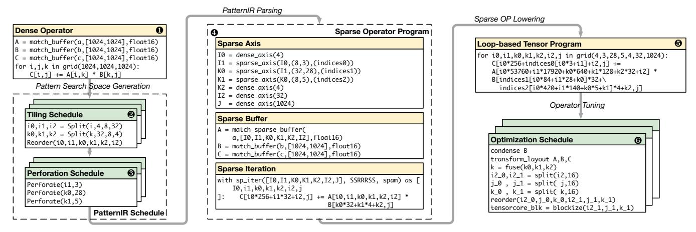
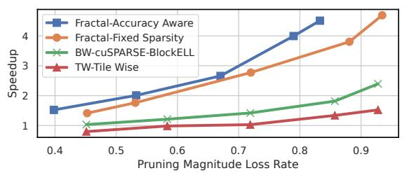

# 3 Loop-based Pattern Representation

To tackle the challenge of pattern design and its auto-tuning, we introduce a novel loop-based intermediate representation (IR), PatternIR. This representation comprehensively expresses a broad spectrum of sparse patterns, enabling the establishment of an extensive search space for the optimal pattern selection. Moreover, PatternIR **prioritizes loops as the first-class citizen**, leveraging the nested loops characteristic of tensor program compilers. This enables the conversion of sparse operators into low-level representations, facilitating the utilization of existing optimization techniques. This section presents the formal definition of PatternIR and its associated transformation primitives.

#### 3.1 Definition of PatternIR

**Loop Perforation.** The inspiration for our loop-based pattern representation stems from the loop perforation technique in approximate computing [32, 41, 57]. Loop perforation enhances computational efficiency by selectively skipping iterations while compromising on accuracy. Drawing from this concept, we perforate dense loops with sparse indices, enabling conditional computation as depicted in Fig. 4. Since tiling loops are arranged hierarchically, perforating an outer loop results in the omission of all nested inner loops, as illustrated by the entire column in Fig. 4. This approach yields a structured access pattern for the tensor  $\boldsymbol{A}$  in the figure, which is equivalent to the structured sparse pattern.

**Formulation.** Following the above intuition, we define sparse patterns as perforated tiling loops. A sparse loop,


**Figure 5.** PatternIR: **①** column major. **②** row major. **③**, **②** split. **⑤** join. **⑤** global BW. **②** balanced BW. **⑤** hybrid pattern.

denoted as  $I_{length}^{nnz}$ , represents a loop characterized by its iteration length and the count of non-zero (nnz) elements after perforation. If the iteration length equals to the nnz, indicating a dense loop, the nnz value superscript is omitted. As depicted in Fig. 4, sparse loops necessitate an index vector to record the original dense positions of sparse elements. The index value ranges from 0 to the iteration length, with the vector's length equals to nnz. Structured patterns are then represented by combining these sparse loops, such as  $I_{i\_length}^{i\_nnz}J_{j\_length}$ . When a sparse loop J depends on another sparse loop I, it suggests that J's values and those of subsequent loops are stored contiguously with better spatial locality than I.

Expressiveness of Patterns. Utilizing PatternIR, a broad spectrum of structured patterns can be represented by organizing sparse loops and identifying their nnz values. In Fig. 5, we demonstrate various fundamental forms to compose complex sparse patterns. We showcase the corresponding PatternIR and perforated loop structure of each pattern. • and show the patterns with reversed layouts and PatternIR dependencies. 3 and 4 show the patterns with diverse selection regions and pruning pattern granularities by perforating different loops. • shows the unstructured EW pattern with joined loops. • and • compare the global BW and columnbalanced BW patterns derived by changing the selection regions. Employing similar concepts, existing sparse patterns discussed in Fig. 2 **1** are represented with the proposed PatternIR, such as BW pattern with  $10K0_{1024}^{256}I1_{32}K1_{32}$  and VW with  $I_{1024}K0_{256}K1_4^2$ . This guarantees the rich search space of

| Primitive                   | Example         | PatternIR                                      | Storage Transpose             | Loop Transformation               |  |
|-----------------------------|-----------------|------------------------------------------------|-------------------------------|-----------------------------------|--|
| Initialization              | Init(OP)        | $I_4J_4$                                       | value[i, j]                   | For i in (0, I.length):           |  |
|                             |                 |                                                | 2.33                          | For j in (0, J.length):           |  |
|                             | Split(I, 2, 2)  | 10 <sub>2</sub> 11 <sub>2</sub> J <sub>4</sub> |                               | For io in (0, I0.length):         |  |
| Split(loop, size_a, size_b) |                 |                                                | value[i0, i1, j]              | For i1 in (0, I1.length):         |  |
|                             |                 |                                                |                               | For j in (0, J.length):           |  |
| Reorder(loop a, loop b)     | Reorder(I, J)   | $J_4I_4$                                       | value[j, j]                   | For j in (0, J.length):           |  |
| rcorder(100p_a, 100p_b)     |                 |                                                | varue[j, 1]                   | For i in (0, I.length):           |  |
| Join(loop_a, loop_b)        | Join(I, J)      | IJ <sub>16</sub>                               | value[ij]                     | For ij in (0, I.length*J.length): |  |
|                             | Perforate(J, 2) | $I_4J_4^2$                                     | value[i, J indice[i, j iter]] | For i in (0, I.length):           |  |
| Perforate(loop, nnz)        |                 |                                                | J indice[i, j iter]           | For j_iter in (0, J.nnz):         |  |
|                             |                 |                                                | J_marce[i, j_ner]             | j = J_indices[i, j_iter]          |  |
|                             | Condense(J, A)  | $I_4J_4^2$                                     |                               | For i in (0, I.length):           |  |
| Condense(loop, buffer)      |                 |                                                | A'[i, j iter]                 | For j_iter in (0, J.nnz):         |  |
| Condense(100p, buller)      |                 |                                                | A [i, j_iter]                 | j = J_indices[i, j_iter]          |  |
|                             |                 |                                                |                               | $A'[i, j\_iter] = A[i, j]$        |  |

**Table 2.** Illustration of transformation primitives defined on PatternIR, and corresponding examples for showing their effects.

Fractal to contain the current solutions. Through the perforation of multiple sparse loops, PatternIR even facilitates the exploration of novel hybrid patterns like Fig. 5 **6**.

**Sparse Pattern Abstraction.** We now demonstrate how to express an arbitrary sparse pattern according to the abstraction discussed in Sec. 2.1 with PatternIR. Assuming a PatternIR comprising n and m sparse loops related toj I and J dimensions respectively, the size of the original dense tensor is the multiplication of all the loop lengths,  $N = \prod_{i=0}^{n} \text{li.length}$ . The pattern size perforated on a particular loop It is determined by the lengths of all successive loops, defined as  $W = \prod_{i=t+1}^{n} \text{li.length}$ . Correspondingly, the selection region size Q equals  $Q = \prod_{i=t}^{n} \text{li.length}$ . Although only the sizes of dimension I are demonstrated, the sizes M,H and P of dimension J are derived following the same method.

#### 3.2 Transformation Primitives

The transformation of PatternIR to express diverse patterns involves defining transformation primitives on PatternIR as Tbl. 2. The PatternIR derives from a dense loop tiling structure, and consequently, we introduce the tiling primitives: split, reorder, and join, similar to those in tensor compilers [4, 37, 60]. Particularly, these primitives, when applied to sparse loops in PatternIR, implicitly restructure both the underlying sparse storage and loop. Additionally, the perforate primitive is introduced to induce sparsity, while the condense primitive is reserved for optimizing sparse operators, to be discussed later. To illustrate the impact of each primitive, we employ a basic PatternIR I<sub>4</sub>J<sub>4</sub> as an example.

- **Split** primitive divides the loop into two sub-loops with given lengths to create fine-grained tiling structure as shown in Fig. 5 **3** and **3**. The memory accessing are transformed to two iteration variables without changing the storage.
- Reorder primitive exchange the dependency of two adjacent loops. This will explicitly transpose the storage of the two axes and their computation loop order as shown in Tbl. 2. For example in Fig. 5 and •, the sparse tensor is transposed from column-major storage to row-major storage, while the pattern is changed from column-wise to row-wise.
- **Join** primitive merges two loops to a greater iteration loop, as the inverse operation of split. It flattens the storage of the two axes and merges the loop indexing. Join primitive also


Figure 6. Hybrid sparse pattern, PatternIR and corresponding storage format Fractal-ELL and sparse loops.


Figure 7. System architecture.

combines the regions in the pattern as shown in Fig. 5 **9**. When joined together, the loops' PatternIR are concatenated together without subscripts.

• **Perforate** primitive is the essential transformation that introduces sparsity into the PatternIR. It annotate the loop with nnz and create sparse index array. The storage of the value tensor is also reduced to the its sparse counterpart.

## 4 Fractal: Sparse Pattern Auto-Tuner

Based on the aforementioned PatternIR representation, we build the Fractal system to conduct auto-tuning of the sparse patterns. Leveraging sparsity across various dense tiling hierarchies facilitates the reuse of dense operator optimizations and bridges the sparse operator with its dense counterpart. To the best of our knowledge, our research marks the first attempt to propose a comprehensive representation of sparse patterns and employ it for automatic pattern exploration.

**System Overview.** Fig. 7 shows the architecture of the Fractal system. At its core, the PatternIR acts as the primary interface interacting with the operator pruner, code generator, and pattern tuner module. The operator pruner determines the pruning mask and evaluates the pruning metrics, which serves as a tuning threshold to make the process accuracy-aware. The code generator compiles the sparse operator utilizing the PatternIR and tunes it with the low-level operator tuner to measure its latency. These performance metrics drive the pattern tuner to explore the pattern search space, aiming to converge toward an optimal solution that guarantees both model accuracy and operator performance.

## 4.1 Sparse Operator Code Generation

We begin with the generation of efficient sparse operators given the a PatternIR. Parsing the structured sparse operator involves its conversion into low-level tensor program compiler IRs [13, 68]. Subsequently, we leverage code generation techniques and operator tuning to enhance performance.

**Sparse Format: Fractal-ELL.** We propose a novel sparse format Fractal-ELL to store the sparse tensors, as described with Fig. 6. This format is motivated by combining the ELL sparse format [3], which stores the indices of nnz elements of each row. The blue section of Fig. 6 demonstrates the ELL format with a (4,4) sparse matrix with axes I0, J0 under 50% sparsity. The index vector J0\_indices preserves the indices of nnz elements of each row.

Fractal-ELL extends it with multi-level sparse loops. The blue and pink sections of Fig. 6 highlight the Fractal-ELL format featuring 4 levels, where  $\bullet$  and  $\bullet$  are the corresponding pattern and PatternIR. The size of the value matrix is determined by the total count of non-zero elements, which is the product of the non-zero elements across all loops. For the sparse loops, indices vectors are attached following the ELL format. Consequently, the vector's size is dictated by the cumulative non-zero elements across all preceding loops. For example, the index vector I1\_indices's size of the third loop I1 is  $4 \times 2 \times 2 = 16$ . As the pattern of the I1 loop is a  $1 \times 4$  vector, this index vector keeps the relative position of each vector in the inner  $4 \times 4$  block as illustrated in Fig. 6  $\bullet$ .

PatternIR Lowering. As PatternIR is a thin abstraction layer to represent structural sparse patterns with dense loops, it can be transformed to loop-based tensor program compilers' IRs, such as TVM [4], TACO [37], among others. In this study, our implementation of the Fractal system utilizes SparseTIR [68] as the backend sparse tensor compiler, leveraging its open-source code base and the vibrant TVM community. Parsing the sparse operator through PatternIR, we convert it into SparseTIR's tensor program expression, capitalizing on the reuse of its code generation tools. This process is depicted in Fig. 8.

Initially, for an input dense operator, we sample a sparse pattern employing the transformation primitives introduced



**Figure 8.** Code generation pipeline of Fractal. The green blocks represents pattern tuning and operator tuning schedules.

in Sec. 3.2. The sampling of the sparse pattern occurs through two fundamental steps: ② tiling and ③ perforation schedules. While the application order of primitives remains flexible, we adopt this two-step approach to streamline the pattern generation process and cache redundant computations without compromising generality. The primitives in the first step are translated to the corresponding loop transformation primitives defined on SparseTIR. The perforation primitive of the second step is implemented by rewriting the operator's expression as shown in Fig. 4. Revision G. Missing discussion of the algorithm language that PatternIR transforms. With this design, the validation of transformation correctness, such as loop nest and buffer boundary, is checked and guaranteed by the low-level primitives. Further elaboration on this methodology is provided in Sec. 24.

In this example, we exhibit a GEMM operator with three perforated loops. Subsequently, the dense operator and the derived PatternIR are translated to a sparse operator as shown by Fig. 8 **4**. The sparse operator consists of the sparse axis, sparse storage buffers, and sparse iterations. These sparse axes correspond to the nodes within the PatternIR object, requiring explicit specification of the dependent axis. Index vectors are assigned to the perforated sparse loops. By declaring these sparse axes, the sparse storage is transposed into the Fractal-ELL format. Simultaneously, the loops are transformed into the sparse form, as shown in Fig. 6 3. The subsequent step involves translating the sparse operator to the low-level tensor compiler TVM's intermediate representation (IR), demonstrated in 6. Consequently, the sparse GEMM operator adopts a tiled-loop format with sparse indexing, rendering it amenable to further operator tuning.

**Operator Tuning.** To get efficient sparse operator implementation, we adopt the tensor program auto-tuning tool MetaSchedule [54] to optimize the operator's efficiency. This tool constructs a probabilistic search space for operators


Figure 9. Illustration of condense primitive.

and employs learning-driven methods to determine an optimized schedule. Capitalizing on the loop-based sparse pattern derived from the PatternIR, the resultant sparse operator becomes hardware-friendly and aligns seamlessly with the low-level operator tuner. Fig. 6 **6** depicted an example of an optimized sparse operator schedule.

Condense Primitive. Alongside the operator tuning transformations, we introduce a novel transformation primitive Condense, aimed at regularizing the random access of sparse tensors. The concept of the Condense transformation involves aggregating noncontinuous sparse values within a sparse pattern to construct a dense storage. To illustrate this, consider the Condense transformation applied to a sparse GEMM operator as depicted in Fig. 9. When condensing the sparse loop K of tensor A, the discrete elements of A along loop K induce random access within tensor B, as demonstrated in **1**. This results in inefficient local memory access due to thread conflicts. A solution to mitigate this issue involves pre-gathering corresponding values in B based on the indices of A, organizing them into an aligned storage structure. Furthermore, data movement of Condense could be integrated into the caching process of local memory without incurring extra overhead. However, condensing tensor B necessitates additional storage, as each outer loop holds distinct indices. Consequently, this primitive tuned through the operator tuning process to optimize its utilization.

Backend Specific Configurations. Alongside the sparsityoriented Condense transformation primitive, various backend-specific configurations play a crucial role in optimizing performance during operator tuning. These settings are provided as the tuner configuration, orchestrating the search process within Fractal. We spotlight a distinctive GPU backend rule as an example in the subsequent discussion.

During the execution of sparse kernels with dynamic index values on SIMD hardware like GPGPU, parallel threads executing the same instruction can potentially access identical memory locations. This situation can lead to conflicts, resulting in inaccurate computation outcomes when multiple threads simultaneously write to the same memory location. To ensure correctness, computations are transformed into atomic operations, but this introduces significant inefficiency and computational overhead. To mitigate inter-thread reduction, two rules are incorporated into the backend's tuner configuration. (1) spatial axes successive to reduction axes are prevented from perforation. (2) the joining of spatial and reduction axes is disallowed. These rules serve to prevent parallel threads from contributing to identical output memory locations, averting computation result reductions across threads. Typically, existing sparse operator libraries implicitly apply these rules as common constraints, following empirical designs by developers. Thus, introducing these rules does not foreclose any potential patterns within Fractal.

## 4.2 Pruning with PatternIR

We illustrate how PatternIR facilitates accuracy metric calculation during pattern tuning.

Importance Scores. To comprehensively evaluate the pattern's regularization effect on model accuracy, we introduce pruning importance scores as a tuning objective within the pattern tuning process. These scores predict the accuracy impact associated with each element of each operator. For instance, the magnitude score aggregates directly pruned values, commonly used in most pruning algorithms. The L1 norm adopts the gradient of the pruned value to assess its influence on the final loss objective. Besides, there are also advanced importance scores like ERK [45], LAMP [39], Wanda [59], tailored for specific pruning scenarios.

During pattern tuning, we use an importance score threshold to filter patterns surpassing it to prevent substantial model performance degradation. Because the redundancy of DNN weight parameters enjoys an operator-wise variance. Determining the optimal operator sparsity given a global accuracy objective is non-trivial [39, 45]. In this work, we use the importance score pruned with the unstructured pattern as the threshold for all operators. The motivation is that an unstructured pattern provides the theoretical lower bound of accuracy loss. As these importance scores are compatible with the proposed method, we select the most popular

magnitude metric for our experiments. Moreover, we offer a customizable interface to specify the importance score employed during tuning.

**Multi-level Pruning.** Given that previous patterns have solely accounted for a single level of sparse pattern, the ranking of regions becomes trivial. In contrast, for the proposed multi-level hybrid patterns, a greedy solution is introduced to iteratively prune each level of the pattern. The pruning sequence for multi-level patterns proceeds from coarse-grain to fine-grain, ensuring that the pruning of inner loops remains unaffected by the outer loops.

#### 4.3 Sparse Pattern Auto-Tuner

The sparse pattern tuner coordinates the previous code generation and pruning procedures as sub-routines, assessing accuracy and performance metrics for each PatternIR. Its objective is to identify the most efficient sparse pattern within specific pruning importance score constraints. A given threshold filters candidates composed of different patterns and sparsity levels to guarantee accuracy. The Fractal tuner generates a PatternIR search space, followed by the ranking of candidate PatternIRs for subsequent tuning iterations. These chosen candidate patterns undergo parsing into sparse operators and subsequent optimization via the operator compiler, enabling an evaluation of their real latency outcomes. To expedite the tuning process, we integrate a machine learning-based cost model for latency prediction. The tuner's pseudo-code is presented in Alg. 1.

#### **Algorithm 1:** Pattern Tuning Pseudo Code of Fractal.

```
Data: Dense Operator: OP, Tuner Config: Config
   Result: Sparse Pattern: Sch
 1 Schs \leftarrow GenTilingSpace(OP); // Generate tiling space
_2 CachedScores \leftarrow Config.pruner(sparsePatterns); // Compute
\textbf{3} \quad Schs \leftarrow \textbf{GenPerforationSpace}(Schs); \textit{//} \quad \texttt{Genrate perforation space}
4 Scores \leftarrow Config.pruner(Schs, CachedScores); // Compute scores
5 Schs \leftarrow FilterByScore(Schs, Scores, Config.max\_score); // Filter
       with threshold
6 Latencies' ← CostModel(Schs);// Predict patterns' latencies
7 Latencies', Schs \leftarrow Sort(Latencies', Schs);
8 BestLatency, Sch \leftarrow Inf., None;
9 for j in Config.search_num do
         // Compile and evaluate top candidates
10
         SparseOP \leftarrow CodeGen(Schs[j]);
11
         SparseOP \leftarrow OperatorTuner(SparseOP);
         Latency \leftarrow Exec(SparseOP);
12
         if Latency > Config.latency limit then
13
14
         Continue;// Early stop
15
         end
         \textbf{for } k \textbf{ in } Config.tune\_iteration \textbf{ do}
16
17
             SparseOP \leftarrow OperatorTuner(SparseOP);
18
         end
         Latency \leftarrow \mathbf{Exec}(SparseOP);
19
         if Latency < BestLatency then
              // Update best result
21
              Sch \leftarrow Schs[i];
              Config. latency\_threshold.updateThreshold(Latency);
23
24 end
```


Figure 10. Operator performance results on A100 Tensor Core.

**Search Space Generation.** The search space generation begins by initializing the vanilla PatternIR from the input dense operator expression. As discussed previously, generating a sparse pattern involves two stages: loop tiling (Line 1) and perforation for sparsity (Line 3). Firstly, we generate diverse combinations of loop sizes derived from the dense PatternIR. For each tiling setting, we transform the initialized PatternIR accordingly with the primitives. To constrain the search space size, we employ rule-based tuner configurations. As a practical example, we enforce a maximum depth of each axis of 3 and a minimum length of each loop of 4.

Subsequently, we explore all feasible perforation configurations on the tiled PatternIR. For example, a sparse loop with a length of 8 undergoes perforation ranging from nnz 1 to 8. Throughout this phase, we assess the pruning importance score, pre-emptively discarding patterns that don't meet the qualifications. Additionally, we opt to cache the results of the importance score computation, given that the evaluation of importance scores for distinct patterns often involves scoring identical regions.

**Cost Model.** Before parsing the sparse operator for real backend latency assessment, we leverage an ML-based cost model to forecast the performance of the sparse patterns. We use the cost model to predict the latencies of candidate patterns and select the top-ranking ones for actual code generation and performance tuning. Each sparse pattern generates a feature vector by concatenating the attributes of its sparse loops, encapsulated within a 4-element tuple comprising loop length, non-zero count, axis type, and tiling hierarchy order. For example,  $10_{32}$ K $0_{64}^{16}$ 1 $1_{32}$ K $1_{16}$  is converted to a feature vector as [(32, 32, 0, 0), (64, 16, 1, 1), (32, 32, 0, 2), (16, 16, 1, 3)]. To utilize the sequential dependency characteristic inherent in sparse loops, we employ a bidirectional LSTM[18] as our prediction model. We profile several thousand generated sparse operators accommodating various input shapes as training calibration. It should be noted that the cost model is

specified for each backend and requires extra profiling and training when extended to new hardware. The cost model is proposed to accelerate the pattern tuning process, and the Fractal system is feasible when applied to new backend without a cost model. The tuning overhead varies significantly across different configurations. In practice, we have identified a set of empirical settings that enable the search to converge in under 2 hours. Specifically, the operator tuning process of MetaSchedule for each PatternIR candidate takes a maximum of 20 minutes. This operator tuning process is early stopped on non-prospective candidates with heuristic latency thresholds.

## 5 Evaluation

#### 5.1 Experimental Setup

**Testbed.** The evaluation of Fractal encompasses servers featuring GPU cards of NVIDIA A100 (80G) and NVIDIA RTX-1080Ti and Intel(R) Xeon(R) E5-2620 v3 @ 2.40GHz CPU. Our experiments rely on essential dependencies: CUDA-11.7, TVM-0.12.0, and SparseTIR.

Benchmark and Datasets. To evaluate the efficiency of tuned patterns, we select representative operators from the BERT-base, BERT-large [62], VGG[58] and ResNet [27] model following previous works [23, 72]. The convolution operators from the two CNN models are transposed to matrix multiplication operation with img2col algorithm [34]. We benchmark the operator 1000 times and report the average value with 100 times warmup runs. To evaluate the model speedup, we aggregate the latency of all the operators for all baselines following prior works [23, 40]. For model accuracy evaluation of different patterns, we use movement pruning [53] on the MRPC semantic classification dataset[12] with BERT-base and BERT-large models. For most of the experiments, we


Figure 11. Benchmark results on diverse backends.

adopt an operator with FP16 data format, which is the most common setting for lossless DNN inference.

**Baselines.** We compare Fractal with dense operator baseline cuBLAS[50] and sparse operator libraries summarized with Tbl. 1. As many sparse baselines support only specific backends, we conduct comprehensive comparisons under varied circumstances by adjusting settings related to backends, data formats, operator shapes, and sparsity ratios.

#### 5.2 Sparse DNN Operators Results

We first benchmark the sparse operator performance generated by Fractal against SOTA sparse operator libraries. The comparison includes Block-ELL kernels from the cuS-PARSE [48] library and the Tile Wise [23] pattern optimized specifically for Tensor Core [7]. Here, we only show the operators that can utilize the Tensor Core[44] processing unit due to its supreme efficiency. In the following backend benchmark results, we show the results with the Tensor Core disabled as a new CUDA core backend. Additionally, comparisons involve the cuSPARSELt [49] library utilizing Sparse Tensor Core hardware with the VW pattern, limited to a 50% sparsity ratio. We benchmark 12 representative sparse operators sampled from Transformer, ResNet, and VGG model architectures, normalizing the latency results with the cuBLAS dense operator library. For the sparse pattern libraries, we select and report the result of the best pattern size under each setting. Furthermore, for a fair and realistic operator-level comparison, we constrain the pattern size of each hierarchy within Fractal to be smaller than 64. In cases where the evaluated sparsity is unsupported in sparse libraries, we opt for the closest higher sparsity available.

**Operator Benchmark.** Fractal exhibits substantial speedups, achieving 1.62, 2.52, and 4.00 average speedup factors at sparsity ratios of 50%, 75%, and 93.75% respectively, consistently outperforming other sparse libraries across nearly all evaluated scenarios. Unlike prior libraries optimized for specific settings, which may lead to inadequacies



Figure 12. Singular operator accuracy-aware tuning.

in some cases, Fractal consistently delivers efficient operators by allowing the tuning of optimal patterns and corresponding sparse programs for all scenarios. In instances where sparse operators exhibit 50% sparsity and have their K dimensions larger than 4096, the dense cuBLAS baseline demonstrates remarkable efficiency and the sparsity level is relatively low, causing all sparse approaches to fail at achieving speedups compared to the dense baseline. However, only the VW pattern with hardware support manages to achieve speedup compared to the dense baseline.

**Backend Benchmark.** To demonstrate the versatility of Fractal across various execution backends (Fig. 11), we assess its performance with the 1024/1024/1024 GEMM operator. Notably, Fractal consistently exhibits significant speedups across all evaluated backends. While other sparse operator baselines are limited to specific backends, Triton's BW kernel demonstrates noteworthy results on the A100 CUDA core, offering performance comparable to Fractal. Conversely, on the RTX-1080Ti, Fractal outperforms Triton-BW, showcasing its adaptability to diverse backends.

