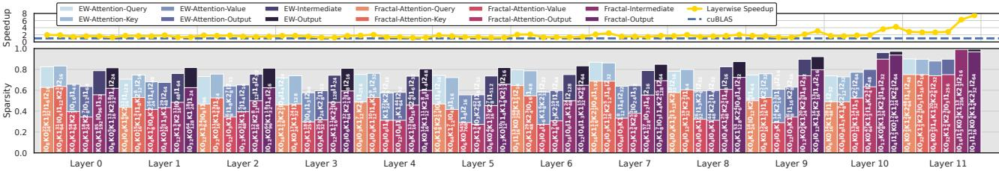
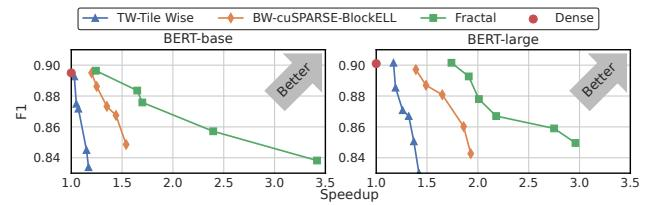
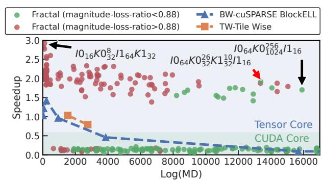
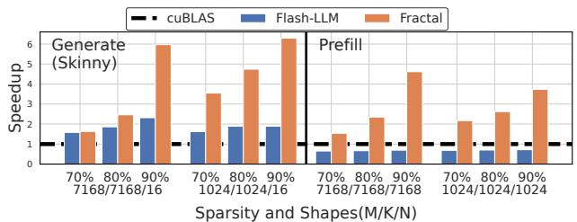
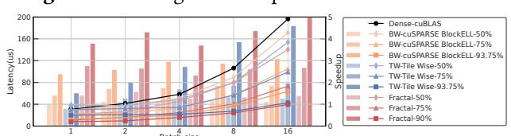

# 5.3 Accuracy-aware Operator Tuning

We evaluate the effectiveness of accuracy-aware operator tuning with operator-level magnitude loss and model-level accuracy. Additionally, we offer case studies examining the joint tuning search space and the pattern distribution.

**Operator Magnitude.** The preceding evaluations primarily focused on operator execution efficiency, considering a loose restriction on pattern sizes, requiring tile sizes larger than 4. To comprehensively address the accuracy regularization effect inherent in sparse patterns, we further examine the trade-off between pruning accuracy and operator efficiency. We compare the magnitude loss of sparse patterns and operators tuned by specifying several sparsity levels with Fig. 12. To compare, we present patterns tuned by Fractal with a magnitude value as the accuracy threshold. Notably, integrating accuracy importance scores directly into the operator tuning process enhances the Pareto frontier, achieving an improved trade-off between accuracy and speedup. Compared to previous sparse operators, which solely accommodate pre-defined sparse patterns, Fractal presents adaptability for diverse target tensors and sparsity variations.

Figure 13. Layerwise PatternIR, sparsity and speedup breakdown of BERT-base model tuned with Fractal.

**Model Accuracy.** The previous results demonstrated Fractal's effectiveness with uniform sparsity levels across all operators and patterns. However, enhancing model accuracy entails distributing sparsity throughout the model, capitalizing on distinct redundancies within each layer's parameters. Consequently, we undertake a joint tuning approach for operator sparsity and pattern within a DNN model, employing magnitude as the pruning importance score. Globally, we utilize the unstructured pruned magnitude score across the DNN model as the pruning threshold during pattern tuning. We first prune the model with the global unstructured pattern to determine the importance score threshold for each operator and then tune the patterns as introduced in Sec. 4.3. Without any loss of generality, we adopt the movement pruning method, while ensuring compatibility with various pruning paradigms. The results of BERT-base and BERT-large models are shown with Fig. 14. It is shown that with Fractal, the pruned model achieves better efficiency and accuracy Pareto frontier compared with previous sparse libraries by a margin.

Joint Search Space. To illustrate the tuning process, we visualize the search space denoting MD and speedup for a GEMM operator with dimensions M/K/N=1024/1024/1024, showcasing 75% sparsity in Fig. 15. Intuitively, the latency speedup exhibits an inverse relationship with log(MD), portraying the pattern design trade-off between accuracy, and performance. Specifically, our annotations highlight patterns with the best speedup and MD using Tensor Core. Prior research approaches typically explore the search space empirically. However, leveraging Fractal, we efficiently converge to the most optimal pattern for each operator by adhering to real importance score thresholds, measuring the impact on model accuracy. Under an importance score limit of 88% magnitude,

Figure 14. DNN model speedup and accuracy trade-off.

**Figure 15.** Pattern search space analysis with 75% sparsity.

available patterns are distinctly marked in green. Consequently, the tuner converges toward the green-patterned, best-speedup scenario as highlighted with the red arrow.

Pattern Distribution Analysis. As a case study, we present the visualizations of the searched patterns for each layer within the BERT-base model. We demonstrate the distribution of sparsity across operators, adhering to an 80% global unstructured sparsity scheme. Due to our utilization of the magnitude score as the tuning importance metric, the structured sparse patterns tend to exhibit smaller sparsity ratios compared to unstructured pruning. This operator-specific distribution underscores the necessity of fine-tuning patterns at the operator level. The label in Fig. 13 shows the tuned PatternIR of each operator. The observation highlights that most operators manifest a hybrid pattern, substantiating the efficacy of the proposed hybrid pattern and PatternIR representation. Impressively, the final operator in the DNN displays a complex pattern incorporating four sparse levels. These diverse pattern preferences across operators align with the rationale outlined in Sec. 2.2.

## 5.4 Sensitivity Analysis Experiments

We conducted several sensitivity analyses to evaluate the generality and extensibility of the proposed Fractal system. **Data Format Compatibility.** Quantization, akin to pruning, is a widely employed method for compressing DNN models by converting tensors into formats with reduced bit storage [46]. The idea is to compress DNN models by converting tensors into formats with reduced bit width. Generally, applying quantization to DNN models is orthogonal to

Figure 16. Low-precision benchmark with INT8 data format.

Figure 17. LLM oriented operator results.

pruning [42]. Leveraging the well-designed parsing process, Fractal seamlessly adapts to low-precision data formats like INT8. Among the existing sparse operator solutions, only vendor solution cuSPARSE and MagicCude [40] offer support for low-bit representations alongside structured sparse patterns. Yet, Fractal's auto-tuning method facilitates the generation of optimized sparse operators off-the-shelf. The outcomes, depicted in Fig. 16, exhibit that Fractal achieves an average speedup of 2.06x, consistently outperforming the baselines, across all sparsity levels. Compared to FP16 results, sparse patterns at INT8 have a lower speedup gain. This is due to reduced memory access demand of the quantized DNN operators, limiting the gain of sparse operators.

LLM Operator Benchmark. Large language model (LLM) [70] achieves prominent effect on various tasks recently With its large parameter and model size, the structured pruning and fine-tuning of LLM is non-trivial and expensive. Recent research [15, 59] reported zero-shot pruning results with unstructured and VW pattern with about 50% sparsity, while the pruning with coarser-grained patterns remains an ongoing research topic. Flash-LLM [66] is a recent work aiming at efficient unstructured-patterned sparse LLM GEMM kernels. Flash-LLM optimizes the skinny GEMMs, which have a small N dimension, of the LLM generation phase with a load-as-sparse and compute-as-dense technique. As a reference comparison, we benchmark Fractal on the skinny shapes that Flash-LLM is targeting with Fig. 17, even though Fractal results have a much larger pattern. The result shows that Fractal manages to achieve promising speedup on these special shapes, while the structured pruning of LLM remains to be explored.

**Code Generation Benchmark.** We conducted further benchmarking of Fractal to highlight its efficacy in bridging dense optimizations with structured sparsity patterns. Employing pre-existing patterns from prior sparse operator

Figure 18. Code generation performance benchmark.

Figure 19. Batch size sensitivity analysis.

libraries, we investigated the impact of code generation with SparseTIR and operator tuning. The comparison, conducted under 75% sparsity with a shape of 1024/1024/1024 on the A100 Tensor Core, is depicted in Fig. 18. Notably, Fractal demonstrates substantial speedup improvements compared to previous methodologies. Besides, sparse operator libraries, often optimized through empirical approaches, may falter to achieve peak acceleration gains. For instance, the BW-16 pattern of cuSPARSE-BlockELL performs considerably worse than the BW-32 one in this setting. The BW-32 pattern achieves a close performance compared to the most efficient pattern searched by Fractal with a larger pattern.

Batch Size Sensitivity. We conducted sensitivity analyses concerning input batch sizes, as shown in Fig. 19. The curve lines on the left y axis show the absolute latencies. The curve lines plotted on the left y-axis indicate absolute latencies, revealing that across all batch sizes and sparsity ratios, Fractal consistently outperforms other baselines. The bar plots depicted on the right axis represent speedup values normalized to dense cuBLAS outcomes. Notably, all sparse operators exhibit marginally improved acceleration as batch sizes increase. Larger activation tensor batch sizes enhance computational intensity and cache efficiency within each sparse tensor block. Specifically, the Tile Wise library exhibits notably poor optimization, particularly with small batch sizes, attributed to its costly dynamic sparse format decoding overhead. Nevertheless, Fractal achieves considerable acceleration even with such smaller batch sizes, demonstrating the efficacy of its auto-tuning design.

#### 6 Related Work

#### 6.1 Tensor Compilers

ML Tensor Compilers. The field of Tensor Program Compilers has garnered notable recognition in both academic and industrial domains for its prowess in optimizing general tensor programs. Specifically, at the intra-operator level, Halide [51] stands out with its domain-specific language designed for image processing pipelines. Meanwhile, the TVM family [4, 13, 71] of frameworks follow its computational and

scheduling decoupling principles, offering enhanced optimization capabilities to general tensor program compilation. Additionally, optimization tools like XLA [52], TASO [35], Rammer [43], and PET [65] operate at the inter-operator level, strategically recombining tensor operators for optimization. However, it is essential to note that these efforts predominantly concentrate on scenarios involving dense operator computations, often lacking the expressive power required for handling sparse loops, thus limiting their support for computational scenarios involving sparse data.

Sparse Tensor Compiler. Apart from the sparse pattern libraries discussed in Sec. 2.1, general sparse tensor compilers concentrate on accelerating sparse computation through compilation optimization techniques. Without introducing the sparse pattern constraint, these compilers support unstructured sparsity yet achieve much less acceleration. TACO [37] is specifically designed to generate efficient code tailored for computing on static sparse tensors. SparseTIR [68] adopts a composable abstraction for sparse tensors and transforms the sparse operator to loop-based TensorIR [13]. While SparseTIR is general for many sparse tensor and operator expressions, it requires carefully designed schedules to achieve efficient kernels. Furthermore, SparTA [72] employs heuristic rules to implement sparse pattern propagation between operators.

#### 6.2 Other Structural Sparsity in DNN

In this work, we mainly focus on sparse structural pruning patterns that originate from the hardware perspective. We discuss other structural sparsity works in the following.

DNN Oriented Structural Pruning. To alleviate the accuracy degradation caused by pruning, previous pruning algorithms propose to remove the redundant parameters according to the intrinsic structures of DNN models. This idea motivates coarse-grained structured pruning of the whole filter or channel of convolutional neural network (CNN) or head of the attention mechanism in Transformer architecture. [67] proposed to remove the value of convolution parameters with filter granularity with the insight of filters having distinguished importance. Similarly, [29] proposed to conduct pruning on input or output channels, assuming some feature channels are less informative. By incorporating pruning with these native DNN structures, the constraint caused by structured pruning is reduced due to the fundamental correlation of the elements.

Factorization Patterns. Inspired by the Discrete Fourier Transform, the novel Butterfly[9] sparse pattern is proposed based on the matrix factorization concept. The butterfly pattern incorporates a recursive structure, each level of which can be factorized to a sequence of butterfly factor matrices. Additionally, a butterfly factor matrix is decomposed into predefined butterfly factors, and then into diagonal matrices. As such, the original matrix multiplication is transformed into

a series of matrix operations with the well-defined sparse butterfly pattern for acceleration. To further improve its computation efficiency, a similar tiling concept is adopted to enlarge the unit granularity of the butterfly pattern, resulting in a block-wise pixelated butterfly pattern.[8]

Other Structured Sparsity in DNN. Quantization is another popular model compression technique that reduces the numerical bit length. Prior research finds that some values, known as outliers, have much larger values and require more bits to store [16, 24]. As such, the outliers are often handled by a stand-alone sparse operator. Observing that the outliers incorporate a row-wise distribution pattern, SpQR implements a sparse matrix algorithm to perform a row-wise outlier load [10]. GOBO [69] and Olive [25] further explore specialized architectural support for outlier processing.

Loop Perforation in ML. While the proposed PatternIR employs the loop perforation concept as its core abstraction, this technique also motivates many other ML optimization methods. Approxtuner [56] and ApproxHPVM [55] propose to approximate the program of DNN applications with optimizations including loop perforation. PerforatedCNN [14] skips the computation of certain spatial positions of the convolution operator. Similarly, token skimming methods[20, 21] skip tokens of the input sequence loop of Transformer-based NLP models.

