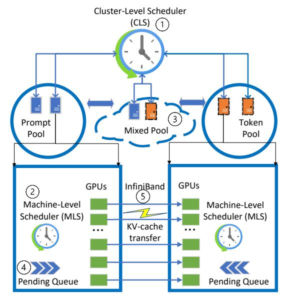
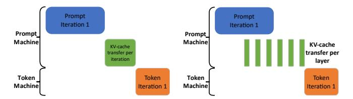

# A. Cluster-level scheduling

**Machine pool management.** The CLS maintains the prompt, token, and mixed machine pools (3). Splitwise initially assigns

Fig. 10: High-level system diagram of Splitwise.

machines to the prompt or token pool depending on the expected request load and input/output token distributions. Machines from the prompt or token pools may be dynamically moved into and out of the mixed pool to reduce fragmentation and meet SLOs at higher loads. A machine in the mixed pool retains its identity as a prompt or token machine and goes back to its original pool once there are no tasks of the opposite kind in its pending queue. Switching pools does not incur any noticeable latency. If the load distribution deviates considerably from initial assumptions, Splitwise employs a coarse grained *re-purposing of machines* and moves machines between the prompt and token pools. Re-purposing of machines is done infrequently, typically only if they stay in the mixed pool for a considerable amount of time.

Request routing. CLS uses Join the Shortest Queue (JSQ) scheduling [39], [85] to assign a prompt and a token machine to each request. Queue lengths are defined by the number of pending tokens. Each machine regularly communicates to the CLS changes in its memory capacity or pending queue. Note that this does not happen at every iteration boundary. We simultaneously assign both the prompt and token machine when scheduling requests, since we can then overlap KV-cache transfers with prompt computation to reduce transfer overheads (Section IV-C).

When routing requests, if the pending queue is bigger than a certain threshold, the CLS looks for target machines in the mixed pool. If the mixed pool is also full, it proceeds to look in the opposite pool (*i.e.*, a token machine to run prompts and vice versa) and moves the machine into the mixed pool. Machines in the mixed pool operate exactly as a non-Splitwise machine would, with mixed batching. Once the queue of mixed requests is drained, the CLS transitions the machine back to its original pool. For example, when the queue is too long, we can move a prompt machine to the mixed pool to run tokens;

(a) Serialized KV-cache transfer. (b) Optimized KV-cache transfer per-layer during prompt phase.

Fig. 11: Optimizing KV-cache transfer in Splitwise.

once the machine is done running tokens, we transition the machine back into the prompt pool.

