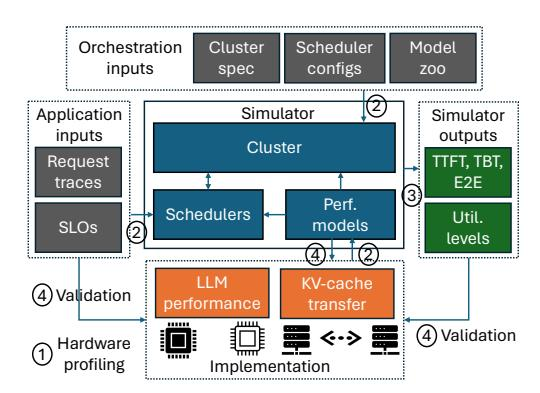

# A. Experimental setup

To evaluate our proposal on real hardware, we implement Splitwise's KV-cache transfer mechanism on top of vLLM [51]. Our implementation is open source [1]. We run this modified vLLM on two DGX-A100 and two DGX-H10 virtual machines (VMs) on Microsoft Azure with specifications from Table I. These are the VMs used to collect the characterization data in Section III. These machines are connected with InfiniBand and the DGX-H100s have double the bandwidth (*i.e.*, 400 Gbps).

Since vanilla vLLM only supports continuous batching with token preemption which can lead to much higher TBT, we implement state-of-the-art mixed continuous batching [81] as discussed earlier in Figure 2(c).

Fig. 13: Overview of the design of the Splitwise simulator.

Our implementation of the Splitwise technique assigns machines either a prompt role, or a token role. As the prompt machine generates the first token, it transfers the KV-cache to the token machine using the technique described in Section IV-C. We use MSCCL++ [11], an optimized GPU-driven communication library, to implement the naive and layer-wise KV cache transfers.

In our implementation, the prompt machine uses the zero-copy one-sided put primitive of MSCCL++ to send KV-cache data over InfiniBand as soon as it is ready, without requiring the token machine to issue any receive instructions. Once we have issued a put for all layers, the prompt machine signals a semaphore that the token machine waits on. The synchronization done with the help of semaphores uses the same InfiniBand connection used to send KV-cache data. When processing a batch of prompts, each request is assigned a different semaphore since it may be routed to different token machines. We ship the KV-caches block-by-block in vLLM. To minimize the number of transfers, we also consider the contiguity of KV blocks as long as they use the same semaphore.

