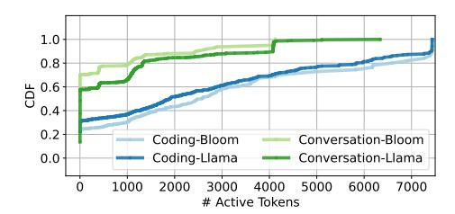
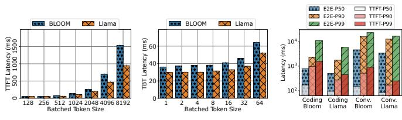
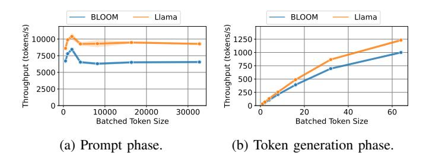
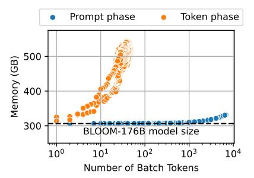

# *A. Number of prompt and generated tokens*

To better understand our traces, we examine the distribution of the number of *prompt input* and *generated output* tokens. Figure 3a shows the distribution of number of prompt tokens. Since the coding LLM inference service is generally used to generate completions as the user is writing code, its input prompt can include large chunks of the code written so far. Thus, it has a large median prompt size of 1500 tokens. On the other hand, the conversation service has a wider range of input prompt tokens since it depends on the user. The median number of prompt tokens for this trace is 1020 tokens.

Figure 3b shows the distribution of the number of generated tokens. Since the coding service typically only generates the next few words in the program as the user types, the median number of output token is 13 tokens. On the other hand, the conversation service has an almost bimodal distribution, with a median of 129 tokens generated.

*Insight I:* Different inference services may have widely different prompt and token distributions.

Fig. 4: Cumulative distribution of time spent with various active batched tokens.

(a) TTFT by prompt(b) TBT by batch size.(c) Latencies on prod size. traces (no batching).

Fig. 5: TTFT, TBT, and E2E for BLOOM-176B and Llama-70B on DGX-H100.

#### B. Batch utilization

To understand how much can these requests be batched, we measure how often machines run at a given batch size. We use mixed continuous batching as shown in Figure 2. To fit into a single machine, we run a scaled-down version of the coding and conversation traces with 2 requests per second.

Figure 4 shows the distribution of the time spent by the machine running various number of active tokens in a batch. Note that if a prompt of 100 tokens is running in its prompt phase, we count the active tokens as 100. However, once the request is in the token phase, we count it as one active token, since the tokens are generated one at a time (assuming a beam search size of one [51]). We find that most of the time (60–70%) for conversation is spent running only 20 tokens or fewer. Since the coding service has very few output tokens, it experiences even worse batching in the token phase and runs with a single token for more than 20% of the time. Both the LLMs show very similar trends.

*Insight II:* Mixed continuous batching spends most of the time with very few active tokens batched.

#### C. Latency

**TTFT.** Figure 5a shows the impact of the number of prompt tokens on TTFT. The range of sizes was chosen based on the coding and conversation traces. We find that TTFT for both models grows almost linearly as the prompt size increases. This behavior is due to the prompt phase having high GPU utilization and being computationally bound.

**TBT.** Figure 5b shows the impact of forcefully batching the output tokens of different requests together on the TBT. We observe very little impact on TBT as the batch size grows. With a batch size of 64, there is only  $2 \times$  impact on TBT.

Fig. 6: Impact of batching on the throughput for the 2 LLMs.

Fig. 7: Required memory with batching in prompt/token phases.

**E2E.** Figure 5c shows various percentiles of E2E latency for both models, with no batching. The variability between the request input and output sizes is apparent. Furthermore, we see that most of the E2E time is spent running the token phase. This holds true even for the coding trace, where prompt sizes are large and generated tokens few. In fact, we find that for BLOOM-176B, a prompt phase with 1500 input tokens takes the same time as token phase with only 6 output tokens.

*Insight III:* For most requests, the majority of the E2E time is spent in the token generation phase.

