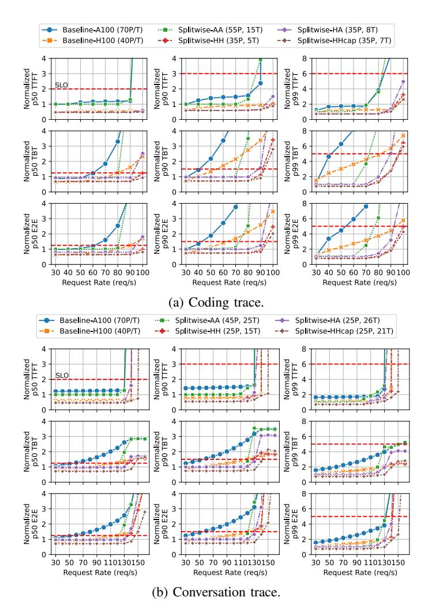
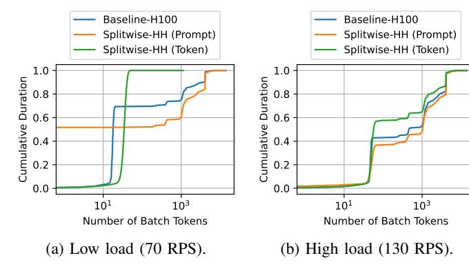
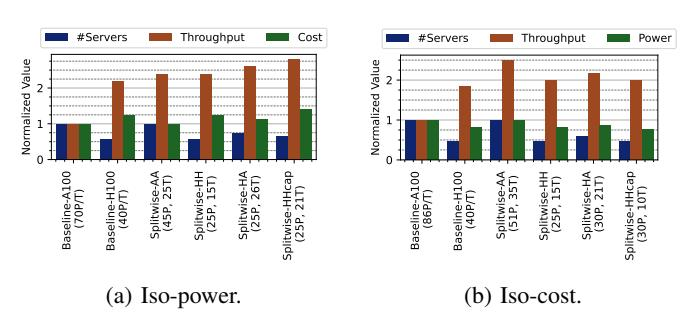

# *C. Other cluster optimizations*

We have described *iso-power throughput-optimized clusters* in detail. For the rest of the cluster optimization evaluation, we only discuss the summary plots.

Fig. 16: Latency metrics across input loads for iso-power throughput optimized clusters. Dashed red lines indicate SLO.

Iso-cost throughput-optimized. Figure 18b shows the summary plot for iso-cost clusters, with their space, throughput, and power requirements. We find that Splitwise-AA provides the best throughput for the same cost, namely 1.4× more throughput than Baseline-H100, running at 25% more power, and 2× the space. This is an interesting operational point for most customers who may not care about power and space, instead preferring the 40% higher throughput using older, more easily available GPUs. In contrast, the preferable choice for the CSP is less clear.

Iso-throughput power-optimized. Figure 19a shows cluster designs that yield same throughput at the least power. Splitwise-HHcap can achieve the same throughput as Baseline-H100 at 25% lower power at the same cost and space. This can be a clear win for the CSPs.

Iso-throughput cost-optimized. Figure 19b shows the costoptimized versions of the iso-throughput design. Note that there are no changes to any of the homogeneous designs between Figures 19a and 19b. This is because the prompt and token machines have the same cost and power. However, Splitwise-

Fig. 17: Cumulative distribution of time spent at various batched token sizes for iso-power throughput-optimized design.

Fig. 18: Summary of throughput-optimized cluster designs.

HA and Splitwise-HHcap arrive at slightly different results with the cost and power optimizations. Figure 19b shows that with Splitwise-AA, customers can achieve the same throughput as Baseline-H100 at 25% lower cost.

