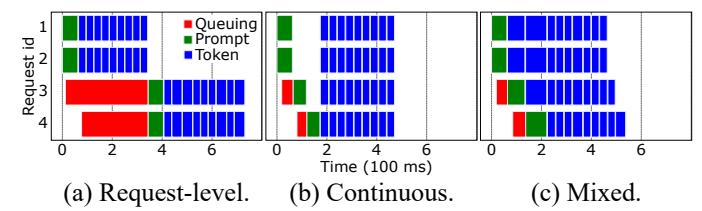

# D. Batching of requests

Inference requests can be batched together for higher throughput. Several prior works have explored batching [23], [81]. Figure 2 shows the timelines for inference with three common batching mechanisms. The default mechanism only batches at the request-level (Figure 2(a)). In this case, ready requests are batched together, but all the forward passes for these requests are completed before any other requests are run. Since requests can have long token generation phases, this can lead to long wait times for requests arriving in between, causing high TTFT and high E2E latencies. An optimization is continuous batching [81] (Figure 2(b)). In this case, scheduling decisions are made before each forward pass of the model. However, any given batch comprises either only of requests in their prompt phase or only requests in token phase. Prompt phase is considered more important since it impacts TTFT. Hence, a waiting prompt can preempt a token phase. Although this leads to shorter TTFT, it can substantially increase the tail

Fig. 2: Batching mechanisms and their latency impact on the prompt and token phases.

for TBT, and therefore the E2E latency. Finally, there is *mixed batching* (Figure 2(c)) [23]. With this batching, the scheduling decisions are made at each forward pass, and the prompt and token phases can run together. This reduces the impact on TBT, but does not eliminate it, since token phases scheduled with prompt phases will experience a longer runtime. In the rest of the paper, we use mixed batching unless stated otherwise.

