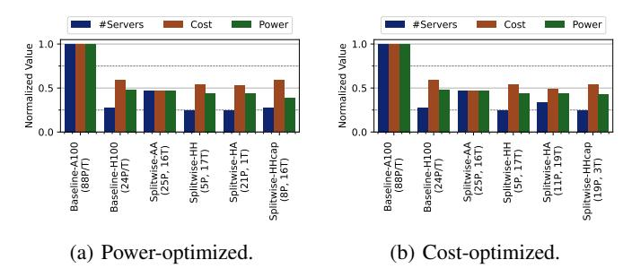
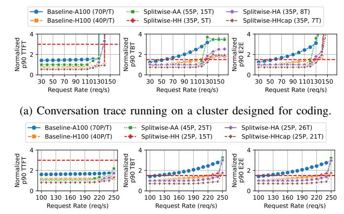

# D. Impact of workload changes

So far, we have tested a trace and a model on clusters optimized for a specific workload pattern and model. To test the Splitwise' robustness, we now run conversation trace on a cluster meant for coding service, and Llama-70B on a cluster meant for BLOOM-176B. Figure 20 shows these results for iso-power throughput-optimized clusters.

Changing workload trace. Compared to Figure 16b, we find that in Figure 20a, the Baseline clusters are similarly sized and incur no throughput or latency impact. Splitwise-AA and Splitwise-HH with the mixed pool morph well to meet the requirements of the new workload, and they see no throughput or latency impact. Since Splitwise-HA and Splitwise-HHcap have different types of machines in the prompt and token pools, they experience a throughput setback of 7% from the respective cluster optimized designs for conversation trace. Note that all the Splitwise designs still perform much better than any of the Baseline designs.

Changing model. Figure 20b shows that Llama-70B can support much higher throughput in the same cluster design than BLOOM-176B, given its fewer parameters (Table III). All the Splitwise designs out-perform both the Baseline designs at higher load. Furthermore, Splitwise-HH and Splitwise-HHcap consistently achieve the best latency, even as the load increases.

Fig. 19: Summary of iso-throughput cluster designs.

(b) Llama-70B, on a cluster designed for BLOOM-176B.

Fig. 20: Latency impact of running a workload on a cluster designed for another workload. Dashed red lines indicate SLO.

**Summary.** Based on these two experiments, we conclude that Splitwise can morph according to the requirements of the workload using its smart scheduling, and it is robust to changes in the LLMs, request load, and token distributions.

#### E. Cluster design for batch job

We design various clusters with Splitwise under strict latency SLOs, even when we are optimizing for throughput. This is unnecessary for batch jobs, which can be stressed to high load for a high token generation throughput. We find that upon stressing our iso-power throughput-optimized clusters, Baseline-A100 and Splitwise-AA have the best throughput per cost at 0.89 RPS/\$. At high load, Splitwise devolves into the iso-count Baseline, since it starts mixed batching with all the machines in the mixed pool. The same holds true for Splitwise-HH and Baseline-H100, which achieve 0.75 RPS/\$.

#### VII. DISCUSSION

**Extensibility to new models.** Despite the plethora of model sizes from 2B parameters [47], [84] to 176B parameters [69] or more [18], all modern transformer-based generative LLMs have the distinct prompt processing and token generation phases. Similarly, even modifications and flavors like Mixture-of-Experts (MoEs) have these phases. Since Splitwise is built solely by exploiting these phases, it is applicable to all of the

current and upcoming LLMs, as long as the auto-regressive nature of the workload requires these two phases. Note that as shown in Section VI-D, clusters provisioned with Splitwise for one model can also efficiently serve other models.

Alternative compute hardware. In this work, we use NVIDIA H100 and A100 GPUs since they are commonly used for LLM inference in datacenters today [17]. Smaller datacenter GPUs like NVIDIA T4 lack enough memory to run modern LLMs efficiently. In general, our methodology is applicable to any hardware (including CPUs, FPGAs, ASICs [33]) that aligns with the computational requirements of prompt and token phases. Our characterization suggests that prompt phases need high compute capability and memory bandwidth with low memory capacity, whereas token phases need moderate compute capability with high memory capacity and bandwidth. Thus, GPUs like AMD MI-250 [2] and CPUs like Intel Sapphire-Rapids (with HBM) [9] could be effective token machines. Since we do not have access to such hardware and/or optimized LLM implementations, we leave this to future work.

Interconnect between prompt and token machines. In this work, we assume Infiniband connection between the prompt and token machines in all the designs (albeit, lower bandwidth when A100s were involved). Although this is common for all homogenous machines, Splitwise-HA is not be readily available with an Infiniband connection between H100s and A100s, even though technically feasible. The alternative could be HPC clouds, with Infiniband connections through the CPU [3], or Ethernet, using RoCE [58]. Given our optimized KV-cache transfer that helps reduce critical latency, an interconnect with 10× lower bandwidth would likely still be beneficial. To further reduce our bandwidth utilization, we could also compress the KV-cache before transferring it across the network [55].

Heterogeneous prompt/token machines. Although Splitwise is robust to varied models and input traces, we recognize that fragmenting a data center with different types of GPUs (*e.g.*, Splitwise-HA) may bring its own challenges for the CSP.

Conversation back and forth. Chat APIs for LLMs today require the user to send the complete context of the conversation so far [18]. However, in the future, services may have enough GPU capacity to cache the context and avoid recomputation. This could sway the memory utilization pattern of the prompt phase from our characterization. Furthermore, it may require transferring the KV-cache back to a prompt machine to be ready for the next conversation request.

