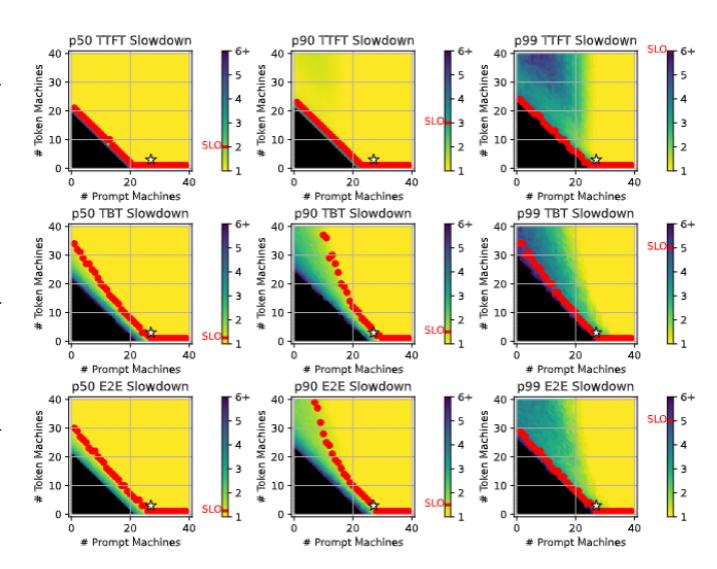

# *D. Provisioning with Splitwise*

We leverage Splitwise to optimize LLM inference cluster deployments for power, cost, and throughput.

Type of machines. We propose four main variants of Splitwisebased systems: *Splitwise-AA*, *Splitwise-HH*, *Splitwise-HA*, and *Splitwise-HHcap*. The nomenclature is simply drawn from the first letter representing the Prompt machine type, and the second letter representing the Token machine type. "A" represents a DGX-A100 machine, "H" represents a DGX-H100 machine, and "Hcap" represents a power-capped DGX-H100 machine. Table V shows a summary of the cost, power, and hardware in each of our evaluated systems.

Splitwise-AA uses DGX-A100 for both prompt and token pools, while Splitwise-HH uses DGX-H100 for both. These two variants represent the commonly available setups in providers where machines are homogeneous and interchangeable.

Splitwise-HA uses DGX-H100 for the prompt pool and DGX-A100 for the token pool. We choose this configuration based on Table IV, and the Insight VII (*i.e.*, A100s can be more cost- and power-efficient for the token phase).

Splitwise-HHcap uses DGX-H100 machines for both prompt and token pools. However, we power cap the token machines down to 70% of their rated power, with each GPU capped by

Fig. 12: Design space for provisioning a Splitwise-HH cluster. Cluster configurations targets a peak throughput of 70 RPS. The cost-optimal Splitwise-HH configuration is marked with ⋆ (27 prompt and 3 token machines).

50% of the power. We propose this design based on Figure 9 and Insight VII (*i.e.*, the prompts phase is impacted by power caps while token has no performance impact with 50% lower power cap per GPU).

Number of machines. The LLM inference cluster deployment must be sized with the appropriate number of prompt and token machines. Our methodology involves searching the design space using our event-driven cluster simulator, which is described in detail in Section V. We need to provide as input: (1) the target cluster design (*e.g.*, Splitwise-HA or Splitwise-HHcap), (2) an LLM-specific performance model that can estimate the TTFT and TBT at various input, output, and batch sizes, (3) a short trace derived from the target prompt and token size distributions for the service (*e.g.*, Figure 3), (4) the SLOs (*e.g.*, Table VI), (5) the constraints (*e.g.*, throughput), and (6) the optimization goal (*e.g.*, minimize cost). Using this information, our provisioning framework searches the space for the desired optimal point. For example, searching with a throughput constraint and a cost minimization goal gives us iso-throughput cost-optimized clusters across different designs.

Search space. Figure 12 shows an example of the twodimensional search space for the number of prompt and token machines under Splitwise-HH for the coding workload (using a 2-minute trace). The simulator outputs the various percentiles for TTFT, TBT, and E2E latencies. Then, we select the clusters that meet the SLOs for each of these metrics and optimize our target function. For example, Figure 12 shows a ⋆ for the setup with 27 prompt and 3 token machines with the lowest cost that achieves 70 RPS. We call this setup *iso-throughput cost-optimized*.

Optimization. We can use three optimization goals: *throughput*, *cost*, and *power*. Throughput optimization is important for both,

|                 | Prompt Machine |               | Token Machine |          |              | Prompt-Token |                        |
|-----------------|----------------|---------------|---------------|----------|--------------|--------------|------------------------|
|                 | Type           | Cost          | Power         | Type     | Cost         | Power        | Interconnect Bandwidth |
| Splitwise-AA    | DGX-A100       | 1×            | 1×            | DGX-A100 | 1×           | 1×           | 1×                     |
| Splitwise-HH    | DGX-H100       | $2.35 \times$ | 1.75×         | DGX-H100 | $2.5 \times$ | 1.75×        | 2×                     |
| Splitwise-HHcap | DGX-H100       | $2.35 \times$ | 1.75×         | DGX-H100 | $2.5 \times$ | 1.23×        | 2×                     |
| Splitwise-HA    | DGX-H100       | 2.35×         | 1.75×         | DGX-A100 | $1 \times$   | $1 \times$   | 1×                     |

TABLE V: Evaluated Splitwise designs all normalized to DGX-A100

the cloud service provider (CSP) and the user. Cost optimization has different importance levels to the CSP and the user. For the CSP, a higher cost for the same throughput might be acceptable if there are gains in power and space requirements for the cluster. However, for the end-user, a higher cost at the same throughput is generally unacceptable. Finally, power optimization is attractive for a CSP, since it enables more GPUs to be deployed in the same datacenter [62], [63], but it may not be as important to the user. We only consider the provisioned power, and not the dynamic power utilization, in our study.

