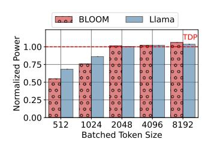
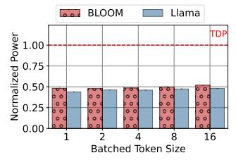
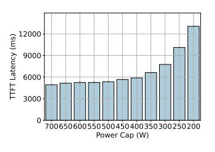
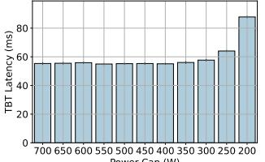

# E. Memory utilization

During an LLM inference, the GPU memory is used to host the model weights and activations, as well as the KV caches (Section II-B). As the number of tokens in a batch increase, the memory capacity required for the KV cache also increases. Figure 7 shows the memory capacity utilization during each phase as the number of tokens in the batch increases. During the prompt phase, the input prompt tokens generate the KV

- (a) Prompt phase.
- (b) Token generation phase.

Fig. 8: Maximum and mean power utilization varying the batching size.

- (a) Prompt phase.
- (b) Token generation phase.

Fig. 9: Impact of power cap on the prompt and token generation latency with the maximum batch size possible.

cache. During the output token phase, *each* active generated token that is being processed accesses the KV cache of its *entire context* so far.

*Insight V:* Batching during the prompt phase is compute-bound, whereas the token phase is limited by memory capacity.

## F. Power utilization

When hosting machines, cloud providers need to consider the peak power draw, which has direct impact in the datacenter cost [26]. This is especially important when building GPU clusters, since GPUs consume much higher power than regular compute machines [63], [64]. Figure 8 shows the GPU power draw normalized to the thermal design power (TDP) when running prompt and token generation phases. Since the the prompt phase is compute intensive, its power draw increases with batch size. On the other hand, the token phase is memory bound and its power draw does not vary when increasing the number of tokens to process.

Providers can cap the power usage of the machines to reduce the peak power. Figure 9 shows the impact to latency when increasing the power caps for both prompt and token phases. The prompt phase is highly sensitive to the power cap and the latency increases substantially. On the other hand, the token generation phase incurs almost no latency impact when power capping by over 50% (*i.e.*, 700 to 350W).

*Insight VI:* While the prompt phase utilizes the power budget of the GPU efficiently, the token phase does not.

