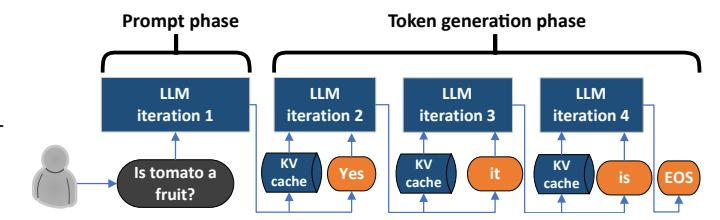

# II. BACKGROUND

#### A. Large Language Models

Modern LLMs are based on transformers. Transformer models use attention [77] and multi-layer-perceptron layers to understand the inputs and generate an output, respectively. Transformer-based LLMs include encoder-only [36], [54], decoder-only [67], [69], [71], and encoder-decoder [70] models. Generative LLMs, the focus of this paper, are usually either decoder-only, or encoder-decoder models.

## B. Generative LLM inference phases

Figure 1 shows an example of generative LLM inference. Once the prompt query is received, all the input tokens are computed in parallel, within a single iteration, to generate the first token. We call this the prompt processing phase. The context generated from the attention layers during the prompt computation is saved in the key-value (KV) cache, since it

Fig. 1: An LLM inference example.

| Metric                                                                              | Importance to user                                                                                               |  |  |
|-------------------------------------------------------------------------------------|------------------------------------------------------------------------------------------------------------------|--|--|
| End-to-end (E2E) latency Time to first token (TTFT) Time between tokens (TBT) | Total query time that the user sees How quickly user sees initial response Average token streaming latency |  |  |
| Throughput                                                                          | Requests per second                                                                                              |  |  |

TABLE II: Performance metrics for LLMs.

is needed for all the future token generation iterations. After the first token is generated, the following tokens only use the last generated token and the KV-cache as inputs to the forward pass of the model. This makes the subsequent token generation more memory bandwidth and capacity intensive than the computationally heavy prompt phase.

#### C. Performance metrics for LLMs

Prior work has proposed three main metrics for LLM inference: end-to-end (E2E) latency, time to first token (TTFT), and throughput. We add another latency metric: time between tokens (TBT), to track the online streaming throughput of the tokens as they are generated serially. Table II summarizes the key performance metrics that we consider in this work.

Generative LLMs may be used for a variety of tasks with different kinds of SLOs. For batch tasks (*e.g.*, summarization), TTFT or TBT latency metrics are less important than throughput. On the other hand, for latency-sensitive tasks (*e.g.*, conversational APIs), TTFT and TBT are the more important metrics with tighter SLOs.

