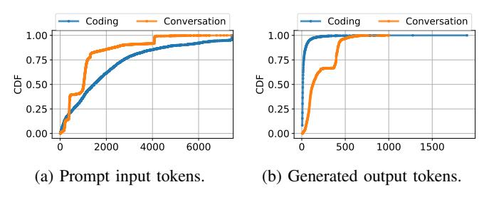

# III. CHARACTERIZATION

In this section, we explore the performance and utilization characteristics of LLM inference and draw key insights to guide the design of Splitwise.

Production traces. We use production traces taken from two Azure LLM inference services on November 11th 2023. Our traces represent the most common scenarios in LLM inference today: *coding* and *conversation*. We have released a subset of our traces at https://github.com/Azure/AzurePublicDataset [4]. The traces we use for characterization are 20 minutes long and include the arrival time, input size (number of prompt tokens),

| Model      | #Layers | Hidden size | #Heads |  |
|------------|---------|-------------|--------|--|
| Llama2-70B | 80      | 8192        | 32     |  |
| BLOOM-176B | 70      | 14336       | 112    |  |

TABLE III: Models we evaluate and their parameters.

Fig. 3: Distribution for prompt and generated tokens.

and output size (number of output tokens). Due to customer privacy requirements (*e.g.*, GDPR), we do not have visibility into the content of the prompts. We instead use the production traces to guide the input and output sizes, where we send the input prompt with the required number of tokens, and force the model to generate the corresponding number of output tokens for each request. Note that the text of the inputs prompts does not impact the performance metrics that we benchmark, since they depend only on the input and output sizes. For this characterization, we do not reuse the KV-cache between requests to emulate a cloud service with security guarantees.

Models. Table III shows the models that we evaluate. Both BLOOM [69] and Llama2 [71] are state-of-the-art open source LLMs. Both models are decoder-only, transformer-based models. We use the version of each model with the most parameters, since these versions are the most representative for production-class accuracy. Unless stated otherwise, we run BLOOM-176B and Llama-70B on vLLM [51] on a machine with 8 H100 [16] GPUs.

