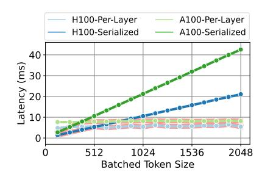
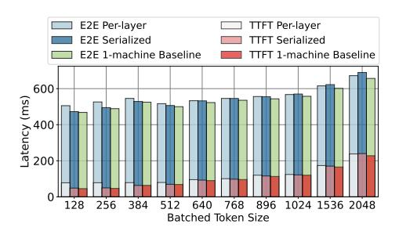

# VI. EVALUATION

## A. Experimental results

**KV-cache transfer latency.** We first measure the latency to transfer the KV-cache as the prompt size grows. Figure 14 shows the visible transfer latency on both A100 and H100 setups with the naive and optimized transfer design as discussed in Figure 11. Compared to the prompt computation time, the overhead is minimal (< 7%). The time for serialized transfers linearly increases with the prompt size since the size of the KV-cache also increases. The optimized per-layer transfer, on the other hand, hides much of the latency. For these transfers, we see a constant non-overlapped transfer time of around 8ms for the A100 and around 5ms for the H100 setup. The H100

Fig. 14: Overhead of the KV-cache transfer as the prompt size increases on A100s and H100s.

Fig. 15: Overhead of KV cache transfer on TTFT, E2E latency for coding trace for A100 and H100.

setup has double the bandwidth of the A100 setup (*i.e.*, 200 vs 400 Gbps), and the impact of this can be clearly seen with transfers in the H100 setup happening about twice as fast as those in the A100 setup.

As discussed in Section IV-C, for small prompt sizes (< 512 in H100), Splitwise uses the serialized KV-cache transfer and for larger prompts, it uses per-layer transfers.

**End-to-end impact.** Next, we run the coding trace on the 2-machine Splitwise setups without batching, and compare the observed latency metrics to a 1-machine baseline setup with no batching. Figure 15 shows our results. The latency impact of serially transferring the KV-cache grows up to 3% of the E2E with large prompts. However, Splitwise only incurs 0.8% of E2E. In a user-facing inference, the only visible impact of KV-cache transfer overhead is the latency for the second token. Splitwise adds a 16.5% latency to the second token, as compared to the 64% overhead from a serialized transfer. Overall, the transfer impact in Splitwise is hardly perceivable even in a user-facing inference.

