# Cambricon-D: Full-Network Differential Acceleration for Diffusion Models

Weihao Kong SKLP, ICT, CAS **UCAS** Beijing, China

Yifan Hao SKLP, ICT, CAS Beijing, China haoyifan@ict.ac.cn

Qi Guo\* SKLP, ICT, CAS Beijing, China guoqi@ict.ac.cn

Yongwei Zhao SKLP, ICT, CAS Beijing, China zhaoyongwei@ict.ac.cn

Xinkai Song SKLP, ICT, CAS Beijing, China songxinkai@ict.ac.cn

kongweihao21b@ict.ac.cn

Xiaqing Li SKLP, ICT, CAS Beijing, China lixiaqing@ict.ac.cn zoumo@ict.ac.cn duzidong@ict.ac.cn zhangrui@ict.ac.cn liuchang18s@ict.ac.cn wenyuanbo@ict.ac.cn

Mo Zou SKLP, ICT, CAS Beijing, China

Zidong Du SKLP, ICT, CAS Beijing, China

Rui Zhang SKLP, ICT, CAS Beijing, China

Chang Liu Cambricon Beijing, China

Yuanbo Wen SKLP, ICT, CAS Beijing, China

Pengwei Jin SKLP, ICT, CAS **UCAS** Beijing, China jinpengwei20z@ict.ac.cn

Xing Hu SKLP, ICT, CAS Beijing, China huxing@ict.ac.cn

Wei Li SKLP, ICT, CAS Beijing, China liwei2017@ict.ac.cn

Zhiwei Xu SKLP, ICT, CAS UCASBeijing, China zxu@ict.ac.cn

Tianshi Chen Cambricon Beijing, China tchen@cambricon.com

Abstract—Diffusion models have made significant progress in current image generation tasks, thus becoming a prominent area of research. Diffusion models necessitate repetitive iterations on minimally altered input data across timesteps, each timestep requiring the recalculation of the entire model, resulting in a remarkable computational redundancy and substantial hardware expenditures.

Performing differential computing on input data seems to be a feasible approach for addressing such computational redundancy and improving hardware efficacy. However, non-linear operations (particularly activation functions) necessitate the merging of deltas (i.e., differential values) with raw inputs repeatedly to ensure computational correctness, leading to significant memory access for loading raw inputs, which fragmentedly blocks the forwarding of deltas throughout the network and undermines performance.

To solve this problem, we propose Cambricon-D, a fullnetwork differential computing architecture with concise memory access. While maintaining the computational efficiency brought by differential computing, Cambricon-D employs a sign-mask dataflow, which requires only the loading of 1-bit signs (instead of large bitwidth raw inputs), thereby facilitating the seamless forwarding of deltas and effectively mitigating memory access overheads. Experimental results show that, compared to Diffy, Cambricon-D's dataflow reduces  $66\% \sim 82\%$  off-chip memory access. In total, Cambricon-D achieves  $1.46 \times \sim 2.38 \times$  speedup over A100 on various diffusion models with different resolutions.

Index Terms—Diffusion Models, Machine Learning, Computer Architecture

## I. Introduction

Diffusion models, such as Stable-Diffusion [18], OpenAI Sora [2], DALL-E 2 [17], have made significant progress in

\*Corresponding Author

current image generation tasks (e.g., generation, inpainting, and super-resolution [18]) . The fundamental characteristic of diffusion models is the iterative computational process, where the entire model needs to be repeatedly calculated on slightly altered input data (e.g., images) across timesteps. Due to such numerical similarity of input data, only a small fraction of the information are actually different between two adjacent iterations (i.e. timesteps), the rest being recalculations. Therefore, the iterative process of diffusion models implies a remarkable computational redundancy, introducing low hardware efficiency.

To eliminate the computational redundancy caused by similar inputs in the iterative computing of diffusion models, differential computing [15] seems to be promising, as it attempts to focus the computation on these input variations (aka. deltas). Differential computing can significantly improve computational efficiency by leveraging the narrower data range of deltas (compared to raw input), enabling their representation with fewer bits and subsequently simplifying the circuitry in computational components. For instance, consider the distribution of an example layer's activations as shown in Fig. 1 (a). In contrast to raw inputs represented by FP16, deltas are predominantly confined within a narrow interval, allowing them to be represented by INT3. As a result, the information entropy reduces 2.11× (3.37 vs. 1.60). Entropy decreases like these are the major reason behind the reduction in the arithmetic cost of  $3.3 \times$  (shown in Fig. 1 (b)).

However, counter-intuitively, more streamlined arithmetic resulted the overall performance declining by 23.4% when using differential computing. As shown in Fig. 1 (c), the main reason for the performance loss is the significant increase (i.e.,  $5.78\times$ ) of memory accesses. Specifically, in each timestep, when encountering non-linear operations (especially activation functions), the forwarding of deltas will be blocked (i.e.,  $delta_{out}^t \neq f_{non-linear}(delta_{in}^t)$ ). Thus deltas need to be merged and accumulated with raw inputs (i.e.,  $raw_{out}^t = f_{non-linear}(raw_{in}^{t-1} + delta_{in}^t)$ ), requiring the loading of large bit-width raw inputs repeatedly into on-chip processing elements (PEs), resulting in large extra memory access.

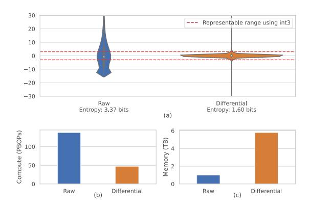

Fig. 1: (a) Distributions and entropy of raw and delta input values for a typical layer. Raw activations often fall outside quantizable range. (b) Execution time reduction from using differential computing compared to raw valued computing. (c) Memory traffic overhead from differential computing compared to raw valued computing.

To solve this problem, we propose Cambricon-D, an efficient differential-based diffusion accelerator with minimal memory access overheads, while maintaining the streamlined arithmetic when exploiting differential computing. Cambricon-D utilizes a sign-mask dataflow, which ensures a *full-network* differential computing, avoiding being blocked by non-linear operations fragmentedly. Specifically, in the iterative process of diffusion models, the sign-mask dataflow guarantees the computational correctness of non-linear activation functions (e.g., ReLU) by loading only 1-bit signs (rather than large bitwidth raw inputs), thus significantly reducing memory access overhead. Moreover, Cambricon-D employs an outlier-aware processing element (PE) array to efficiently handle outlier deltas. Specifically, each PE handles a group of deltas, which normally consists of INT3 inliers, but each PE also has a predefined maximum capacity to handle outliers, and subsequent outliers are ignored. This design avoids the usual pitfalls of outlier-aware architectures, where they either have to use complex crossbars to globally gather outliers (as opposed to this group-local design), or have high synchronization overheads due to the unpredictability of outlier computations, or both, at an acceptable cost in precision.

We conduct detailed experiments to evaluate Cambricon-D on diffusion models [5], [18] of various resolutions, trained through typical datasets (i.e., LAION, [20] ImageNet [4]

and LSUN [28]. Experimental results show that Cambricon-D reduces  $66\% \sim 82\%$  memory access over Diffy [15], a state-of-the-art differential computing accelerator. This in turn allows Cambricon-D, with throught equivalent to an A100 GPU [3], to achieve  $1.46\times \sim 2.38\times$  speedup over A100, at the area overhead of only 3.6%.

The main contributions of this paper are as follows:

- We uncover that differential computing is beneficial for diffusion models due to their iterative nature, and also found that differential computing cannot be exploited directly, due to memory overheads caused by non-linear operations (especially activation functions) blocking deltas forwarding segmentedly.
- 2) We propose a sign-mask dataflow, which achieves an efficient *full-network* differential computation, significantly reducing the aforementioned memory access overhead.
- 3) We propose an outlier-aware PE array, where FP16 outlier deltas and INT3 inlier deltas are calculated in a regular and synchronized manner, achieving overall 1.2x~1.9x speedup compared to a traditional asynchronous outlier-aware design with the same enhanced dataflow.
- 4) We propose and experimentally evaluate Cambricon-D, which implements all of the above proposals.

#### II. BACKGROUND

In this section, we provide an overview of the diffusion model, the principles behind differential computing, and why it leads to considerable memory overhead.

## A. Diffusion Models

Diffusion models are a new class of machine learning algorithms that have shown superior performance in generative tasks, particularly in tasks like image generation, superresolution, and inpainting [10], [18].

As shown in Fig. 2, diffusion models consist of two main processes: the forward diffusion process and the reverse denoising process. Here we focus on the backward process, as the forward diffusion process is primarily related to training and falls outside the scope of this paper. Essentially, a diffusion model acts as a denoising model, taking an image as input and predicting an image with slightly less noise (one step from right to left in Fig. 2). Each denoising step is called a timestep and requires a full run of the underlying network. At the initial stage (rightmost image of Fig. 2), the model receives an input of randomly drawn Gaussian noise. Diffusion models aim to denoise an image out of a complete noise, one small step at a time, gradually reaching an image which fits its training data distribution. This gradual refinement allows diffusion models to achieve better image quality compared to the previous stateof-the-art, such as GANs [5]. However, such an advantage comes at the cost of increased computational complexity, as the same network must be run multiple times to obtain a single output.

The backbone network, run once per every timestep, is typically a U-Net-style design as depicted in Fig. 3, a residual

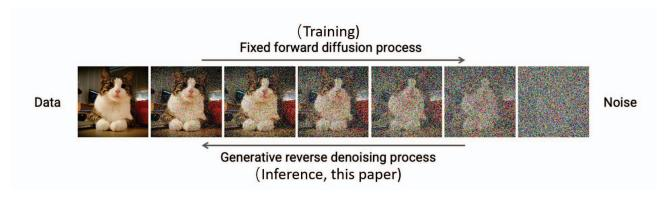

Fig. 2: Illustration of the diffusion process. [13]

convolutional neural network (CNN) with mainly convolutional layers with various resolutions and channel counts. In diffusion models, the output of the network models the noise signal, which is removed to perform a denoising timestep. Within each block, there are mainly convolution layers, SiLU activation functions [6], group normalization layers [27], dropout layers [23], as well as some up-sampling and downsampling layers. Additionally, the architecture may include attention mechanisms [25] and linear layers.

Some models also have guidance mechanisms to guide the model into generating images in a specific image class or fitting a specific text prompt. This is typically done by injecting a signal (from an auxiliary network) into the U-net through e.g. a gradient guidance [5] or cross-attention [18]. They have less computational impact than the U-Net and don't require a special design.

Regarding hardware resource demand, the convolution operator is a crucial component in the U-Net, responsible for approximately 76.4% of the computation time based on our profiling. Thus, accelerating the convolution operator is of significant importance to enhance overall performance.

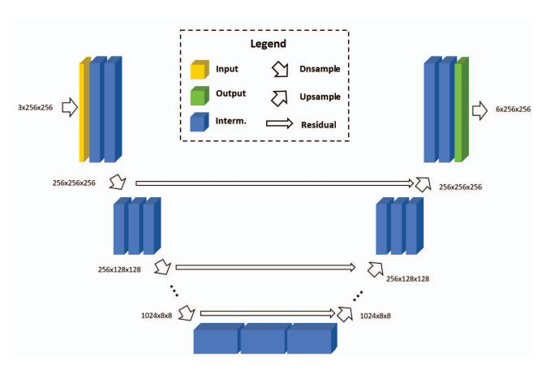

Fig. 3: Illustration of U-Net-style architectures.

#### B. Differential Computing

The key to accelerating diffusion models is their inherent computational redundancy. In the denoising process, each timestep only denoises the image by a small step, causing the U-Net inputs across timesteps to be highly similar, as illustrated in Fig. 4. The delta between the two timesteps in Fig. 4c is very small. The similarity in input implies that the

internal activation values of the entire network are also similar across timesteps. Therefore, one can divide an activation tensor into two parts: a small delta part  $\Delta X_t$  and the data from the last timestep  $X_{t-1}$ . In this way, the activation for the current timestep can be represented as  $X_t = X_{t-1} + \Delta X_t$ , where the delta values  $\Delta X_t$  would be confined to a much smaller numerical range, as shown in Fig. 1. By exploiting this property, we can optimize the computation and significantly accelerate the diffusion models.

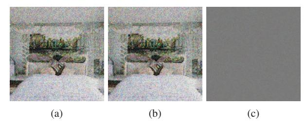

Fig. 4: Example of two images in neighboring timesteps and their delta. Pixels with no difference are grey (128,128,128).

Concretely, one can perform the convolutions on the delta values  $\Delta X_t$  instead of the raw values  $X_t$ . Given that  $\Delta X_t$  has a smaller magnitude, it can be appropriately represented using fixed-point numbers with reduced precision, without increasing the level of quantization error. The reason behind this is that the quantization error, or resolution, only depends on the scale factor s in the quantization  $X_q = \operatorname{round}(\frac{X}{s})$ . Normally, reducing precision is done by increasing s, scaling down the non-quantized values more so they fit in the reduced representable range, at the cost of lowered resolution. However, in this case, reducing precision can be achieved without altering s, as the non-quantized values of  $\Delta X_t$  naturally fit in a smaller range than of  $X_t$ , allowing the resolution, or quantization error, to remain unchanged.

In fact, this idea is not entirely novel, and a similar approach has been explored by Diffy [15]. The procedure is to replace the convolutions  $\operatorname{Conv}(X_t)$  on the raw values  $X_t$  with convolutions on the delta values  $\operatorname{Conv}(\Delta X_t)$ . After this computation, the original result  $\operatorname{Conv}(X_t)$ , if required, can be computed by adding the result of the last timestep t-1, which is  $\operatorname{Conv}(X_t) = \operatorname{Conv}(X_{t-1}) + \operatorname{Conv}(\Delta X)$ . However, it is essential to note that this equality holds true only when the operator, in this case, convolution, satisfies the property of linearity. Since  $\operatorname{Conv}(\Delta X_t)$  is performed on fewer bits, a computational speedup can be achieved.

To draw a simple analogy with scalar multiplication, consider the task of computing the product of 124 and 7, while already knowing the result of multiplying 123 by 7 (123  $\times$  7 = 861). Instead of performing the multiplication directly, one can compute the delta between 124 and 123 (1), multiply it by 7 (1  $\times$  7 = 7, a much simpler operation), and then add it to the known result (861), obtaining 868 as the final result, thus reducing the computation.

Remarks on Spatial Differential: Unlike Diffy [15], which uses spatial differential (deltas over image width), our work

employs temporal differential (deltas over timesteps). This is because intermediate activations of diffusion models are partly noise, which reduces spatial smoothness (see Fig. 4a). Thus, spatial deltas tend to be numerically larger and more dispersed than temporal deltas, as shown in Fig. 5, making temporal differential the more efficient choice.

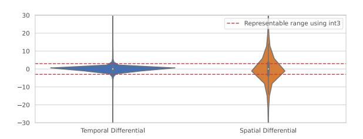

Fig. 5: Distributions of temporal and spatial delta input values for a typical layer.

#### III. MOTIVATION

Unfortunately, while differential computing allows quantization to very low bitwidth, reducing compute times, it would also generate  $5.78\times$  more memory traffic, causing an overall 23.4% performance loss. Such losses are not observed in Diffy [15], as memory is not a major bottleneck in their workloads, unlike diffusion models which is somewhat memory intensive.

This increased memory overhead is due to that differential computing as proposed by Diffy [15] is on a per-operator basis. This would introduce complexities as shown in Fig. 6a, in particular steps 2-4 and 6-8. This dataflow operates for each layer as follows:

- $\bigcirc$  Weights W of the layer is loaded onto the chip.
- ②-④ On-chip input activations  $X_t$  from previous layer t-1 transitions to deltas  $\Delta X_t$  to prepare for differential convolution.
  - ⑤ PE array computes the actual differential convolution on the deltas.
- ⑥-⑧ Output activations  $\Delta Y_t$  transition from deltas back to raw values  $Y_t$  to prepare for activation.
  - The activation is computed on the raw values.

The necessity of steps  $\mathbb{Q}-\mathbb{Q}$  and  $\mathbb{G}-\mathbb{Q}$  comes from the fact that activation functions such as ReLU cannot be performed on differential values, as they are non-linear,  $F(Y+\Delta Y)\neq F(Y)+F(\Delta Y)$ , violating the basis of differential computation. Non-linear activation operations is in fact essential to neural networks' functionality, thus there will always be one or more non-linear operations before and after each linear opeation. Therefore, in a design like Diffy [15], differential computation are only done for the individual convolution operators in a fragmented way, as it cannot be done for other non-linear operators such as the activation functions.

Transitioning from raw activations  $X_t$  to delta activations  $\Delta X_t$  generates additional memory traffic. It must be done in three steps (steps 2-4 in Fig. 6a):

② Fetch the activation  $X_{t-1}$  of the last timestep from the off-chip memory

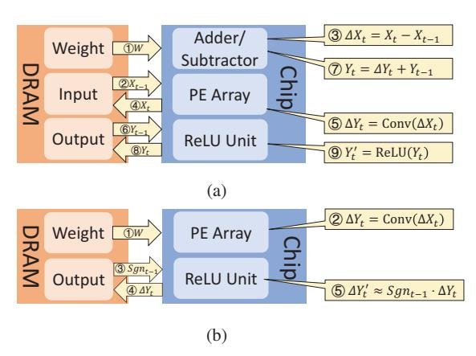

Fig. 6: Comparison of dataflows of Diffy (a) and the sign-mask dataflow of Cambricon-D (b).

- 3 Compute the delta value on-chip as  $\Delta X_t = X_t X_{t-1}$
- 4 Write  $X_t$  to off-chip memory to keep track of it, to be used again in the next timestep t+1

Step 2 and 4 cannot be done by reading the on-chip memory, as doing so would require storing  $X_t$  for all layers on-chip, unlike  $\Delta X_t$  which we only required in the current layer. All the activations of a single U-Net pass would have the size of 1.1GB, which is impractical to store on-chip. The same problem occurs for the transition from delta  $\Delta Y_t$  to raw values  $Y_t$  after the differential computation (steps 6-8 in Fig. 6a), in preparation for other operators such as the activation function (e.g. ReLU). It is for this reason that a significant off-chip memory overhead is introduced.

In summary, an efficient differential-based hardware for diffusion models would have to somehow support calculating most operators—even non-linear activations—in a differential manner. In this paper, we introduce a novel dataflow for Cambricon-D, the sign-mask dataflow, to achieve exactly this.

## IV. DESIGN

In this section, we introduce the key designs and ideas of our work, which primarily comprises of two main components:

1) The sign-mask dataflow that enables differential computation without significant memory overhead, and 2) Further improvements on the PE array design, that can efficiently exploit the data distribution of the delta activations to improve computational efficiency without compromising accuracy.

## A. Sign-Mask Dataflow

As previously discussed with Fig. 6a and in Sec. III, differential computation introduces additional steps with high memory traffic, especially when computing the activation functions. Therefore, we introduce a novel dataflow which we call the sign-mask dataflow, to mitigate this problem.

The fundamental reason for the memory intensity of the dataflow of Fig. 6a, is that it attempts to compute the ReLU activation function in the realm of the wider raw inputs. Sign-mask dataflow attempts to compute the ReLU function using the narrower delta values, despite the non-linearity of the

function. ReLU, as defined in Eq. 1, can be demonstrated as being non-linear in Eq. 2, making differential computing complicated.

$$\operatorname{ReLU}(Y_t) = \begin{cases} 0, & \text{if } Y_t < 0 \\ Y_t, & \text{if } Y_t \ge 0 \end{cases} = Y_t \cdot \operatorname{sgn}(Y_t) \tag{1}$$

$$\Delta Y_t' = \text{ReLU}(Y_t) - \text{ReLU}(Y_{t-1})$$
  
=  $Y_t \cdot \text{sgn}(Y_t) - Y_{t-1} \cdot \text{sgn}(Y_{t-1})$  (2)

$$\approx \Delta Y_t \cdot \operatorname{sgn}(Y_{t-1})$$
 (3)

where  $Y_t := Y_{t-1} + \Delta Y_t$ .

To simplify differential computing, we make an approximation that  $\operatorname{sgn}(Y_t) \approx \operatorname{sgn}(Y_{t-1})$  because  $\Delta Y_t$  is relatively small, as previously shown in Fig. 1. For example, in Stable-Diffusion [18], this approximation holds true 99.59% of the time. Thus, the differential computing can be simplified as Eq. 3. In this case, the delta output  $\Delta Y_t'$  can be computed from the delta input  $\Delta Y_t$  as long as  $\operatorname{sgn}(Y_{t-1})$  is provided.

The key insight is that we can read only the sign bits of the tensor  $\operatorname{sgn}(Y)$  from the off-chip memory, instead of the entire raw activation tensor Y. A substantial amount of memory traffic can then be saved, as sign bits are only 1 bit per element, while the non-quantized raw activations are 16 bits in width. Subsequently, the differential ReLU operation becomes a simple AND masking operation in the SFU (Special Function Unit).

Applying this idea, we come to the sign-mask dataflow as shown in Fig. 6b. It consists of mainly 5 steps:

- 1 The weights W of the layer to be computed is loaded onto the on-chip buffer.
- ② The PE Array computes the tensor multiplication with the weights W, based on the narrower delta activation values  $\Delta X_t$  which stayed on-chip from the last layer's computation.
- ③ The sign bits of the wider raw activations  $\operatorname{Sgn}_{t-1} = \operatorname{sgn}(Y_{t-1})$  from the last timestep is loaded from the off-chip DRAM to on-chip.
- 4  $\Delta Y_t$ , the differential output before the ReLU, is transmitted into the off-chip DRAM to maintain the correctness of the sign bits
- ⑤ The ReLU function is computed on narrower delta realm by using the sign bits of the raw values, yielding the final delta output values  $\Delta Y'_t$

Since, with this method, the activation remain in differential mode across multiple layers without having to transition back to raw values, this is a full-network differential method as opposed to the layer-wise differential method of Diffy [15].

Note that in the t-th timestep, we approximate  $\operatorname{sgn}(Y_t)$  by the real value of  $\operatorname{sgn}(Y_{t-1})$  (i.e.,  $\operatorname{sgn}(Y_t) \approx \operatorname{Sgn}_{t-1}$ ). Then we calculate the next convolution layer on-chip, and update the real value of  $\operatorname{sgn}(Y_t)$  (i.e.,  $\operatorname{Sgn}_t$ ) off-chip for the (t+1)-th timestep approximation (i.e.,  $\operatorname{sgn}(Y_{t+1}) \approx \operatorname{Sgn}_t$ ). As the sign bits used for approximation (i.e.,  $\operatorname{Sgn}$ ) are updated between timesteps, there is no need to worry about sign bits being locked into the initial value.

It is also worth noting that the activation function that is actually used in diffusion model implementations in works like Guided-Diffusion [5] is a function known as SiLU [6]. It is defined in Eq. 4, where  $\sigma$  refers to the sigmoid function, and is approximately equal to ReLU but have better training properties. We find that replacing SiLU with ReLU does not cause any noticeable degradation (i.e. less than 0.5%) to the model in our experiments. Thus, this replacement is applied in all of our experiments.

$$SiLU(x) = ReLU(x) \times \sigma(x)$$
 (4)

#### B. Further Improvements on PE design

As mentioned in Section II-B, differential computation can provide a compute speedup by reducing the bitwidth of the computation. However, actual speedup is limited and has model precision penalties with a naive PE design.

We first evaluate the speedup of Diffy [15] and analyze the drawbacks to guide our PE design. Diffy is one of the best-performing differential deep neural network accelerators. In this evaluation, to exploit the reduced required bitwidth of delta activations like Diffy does, we employ a narrow PE design where each PE supports a bitwidth of int5. Like in Diffy, a large number of leading zeros are omitted, which is the main source of speedup of Diffy. However, the result shows that such a design accelerates diffusion models slightly with a significant precision degradation (demonstrated later in Section VIII-A2).

The reason is that the delta activation values of diffusion models exhibit a long-tail distribution, which is probably not expected in the original Diffy design. As shown in Fig. 1 (a) right, there is still a small fraction of outliers (only 1.86% in Fig. 1(a)) that lie outside of the representable range. Using a constant bitwidth PE is challenging to represent these rare outliers. Increasing the bitwidth to incorporate all of the outliers, which can be exceedingly large (shown in Fig. 1 (a) right) is unrealistic. Yet throwing them away will also incur a significant precision penalty because the diffusion model performance is sensitive to these outliers (more analysis will be found in Section VIII-A1).

Based on the above analysis, we decide to implement an outlier-aware design, which stores outliers with high precision and keeps the normal ones with low precision. However, there exist two main challenges. First, since sparse outliers require additional gathering and computational logic, an outlier-aware design usually introduces significant hardware overhead. In OLAccel [16], this caused a 71% area overhead in the PE array [8]. Second, sparse operations (e.g., outlier part) and dense operations (e.g., inlier part) can proceed at extremely different rates, causing serious synchronization overhead between the two. In our testing, even with a coarse-grained layer-level synchronization, 70.21% of the computation cycles are spent with only one array operating and the other stalled for synchronization.

To mitigate the hardware complexity and synchronization problem, we propose a hardware-software co-design. In the quantization scheme, we artificially put a structural constraint of the sparsity on the outliers. Specifically, we partition the activation tensor into multiple equally sized groups along the dimension of the inner product. The constraint is then that each group can only hold a fixed maximum number of m outliers out of n input activations. Once the number of outliers from one group exceeds the upper limitation, we clip the extra outliers into a fixed low-bitwidth integer value and process them as inliers. Note that the probability of this special situation with a concentrated occurrence of outliers is far less than 1%, so the clipping of outliers would keep equal model accuracy. By such approximation, the outlier computation could be limited to small and aligned groups, and happens in lock-step with the inlier computation. Therefore, this could avoid synchronization problems caused by traversing all outliers with irregular quantity.

### V. IMPLEMENTATION DETAILS

## A. Accessing and Maintaining the Sign Bit

The sign-mask dataflow significantly reduces memory traffic in computing the activation function. However, efficiently accessing the sign bits from off-chip memory is challenging due to that memory access to DRAM is performed at a granularity much larger than one bit.

To address this challenge, we choose to maintain a tensor of sign bits for each raw input tensor in a separate memory location in DRAM. Thus, memory access to the sign bits can be efficiently executed in differential computing of the ReLU function.

This solution also introduces the cost of updating the sign bits tensor after the raw input tensor is changed. Normally, such an update would require fetching the entire raw input tensor on-chip. After adding deltas for the incremental update, data write generates more memory overhead, which in a way defeats the purpose of this design. To avoid this memory overhead in updating the sign bits tensor, we utilize a near-data-processing (NDP) technique and embed specialized circuits to read the raw input tensor and update the sign bits tensor in the off-chip memory devices. As a result, during an update, we only need to transmit the delta values to the off-chip memory interface, and the NDP engine would handle the updates. Since delta values are concentrated in a narrow range, as previously mentioned in Fig. 1, the transmission of delta values can be done with a compression to further reduce the size.

## B. Differential Computation of Miscellaneous Operators

Besides the activation functions, there are also the following two operators that are not (singly) linear, hindering the fullnetwork distribution. We briefly address how we overcome these two challenges.

1) Group Normalization: Group normalization layers [27] are commonly used in diffusion models, where each activation tensor is predetermined into multiple groups, and undergoes the following normalization step:

$$GN(G) = \frac{G - \mu_G}{\sqrt{\sigma_G^2 + \epsilon}},$$

where G is one group within activation tensors and  $\epsilon$  is a small value for numerical stability.  $\mu_G$  and  $\sigma_G^2$  are variable elements depending on the specific values of  $x_i$  in group G, calculated from the following two equations:

$$\mu_G = \frac{1}{|G|} \sum_{i \in G} x_i \qquad \sigma_G^2 = \frac{1}{|G|} \sum_{i \in G} (x_i - \mu_G)^2.$$

Group normalization GN is nonlinear since  $\mu_G \neq \mu_{G+\Delta G}$  and  $\sigma_G^2 \neq \sigma_{G+\Delta G}^2$ . One straightforward solution would be replacing  $\mu_G$  and  $\sigma_G^2$  with constant empirical numbers, which are averaged across all timesteps during the training phase, just like in batch normalization [11], making it a constant-subtraction and constant-division, which is obviously linear. However, our evaluation demonstrates that such a substitution would significantly degrade the performance of diffusion models, making the output image turn into a total unrecognizable noise.

To overcome the above issue, we calculate the empirical  $\mu_G$  and  $\sigma_G^2$  independently for each timestep, and use the average of the two neighbouring timesteps' empirical values for the differential computation of GN. This works because the empirical values (i.e.,  $\mu_G$  and  $\sigma_G^2$ ) change slightly between two neighboring timesteps. We failed to observe any measurable precision degradation to the model after applying this solution.

2) Attention Mechanism: Attention mechanisms [25] have also seen use, albeit limited, in diffusion models. Attention is usually calculated as follows:

$$\operatorname{Attn}(Q, K, V) = \operatorname{softmax}\left(\frac{QK^{\top}}{\sqrt{d_k}}\right) V$$

where Q, K, and V are activation tensors from three different preceding linear layers, and  $d_k$  is the dimension of the key vectors.

Attention is not (singularly) linear because of two reasons. First, the attention mechanism involves matrix multiplications of two activation tensors (e.g.,  $QK^{\top}$ ), which is bi-linear. As shown in Eq.5, the desired delta output (i.e.,  $Q(\Delta K)^{\top} + (\Delta Q)K^{\top} + (\Delta Q)(\Delta K)^{\top}$ ) cannot be computed just by  $\Delta Q$  and  $\Delta K$  and still requires the raw input Q and K.

$$(Q + \Delta Q)(K + \Delta K)^{\top} = QK^{\top} + Q(\Delta K)^{\top} + (\Delta Q)K^{\top} + (\Delta Q)(\Delta K)^{\top}$$
 (5)

Second, the attention mechanism contains a softmax function (softmax( $x_i$ ) =  $\frac{e^{x_i}}{\sum_{j=1}^N e^{x_j}}$ ) to normalize the attention vectors, which is a non-linear function and, unlike the ReLU function, it is difficult to find a linear representation for it.

Fortunately, we find that the execution time of the attention mechanism occupies only 0.9% of the total computation time. To simplify the architecture design and minimize the complexity, we decide to fetch the raw inputs from the off-chip memory for the attention mechanism as they will not introduce significant time overhead.

3) Other Operators: The rest of the operators in diffusion models, including residual connections, dropouts, upsampling, and downsampling, satisfy the linear transformation and differential computation.

### VI. ARCHITECTURE

#### A. Overview

Fig. 7 displays an overview of the architecture of Cambricon-D. It consists of a PE array, a Special Function Unit (SFU), a Compression Unit, and several on-chip buffers. The PE array performs differential computing of the tensor multiplications which multiplies the weights and delta inputs of each layer and then outputs the delta inputs for the next layer. The SFU executes other functions besides the tensor multiplication, including the differential computing of the ReLU function without fetching the raw input data. The Compression Unit compresses the delta values before writing to the off-chip memory. And there are several on-chip buffers for activations and weights. On the memory side, it also includes an NDP engine on the DRAM side to decompress the delta values, update the raw values, and maintain the sign bits.

In the rest of this section, we would explain the overall dataflow in detail, and also introduce the main components of this design and how they operate in the sign-mask dataflow in Section IV.

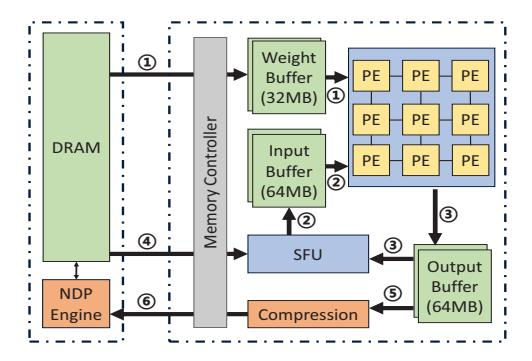

Fig. 7: Overall architecture of Cambricon-D.

## B. Detailed Dataflow

As shown in Fig. 7, the dataflow of Cambricon-D comprises of 6 kinds of data flowing in the architecture:

- ① The weight (in wide and raw values) going from off-chip DRAM to on-chip buffers, which in turn is going to be read into the PE array during computation.
- ② The input (in narrower delta values) produced by the SFU during the previous ReLU, which also is going to be read into the PE array during computation.
- ③ The output (in narrower delta values) produced by the PE array during computation, which would be buffered in the output buffer. It would finally be sent to the SFU for ReLU computation.
- ④ The sign bits, fetched from the DRAM onto the SFU, which is going to be used for the ReLU computation.
- The increments to the raw activation values, being sent to the compression unit for compression.
- The compressed increments, sent to the memory to update the raw activation values.

The loop order of an example layer, 2D convolution, is as shown in algorithm 1.

```
Algorithm 1 Example algorithm for conv2D computation.
```

```
1: procedure COMPUTECONV2D(InputBuf, WeightBuf,
      OutputBuf)
           parallel for d_1=0 to \lceil \frac{N \times H_{\text{out}} \times W_{\text{out}}}{\text{PE\_dim1}} \rceil - 1 do parallel for d_2=0 to \lceil \frac{C_{\text{out}}}{\text{PE\_dim2}} \rceil - 1 do parallel for d_3=0 to \lceil \frac{K \times K \times C_{\text{in}}}{\text{PE\_dim3}} \rceil - 1 do
 2:
 3:
 4:
                               Tile_{in} \leftarrow ReadTile(InputBuf, d_1, d_3)
 5:
                               Tile_{w} \leftarrow ReadTile(WeightBuf, d_2, d_3)
                               Initialize Tile_{out} with zeros
 7:
                               for i \leftarrow 1 to Iterations_per_Tile do
 8:
                                    Tile_{partial} \leftarrow
 9:
                                          ComputeTile(Tile_{in}, Tile_{w})
10:
11:
                                    Tile_{\text{out}} \leftarrow
                                           Tile_{out} + Tile_{partial}
12:
13:
                              end for
14:
                               WriteTile(OutputBuf, Tile_{out}, d_1, d_2)
                              SFUActivation(OutputBuf)
15:
16:
                        end for
                  end for
17:
            end for
18:
19: end procedure
```

#### C. PE Array

The PE array in Cambricon-D is organized following the design of Diffy [15]. In both Cambricon-D and Diffy [15], a SIMD (Single Instruction, Multiple Data) architecture is employed, where the Processing Element (PE) array is designed such that each PE computes the dot product of two vectors. In the context of a convolution, this dot product would be across the dimensions of  $K_{\rm h}$  (kernel height),  $K_{\rm w}$  (kernel width), and  $C_{\rm in}$  (input channels).

The PEs in the array span two dimensions, one is parallel along the  $C_{\rm out}$  (output channels) dimension, wherein PEs share a broadcast input activation bus but receive distinct weights. The other dimension is along the N (batch size),  $H_{\rm out}$  (output height), and  $W_{\rm out}$  (output width) dimensions, where the input activation is shared among PEs, but each PE receives different weight inputs.

For the purpose previously discussed in section IV-B, Cambricon-D has a vastly different design within a PE. Unlike Diffy [15], in Cambricon-D, each PE is a multiplier group, tailored to the value distribution of diffusion models. The multiplier group architecture is shown in Fig. 8a. Each multiplier group takes in a vector of weights W and a vector of delta inputs A on which the inner product is to be computed. It partitions the two vectors along the dimension of the inner product and delivers each partition to a multiplier group. The A vector first goes into a set of fp2int modules for quantization. Those values that overflow in this quantization are outliers. In each multiplier group, there are a large number of n int-and-fp multipliers that can multiply the quantized

inliers with the floating point weights, and a small number of m fp-and-fp multipliers that can multiply the outliers, which remain in fp with the weights.

In each multiplier group, besides the multipliers and adder tree themselves, a set of logic is required for quantization and routing, specifically:

- 1) Each fp input activation is first attempted to be quantized into int via a quantization circuit.
- 2) Those who failed to quantize would give a overflow flag (OF).
- 3) A leftmost outlier selection circuit would gather the first *m* outliers according to the overflow flags.
- 4) The outliers are sent to the fp-and-fp multipliers. In case there are more than m outliers, those activations which failed the selection will be replaced with INT\_MAX or INT\_MIN by the quantizer.

## D. Computing the ReLU and Maintaining the Sign Bits

One major function of the SFU is to perform the differential computing of ReLU function. First, it fetches the sign bits of the input activations from the off-chip memory. The activations in the DRAM are organized in a way where the sign bits are stored in a separate tensor, making it efficient to access only the sign bits. The delta input of ReLU is stored in the output buffer after being processed by the PE array. The SFU then reads in the delta input and chooses to mask away the delta values whose corresponding sign bits are zero. These sign bits are maintained off-chip by the NDP engine in DRAM devices.

The architecture of the NDP engine is as shown in Fig. 8b. It consists of mainly 3 parts:

- The int2fp part would convert the quantized inliers delta tensor back to floating-point to prepare for addition. It also tracks which values are "missing" in the inliers (as marked by a special value INT\_MIN), and generates a flag array accordingly.
- 2) The decompressor buffer on the DRAM side, along with the compressor buffer on the core side, implements the compressed data format. In this format, the deltas are represented by a list of low bitwidth inliers, a list of high bitwidth outliers, and a bitmap indicating which are outliers
- 3) The FP adder array finally executes the read-add-write to update the raw values inside of the DRAM banks.

## VII. METHODOLOGY

## A. Hardware Configurations

We compare the performance and hardware cost of Cambricon-D with a traditional architecture like the TPU.

1) Cambricon-D: We implement Cambricon-D in SystemVerilog. We place and route the RTL code with Synopsys toolchains, using TSMC 45nm technology. We then re-scale the area and power data using DeepScaleTool [19]. We use CACTI 7 [1] to model the SRAM buffers. To reduce simulation time, we also implement a cycle-accurate simulator to evaluate the performance (execution latency) of Cambricon-D. This simulator also simulates the memory behavior by

integrating Ramulator [12]. The performance simulator also produces memory traces that can be used to estimate the power of both the DRAM and the SRAM. In our evaluations, we use a PE array size and off-chip memory bandwidth so that Cambricon-D is equivalent in throughput of an NVIDIA A100 GPU [3]. The Cambricon-D architecture has a PE array size of 128 by 128, where each PE has m=60 int3-and-fp16 multipliers and n=4 fp-and-fp16 multipliers, working at 1GHz, providing a peak performance of  $9.8 \times 10^{14}$  FLOPS of int3and-fp16 throughput and  $6.5 \times 10^{13}$  FLOPS of fp16-and-fp16 throughput, which is equivalent to  $3 \times 10^{14}$  FLOPS in purely fp16 throughput, equivalent to the A100 in terms of the binary gate-level operations per second. Like the A100, it also has 1.5 TB/s of memory bandwidth. Since sampling from the simulator is too slow, we also implement the quantization scheme as a pytorch program.

### 2) Baseline:

- We reimplement a systolic array like the TPU as a cycle accurate simulator. For a fair comparison, we also align the throughput of this baseline to the NVIDIA A100. In this case, we have a PE array size of 128 by 128, also providing a compute throughput of  $3 \times 10^{14}$  FLOPS at 1GHz. It also has 1.5 TB/s of memory bandwidth. We would use this baseline as a representative of the A100 GPU.
- For speedup evaluations, we also include runtime numbers from the physical NVIDIA A100 GPU to put everything in perspective.
- 3) Alternative Implementations: In order to discuss the various designs discussed in this paper, we also implement several other versions of Cambricon-D to evaluate their performances.
  - Diffy-Dataflow + Cambricon-D-PE (abbr. DiffyDF): This is the design without the sign-mask dataflow as introduced in Sec. IV-A. It uses a per-operator dataflow like Diffy-although it computes the convolution operators in the realm of the narrower delta values, it would convert back to the wider raw values once outside of the operator. On the PE side, it is the same as Cambricon-D. This design is used as a reference point to show the gains from the dataflow alone.
  - Cambricon-D-Dataflow + Diffy-PE (abbr. DiffyPE): This\nis a design with the Diffy-like PE as mentioned in Sec.
    IV-B, without accounting for outliers. It also performs
    temporal, not spatial, differential for the reasons discussed\nin II-B. Otherwise, it is the same as Cambricon-D.
  - Cambricon-D-Dataflow + AsyncOutlier-PE (abbr. AsyncPE): This design accounts for the outliers, but uses a separate sparse PE array for the outliers that operates asynchronously with the inlier array. The two arrays would only synchronize after computing a whole layer. Otherwise, it is the same as Cambricon-D.
  - Diffy-Dataflow + Diffy-PE (abbr. DiffyAll): This design is a more fully Diffy-like design on both the dataflow and PE side. This allows for a fuller comparison with a Diffy-like design.

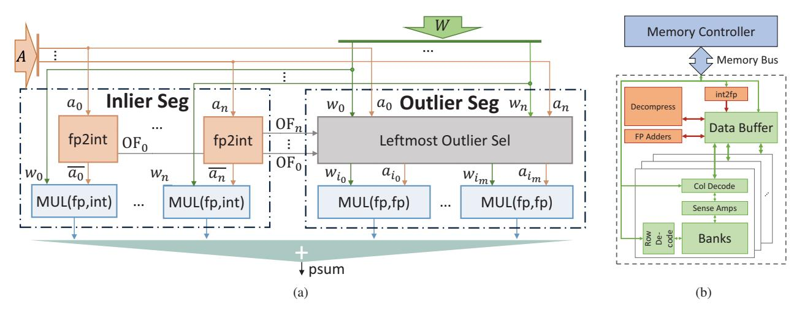

Fig. 8: Architecture details of (a) A multiplier group in a PE. (b) NDP engine.

#### B. Benchmarks

In our benchmarking, we evaluate our diffusion model accelerator design using two prominent diffusion models: Guided-Diffusion [5] and Stable Diffusion v1.4 [18]. Guided-Diffusion, a gradient-based conditioned DDPM model with 0.4B to 0.5B parameters, was tested on LSUN datasets (bedroom and cat, both at 256x256 resolution) [28] and ImageNet datasets (at resolutions of 128x128 and 512x512) [4]. These would be abbreviated GUID256, GUID128 and GUID512 by their resolutions in the following tables and figures.

Stable Diffusion v1.4, a popular latent diffusion model with 0.86B parameters for its diffusion component, was assessed using images generated from the Conceptual Captions dataset [22] at 512x512 resolution. This is abbreviated as STBL512 in the following tables and figures.

| Model   | Channels | Resolutions |  |  |
|---------|----------|-------------|--|--|
| GUID256 | 2048     | 256         |  |  |
| GUID128 | 2048     | 0 90        |  |  |
| GUID512 | 2048     | 512         |  |  |
| STBL512 | 2560     | 64          |  |  |

TABLE I: Summary of Benchmark Models' Structures.

Note that the Guided-Diffusion model is evaluated with multiple datasets with various resolutions, since each resolution has a vastly different network architecture, yielding different performances. Since we observe that the performance simulator does not give noticeably different results for models of the same resolution, which we attribute primarily to the identical network structure and dimensions, for experiments regarding performance and power, we only use LSUN bedroom of the two LSUN datasets as a representative. Due

to limited space, we use a set of plots to summarize the benchmark model architectures in Table I, where each plot represents the channel count or resolutions of all intermediate activation images. Note that the channel count seems to be especially impactful to our performance.

## VIII. EXPERIMENTAL RESULTS

## A. Performance

1) Model Accuracy: We first experiment with the accuracy of the novel quantization scheme and the Diffy-like quantization scheme as previously discussed in IV-B.

| Model                 | FP16 | Int8 | Diffy   Ours     |
|-----------------------|------|------|------------------|
| GUID256-bed [5], [28] | 65%  | 64%  | 58%   62%        |
| GUID256-cat [5], [28] | 63%  | 56%  | 45%   63%        |
| GUID128 [4], [5]      | 77%  | 66%  | 77%   73%        |
| GUID512 [4], [5]      | 87%  | 85%  | 43%   86%        |
| STBL512 [18], [22]    | 60%  | 59%  | 58%   <b>59%</b> |

TABLE II: Precisions before and after Quantization Schemes.

As shown in Table II, the novel quantization scheme did not incur a significant penalty on the model's performance, with precision drops in 0-4%. Please refer to Sec. VII-B for details on the benchmarks. Generated example images have an SSIM (Structural Similarity Index Measure [26]) of only 0.9650. SSIM is a common index used to measure the similarity of images, the maximum score of 1 means identical. Higher than 0.95 is non-observable by human observers [7]. Diffy quantization scheme, on the other hand, indeed causes significant precision degradation, as shown in the Diffy column in Table II.

It stems from our experiments that the precision loss of 0-4% in our design, while seemingly large, is not very significant, as even dynamic int8 quantization (as shown in Table II as the Int8 column) can incur a precision loss of up to 11%.

Note that *precision* is a measure of the quality of the generated images, which we mainly focus on. It is defined as how frequently the generated images fall in the distribution of the dataset. The distribution is estimated by feeding the image into the Inception V3 network [24] to acquire data points in the hidden layer feature space. Subsequently, a manifold estimation algorithm is applied to these data points to acquire the distribution. This metric definition is derived from Guided-Diffusion [5].

2) Speedup: The speedup of Cambricon-D is shown in Fig. 9. As one can see, Cambricon-D achieves a total speedup of 202% and 238% over the baseline, on Guided-Diffusion of resolutions 256x256 and 512x512 respectively. For the 128x128 version, the speedup is 146%, because the network with smaller resolutions is relatively less compute-intensive, making the gains from Cambricon-D's computational optimizations (differential computation) less effective. On Stable Diffusion, the speedup is 238%, showing that the design works on a variety of models. As shown in the leftmost bar, the physical A100 GPU is slower than the baseline accelerator by 43.31%, 23.19%, 30.06% and 30.12% on Guided-Diffusion [5] of resolutions 128x128, 512x512, and 256x256 as well as Stable Diffusion [18] 512x512 respectively. The speedup of the baseline over a physical GPU is due to the various overheads of a GPU compared to a dedicated accelerator, not the main contributions of this paper.

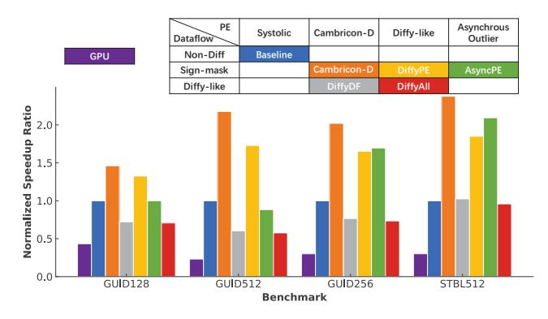

Fig. 9: Speedup of Cambricon-D compared with baseline as well as alternative designs.

The key insight of this paper is the sign-mask dataflow. We can see the improvement by comparing Cambricon-D to the performance of the DiffyDF design without this dataflow, with the same PE. As one can see, instead of a speedup, the DiffyDF design, despite also having the power of differential computation, actually resulted in a slowdown of 72%, 60%, and 77% in all of the three benchmarks of Guided-Diffusion [5], while only the Stable Diffusion reached a tiny speedup

of 103%. It is therefore shown that the novel design worked as intended, and is an integral part of using differential computation effectively on diffusion models.

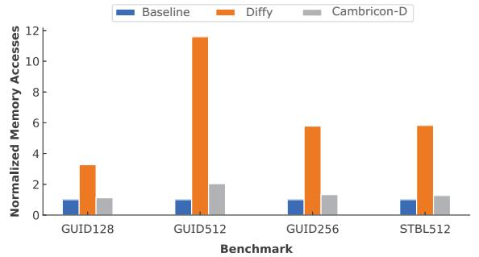

Fig. 10: Total memory traffic of Cambricon-D compared with baseline as well as DiffyDF design.

As we can see in Fig. 10, the aforementioned slowdown of the DiffyDF design is due to the dramatic increase in memory traffic of 227.16%, 1058.40%, and 478.29% for the three benchmarks of the Guided-Diffusion [5] model and 582.60% for Stable Diffusion. Conversely, Cambricon-D demonstrates a relatively modest rise in memory traffic, only about 1/2.92x, 1/5.68x, 1/4.37x , and 1/4.60x the increases observed in the DiffyDF design for each respective benchmark, thereby establishing a notably more sustainable framework for managing memory traffic overhead.

3) Comparisons with Alternative PE Designs: Also shown in Fig. 9 are the speedups of the designs DiffyPE, DiffyAll, and AsyncPE, one can refer to Sec. VII-A3 for their meanings. The DiffyPE design has a Diffy-like PE, using a quantization scheme so aggressive that it becomes impractical precision-wise, can only achieve a speedup of 133% in Guided-Diffusion 128x128, 173% in Guided-Diffusion 512x512, 165% in Guided-Diffusion 256x256, and 185% in Stable Diffusion 512x512. It can be seen that this design of the PE is in every way inferior to the Cambricon-D design.

Also shown in this figure is the performance of the AsyncPE design that attempts to account for all outliers. Its performance is overall even worse than that of the Diffy design, with 100% speedup for Guided-Diffusion 128x128, 113% speedup for Guided-Diffusion 512x512, 170% for Guided-Diffusion 256x256, and 209% for Stable Diffusion 512x512. It is thus still inferior to Cambricon-D.

The DiffyAll is mainly here for reference, allowing for a comparison for a more fully Diffy-like design on both the PE and the dataflow sides. It understandably resulted in an even more severe slowdown of 71%, 58%, 73%, and 96% for the four benchmarks respectively.

4) Run Time Breakdown: Fig. 11 shows a run time breakdown of Cambricon-D compared to the baseline design. The computational optimizations of Cambricon-D significantly decreases the computation time required, reaching a speedup in compute of 284-291% for the four benchmarks, without showing significant increase in memory time.

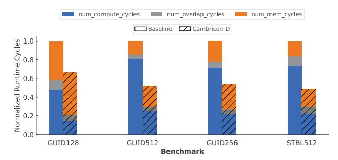

Fig. 11: Run time breakdown of Cambricon-D compared with baseline in various benchmarks.

From this run time breakdown, we can also see why accelerating diffusion models is a difficult task– it is neither a compute nor memory-dominated application, and cannot achieve any significant compute-memory overlap because it has wide variations of compute-memory ratio across different layers.

## *B. Energy, Area, and Power*

| -                  |       | Area   |       | Power  |  |
|--------------------|-------|--------|-------|--------|--|
|                    | mm2   | %      | W     | %      |  |
| Core               | 16.24 | 100.00 | 73.47 | 100.00 |  |
| PE Array           | 2.38  | 14.66  | 12.35 | 16.82  |  |
| ReLU (w/ compress) | 0.17  | 1.08   | 0.77  | 1.05   |  |
| Input SRAM         | 4.52  | 27.85  | 23.44 | 31.91  |  |
| Output SRAM        | 4.64  | 28.56  | 13.01 | 17.71  |  |
| Weight SRAM        | 4.52  | 27.85  | 23.88 | 32.51  |  |
| Near Memory        | 0.13  | -      | 0.86  | -      |  |

TABLE III: Hardware characteristics of Cambricon-D.

*1) Hardware Characteristics:* The hardware characteristics of Cambricon-D are listed in Table III. The accelerator core in Cambricon-D has 16.24mm<sup>2</sup> of area, with an estimated power of 73.47W, using a technology node of 7nm.

In our experiments, we found that the total hardware area overhead is 3.6% compared to a classic design that does not employ differential computation.

In this evaluation, we use 64MB, 64MB and 32MB for the sizes for the Input, Weight and Output SRAM respectively, enough to buffer a single layer's data. However, it is worth noting that halving the on-chip buffer size would still allow Cambricon-D to retain 92.1% performance on the Guided-Diffusion 256x256 model, since only some bigger layers would be slowed down by this, and quartering the buffers would result in 70.9% performance. If 1/8 the buffer size is given, the performance would be nearly halfed (to 51.9%).

*2) Energy Consumption and Breakdown:* The energy gains of Cambricon-D and breakdown are as shown in Fig. 12. For the benchmarks of Guided-Diffusion 128x128, 512x512 and 256x256, Cambricon-D uses 25.81%, 42.16%, and 41.95% less energy, largely due to the reduced dynamic power consumption caused by the speedup.

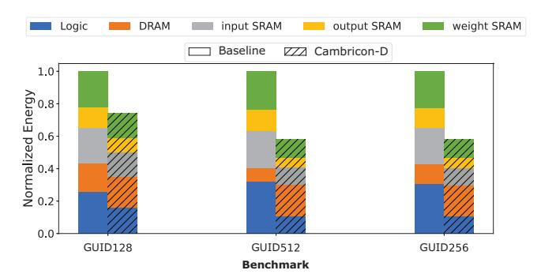

Fig. 12: Energy breakdown of Cambricon-D compared with baseline in various benchmarks.

## IX. RELATED WORKS

Diffusion models have emerged as powerful alternatives to GANs for image synthesis, with key advancements made by DDPM [9] and subsequent optimizations by Guided-Diffusion [5]. Latent Diffusion Models (LDMs) [18] further reduce computational requirements while maintaining high performance. Our work addresses the computational challenges of these iterative models by proposing an efficient hardware accelerator.

Differential computing, particularly for CNN acceleration, was pioneered by Diffy [15], which utilized spatial deltas to exploit bit-serial architectures. This technique is adapted in our work to enhance the efficiency of diffusion models.

In the realm of model quantization, Q-Diffusion [14] and PTQ4DM [21] have proposed methods for post-training quantization that improve model performance. Our quantization approach are orthogonal to these methods and can be integrated to further improve diffusion model inference.

## X. CONCLUSION

In this paper, we introduced Cambricon-D, a differentialbased accelerator that reduces computational redundancy in diffusion models. Unlike previous methods, Cambricon-D implements full-network differential computation, decreasing memory overhead. We also presented Sign-Mask Dataflow, a method for handling non-linear activation functions in differential computation, reducing memory traffic.

In conclusion, Cambricon-D represents a significant step forward in the efficient hardware acceleration of diffusion models. By addressing the computational redundancy inherent in these models and introducing novel methods for handling non-linear activation functions, Cambricon-D offers a promising solution for the high-performance execution of diffusion models.

## REFERENCES

[1] R. Balasubramonian, A. B. Kahng, N. Muralimanohar, A. Shafiee, and V. Srinivas, "CACTI 7: New Tools for Interconnect Exploration in Innovative Off-Chip Memories," *ACM Transactions on Architecture and Code Optimization*, vol. 14, no. 2, pp. 14:1–14:25, Jun. 2017. [Online]. Available: https://dl.acm.org/doi/10.1145/3085572

- [2] T. Brooks, B. Peebles, C. Homes, W. DePue, Y. Guo, L. Jing, D. Schnurr, J. Taylor, T. Luhman, E. Luhman, C. W. Y. Ng, R. Wang, and A. Ramesh, "Video generation models as world simulators," 2024. [Online]. Available: https://openai.com/research/video-generationmodels-as-world-simulators
- [3] J. Choquette, W. Gandhi, O. Giroux, N. Stam, and R. Krashinsky, "NVIDIA A100 tensor core GPU: performance and innovation," *IEEE Micro*, vol. 41, no. 2, pp. 29–35, 2021. [Online]. Available: https://doi.org/10.1109/MM.2021.3061394
- [4] J. Deng, W. Dong, R. Socher, L. Li, K. Li, and L. Fei-Fei, "Imagenet: A large-scale hierarchical image database," in *2009 IEEE Computer Society Conference on Computer Vision and Pattern Recognition (CVPR 2009), 20-25 June 2009, Miami, Florida, USA*. IEEE Computer Society, 2009, pp. 248–255. [Online]. Available: https://doi.org/10.1109/CVPR.2009.5206848
- [5] P. Dhariwal and A. Nichol, "Diffusion Models Beat GANs on Image Synthesis," in *Advances in Neural Information Processing Systems*, vol. 34. Curran Associates, Inc., 2021, pp. 8780–8794. [Online]. Available: https://papers.nips.cc/paper/2021/hash/ 49ad23d1ec9fa4bd8d77d02681df5cfa-Abstract.html
- [6] S. Elfwing, E. Uchibe, and K. Doya, "Sigmoid-Weighted Linear Units for Neural Network Function Approximation in Reinforcement Learning," *Neural Networks*, vol. 107, Jan. 2018.
- [7] J. Flynn, S. Ward, J. Abich IV, and D. Poole, "Image quality assessment using the ssim and the just noticeable difference paradigm," vol. 8019, 07 2013.
- [8] C. Guo, J. Tang, W. Hu, J. Leng, C. Zhang, F. Yang, Y. Liu, M. Guo, and Y. Zhu, "Olive: Accelerating large language models via hardware-friendly outlier-victim pair quantization," in *Proceedings of the 50th Annual International Symposium on Computer Architecture*. New York, NY, USA: Association for Computing Machinery, 2023. [Online]. Available: https://doi.org/10.1145/3579371.3589038
- [9] J. Ho, A. Jain, and P. Abbeel, "Denoising diffusion probabilistic models," in *Advances in Neural Information Processing Systems 33: Annual Conference on Neural Information Processing Systems 2020, NeurIPS 2020, December 6-12, 2020, virtual*, H. Larochelle, M. Ranzato, R. Hadsell, M. Balcan, and H. Lin, Eds., 2020. [Online]. Available: https://proceedings.neurips.cc/paper/2020/ hash/4c5bcfec8584af0d967f1ab10179ca4b-Abstract.html
- [10] D. Holz, J. Keller, N. Friedman, P. Rosedale, and B. Warner, "Midjourney." [Online]. Available: https://www.midjourney.com
- [11] S. Ioffe and C. Szegedy, "Batch normalization: accelerating deep network training by reducing internal covariate shift," in *Proceedings of the 32nd International Conference on International Conference on Machine Learning - Volume 37*, ser. ICML'15. Lille, France: JMLR.org, Jul. 2015, pp. 448–456.
- [12] Y. Kim, W. Yang, and O. Mutlu, "Ramulator: A Fast and Extensible DRAM Simulator," *IEEE Comput. Archit. Lett.*, vol. 15, no. 1, pp. 45–49, 2016. [Online]. Available: https://doi.org/10.1109/LCA.2015.2414456
- [13] K. Kreis, R. Gao, and A. Vahdat, "Denoising Diffusion-based Generative Modeling: Foundations and Applications," New Orleans, Lousiana, Jun. 2022.
- [14] X. Li, L. Lian, Y. Liu, H. Yang, Z. Dong, D. Kang, S. Zhang, and K. Keutzer, "Q-diffusion: Quantizing diffusion models," *CoRR*, vol. abs/2302.04304, 2023. [Online]. Available: https://doi.org/10.48550/ arXiv.2302.04304
- [15] M. Mahmoud, K. Siu, and A. Moshovos, "Diffy: a dej´ a vu-free ` differential deep neural network accelerator," in *Proceedings of the 51st Annual IEEE/ACM International Symposium on Microarchitecture*, ser. MICRO-51. Fukuoka, Japan: IEEE Press, Oct. 2018, pp. 134–147. [Online]. Available: https://doi.org/10.1109/MICRO.2018.00020
- [16] E. Park, D. Kim, and S. Yoo, "Energy-efficient neural network accelerator based on outlier-aware low-precision computation," in *Proceedings of the 45th Annual International Symposium on Computer Architecture*, ser. ISCA '18. Los Angeles, California: IEEE Press, Jun. 2018, pp. 688–698. [Online]. Available: https://doi.org/10.1109/ ISCA.2018.00063
- [17] A. Ramesh, P. Dhariwal, A. Nichol, C. Chu, and M. Chen, "Hierarchical Text-Conditional Image Generation with CLIP Latents," *CoRR*, vol. abs/2204.06125, 2022, arXiv: 2204.06125. [Online]. Available: https://doi.org/10.48550/arXiv.2204.06125
- [18] R. Rombach, A. Blattmann, D. Lorenz, P. Esser, and B. Ommer, "High-Resolution Image Synthesis with Latent Diffusion Models," in *2022*

- *IEEE/CVF Conference on Computer Vision and Pattern Recognition (CVPR)*, Jun. 2022, pp. 10 674–10 685, iSSN: 2575-7075.
- [19] S. Sarangi and B. Baas, "DeepScaleTool: A Tool for the Accurate Estimation of Technology Scaling in the Deep-Submicron Era," in *2021 IEEE International Symposium on Circuits and Systems (ISCAS)*, May 2021, pp. 1–5, iSSN: 2158-1525.
- [20] C. Schuhmann, R. Beaumont, R. Vencu, C. Gordon, R. Wightman, M. Cherti, T. Coombes, A. Katta, C. Mullis, M. Wortsman, P. Schramowski, S. Kundurthy, K. Crowson, L. Schmidt, R. Kaczmarczyk, and J. Jitsev, "LAION-5B: an open large-scale dataset for training next generation image-text models," in *NeurIPS*, 2022. [Online]. Available: http://papers.nips.cc/paper\ files/paper/2022/hash/a1859debfb3b59d094f3504d5ebb6c25-Abstract-Datasets\ and\ Benchmarks.html
- [21] Y. Shang, Z. Yuan, B. Xie, B. Wu, and Y. Yan, "Post-training quantization on diffusion models," *CoRR*, vol. abs/2211.15736, 2022. [Online]. Available: https://doi.org/10.48550/arXiv.2211.15736
- [22] P. Sharma, N. Ding, S. Goodman, and R. Soricut, "Conceptual captions: A cleaned, hypernymed, image alt-text dataset for automatic image captioning," in *Proceedings of ACL*, 2018.
- [23] N. Srivastava, G. Hinton, A. Krizhevsky, I. Sutskever, and R. Salakhutdinov, "Dropout: a simple way to prevent neural networks from overfitting," *The Journal of Machine Learning Research*, vol. 15, no. 1, pp. 1929–1958, Jan. 2014.
- [24] C. Szegedy, V. Vanhoucke, S. Ioffe, J. Shlens, and Z. Wojna, "Rethinking the inception architecture for computer vision," in *2016 IEEE Conference on Computer Vision and Pattern Recognition (CVPR)*, 2016, pp. 2818–2826.
- [25] A. Vaswani, N. Shazeer, N. Parmar, J. Uszkoreit, L. Jones, A. N. Gomez, L. Kaiser, and I. Polosukhin, "Attention is All you Need," in *Advances in Neural Information Processing Systems*, I. Guyon, U. V. Luxburg, S. Bengio, H. Wallach, R. Fergus, S. Vishwanathan, and R. Garnett, Eds., vol. 30. Curran Associates, Inc., 2017.
- [26] Z. Wang, A. Bovik, H. Sheikh, and E. Simoncelli, "Image quality assessment: from error visibility to structural similarity," *IEEE Transactions on Image Processing*, vol. 13, no. 4, pp. 600–612, 2004.
- [27] Y. Wu and K. He, "Group Normalization," in *Proceedings of the European Conference on Computer Vision (ECCV)*, Sep. 2018.
- [28] F. Yu, Y. Zhang, S. Song, A. Seff, and J. Xiao, "LSUN: construction of a large-scale image dataset using deep learning with humans in the loop," *CoRR*, vol. abs/1506.03365, 2015. [Online]. Available: http://arxiv.org/abs/1506.03365