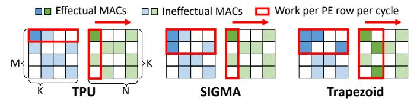
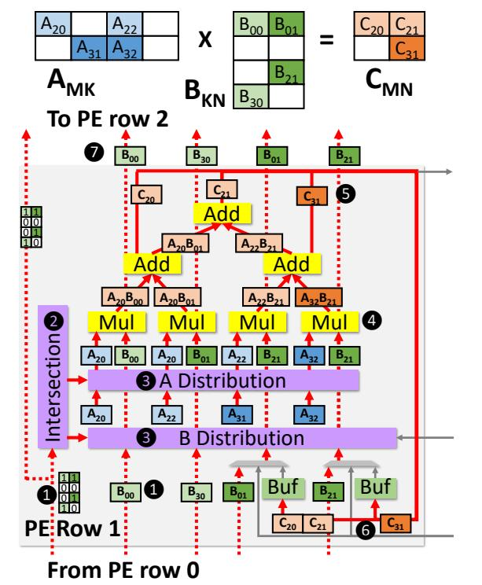
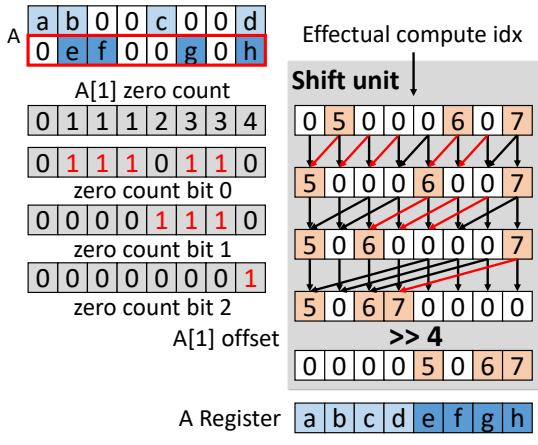

# A. Dense IP dataflow (for $D \times D$ )

We first explain how Trapezoid runs dense $\times$ dense (D $\times$ D). Fig. 7 shows a walkthrough example of how a 4-multiplier PE row runs D $\times$ D. In this and future examples, all unused hardware blocks are greyed out.

Trapezoid uses a standard IP dataflow for  $D \times D$ , similar to the TPU's (Sec. II-A): each PE row computes the dot product of a row of A and a column of B. Elements of A are held at PEs, and B's columns are streamed vertically. Our only deviation from the TPU is that, instead of reducing partial products through horizontal connections, the *merge-reduction tree* performs these reductions spatially. We adapt Flexagon's merge-reduction network [50] (MRN), and explain its full functionality later. Since this is needed for sparse dataflows, we reuse it for  $D \times D$ .

Fig. 7 shows PE row 2, which holds row 2 of matrix A  $(A_{20}, A_{21}, A_{22}, A_{23})$  in registers. In this example, ① column 0 of B arrives to PE row 2 (from adjacent PE row 1); ② the multipliers compute individual partial products; ③ the reduction tree accumulates partial products and produces a single output element,  $C_{20}$ , which is streamed out of the array; in parallel, 4 column 0 of B is forwarded to the next PE row (3).

<span id="page-4-1"></span>

Fig. 8: Comparison of IP-based dataflows on MS×MS.

#### B. TrIP dataflow (for MS $\times$ MS and MS $\times$ D)

Trapezoid uses a new IP-based dataflow, TrIP, to handle MS inputs. TrIP supports *dual-side sparsity*, i.e., it remains efficient when both inputs are mildly sparse. To achieve high efficiency and reuse even when some intersections are ineffectual, TrIP *intersects a few rows of A and columns of B at a time*. By considering multiple rows and columns, each nonzero of A and B can contribute to *multiple* partial products. This compensates for ineffectual intersections and achieves fine-grained reuse.

To make this concrete, Fig. 8 compares how TPU, SIGMA's IP-based dataflow, and TrIP run the same MS×MS multiplication on a 4-multiplier PE row. The red box indicates the amount of work that is performed by a single PE row per cycle. The TPU processes a single row of A and column of B per cycle; sparsity causes ineffectual work (multiplications where either input is zero) that quickly tanks performance. In this example, A row 0 and B column 0 have a single effectual multiplication (darker color), yielding 25% utilization.

SIGMA improves on the TPU by packing A's sparse rows. In this example, the 4-multiplier PE row can hold A's rows 0 and 1. Every cycle, the PE row receives a column of B and initiates multiplications with the two rows of A. In the example, A rows 0–1 and B column 0 have two effectual multiplications, yielding 50% utilization. This is better than the TPU, but it is still limited by B's sparsity, which SIGMA does not exploit.

Trapezoid's TrIP improves on SIGMA by, in addition to packing A's sparse rows, streaming *multiple columns* of B per cycle when B is sparse. In this example, TrIP maps A's rows 0 and 1 to the PE row (like SIGMA), and streams B's columns 0 and 1. This yields four effectual intersections, using 100% of multipliers even though only 25% of intersections are effectual.

TrIP handles sparsity better than SIGMA, but it also takes more area and complexity: whereas SIGMA distributes B values to A nonzeros in fixed locations, Trapezoid must dynamically find matching nonzeros in both A and B, and distribute these nonzeros to multipliers. The complexity of some of this matching step (specifically, intersections) is quadratic with the number of rows of A and columns of B that are packed/streamed at a time. To limit complexity, we restrict the number of rows of A and columns of B to a maximum of 4 (i.e.,  $4 \times 4 = 16$  fiber intersections), which keeps hardware costs modest.

Since A and B have varying sparsities, streaming as many of B's columns as possible may require computing more partial products than multipliers in a PE row. Trapezoid dynamically adjusts the number of B columns streamed at a time so that all PE rows can process them in one shot, avoiding overflowing.

Fig. 9 shows the loop nest of TrIP dataflow and how it maps to the hardware. We first explain TrIP through an example, then detail the hardware components needed to support it.

```
A = Matrix(shape=[M1,K1,M0,K0])
B = Matrix(shape=[N1,K1,N0,K0])
C = Matrix(shape=[N1,M1,M0,N0])

for n1 = [0, N1):
    for m1 = [0, M1):
    for [n], n_h) = [0, N0).split(dynamic): # stream in groups of B cols for [m1, m_h) = [0, M0).split(static): # spatial Y, PE row for m0 = [m1, m_h): # spatial X, local buf bank, MFIU for n0 = [n_1, n_h): # spatial X, local buf word, MFIU for k0 = [0, K0): # spatial X, adjacent MRN leaf, MFIU C[n1,m1,m0,n0] += A[m1,k1,m0,k0] * B[n1,k1,n0,k0]
```

Fig. 9: Loop nest of TrIP dataflow.

<span id="page-5-1"></span>

Fig. 10: Example of Trapezoid running TrIP for MS×MS.

Walkthrough example: Fig. 10 shows Trapezoid running a similar multiplication to Fig. 7, but with mildly sparse A and B. Because A is sparse, four nonzeros from two rows of A  $(A_{20})$  $A_{22}$ ,  $A_{31}$ ,  $A_{32}$ ) are mapped to the registers in PE row 1. In this example, 11 the PE row first receives two sparse columns of B  $(B_{00}, B_{30}, B_{01}, B_{21})$ ; the intersection unit takes their bitmasks; 2 the intersection unit intersects each B bitmask with the bitmasks of the two rows of A, and finds the matching kcoordinates, which constitute the routing information for the A and B distribution networks; 3 the A and B distribution networks route values of all matching coordinates ( $A_{20}$ - $B_{00}$ ,  $A_{20}$ - $B_{01}$ ,  $A_{22}$ - $B_{21}$ ,  $A_{32}$ - $B_{21}$ ) to multipliers. Note that  $A_{31}$  and  $B_{30}$  are not routed to any of the multipliers because they do not contribute to any effectual computation; however,  $A_{21}$  and  $B_{21}$ are both used *twice*, compensating for this inefficiency. 4 Multipliers generate four partial results that eventually contribute to three final outputs  $(C_{20}, C_{21}, C_{31})$ . In TrIP, the merge-reduction tree is configured into reduction mode. 5 The merge-reduction tree behaves as 3 smaller reduction trees to generate the final outputs  $C_{20}$  (= $A_{20}B_{00}$ ),  $C_{21}$  (= $A_{20}B_{01}+A_{22}B_{21}$ ), and  $C_{31}$  $(=A_{32}B_{21})$ . 6 Final outputs are written to the local buffer (2-

<span id="page-5-2"></span>

Fig. 11: Example of multi-fiber intersection and distribution.

bank 2-word wide in this example). Because  $C_{20}$  and  $C_{21}$  are contiguous, they are coalesced into one wide write to the same bank. Different banks hold the outputs of different rows; that's why  $C_{31}$  is written to the other bank. To Concurrently with this, B's columns (values and bitmasks) are forwarded to the next PE row, 2.

**Hardware extensions:** As shown in the example, TrIP requires (1) an intersection unit to find matching coordinates, (2) two distribution networks to align matching A and B nonzeros, (3) a merge-reduction tree capable of producing multiple outputs per cycle, and (4) banked buffers to store scattered outputs.

We use SIGMA's distribution network, a Benes network [3], which is non-blocking and has low area overhead. However, Trapezoid has two networks, for A and B, whereas SIGMA has a single one for B. We also adopt Flexagon's merge-reduction tree [50] that can both merge and reduce multiple partial sum clusters in a parallel and non-blocking way; However, we enhance it with a banked local buffer, described later, to achieve higher gather and scatter bandwidth. Our key innovation for TrIP is the multi-fiber intersection unit, which we explain next. Multi-fiber intersection unit (MFIU): Fig. 11 shows the structure of the multi-fiber intersection unit, which consists of hardware to (1) produce all pairwise intersections of A row and B column bitmasks (just AND gates, A&B); (2) compute the cumulative sum of matching bits, using a prefix sum; and (3) shift indices to produce routing metadata for the distribution networks.

Fig. 11 also shows how the intersection unit generates the routing information for the example in Fig. 10. A row and B column bitmasks are intersected (ANDed) pairwise, producing 4 4-bit masks, which in this case have 4 1's; The prefix sum unit (a tree of narrow adders) computes the count of 1's at or below each index; These counts are masked by the intersected bitmasks, keeping only the indices of each effectual computation. For example, focus on the intersection between the first row of A ( $[A_{20}, 0, A_{22}, 0]$ ) and second column of B ( $[B_{01}, 0, B_{21}, 0]$ ), (marked with a red box in Fig. 11). The prefix

<span id="page-6-0"></span>

Fig. 12: Example of shift unit.

sum for the two successful pairs of intersection are 2 ( $A_{20}$ -

 $B_{01}$ ) and 3 ( $A_{22}$ - $B_{21}$ ). Thus,  $A_{20}$ - $B_{01}$  is the second effectual computation and  $A_{22}$ - $B_{21}$  is the third effectual computation, which should be mapped to multipliers 2 and 3. This effectively packs the sparse multi-fiber multiplication into a dense vector multiplication, with elements in increasing coordinate order, so that all partial products that contribute to the same output element are contiguous. 4 The shift unit (described below) shifts these effectual computation indices to the corresponding registers holding the values of A and B. For instance, values  $A_{20}$ and  $B_{01}$  receive index 2. 5 Finally, the A and B distribution networks deliver the values to multipliers using the indices as routing information (this routing is done as in SIGMA [60]). Shift unit: Fig. 12 shows the microarchitecture of the shift unit and an example of its operation. The design is similar to the zero eliminator in SpAtten [68]. It is responsible for shifting the effectual computation index to the corresponding value. In this example, the effectual computation indices of A[1] (5, 6, 7) are shifted to their corresponding registers holding A[1] values (e, g, h). f does not receive an index because after intersection with columns of B, no effectual computation is generated. We start by calculating the zero count of A[1] before each element offline. A K-element input is shifted by  $\log K$  levels, with each bit of the zero count controlling whether to shift the value at this level. At i-th level, if the bit i is 1, the value is shifted left by  $2^i$ . For example, since bit 1 is 1 for index 6, it is shifted left by 2. In this way, each effectual computation index is eventually shifted to the corresponding value starting at position 0. Note

**Dynamic packing of B columns:** The key hardware constraint for choosing the number of columns of B to stream in each cycle is that the number of effectual computation generated by the intersection unit of each PE row should not exceed the number of multipliers (128). Trapezoid makes this choice ahead of time, when columns of B are streamed from off-chip to on-chip. Using the A bitmask and B bitmask, it calculates the number of effectual computations per PE row (using popocount on the

that since rows of A are stored contiguously along registers

in the PE row, the starting location of A[1] is not position 0.

A final right shift using the offset of A[1] aligns the effectual

computation indices to the values.

<span id="page-6-1"></span>

Fig. 13: Multi-level memory hierarchy.

A&B bitvector). Then, the maximum number of effectual computations across all PE rows is produced for every number of columns of B (i.e., 1-4), and Trapezoid chooses the maximum number of B columns so that the number of effectual computations does not exceed the number of multipliers per row.

Reductions and output buffering: After partial products are computed, the merge-reduction tree accumulates them. Each tree node consists of an adder, a comparator, and a few muxes. When configured in merge mode (which is not used in TrIP), comparators in each node are used to forward the smaller of the inputs up the tree; this is used to merge partial output fibers in coordinate order in TrGT/TrGS. TrIP uses the tree in reduction mode, where the adders within each node are used to form reduction trees. Following Flexagon's design, the tree can be sliced into smaller subtrees, each accumulating a contiguous subset of input elements. TrIP configures subtrees so that each subtree produces one element of C.

Since TrIP processes several A rows and B columns per cycle, it produces a larger number of C elements per cycle than SIGMA. We add a banked local buffer to support this output bandwidth. Each subtree writes results directly to the local buffer; in our implementation, the local buffer has 4 banks, each 4 words wide, which suffices to absorb the scatter-output bandwidth of intersecting 4 rows of A and 4 columns of B (i.e. a  $4\times4$  partial result matrix).

### C. TrGT dataflow (for HS×HS)

Trapezoid uses a memory-efficient Gustavson-based dataflow, TrGT (Fig. 14), similar to Gamma [79] and Flexagon's Gustavson mode [50], to handle multiplications of highly sparse inputs. In the Gustavson dataflow, A is accessed element by element and C is produced row by row, but B suffers accesses to non-consecutive rows, and has matrix-level reuse.

Trapezoid leverages caching, a key optimization to reduce B matrix traffic [50, 79]. The key innovation is Trapezoid's multilevel memory hierarchy, which offers the high gather bandwidth needed by Gustavson dataflow in HS×HS while keeping the area overhead low. In this way, Trapezoid can scale up the processing throughput of HS×HS at only modest area cost. **Multi-level memory hierarchy:** Fig. 13 shows Trapezoid's memory hierarchy. Trapezoid's global cache is organized as 4 clusters, each serving 32 PE rows. Each 4 MB cluster has

```
A = Matrix(shape=[M2,M1,M0,K])
B = Matrix(shape=[N1,K,N0])
C = Matrix(shape=[N1,M2,M1,M0,N0])
for n1 = [0, N1):
for m2 = [0, M2)
                                        B tile on-chip
  for m1 = [0, M1): # spatial Y, PE row
                                            C tile on-chip
   for m0 = [0, M0): # spatial Y, PE subrow
    B tmp = Matrix(shape=[K,N0])
    for k = [0, K): # leader follower
    for n0 = [0, N0):
      B_{tmp}[k,n0] = B[n1,k,n0]
    # merger, pipelined with next loop
    B_{tmp} = B_{tmp.transpose}() \# merger [K,N0] -> [N0,K]
    for n0 = [0, N0):
    for k = [0, K): # reduction
    C[n1,m2,m1,m0,n0] += A[m2,m1,m0,k] * B_tmp_t[n1,n0,k]
              Fig. 14: Loop nest of TrGT dataflow.
```

32 banks, and 16-word (64B) lines. A  $32 \times 32$  crossbar connects banks and PE rows. This clustered organization avoids an expensive  $128 \times 128$  all-to-all network between PE rows and caches, but at the same time offers sufficient cache capacity in each cluster (4 MB) to capture irregular reuse in the B matrix.

Each PE row has a 4-bank, 4-word-wide (16B) local buffer (matching the throughput to cache banks). Since the TrIP dataflow uses local buffers holding outputs, we *reuse* them for TrGT, though to hold inputs (rows of B). In this way, the wider 16-word sequential access to the global cache can be translated into several narrower gather accesses (4 gather reads/cycle) to 4 banks of the local buffer, effectively increasing gather bandwidth to the global cache. This hierarchical organization avoids the all-to-all communication overhead of prior HS×HS accelerators, at a modest cost of local buffer and global cache area.

In principle, we could dedicate each PE row to produce a single output row using a row of A, i.e., spatially map M to PE rows. This would let each PE row handle up to 128 nonzeros per row of A, since we have a 128 multipliers and a radix-128 merge-reduction tree. But HS matrices rarely have that many nonzeros per row, so this would leave most of the PE row unused. Since TrIP already has the hardware needed to support up to 4 rows of A, including 4 local buffer banks, and the multi-level memory hierarchy can support 4 gather accesses per cycle, we divide each PE row into 4 PE subrows.

TrGT maps different rows of A to different PE subrows (rather than PE rows), making the spatial M dimension  $4\times$ larger. Fig. 14 shows TrGT's loop nest, which includes this mapping: both the  $M_1$  and  $M_0$  dimensions are mapped spatially (instead of just  $M_1$ ) to hardware. TrGT fetches each row of B temporally, i.e., one element at a time, according to the nonzeros in the A row, and computes the linear combination of these rows of B to produce one C row. The merge-reduction tree is configured into a merge tree to facilitate the linear combination. This offers a similar functionality as a Gamma PE [79]. Depending on the number of nonzeros of A, each PE subrow gets a slice of the PE row resources. Specifically, a PE subrow handling a K-element row of A is allocated K registers (storing A values), K multipliers, 1 buffer bank (storing B rows), K-to-K distribution networks and a radix-K merge tree (by using K-element slices of the 128-element distribution networks and merge-reduction tree).

<span id="page-7-1"></span>

Fig. 15: Example of Trapezoid running TrGT for HS×HS.

Walkthrough example: Fig. 15 shows a 4-multiplier PE row divided in two PE subrows. In this example, the left PE subrow gathers and linearly combines 2 rows of B, B[0]  $(B_{00}, B_{02})$ and B[2]  $(B_{21}, B_{23})$ , to produce row 2 of C  $(C_{20}, C_{21}, C_{22}, C_{23})$ . Each row of B is stored in a FIFO. The two B FIFOs (holding a few head elements of B[0] and B[2]) are implemented using the local buffer; in this mode, each buffer bank offers a read throughput of 1 element/cycle. 1 Elements from each B row are routed to the multiplier holding the corresponding nonzero of A (with the matching k coordinate), and scaled. For example, B[0] is routed to  $A_{20}$ ; the figure shows how  $B_{00}$  is multiplied to produce partial product  $A_{20}B_{00}$ . 2 The merge tree flows partial products in the order of n coordinate, and accumulates those with a matching n coordinate, e.g.,  $A_{32}B_{21}$  and  $A_{31}B_{11}$ produce  $C_{31}$ . 3 Elements of C's row at the output of the merge tree are written to the cache in order. 4 The B FIFO only buffers a few head elements of the row while rest of the row  $(B_{12}, B_{13})$  is obtained from the cache in a wider word fetch (2-word in the example).

