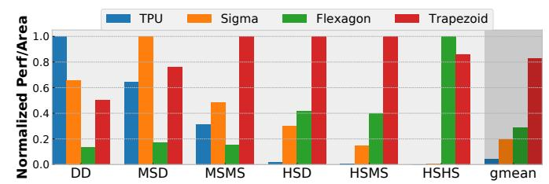
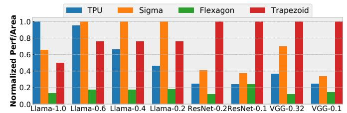
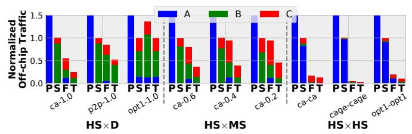

# B. Overall Performance

Fig. 19 presents the performance/area of all accelerators on all 6 category of workloads: D×D, MS×D, MS×MS, HS×D, HS×MS, and HS×HS. For accelerators supporting multiple dataflows (Trapezoid and Flexagon), we pick the best-performing dataflow for each workload, like [50]; Sec. V-C analyzes dataflow choice. We use performance/area rather than performance to penalize Trapezoid for its higher area over the iso-throughput TPU and SIGMA designs. Within each category, we take the gmean over all workloads and report performance/area normalized to the best design. The overall performance/area is the gmean over the gmean of all categories (this avoids biasing to categories with more inputs).

Trapezoid achieves  $19.7 \times$ ,  $4.3 \times$ , and  $2.9 \times$  better performance/area than TPU, SIGMA, and Flexagon, respectively. From left to right, the workloads become sparser. TPU, designed

Fig. 19: Performance/area comparison on matrix multiplication with different sparsity levels (normalized to the best accelerator in each category).

Fig. 20: End-to-end performance/area comparison on DNNs with different sparsity levels (normalized to the best accelerator).

for D $\times$ D, is the best on D $\times$ D but tanks on sparser workloads because it cannot exploit any sparsity (e.g., TPU is 4134 $\times$  worse than Trapezoid on the sparsest HS $\times$ HS). SIGMA is optimized for mildly sparse inputs and therefore performs better than TPU on MS $\times$ D and MS $\times$ MS. But it also takes a significant performance hit on HS inputs. Flexagon performs well on HS $\times$ HS and HS $\times$ MS, but on denser inputs, it is far slower than other accelerators due to its limited compute throughput.

By contrast, Trapezoid performs consistently well across workloads despite their vastly different sparsity levels. It is only  $2.0\times$  and  $1.3\times$  away performance/area-wise from the best performing accelerator on D×D (TPU) and MS×D (SIGMA). Because Trapezoid is able to achieve the same peak throughput of TPU in D×D and SIGMA in MS×D, their performance/area difference stems from the area overhead of sparsity handling hardware in Trapezoid. Thanks to the multi-fiber intersection unit, Trapezoid is  $2.1\times$  better than SIGMA on MS×MS. The TrGS dataflow excels at HS×D and HS×MS and achieves  $2.4\times$  and  $2.5\times$  better performance/area than Flexagon. On HS×HS, Trapezoid is only  $1.2\times$  worse than Flexagon.

End-to-end DNN performance: Fig. 20 shows the end-to-end performance per area of running 8 DNN workloads with varying levels of activation and weight sparsity (D×D, MS×D and MS×MS). Llama-1.0 is fully dense, so the TPU is optimal; Trapezoid is only 2.0×/1.3× slower than TPU and SIGMA. The weight-sparsified Llamas (Llama-0.6,0.4,0.2) are dominated by MS×D, so SIGMA is optimal for them; Trapezoid is only 1.3× slower. Finally, the layers in ResNet-50 and VGG-16 leverage both weight and activation sparsity, and are therefore MS×MS workloads. Trapezoid has 1.4-2.9× better performance/area than SIGMA on ResNet-50 and VGG-16, and outperforms the other accelerators further.

**Roofline analysis:** Fig. 21 shows two roofline plots of all accelerators on all workloads. The full plot is shown on the bottom-right corner; the large plot is a zoomed-in region. The memory roofline is 2TB/s and the compute roofline is TPU/SIGMA/Trapezoid's peak throughput (32TFLOPs).

Fig. 21: Log-log roofline of all workloads.

Trapezoid is always on or close to the roofline because its design optimizes for all sparsity levels. For accelerators that can run multiple dataflows (Trapezoid and Flexagon), only the best-performing dataflow per workload is shown. When running workloads with any sparsity, TPU's (+) throughput quickly drops. SIGMA (Y) achieves modest throughput with MS inputs (top right region), but quickly drops far below the roofline on sparser inputs (bottom left region). Flexagon uses its Gustavson-based dataflow with HS inputs (\*), leveraging its cache to improve arithmetic intensity and reach the memory roofline. Its limited gather bandwidth sometime limits throughput (flat line). On denser workloads, Flexagon's IP-based dataflow (X) is far away from the roofline due to its limited peak throughput.

Trapezoid is always close to the roofline across different arithmetic intensities. With high arithmetic intensity  $D\times MS$  inputs (top right corner),  $TrIP(\)$  achieves the highest throughput. When we gradually move left on the plot lowering the arithmetic intensity, the TrGS dataflow ( $\)$ ) takes over and lets Trapezoid comfortably saturate the memory bandwidth. Finally on  $HS\times HS$ ,  $TrGT(\)$ ) performs the best. Thanks to the on-chip cache and Gustavson-based dataflows, Trapezoid is also at or near the roofline for  $HS\times D$ ,  $HS\times MS$ , and  $HS\times HS$ .

Trapezoid outperforms combinations of prior accelerators: Faced with a diverse workload mix, we could combine multiple accelerators to achieve better gmean performance. We study this by finding the optimal accelerator mix for our workload mix. We explore combinations of TPU, SIGMA, and Flexagon that take the same total area as Trapezoid, and process each matrix across all accelerators (this way, each accelerator contributes to performance on all workloads). We find that, for this mix of workloads, the optimal combination is to devote 60% of area to SIGMA and 40% to Flexagon. Still, Trapezoid is gmean  $2.1 \times$  faster than this combination.

### C. Analysis of representative workloads

We select 3 representative workloads from each category (MS×D, MS×MS, HS×D, HS×MS, HS×HS) and present their results to gain more insights into Trapezoid's efficiency. Fig. 22 shows the performance/area of these 15 workloads normalized to the best-performing accelerator. In addition, for denser workloads (MS×D, MS×MS), which are typically compute-bound,

Fig. 22: Performance/area comparison on 15 representative workloads (normalized to the best accelerator).

Fig. 23: Compute utilization comparison on 6 denser workloads.

Fig. 24: Off-chip memory traffic breakdown comparison on 9 sparser workloads (normalized to SIGMA). P: TPU, S: SIGMA, F: Flexagon, T: Trapezoid.

Fig. 25: Performance/area of different dataflows on 5 representative workloads (normalized to the best dataflow).

we plot the compute utilization in Fig. 23. Trapezoid consistently achieves the highest compute utilization in denser workloads. And for sparser workloads (HS×D, HS×MS, HS×HS) which tend to be memory bound, we plot the off-chip traffic breakdown by data type in Fig. 24 (normalized to SIGMA). Trapezoid has the lowest traffic for all sparser workloads.

For MS×D, SIGMA, Flexagon, and Trapezoid all exploit A's sparsity using an IP-based dataflow and achieve high compute utilization. But these accelerators cannot fully exploit the 20% dense A in 11ama0.2-1.0 because they can only pack 4 rows of A. TPU utilization drops as A gets sparser as doing IP densely results a significant amount of ineffectual work.

Trapezoid particularly shines in MS $\times$ MS. It achieves a 13.3 $\times$  utilization gain over TPU in Res0.27-0.15 with 27% dense A and 15% dense B, which translates into 6.5 $\times$  better performance/area. This is because Trapezoid's multi-fiber intersection unit is able to conduct 16 fiber intersections (4 rows of A and 4 columns of B) at once rather than 1 fiber intersec-

tion in TPU. Trapezoid's gain over SIGMA derives from its ability to exploit the additional B sparsity using the multi-fiber intersection unit. Its theoretical  $4\times$  utilization gain is realized in Res0.27-0.15 and Res0.62-0.15, which results in  $3.0\times$  and  $2.0\times$  better performance/area than SIGMA. TrIP's benefits are lower when B is denser: in VGG0.45-0.42, the Trapezoid intersection unit can pack 2 columns of B per cycle at most, achieving  $1.4\times$  higher utilization. Though Flexagon achieves similar utilization to SIGMA, its low peak throughput results in  $6.9\times$  worse performance/area than Trapezoid.

For HS workloads, we pick four representative matrices (ca-CondMat, p2p, opt1, cage12) with varying sparsity degrees and nonzero patterns. In HS×D, Trapezoid achieves  $10.6\times$  and  $5.4\times$  better performance/area than SIGMA on ca and p2p, because it runs TrGS, avoiding the ineffectual work of IP-based SIGMA. Gustavson's dataflow also reduces effectual fetch of B, which can be observed in Fig. 24 as Trapezoid and Flexagon has lower traffic than SIGMA and TPU. opt1 shows different behavior, and SIGMA performs best. Though opt1 has low overall density, its nonzeros appear in dense clusters. SIGMA's IP-based dataflow achieves high throughput in the dense clusters and skips the other regions. Trapezoid's TrIP is close to SIGMA  $(1.3\times$  performance/area away).

In HS $\times$ MS, Trapezoid performs the best on varying density of B matrices, roughly  $2\times$  better than Flexagon owing to our novel TrGS dataflow over Flexagon's TrGT-like dataflow. TrGS can utilize a larger fraction of the spatial array (compared to TrGT) to achieve higher peak throughput.

For HS×HS, Trapezoid achieves similar performance/area as HS×HS-optimized Flexagon. Trapezoid runs TrGS more efficiently on opt1 because of its dense clusters, achieving 1.8× performance/area improvement over Flexagon. Flexagon is more efficient on ca. Because both Trapezoid and Flexagon run a TrGT-like dataflow, Flexagon has higher peak throughput than Trapezoid in TrGT mode. However, their efficiency is flipped on cage, which saturates HBM bandwidth, so Flexagon's smaller cache translates to higher traffic. Finally, both Trapezoid and Flexagon have the lowest traffic in HS×HS.

Finally, Fig. 25 reports the performance/area of individual dataflows (IP- and Gustavson-based) on 5 representative work-loads. For MS inputs, IP-based dataflows outperform Gustavson-based ones. As Sec. II-B described, supporting complex row reductions in Gustavson (and matrix reductions in OP) has higher costs and is thus less desirable than intersections for MS inputs. When the sparsity level increases, i.e. from MS×D to MS×MS, IP-based dataflows (e.g., SIGMA) gradually drop

Fig. 26: Energy breakdown comparison on 15 workloads (normalized to SIGMA). P: TPU, S: SIGMA, F: Flexagon, T: Trapezoid.

in performance/area due to increasing ineffectual intersections. On HS inputs, Gustavson-based dataflows (Flexagon, TrGT, TrGS) consistently outperform IP-based dataflows, by avoiding ineffectual intersections and reducing memory traffic.

By looking at individual dataflows, we can also establish comparisons with other HS×HS accelerators beyond Flexagon. Spada [43] would be similar performance as Flexagon, as they have similar compute to memory ratio and support multiple dataflows. We expect Gamma [79] to perform similarly to Flexagon-Gust; MatRaptor [64] would be slower due to the lack of caching [79], and conversely, Trapezoid's memory organization increases effective capacity and reduces traffic.

