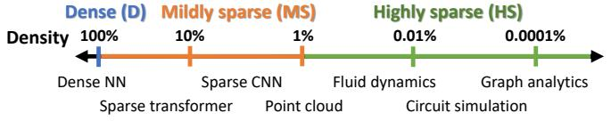
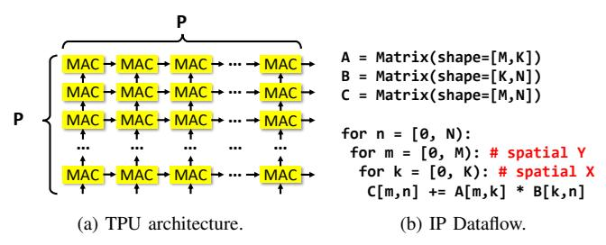

# I. INTRODUCTION

Matrix multiplication is a dominant kernel in many domains, including neural networks [9, 15, 28, 44], tensor algebra [37], graph analytics [21, 36], and scientific computing [24, 53, 57]. As a result, GPUs [55] and many specialized processors spend considerable area to accelerate matrix multiplication.

While most deployed accelerators target multiplication of *dense* matrices, many applications compute on *sparse data*, i.e., those with a large fraction of zeros. Sparse algorithms avoid storing and processing zeros, achieving high efficiency. This has sparked many research efforts to accelerate the multiplication of sparse matrices [32, 43, 50, 58, 60, 64, 70, 79, 81].

A key challenge is that sparsity varies widely across applications. Fig. 1 shows the range of sparsities typical in several application domains. For example, neural networks often use *mildly sparse* matrices where 90-1% of values are nonzero, whereas scientific and graph algorithms often process *highly sparse* matrices where nonzeros are extremely infrequent (e.g., 1 per million values). But sparsity is a continuum, with substantial diversity within each domain and overlap across domains. For example, some neural networks process highly sparse data [9].

Fig. 1: Matrix sparsity varies widely across application domains.

To complicate matters further, a single application often multiplies matrices with different sparsities, e.g., sparse weights and dense activations in deep learning [28], and a highly sparse matrix times a dense vector or matrix in solvers [24, 57].

Ideally, a single matrix multiplication accelerator should gracefully handle operands across the full range of sparsities, from dense to highly sparse. But this is challenging, because sparsity dramatically changes the performance characteristics of matrix multiplication. Thus, prior accelerators are effective on limited ranges of sparsity, and perform poorly on other cases. We can broadly distinguish three types of accelerators, based on the sparsity of the operands they target:

- 1. Dense (D) matrices make matrix multiplication regular and with high arithmetic intensity, as each value is reused many times. Dense matrix multiplication accelerators, like TPUs [34] and Tensor Cores [55] in GPUs, are 2D spatial arrays, grids of multiply-add units connected with local links. These arrays are pipelined and are often systolic, which reduces handshaking costs [39]. These units spend nearly all their area on compute, and achieve extremely high throughput when matrices are dense. But they are inflexible, and their efficiency quickly plummets with sparse operands, as zeros waste time and energy.
- 2. Mildly sparse (MS) matrices have modest sparsity, typically above 1% nonzeros. With MS inputs, matrix multiplication enjoys medium arithmetic intensity. Thus, accelerators like SIGMA [60], DSTC [70], and HighLight [71] follow a similar organization to 2D spatial arrays, which they extend with mechanisms to handle some degree of sparsity, like distribution networks that gather sparse inputs (either unstructured or structured), or more flexible accumulation buffers for sparse outputs. Accelerators targeting MS inputs are relatively efficient on dense operands, but are still wildly inefficient when matrices are highly sparse.
- **3. Highly sparse (HS) matrices** have below 1% nonzeros, and often far less. They are common in scientific computing and graph analytics. Matrix multiplication with HS inputs has little reuse, very low arithmetic intensity, and high memory traffic, so

Fig. 2: Performance/area of prior accelerators and Trapezoid on matrix multiplication with different sparsity levels.

data movement is the main bottleneck. Thus, accelerators like OuterSPACE [58], SpArch [81], MatRaptor [64], Gamma [79], Flexagon [50], and Spada [43] focus on implementing *dataflows* (i.e., schedules) that minimize data movement. They spend most area on on-chip storage structures and on hardware to traverse sparse fibers (rows or columns) [66]. Multipliers and adders take less than 5–10% of area, resulting in low peak throughput, so they are inefficient on D/MS matrices. Moreover, HS accelerators are hard to scale up, so they cannot reach the peak throughput of accelerators targeting denser inputs.

Fig. 2a shows the problems of these disjoint designs: it compares three representative accelerators, one of each type: TPU, SIGMA, and Flexagon. Each row reports results for a given combination of input sparsities; the table covers all sparsity combinations (e.g., MS×D is mildly sparse times dense; see Sec. IV for methodology details). All designs are normalized to have the same area, and performance is reported relative to the best design. Fig. 2a shows that each of these accelerators is inefficient on matrices outside its range of targeted sparsities. Trapezoid handles the full range of sparsities: To address the limitations of prior accelerators, we introduce *Trapezoid*, a versatile matrix multiplication accelerator that, for the first time, handles from dense to highly sparse inputs. Fig. 2a shows Trapezoid's performance across the range: while its flexibility sacrifices some performance at the extremes, it performs consistently well across the full range of sparsities. When averaged across all input densities, Fig. 2b shows that Trapezoid's overall performance is substantially better than prior designs.

To achieve this, we design Trapezoid around two key principles and novel contributions. First, to achieve high performance on D and MS inputs, Trapezoid builds on a 2D spatial array, like prior accelerators targeting D and MS inputs. However, we contribute new techniques that *extend their usefulness to a much wider range of MS inputs* at modest area cost. Second, to work well on HS inputs, Trapezoid supports sophisticated dataflows that minimize data movement, but does so in a way that *reuses existing hardware* or requires small modifications.

Concretely, Trapezoid integrates the following contributions:

 We introduce a novel inner-product-based dataflow (called TrIP) that intersects several rows and columns at once to reduce the chance of ineffectual intersections, and exploits reuse in both inputs and outputs. We present a high-throughput organization for this dataflow that extends a spatial array with the novel high-throughput multi-fiber intersection unit, distribution networks for sparse inputs, and a reduction tree for sparse outputs. This design avoids the limitations of prior MS accelerators like SIGMA by achieving high utilization when both inputs are mildly sparse.

• We codesign two memory-efficient Gustavson-based dataflows (called TrGT and TrGS) with hardware extensions to handle HS inputs and combinations of one HS and one MS or D input, respectively. These dataflows enable reusing existing hardware when possible, and require cheap modifications otherwise. Furthermore, we design a multilevel memory hierarchy that achieves high on-chip gather bandwidth needed by these Gustavson-based dataflows with low area consumption. These novel dataflows and hardware support achieve good performance on HS×D and HS×MS that no prior accelerators can obtain, and provide almost the same performance on HS×HS as prior accelerators that focus only on highly sparse inputs.

We evaluate Trapezoid on a range of matrix multiplication workloads with varying levels of sparsity. Trapezoid has gmean  $19.7\times$ ,  $4.3\times$ , and  $2.9\times$  better performance/area than TPU [33, 34], SIGMA [60], and Flexagon [50], the prior state-of-the-art accelerators for matrix multiplication with dense, mildly sparse, and highly sparse matrices, respectively. Trapezoid is also gmean  $2.1\times$  faster than the optimal mix of these prior accelerators for this set of workloads, when both Trapezoid and this optimal mix use the same area.

### II. BACKGROUND AND MOTIVATION

Matrix multiplication computes  $C = A \times B$ , where A is a  $[M \times K]$  matrix, B is a  $[K \times N]$  matrix, and C is a  $[M \times N]$  matrix. Matrix multiplication can be implemented with three nested loops, two that traverse the independent uncontracted dimensions M and N, and one that coiterates the contracted dimension K, which is shared by A and B (we will refer to K as the coiteration dimension). The order of these loops induces a *dataflow*, i.e., a schedule of computation [8, 66].

Fig. 3 shows the three basic matrix multiplication dataflows, which differ by the level of the coiteration loop. **Inner-product** (**IP**) coiterates in the innermost loop, producing an output at a time by reducing a row and column of the input matrices. **Outer-product** (**OP**) coiterates in the outermost loop, producing an

Fig. 3: Basic matrix multiplication dataflows.

Fig. 4: TPU 2D spatial architecture and dense IP matrix multiplication dataflow on TPU.

entire *partial result matrix* at a time; K such matrices are then reduced to produce the output. Gustavson coiterates in the middle loop, producing a row of the output at a time.

These basic dataflows have key differences, including the traversal order and level of reuse of each input and output operand, and with sparsity, the frequency and effectiveness of sparsity-handling operations, like intersections and reductions.

Accelerators implement enhanced versions of these dataflows: they often *tile* the computation, creating additional loop levels to improve reuse of operands; *parallelize* it, mapping loop iterations spatially to different processing units; and include a wide range of sparsity-handling mechanisms to skip ineffectual work and capture irregular reuse. Nonetheless, the basic dataflow accelerators build on determines key characteristics, so we refer to them as *\*-based* dataflows (e.g., IP-based).

We now discuss how matrix multiplication changes with sparsity, and review prior accelerators targeting each sparsity level.

