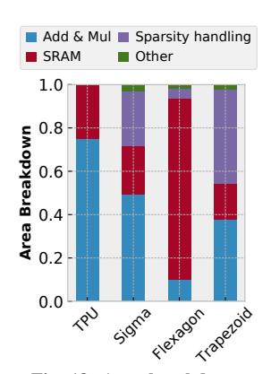

# $\begin{tabular}{ll} TABLE & II \\ CONFIGURATION & AND & AREA & OF & THE BASELINE SYSTEMS. \\ \end{tabular}$

| Component               | Config Area                                                   | $n(mm^2)$ |
|-------------------------|---------------------------------------------------------------|-----------|
| TPUv3-like [33]         | 1GHz, 128×128 MACs, 16MB SRAM, 2TB/s HBM                   | 41.0      |
| SIGMA [60]              | 1GHz, 128×128 MACs, 17MB SRAM, 2TB/s HBM                   | 62.3      |
| Scaled-up Flexagon [50] | 1GHz, 67 Flexagon instances, 67×64 MACs, 67MB SRAM, 2TB/s HBM |           |

### TABLE III DNN workloads.

| DNN        | weight density | activation density |
|------------|----------------|--------------------|
| Llama2-7b  | 0.2-0.6, 1.0   | 1.0                |
| ResNet-0.2 | 0.11-0.22      | 0.27-0.75          |
| ResNet-0.1 | 0.03-0.12      | 0.30-0.76          |
| VGG-0.32   | 0.27-0.53      | 0.26-0.71          |
| VCC 0.1    | 0.1            | 0.20.0.75          |

TABLE IV HS MATRICES.

| Name            | density | rows   | nnz     | name       | density | rows   | nnz     |
|-----------------|---------|--------|---------|------------|---------|--------|---------|
| p2p-Gnutella24  | 9.3e-5  | 26518  | 65369   | sme3Db     | 2.5e-3  | 29067  | 2081063 |
| sx-mathoverflow | 3.9e-4  | 24818  | 239978  | poisson3Da | 1.9e-3  | 13514  | 352762  |
| ca-CondMat      | 3.5e-4  | 23133  | 186936  | wiki-RfA   | 1.5e-3  | 11380  | 188077  |
| Oregon-2        | 3.5e-4  | 11806  | 65460   | ca-AstroPh | 1.1e-3  | 18772  | 396160  |
| email-Enron     | 2.7e-4  | 36692  | 367662  | msc10848   | 1.0e-2  | 10848  | 1229776 |
| opt1            | 8.1e-3  | 15449  | 1930655 | ramage02   | 1.0e-2  | 16830  | 2866352 |
| scircuit        | 3.3e-5  | 170998 | 958936  | cage12     | 1.2e-4  | 130228 | 2032536 |
| gupta2          | 1.1e-3  | 62064  | 4248286 |            |         |        |         |

language model with dense activations. For MS×D, we use a sequence length of 1024 and follow recent work that sparsifies GPT networks [15, 40]: we conduct magnitude-based pruning on the weight matrices of 3 Llama-2-7B [67] projection layers to match the density levels in this recent work: 0.2, 0.3, 0.4, 0.5, 0.6. For MS×MS, we prune ResNet-50 [29] to average weight densities of 0.1 and 0.2 using STR [41], and pick 8 convolution layers per model. We also conduct magnitude-based pruning on VGG-16 [62] to density 0.1 and 0.32 and use all 11 convolution layers. Sparse activations are extracted by running the pruned model on ImageNet [11]. We also evaluate end-to-end performance on these DNNs, pruned to different degrees.

Combinations involving HS inputs use matrices from SuiteS-parse [38]. For  $\mathbf{HS} \times \mathbf{D}$ , we select 12 diverse matrices and multiply them with a randomly generated 1024-column dense B matrix; this is representative of e.g. solvers with multiple right hand sides. For  $\mathbf{HS} \times \mathbf{MS}$ , the same 12 matrices are multiplied

with 3 randomly generated 1024-column sparse B matrices with density 0.2, 0.4, 0.6. For  $\mathbf{HS} \times \mathbf{HS}$ , we evaluate  $A \times A^T$  for the 12 matrices (matching the workload of prior HS accelerators). Tiling: We conduct coordinate-space [32] and occupancy-based tiling [54] on the inputs to maximize data reuse and on-chip buffer utilization similar to prior work [50, 60, 79]. For TrIP, we perform coordinate-space tiling on K and occupancy-based tiling on K and occupancy-based tiling on K and occupancy-based tiling on K and occupancy-based tiling on K and occupancy-based tiling on K and occupancy-based tiling on K and occupancy-based tiling on K and occupancy-based tiling on K and occupancy-based tiling on K.

### V. EVALUATION

### A. Area

Table I shows the area breakdown of Trapezoid and Table II reports the overall area of the baseline accelerators. Trapezoid is  $81.9 \, \mathrm{mm^2}$  at 16nm, which is  $2.0 \times 100 \, \mathrm{mm^2}$  larger than TPU and  $1.3 \times 100 \, \mathrm{mm^2}$  transportance of the SIGMA at iso-throughput configurations (32 TFLOPs).

Fig. 18 shows the area breakdown of all accelerators. TPU, SIGMA, and Trapezoid dedicate a significant fraction of area to compute to ensure high throughput on dense inputs. The area overhead of

Fig. 18: Area breakdown.

Trapezoid over TPU mainly comes from the sparsity handling hardware (distribution network, multi-fiber intersection unit, merge-reduction tree), which occupies half of the PE row area. The additional A distribution network and multi-fiber intersection unit in Trapezoid contributes to a modest 30% area increase over SIGMA but improves performance significantly. Flexagon, on the other hand, spends most of the area on buffers to overcome the memory bottleneck with HS inputs, and therefore cannot offer high performance on denser cases due to the insufficient compute resources. Trapezoid's novel multi-level memory hierarchy design enables the same traffic reduction and high gather bandwidth while keeping total capacity modest.

