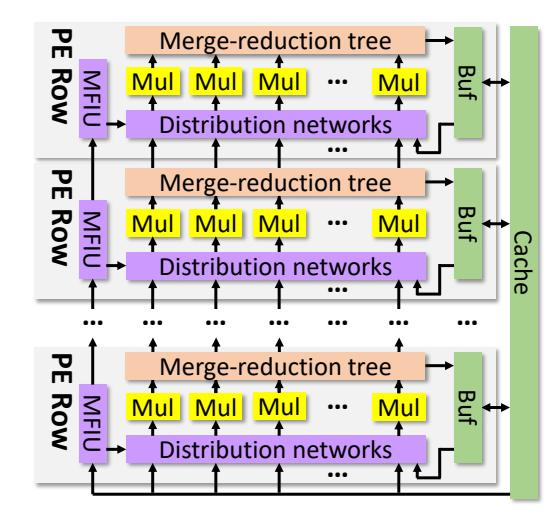
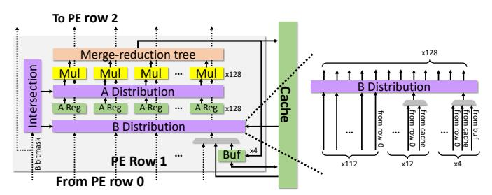

# *A. Spatial arrays for dense matrix multiplication*

Dense matrix multiplication is regular and has plentiful data reuse. Dense accelerators, like the TPU [\[33,](#page-13-12) [34\]](#page-13-10), adopt a 2D spatial array designed to exploit these features. [Fig. 4a](#page-2-0) shows a P × P TPU array, with a grid of multiply-and-accumulate (MAC) units, each connected only to its neighbors.

[Fig. 4b](#page-2-0) shows mapping the dense IP matrix multiplication dataflow to the TPU. The M and K loops are mapped spatially to the vertical (Y) and horizontal (X) dimensions. (assume M and K match the PE array dimensions; if they exceed them, they can be tiled). In this way, each element of A is stationary in a MAC unit. Each cycle, a column of B is fed to the first row of the array, and successive B columns move through the array using the vertical links. Each row of the 2D array performs a dot product between a row of A and a column of B; each PE computes a different partial product, and partial products are accumulated horizontally (along the K dimension), producing a column of C at a time.

This 2D spatial array achieves high data reuse and compute intensity, delivering quadratic compute throughput (P 2 MACs/cycle) with linear communication from the outside (P input and output values/cycle). Communication within the array is local, between adjacent MAC units, and thus cheap. Therefore, most area is spent on compute units.

### *B. Leveraging mildly sparse (MS) inputs*

Mildly sparse (MS) matrices, with 1-90% nonzeros, are common in domains like deep neural networks (DNN) [\[28\]](#page-13-2). Both

weight and activation matrices can be sparse due to weight pruning and activation functions like ReLU [\[51\]](#page-14-12), but a substantial fraction of nonzeros remains. Exploiting this mild sparsity can bring significant speedups, e.g., if both inputs are 90% sparse, the number of MACs can potentially be reduced by 100×.

The level of sparsity greatly affects the effectiveness of different dataflows: with sparse matrices, the coiteration loop implies an *intersection*, and values produced below the coiteration loop must be *reduced*. IP performs *element-level* intersections and reductions: it intersects the coordinates of each row and column to find the k coordinates where both are nonzero. Those nonzeros are multiplied, then reduced to produce one output element. Element-level reductions are simple (needing just an accumulator), but intersections are frequent (M × N of them) and they become very inefficient as sparsity grows, because matches on k coordinates will be very rare. For example, in [Fig. 3,](#page-1-1) only one element from A's row and B's column results in an effectual intersection; the others are at non-matching coordinates.

OP, by contrast, performs *matrix-level* intersections and reductions: each of the K outer products is a successful intersection if the input A column and B row have *any* nonzero, so unlike IP, there are very few intersections (only K) that are trivial to perform. The tradeoff is that OP reduces K matrices, so reductions are complicated and may cause excessive data movement, e.g., to store and align these partial products.

Finally, Gustavson performs *row-level* intersections and reductions, balancing their cost: each element of A is intersected with a row of B, so there are as many intersections as *nonzeros* in A, and each intersection succeeds if B's row is not empty; and reductions happen on partial output rows.

In general, for MS inputs, IP's intersections can still be made reasonably efficient. For example, if nonzero coordinates are represented using bitvectors (a space-efficient choice with mild sparsity), intersections can be computed cheaply at high throughput, by ANDing bitvectors. If matrices have p = 20% density and coordinates are uniformly distributed, only one out of 1/p2=25 intersections yields a match on average, but ANDing 25 bits/cycle is cheap compared to the multiply-accumulate induced by the match. But highly sparse inputs make IP very inefficient, and using another dataflow becomes necessary.

SIGMA [\[60\]](#page-14-5) is an IP-based accelerator that builds on a 2D spatial array. SIGMA achieves quadratic compute with linear inputs and outputs, like dense accelerators, with modest additions. SIGMA packs A's nonzeros, placing them sequentially into each row of PEs. It then streams B columns like in the dense array (Sec. [II-A\)](#page-2-1). Each row of PE computes a few elements of C, as many as rows of A are mapped. The challenge is that B elements need to be routed to matching A nonzeros. This requires all-to-all communication *within each row of PEs*; SIGMA presents an efficient Benes *distribution network* that achieves this with modest overheads, adding about 30% area to a dense array. In addition, partial results of multiple output elements need to be reduced separately; since each A row is placed sequentially, a cheap reduction tree accomplishes this.

SIGMA maintains the high arithmetic intensity and reuse of a 2D spatial array (quadratic operations for a linear amount of inputs and outputs). However, SIGMA works well only with modest sparsity: it exploits one-sided sparsity of A, but not of B in MS×MS, which is fed uncompressed (i.e., including zeros).

Alternatively, DSTC [70] extends a 2D array to accelerate MS×MS using an OP-based dataflow. OP lets DSTC exploit dual-sided sparsity, unlike SIGMA. OP makes it trivial to produce partial products: nonzeros of each column of A and row of B are streamed into the array packed, resulting in full utilization of MAC units. The problem is that each partial product must be streamed out of the 2D array, buffered, and reduced. This sacrifices a key advantage of 2D spatial arrays: quadratic compute now requires quadratic output, instead of linear, so it is not possible to scale to large 2D arrays. Moreover, the merging step requires complex hardware, as nonzeros must be scattered to their correct locations for reduction.

These tradeoffs make IP a more efficient choice for MS inputs; Trapezoid builds on SIGMA with a new IP-based dataflow, TrIP, and hardware that enables dual-sided MS sparsity.

### C. Leveraging highly sparse (HS) inputs

Domains like graph analytics and scientific computing use highly sparse (HS) matrices, with < 1% and often many fewer nonzeros (e.g., 0.0001%).

Multiplying HS matrices causes low arithmetic intensity and reuse, as each input of A and B contributes to one or a few outputs of C. Thus, data movement becomes the key concern.

As we discussed, IP is inefficient for HS inputs because it's dominated by ineffectual intersections, leaving OP and Gustavson. Early HS×HS accelerators OuterSPACE [58] and SpArch [81] are OP-based, but OP's large partial result matrices add data movement. Thus, all recent HS×HS accelerators, including MatRaptor [64], Gamma [79], Flexagon [50], and Spada [43], leverage a Gustavson-based dataflow.

Gustavson has two advantages over OP. First, it greatly reduces the complexity of reductions; in practice, this means worse reuse of B for much better reuse of partial outputs, trading more reads for fewer writes+reads. Second, Gustavson leverages structure in A: in many applications, nearby rows of A have matching nonzeros. This causes repeated accesses to the same rows of B. Gamma [79] uses a special cache, the fibercache, to exploit this reuse, achieving close to compulsory traffic.

Recent accelerators can support multiple dataflows: Flexagon [50] presents a Merge-Reduction Network (MRN) that can be used as a reduction tree when running IP or as a merger (to facilitate reduction) when running Gustavson or OP. Spada [43] proposes a configurable window-based dataflow that acts as IP, Gustavson, or OP depending on window size.

Unfortunately,  $HS \times HS$  accelerators lack the compute throughput and scalability of  $D \times D$  and  $MS \times MS$  accelerators. First, they dedicate most area to caches, buffers, and structures to support HS, like mergers. Second, they use crossbar-based networks between PEs and on-chip storage, which are flexible but sacrifice the scalability of a 2D spatial array.

Trapezoid addresses these limitations by cheaply supporting two Gustavson-based dataflows (TrGT and TrGS) in its 2D spatial array, which retains high throughput. We observe

Fig. 5: Trapezoid architecture overview.

Fig. 6: PE row microarchitecture.

that flexible interconnects in prior accelerators stem from Gustavson's need to perform gather loads; we introduce a multi-level memory hierarchy that increases gather bandwidth with a small amount of shared storage.

### III. TRAPEZOID ARCHITECTURE

**Overview and supported dataflows:** Fig. 5 shows an overview of Trapezoid's hardware. We build Trapezoid by extending a 2D spatial array (128×128 PEs in our implementation), which excels at dense matrix multiplication and supports the standard IP dense dataflow from Sec. II-A.

To efficiently support MS inputs, Trapezoid implements a new IP-based dataflow, *TrIP*, by extending the spatial array: each row of the array, called the *PE row* and shown in Fig. 6, has a local buffer, a multi-fiber intersection unit (MFIU), two distribution networks, and a merge-reduction tree to support TrIP.

To efficiently support HS inputs, Trapezoid implements two new memory-efficient Gustavson-based dataflows, *TrGT* and *TrGS*, 1 which process sparse rows of *B* temporally (TrG<u>T</u>) or spatially (TrG<u>S</u>). We introduce a multi-level memory hierarchy with row-local buffers and a global cache to handle Gustavson's data movement, and reuse TrIP's hardware extensions as well.

These four dataflows let Trapezoid work well across inputs with all sparsity combinations: the standard IP dataflow handles  $D \times D$ ; TrIP handles  $MS \times D$  and  $MS \times MS$ ; TrGT handles  $HS \times HS$ ; and TrGS handles  $HS \times MS$  and  $HS \times D$ .

1To distinguish them easily, we read TrGT as target and TrGS as targus.

Fig. 7: Example of Trapezoid running IP for D×D.

**Matrix formats:** Trapezoid supports the most efficient formats for matrices of different sparsity levels: compressed sparse row/column (CSR/CSC) formats for HS inputs, where each sparse *fiber* (compressed row or column) is stored as a list of nonzero values and their coordinates; and variants of these formats where the nonzero coordinates are represented using *bitmasks* instead, which are more efficient for MS inputs.

In this section we introduce Trapezoid dataflow by dataflow, presenting detailed examples and introducing the novel hardware components that enable each dataflow.

