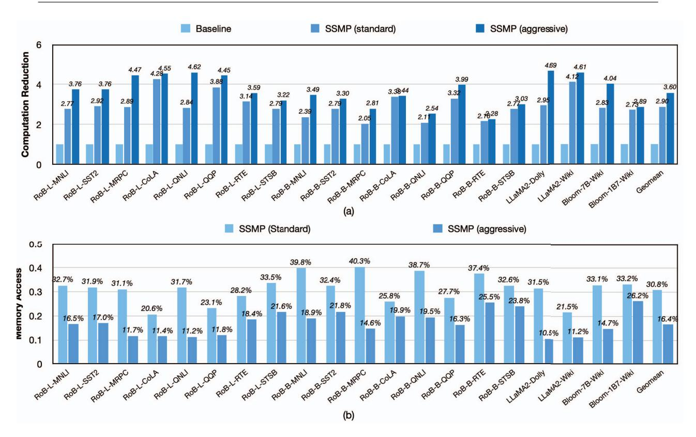
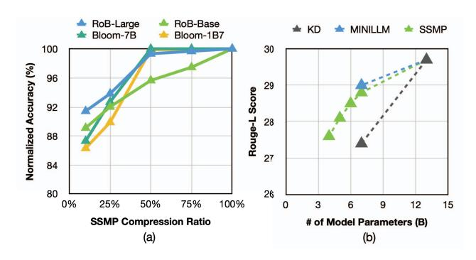
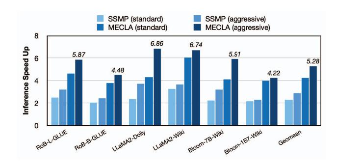
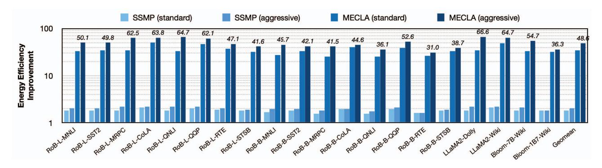
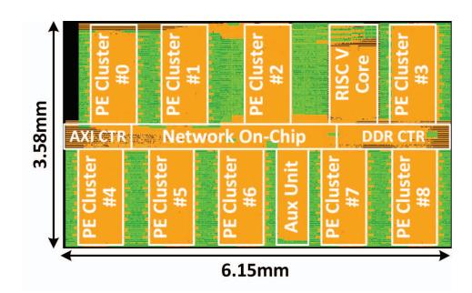
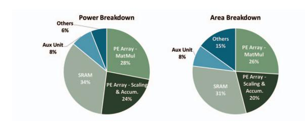

# *D. Outer-product Reuse and Inner-product Re-association*

Given a matrix partitioned by the SSMP method, it shows different data reuse features from inner-product and outerproduct perspectives. This section shows how MECLA's PE array deals with the two situations.

If the weight matrix emphasizes outer-product reuse, its matrix-vector multiplication can be illustrated as shown in Figure 8(a) after grouping the related rows (indicated with the same color) together with the regrouping method in Section IV.C. In this example, the weight data is regrouped by reordering the output channel. The 4x4 weight matrix can be viewed as a 4×1 scaling vector multiplying a 1×4 weight vector. The former is a slice of DS, and the latter is a slice of SS. According to the associative law of matrix multiplication, the 1×4 weight vector can be multiplied with the 4×1 input vector first to obtain a 1×1 shared PSum, followed by the multiplication between PSum and 4 scaling scalars. In terms of the data mapping, the 4 weight data is stored in 4 PEs in one row a 4×4 PE array, and the scaling factor a, b, c is stored in the scaling multiplier array, and the unused scaling multipliers are gated for energy saving. Similarly, the other 12 PEs compute the PSum of another three 1×4 SS weight slices with the same input.

When the weight matrix has more inner-product reuse, the aforementioned PSum sharing strategy can no longer improve the efficiency. MECLA adopts computation re-association for this issue, as shown in 8(b). The weight data in SS is regrouped by re-ordering the input channel, and a 4×4 weight matrix can be viewed as a 4×1 weight vector multiplying a 1×4 scaling vector. Unlike the outer-product mode, MECLA computes the multiplication of the scaling vector and the input vector first with the PEs, and then multiplies the PSum with the weight data in the scaling multiplier array.

MECLA's data mapping and reuse mechanism does not treat the weight matrix in its original sequence. It dynamically regroups the matrix and swap the multiplication order to ensure data reuse. By reusing the PSum, the number of computation operations is reduced from 28 muls and 16 adds to 4 muls and 4 adds, and the power consumption is reduced by 85.6% in the given example.

### E. Design Details

Operation and pipeline overview. MECLA uses fully pipeline dataflow under the control of the RISC V core to guarantee hardware utilization. The processor takes an input matrix and a weight matrix from DDR decomposed by SSMP as input to generate the output of a whole attention layer. As soon as the inputs are ready, the auxiliary unit performs the preprocessing, such as embedding and normalization. The result returns back to the data buffer and the accelerator starts computing the matrix multiplication with SSMP weight. During the computation, the controller finds the optimal mapping strategy and data reuse pattern and maps the weight data, composed by SS sub-matrix in SS buffer and DS scaling scalar in DS buffer into the PE array. The SSMP multiplication applies to the QKV linear and FFN linear of a transformer layer, which is the absolute dominant computation and memory access bottleneck according to the analysis in Section II. Note that there are a few matrix partitions that cannot be decomposed with SSMP, and the processor fetches these weight data and compensates them with standard matrix multiplication as soon as the corresponding input tokens are mapped onto the PE array and finishes the computation with SSMP partitions. Along with the QKV linear, the DDR fetches the KV cache to the SS and DS buffer for attention computation, which starts when the QKV linear finishes. This memory access and computation scheme is applied to all the computations until the processor calculates the output token embedding.

Memory modules. MECLA contains three SRAM implemented on chip, and is designed for LLM inference with 8b. The 256KB data buffer is used to store the token, intermediate and output matrix. A typical input vector of LLM has an embedding dimension of 16384 (in the linear layer of 7B scale model), which requires 16KB for one token vector. Due to parallelism strategies, input prompt and batch concerns, we support at most 16 tokens to store on-chip. The Src sub-mat buffer and scaling scalar buffer are used to store the weight with SSMP. A typical static weight in LLM can be reduced to 64KB-1MB, and the two buffer is capable for the majority of

situations. Larger weights are split into several output channels for sequential computation. Additionally, these two buffers stores the weight matrix which cannot apply SSMP and the KV cache. It stores a maximum of 4k token length of a single head in a typical 7B scale LLM.

**PE array and scaling multiplier.** The PE array of MECLA is designed for PSum reuse. However, SSMP has various configuration and reuse patterns, which require a reconfigurable PE array to suit all the cases. We use a 4×4 PE array along with 4×4 scaling multipliers as the basic unit. According to algorithm evaluation results (detailed in Section V.II), the max reust times is set at 32, and 8 basic units forms a group. The 8 scaling multipliers in a group communicate with each other using the internal crossbar, which supports sharing the PSum results for more reuse times.

#### V. EVALUATION

### A. Experiment Setup

Workloads and setup. We use several language models and tasks to evaluate the SSMP and MECLA processor. The models include open-source language model RoBERTa base, RoBERTa large [44], Bloom 1B7, Bloom 7B [84], and LLaMA-2 7B [72]. We use 10 tasks in total, including 8 tasks from general language understanding evaluation (GLUE) datasets [75] (linguistic acceptability CoLA [81], sentiment analysis SST-2 [67], sentence similarity and paraphrasing MRPC [19], QQP, and STS-B [9], and natural language inference MNLI [82], question answering QNLI [60], and textual entailment RTE [17]), databricks-dolly-15k general natural language processing, and wikitext-2 language modeling task [49]. We use the PyTorch [53] and Hugging Face library [83] to implement the model with SSMP, and use RoBERTa large, Bloom 7B, and LLaMA 13B as the teacher models to finetune the SSMP model with knowledge distillation. In each fine-tuning, we use a learning rate of {5e-4, 1e-4, 5e-5} and batch size of {16, 32} and train the model for 20 epochs. After the fine-tuning, we capture the model weight and run-time activation data to perform post-layout hardware simulation to obtain the hardware metrics.

Hardware implementations. We perform RTL design for MECLA processor and complete the synthesis using Synopsys Design Compiler under 28nm CMOS technology. We use Synopsys IC Compiler II to complete the placement and routing for the chip and generate the netlist and post layout, as shown in Figure 13. To obtain the power and latency, we use Synopsys VCS and PrimeTime tools for post-layout power analysis with the data and waveform captured from PyTorch as mentioned above.

### B. Accuracy and Model Compression Evaluation

We use the fine-tuned pre-trained language models to evaluate the model accuracy of SSMP method with a total of 20 models and tasks. SSMP has 4 configurable hyperparameters:  $[x,y,n_x,n_y]$ , and the model's compression ratio increases as each value gets larger. All the linear layers of a model share the same set of  $[x,y,n_x,n_y]$  under a

TABLE II
ACCURACY OF DIFFERENT LANGUAGE MODELS WITH MECLA OPTIMIZATION

| Model              | RoBERTa Large |       |      |      |      |      |      | RoBERTa Base |      |       |      |      |      | LLaMA-2 7B |      | Bloom 7B | Bloom 1B7 |       |       |       |
|--------------------|---------------|-------|------|------|------|------|------|--------------|------|-------|------|------|------|------------|------|----------|-----------|-------|-------|-------|
| Task               | MNLI          | SST-2 | MRPC | CoLA | QNLI | QQP  | RTE  | STS-B        | MNLI | SST-2 | MRPC | CoLA | QNLI | QQP        | RTE  | STS-B    | Dolly     | Wiki2 | Wiki2 | Wiki2 |
| Baseline           | 90.6          | 96.2  | 90.2 | 68.2 | 94.8 | 91.6 | 85.2 | 92.3         | 87.5 | 95.1  | 89.7 | 63.4 | 93.3 | 90.8       | 86.6 | 91.5     | 29.7      | 5.9   | 12.3  | 29.9  |
| MECLA (standard)   | 89.8          | 96.0  | 89.5 | 67.3 | 94.1 | 90.9 | 84.5 | 92.2         | 87.1 | 95.0  | 89.6 | 62.8 | 93.2 | 90.7       | 86.0 | 91.2     | 29.6      | 6.1   | 12.8  | 30.0  |
| MECLA (aggressive) | 88.9          | 94.6  | 88.6 | 66.4 | 93.7 | 90.0 | 83.5 | 90.9         | 86.1 | 93.7  | 88.6 | 61.9 | 91.7 | 89.7       | 85.6 | 90.3     | 28.1      | 6.4   | 13.4  | 30.6  |

Fig. 9. Model inference computation reduction (a) and memory footprint reduction (b) on MECLA processor with SSMP method.

Fig. 10. SSMP compression for different scale language model (a) and comparison with state-of-the-art distillation methods (b).

given configuration of fine-tuning. We set the search space of each hyperparameter in  $\{2,4,8,16\}$  and use grid search and successive halving method to get the configuration within

the finetuning of each task. Since MECLA and SSMP are designed for efficient inference, and the fine-tuning parameter is also reduced greatly by SSMP, we assume this search effort is acceptable.

For the accuracy baseline, we use the accuracy of models fine-tuned with LoRA (dim=16) [30] with the same training parameters. Based on the baseline accuracy, we obtain two settings of MECLA: standard and aggressive. MECLA standard refers to the setting with the smallest computation and memory access effort while the accuracy degradation is within 2% for GLUE tasks and 5% for wikitext language modeling perplexity and dolly Rouge-L score. MECLA aggressive refers to the smallest model setting within 5% accuracy degradation for GLUE and 10% for wikitext or dolly. Table II shows the end-to-end accuracy (F1 for MRPC, QQP, accuracy for SST-2, QNLI, MNLI, RTE, Matthews correlation for CoLA, Pearson correlation for STS-B, perplexity for wikitext-2 language modeling, and Rouge-L score for dolly dataset).

As shown in the results, using SSMP for inference is

feasible and introduces decent degradation. For example, when processing the GLUE benchmark with RoBERTa large model, the SSMP introduces an average of 0.6% / 1.1% with standard / aggressive SSMP, respectively, let alone its capability for reducing the computation and memory access efforts. This feature guarantees outstanding acceleration of MECLA since a high compression ratio with SSMP is guaranteed from the perspective of accuracy.

Figure 10(a) shows the SSMP performance with different scales of RoBERTa (base and large) and Bloom (1B7 and 7B) models. Since SSMP detects and removes the duplicated computation of the big weight matrix according to a given ratio, it works for models with different scales. E.g., when reducing approximately 50% of weight parameters with SSMP, the Bloom 1B7 and Bloom 7B show 1.2 and 0.7 increase of wikitext-2 perplexity. The result also shows that for larger scale LLMs, the SSMP can achieve higher compression ratio given the same accuracy loss limitation. This is because the occurrence probability of sub-matrix similarity increases due to larger weight matrix dimension, which leads to better SSMP compression performance.

Figure 10(b) compares the LLaMA model compression results of SSMP method with state-of-the-art LLM compression methods: knowledge distillation (KD) and MiniLLM [26]. They all use the LLaMA 13B as the teacher for distillation. Compared to naive KD, SSMP can better preserve the capability to process general language tasks of LLM. When the compressed model has approximately 7B parameter number, the Rough-L score of SSMP is 1.4 higher than KD, and is only 0.2-point less than the LLM-oriented fine-tuning method MiniLLM. The number of parameters with SSMP is less than 57.1% of KD when achieving the almost the same Rouge-L score of 27.4. Further, unlike KD and MiniLLM, which involve distilling a large-scale LLM (13B) into a fixed-scale smaller LLM (7B), the SSMP method aims to find out and avoid computational redundancies within the LLM. Therefore, SSMP offers more choices in terms of parameter quantity and precision. Within 1-point score degradation compared to the MiniLLM 7B distillation, the SSMP provides 3 compression options from 5B to 7B. Thus, SSMP yields LLM compression results comparable to state-of-the-art methods while offering a broader range of model sizes suitable for various devices, facilitating a nuanced balance between model performance and storage constraints. Notably, SSMP introduces the potential for computational reuse, further enhancing its versatility and applicability in practical scenarios.

### *C. Performance Evaluation*

To evaluate the performance with MECLA, we obtain the runtime input and weight data from PyTorch. We split the weight data into SS and DS matrices of SSMP and generate the RISC-V instructs based on model information, such as matrix dimensions. We use these data to perform post-layout simulation with VCS to obtain the hardware performance, and we use DDR4 simulator to simulate the data load movement for MECLA processor. Figure 11 shows the computation and

Fig. 11. Inference speed up with SSMP on GPU and MECLA processor.

memory reduction of MECLA with no optimization and the proposed features. Since the SSMP is able to compress the 7B or 13B-scale LLM down to half or even one-tenth, current consumer-level devices have enough DRAM to store the complete model, thus we do not consider model parallelism in figure 11's evaluation. MECLA standard / aggressive achieves an average reduction of 65.5% / 72.2% in computation and 69.2% / 83.6% in memory footprint across 20 benchmarks.

We also compare MECLA's inference performance on single 32GB NVIDIA V100 GPU. Since the peak performance of V100 is 125TOPS (INT8, 1GHz), we use 32 MECLA processors (total with 131.2TOPS@INT8) with data and model parallelism for performance comparison. We set each MECLA processor to have a maximum of 8GB of external memory for storing data. For models with storage requirements of less than 8GB, such as RoBERTa, Bloom 1B7, and highly compressed LLaMA 7B, 32 MECLA processors utilize data parallelism to maximize throughput. However, for other scenarios, such as LLaMA and Bloom 7B with compression rates lower than 50%, we employ 2-model parallelism and 16-data parallelism to meet computational demands. The data bandwidth between parallel MECLA processors is set 900GB/s as NVlink in our simulation. Additionally, since both the V100 and the MECLA cluster can store the whole model and all the cached files with its memory in the evaluation case, thus we ignore all the external memory access costs such as weight data load for the two hardware platforms. According to the experiment results, using SSMP standard / aggressive on V100 achieves 2.32× / 2.88× of inference speed improvement on an average of 20 benchmarks, with a peak improvement of 3.29× / 3.75× at the wikitext and dolly general language task with LLaMA. The improvement is limited because of two reasons. 1) Although the SSMP reduces the parameter amount, the GPU still needs to recover the matrix, which introduces extra computation requirement. 2) Small proportion of SSMP weight matrix cannot be partitioned into SS and DS and needs sparse matrix computation, which suffers from low utilization on GPU compared to ASIC processors. With the aid of specifically designed circuits in MECLA, the throughput improvement reaches an average of 4.25× / 5.28×, and the peak gain is up to 6.26× / 6.86× compared to naive inference on V100.

Fig. 12. Energy efficiency improvement and breakdown analysis. +SSMP: V100 with SSMP method. +MECLA: MECLA processor with SSMP method.

Fig. 13. Post layout of MECLA processor.

Fig. 14. Power and area breakdown of MECLA processor.

