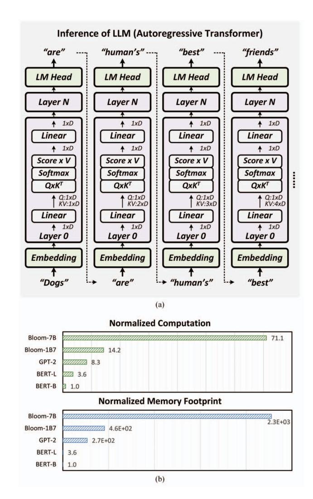
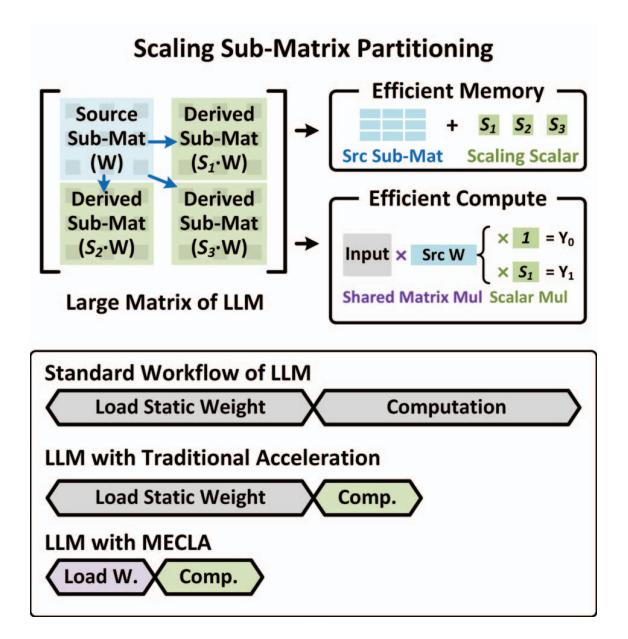
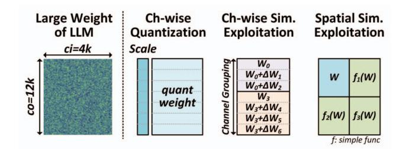
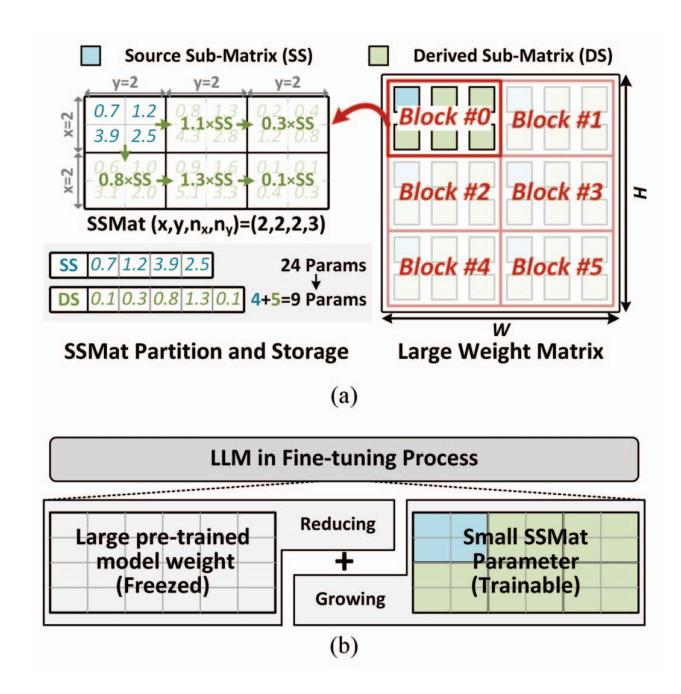
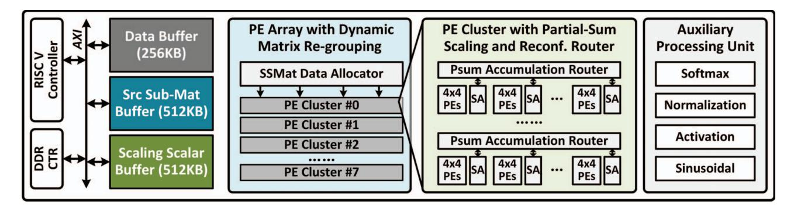

# I. INTRODUCTION

Large language models (LLMs), such as GPT-4 [50], PaLM [2], [14], and LLaMA [71], [72], mark a significant milestone of the Transformer model [73] in the field of artificial intelligence. LLMs have exhibited remarkable capabilities in natural language processing (NLP) and beyond, giving rise to innovative applications, including recommendation systems [4], [23], chatbots [50], [92], logic reasoning assistance [3], [37], etc. The immense power of LLMs has sparked a new trend in its adoption from cloud-based computing to end devices [92]. However, LLM inference is so compute and memory intensive that requires quite a lot of hardware resources such as GPUs. For instance, GLM-130B (INT4), being the only 100Bscale LLM that can run inference on consumer-grade GPUs, demands 4×RTX 3090 (24GB). Even the smallest LLaMA requires 14GB memory and 14 billion operations for a singleword response, which is 4.6× higher than the largest GPT-2. Given these substantial memory and computation burdens, a memory-compute-efficient LLM inference hardware system becomes of paramount importance.

LLM is based on the autoregressive Transformer structure [58], [59], commonly referred to as a *decoder*. It has two main features. First, it takes the user's input prompt and generates the output tokens one by one, as shown in Figure 1(a). Each newly generated token is computed based on the given input



Fig. 1. Workflow of large language model (a). Normalized computation and memory effort comparison of LLM and traditional Transformers (b).

and all the previously generated output tokens. Whenever a new output token is computed, it is combined with the previous outputs for the next token generation. This process iterates for several tens to thousands of times until the whole output is completed. Such an autoregressive generation process results in a substantial amount of weight parameter access since the computation unit accesses the entire model's weight from beginning to end for each new output computation. While previous *encoder* Transformer like BERT [18] uses non-regressive inference and accesses the weight only once. Second, LLM has significantly larger dimensions after scaling compared to traditional Transformers, which further exacerbates the issue of weight access and introduces a substantial computational load. For example, a typical LLM Bloom-7B requires about 8.53× more memory access and operations for generating one output token compared to GPT-2.

We analyze the computation and memory efforts of LLM



Fig. 2. Principle of scaling sub-matrix partitioning (SSMP) method and optimization coverage comparison with previous works.

and traditional Transformers, and Figure 1(b) shows the results. The computation effort increases several dozen times, and the memory footprint increases over four orders of magnitude. Additionally, [55] shows that the computation of linear layers is dominant in most Transformer models and tasks. Our experiment shows that this trend still exists in LLM tasks. The memory and computation effort of linear layers takes up over 98% of the total when generating sentences with Bloom-1B7 and Bloom-7B. Therefore, the key to efficient LLM lies in the memory and computation of linear layers.

Based on the aforementioned observations for LLM inference efficiency, we propose the scaling sub-matrix partition (SSMP) method, a hardware-friendly matrix partition method enabling high parameter efficiency. Figure 2 illustrates the approach. For the substantial static weight of LLM linear layers, SSMP employs a "generative sub-matrix" strategy. It decomposes the large-scale weight matrix into small-scale *source sub-matrices* (SS) and *derived sub-matrices* (DS). Each SS is linked to a number of DSs nearby, and each DS can be obtained by multiplying a scaling scalar with its corresponding SS. By this means, accessing a linear layer no longer requires reading the full matrix, but only need to read the SS parameters and scaling scalar of each DS, and the whole weight matrix can be re-generated on-chip. Since all parameters in a DS share the same scaling scalar, SSMP method reduces the memory footprint greatly.

In addition, SSMP method is of great potential to improve computation efficiency. Intuitively, SS and DS differ only by a scalar factor. In matrix multiplication, for SS and DS corresponding to the same input channels, their partial sums (PSum) also differ by the same scalar factor. This characteristic can avoid redundant block matrix multiplication calculation according to the size of SS and the number of DS belonging to an SS. Utilizing this feature with specially designed circuits can gain computation efficiency.

We propose a hardware accelerator, MECLA, based on the SSMP matrix partition method and computation optimization to achieve memory-compute-efficient LLM inference. Experiment on 20 evaluation tasks shows MECLA reduces static memory access by 83.6% and improves computational efficiency by 5.27× on the geometric average. It achieves an energy efficiency of 7088GOPS/W, which is 113.14×, 12.99×, and 1.62× higher than running the same tasks on NVIDIA V100 and state-of-the-art accelerator SpAtten [77] and FACT [55]. Our key innovations are as follows:

- We propose SSMP, a parameter-efficient matrix partition method that splits a large weight matrix into small SS and DS sub-matrices while DS can be obtained by scaling SS.
   Fine-tuning method for training weight into SSMP is also provided.
- We propose matrix regrouping and matrix-multiplication re-association mechanism, which dynamically adjusts the matrix multiplication workload and matrix arrangement so that the hardware can fully utilize the PSum reusability brought by SSMP for efficiency.
- We design MECLA, a specialized hardware accelerator that exploits parameter and computation efficiency for LLM inference. Experiment on several typical LLM models and tasks demonstrates its capabilities and efficiency gain over conventional hardware.

### II. BACKGROUND AND MOTIVATION

In this section, we demonstrate the process of typical LLM inference and the challenges in terms of memory and computation during the inference process.

### A. Language Modeling Task and Models

The core of LLM is language modeling. It models the probability of a token sequence  $(x_1, x_2, ..., x_n)$ , where a token can be a word, sub-word, etc. Because natural language has sequential ordering, researchers use the product of conditional probabilities to factories the joint probabilities of the token sequence [6], [31], as equation 1. This method is referred to as "autoregressive language modeling", which can be used to predict the probability of the next token based on the previous tokens.

$$P(x) = P(x_1, ..., x_n) = \prod_{n=1}^{N} P(x_n | x_1, ..., x_{n-1})$$
 (1)

Transformer models have shown outstanding capabilities in language modeling and become the *de facto* choices [50], [92]. It models the text sequence with the self-attention mechanism, as Figure 1 and Algorithm 1 depict. Given input sequence  $(x_1,...,x_n) \in \mathbb{R}^{n \times d}$ , it first uses QKV linear transformation to project the input into *query*, *key*, and *value* space. Then it computes *attention score* with the obtained *query* and *key*, and the results are used to perform a weighted sum on

### Algorithm 1: Autoregressive Transformer

```
Input: Input prompt I, Transformer model M, max
              output length L_{max}
   Output: Generated output sequence S_{out}
 1 X \leftarrow I;
 S_{out} \leftarrow \{\};
 3 while len(S_{out}) \leq L_{max} and S_{out}[-1] \neq [EOS] do
       for Layer in M do
            if Layer is attention layer then
                q, k, v \leftarrow Layer.QKV\_Linear(X);
 6
                A \leftarrow softmax(q \times k^T/sqrt(M.dim));
 7
                X \leftarrow A \times v;
 8
                X \leftarrow Layer.Linear(X);
 9
            else
10
            X \leftarrow Layer(X);
11
12
13
       end
       S_{out}.append(decode(X));
       X \leftarrow S_{out};
16 end
17 return S_{out}
```

TABLE I
OPTIMIZATION PERFORMANCE COMPARISON OF STATE-OF-THE-ART
TRANSFORMER ACCELERATORS

| Accelerator  | Comp | utation | Memory |     |  |  |  |
|--------------|------|---------|--------|-----|--|--|--|
| Accelerator  | QKV  | FFN     | QKV    | FFN |  |  |  |
| A3 [27]      | No   | No      | No     | No  |  |  |  |
| ELSA [28]    | No   | No      | No     | No  |  |  |  |
| JSSC'22 [80] | No   | No      | No     | No  |  |  |  |
| DOTA [57]    | No   | No      | No     | No  |  |  |  |
| Sanger [46]  | No   | No      | No     | No  |  |  |  |
| SpAtten [77] | Yes  | Yes     | No     | No  |  |  |  |
| FACT [55]    | Yes  | Yes     | Low    | No  |  |  |  |
| MECLA        | Yes  | Yes     | Yes    | Yes |  |  |  |

the value matrix. Finally, it uses linear layers to transform the intermediate results to get the output. According to the decomposition as equation 1, the model generates one new token, such as the next work of the output sentence, during one inference iteration. Then it joins the newly generated token with the previously generated ones as a new input sequence for another inference iteration, and this process continues until the whole output sentence is generated or exceeds the maximum length limitation. This one-by-one generation process is referred to as "autoregressive generation".

### B. Motivation

Running LLMs poses distinct challenges compared to traditional Transformer models such as BERT [18] and GPT-2 [59].

Firstly, LLMs exhibit significantly larger weight matrices, magnitudes beyond those of traditional models. For instance, the GLM-130B model, with an embedding dimension of 12288 and a feed-forward network dimension of 32768, results in a weight size of 402MB for a single layer. This is 96 / 52 times larger than the linear layer of the largest BERT / GPT-2. Consequently, the computational load has increased proportionally. Furthermore, the substantial dimensions lead to a small proportion of attention computation (Q×K<sup>T</sup> and P×V), amounting to less than 2% when the token length is under 1024. These characteristics collectively underscore the challenge of the high computational and storage efforts associated with the linear layer in LLM inference.

The autoregressive generation of LLM worsens the issue. In Algorithm 1, the QKV linear layer (line.6) and linear layer (line.9) both require large amounts of weight data. These weight data cannot be retained in the local cache of the PE array since it is required to run all the other layers before using the weight data again and the weight matrix is too large for local storage. Therefore, with the generation of each new output token, the PE array undergoes a complete traversal of the model data, and this process continues until the inference is complete. This characteristic further exacerbates the memory footprint issue in LLMs. Furthermore, due to the use of matrixvector multiplication in autoregressive computations instead of matrix-matrix multiplication, the lack of input tensor reuse poses a potential underutilization problem. These features make optimization the memory and computation efficiency of LLM linear layer urgent.

Unfortunately, we find out that the state-of-the-art Transformer accelerators cannot solve the aforementioned computation and memory issues effectively. Table 1 provides an overview of the effectiveness of these approaches in optimizing the QKV linear layer and FFN linear layer, which are two main sources of computation/memory bottleneck in LLM. However, the majority of the work [27], [28], [46], [57], [80] concentrates on alleviating the computational bottleneck in attention layers for very long sequences. FACT [55] and SpAtten [77] realize challenges with the linear layer. However, their sparsity method cannot reduce the weight memory footprint. It motivates us to propose a memory-compute-efficient LLM accelerator design.

### III. SSMP PARTITION AND FINE-TUNING

To address the memory bounding issue in LLMs, we propose a novel approach called Scaling Sub-matrix Partitioning (SSMP). This method leverages matrix partitioning and the reuse of intermediate computations to effectively reduce the weight access and computational effort in the linear layers of LLMs, including FFN linear and QKV linear. This section illustrates the matrix decomposition of SSMP and how it is employed in LLMs.

Figure 3 shows our observation for building a memory-compute-efficient LLM design. Since the weight matrix of LLM is huge, such as 4k×11k in LLaMA, it is necessary to compress the weight, and a typical method is to only



Fig. 3. Comparison of memory and compute efficient methods.

keep the important weight which is less than 1% of the total and use quantization like per-channel quantization to compress the rest of the weight [34], [43], [85], which can reduce the 16-bit weight matrix into 8bit or even less. Also, some previous works discover the computation redundancy due to the pigeonhole's principle and exploit the similarity or duplication of weight tensors [64], [87]. These two aspects inspire us to explore the spatial-wise (input-channel or outputchannel) similarity or duplication for weight compression. For one thing, the input and output channel of LLM weight is much more than traditional models, which involves more pigeonhole principle occurrence. For another, extending the similarity from previous channel-wise to 2D spatial-wise can further reduce the computation effort, which is a solution to the LLM memory and computation burden. Additionally, the small amount of important weight remains floating-point, which consumes little memory burden but keeps the accuracy of the model, making sufficient space for compressing the unimportant but massive weight values. Since the amount of important weight is too small compared to the remaining ones, their storage is not explicitly listed out in the rest of the paper for simplicity.

### A. SSMP Partitioning

Figure 4 illustrates the principle of SSMP. It partitions the weight matrix into "source sub-matrix (SS)" and "derived sub-matrix (DS)." Each DS can be obtained by multiplying its corresponding SS by a scaling parameter. The configuration of SSMP is represented by a quadruple  $(x,y,n_x,n_y)$ , where x/y indicates the dimensions of SS in the vertical/horizontal direction, and  $n_x$ ,  $n_y$  indicate the extension numbers of DS in the vertical/horizontal direction. For example, in the case of Figure 4, the SS is a  $2\times 2$  block sub-matrix, covering the remaining 5 DS of the matrix. Therefore, its configuration is (2,2,2,3). Note that all SS and DS in a matrix have the same matrix dimension [x,y], and each set of SS and DS forms a region with the same size  $[x\cdot n_x,y\cdot n_y]$ . The rest of the matrix is composed of the same pattern.

SSMP effectively reduces the number of parameters that need to be accessed during model computation. For a weight matrix of size  $[D_x,D_y]$ , when applied with SSMP with configuration  $(x,y,n_x,n_y)$ , it is divided into  $n=D_xD_y/(x\cdot n_x\cdot y\cdot n_y)$  regions. Each region contains one SS and  $n_xn_y-1$  DS. The storage requirements with SSMP include saving n



Fig. 4. SSMP partition and storage pattern.

SS of size [x,y] and  $n \cdot (n_x n_y - 1)$  scaling parameters. Since scaling is shared within a DS, the storage requirement for each DS is reduced to 1/(xy) of the original. Additionally, as all DS within a region share the parameters of one SS, the storage requirement is further reduced to  $1/(n_x n_y)$  of the original.

Our experimental results indicate that large models can adopt SSMP configurations of (8, 8, 4, 4) or even more aggressive while maintaining acceptable end-to-end accuracy degradation (details in Section V). Under the above condition, SSMP reduces weight memory access by an average of 83.6%. For instance, it reduces the parameters in one linear layer of Bloom-7B from 67.1MB to 5.2MB or even smaller, which significantly optimizes the model's memory access bottleneck.

In addition to reducing memory footprint, SSMP can also reduce computation strength through data reuse. This is because the weights of DS and SS can be scalable with a shared parameter S. From the perspective of the output channel, the two weight kernels (scaled by S) perform matrix-vector multiplication with the same input vector slice, thus their partial sum is also scaled by S. From the input channel perspective, the weights corresponding to the two input tensor slices that need to be accumulated are scaled by S. This scaling can be transferred to the input tensor, and through optimized circuit design, computational power consumption can be further reduced. Theoretically, SSMP configured as (8, 8, 4, 4) can reduce over 72% of computational power consumption. Section IV will demonstrate how we utilize these characteristics to further optimize the hardware implementation for computation.

```
Algorithm 2: SSMP Fine-tuning
   Data: Pre-trained LLM weight W
   Result: SSMP-style LLM weight W'
1 Initialization
        W_{SS}, S, \sigma \leftarrow Init;
2
                                             // Trainable param
       FreezeParam(M);
4 Training Loop
       for trainSet in trainLoader do
5
            W_{DS} \leftarrow W_{SS} \times S;
6
            W_{new} \leftarrow \operatorname{Concat}(W_{SS}, W_{DS}); // SSMP weight
7
            W_{new} \leftarrow \sigma \cdot W + (1 - \sigma) \cdot W_{new};
8
            Output \leftarrow Forward(trainSet, W_{new});
9
            Loss \leftarrow L_{LM}(Output) + L(\sigma);
10
            Update(W_{SS}, S, \sigma);
11
       end
12
13 W' \leftarrow \{W_{SS}, S, \sigma\};
14 return W';
```

### B. Fine-tuning towards SSMP

Although SSMP shows efficient memory and computation characteristics, directly training an LLM with SSMP from scratch is challenging and expensive [92]. We propose an SSMP-oriented fine-tuning method, which fine-tunes a pretrained LLM on an end-to-end task while adjusting its weight characteristics to align with SSMP.

The fine-tuning process is shown in Algorithm 2. It takes the pre-trained model as the input and freezes all the parameters for parameter efficiency. It creates two small learnable tensors: source sub-matrix weight tensor  $W_{SS}$  and derived sub-matrix scaling parameter tensor  $S_{DS}$ . During the training process, the model weight is composed of two parts: the pre-trained weight and the SS/DS weight. While the pre-trained weight is kept frozen, only updating the SS/DS weight, which includes the  $W_{SS}$  and the scaling factor S. In addition, the algorithm introduces a forget factor  $\sigma$  (Line 9) to help turn the weight matrix into SSMP style. The  $\sigma$  is initialized as 1, which means using the pre-trained weight at the very beginning of finetuning. We adopt regularization to punish the  $\sigma$  towards 0, and when its magnitude falls below  $10^{-4}$  which is chosen by experiment, we can safely remove the pre-trained weight and only keep the SSMP weight.

Through fine-tuning, the accuracy of using SSMP can be fully recovered. Note that the trainable parameter, i.e., the  $W_{SS}$ , S, and  $\sigma$  is far smaller than the original weight. Thus the fine-tuning process is parameter-efficient and affordable. This method is similar to LoRA [30] since they both train a "biased" weight with small parameters but with a fundamental difference: it is the efficiency of LLM inference that the proposed method is designed to solve, rather than the training. Section V provides a detailed analysis of the training process and results.



Fig. 5. Overall architecture of MECLA Processor.

