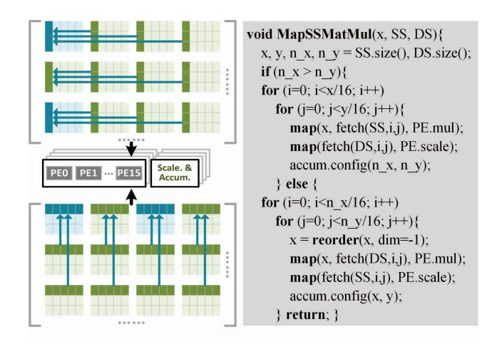
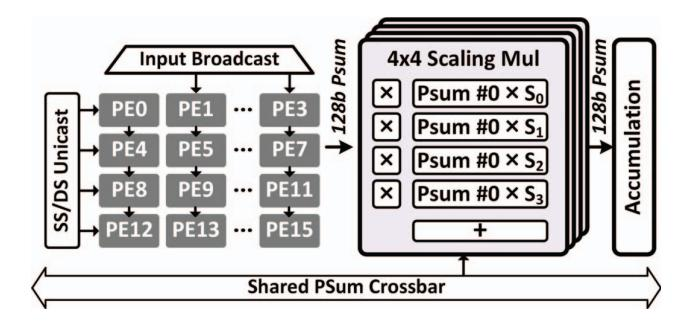
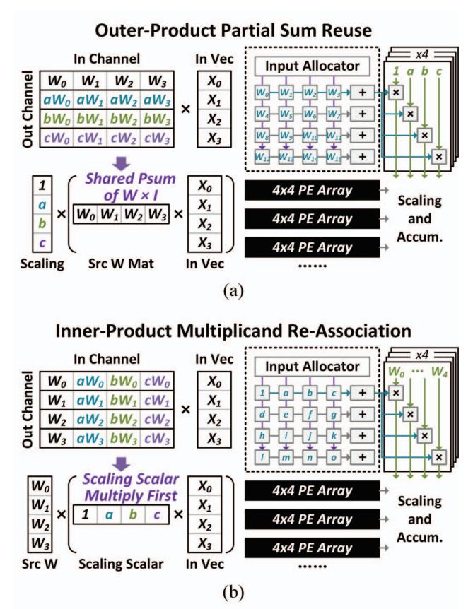

# IV. ARCHITECTURE AND HARDWARE INNOVATION OF MECLA PROCESSOR

#### A. Motivation

Although SSMP provides the potential to improve the memory and compute efficiency of LLMs through the reuse of intermediate data and the reduction of computation strength, it is still a tough task to achieve effective acceleration on traditional general-purpose hardware platforms with rigid dataflow. The first reason is that SSMP requires fine-grained partial-sum level data reuse. The second reason is the reuse matrix varies, i.e., the SS and DS scaling factor matrix can both be the ones to be reused, which cannot be simply handled in previous works. To ensure the efficiency of computing with SSMP, we propose a specialized accelerator: MECLA. This section shows its hardware design details.

### B. Overall Architecture

Figure 5 illustrates the overall architecture of MECLA. It is primarily composed of a RISC-V core, DDR controller, on-chip buffer totaling 1.25MB, 8 PE clusters, and an auxiliary unit. Communication between components is facilitated through the AXI bus. The RISC-V core serves as the central controller of MECLA, fetching instructions from the external host and controlling the processor's operation. The on-chip buffer contains a 256KB data buffer, a 512KB source submatrix buffer, and a 512KB scaling scalar buffer. The input tensor stored in the data buffer is broadcasted to the 8 PE clusters, while the source sub-matrix buffer and scaling scalar matrix buffer are distributed in each cluster. Each PE cluster consists of 16 sets of 4×4 PEs and 16 scaling accumulators (SA). The 4x4 PEs calculate partial sums (PSums) in matrix multiplication, which are multiplied and accumulated through the SA. The auxiliary processing unit is responsible for softmax, normalization, activation, and sinusoidal embedding calculations, ensuring that MECLA fully supports the inference process of LLMs.

As indicated in Section III, SSMP decomposes the weight matrix into several SS and DS, where SS represents weights of size [x,y], and DS can be dynamically generated in real-time by SS and a scaling scalar matrix of size  $[n_x,n_y]$ . MECLA focuses on optimizing computations using this feature. We

Fig. 6. PE workload mapping with source/derived sub-matrix re-grouping.

propose an on-the-fly matrix regrouping and dual-mode mapping strategy to achieve these objectives. The following two subsections will elaborate on these designs.

### C. PE Array Design and On-the-fly Matrix Regrouping

MECLA applies reordered data mapping to exploit PSum reuse. After reading SS and DS, the matrix can be reconstructed online following the SSMP approach. By this means, each SS sub-matrix is scattered with intervals of  $[x \times n_x, y \times n_y]$ . To ensure hardware utilization, it is necessary to centralize data with relevance together to one or a few PE clusters, thereby avoiding redundant computation and data access.

SSMP involves inner product (input channel) and outer product (output channel) data reuse. One SS sub-matrix's x output channels and y input channels are reused by  $n_x / n_y$  times, respectively. Taking the SS in the upper left corner of Figure 6 as an example, its  $(k \cdot x)^{th}$  row weight can be obtained by multiplying the  $0^{th}$  row weight of the SS by the DS scaling factor, where k is an integer from 1 to  $n_x - 1$ . Similarly, using the  $i^{th}$  row of the SS sub-matrix can obtain the  $(k \cdot x + i)^{th}$  row in the DS sub-matrix. Further, in terms of the inner product data reuse, using the  $i^{th}$  column of the SS sub-matrix can

Fig. 7. PE array with scaling multiplier design in MECLA processor.

recover the (k×y+j)th column of the DS. Thus, in MECLA's data mapping, it performs an on-the-fly matrix regrouping by putting the related sub-matrix rows and columns, with interval nx or ny together, as shown in 6.

Another feature of MELCA's data mapping is the unfixed weight matrix. This is because the SSMP partition method produces various nx, ny given different tasks, LLM models, and even different layers in one LLM, which introduces various requirements of data reuse. When nx is large, the computation focuses more on how to reuse the PSums over different output channels. On the contrary, when ny is large, the processor should be configured to exploit inner-product level redundancy and duplication.

MECLA applies a dual-mode source / derived sub-matrix gathering in its mapping, as shown in Figure 6. It selects the optimal matrix regrouping strategy for the data reuse according to SSMP configuration. If nx > ny, it maps the SS sub-matrix to the PE weight buffer, and maps the DS scaling scalar to the scale buffer to reuse the PSum of the PE array. Otherwise, it changes the matrix multiplication sequence (detailed in Section IV.D) and maps the DS scaling scalar to the weight buffer and the SS sub-matrix weight to the scale buffer. In this situation, the weight of SS are fully reused, which is in line with the inner-product reuse computation.

Based on the above observation and design, MECLA's PE cluster consists of 16 PE arrays, and the design of each array is illustrated in Figure 7. It comprises a set of 4x4 PEs forming a matrix-vector multiplier. In this set, the input data (activation vector) is broadcasted, and the weight data (SS or DS scaling scalar matrix) is unicast. Matrix multiplication generates 4 32 bit partial sums (PSum), which are then transmitted to a 4x4 scaling multiplier array for further computation. Each PSum corresponds to 4 multipliers, and these multipliers multiply the PSum by up to 4 scaling factors. The results are aggregated as the output of the PE cluster, which is summed with the results from other clusters to obtain the final output. Additionally, there is an accumulator involved in the scaling multiplier array, which directly accumulates the input (PSum) and serves as the output. This design addresses the data flow efficiency issue for long inner product dimension y.

Fig. 8. Different PE array workflow of MECLA processor. (a) Outer-product optimization. (b) Inner-product optimization

