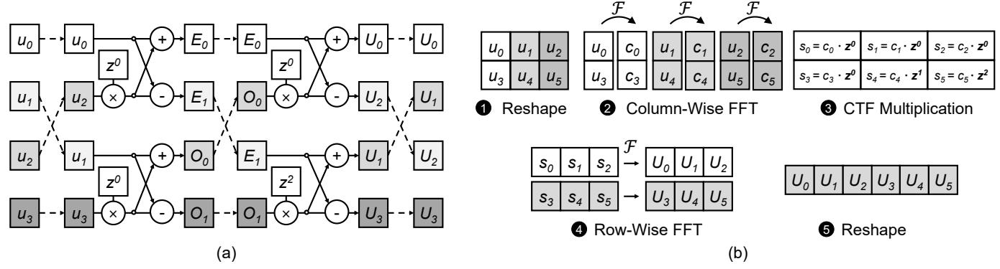

# *B. Global Convolution Models*

Convolution is widely used to effectively capture the relationships between inputs within the convolution window, and it has been a crucial component of deep learning models such as Convolutional Neural Networks (CNNs). While previous

Fig. 2. Cooley-Tukey algorithm. (a) Butterfly operations in the Radix-2 algorithm on a length-4 input sequence. Dotted lines represent permutations. (b) Generalized algorithm on a length-6 input sequence.

applications of convolutions were mainly focused on vision tasks, utilizing small window sizes to capture local contexts, recently there has been growing interest in a new type of convolution model designed to handle long sequence inputs.

Instead of using a small, fixed-size filter these global convolution models use a filter whose size matches the length of the input sequence, enabling them to identify global characteristics across the entire input. These models have advantages over self-attention when modeling long-range contexts as they have sub-quadratic compute complexity. Instead of a naive computation of the convolution, which has the same quadratic compute complexity as self-attention, these models leverage the well-known property of the convolution operation that it corresponds to a pointwise multiplication in the frequency domain. Applying FFT to the input sequence and convolution filters, followed by multiplication of the resulting vectors, and finally performing Inverse Fast Fourier Transform (IFFT) efficiently implements global convolution with a complexity of O(l log l). This approach significantly improves the computational efficiency of the convolution process.

Even with a lower computational complexity, these models also demonstrate superior performance in modeling longrange contexts, outperforming self-attention. Notably, S4 [24], S4D [23], SGConv [34], and several others [19], [41], [42] have shown significantly improved results in comparison to self-attention when evaluated using Long-Range Arena (LRA) benchmarks [47]. These benchmarks are specifically designed to assess a model's capability to capture long-range contexts through a series of tasks involving long input sequences. Furthermore, it is noteworthy that some of these models have achieved comparable or even better performance in natural language tasks [18], [42]. For example, when trained on Open-WebText, the difference in perplexity between a Transformer model (20.6) and an SSM model (21.0) of similar size is only 0.4 [18]. These observations underscore the effectiveness and efficiency of the global convolution models in handling longrange dependencies and enhancing contextual understanding. Due to their promise of efficiency and quality, SSMs are being rapidly adopted across a wide variety of applications including, but not limited to, biomedical image segmentation [37], reinforcement learning [14], diffusion models [51], event cameras [55], ECG classification [28], visual representation learning [54] and point clouds [35].

