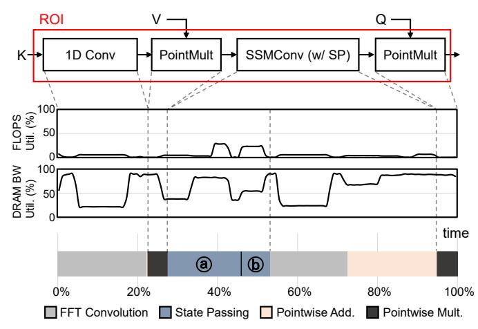

# III. ANALYSIS OF H3 COMPUTATION

## A. H3 Block Runtime Breakdown

The H3 block computation can be divided into three regions: frontend, global convolution operation, and backend. The global convolution operation accounts for the largest portion among the three regions and constitutes the region of interest (ROI) for hardware acceleration. As shown in Fig. 5, the ROI includes the following operations:  $\bigcirc$  (FFT Convolution) computation of convolution using FFT, pointwise multiplication, and IFFT,  $\bigcirc$  (State Passing) the state passing algorithm that multiplies vectors with Vandermonde matrices  $\mathbf{M}_{xy}$  and  $\mathbf{M}_{ux}$  and finally  $\bigcirc$  (Pointwise Add. & Pointwise Mult.) pointwise addition and multiplication. The proportion of each component of the ROI is shown in Fig. 5.

The frontend and backend regions consist of all the remaining operations such as the FC layers in an H3 layer, dropout and layer normalization layers, and the final feedforward-network of the H3 block. These operations are mostly

Fig. 5. Breakdown of ROI region within H3 block computation for sequence length of 128K on an A100-40GB GPU. Model parameters and batch size are identical to the H3-GPT configuration in V-A. FLOPS are normalized by the theoretical max TF-32 FLOPS of SM and Tensor Core. (a) and (b) of State Passing denotes State Update and Output Projection, respectively. 1D Convemploys FFT Convolution due to its kernel length (m=64) falling within the range suitable for FFT Convolution.

compute-intensive and well-suited for execution on conventional data-parallel accelerators, such as GPUs and TPUs.

## B. ROI Breakdown

**FFT Convolution.** *FFT convolution* performs FFT, pointwise multiplication, and IFFT, taking the largest portion of ROI time of around 42%. It is the key operation in both the 1D Conv and SSMConv. Due to the use of state passing, DRAM bandwidth utilization remains low after initial parameters are fetched from DRAM. Although the use of on-chip shared memory improved bandwidth, it still falls short of achieving full compute utilization. Also, frequent barrier operations required for exchanging values between warps further constrain compute utilization.

State Passing. The ⓐ State Update and ⓑ Output Projection operations of the state passing algorithms take up approximately 26% of ROI time, with two operations, batched matrix multiplication using  $\mathbf{M}_{ux}$  and  $\mathbf{M}_{xy}$  and the recursive operations between consecutive hidden states. Due to a particularly small m in the batched matrix multiplication  $(m, L, C \times B)$ , opportunities for data reuse are limited. This reduces the arithmetic intensity and makes these operations memory-bound, leading to underutilized compute resources. This characteristic is more prominent on batched matrix multiplication between  $\mathbf{M}_{ux}$  and  $\vec{u}$  during State Update.

On the other hand, the recursive operations between consecutive hidden states, which are part of  $State\ Update$ , account for only a small portion of the entire state passing process. However, this is only when the number of input chunks is smaller than hundreds. When the number of chunks C is greatly increased (due to smaller L or larger N), this operation can become a major bottleneck of state passing. Thus, it is important to keep the L large enough to suppress C.

**Pointwise Operations.** The ROI region also includes multiple pointwise operations as described in Section II-D. In addition, state passing increases the number of pointwise operations as the output of *Output Projection* also needs to be added to the

Fig. 6. Overview of VGA. (a) System-level diagram of VGA and architecture of its PE. (b) Diagram of the CCU inside the *core*.

output of the *FFT Convolution* as shown in Fig. 4(b). These pointwise operations are memory-bound, so it is common practice to fuse them into a single kernel. However, an end-to-end fusion of the H3 layer can be restricted due to the amount of shared memory required for each operation. For example, the large memory footprints required by the matrices used in batched matrix multiplication for state passing make the creation of a fully fused kernel a non-trivial task.

#### C. Custom Accelerator Solution

The H3 block can be characterized by two regions with opposing computational characteristics: the FFN/FC region and the SSM-based convolution region. The former is compute-intensive, making it suitable to be executed on compute-centric accelerators such as GPUs and TPUs, that prioritize maximum FLOPS. On the other hand, the FFT-based convolution layers are mostly memory-bound and benefit from wider and larger memory/SRAM. Since each of these regions occupies a size-able portion of the execution time, it is inefficient to conduct computations of both regions within a single architecture.

Therefore, this paper proposes an area/power efficient SSM layer accelerator that completely offloads the ROI. Its design is based on a detailed analysis of the bottleneck of each operation within the ROI. FFT convolution can be accelerated by utilizing sufficient SRAM bandwidth, and batched matrix multiplication benefits from reduced DRAM access. However, simply fusing all operations requires a large SRAM capacity, resulting in poor area/power efficiency. Hence, the accelerator significantly reduces the required memory capacity by dynamically generating the Vandermonde matrices  $\mathbf{M}_{ux}$ ,  $\mathbf{M}_{xy}$ , and the CTF matrix instead of storing the entire matrices in SRAM. To achieve this, the accelerator integrates hardware components capable not only of efficiently computing butterfly operations but also of flexible reconfiguration for generating elements of these Vandermonde matrices.

#### IV. ARCHITECTURE DESIGN

## A. Overview

VGA is designed as a co-processor to operate with host accelerators such as GPUs or TPUs. It is integrated alongside the existing compute units of these accelerators, as shown in Fig. 6(a). VGA comprises a collection of Processing Elements

(PEs), each connected to the host memory system via a memory interface. Each PE consists of data/instruction SRAM (D/I-SRAM), *frontend*, two data manipulation units (DMUs), a *core*, *writeback*, and a DMA engine.

During model inference, the computation of ROI in H3 layers is offloaded from the host accelerator (GPU/TPU) to VGA. It performs SSMConv using the generalized Cooley-Tukey algorithm and the state passing algorithm represented in Eq. (3). The general execution flow of a VGA PE begins with the frontend module fetching and issuing the instruction. Subsequently, data is loaded from D-SRAM to the upper DMU, where it is modified according to the instruction. The modified data is then fed to the core. Upon receiving the instruction, the controller of the *core* sets the mode of each CCU. If the instruction produces an output that needs to be written back to SRAM, it is enqueued into the writeback queue inside the *core*. When a valid output is generated from any CCU, an instruction is dequeued from the writeback queue. The dequeued instruction is then forwarded to the *lower* DMU, which performs the necessary permutations on the output vector. Finally, the transformed output vector is written to SRAM by the writeback module.

## B. Computational Components

**Core.** The *core* in VGA is responsible for all computations. It is constructed on top of a 1D array of *k* identical instances of Complex-number Compute Units (CCUs), along with the controller and writeback queue. Primarily, the *core* functions as an array processor, with each CCU independently processing data in the input vector corresponding to its index. However, in scenarios where multiple CCUs need to communicate to produce a single value, data is transmitted through a unidirectional connection from the rightmost to the leftmost CCU, similar to the communication pattern of a 1D systolic array. The writeback queue is a simple FIFO queue with no reordering of instructions. Since the distance between data-dependent instructions always exceeds the depth of the pipeline in VGA's PEs, the design is free of data hazards.

CCU. A CCU, depicted in Fig. 6(b), serves as the fundamental execution element where actual computations take place. It comprises three main components: the CMult unit, the reconfigurable array, and the register file. The CMult unit, featuring four multipliers and two adders, specializes in multiplying two complex numbers. Conversely, two multipliers and four adders in the reconfigurable array have flexible input and output connections to support various computations. Note that all multipliers and adders in both units operate on FP32 precision. Finally, the register file, capable of holding up to six complex numbers, stores constants used for computations or intermediate values updated over multiple cycles. These include partial sums or elements of Vandermonde matrices generated on-the-fly.

**CCU Modes.** Fig. 7 displays seven fully pipelined modes supported by the CCU, each defining a unique configuration of connections between the internal components. In the *CMult*(M1), Butterfly or *BF*(M3), *Update*(M5), *Residual*(M6),

Fig. 7. Seven computation modes supported by CCUs. Colored boxes indicate on-the-fly Vandermonde matrices generation. In *CTFGen*, *Projection*, and *Update* modes, the CTF,  $\mathbf{M}_{xy}$ , and  $\mathbf{M}_{ux}$  matrices are generated, respectively.

and *RMult*(M7) modes, each CCU independently processes the input vector. Conversely, during *CTFGen*(M2) and *Projection*(M4) modes, interaction between CCUs is required.

Between CCU mode transitions, an End-of-Mode (EoM) instruction flushes the pipeline and serves as a synchronization point. When dispatched at the end of a CCU mode, the EoM instruction clears the pipeline by halting further instruction dispatch until it reaches the writeback module.

In the following sections, where the usage of each mode during the ROI computation is explained, the operands of each mode are annotated using the notation from Fig. 7.

## C. Operation Mapping

As depicted in Fig. 5, ROI consists of 1D Conv, SSMConv, and PointMult which can be partitioned into four operations: *FFTConv*, *Output Projection*, *State Update*, and pointwise multiplication. 1D Conv utilizes the *FFTConv*, while SSMConv, as illustrated in Fig. 8(a), is segmented into *FFTConv*, *Output Projection*, and *State Update* operations. The pointwise multiplication in PointMult is executed with *RMult*(M7) mode. **FFTConv**. The FFTConv operation involves a combination of three modes: *CMult*(M1), *CTFGen*(M2), and *BF*(M3). As shown in Fig. 8(b), CCUs perform FFT through a sequence of operations: column-wise FFT (*BF* mode), CTF Multiplication (*CMult/CTFGen* mode), and row-wise FFT (*BF* mode).

Fig. 7 shows the details of BF mode. In the BF mode, the twiddle factor (T) is loaded into the register file before the start of each FFT/IFFT stage and is reused throughout the stage. First, the CMult unit multiplies  $O_i$  by the twiddle factor stored in the register. The resulting output (c+di) and  $E_i$  then undergo the butterfly operation in the adders of the reconfigurable array, producing two complex numbers. Both column- and row-wise FFT/IFFT operations follow a similar procedure, differing only in the D-SRAM access pattern.

To avoid bank conflicts in both row and column access during FFT/IFFT, each SRAM row of input data is circularly rotated by its row index. For example, in an 8-bank SRAM storing 64 elements, the second row (elements 9th to 16th) is rotated by 1, placing the 9th element in the second bank. This strategy places all elements of each row and column across different banks, eliminating bank conflicts.

Fig. 8. Operations used for SSMConv execution. (a) Decomposition of Eq. (3) into operations and CCU modes. (b) Breakdown of the *FFTConv* operation. (c) Operation of the *Projection* mode during *Output Projection*. Previous state  $(\vec{x}_{c-1})$  is loaded to each CCU at the start of the *Projection* mode. (d) Operation of the *Update* mode during *State Update*. An element of  $\vec{u}_c$  is broadcast to the CCUs and each CCU updates the state vector.

For CTF multiplication, even-indexed CCUs operate in the *CMult* mode, while odd-indexed CCUs operate in the *CTFGen* mode. CCUs in *CTFGen* mode initially load the first few elements of the CTF matrix (c+di) and the multiplication factor (a+bi). They then generate further CTFs through recurrent multiplications and pass them to the adjacent CCU operating in *CMult* mode, where these CTFs are multiplied with the streamed column-wise FFT results  $(C_i)$ . After the FFT, the pointwise multiplication between the transformed input and the filter in the frequency domain  $(\vec{K_f})$  is carried out in *CMult* mode.

**Output Projection.** The output chunk  $\vec{y}_c$  is produced through two modes: Projection(M4) and Residual(M6). In Projection mode, the  $\mathbf{M}_{xy}$  matrix is multiplied with the previous state vector  $\vec{x}_{c-1}$ , while in Residual mode, outputs from the Projection mode, and the FFTConv operation are added with the scaled input  $D\vec{u}_c$ . Fig. 8(c) illustrates the matrix-vector multiplication in the Projection mode. In this mode, each CCU is assigned a single column of the  $\mathbf{M}_{xy}$  matrix. Initially, a corresponding element from the  $\vec{x}_{c-1}$  (a+bi) along with the first element of the column (N) and its scaling factor (M) are loaded into registers. Over L iterations, each CCU multiplies N by M to generate an element of the column (c+di) and

Fig. 9. Timeline of CCU and D-SRAM access during SSMConv followed by real number multiplication (RMult). Colors correspond to those in Fig. 8. Mode switching indicates phases where the pipeline is being flushed by the EoM instruction. IDLE periods in CCUs are mainly due to the exposed DMA time. CMult for FFTConv and State Update is performed back-to-back without mode switching.

then multiplies it by the corresponding element from  $\vec{x}_{c-1}$  to produce a partial sum. This partial sum (e) is then propagated to the adjacent CCU through the unidirectional connection and accumulated. After m accumulations, the CCU writes the result back to SRAM. For correct accumulation, appropriate delays are inserted into each CCU at the start of the mode.

State Update. The previous state vector  $\vec{x}_{c-1}$  is updated to  $\vec{x}_c$  using two modes:  $\mathit{CMult}(M1)$  and  $\mathit{Update}(M5)$ . First, the  $\mathit{CMult}$  mode scales  $\vec{x}_{c-1}$  to  $A^L\vec{x}_{c-1}$ . Then in  $\mathit{Update}$  mode, the  $M_{ux}$  matrix is multiplied by the current input vector  $\vec{u}_c$  and added to  $A^L\vec{x}_{c-1}$ . Fig. 8(d) illustrates the  $\mathit{Update}$  mode. In this mode, each CCU is assigned a single row of the  $M_{xy}$  matrix. As in  $\mathit{Projection}$  mode, the initial element of the row (N) and its scaling factor (M) are loaded into register. Also, accumulation registers (c,d) of CCUs are preset to corresponding elements of  $A^L\vec{x}_{c-1}$ . Over L iterations, each CCU generates an element of the row and multiplies it with the broadcasted element of  $\vec{u}_c$  (e) to produce a partial sum, which is then added to its accumulation register. After the multiplication is completed, results are read from the registers and then written to SRAM.

