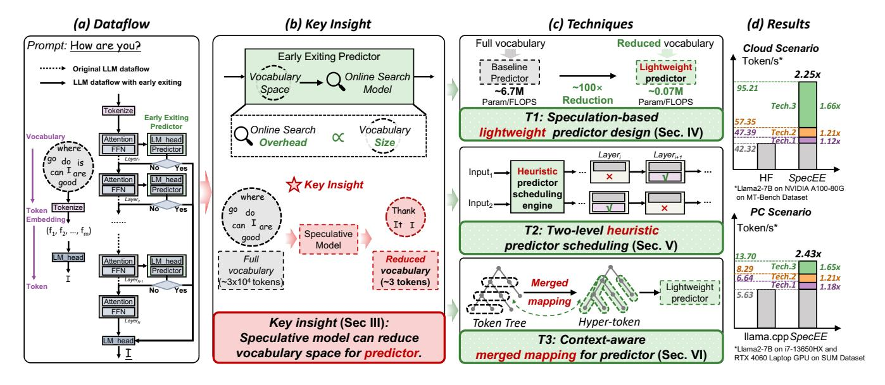
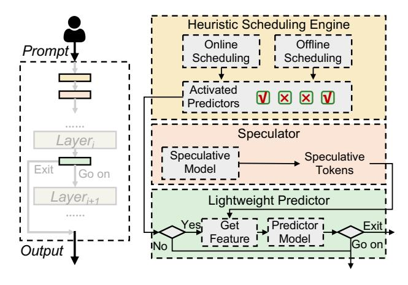
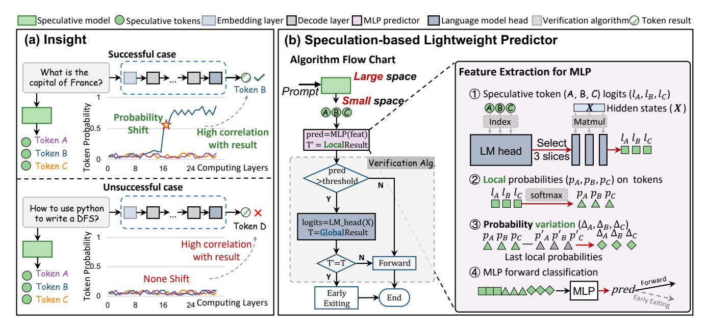
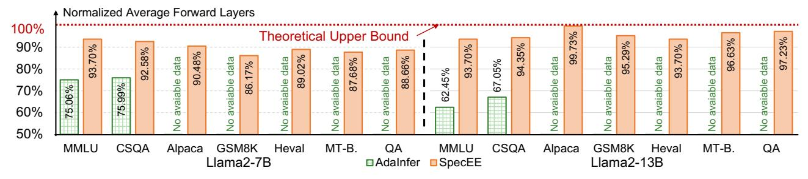
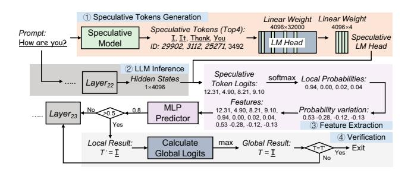

## SpecEE: Accelerating Large Language Model Inference with Speculative Early Exiting

[Jiaming Xu](https://orcid.org/0009-0000-7000-6537) Shanghai Jiao Tong University Shanghai, China jiamingxu@sjtu.edu.cn

[Siming Chen](https://orcid.org/0009-0004-5931-7827) Shanghai Jiao Tong University Shanghai, China 320220941351@lzu.edu.cn

[Jiayi Pan](https://orcid.org/0009-0007-0468-4592) Shanghai Jiao Tong University Shanghai, China pan\_jiayi@sjtu.edu.cn

[Jinhao Li](https://orcid.org/0009-0009-4286-6359) Shanghai Jiao Tong University Shanghai, China kimholee@sjtu.edu.cn

[Yongkang Zhou](https://orcid.org/0009-0008-7732-6347) Shanghai Jiao Tong University Shanghai, China zeenny.willians@sjtu.edu.cn

[Yaoxiu Lian](https://orcid.org/0009-0007-7858-5132) Shanghai Jiao Tong University Shanghai, China lianyaoxiu@sjtu.edu.cn

[Junyi Wu](https://orcid.org/0009-0008-3437-2087) Shanghai Jiao Tong University Shanghai, China kimi\_wu@sjtu.edu.cn

## Abstract

Early exiting has recently emerged as a promising technique for accelerating large language models (LLMs) by effectively reducing the hardware computation and memory access. In this paper, we identify that the LLM vocabulary serves as the runtime search space of the early exiting predictor and significantly influences the predictor workload (e.g., ∼ 20% overall inference latency with ∼ 3 × 104 vocabulary size in Llama2). We propose a novel paradigm using speculative models to reduce this search space, while addressing three critical challenges for further predictor optimization. (1) Time-consuming predictor with high computational complexity. Current predictor designs leverage basic models with high-dimensional input that ignore inherent data variation and GPU parallelization opportunities, resulting in ∼ 15% overall inference latency. (2) Under-utilization of layer-wise predictor deployment. Current early exiting systems treat the predictor in each layer equally without considering the activation frequencies of layer-wise predictors, leading to ∼ 20% inference overhead. (3) Exponential mapping complexity of predictor in speculative decoding. Each token in the token tree of speculative decoding is treated as an independent search space when applying the current early exiting mapping, leading to exponential mapping complexity and failing to incorporate the high-throughput benefits

∗Corresponding Author

Permission to make digital or hard copies of all or part of this work for personal or classroom use is granted without fee provided that copies are not made or distributed for profit or commercial advantage and that copies bear this notice and the full citation on the first page. Copyrights for components of this work owned by others than the author(s) must be honored. Abstracting with credit is permitted. To copy otherwise, or republish, to post on servers or to redistribute to lists, requires prior specific permission and/or a fee. Request permissions from permissions@acm.org.

ISCA '25, Tokyo, Japan

© 2025 Copyright held by the owner/author(s). Publication rights licensed to ACM. ACM ISBN 979-8-4007-1261-6/25/06

<https://doi.org/10.1145/3695053.3730996>

## [Guohao Dai](https://orcid.org/0000-0003-0849-3252)∗

Shanghai Jiao Tong University; Infinigence-AI; SII Shanghai, China daiguohao@sjtu.edu.cn

To address the above challenges, we present SpecEE, a fast LLM inference engine with speculative early exiting. (1) At the algorithm level, we propose the speculation-based lightweight predictor design by exploiting the probabilistic correlation between the speculative tokens and the correct results and high parallelism of GPUs. (2) At the system level, we point out that not all layers need a predictor and design the two-level heuristic predictor scheduling engine based on skewed distribution and contextual similarity. (3) At the mapping level, we point out that different decoding methods share the same essential characteristics, and propose the context-aware merged mapping for predictor with efficient GPU implementations to support speculative decoding, and form a framework for various existing orthogonal acceleration techniques (e.g., quantization and sparse activation) on cloud and personal computer (PC) scenarios, successfully pushing the Pareto frontier of accuracy and speedup. It is worth noting that SpecEE can be applied to any LLM by negligible training overhead in advance without affecting the model's original parameters. Extensive experiments show that SpecEE achieves 2.25× and 2.43× speedup with Llama2-7B on cloud and PC scenarios respectively. The code is open-sourced in<https://github.com/infinigence/SpecEE>

## CCS Concepts

- Computing methodologies → Machine learning approaches;
- Computer systems organization → Real-time systems.

## Keywords

Large Language Model, Machine Learning and System, GPU

### ACM Reference Format:

Jiaming Xu, Jiayi Pan, Yongkang Zhou, Siming Chen, Jinhao Li, Yaoxiu Lian, Junyi Wu, and Guohao Dai. 2025. SpecEE: Accelerating Large Language Model Inference with Speculative Early Exiting. In Proceedings of the 52nd Annual International Symposium on Computer Architecture (ISCA '25), June 21–25, 2025, Tokyo, Japan. ACM, New York, NY, USA, [15](#page-14-0) pages. [https://doi.](https://doi.org/10.1145/3695053.3730996) [org/10.1145/3695053.3730996](https://doi.org/10.1145/3695053.3730996)

Figure 1: (a) Pareto frontier of accuracy and speedup towards LLM inference and deployment. The detailed normalized accuracy and speedup are obtained with Llama2-7B on an NVIDIA RTX 4090 GPU. (b) The ratio of the time of the decoder layer to end-to-end inference time in the original LLM. The data of two decodings is obtained based on Hugging Face [42] and EAGLE [27] frameworks. (c) Different numbers of decoder layers are needed for different token generation.

#### 1 Introduction

Towards the advancement of Artificial General Intelligence (AGI), generative large language models (LLMs) have been successfully applied across various domains, significantly enabling the rapid development of numerous downstream tasks (e.g., agent application [43], code generation [21] and robotics [8]). Driven by the scaling law, more and more LLMs with an increasing number of parameters (e.g., Grok-1 [44] with 314B parameters) have proven remarkable performance in many scenarios. However, this further results in significant memory requirements and inference latency, which poses great challenges for the deployment of practical applications. For cloud service vendors of LLMs, the extended response time translates to increased infrastructure costs (e.g., energy) and suboptimal user experiences. For example, it is estimated that OpenAI consumes 260.42 MWh of energy per day [48], which translates into a cost of \$26,042 per day, based on U.S. industrial electricity prices of about 10 cents per kWh. This is approximately five times the average monthly income of \$4,831 in the United States [3].

Consequently, many previous works have explored techniques to accelerate LLM inference and reduce infrastructure cost for deployment, encompassing algorithm optimization, system enhancements, and hardware advancements [26, 47]. Some of these works (*e.g.*, fast decoding [1, 7, 18, 23, 27]) ensure the consistency of results, while others (*e.g.*, pruning and quantization [10, 25, 28]) may lead to accuracy loss, thus forming a Pareto frontier of accuracy and speedup towards LLM inference and deployment as shown in Figure 1(a). However, due to the lack of consideration of the relationship between the dynamic input and the static model in these works, the

multiple cascaded layers in the original model account for  $70 \sim 95\%$  of end-to-end inference shown in Figure 1(b), becoming the primary bottleneck for pushing the Pareto frontier forward.

The inference of LLM is to generate the token with the highest probability from the full vocabulary through cascading decoder layers, which is essentially an online search problem and the search space is the full vocabulary. Early exiting algorithm is an emerging optimization in dynamic neural networks [15, 24] that aims to timely and efficiently predict when search termination occurs. Several recent works [9, 19] have highlighted that not all decoder layers are necessary during inference in LLMs, enabling dynamic adjustments for different tokens. They suggest that the LLM parameters should be adjusted based on the complexity of the task during inference. As shown in Figure 1(c), during token generation, different tokens require different forward layers to be generated. Commonly, these works entail integrating data-driven predictors (e.g., Support Vector Machine (SVM) [16] and Multilayer Perceptron (MLP) [36]) after each layer and structuring relevant features as input information to predict exiting.

In this paper, we point out that the LLM vocabulary also serves as the online search space (the linear operation with the  $hidden\_dim \times vocabulary\_size$  weight, called LM Head, in LLM) of the early exiting predictors and significantly influences the workload (e.g.,  $\sim 20\%$  inference overhead with  $\sim 3 \times 10^4$  vocabulary size of Llama2 [41] in AdaInfer [9]). Therefore, we propose a **novel paradigm using speculative models to reduce this search space** by generating speculative tokens, successfully achieving  $10^4 \times$  search space reduction for predictors shown in Figure 2(b). To apply the insight for further predictor optimization, the following challenges remain unsolved.

Challenge-1: Time-consuming predictor with high design complexity. Current LLM early exiting predictor [9, 19] commonly need to traverse the full search space (multiplied with the complete LM Head) to get the relevant data before prediction, and then take the raw high-dimensional (>  $4 \times 10^3$ ) data as input for prediction without feature analysis and extraction. To accommodate high-dimensional input data, the predictor adopts a basic model (e.g., SVM in AdaInfer [9]) with high computational complexity without considering the parallelism of GPUs, resulting in  $\frac{\sim 30\%}{\sim 30\%}$  overall computation and  $\frac{\sim 15\%}{\sim 100\%}$  overall inference latency.

Challenge-2: <u>Under-utilization</u> of layer-wise predictor deployment. Current early exiting system equally treat the decoder layers of LLMs and deploy the predictor after each layer. Statistical data indicates that the success probability of the predictors follows a skewed distribution, meaning that early exiting typically occurs at a fixed set of layers for different tokens. This implies that the computations of most other predictors are ineffective in the majority of cases, resulting in  $\sim 20\%$  additional inference overhead.

Challenge-3: Exponential mapping complexity of predictor in speculative decoding. Speculative decoding [2, 4, 27] proposes the pattern of draft generation and token verification through tree-based token structure to address the poor throughput of autoregressive decoding. However, when applying the current early exiting mapping which aims to associate the tokens with the search space of predictors, each token of the token tree is treated as an

Figure 2: Overview of *SpecEE*. (a) Dataflow of early exiting. (b) Key insight: Speculative model can reduce vocabulary space for predictor. (c) <u>Techniques on predictor optimization from Section 4 to Section 6</u>. (d) Results on cloud and PC scenarios.

Figure 3: Architecture of SpecEE.

independent seach space without considering the contextual semantics, leading to the exponential mapping complexity and the failure of incorporating the high-throughput benefits.

To address the above challenges, we present *SpecEE*, a fast LLM inference engine with speculative early exiting. The techniques of *SpecEE* can be summarized into three levels as follows.

- (1) Speculation-based <u>lightweight</u> predictor design at the algorithm level. Based on the key insight mentioned above, we point out that the probability shift of speculative tokens is strongly correlated with whether it is the correct result and extract the several meaningful metrics as prediction features. To fully leverage the parallelism of GPUs, We adopt the lightweight MLP as predictor, achieving ~ 100× parameters and FLOPS reduction and ~ 1.12× end-to-end inference acceleration shown in Figure 2(c)-T1 and (d).
- (2) Two-level <u>heuristic</u> predictor scheduling at the system level. We further point out that not all layers require predictor integration and computation based on statistical results, and propose

the two-level heuristic predictor scheduling, which contains offline scheduling and online scheduling to achieve heuristic control over predictor integration and computation during the inference shown in Figure 2(c)-T2. Offline scheduling allocates predictors based on skewed distribution on offline activation frequency from extensive statistical analysis. Online scheduling is performed runtime based on the contextual similarity of the exit layer positions, where the probability that the exit layer position of the current token is within  $\pm 2$  layers of the previous five tokens exceeds 70%. The two-level heuristic scheduling achieves  $\sim 68\%$  predictor reduction and  $\sim 1.21\times$  inference acceleration shown in Figure 2(d).

(3) Context-aware merged mapping for predictors at the mapping level. Based on the contextual similarity in the exit layer positions mentioned in Technique (2), we point out that this property also applies to the tree-based speculative decoding, where contextual dependencies exist between the input token tree. Therefore, we propose the context-aware merged mapping for predictors with efficient GPU implementations supporting speculative decoding, which merges each path in the tree-based tokens into a *hyper-token* shown in Figure 2(c)-T3, turning exponential mapping complexity into linear complexity and achieving 1.66× inference acceleration shown in Figure 2(d). Moreover, due to the orthogonality, *SpecEE* also forms a framework for various existing orthogonal acceleration techniques (e.g., quantization [28] and sparse activation [38]) on cloud and PC scenarios, successfully pushing the Pareto frontier of accuracy and speedup shown in Figure 1(a).

The architecture of *SpecEE* is shown in Figure 3. After obtaining the input prompt, the heuristic scheduling engine comprising offline and online scheduling mechanisms is employed to identify the predictors that require activation. Subsequently, the speculative model is invoked to generate speculative tokens. Between each pair of consecutive decoder layers, if the predictor should be activated.

Figure 4: Two decoding methods of LLM.

features are retrieved and the predictor model is utilized to decide whether to go on with the inference process or to exit.

We implement SpecEE on the NVIDIA Tesla A100 80GB and RTX 4090 24GB GPUs for cloud scenario and Lenovo Legion Y7000 with i7-13650HX CPU and NVIDIA RTX 4060 Laptop 8GB GPU for PC scenario. As illustrated in Figure [2\(](#page-2-0)d), extensive experiments results on several LLMs (Llama2 [\[41\]](#page-12-18)) show that SpecEE achieves up to 2.25 × and 2.43 × speedup compared with implementation by Hugging Face on cloud scenario and llama.cpp on PC scenario with all the techniques with negligible accuracy loss. Notably, SpecEE can be applied to any LLM by negligible training overhead in advance without affecting the model's original parameters.

## 2 Background

## 2.1 Large Language Models

During token generation of the LLM inference, the traditional autoregressive decoding approach generates one token at a time based on input prompts and previously generated tokens, as shown in Figure [4\(](#page-3-0)a). This ensures context - dependency for natural language processing (NLP) tasks during computation. In the attention mechanism of transformer backbone in LLMs, the generation of each token only considers the preceding content and is independent of future tokens. To reduce redundant computations, existing LLM inference systems use kv\_cache to store keys and values of previous content. Given the self-attention mechanism's inability to handle nonlinear relationships, the Feed-Forward Network (FFN) is introduced to capture deeper, abstract features, which compensate for the limitations of self-attention mechanism.

## 2.2 Speculative Decoding in LLMs

Autoregressive decoding generates a single token based on the input tokens during inference, resulting in poor throughput. Speculative decoding is proposed to address the limitation. As illustrated in Figure [4\(](#page-3-0)b), it uses a smaller speculative draft language model (DLM) to generate speculative tokens autoregressively, forming tree-structured tokens. These tokens are then verified by the target language model (TLM) to decide which path to accept. This enables TLM to generate multiple tokens in one forward computation, achieving inference acceleration. DLM is crucial in end-to-end inference as the quality of its output determines if effective acceleration can be achieved. As DLM has fewer parameters, methods like joint training and knowledge distillation (e.g., Medusa [\[2\]](#page-11-5), EAGLE [\[27\]](#page-12-1)) are used to align its performance with TLM.

The primitive DLM of speculative decoding often uses a smallerscale model with the same structure. However, it's hard to find the smallest such DLM, and different types of models can't serve as DLM for each other, limiting its versatility. LOOKAHEAD [\[12\]](#page-12-20)

Table 1: Related Works on Skip Layer and Early Exiting.

|              | Memory | Prediction | Training | Latency |  |  |
|--------------|--------|------------|----------|---------|--|--|
| AdaInfer [9] | Low    | Heavy      | Low      | High    |  |  |
| RAEE [19]    | High   | Heavy      | Low      | High    |  |  |
| MoD [35]     | Low    | Light      | High     | Low     |  |  |
| D-LLM [45]   | Low    | Light      | High     | Low     |  |  |
| SpecEE       | Low    | Light      | Low      | Low     |  |  |

,MEDUSA [\[2\]](#page-11-5) and EAGLE [\[27\]](#page-12-1) are highly efficient speculative decoding methods that have achieved substantial acceleration effects. However, the end-to-end time consumption of the TLM in these methods accounts for a relatively high proportion, making the TLM the main bottleneck for performance.

## 2.3 Skip Layer and Early Exiting

Several recent studies [\[9,](#page-11-4) [19,](#page-12-15) [35,](#page-12-21) [45\]](#page-12-22) have successfully explored the applicability of early exiting and skip layer in LLM inference. However, as shown in Table [1,](#page-3-1) existing early exiting algorithms [\[9,](#page-11-4) [19\]](#page-12-15) introduce the prediction process with significant additional overhead in the decoding process, resulting in inefficient end-to-end inference. While existing skip layer algorithms [\[35,](#page-12-21) [45\]](#page-12-22) have achieved promising performance in end-to-end inference, they require pretraining or fine-tuning of the LLM, which requires a significant cost in terms of hardware and training time.

Skip Layer. The Mixture-of-Depths (MoD) [\[35\]](#page-12-21) method uses a router to let some tokens bypass blocks, and D-LLM [\[45\]](#page-12-22) places a dynamic decision module before each transformer layer. However, both MoD and D-LLM have limitations in terms of training overhead.They rely on training to learn routing or dynamic mechanisms, consuming a lot of resources and time. They often need retraining for different tasks and datasets, increasing application complexity and cost and possibly affecting their deployment and performance.

Early Exiting. AdaInfer [\[9\]](#page-11-4) points out three specific features that serve as good indicators for early exiting during LLM inference. However, fetching these features needs to integrate LM head after each layer which results in deal time consumption. RAEE [\[19\]](#page-12-15) constructs an early exiting information database. It retrieves early exiting data based on embedding similarity and calculates the early exiting layer by probability superposition. However, its database construction is highly complex, and the inherent retrieval time leads to suboptimal end-to-end performance.

As is shown in Table [1,](#page-3-1) existing early exiting methods usually have a heavy prediction phase and high end-to-end latency, while current skip layer methods always incur high training overhead. Therefore, we aim to propose an approach that features low memory usage, light prediction, low training cost, and low latency.

## 3 Motivation

## 3.1 Key Challenges of Early Exiting

As mentioned in Section [2.3,](#page-3-2) AdaInfer [\[9\]](#page-11-4) requires traversing the full vocabulary (e.g., ∼ 3 × 104 tokens in Llama2 [\[41\]](#page-12-18)) during prediction to obtain the probabilities of all tokens as predictor features, while RAEE [\[19\]](#page-12-15) requires searching the pre-built database (with a size exceeding several gigabytes) related to vocabulary , resulting in > 30% overall computation and ∼ 20% end-to-end inference latency.

Figure 5: (a) The insight on probability shift detailed in Section 4.2. (b) The algorithm flow chart and the feature extraction in speculation-based vocabulary space reduction.

We analyze the online search process of the predictor and find that its overhead is primarily results from the traversal of the vocabulary, making the computational cost positively correlated with the size of the vocabulary shown in Figure 2(b). Consequently, we identify that the vocabulary also serves as the search space for the early exiting predictor, which inherently contributes to the overhead. Therefore, we consider that the key challenge of early exiting is how to reduce the vocabulary space using low-cost methods involving low memory, light prediction, negligible training shown in Table 1 to finally enable effective online token prediction and low end-to-end inference latency.

## 3.2 Key Insight

Inspired by speculation in computer system design and speculative decoding detailed in Section 2.2, we consider that the role of DLM in speculative decoding is to generate speculative tokens for TLM. From the perspective of TLM, the output from DLM provides a potential way to streamline the range of token selection (*i.e.*, search space), even if the actual output may not always fall within this range. Furthermore, as mentioned in Section 2.2, the goal of training DLM is to ensure that the results of TLM align as closely as possible with these speculative tokens. In other words, with a strong enough DLM, it is possible to fully limit the results of the TLM to the range of speculative tokens (*i.e.*, valid small space in the insight of Figure 2(a)).

Therefore, we propose a **novel paradigm using speculative models to reduce the search space** shown in Figure 2(b). The data in EAGLE [27] shows that it only requires  $\sim 3\%$  memory and inference overhead of original LLM and  $\sim 48$  hours on RTX 3090 training overhead, which also matches our requirements in Table 1.

Figure 6: Analysis on feature selection. It is necessary to select three all features for prediction to prevent misjudgment.

#### 4 Speculation-based Lightweight Predictor

## 4.1 Motivation: Time-consuming Predictor

Though the search space can be effectively reduced by the speculative model, the design of current LLM early exiting predictor [9, 19]) still relies on directly utilizing high-dimensional raw data (e.g.,  $\sim 5 \times 10^3$  in Llama2-7B) retrieved from the search space as input features, without performing any feature analysis or extraction. As illustrated in Figure 2(c)-T1, this raw high-dimensional data imposes significant demands on the predictor internal design, requiring complex architectures with a large number of parameters and computational overhead to effectively capture the implicit information contained within these high-dimensional features. Moreover, current predictor designs adopt traditional basic models (e.g., SVM in AdaInfer [9]) for intuitiveness and interpretability, ignoring the parallel computing opportunities provided by GPUs.

## 4.2 Insight: Probability Shift

We need to explore the feasibility of the new paradigm utilizing the speculative tokens generated by the speculative model as the

Figure 7: The gap between actual average forward layers and theoretical average forward layers of AdaInfer and SpecEE. AdaInfer only provides the average forward layers of MMLU and CommonsenseQA in the datasets in Section 7.1.3.

reduced search space. As illustrated in Figure 5(a), we conduct experiments on the probability variation of tokens in the reduced space and point out that during LLM inference, if the final result token is within the reduced space, the probability of this token tends to rise sharply at a certain layer, while the probabilities of other tokens remain stable at lower values. Conversely, if the final output is not in the streamlined space, the probabilities of all tokens in the streamlined space tend to remain stable at lower values. We refer to this phenomenon as the **probability shift**.

### 4.3 Approach: Lightweight Design

Based on the insight and analysis mentioned above, we design the speculation-based lightweight predictor. The predictor design includes three parts, feature selection, judgment mechanism and correction algorithm.

- 4.3.1 Feature Selection. We selected speculative token logits, local probabilities, probability variation as the input features for the predictor in each layer. Below is a detailed description of each feature and the rationale behind our selection.
- (1) Speculative token logits are the result of the matrix multiplication  $(1 \times hidden\_dim \times num\_speculatives)$  between the output of each layer (i.e.,  $hidden\_states$ ) and the  $speculative\_lm\_head$  which refers to the columns of the  $lm\_head$  corresponding to the speculative tokens, providing direct insight into the confidence of LLM on speculative tokens.
- **(2) Local probabilities** are the result of applying the softmax function to speculative token logits. The probabilities are based on local information rather than global information, reflecting the likelihood of speculative tokens within the streamlined search space.
- (3) Probability variation is the difference between the local probabilities in the current layer and the last layer, capturing changes in the probability across layers.

Our analysis has indicated that the probability variation of tokens is a crucial factor for prediction and we select **probability variation** as a feature. However, as illustrated in Figure 6(a), we observe that the variation of 0.12 can result from either 0.32 - 0.20or 0.58 - 0.46. The predictor in Figure 6(a) shouldn't allow exiting in the left while the exit probability should be higher in the right. Therefore, we consider using probability variation alone as feature is insufficient and introduce **local probabilities** as an additional feature. Moreover, the local probability may be the same when speculative token logits are different shown in Figure 6(b). In such case,

Figure 8: Design space exploration on the predictor configuration. (a) The accuracy and execution time of the predictor with changing layers and controlled hidden dimension (512). (b) The accuracy and execution time of the predictor with changing hidden dimensions and controlled layers (2).

the predictor in the right conversely makes a proceeding decision and thus we further take **speculative token logits** as a feature.

- 4.3.2 Judgment Mechanism. Based on the features mentioned above, we configure the speculative model to generate 4 speculative tokens each time, resulting in the feature dimension of 12 (4  $\times$  3). To fully leverage the high computational capacity of the GPU's Tensor Cores, we employ a two-layer MLP as the predictor with the hidden dimension of 512 instead of traditional machine learning methods (e.g., SVM). The predictor employs the ReLU activation function and sets a Sigmoid function at the output layer to handle the binary classification task. The features are fed into the predictor, and the decision to exit is determined by comparing the predictor's output to a predefined threshold (i.e., 0.5).
- 4.3.3 Verification Algorithm. As described in Section 4.3.1, the local probabilities are derived from local information rather than global information. To verify the prediction results, we further propose the verification algorithm by incorporating global information. As illustrated in Figure 5, we compute global token logits using the full *lm\_head* and check if the token with the highest global logits is present in the speculative tokens. If it is, we exit and output that token, and if not, the model proceeds to the next layer.

**Example.** Figure 9 shows an example of the speculation-based predictor computation. We use "How are you?" as the prompt and take the ending at layer 22 of LLM as an example. The specualtive tokens are firstly generated based on the prompt, forming the speculative LM Head. Feature extraction from the hidden states is followed during the LLM inference for the prediction Finally, the

Figure 9: Example of predictor computation.

verification is performed by comparing the global token from LM Head with the local token.

**Design Space Exploration.** To reduce the predictor's execution time while maintaining accuracy, we focus on the number of layers and the hidden dimension. We explore the design space through using the control-variable approach shown in Figure 8. The accuracy represents the predictor's performance on the test set detailed in Section 7.4.4. The optimal configuration is a 2-layer MLP with the hidden dimension of 512, which is our final configuration.

#### 4.4 Evaluation

The most ideal scenario for the acceleration based on early exiting is that the actual average exit layer of the method approaches the theoretical average earliest exit layer. Thus, we evaluate the average exit layer obtained by our method and the theoretical exit layer of each dataset. As illustrated in Figure 7, our method is closer to the theoretical value than AdaInfer, which is the only work about the early exiting of Llama2 models. Our method maintains close alignment with theoretical values across different datasets, exhibiting strong stability. This proximity to the theoretical exit layers is also a key reason why our approach maintains accuracy without degradation shown in Section 7.4.1.

## 5 Two-level Heuristic Scheduling Engine

#### 5.1 Motivation

Based on the speculation-based lightweight predictor proposed in Section 4, we conducted experiments on a series of datasets in Section 7.1.3 using Llama2-7B [41]. However, the end-to-end acceleration was not significant, showing only an average speedup of about 15%. Despite this, the average number of executed layers was around 23, suggesting that the theoretical acceleration ratio could reach approximately  $\sim 33\%$  (32/(23 + 1)). The overhead of the speculative model is roughly equivalent to the execution time of a single decoder layer. Therefore, we believe that it is the overall overhead of the predictors that slows down the end-to-end inference. The predictor overhead is defined as  $T \times L$ , where T is the execution time of a single predictor and L is the number of layers integrated with the predictor (e.g., L = 32 in Llama2-7B).

Figure 8 illustrates the relationship between the time overhead, accuracy, and parameter configurations of the predictor, and the final experiment is conducted with the optimal configuration (2 layers MLP with 512 hidden dimension). Thus, reducing the overall predictor overhead can only be achieved by decreasing L. Moreover, we point out that the sum of the probabilities of all layers with exit

Figure 10: (a)(c) The statistical exiting probability on the 31 (0  $\sim$  30) layers in Llama2-7B and Vicuna-7B (no predictor needed for last layer). (b) The average forward layers on fixed predictors with random positions in Llama2-7B. Random positions of predictors lead to up to  $\sim$  3.1 layers gap.(d) The end-to-end speedup on different fixed numbers of predictors and our dynamic predictor numbers in Llama2-7B.

probabilities falling within the bottom 50% does not exceed 20% shown in Figure 10(a) and (c), which implies that prediction in these layers are mostly unnecessary. However, Figure 10(b) indicates that blindly reducing L can hinder timely exiting, leading to an increase ( $\sim 3.1$  layers) in the average number of executed layers and inference latency. Therefore, we consider that the key issue is how to accurately control the quantity (L) and position of predictors to achieve end-to-end inference acceleration.

