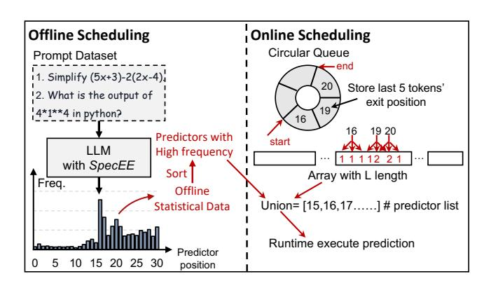

# 5.2 Insights and Analysis: Skewed Distribution and Context Similarity

Inspired by the dynamic resource allocation in system optimization [11, 20, 34], we consider that it is necessary to dynamically adjust the number and position of predictors according to the actual situation, focusing on two key variables during LLM inference, model selection and context input.

**Skewed Distribution.** We investigated the distribution of predictor results across two models shown in Figure 10(a) and (c), and identified a skewed distribution with about 50% of the layers where the statistical probability of exiting is less than the average probability 3.2%. This skewness also varies across different models.

Context Similarity. Additionally, inspired by the context similarity observed in language processing [30] and sparse activation [29, 31], we focus on the relationship of the exit layer of the current token and the last few tokens as shown in Figure 11. Statistical results show that the exit layer of the current token has ~ 80% probability of being near (e.g., ±2 layer) the exit layers of the last 5 tokens. Experiments reveal that the set consisting of the exit layers of the last 5 tokens and their neighboring layers amounts to approximately 10.2 layers on average, as shown in Figure 10(d). Based on average probability calculations, the probability that the exit layer of a token falls within this set should be approximately 31.8%. However, experiments indicate that this probability is as high as 80%. Thus, we can conclude that there is a significant context similarity in the location of the exit layer.

Figure 11: The explanation for context similarity. The hit ratio of the current token's exit layer within the vicinity ( $\pm 2$  layers) of the exit layers of the last N tokens (x-axis), as well as the average number of layers after taking the union of last N tokens' exit layers and neighboring layers.

#### 5.3 Approach: Two-level Heuristic Scheduling

Based on the above insight and analysis mentioned above, we propose the two-level adaptive scheduling. The approach includes two parts, offline scheduling and online scheduling shown in Figure 12.

Offline Scheduling. Given that different LLMs exhibit variations in exit probability distributions shown in Figure 10(a) and (c), offline scheduling is employed to collect data offline for the LLM. It performs inference on the LLM with all predictors fully integrated using numerous prompts, collecting data from each predictor and ranking them by frequency. The result is integrated into the model as a model configuration parameter which is model-dependent and only needs to be executed offline once for a LLM.

**Online Scheduling.** Based on the context similarity mentioned above, during the inference, we always maintain a circular queue of length N, representing the local context attention span (e.g., 5 tokens mentioned above). Additionally, we use an array with a length equal to the total number of layers (L). The circular queue sequentially records the exit layer positions for the last N tokens, while the i-th element of the array tracks the number of times the i-th layer has been near (e.g.,  $\pm 2$  and itself) the exit layers of last N tokens recorded in the circular queue.

Finally, the quantity and position of predictors are determined by the union of a subset of results selected by the offline scheduling, and the results from the online scheduling. The performance gap between the fixed number of predictors and the dynamic number of predictors is shown in Figure 10(d). The dynamic selection in *SpecEE* 

Figure 12: Dataflow of heuristic scheduling.

Figure 13: The hyper-token for speculative decoding and the customized GPU implementation developed based on cutlass [33] and MegaBlocks [13] for calculating the draft token logits in *SpecEE* for speculative decoding.

achieves the highest end-to-end speedup with fewer predictors (only  $\sim 10.2$  layers).

## 6 Context-aware Merged Mapping for Predictor

## 6.1 Motivation

Speculative decoding successfully achieves high throughput through the pattern of draft generation and token verification. As illustrated in Figure 13, the token tree is composed of multiple tokens at each level by autoregressive generation of the speculative model. The first generation is three green tokens (Top3 probability) based on the prompt. And then these three tokens will be concatenated and fed into the speculative model and get the purple tokens at next level. All the tokens will be concatenated and fed into the target LLM to verify the tokens through one forward computation.

When applying the early exiting during verification inference, the current mapping for predictors treats each token in the token tree as an independent search space without considering the contextual semantics. For example, the root token (?) and its three speculative tokens (I, It, Thank) are mapped a predictor to decide the early exiting, while the green token (I) and its 3 speculative tokens (thank, am, can) are also mapped a predictor at the same time. Moreover, these predictors are independent of each other, which means the overall mapping complexity is the product of the complexities of individual predictors, resulting in an exponential complexity. Therefore, we consider that the key issue is how to design a novel mapping for speculative decoding that maintains low complexity.

#### 6.2 Approach: Context-aware Merged Mapping

**Algorithm.** We analyze the nature of the speculative decoding and point out that early exiting shares a common essence across both decoding methods. In autoregressive decoding, early exiting is used to predict the next token based on the current token, while in speculative decoding, it is used to predict a token sequence within the token tree. However, according to the fundamental principle of early exiting, the exit position of a token sequence should be determined by the rearmost position of the exiting layers within it, reflecting an obvious Cannikin law that significantly impacts end-to-end performance. For example, if the token *I* exit at the 22nd layer while the token *am* exit at the 30th layer, the exiting position of the token path (*I, am*) is 30th layer. Inspired by the

Figure 14: The speedup and throughput of Llama2-7B, Llama2-13B and Llama2-70B on NVIDIA RTX 4090 GPU and Tesla A100 80GB GPU for autoregressive decoding in cloud scenario.

context similarity in Section 5.2, we highlight that tokens within a token path share contextual relationships, achieving centralized exit positions and alleviating the performance loss due to Cannikin law. Thus, we propose the context-aware merge-based mapping for predictors in speculative decoding, where the tokens in a path of the token tree is merged as a single hyper-token as shown in Figure 13. This abstraction allows the early exiting in speculative decoding to be addressed similarly to autoregressive decoding.

**Implementation.** To efficiently compute the features of the hyper-token in Section 4.3.1 and minimize the additional overhead caused by early exiting, designed a custom GPU operator implementation shown in Figure 13 inspired the block-wise general matrix multiplication in MegaBlocks [13] based on the group GEMM implementation of cutlass [33].

