# [Hai Jin](https://orcid.org/0000-0002-3934-7605)∗†

Huazhong University of Science and Technology Wuhan, China hjin@hust.edu.cn

HBM-based PIM and DIMM-based PIM to achieve high performance, energy efficiency, and low hardware cost. HeterRAG uses HBM-based PIM for the generation stage to meet bandwidth needs and DIMM-based PIM for the retrieval stage to satisfy memory capacity requirements. To further improve performance, HeterRAG incorporates three software–hardware co-optimization techniques: locality-aware retrieval, locality-aware generation, and fine-grained parallel pipelining. Experimental results demonstrate that, compared to RAG systems deployed on Intel Xeon CPUs and NVIDIA GPUs, HeterRAG achieves up to 26.5× higher throughput, up to 27.6× lower latency, and up to 2.8× greater energy efficiency.

### CCS Concepts

• Hardware → Emerging technologies; • Computer systems organization → Parallel architectures.

### Keywords

Retrieval-augmented generation, Large language models, Approximate nearest neighbor search, Processing-in-memory, DIMM, HBM

#### ACM Reference Format:

Chaoqiang Liu, Haifeng Liu, Dan Chen, Yu Huang, Yi Zhang, Wenjing Xiao, Xiaofei Liao, and Hai Jin. 2025. HeterRAG: Heterogeneous Processing-in-Memory Acceleration for Retrieval-augmented Generation. In Proceedings of the 52nd Annual International Symposium on Computer Architecture (ISCA '25), June 21–25, 2025, Tokyo, Japan. ACM, New York, NY, USA, [15](#page-14-0) pages. <https://doi.org/10.1145/3695053.3731089>

### 1 Introduction

In recent years, Large Language Models (LLMs) have made significant advancements in the field of natural language processing [\[27,](#page-12-0) [79,](#page-14-1) [90\]](#page-14-2). With their powerful generative capabilities, LLMs can produce high-quality text across various tasks. However, LLMs

∗National Engineering Research Center for Big Data Technology and System, Services Computing Technology and System Lab, Huazhong University of Science and Technology (HUST).

rely on pretraining data and cannot provide accurate real-time responses [\[28\]](#page-12-1). To address this limitation, the Retrieval-augmented Generation (RAG) method has emerged [\[7,](#page-12-2) [59,](#page-13-0) [68,](#page-13-1) [74\]](#page-14-3). RAG combines a knowledge base and retrieves relevant documents to support generation in real-time, enhancing the performance of LLMs in complex information-demanding contexts [\[40,](#page-13-2) [72\]](#page-14-4). Beyond integrating general knowledge bases, RAG can also construct domain-specific knowledge bases. For example, deploying private RAG systems within enterprises has become a trend [\[2,](#page-12-3) [20,](#page-12-4) [55,](#page-13-3) [80\]](#page-14-5). By integrating large models with private knowledge bases, enterprises can fully leverage their internal data while ensuring data privacy, thereby improving decision support and information generation efficiency.

RAG systems consist of two main stages: retrieval and generation. In the retrieval stage, the system efficiently retrieves relevant documents through Approximate Nearest Neighbor Search (ANNS) [\[48,](#page-13-4) [52,](#page-13-5) [84\]](#page-14-6), providing accurate contextual support for generation. A commonly adopted approach is the graph-based ANNS [\[19,](#page-12-5) [58,](#page-13-6) [82\]](#page-14-7), which utilizes a pre-built graph index to match query vectors with document vectors. Graph-based ANNS can quickly identify the most similar document set, thereby significantly improving retrieval efficiency. Then, in the generation stage, the system augments the LLM's input with retrieved documents to generate more accurate and relevant responses.

Although RAG offers significant advantages over traditional LLMs, it also faces two major system-level challenges. First, RAG systems require high memory bandwidth. In the retrieval stage, the system searches for relevant documents through a graph index. This involves random and irregular memory access due to the sparsity of the graph and the randomness of search paths, resulting in low bandwidth utilization. In the generation stage, the transformer's autoregressive decoding and attention mechanism [\[79\]](#page-14-1) requires many General Matrix-Vector Multiplications (GEMV) operations. Limited reuse of weights and Key-Value (KV) cache causes frequent data loading from off-chip memory, making performance highly dependent on memory bandwidth. Second, RAG systems demand a large memory capacity. In addition to the memory required for the generation stage, the retrieval stage relies on large knowledge bases containing massive documents, vectors, and indexes, which demands significant additional memory capacity. With the continuous growth of real-world knowledge, the memory requirements of RAG systems are expected to keep increasing.

Memory-bound applications often use Processing-in-Memory (PIM) technology [\[44,](#page-13-7) [61\]](#page-13-8) to improve performance. Currently, most approaches rely on HBM-based PIM to accelerate large model inference because of HBM's high bandwidth and low power consumption [\[26,](#page-12-6) [64,](#page-13-9) [93\]](#page-14-8). However, in RAG systems, using only HBM-based PIM leads to high hardware costs. For example, A single HBM stack typically provides up to 24GB of capacity and can cost approximately five times more per gigabyte than DDR5 DRAM [\[83\]](#page-14-9). Moreover, HBM prices are expected to rise due to supply constraints and increasing demand from artificial intelligence and data center applications [\[77\]](#page-14-10). Meeting RAG's memory capacity needs would require many HBM stacks, significantly increasing system cost. On the other hand, DDR-based DIMMs can reach a capacity of 64GB [\[32\]](#page-12-7), making them much cheaper and more spacious than HBM. A naïve solution is to combine DIMM with HBM-based PIM to store the large knowledge base. However, both retrieval and

generation stages still need to transfer data to the HBM-based PIM for processing, causing heavy data transfer overhead. RAG systems become less efficient because the bandwidth of interconnects like PCIe is significantly lower than the internal memory bandwidth.

In this paper, we introduce HeterRAG, a heterogeneous PIM system that accelerates RAG by combining the strengths of both HBM-based PIM and DIMM-based PIM. For the generation, we follow the current HBM-based PIM acceleration design for LLM inference to leverage HBM's high bandwidth and low power consumption. For the retrieval, which has higher memory demands, we use DIMM-based PIM to benefit from DIMM's large capacity and low cost. The HBM-based PIM and DIMM-based PIM are designed as independent devices that can be scaled and optimized separately to better accommodate diverse RAG system workloads.

HeterRAG also adopts three software-hardware co-optimization techniques: locality-aware retrieval, locality-aware generation, and fine-grained parallel pipeline. In the retrieval stage, we cache frequently accessed vertex vectors to reduce DRAM access and reuse results from previous iterations to accelerate the retrieval process. In the generation stage, we cache the frequently accessed KV tensors associated with documents to avoid redundant computations. Additionally, as soon as part of the retrieval stage is complete, we start the generation stage to improve overall hardware utilization.

In summary, we make the following contributions:

- From a computer systems architecture perspective, we examine the emerging RAG domain, identifying that RAG systems face more severe challenges in memory bandwidth and capacity compared to traditional LLMs.
- We propose a heterogeneous PIM system, HeterRAG, which combines the advantages of HBM and DIMM to achieve high performance, energy efficiency, and low cost. HeterRAG primarily includes two heterogeneous PIM devices, AccelDIMM and AccelHBM, which efficiently handle the retrieval and generation parts of RAG systems, respectively.
- Moreover, HeterRAG provides significant benefits through its software-hardware co-optimizations, including localityaware retrieval, locality-aware generation, and fine-grained parallel pipeline.
- We evaluate HeterRAG on various configurations and demonstrate that it significantly outperforms the CPU-GPU, the naive HBM-only PIM, and the DIMM-only PIM baselines, achieving a throughput improvement of 6.6× to 26.5× (13.5× on average), a latency reduction of 8.7× to 27.6× (13.7× on average), and significant energy efficiency gains.

### 2 Background

### 2.1 Retrieval-augmented Generation

Retrieval-augmented Generation (RAG) is a method that combines information retrieval with natural language generation [\[40,](#page-13-2) [59,](#page-13-0) [72\]](#page-14-4). By integrating specialized and up-to-date knowledge bases, RAG enables Large Language Models (LLMs) to generate responses that are more timely, accurate, and informative.

As shown in Figure [1\(](#page-2-0)a), RAG uses an embedding model during the offline preprocess to transform knowledge (e.g., document chunks) into high-dimensional vectors and construct a specific

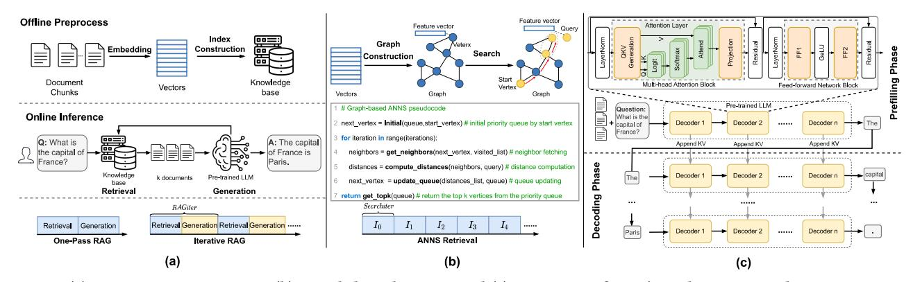

Figure 1: (a) RAG process overview, (b) Graph-based ANNS, and (c) Overview of GPT's architecture and its autoregressive inference process

index, forming a complete knowledge base with the original knowledge. During online inference, the RAG system operates in two stages: retrieval and generation. It first retrieves relevant information from the knowledge base according to the user request, then uses a pre-trained large model to generate a response.

Currently, RAG operates in two main modes: one-pass RAG and iterative RAG. One-pass RAG [\[66,](#page-13-10) [81\]](#page-14-11) performs a one-time retrieval and generation, where the system retrieves relevant documents from the knowledge base based on the user request and directly generates a response by inputting these documents along with the request into the model. Iterative RAG [\[7,](#page-12-2) [48,](#page-13-4) [68,](#page-13-1) [78\]](#page-14-12), in contrast, involves multiple rounds of retrieval and generation, where the system may refine the query at each iteration, progressively retrieving more relevant information to produce more accurate and contextually appropriate answers.

Retrieval Stage: RAG converts user requests or the latest context into high-dimensional vectors and uses them as queries to search the pre-constructed knowledge base [\[54\]](#page-13-11), retrieving semantically relevant documents. To accelerate large-scale vector retrieval, Approximate Nearest Neighbor Search (ANNS) [\[52\]](#page-13-5) techniques have been widely adopted, with graph-based ANNS [\[19,](#page-12-5) [58\]](#page-13-6) emerging as a leading approach due to its high speed and accuracy.

Graph-based ANNS represents vectors as vertices and organizes them into a graph structure [\[53\]](#page-13-12). During retrieval, it employs a best-first search strategy [\[82\]](#page-14-7), iterating multiple times to identify the most relevant results as illustrated in Figure [1\(](#page-2-0)b). The process begins with initializing a priority queue with the starting vertices. In each iteration, graph-based ANNS selects the nearest unchecked vertex from the queue. It then fetches its neighbors, filters out previously visited ones to avoid redundancy (neighbor fetching), computes the distances between the query vector and the filtered neighbors (distance computation), and updates the queue with the new distances (queue updating).

Generation Stage: RAG's generation is typically driven by LLMs built on decoder-only transformer architectures [\[90\]](#page-14-2), such as GPT [\[8\]](#page-12-8) and LLaMA [\[75\]](#page-14-13). As shown in Figure [1\(](#page-2-0)c), GPT is composed of a stack of decoder blocks. Each block contains a Multi-head Attention (MHA) module and a Feedforward Network (FFN) module, both preceded by Layer Normalization (LayerNorm) and followed by residual connections. The MHA module includes a QKV generation layer, an attention layer, and an output projection layer, while the FFN module comprises two fully connected layers (FF1 and FF2) and a Gaussian Error Linear Unit (GELU) activation. In contrast, LLaMA replaces the GELU activation with SwiGLU in the FFN module and employs Rotary Positional Embeddings (RoPE) for position encoding.

The inference process of LLMs typically consists of two subphases: the prefilling phase and the decoding phase. In the prefilling phase, the entire token sequence is processed in parallel at the token level, with the dominant computation being General Matrix-Matrix Multiplication (GEMM). In contrast, the decoding phase proceeds autoregressively, generating one token at a time based on previously generated tokens, where the computation is typically dominated by General Matrix-Vector Multiplication (GEMV) due to the singletoken input.

### 2.2 Processing-in-Memory

Traditional von Neumann architectures separate computation and storage, requiring frequent data transfers between memory and processors, making the system performance limited by latency and bandwidth. Processing-in-Memory (PIM) [\[13,](#page-12-9) [44,](#page-13-7) [46,](#page-13-13) [56,](#page-13-14) [70\]](#page-13-15) technology addresses this by integrating computation within or near memory, reducing data movement and energy consumption. PIM can be broadly categorized into analog and digital approaches. Analog PIM, such as ReRAM-based in-memory computing [\[29,](#page-12-10) [30\]](#page-12-11), performs operations using physical memory properties. Digital PIM employs embedded processing units to execute computations closer to memory [\[3,](#page-12-12) [25,](#page-12-13) [39,](#page-13-16) [43,](#page-13-17) [45,](#page-13-18) [93\]](#page-14-8). This work focuses on DIMM-based and HBM-based digital PIM, chosen for their popularity, practicality, and reliability.

DIMM-based PIM: DIMMs use a 2D layout of DDR chips, which keeps manufacturing costs low, allowing users to get high-capacity memory at an affordable price. DIMM-based PIM places processing units at different memory levels, such as rank, bank group, and bank levels, to enable efficient data processing. It is widely adopted in applications such as recommendation systems [\[3,](#page-12-12) [39,](#page-13-16) [56,](#page-13-14) [65\]](#page-13-19) and graph processing [\[12\]](#page-12-14), where large-scale data is typically involved.

HBM-based PIM: HBM uses a 3D-stacked structure with memory dies vertically connected through Through Silicon Vias (TSVs), providing high bandwidth, low latency, and low power consumption. However, its complex manufacturing process leads to high cost

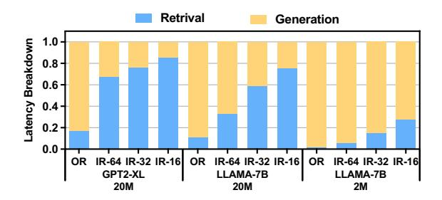

Figure 2: Execution time breakdown of a RAG system using GPT2-XL and LLaMA2-7B models for generation and HNSW for retrieval

and limited per-stack capacity. HBM-based PIM enhances effective bandwidth utilization by integrating processing units near or within memory banks. This makes it ideal for bandwidth-heavy tasks like image processing [\[21\]](#page-12-15) and machine learning [\[25,](#page-12-13) [43,](#page-13-17) [45,](#page-13-18) [93\]](#page-14-8).

### 3 Motivation

In this section, we provide an in-depth analysis of the characterization for both stages of the RAG and motivate why a heterogeneous PIM-accelerated system is needed.

### 3.1 Characterization of RAG

We analyze the characteristics of each stage on a CPU-GPU-based platform (like the existing RAG systems [\[34,](#page-12-16) [35\]](#page-12-17)), where the retrieval stage is performed on the CPU side using the graph-based ANNS algorithm HNSW [\[58\]](#page-13-6) and the generation stage on the GPU side using GPT2 and LLaMA2. Details about the hardware configuration, knowledge base, and datasets are provided in [§5.1.](#page-9-0)

Execution Time Breakdown: Figure [2](#page-3-0) shows the execution time distribution of the RAG system across different knowledge base sizes and models. When the knowledge base is relatively small, the generation stage dominates the execution time. As the size of the knowledge base increases, the retrieval stage needs a significantly higher process time. Additionally, the execution time for both stages varies with the scale of the models and the number of RAG iterations. Therefore, both the retrieval and generation stages can take up considerable execution time in the RAG workflow, indicating that performance optimization should focus on both stages.

Arithmetic Intensity Analysis: To better understand the RAG system, we use the roofline model to analyze its computational and memory access behavior. Figures [3](#page-3-1) and [4](#page-3-1) show the roofline data points for the retrieval and generation stages, respectively.

Due to its extensive and irregular off-chip memory access, the memory bandwidth becomes the main bottleneck of the retrieval stage. As mentioned earlier, the retrieval stage comprises three operations. Among them, distance computation accounts for over 80% of the whole retrieval execution time. The reason is that calculating distances requires accessing sparse graph structures and scattered vector data, making it difficult to predict memory access addresses to prefetch. Moreover, the large size of graph data makes the caching technique less effective.

Similarly, the generation stage is primarily limited by the memory bandwidth. Yet, the two stages' memory access behaviors are quite different. Unlike random, irregular memory access patterns

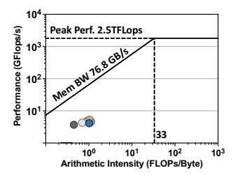

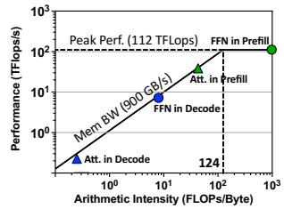

Figure 3: Roofline model analysis of the HNSW algorithm on an Intel Xeon Gold 5117 CPU

Figure 4: Roofline model analysis of the LLaMA2-7B model layers on an NVIDIA V100 GPU

in the retrieval stage, the weight data from the generation stage is rather regular and sequential. However, the limited on-chip cache capacity cannot accommodate the large weight data together, causing frequent off-chip memory access and thus making the generation stage memory-bound. While batch processing can partially mitigate this limitation, the unique KV cache required by each request still makes the on-chip cache requirement considerable and does not change the memory-bound characteristic. In addition, RAG applications often handle personalized and sensitive user data, and typically cater to a limited number of users, resulting in small batch sizes.

Memory Footprint Analysis: RAG systems rely on knowledge bases for retrieval rather than encoding knowledge in model parameters. This allows smaller models to achieve comparable or even better performance compared to the large models in various knowledge-intensive tasks [\[23,](#page-12-18) [31,](#page-12-19) [48\]](#page-13-4). The popular models, such as GPT2-XL and LLaMA2-7B, require approximately 3GB and 14GB of memory, respectively, with FP16 precision. For GPT2-XL and LLaMA2-7B, a batch size of 32 with token lengths of 1024 for both the input and output, KV caching requires an additional 18GB and 32GB of memory, respectively. However, RAG systems' memory demands are considerably higher, as their knowledge bases typically store large collections of documents, vectors, and retrieval indices. A knowledge base with tens to hundreds of millions of documents, where each document takes tens to hundreds of bytes, requires a total of hundreds of gigabytes to terabytes of memory. Moreover, as real-world applications continuously incorporate new data, the memory demands of RAG systems steadily increase.

Summary: Random memory access in retrieval and limited data reuse during generation make RAG systems highly dependent on memory bandwidth. Furthermore, the large knowledge base demands high memory capacity.

### 3.2 Heterogeneous PIM Acceleration for RAG

Why Choose PIM and How to Design It? Analysis of arithmetic intensity shows that increasing memory bandwidth is crucial to improving the performance of RAG systems. PIM technology, which offers higher bandwidth and lower memory access latency, emerges as a promising solution to alleviate memory bottlenecks.

HBM-based PIM is the preferred choice for accelerating large model inference due to its high bandwidth and low per-bit energy consumption. For example, an 8-Hi HBM2 stack (8 dies) provides up to 256GB/s of bandwidth, about 13× higher than the 19.2GB/s

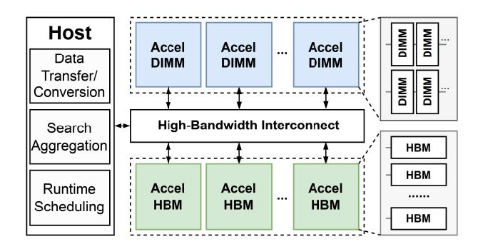

Figure 5: HeterRAG architecture overview

of a DDR4-2400 DIMM, while consuming roughly half the energy per bit transfer [\[45\]](#page-13-18). However, for memory-intensive RAG systems, HBM-based PIM is impractical due to its limited capacity and high cost. For instance, an 8-Hi HBM2E stack used in the A100 GPU offers 16GB of capacity at an estimated cost of approximately \$110/GB [\[62\]](#page-13-20). Storing even a moderately sized 100GB knowledge base would cost \$11,000, making HBM-based PIM economically impractical for RAG applications.

Compared to HBM, DIMMs offers significant advantages in terms of capacity and cost. For instance, a standard DDR4-based DIMM module can provide up to 64GB of capacity [\[32\]](#page-12-7), which is 4× that of a single HBM2E stack. Moreover, the simplified manufacturing process of DDR leads to significantly lower costs compared to HBM, with the unit price of even DDR5-based DIMMs being approximately one-fifth that of HBM [\[76,](#page-14-14) [83\]](#page-14-9). Therefore, DIMMs can serve as a simple and cost-effective auxiliary storage in RAG systems. However, if DIMMs are simply combined with HBM-based PIM, all data needs to be transferred from DIMMs to HBM for processing. This transfer is constrained by the limited bandwidth of the interconnect (e.g., PCIe), which is significantly lower than the internal memory bandwidth. As a result, this data movement bottleneck can diminish the performance benefits of PIM, which we will further illustrate in [§5.2.](#page-9-1)

Heterogeneous PIM System: We are therefore motivated to propose a RAG system that ensures efficiency, cost-effectiveness, and scalability by combining the strengths of HBM-based PIM and DIMM-based PIM. HBM-based PIM provides sufficient bandwidth for efficient processing, and DIMM-based PIM offers large storage capacity at low cost, addressing interconnect bottlenecks. This heterogeneous architecture enables independent scaling of DIMM-based and HBM-based PIM, enhancing the system's flexibility and scalability. However, achieving this goal remains challenging. Firstly, designing distinct PIM architectures to support retrieval and generation tasks introduces complexity. Secondly, RAG systems may suffer from inefficiencies due to the high locality of documents and the interdependence between these two stages. Lastly, managing and unifying heterogeneous PIM devices for user-friendly operation presents an additional challenge. Therefore, effective solutions for heterogeneous PIM-based RAG systems remain lacking.

### 4 HeterRAG Architecture

In this section, we first present the HeterRAG architecture overview. We then describe the design and functionality of the AccelDIMM

and AccelHBM devices within HeterRAG. Finally, we discuss the software-hardware co-optimizations and the software stack.

### 4.1 Architecture Overview

Figure [5](#page-4-0) shows the proposed HeterRAG architecture, which consists of a host, a high-bandwidth interconnect, and multiple AccelDIMM and AccelHBM devices.

Host: The host primarily manages lightweight tasks during runtime, including data transmission/conversion, scheduling heterogeneous PIM devices, and aggregating retrieval results from AccelDIMM devices. Transferring retrieval results from multiple AccelDIMMs imposes a negligible strain on interconnect bandwidth and host computation. For example, if 10 AccelDIMMs return 100 results each, the total transfer is only 8 KB, and sorting 1000 entries is well within the host CPU's capability.

Interconnect: In HeterRAG, devices are interconnected through high-bandwidth links, such as Compute Express Link (CXL) [\[16\]](#page-12-20). HeterRAG allows the number of AccelDIMM and AccelHBM devices to be independently scaled to meet the specific requirements of the RAG system, ensuring scalability. For instance, AccelDIMM and AccelHBM can be implemented as CXL Type 2 devices (similar to GPUs/FPGAs) and connected to a CXL switch via PCIe slots, enabling efficient interconnection. Three CXL sub-protocols are used: cxl.io, cxl.cache, and cxl.mem. The transfer bandwidth between the host and the devices, based on PCIe 5.0 ×8, is approximately 32GB/s. The CXL switch network can support up to 4K nodes [\[16\]](#page-12-20), offering the potential to meet growing data demands.

AccelDIMM: AccelDIMM is a DIMM-based PIM device specifically designed for the retrieval stage in RAG systems. Multiple AccelDIMM devices operate in parallel to efficiently process largescale vector data. For offline preprocessing, each AccelDIMM stores a subset of the data and independently constructs graph indices. During online retrieval, query requests are broadcast to all AccelDIMM devices, which independently execute the retrieval tasks. The host then aggregates the results from all devices.

AccelHBM: AccelHBM is an HBM-based PIM device specifically optimized for the generation stage in RAG systems. Scaling the number of AccelHBM devices enables support for larger models. HeterRAG supports both pipeline and tensor parallelism to improve generation efficiency. By default, HeterRAG uses tensor parallelism, where each AccelHBM computes partial results and aggregates them. When the model size is too large, pipeline parallelism is introduced, with each AccelHBM handling a different model stage in a pipelined execution flow. Additionally, users can configure the parallelization strategy based on workload characteristics and system constraints.

Execution Flow: The host receives user queries and converts them into vectors, which are broadcast to all AccelDIMM devices via the interconnect network. The retrieval operations are offloaded to the AccelDIMM devices, where each performs ANNS independently to find the top- nearest vectors to the query. The host then aggregates results from all devices, sorts them, and identifies the final top- nearest vectors. It maps the vectors' IDs to their corresponding document text, combines it with the user query, and encodes the data into tensors. These tensors are sent to the Accel-HBM devices for generation. The AccelHBM devices process the

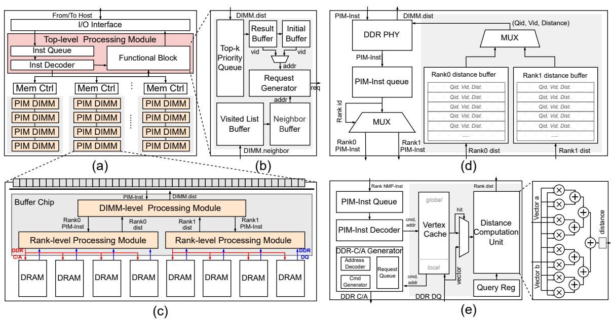

Figure 6: (a) AccelDIMM architecture, (b) Functional block, (c) PIM-enabled DIMM, (d) DIMM-level processing module, and (e) Rank-level processing module

tensors to generate token sequences, which are returned to the host. In iterative RAG, the host derives the next query and repeats the retrieval-generation process until a termination condition is met, such as reaching the maximum iteration count or achieving sufficient confidence. Finally, the host decodes the token sequence into natural language text and returns it to the user as the answer.

#### 4.2 AccelDIMM Architecture

AccelDIMM devices are designed to support completing ANNS operations. *Neighbor fetching* primarily involves memory access and result filtering. However, maintaining a vertex list of access records in memory introduces significant area overhead, making it unsuitable for memory offloading. Similarly, *queue updating*, which requires centralized aggregation of computation results, is also unsuitable for offloading. As a result, memory offloading is restricted to *distance computation* operation.

Figure 6(a) illustrates the architecture design of AccelDIMM. To facilitate interaction with the host, a device interface is implemented to receive host instructions. The top-level processing module is responsible for parsing host instructions, managing device memory, and performing tasks such as neighbor fetching and queue updating. AccelDIMM features multiple memory channels, with each channel interfacing with PIM-enabled DIMMs through dedicated memory controllers. These PIM-enabled DIMMs are the core components of the system. They adopt a unified memory organization [70] to store vertex neighbors and vector data, and support in-memory distance computation. The system's capacity can be scaled by adding more DIMMs. The memory controller supports both standard DDR requests and PIM-specific requests. Each AccelDIMM partitions graph data at the vertex level and evenly distributes it across ranks to ensure balanced workload distribution. The following presents the detailed design of each component.

**Top-level Processing Module** (TPM): The TPM consists of an instruction queue, an instruction decoder, and a functional block. Instructions received from the I/O interface are stored in the instruction queue and decoded by the instruction decoder to initiate ANNS operations on the AccelDIMM. The functional block manages *neighbor fetching* and *queue updating* while generating PIM requests for *distance computation*.

Functional Block (FB): The design of the FB is shown in Figure 6(b). For neighbor fetching tasks, the request generator uses vertex IDs from the initial buffer or result buffer as addresses to generate standard DDR read requests. The neighbor data read from memory is filtered through the visited list and stored in the neighbor buffer. The initial buffer contains fixed starting vertices for the search. For queue updating, the top-k priority queue receives computation results from the DIMMs, sorts them, and saves the nearest neighbors in the result buffer. For PIM request generation, the request generator uses vertex IDs from the neighbor buffer to generate PIM requests.

Memory Controller: To support PIM requests, we integrate a PIM extension into the memory controller to handle tasks such as address mapping and instruction generation. To address the C/A bandwidth limitations in DIMMs, we employ an instruction compression technique similar to RecNMP [39], embedding all DDR commands for a single PIM request into a single PIM instruction. Additionally, we incorporate the two-phase instruction transmission technique proposed by TRiM [65] to minimize instruction waiting times for the in-memory processing module.

**PIM-enabled DIMM:** Due to the irregular and sparse memory access patterns of ANNS, deploying *distance computation* at the bank level in DIMMs leads to idle computational resources, higher area overhead, and limited performance gains. To address this, we deploy *distance computation* at the rank level. As illustrated in

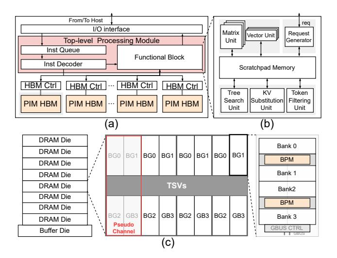

Figure 7: (a) AccelHBM architecture, (b) Functional block, and (c) PIM-enabled HBM

Figure 6(c), two types of processing modules are integrated into the buffer chip: DIMM-level and Rank-level processing modules. Each rank is equipped with a rank-level processing module, enabling multiple ranks to process PIM requests in parallel. For standard DDR commands, the DIMM bypasses these memory processing modules and directly conducts commands such as read and write.

**DIMM-level Processing Module (DPM):** Figure 6(d) illustrates the design of the DPM. This module receives PIM instructions from the DIMM interface and dispatches them to the corresponding rank-level processing modules based on the Rank ID specified in the instructions. Each rank is allocated a dedicated buffer in the DPM to store computation results from the rank-level modules temporarily. These results are then sent back to higher-level components of AccelDIMM via the standard DIMM interface in a round-robin manner for further processing.

Rank-level Processing Module (RPM): Figure 6(e) illustrates the architecture of the RPM, which performs two key functions: PIM instruction decoding and vector distance computation. This module receives PIM instructions from the DPM and decodes them. The DRAM addr field in the PIM instruction serves as a tag to check the vector cache. In the case of a cache miss, the DRAM addr field and DDR command information fields in the PIM instruction are fed into the DDR-C/A generator to generate standard DDR ACT/RD/PRE commands, which retrieve the corresponding vector data from the DRAM. Vector data, whether from cache or DRAM, is then sent to the distance computation unit to compute its distance to the query vector. The distance computation unit is currently designed to support inner product distance, which is the most commonly used metric in RAG. With minor modifications, it can also be extended to support other distance metrics, such as L2 distance.

#### 4.3 AccelHBM Architecture

We explore accelerating LLMs using PIM at the operation level. LLM inference workloads mainly involve three types of operations: GEMM, GEMV, and other operations such as element-wise computations and normalization (e.g., LayerNorm, RMSNorm, and Softmax).

GEMV, with its low arithmetic intensity, is ideal for in-memory processing and is fully offloaded to memory, while GEMM and other operations are handled outside the memory. Within each AccelHBM, we adopt the same mapping scheme as AttAcc [64] for organizing the KV matrices and weight matrices, ensuring parallelism and minimizing data movement. Based on this design, the architecture of AccelHBM is similar to that of AccelDIMM. As shown in Figure 7(a), its core components include a top-level processing module and PIM-enabled HBM. The following focuses on the key differences between the two architectures.

Top-level Processing Module (TPM): In the TPM, the decoder decodes instructions and triggers LLM generation operations. The Functional Block (FB), shown in Figure 7(b), handles all tasks not offloaded to memory. Within the FB, a matrix unit built with a systolic array is dedicated to GEMM computations, while a vector unit composed of multiple Very Long Instruction Word (VLIW) processors [17] supports all other operations. A scratchpad memory module provides data support for all computation units. The request generator issues PIM requests to trigger in-memory operations or conventional HBM requests for data read and write. PIM requests can be broadcast to all HBM controllers to enable parallel execution across memory channels. Additionally, the TPM incorporates a tree search unit, a KV substitution unit, and a token filtering unit to support the proposed optimization strategies (detailed in §4.4).

**PIM-enabled HBM:** The architecture of PIM-enabled HBM is shown in Figure 7(c). It stores weights, KV cache, and other data while supporting in-memory GEMV computations through a unified memory organization. To maximize computational efficiency, we draw inspiration from state-of-the-art GEMV-optimized PIM accelerators, such as Newton [25], and deploy processing modules at the bank level within HBM to enable parallel execution across banks. Each *Bank-level Processing Module* (BPM) includes two computation units for vector inner product operations (similar to the distance computation units in AccelDIMM), with input data sourced from the bank-level row buffer and the channel-level global buffer.

### 4.4 Software-Hardware Co-optimizations

RAG systems also suffer from several key system-level inefficiencies that are difficult to address through hardware-only solutions.

Firstly, document usage in RAG systems exhibits high locality. On the one hand, documents referenced by different user queries follow a power-law distribution, where most requests concentrate on a small subset of popular documents (e.g., 60% requests are directed toward just the top 3% of documents [35]). On the other hand, in iterative RAG scenarios, user queries often reuse the same documents across multiple iterations. However, current systems do not fully exploit this locality, resulting in redundant data transfers and computations.

Secondly, the retrieval and generation stages in RAG systems are strictly interdependent: the generation stage cannot begin until retrieval is complete. Since these stages are processed by different types of heterogeneous PIM devices (e.g., AccelDIMM and Accel-HBM), this sequential execution pattern often leaves one type of device idle, resulting in poor hardware utilization.

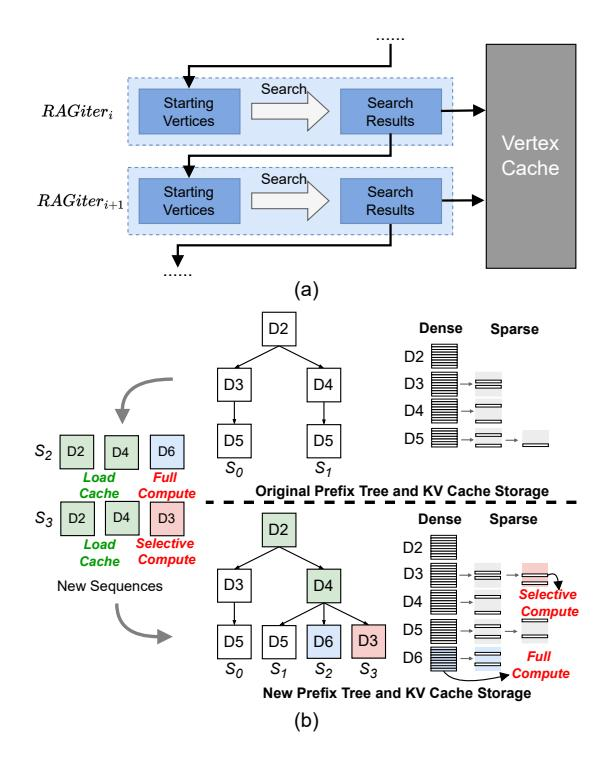

Figure 8: (a) The design of locality-aware retrieval optimization and (b) The processing of new document sequences using locality-aware generation

To address these challenges, we propose three software-hardware co-optimizations: locality-aware retrieval, locality-aware generation, and fine-grained parallel pipeline, which respectively improve the efficiency of the retrieval stage, the generation stage, and the overall system.

Locality-aware Retrieval: Figure [8\(](#page-7-0)a) illustrates the design of locality-aware retrieval. This optimization involves two key approaches: first, since certain vertex vectors are frequently accessed during retrieval, we collect the results of each retrieval and cache frequently used vertex vectors to reduce DRAM accesses. Second, in iterative RAG scenarios, different iterations of the same user query often retrieve the same documents. To accelerate the search process, we reuse search results from the previous iteration as starting vertices for subsequent iterations.

To support locality-aware retrieval, we include a vertex vector cache in each RPM, as shown in Figure [6\(](#page-5-0)e). To simplify the hardware design, all vertex vectors read from DRAM are directly used to update the cache, managed with the Least Recently Used (LRU) replacement policy. In iterative RAG scenarios, after retrieval, the vertex vectors in the result buffer are moved to the initial buffer to serve as starting vertices for the next iteration. For new user queries, the host resets the initial buffer. To optimize cache usage, the cache is divided into two parts: local and global. During query processing, updates are made only to the local cache. After the query is completed, the local cache is merged into the global cache.

Locality-aware Generation: We focus on the prefilling phase in the generation stage, where KV tensors corresponding to frequently retrieved documents are often recomputed multiple times.

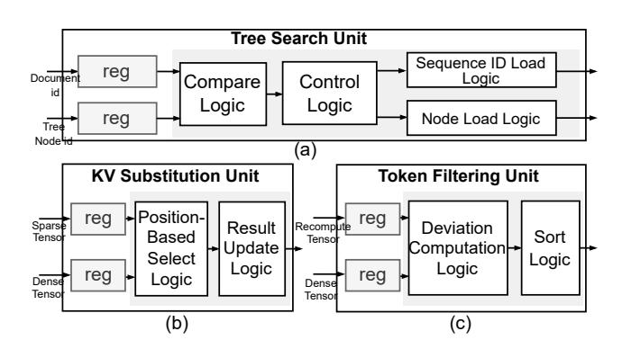

Figure 9: Overview of hardware units for locality-aware generation: (a) tree search unit, (b) KV substitution unit, and (c) token filtering unit

Caching KV tensors for each document consumes significant memory, as multiple copies may be needed for the same document. For instance, sequences like {D1, D2, D3} and {D1, D4, D3} require storing D3's KV twice. While prefix trees [\[35,](#page-12-17) [88\]](#page-14-15) have been employed to share KV caches among sequences with common prefixes, this approach becomes less effective for long sequences with limited prefix overlap. Furthermore, KV is often recomputed when a document appears in a new sequence, even if its entries have already been cached.

Inspired by a recent study [\[87\]](#page-14-16), we propose a method combining prefix trees with selective computation to improve caching and efficiency while maintaining generation quality. Documents are organized into a prefix tree, with nodes storing their tokens and KV addresses. KV is divided into two parts: dense and sparse. The dense part is computed based on the document itself, independent of any sequence. The sparse part keeps only the KV related to certain important tokens when the document appears in a sequence. Due to attention sparsity [\[9,](#page-12-22) [57\]](#page-13-21), keeping only these important tokens does not reduce generation quality and greatly reduces storage for documents appearing multiple times in the tree. Selecting 10–20% of tokens typically causes just a 0.2% attention deviation, which has little effect on generation quality [\[87\]](#page-14-16).

Figure [8\(](#page-7-0)b) illustrates an example of processing new document sequences. After processing the sequences {D2, D3, D5} and {D2, D4, D5}, the system has built a prefix tree. For a new sequence {D2, D4, D6}, the system searches the tree and finds a match for {D2, D4}, but not for D6. For the matched documents D2 and D4, the system loads their dense and sparse KV tensors and constructs a new KV by selectively replacing parts of the dense KV with the sparse KV. Since document D6 does not match any existing path, its KV is not cached and will be computed during the next prefilling phase. When another sequence {D2, D4, D3} arrives, the same procedure is repeated. Although D3 does not match any existing path in the prefix tree, its dense KV exists in the cache, enabling selective recomputation of important tokens. The result is then cached as D3's new sparse KV. When the cache becomes full, the system evicts sparse KV entries based on the LRU replacement policy. When a document's sparse KV entries are all evicted, the system reclaims its cache space entirely.

To support locality-aware generation optimization, we add three customized hardware units to the TPM of the AccelHBM device: the

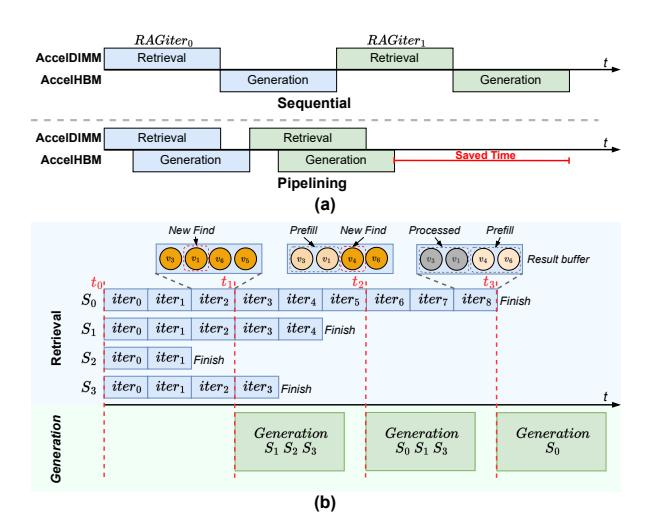

Figure 10: (a) Performance improvement opportunity through retrieval-generation overlap and (b) Fine-grained parallel pipeline optimization example

tree search unit, the KV substitution unit, and the token filtering unit. The design of the three hardware units is illustrated in Figure 9. The tree search unit matches new sequences in the prefix tree. The KV substitution unit combines dense and sparse KV of matched documents. For unmatched documents with cached dense KV, the token filtering unit selects important tokens.

Fine-grained Parallel Pipeline: Within a batch, retrieval tasks vary in difficulty, causing uneven completion times. Most tasks find neighbors quickly, while some take longer. In general, closer neighbors within a task are easier to find, while distant ones take more time [49, 91]. We can start generation once easier tasks are done or difficult tasks are partially completed, instead of waiting for all retrieval to finish. This allows overlap between retrieval and generation to speed up the process, as shown in Figure 10(a).

Specifically, the host aggregates retrieval results at fixed intervals. Completed searches send their top-*k* documents to Accel-HBM, while incomplete ones send the most promising results. With locality-aware generation, AccelHBM can begin *prefilling* immediately upon receiving partial results. Additionally, for requests where retrieval is fully completed, AccelHBM smoothly moves to the *decoding* phase.

Figure 10(b) illustrates a simple example. The system processes four search tasks concurrently. At  $t_1'$ , the host aggregates the intermediate results: task S2 has completed, and all of its results are sent to AccelHBM. Meanwhile, S0, S1, and S3 are still in progress. Since S1 and S3 are close to completion, the host identifies high-confidence results that are unlikely to change and sends them ahead. In contrast, for S0, the newly discovered vertex v1 appears near the head of the result buffer, indicating the search is still in its early stage, and the host therefore skips its results. At  $t_2'$ , S1 and S3 are complete, and their remaining results are sent to AccelHBM. For S0, vertex v4 is newly found and appears near the tail of the result buffer; therefore, the host decides to send v3 and v1, as they are closer to the head of the result buffer. Finally, at  $t_3'$ , S0 finishes its search, and the host transmits the remaining v4 and v6.

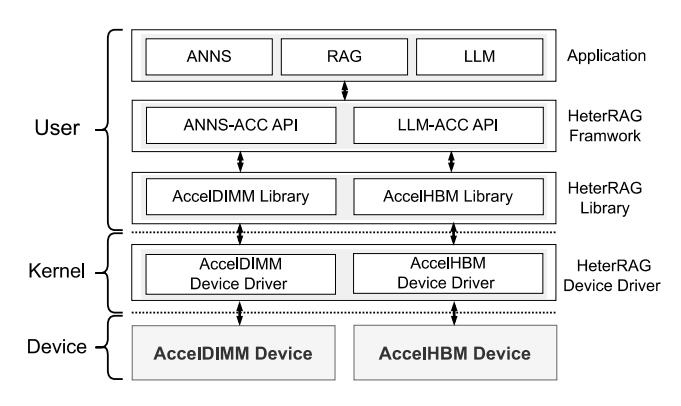

Figure 11: HeterRAG software stack

#### 4.5 HeterRAG Software Stack

To simplify the use of HeterRAG, we develop a software stack based on the existing *Machine Learning* (ML) software stack. As shown in Figure 11, this stack extends the existing ML framework [1] with two primary *Application Programming Interfaces* (APIs): ANNS-ACC for ANNS and LLM-ACC for LLM inference. Together, these APIs enable the seamless execution of RAG workflows by leveraging the HeterRAG library to efficiently manage and coordinate devices like AccelDIMM and AccelHBM.

Programs written with the HeterRAG APIs are parsed by the HeterRAG compiler into intermediate representations, which are then compiled into host executables and device-specific binaries. These binaries are dispatched to devices via drivers. Upon receipt, the devices decode the instructions, execute the assigned tasks, and notify the host or return results directly.

#### 4.6 Discussion

Generalization: First, HeterRAG's heterogeneous PIM architecture is well-suited for applications that demand both high memory bandwidth and large capacity, such as graph processing [11] and recommendation systems [39]. In these scenarios, data is typically divided into two categories: hub data, which is computationally intensive, and regular data, which is more abundant but less demanding [56, 85]. Based on this distinction, hub data is processed on HBM-based PIM, while regular data is handled by DIMM-based PIM, achieving an optimal balance between performance and cost. Second, HeterRAG supports multiple operations such as graph traversal, GEMM, and GEMV, which are fundamental to many applications, including graph neural networks [36].

HBM Memory Capacity: If the system needs to handle very large models, the HBM capacity may become insufficient. Heter-RAG offers three solutions to address this issue, and users can choose any of them based on their specific needs: (i) leverage the scalability of HeterRAG by directly adding additional AccelHBM devices. Since generation tasks in practical RAG applications typically require much less memory than retrieval tasks, the cost of this approach is generally acceptable. Moreover, parallel inference strategies allow HeterRAG to deliver optimal performance; (ii) use standard DIMMs as extra memory, which is a lower-cost option but introduces data transfer bottlenecks between DIMMs and HBM-based PIM, potentially degrading performance; (iii) combine both approaches to achieve a balance between performance and cost.

**Table 1: System configurations** 

| Configuration of AccelDIMM                    |                                                         |  |  |
|-----------------------------------------------|---------------------------------------------------------|--|--|
| DDR                                           | DDR4-3200 MT/s, 16Gb × 8,                               |  |  |
| Specification                                 | 2 Ranks                                                 |  |  |
| DDR                                           | tRC=72, tRCD=22, tCL=22, tRP=22,                        |  |  |
|                                               | tBL=4, tRRD_S=4, tRRD_L=6,                              |  |  |
| Timing Parameters                             | tFAW=30, tCCD_S=4, tCCD_L=6                             |  |  |
| Top-level Processing Module                | 128-entry Inst Queue,                                   |  |  |
|                                               | 1 Inst Decoder, 1KB Result Buffer,                      |  |  |
|                                               | 16MB Visited List Buffer,                               |  |  |
|                                               | 1KB Initial Buffer, 2KB Neighbor Buffer,                |  |  |
|                                               | and 128 FP32 Comparator × 8                             |  |  |
|                                               | for Top-k Priority Queue                                |  |  |
| In-memory Processing Module                | 256/128-entry PIM-Inst Queue                            |  |  |
|                                               | for DPM/RPM, 1 PIM-Inst Decoder,                        |  |  |
|                                               | 32KB Distance buffer for each DPM,                      |  |  |
|                                               | 128KB Vertex Cache, 32 FP32 Mult,                       |  |  |
|                                               | and 32 FP32 Adder for each RPM                          |  |  |
| Configuration of AccelHBM                     |                                                         |  |  |
| HBM                                           | 8-Hi HBM2 stack,                                        |  |  |
| Specification                                 | 8 Channels                                              |  |  |
| TIDM                                          | tRC=45, tRCD=16, tCL =16,                               |  |  |
| HBM                                           | tWR =16, tRAS=29, tRRD =2,                              |  |  |
| Timing Parameter                              | $tCCD_S = 2$ , $tCCD_L = 4$                             |  |  |
| Top-level Processing Module                | 128-entry Inst Queue, 1 Inst Decoder,                   |  |  |
|                                               | 128×128 Systolic array × 8,                             |  |  |
|                                               | 16 4-wide VLIW processors $\times$ 8,                   |  |  |
|                                               | 1 TSU $\times$ 8 , 1 KVSU $\times$ 8, 1 TFU $\times$ 8, |  |  |
|                                               | and 24MB Scratchpad memory                              |  |  |
| In-memory                                     | 32 FP16 Mult, 32 FP16 Adder,                            |  |  |
| Processing Module and 8Kb Buffer for each BPM |                                                         |  |  |

Table 2: The evaluated LLM configurations

| Model         | #Layers | #Head | $\mathbf{d}_{model}$ |
|---------------|---------|-------|----------------------|
| GPT-2 XL-1.5B | 48      | 25    | 1600                 |
| LLaMA2-7B     | 32      | 32    | 4096                 |
| LLaMA2-70B    | 80      | 64    | 8192                 |

#### 5 Evaluation

#### 5.1 Experimental Setup

HeterRAG Settings: We develop a cycle-accurate simulation framework to comprehensively evaluate the performance of the HeterRAG system. Specifically, we extend Ramulator [41] to support top-level and in-memory processing modules, and modify ZSim [69] to offload the retrieval and generation of RAG to the memory side. For different DRAM types, we design two memoryside configurations: one based on DDR4 and the other on HBM2. The detailed system configurations are shown in Table 1. We implement the arithmetic units using Verilog HDL and synthesize them using Synopsys Design Compiler [73] with 65nm technology at 500MHz clock frequency. The power and area data of the inmemory arithmetic units are scaled to 22nm to match the memory technology, adding about 50% more area to account for differences between logic and DRAM processes. DDR4 power consumption is calculated using the MICRON DDR4 power calculator [60], while HBM2 power consumption is based on TPU-v4i [38]. Additionally,

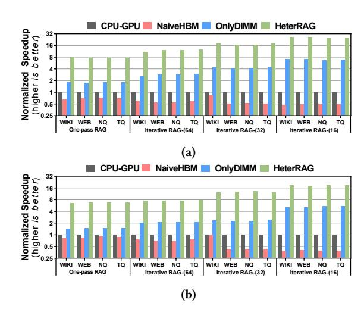

Figure 12: Normalized throughput of CPU-GPU, NaiveHBM, OnlyDIMM, and HeterRAG. We use the two models (a) GPT-2 XL and (b) LLaMA2-7B

we use CACTI [5] to model the latency, energy consumption, and area of all buffers/caches in the system.

**LLM Models:** We select two commonly used open source language models for evaluation in RAG systems: GPT-2 [67] and LLaMA2 [75], with parameter sizes ranging from 1.5B to 70B. Specifically, LLaMA2-70B is used to evaluate scalability. Table 2 provides detailed model configurations. It is worth noting that HeterRAG is highly compatible and supports any language model based on the transformer decoder architecture.

**Datasets and Knowledge Base:** We choose four question answering datasets commonly used in knowledge-intensive open domains: *Wiki-QA* (WIKI) [86], *Web Questions* (WEB) [6], *Natural Questions* (NQ) [42], and *Trivia-QA* (TQ) [37]. To better assess HeterRAG's generation capability, we manually extended the output length during inference. The knowledge base is constructed based on the Wikipedia corpus [10] and uses the graph-based ANNS algorithm HNSW [58] for retrieval.

Baselines: We compare HeterRAG with three baseline systems: (i) <u>CPU-GPU</u> is a real system equipped with an Intel Xeon Gold 5117 CPU (2.00GHz, 256GB DDR4) and an NVIDIA Tesla V100 GPU (32GB HBM2). Energy consumption is measured using Intel RAPL and nvprof; (ii) To validate the architecture's effectiveness, we build the <u>NaiveHBM</u> baseline, where both retrieval and generation run on HBM-based PIM. NaiveHBM consists of two devices: AccelHBM-g and AccelHBM-r. AccelHBM-g is the same as in HeterRAG, while AccelHBM-r uses standard DIMMs and PIM-enabled HBM. For retrieval, the DPM is placed in the HBM buffer die, with one RPM assigned to each channel; (iii) <u>OnlyDIMM</u> runs both retrieval and generation on DIMM-based PIM, with each DIMM bank equipped with a BPM for generation tasks. All baselines use the same size for each type of DRAM. For instance, the HBM size in AccelHBM is identical to the V100 GPU.

#### 5.2 Overall Performance

**Throughput:** Figure 12 compares the throughput of HeterRAG with CPU-GPU, NaiveHBM, and OnlyDIMM under different configurations. The results show that the NaiveHBM baseline performs

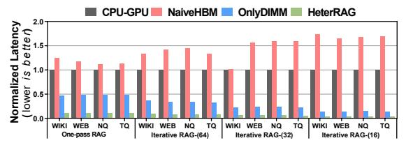

Figure 13: Normalized latency of CPU-GPU, NaiveHBM, OnlyDIMM, and HeterRAG on LLaMA2-7B model

Table 3: Average resource utilization of AccelDIMM and AccelHBM across all evaluation configurations

|           | HeterRAG-base | HeterRAG-p |
|-----------|---------------|------------|
| AccelDIMM | 37.8%         | 44.5%      |
| AccelHBM  | 31.0%         | 38.6%      |

worse than the CPU-GPU baseline due to the overhead of data transfers from DIMMs to HBM, which offsets the performance gains from the PIM design. In contrast, the OnlyDIMM baseline performs better as it relies solely on DIMM-based PIM, achieving high bandwidth for both retrieval and generation tasks. As a result, OnlyDIMM improves throughput by  $1.41\times$  to  $7.21\times$  ( $3.38\times$  on average) compared to the CPU-GPU baseline. HeterRAG further improves throughput by  $6.62\times$  to  $26.53\times$  ( $13.52\times$  on average) over the CPU-GPU baseline.

**Latency:** Figure 13 compares the end-to-end latency of a single RAG request for HeterRAG and various baselines. The results show that HeterRAG processes each RAG request with exceptionally low latency. On average, HeterRAG reduces response latency by 13.72×, 19.47×, and 4.07× compared to CPU-GPU, NaiveHBM, and OnlyDIMM, respectively.

Energy Efficiency: HeterRAG achieves higher energy efficiency than the CPU-GPU, NaiveHBM, and OnlyDIMM baselines, as shown in Figure 14(a). Compared to the CPU-GPU baseline, HeterRAG reduces energy consumption by 35.50% to 63.76% (49.8% on average), owing to its PIM design, which substantially reduces the energy required for memory access. Compared to the NaiveHBM baseline, HeterRAG reduces energy consumption by an average of 17.0%. Against the OnlyDIMM baseline, HeterRAG lowers energy consumption by an average of 72.25%, taking advantage of HBM's low energy per bit transfer. Figure 14(b) presents the energy breakdown across different baselines, showing that HeterRAG reduces energy consumption in retrieval, generation, and data transfer due to its efficient architecture and software-hardware optimizations.

#### 5.3 Implication of Optimization

For HeterRAG, we evaluate multiple variants to analyze the impact of the three proposed optimizations. Specifically, HeterRAG-base has no optimizations, HeterRAG-r applies locality-aware optimization for the retrieval stage, HeterRAG-g applies locality-aware optimization for the generation stage, HeterRAG-p introduces fine-grained parallel pipeline optimization, and HeterRAG-rgp combines all optimizations. Figure 15 compares the throughput performance of the five different HeterRAG variants.

Locality-aware retrieval, locality-aware generation, and finegrained parallel pipeline optimization improve throughput by an average of 1.25×, 1.22×, and 1.20×, respectively. Locality-aware

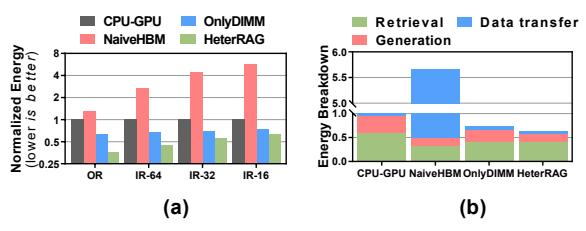

Figure 14: (a) Normalized energy and (b) Energy breakdown per request for CPU-GPU, NaiveHBM, OnlyDIMM, and HeterRAG (LLaMA2-7B, results averaged across four datasets)

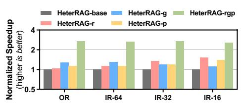

Figure 15: Normalized throughput of HeterRAG variants (LLaMA2-7B, results averaged across four datasets)

generation shows the most improvement in configurations where the generation stage dominates (e.g., one-pass RAG), while locality-aware retrieval is more effective when the retrieval stage dominates (e.g., iterative RAG with a retrieval interval of 16). Fine-grained parallel pipeline optimization provides consistent benefits across all configurations. As shown in Table 3, it enhances resource utilization for both device types to 44.5% and 38.6%, demonstrating its effectiveness. These results demonstrate the adaptability of the three optimization techniques, allowing users to choose and combine them based on specific needs.

#### 5.4 Scalability

With the growing scale of data, it is important to evaluate the scalability of HeterRAG when adding heterogeneous PIM devices. We analyze this from two aspects: retrieval and generation.

**Retrieval:** We synthesize a larger Wikipedia knowledge base with approximately 1 billion entries, exceeding 4TB in size, and increase the number of AcclDIMM devices from 4 to 32 to measure retrieval throughput. As shown in Figure 16(a), HeterRAG achieves near-superlinear throughput improvement. This is due to data parallelism, where adding more AcclDIMMs reduces the workload per device. With no inter-device communication, only a small amount of results is sent to the host for aggregation.

**Generation:** We use the LLaMA2-70B model with each AcclHBM configured to 80GB HBM capacity. We increase the number of AcclHBMs from 4 to 10 to measure inference throughput. As shown in Figure 16(b), a  $2.5\times$  increase in AcclHBMs leads to a  $1.78\times$  improvement in throughput, showing decent scalability. However, linear speedup is limited because the generation phase involves unavoidable communication between devices.

#### 5.5 Comparison with Prior Work

**Retrieval:** We compare HeterRAG with MemANNS [15] and DRIMANN [14], both using the UPMEM module, and evaluate them on the SIFT dataset. As shown in Figure 17(a), HeterRAG achieves an average  $25.15\times$  and  $28.42\times$  higher *Queries Per Second* (QPS), respectively. This performance gain comes from two factors: HeterRAG's

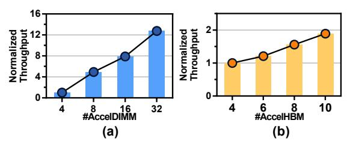

Figure 16: Scalability of (a) AccelDIMM and (b) AccelHBM

graph-based ANNS is more efficient than the PQ-based ANNS used by MemANNS and DRIM-ANN, and its specialized hardware outperforms the general-purpose RISC cores of UPMEM.

**Generation:** We compare HeterRAG with two state-of-the-art HBM-based PIM acceleration approaches on the LLaMA2-70B model. As shown in Figure 17(b), HeterRAG exhibits performance comparable to NeuPIMs [26] and AttAcc [64].

**End-to-end RAG:** We compare HeterRAG with two existing heterogeneous RAG acceleration solutions, Chameleon [33] and PipeRAG [34], using the same benchmark as reported in the respective papers. As shown in Figure 17(c) and (d), with architectural and algorithmic innovations, HeterRAG achieves an average 6.17× higher throughput than FPGA-GPU-based Chameleon and 5.48× lower latency than CPU-GPU-based PipeRAG.

#### 5.6 Area Overhead

We estimate the area overhead of the two PIM designs in HeterRAG. For HBM, one BPM is assigned to every two banks, adding a total area overhead of  $6.016mm^2$  on the DRAM die, which is about 11.31% of the  $53.15mm^2$  HBM2 [93]. Most of this comes from the arithmetic units. For DIMM, each RPM requires about  $3.368mm^2$ , and each DPM adds  $0.842mm^2$ , totaling  $7.817mm^2$  per DIMM. Since a typical buffer chip area is over  $100mm^2$ , this overhead is acceptable.

#### 6 Related Work

Approximate Nearest Neighbor Search Acceleration: A lot of research has focused on optimizing ANNS, including hash-based [71], tree-based [18, 22], and product quantization-based [4] methods. Recently, graph-based [19, 58, 82] ANNS methods have become the mainstream in academia and industry due to their strong performance in search tasks. On the hardware side, many studies have explored using GPUs [63], FPGAs [89], and ASIC-based [47] hardware to accelerate ANNS. Unlike these studies, our work focuses on in-memory acceleration for ANNS in RAG scenarios and investigates how to leverage locality in RAG to improve performance.

Large Language Models Acceleration: Many studies accelerate model inference through software-hardware co-design. For example, A3 [24] proposed an approximate attention mechanism with dedicated hardware. Although these methods improve performance, they do not address the memory bottleneck. Recently, some studies have explored PIM techniques to speed up transformer-based LLMs, including TransPIM [93], AttAcc [64], NeuPIMs [26], and IANUS [70]. Others combine algorithm optimization with PIM, such as PIM-DL [50], which replaces GEMM computations with lookup table operations for better in-memory performance, and SpecPIM [51], which uses PIM to accelerate speculative inference. Unlike these studies, our work focuses on identifying the best PIM

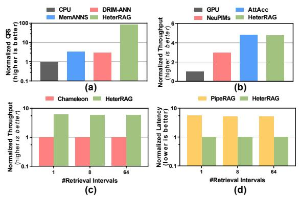

Figure 17: Performance comparison of HeterRAG with (a) MemANNS and DRIM-ANN, (b) NeuPIMs and AttAcc, (c) Chameleon, and (d) PipeRAG

design for model inference in RAG systems and optimizing for RAG-specific features.

Retrieval-augmented Generation Acceleration: Some recent studies focus on optimizing RAG systems. Some focus on software optimizations, such as RaLMSpec [92], which improves RAG's retrieval stage using speculative retrieval mechanisms, and RAG-cache [35], which primarily optimizes the generation stage with the knowledge tree structure. PipeRAG [34] aggressively reuses retrieval results from previous iterations for the current generation stage, improving overall system performance. Unlike these methods, our optimizations consider retrieval, generation, and pipeline comprehensively, with a design distinct from existing works. Combining ideas from these studies could further improve the performance of HeterRAG. On the hardware side, Chameleon [33] uses a heterogeneous FPGA and GPU design to accelerate RAG. However, it relies on PQ-based ANNS for retrieval and does not address the memory bottleneck in RAG systems.

#### 7 Conclusion

Retrieval-augmented Generation (RAG) is widely used and involves two stages: retrieval and generation. However, it faces challenges due to high memory capacity and bandwidth demands. Existing HBM-based PIM solutions struggle to meet both requirements simultaneously. To address this, we present HeterRAG, a heterogeneous PIM system combining HBM-based PIM and DIMM-based PIM. DIMM-based PIM provides larger memory capacity, complementing HBM-based PIM while ensuring high performance, energy efficiency, and lower hardware costs. We also propose three optimizations to improve retrieval and generation efficiency and enhance pipeline execution. Evaluation results show that HeterRAG significantly outperforms the CPU-GPU baseline in throughput, latency, and energy efficiency.

#### Acknowledgments

We thank all anonymous reviewers for their helpful comments and feedback. This work is supported by the National Key Research and Development Program of China under Grant No. 2023YFB4503400. Chaoqiang Liu and Haifeng Liu contributed equally to this work. Dan Chen is the corresponding author.

### References

- [1] Martín Abadi, Paul Barham, Jianmin Chen, Zhifeng Chen, Andy Davis, Jeffrey Dean, Matthieu Devin, Sanjay Ghemawat, Geoffrey Irving, Michael Isard, Manjunath Kudlur, Josh Levenberg, Rajat Monga, Sherry Moore, Derek Gordon Murray, Benoit Steiner, Paul A. Tucker, Vijay Vasudevan, Pete Warden, Martin Wicke, Yuan Yu, and Xiaoqiang Zheng. 2016. TensorFlow: A System for Large-Scale Machine Learning. In Proceedings of the USENIX Symposium on Operating Systems Design and Implementation (OSDI). 265–283.
- [2] Chetan Arora, Tomas Herda, and Verena Homm. 2024. Generating Test Scenarios from NL Requirements Using Retrieval-Augmented LLMs: An Industrial Study. In Proceedings of the IEEE International Requirements Engineering Conference (RE). 240–251.
- [3] Bahar Asgari, Ramyad Hadidi, Jiashen Cao, Da Eun Shim, Sung Kyu Lim, and Hyesoon Kim. 2021. FAFNIR: Accelerating Sparse Gathering by Using Efficient Near-Memory Intelligent Reduction. In Proceedings of the IEEE International Symposium on High-Performance Computer Architecture (HPCA). 908–920.
- [4] Artem Babenko and Victor S. Lempitsky. 2014. Additive Quantization for Extreme Vector Compression. In Proceedings of the IEEE Conference on Computer Vision and Pattern Recognition (CVPR). 931–938.
- [5] Rajeev Balasubramonian, Andrew B. Kahng, Naveen Muralimanohar, Ali Shafiee, and Vaishnav Srinivas. 2017. CACTI 7: New Tools for Interconnect Exploration in Innovative Off-Chip Memories. ACM Transactions on Architecture and Code Optimization 14, 2 (2017), 14:1–14:25.
- [6] Jonathan Berant, Andrew Chou, Roy Frostig, and Percy Liang. 2013. Semantic Parsing on Freebase from Question-Answer Pairs. In Proceedings of the Conference on Empirical Methods in Natural Language Processing (EMNLP). 1533–1544.
- [7] Sebastian Borgeaud, Arthur Mensch, Jordan Hoffmann, Trevor Cai, Eliza Rutherford, Katie Millican, George van den Driessche, Jean-Baptiste Lespiau, Bogdan Damoc, Aidan Clark, Diego de Las Casas, Aurelia Guy, Jacob Menick, Roman Ring, Tom Hennigan, Saffron Huang, Loren Maggiore, Chris Jones, Albin Cassirer, Andy Brock, Michela Paganini, Geoffrey Irving, Oriol Vinyals, Simon Osindero, Karen Simonyan, Jack W. Rae, Erich Elsen, and Laurent Sifre. 2022. Improving Language Models by Retrieving from Trillions of Tokens. In Proceedings of the International Conference on Machine Learning (ICML). 2206–2240.
- [8] Tom B. Brown, Benjamin Mann, Nick Ryder, Melanie Subbiah, Jared Kaplan, Prafulla Dhariwal, Arvind Neelakantan, Pranav Shyam, Girish Sastry, Amanda Askell, Sandhini Agarwal, Ariel Herbert-Voss, Gretchen Krueger, Tom Henighan, Rewon Child, Aditya Ramesh, Daniel M. Ziegler, Jeffrey Wu, Clemens Winter, Christopher Hesse, Mark Chen, Eric Sigler, Mateusz Litwin, Scott Gray, Benjamin Chess, Jack Clark, Christopher Berner, Sam McCandlish, Alec Radford, Ilya Sutskever, and Dario Amodei. 2020. Language models are few-shot learners. In Advances in Neural Information Processing Systems 33: Annual Conference on Neural Information Processing Systems (NeurIPS). 1877–1901.
- [9] Beidi Chen, Tri Dao, Eric Winsor, Zhao Song, Atri Rudra, and Christopher Ré. 2021. Scatterbrain: Unifying Sparse and Low-rank Attention. In Advances in Neural Information Processing Systems 34: Annual Conference on Neural Information Processing Systems (NeurIPS). 17413–17426.
- [10] Danqi Chen, Adam Fisch, Jason Weston, and Antoine Bordes. 2017. Reading Wikipedia to Answer Open-Domain Questions. In Proceedings of the Annual Meeting of the Association for Computational Linguistics (ACL). 1870–1879.
- [11] Dan Chen, Chuangyi Gui, Yi Zhang, Hai Jin, Long Zheng, Yu Huang, and Xiaofei Liao. 2022. GraphFly: Efficient Asynchronous Streaming Graphs Processing via Dependency-Flow. In Proceedings of the International Conference for High Performance Computing, Networking, Storage and Analysis (SC). 45:1–45:14.
- [12] Dan Chen, Haiheng He, Hai Jin, Long Zheng, Yu Huang, Xinyang Shen, and Xiaofei Liao. 2023. MetaNMP: Leveraging Cartesian-Like Product to Accelerate HGNNs with Near-Memory Processing. In Proceedings of the ACM/IEEE Annual International Symposium on Computer Architecture (ISCA). 56:1–56:13.
- [13] Dan Chen, Hai Jin, Long Zheng, Yu Huang, Pengcheng Yao, Chuangyi Gui, Qinggang Wang, Haifeng Liu, Haiheng He, Xiaofei Liao, and Ran Zheng. 2022. A General Offloading Approach for Near-DRAM Processing-In-Memory Architectures. In Proceedings of the IEEE International Parallel and Distributed Processing Symposium (IPDPS). 246–257.
- [14] Mingkai Chen, Tianhua Han, Cheng Liu, Shengwen Liang, Kuai Yu, Lei Dai, Ziming Yuan, Ying Wang, Lei Zhang, Huawei Li, and Xiaowei Li. 2024. DRIM-ANN: An Approximate Nearest Neighbor Search Engine based on Commercial DRAM-PIMs. ArXiv Preprint arXiv:2410.15621 (2024).
- [15] Sitian Chen, Amelie Chi Zhou, Yucheng Shi, Yusen Li, and Xin Yao. 2024. MemANNS: Enhancing Billion-Scale ANNS Efficiency with Practical PIM Hardware. ArXiv Preprint arXiv:2410.23805 (2024).
- [16] Compute Express Link Consortium. 2024. Compute Express Link™ (CXL™) specification. [https://computeexpresslink.org/cxl-specification](https: //computeexpresslink.org/cxl-specification)
- [17] Joseph A. Fisher. 1983. Very Long Instruction Word Architectures and the ELI-512. In Proceedings of the Annual Symposium on Computer Architecture (ISCA). 140–150.
- [18] Jerome H. Friedman, Jon Louis Bentley, and Raphael A. Finkel. 1977. An Algorithm for Finding Best Matches in Logarithmic Expected Time. ACM Trans. Math.

- Software 3, 3 (1977), 209–226.
- [19] Cong Fu, Chao Xiang, Changxu Wang, and Deng Cai. 2019. Fast Approximate Nearest Neighbor Search With The Navigating Spreading-out Graph. Proceedings of the VLDB Endowment 12, 5 (2019), 461–474.
- [20] Galileo. 2025. "Mastering RAG: How To Architect An Enterprise RAG System". [https://www.galileo.ai/blog/mastering-rag-how-to-architect-an](https://www.galileo.ai/blog/mastering-rag-how-to-architect-an-enterprise-rag-system)[enterprise-rag-system](https://www.galileo.ai/blog/mastering-rag-how-to-architect-an-enterprise-rag-system)
- [21] Peng Gu, Xinfeng Xie, Yufei Ding, Guoyang Chen, Weifeng Zhang, Dimin Niu, and Yuan Xie. 2020. iPIM: Programmable In-Memory Image Processing Accelerator Using Near-Bank Architecture. In Proceedings of the ACM/IEEE Annual International Symposium on Computer Architecture (ISCA). 804–817.
- [22] Antonin Guttman. 1984. R-Trees: A Dynamic Index Structure for Spatial Searching. In Proceedings of International Conference on Management of Data (SIGMOD). 47–57.
- [23] Kelvin Guu, Kenton Lee, Zora Tung, Panupong Pasupat, and Ming-Wei Chang. 2020. Retrieval Augmented Language Model Pre-Training. In Proceedings of the International Conference on Machine Learning (ICML), Vol. 119. 3929–3938.
- [24] Tae Jun Ham, Sungjun Jung, Seonghak Kim, Young H. Oh, Yeonhong Park, Yoonho Song, Jung-Hun Park, Sanghee Lee, Kyoung Park, Jae W. Lee, and Deog-Kyoon Jeong. 2020. A3 : Accelerating Attention Mechanisms in Neural Networks with Approximation. In Proceedings of the IEEE International Symposium on High Performance Computer Architecture (HPCA). 328–341.
- [25] Mingxuan He, Choungki Song, Ilkon Kim, Chunseok Jeong, Seho Kim, Il Park, Mithuna Thottethodi, and T. N. Vijaykumar. 2020. Newton: A DRAM-maker's Accelerator-in-Memory (AiM) Architecture for Machine Learning. In Proceedings of the Annual IEEE/ACM International Symposium on Microarchitecture (MICRO). 372–385.
- [26] Guseul Heo, Sangyeop Lee, Jaehong Cho, Hyunmin Choi, Sanghyeon Lee, Hyungkyu Ham, Gwangsun Kim, Divya Mahajan, and Jongse Park. 2024. NeuPIMs: NPU-PIM Heterogeneous Acceleration for Batched LLM Inferencing. In Proceedings of the ACM International Conference on Architectural Support for Programming Languages and Operating Systems (ASPLOS). 722–737.
- [27] Jordan Hoffmann, Sebastian Borgeaud, Arthur Mensch, Elena Buchatskaya, Trevor Cai, Eliza Rutherford, Diego de Las Casas, Lisa Anne Hendricks, Johannes Welbl, Aidan Clark, Tom Hennigan, Eric Noland, Katie Millican, George van den Driessche, Bogdan Damoc, Aurelia Guy, Simon Osindero, Karen Simonyan, Erich Elsen, Jack W. Rae, Oriol Vinyals, and Laurent Sifre. 2022. Training Compute-Optimal Large Language Models. ArXiv Preprint arXiv:2203.15556 (2022).
- [28] Lei Huang, Weijiang Yu, Weitao Ma, Weihong Zhong, Zhangyin Feng, Haotian Wang, Qianglong Chen, Weihua Peng, Xiaocheng Feng, Bing Qin, and Ting Liu. 2025. A Survey on Hallucination in Large Language Models: Principles, Taxonomy, Challenges, and Open Questions. ACM Transactions on Information Systems 43, 2 (2025), 1–55.
- [29] Yu Huang, Long Zheng, Pengcheng Yao, Qinggang Wang, Xiaofei Liao, Hai Jin, and Jingling Xue. 2022. Accelerating Graph Convolutional Networks Using Crossbar-based Processing-In-Memory Architectures. In Proceedings of the IEEE International Symposium on High-Performance Computer Architecture (HPCA). 1029–1042.
- [30] Yu Huang, Long Zheng, Pengcheng Yao, Qinggang Wang, Haifeng Liu, Xiaofei Liao, Hai Jin, and Jingling Xue. 2022. ReaDy: A ReRAM-Based Processingin-Memory Accelerator for Dynamic Graph Convolutional Networks. IEEE Transactions on Computer-Aided Design of Integrated Circuits and Systems 41, 11 (2022), 3567–3578.
- [31] Gautier Izacard and Edouard Grave. 2021. Leveraging Passage Retrieval with Generative Models for Open Domain Question Answering. In Proceedings of the Conference of the European Chapter of the Association for Computational Linguistics (EACL). 874–880.
- [32] JEDEC. 2021. DDR4 SDRAM STANDARD.
- [33] Wenqi Jiang, Marco Zeller, Roger Waleffe, Torsten Hoefler, and Gustavo Alonso. 2023. Chameleon: a Heterogeneous and Disaggregated Accelerator System for Retrieval-Augmented Language Models. ArXiv Preprint arXiv:2310.09949 (2023).
- [34] Wenqi Jiang, Shuai Zhang, Boran Han, Jie Wang, Bernie Wang, and Tim Kraska. 2024. PipeRAG: Fast Retrieval-Augmented Generation via Algorithm-System Co-design. ArXiv Preprint arXiv:2403.05676 (2024).
- [35] Chao Jin, Zili Zhang, Xuanlin Jiang, Fangyue Liu, Xin Liu, Xuanzhe Liu, and Xin Jin. 2024. RAGCache: Efficient Knowledge Caching for Retrieval-Augmented Generation. ArXiv Preprint arXiv:2404.12457 (2024).
- [36] Hai Jin, Dan Chen, Long Zheng, Yu Huang, Pengcheng Yao, Jin Zhao, Xiaofei Liao, and Wenbin Jiang. 2023. Accelerating Graph Convolutional Networks Through a PIM-Accelerated Approach. IEEE Trans. Comput. 72, 9 (2023), 2628–2640.
- [37] Mandar Joshi, Eunsol Choi, Daniel S. Weld, and Luke Zettlemoyer. 2017. TriviaQA: A Large Scale Distantly Supervised Challenge Dataset for Reading Comprehension. In Proceedings of the Annual Meeting of the Association for Computational Linguistics (ACL). 1601–1611.
- [38] Norman P. Jouppi, Doe Hyun Yoon, Matthew Ashcraft, Mark Gottscho, Thomas B. Jablin, George Kurian, James Laudon, Sheng Li, Peter C. Ma, Xiaoyu Ma, Thomas Norrie, Nishant Patil, Sushma Prasad, Cliff Young, Zongwei Zhou, and David A.

- Patterson. 2021. Ten Lessons From Three Generations Shaped Google's TPUv4i : Industrial Product. In Proceedings of the ACM/IEEE Annual International Symposium on Computer Architecture (ISCA). 1–14.
- [39] Liu Ke, Udit Gupta, Benjamin Youngjae Cho, David Brooks, Vikas Chandra, Utku Diril, Amin Firoozshahian, Kim M. Hazelwood, Bill Jia, Hsien-Hsin S. Lee, Meng Li, Bert Maher, Dheevatsa Mudigere, Maxim Naumov, Martin Schatz, Mikhail Smelyanskiy, Xiaodong Wang, Brandon Reagen, Carole-Jean Wu, Mark Hempstead, and Xuan Zhang. 2020. RecNMP: Accelerating Personalized Recommendation with Near-Memory Processing. In Proceedings of the ACM/IEEE Annual International Symposium on Computer Architecture (ISCA). 790–803.
- [40] Omar Khattab, Keshav Santhanam, Xiang Lisa Li, David Hall, Percy Liang, Christopher Potts, and Matei Zaharia. 2022. Demonstrate-Search-Predict: Composing retrieval and language models for knowledge-intensive NLP. ArXiv Preprint arXiv:2212.14024 (2022).
- [41] Yoongu Kim, Weikun Yang, and Onur Mutlu. 2016. Ramulator: A Fast and Extensible DRAM Simulator. IEEE Computer Architecture Letters 15, 1 (2016), 45–49.
- [42] Tom Kwiatkowski, Jennimaria Palomaki, Olivia Redfield, Michael Collins, Ankur P. Parikh, Chris Alberti, Danielle Epstein, Illia Polosukhin, Jacob Devlin, Kenton Lee, Kristina Toutanova, Llion Jones, Matthew Kelcey, Ming-Wei Chang, Andrew M. Dai, Jakob Uszkoreit, Quoc Le, and Slav Petrov. 2019. Natural Questions: a Benchmark for Question Answering Research. Transactions of the Association for Computational Linguistics 7 (2019), 452–466.
- [43] Young-Cheon Kwon, Suk Han Lee, Jaehoon Lee, Sang-Hyuk Kwon, Je-Min Ryu, Jong-Pil Son, Seongil O, Hak-soo Yu, Haesuk Lee, Soo Young Kim, Youngmin Cho, Jin Guk Kim, Jongyoon Choi, Hyunsung Shin, Jin Kim, BengSeng Phuah, Hyoungmin Kim, Myeong Jun Song, Ahn Choi, Daeho Kim, Sooyoung Kim, Eun-Bong Kim, David Wang, Shinhaeng Kang, Yuhwan Ro, Seungwoo Seo, Joon-Ho Song, Jaeyoun Youn, Kyomin Sohn, and Nam Sung Kim. 2021. 25.4 A 20nm 6GB Function-In-Memory DRAM, Based on HBM2 with a 1.2TFLOPS Programmable Computing Unit Using Bank-Level Parallelism, for Machine Learning Applications. In Proceedings of the IEEE International Solid-State Circuits Conference (ISSCC). 350–352.
- [44] Youngeun Kwon, Yunjae Lee, and Minsoo Rhu. 2019. TensorDIMM: A Practical Near-Memory Processing Architecture for Embeddings and Tensor Operations in Deep Learning. In Proceedings of the Annual IEEE/ACM International Symposium on Microarchitecture (MICRO). 740–753.
- [45] Suk Han Lee, Shinhaeng Kang, Jaehoon Lee, Hyeonsu Kim, Eojin Lee, Seungwoo Seo, Hosang Yoon, Seungwon Lee, Kyounghwan Lim, Hyunsung Shin, Jinhyun Kim, Seongil O, Anand Iyer, David Wang, Kyomin Sohn, and Nam Sung Kim. 2021. Hardware Architecture and Software Stack for PIM Based on Commercial DRAM Technology : Industrial Product. In Proceedings of the ACM/IEEE Annual International Symposium on Computer Architecture (ISCA). 43–56.
- [46] Seong Ju Lee, Kyu-Young Kim, Sanghoon Oh, Joonhong Park, Gimoon Hong, Dong Yoon Ka, Kyu-Dong Hwang, Jeongje Park, Kyeong Pil Kang, Jungyeon Kim, Junyeol Jeon, Nahsung Kim, Yongkee Kwon, Kornijcuk Vladimir, Woojae Shin, Jongsoon Won, Minkyu Lee, Hyunha Joo, Haerang Choi, Jaewook Lee, Donguc Ko, Younggun Jun, Keewon Cho, Ilwoong Kim, Choungki Song, Chunseok Jeong, Dae-Han Kwon, Jieun Jang, Il Park, Junhyun Chun, and Joohwan Cho. 2022. A 1ynm 1.25V 8Gb, 16Gb/s/pin GDDR6-based Accelerator-in-Memory supporting 1TFLOPS MAC Operation and Various Activation Functions for Deep-Learning Applications. In Proceedings of the IEEE International Solid-State Circuits Conference (ISSCC). 1–3.
- [47] Yejin Lee, Hyunji Choi, Sunhong Min, Hyunseung Lee, Sangwon Beak, Dawoon Jeong, Jae W. Lee, and Tae Jun Ham. 2022. ANNA: Specialized Architecture for Approximate Nearest Neighbor Search. In Proceedings of the IEEE International Symposium on High-Performance Computer Architecture (HPCA). 169–183.
- [48] Patrick S. H. Lewis, Ethan Perez, Aleksandra Piktus, Fabio Petroni, Vladimir Karpukhin, Naman Goyal, Heinrich Küttler, Mike Lewis, Wen-tau Yih, Tim Rocktäschel, Sebastian Riedel, and Douwe Kiela. 2020. Retrieval-Augmented Generation for Knowledge-Intensive NLP Tasks. In Advances in Neural Information Processing Systems 33: Annual Conference on Neural Information Processing Systems (NeurIPS). 9459–9474.
- [49] Conglong Li, Minjia Zhang, David G. Andersen, and Yuxiong He. 2020. Improving Approximate Nearest Neighbor Search through Learned Adaptive Early Termination. In Proceedings of the International Conference on Management of Data (SIGMOD). 2539–2554.
- [50] Cong Li, Zhe Zhou, Yang Wang, Fan Yang, Ting Cao, Mao Yang, Yun Liang, and Guangyu Sun. 2024. PIM-DL: Expanding the Applicability of Commodity DRAM-PIMs for Deep Learning via Algorithm-System Co-Optimization. In Proceedings of the ACM International Conference on Architectural Support for Programming Languages and Operating Systems (ASPLOS). 879–896.
- [51] Cong Li, Zhe Zhou, Size Zheng, Jiaxi Zhang, Yun Liang, and Guangyu Sun. 2024. SpecPIM: Accelerating Speculative Inference on PIM-Enabled System via Architecture-Dataflow Co-Exploration. In Proceedings of the ACM International Conference on Architectural Support for Programming Languages and Operating Systems (ASPLOS). 950–965.

- [52] Wen Li, Ying Zhang, Yifang Sun, Wei Wang, Mingjie Li, Wenjie Zhang, and Xuemin Lin. 2020. Approximate Nearest Neighbor Search on High Dimensional Data - Experiments, Analyses, and Improvement. IEEE Transactions on Knowledge and Data Engineering 32 (2020), 1475–1488.
- [53] Chaoqiang Liu, Xiaofei Liao, Long Zheng, Yu Huang, Haifeng Liu, Yi Zhang, Haiheng He, Haoyan Huang, Jingyi Zhou, and Hai Jin. 2024. L-FNNG: Accelerating Large-Scale KNN Graph Construction on CPU-FPGA Heterogeneous Platform. ACM Transactions on Reconfigurable Technology and Systems 17, 3 (2024), 46:1–46:29.
- [54] Chaoqiang Liu, Haifeng Liu, Long Zheng, Yu Huang, Xiangyu Ye, Xiaofei Liao, and Hai Jin. 2023. FNNG: A High-Performance FPGA-based Accelerator for K-Nearest Neighbor Graph Construction. In Proceedings of the ACM/SIGDA International Symposium on Field Programmable Gate Arrays (FPGA). 67–77.
- [55] Fei Liu, Zejun Kang, and Xing Han. 2024. Optimizing RAG Techniques for Automotive Industry PDF Chatbots: A Case Study with Locally Deployed Ollama Models. ArXiv Preprint arXiv:2408.05933 (2024).
- [56] Haifeng Liu, Long Zheng, Yu Huang, Chaoqiang Liu, Xiangyu Ye, Jingrui Yuan, Xiaofei Liao, Hai Jin, and Jingling Xue. 2023. Accelerating Personalized Recommendation with Cross-level Near-Memory Processing. In Proceedings of the ACM/IEEE Annual International Symposium on Computer Architecture (ISCA). 66:1–66:13.
- [57] Zichang Liu, Aditya Desai, Fangshuo Liao, Weitao Wang, Victor Xie, Zhaozhuo Xu, Anastasios Kyrillidis, and Anshumali Shrivastava. 2023. Scissorhands: Exploiting the Persistence of Importance Hypothesis for LLM KV Cache Compression at Test Time. In Advances in Neural Information Processing Systems 36: Annual Conference on Neural Information Processing Systems (NeurIPS). 52342–52364.
- [58] Yury A. Malkov and Dmitry A. Yashunin. 2020. Efficient and Robust Approximate Nearest Neighbor Search Using Hierarchical Navigable Small World Graphs. IEEE Transactions on Pattern Analysis and Machine Intelligence 42, 4 (2020), 824–836.
- [59] Alex Mallen, Akari Asai, Victor Zhong, Rajarshi Das, Daniel Khashabi, and Hannaneh Hajishirzi. 2023. When Not to Trust Language Models: Investigating Effectiveness of Parametric and Non-Parametric Memories. In Proceedings of the Annual Meeting of the Association for Computational Linguistics (ACL). 9802–9822.
- [60] Micron. 2017. "Micron: System power calculator (DDR4)". [https://www.micron.](https://www.micron.com/sales-support/design-tools/dram-power-calculator) [com/sales-support/design-tools/dram-power-calculator](https://www.micron.com/sales-support/design-tools/dram-power-calculator)
- [61] Hadi Asghari Moghaddam, Young Hoon Son, Jung Ho Ahn, and Nam Sung Kim. 2016. Chameleon: Versatile and practical near-DRAM acceleration architecture for large memory systems. In Proceedings of the Annual IEEE/ACM International Symposium on Microarchitecture (MICRO). 50:1–50:13.
- [62] Timothy Prickett Morgan. 2024. He Who Can Pay Top Dollar For HBM Memory Controls AI Training. [https://www.nextplatform.com/2024/02/27/he-who-can](https://www.nextplatform.com/2024/02/27/he-who-can-pay-top-dollar-for-hbm-memory-controls-ai-training)[pay-top-dollar-for-hbm-memory-controls-ai-training](https://www.nextplatform.com/2024/02/27/he-who-can-pay-top-dollar-for-hbm-memory-controls-ai-training)
- [63] Hiroyuki Ootomo, Akira Naruse, Corey Nolet, Ray Wang, Tamas Feher, and Yong Wang. 2024. CAGRA: Highly Parallel Graph Construction and Approximate Nearest Neighbor Search for GPUs. In Proceedings of the IEEE International Conference on Data Engineering (ICDE). 4236–4247.
- [64] Jaehyun Park, Jaewan Choi, Kwanhee Kyung, Michael Jaemin Kim, Yongsuk Kwon, Nam Sung Kim, and Jung Ho Ahn. 2024. AttAcc! Unleashing the Power of PIM for Batched Transformer-based Generative Model Inference. In Proceedings of the ACM International Conference on Architectural Support for Programming Languages and Operating Systems (ASPLOS). 103–119.
- [65] Jaehyun Park, Byeongho Kim, Sungmin Yun, Eojin Lee, Minsoo Rhu, and Jung Ho Ahn. 2021. TRiM: Enhancing Processor-Memory Interfaces with Scalable Tensor Reduction in Memory. In Proceedings of the Annual IEEE/ACM International Symposium on Microarchitecture (MICRO). 268–281.
- [66] Joon Sung Park, Joseph C. O'Brien, Carrie Jun Cai, Meredith Ringel Morris, Percy Liang, and Michael S. Bernstein. 2023. Generative Agents: Interactive Simulacra of Human Behavior. In Proceedings of the Annual ACM Symposium on User Interface Software and Technology (UIST). 2:1–2:22.
- [67] Alec Radford, Jeffrey Wu, Rewon Child, David Luan, Dario Amodei, and Ilya Sutskever. 2019. Language models are unsupervised multitask learners. OpenAI Blog 1, 8 (2019), 9.
- [68] Ori Ram, Yoav Levine, Itay Dalmedigos, Dor Muhlgay, Amnon Shashua, Kevin Leyton-Brown, and Yoav Shoham. 2023. In-Context Retrieval-Augmented Language Models. Transactions of the Association for Computational Linguistics 11 (2023), 1316–1331.
- [69] Daniel Sánchez and Christos Kozyrakis. 2013. ZSim: fast and accurate microarchitectural simulation of thousand-core systems. In Proceedings of the ACM/IEEE Annual International Symposium on Computer Architecture (ISCA). 475–486.
- [70] Minseok Seo, Xuan Truong Nguyen, Seok Joong Hwang, Yongkee Kwon, Guhyun Kim, Chanwook Park, Ilkon Kim, Jaehan Park, Jeongbin Kim, Woojae Shin, Jongsoon Won, Haerang Choi, Kyuyoung Kim, Daehan Kwon, Chunseok Jeong, Sangheon Lee, Yongseok Choi, Wooseok Byun, Seungcheol Baek, Hyuk-Jae Lee, and John Kim. 2024. IANUS: Integrated Accelerator based on NPU-PIM Unified Memory System. In Proceedings of the ACM International Conference on Architectural Support for Programming Languages and Operating Systems (ASPLOS). 545–560.

- [71] Anshumali Shrivastava and Ping Li. 2014. Asymmetric LSH (ALSH) for Sublinear Time Maximum Inner Product Search (MIPS). In Advances in Neural Information Processing Systems 27: Annual Conference on Neural Information Processing Systems (NIPS). 2321–2329.
- [72] Shamane Siriwardhana, Rivindu Weerasekera, Tharindu Kaluarachchi, Elliott Wen, Rajib Rana, and Suranga Nanayakkara. 2023. Improving the Domain Adaptation of Retrieval Augmented Generation (RAG) Models for Open Domain Question Answering. Transactions of the Association for Computational Linguistics 11 (2023), 1–17.
- [73] Inc. Synopsys. 2024. Design Compiler®: RTL Synthesis Solution. ["https://www.]("https://www.synopsys.com/") [synopsys.com/"]("https://www.synopsys.com/")
- [74] LangChain Team. 2025. LangChain. [https://python.langchain.com/docs/](https://python.langchain.com/docs/introduction/) [introduction/](https://python.langchain.com/docs/introduction/)
- [75] Hugo Touvron, Louis Martin, Kevin Stone, Peter Albert, Amjad Almahairi, Yasmine Babaei, Nikolay Bashlykov, Soumya Batra, Prajjwal Bhargava, Shruti Bhosale, Dan Bikel, Lukas Blecher, Cristian Canton-Ferrer, Moya Chen, Guillem Cucurull, David Esiobu, Jude Fernandes, Jeremy Fu, Wenyin Fu, Brian Fuller, Cynthia Gao, Vedanuj Goswami, Naman Goyal, Anthony Hartshorn, Saghar Hosseini, Rui Hou, Hakan Inan, Marcin Kardas, Viktor Kerkez, Madian Khabsa, Isabel Kloumann, Artem Korenev, Punit Singh Koura, Marie-Anne Lachaux, Thibaut Lavril, Jenya Lee, Diana Liskovich, Yinghai Lu, Yuning Mao, Xavier Martinet, Todor Mihaylov, Pushkar Mishra, Igor Molybog, Yixin Nie, Andrew Poulton, Jeremy Reizenstein, Rashi Rungta, Kalyan Saladi, Alan Schelten, Ruan Silva, Eric Michael Smith, Ranjan Subramanian, Xiaoqing Ellen Tan, Binh Tang, Ross Taylor, Adina Williams, Jian Xiang Kuan, Puxin Xu, Zheng Yan, Iliyan Zarov, Yuchen Zhang, Angela Fan, Melanie Kambadur, Sharan Narang, Aurélien Rodriguez, Robert Stojnic, Sergey Edunov, and Thomas Scialom. 2023. Llama 2: Open Foundation and Fine-Tuned Chat Models. ArXiv Preprint arXiv:2307.09288 (2023).
- [76] TrendForce. 2025. DRAM Price Trends. <https://www.trendforce.com/price>
- [77] TrendForce. 2025. Micron Alerts Customers to Price Hikes, Signaling Robust 2025–26 Demand. [https://www.trendforce.com/news/2025/03/26/news-micron](https://www.trendforce.com/news/2025/03/26/news-micron-alerts-customers-to-price-hikes-signaling-robust-2025-26-demand/)[alerts-customers-to-price-hikes-signaling-robust-2025-26-demand/](https://www.trendforce.com/news/2025/03/26/news-micron-alerts-customers-to-price-hikes-signaling-robust-2025-26-demand/)
- [78] Harsh Trivedi, Niranjan Balasubramanian, Tushar Khot, and Ashish Sabharwal. 2023. Interleaving Retrieval with Chain-of-Thought Reasoning for Knowledge-Intensive Multi-Step Questions. In Proceedings of the Annual Meeting of the Association for Computational Linguistics (ACL). 10014–10037.
- [79] Ashish Vaswani, Noam Shazeer, Niki Parmar, Jakob Uszkoreit, Llion Jones, Aidan N. Gomez, Lukasz Kaiser, and Illia Polosukhin. 2017. Attention is All you Need. In Advances in Neural Information Processing Systems 30: Annual Conference on Neural Information Processing Systems (NIPS). 5998–6008.
- [80] Sriram Veturi, Saurabh Vaichal, Reshma Lal Jagadheesh, Nafis Irtiza Tripto, and Nian Yan. 2024. RAG based Question-Answering for Contextual Response Prediction System. ArXiv Preprint arXiv:2409.03708 (2024).
- [81] Guanzhi Wang, Yuqi Xie, Yunfan Jiang, Ajay Mandlekar, Chaowei Xiao, Yuke Zhu, Linxi Fan, and Anima Anandkumar. 2024. Voyager: An Open-Ended Embodied Agent with Large Language Models. Transactions on Machine Learning Research 2024 (2024).
- [82] Mengzhao Wang, Xiaoliang Xu, Qiang Yue, and Yuxiang Wang. 2021. A Comprehensive Survey and Experimental Comparison of Graph-Based Approximate Nearest Neighbor Search. Proceedings of the VLDB Endowment 14, 11 (2021), 1964–1978.
- [83] John Ward. 2024. Memory Price Index Hits Four-and-a-Half Year High. [https:](https://intelligence.supplyframe.com/zh/memory-price-index-hits-four-year-high) [//intelligence.supplyframe.com/zh/memory-price-index-hits-four-year-high](https://intelligence.supplyframe.com/zh/memory-price-index-hits-four-year-high)
- [84] Shangyu Wu, Ying Xiong, Yufei Cui, Haolun Wu, Can Chen, Ye Yuan, Lianming Huang, Xue Liu, Tei-Wei Kuo, Nan Guan, and Chun Jason Xue. 2024. Retrieval-Augmented Generation for Natural Language Processing: A Survey. ArXiv Preprint arXiv:2407.13193 (2024).
- [85] Cong Xie, Ling Yan, Wu-Jun Li, and Zhihua Zhang. 2014. Distributed Power-law Graph Computing: Theoretical and Empirical Analysis. In Advances in Neural Information Processing Systems 27: Annual Conference on Neural Information Processing Systems (NIPS). 1673–1681.
- [86] Yi Yang, Wen-tau Yih, and Christopher Meek. 2015. WikiQA: A Challenge Dataset for Open-Domain Question Answering. In Proceedings of the Conference on Empirical Methods in Natural Language Processing (EMNLP). 2013–2018.
- [87] Jiayi Yao, Hanchen Li, Yuhan Liu, Siddhant Ray, Yihua Cheng, Qizheng Zhang, Kuntai Du, Shan Lu, and Junchen Jiang. 2025. CacheBlend: Fast Large Language Model Serving for RAG with Cached Knowledge Fusion. In Proceedings of the Twentieth European Conference on Computer Systems (EuroSys). 94–109.
- [88] Lu Ye, Ze Tao, Yong Huang, and Yang Li. 2024. ChunkAttention: Efficient Self-Attention with Prefix-Aware KV Cache and Two-Phase Partition. In Proceedings of the Annual Meeting of the Association for Computational Linguistics (ACL). 11608–11620.
- [89] Shulin Zeng, Zhenhua Zhu, Jun Liu, Haoyu Zhang, Guohao Dai, Zixuan Zhou, Shuangchen Li, Xuefei Ning, Yuan Xie, Huazhong Yang, and Yu Wang. 2023. DF-GAS: a Distributed FPGA-as-a-Service Architecture towards Billion-Scale Graph-based Approximate Nearest Neighbor Search. In Proceedings of the Annual IEEE/ACM International Symposium on Microarchitecture (MICRO). 283–296.

- [90] Susan Zhang, Stephen Roller, Naman Goyal, Mikel Artetxe, Moya Chen, Shuohui Chen, Christopher Dewan, Mona T. Diab, Xian Li, Xi Victoria Lin, Todor Mihaylov, Myle Ott, Sam Shleifer, Kurt Shuster, Daniel Simig, Punit Singh Koura, Anjali Sridhar, Tianlu Wang, and Luke Zettlemoyer. 2022. OPT: Open Pre-trained Transformer Language Models. ArXiv Preprint arXiv:2205.01068 (2022).
- [91] Zili Zhang, Chao Jin, Linpeng Tang, Xuanzhe Liu, and Xin Jin. 2023. Fast, Approximate Vector Queries on Very Large Unstructured Datasets. In Proceedings of the USENIX Symposium on Networked Systems Design and Implementation (NSDI). 995–1011.
- [92] Zhihao Zhang, Alan Zhu, Lijie Yang, Yihua Xu, Lanting Li, Phitchaya Mangpo Phothilimthana, and Zhihao Jia. 2024. Accelerating Iterative Retrieval-augmented Language Model Serving with Speculation. In Proceedings of the International Conference on Machine Learning (ICML). 60626–60643.
- [93] Minxuan Zhou, Weihong Xu, Jaeyoung Kang, and Tajana Rosing. 2022. TransPIM: A Memory-based Acceleration via Software-Hardware Co-Design for Transformer. In Proceedings of the IEEE International Symposium on High-Performance Computer Architecture (HPCA). 1071–1085.