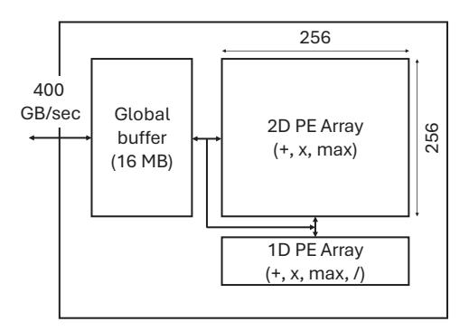
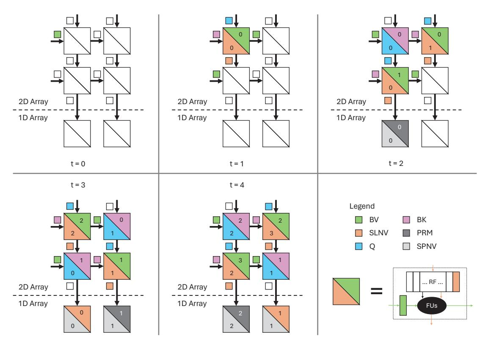

# D. Optimizing Softmax Compute

We now describe an optimization to attention that reduces compute requirements, specifically division. This optimization was used in FlashAttention-2 [14]. We point out that it can be applied more broadly, i.e., to any cascade we discuss in Section IV-E. Einsum 28 requires  $M \times P$  divisions. While this is the best we can do for an independent softmax, we note that attention does not use the softmax in isolation [52]. Instead, it subsequently multiplies the result,  $A_{m,p}$ , and another tensor,  $V_{f,m}$ , per Einsum 24, reproduced here:

$$AV_{f,p} = A_{m,p} \times V_{f,m}$$

To optimize the full attention cascade, we can refactor Einsums 28 and 24 by, instead, first combining  $SN_{m,p}$  and  $V_{f,m}$  (Einsum 31) and reducing across the M rank and then performing the division (Einsum 32), as follows:

$$SNV_{f,p} = SN_{m,p} \times V_{f,m} \tag{31}$$

$$AV_{f,p} = SNV_{f,p}/SD_p \tag{32}$$

<sup>4</sup>The  $\frac{1}{\sqrt{E}}$  term was introduced to bound the magnitude of  $SN_{m,p}$  [52]. Because the numerically stable softmax variant already accomplishes this, the scaling is often omitted [12], [14], [15].

<sup>&</sup>lt;sup>2</sup>Einsums do not require the transpose, since this information is implicit in

<sup>&</sup>lt;sup>3</sup>In Einsum 22, we also substitute E for  $d_k$  following the notation defined in Section II-B, where the shape of a rank is also its rank name.

 $<sup>^{5}</sup>$  "Global" here refers to over the entire M fiber.

| 3-pass         | 2-pass           | 1-pass                |
|----------------|------------------|-----------------------|
| PyTorch [42]   | TileFlow [62]    | FlashAttention [15]   |
| TensorFlow [2] | Choi et al. [12] | FlashAttention-2 [14] |
| FLAT [28]      |                  | Rabe and Staats [47]  |
| E.T. [6]       |                  |                       |

TABLE I: Classifying prior attention algorithms.

This reassociation does  $F \times P$  divisions instead of  $M \times P$  divisions. Since M is the sequence length and F is an embedding dimension (i.e.,  $M \gg F$ ), this reassociation *reduces* the required divisions (by a factor of  $\frac{M}{F}$ ).

## E. Optimizing Softmax Live Footprint and Memory Traffic

We now apply the analysis described in Section III to analyze attention's live footprint and memory traffic. We consider the *exact attention* literature, omitting works that either do not model/evaluate the softmax or include approximation strategies that improve performance at the cost of reduced accuracy (increased perplexity). We discuss the latter in Section VII.

We find that existing approaches to attention can be classified as either 3-pass, 2-pass, or 1-pass cascades, where an N-pass cascade performs N passes of a given M fiber. See Table I. Next, we describe the key ideas of each.

1) 3-Pass Attention Cascades: The 3-pass cascade is the straightforward, numerically stable cascade that we already discussed in Section IV-C1, namely Einsums 29-30 followed by Einsums 27-28, reproduced in Cascade 4 for clarity.

$$QK_{m,p} = Q_{e,p} \times K_{e,m}$$
 /\* Pass 1 \*/ (33)  
 $GM_p = QK_{m,p} :: \bigvee_{m} \max(\cup)$  (34)  
 $SN_{m,p} = e^{QK_{m,p} - GM_p}$  /\* Pass 2 \*/ (35)  
 $SD_p = SN_{m,p}$  (36)  
 $A_{m,p} = SN_{m,p}/SD_p$  /\* Pass 3 \*/ (37)  
 $AV_{f,p} = A_{m,p} \times V_{f,m}$  (38)

Cascade 4: The 3-pass attention cascade.

In Pass 1, we compute  $QK_{m,p}$  and  $GM_p$ ; in Pass 2, we compute  $SN_{m,p}$  and  $SD_p$ ; and in Pass 3, we compute  $A_{m,p}$  and  $AV_{f,p}$ . Notice that we must finish an entire M fiber of Einsum 34 (reading an entire M fiber of  $QK_{m,p}$ ) before  $GM_p$  is ready to start Einsum 35 (where we must read the same M fiber of  $QK_{m,p}$  again). Similarly, we must finish an entire M fiber of Einsum 36 (reading an entire M fiber of  $SN_{m,p}$ ) before  $SD_p$  is ready to start Einsum 37 (where we must read the same M fiber of  $SN_{m,p}$  again). To summarize, as a consequence of the dependencies between Einsums, this cascade must perform three passes over each M fiber. This holds for any choice of mapping (including ones that perform fusion).

2) 2-Pass Attention Cascades: We now briefly summarize the 2-pass cascade, deferring details due to space. Rather than computing the global max and then starting the softmax (as in the 3-pass cascade), the 2-pass cascade first partitions the input, computes a per-partition  $local\ max$  and applies it to form a variant of  $SN_{m,p}$  whose elements are likewise partitioned and adjusted by the local max. Analogously, each partition gets a local denominator (also adjusted by the same local max). While this is occurring, it builds the global max from the local max values. Next, in a second pass, it uses the global max to correct the per-partition numerators and denominators and compute the softmax output.

3) 1-Pass Attention Cascades: While prior work proposes multiple different 1-pass cascades [14], [15], [47], the main ideas are the same in each. Rather than using the per-partition local max to compute the local numerator and denominator, instead keep a *running max* that represents the max value seen so far. Each time a new running max is computed, also adjust previous results (e.g., numerator-times-V, denominator, etc.) with this max.

This transformation can be described more precisely using the reassociations presented in Section III-C. First, we modify Cascade 4 to multiply the softmax numerator-times-V and then compute the division (as described in Section IV-D). This reassociation combines the second and third passes of Cascade 4 (see Section III-C1). To ensure numerical stability, we cannot use the same strategy to combine the first and second passes. So we instead use the iterative approach (see Section III-C2).

We are now ready to describe FlashAttention-2's 1-pass cascade (shown as Cascade 5). We later use it to build FuseMax. Note the evidently increased compute relative to the 3-pass cascade. We will carefully design the binding in Section V to hide these overheads on a spatial architecture.

We will start by expressing the partitioning of both of the inputs  $K_{e,m}$  and  $V_{f,m}$  into M1 chunks of M0 elements each (Einsums 39-40). After computing  $BQK_{m1,m0,p}$ , this allows us to perform operations like maximum on individual M0 fibers, rather than on the whole tensor (Einsum 45). The problem is, of course, that the local maximum is not necessarily the same for all M0 fibers and so will not just cancel nicely like the global maximum.

We resolve this by instead using the running maximum  $(RM_{m1,p})$ —the global maximum of all inputs seen so far—instead of the local maximum. We recognize that M1 can also serve as an iterative rank, and iteratively build up  $RM_{m1,p}$ . After initializing  $RM_{m1:m1=0,p}$  to  $-\infty$  (Einsum 41), we compute a new running maximum  $RM_{m1+1,p}$  using the running maximum computed in the previous iteration  $RM_{m1,p}$  and the new local maximum  $LM_{m1,p}$  (Einsum 46).

We can now use the running maximum to compute a local numerator  $SLN_{m1,m0,p}$  (Einsum 47), a local denominator  $SLD_{m1,p}$  (Einsum 48), and even the softmax numerator-times-V  $SLNV_{f,m1,p}$  (Einsum 49) using the partitioned  $BV_{f,m1,m0}$  (Einsum 40).

Now consider the softmax denominator. Eventually, we would like to reduce  $SLD_{m1,p}$  into a 1-tensor, but because its values may have been computed with different maximums, we cannot simply use addition. Instead, by introducing a

Initialization:

$$BK_{e,m1,m0} = K_{e,m1 \times M0 + m0} \tag{39}$$

$$BV_{f,m1,m0} = V_{f,m1 \times M0 + m0}$$
 (40)

$$RM_{m1:m1=0,n} = -\infty \tag{41}$$

$$RD_{m1:m1=0,p} = 0 (42)$$

$$RNV_{m1:m1=0,p} = 0 (43)$$

Extended Einsums:

$$BQK_{m1,m0,p} = Q_{e,p} \times BK_{e,m1,m0}$$
 (44)

$$LM_{m1,p} = BQK_{m1,m0,p} :: \bigvee_{m0} \max(\cup)$$
 (45)

$$RM_{m1+1,p} = max(RM_{m1,p}, LM_{m1,p})$$
 (46)

$$SLN_{m1,m0,p} = e^{BQK_{m1,m0,p} - RM_{m1+1,p}}$$
(47)

$$SLD_{m1,p} = SLN_{m1,m0,p}$$
 (48)

$$SLNV_{f,m1,p} = SLN_{m1,m0,p} \times BV_{f,m1,m0}$$
 (49)

$$PRM_{m1,p} = e^{RM_{m1,p} - RM_{m1+1,p}}$$
 (50)

$$SPD_{m1,p} = RD_{m1,p} \times PRM_{m1,p} \tag{51}$$

$$RD_{m1+1,p} = SLD_{m1,p} + SPD_{m1,p}$$
(52)

$$SPNV_{f,m1,p} = RNV_{f,m1,p} \times PRM_{m1,p} \tag{53}$$

$$RNV_{f,m1+1,p} = SLNV_{f,m1,p} + SPNV_{f,m1,p}$$
 (54)

$$AV_{f,p} = RNV_{f,M1,p}/RD_{M1,p}$$
 (55)

$$\diamond: m1 \ge M1 \tag{56}$$

Cascade 5: A 1-pass attention cascade. Note that M1 is used as a standard rank (e.g., to access  $BQK_{m1,m0,p}$ ) and as an iterative rank (e.g., to access  $RM_{m1,p}$ ). The stopping condition for all iterative ranks is  $m1 \geq M1$  (Statement 56).

new running denominator  $RD_{m1,p}$  with iterative rank M1, we can correct the old denominator  $RD_{m1,p}$  to the new running maximum  $RM_{m1+1,p}$  and then perform the addition. We start by initializing the running denominator at the start of the computation to 0 (Einsum 42). Then, at each point m1, the correction factor  $PRM_{m1,p}$  allows us to correct the previous running denominator  $RD_{m1,p}$  with the new maximum (Einsum 51). In other words,  $RD_{m1,p}$  is downscaled by  $e^{RM_{m1,p}}$ .  $SPD_{m1,p}$  "switches" the downscaling factor on  $RD_{m1,p}$  to  $e^{RM_{m1+1,p}}$  by multiplying  $RD_{m1,p}$  by  $\frac{e^{RM_{m1+1,p}}}{e^{RM_{m1+1,p}}}$  ( $PRM_{m1,p}$ ). Once  $SLD_{m1,p}$  and  $SPD_{m1,p}$  have the same maximum, they can be combined to produce the new running denominator  $RD_{m1+1,p}$  (Einsum 52). We can do the same to compute the running numerator-times-V (Einsums 43, 53-54).

Finally,  $AV_{f,p}$  can be computed by dividing the final numerator-times-V by the final denominator. By construction, at this point,  $RNV_{f,M1,p}$  and  $RD_{M1,p}$  are both downscaled by the same maximum  $RM_{M1,p}$  (conveniently, also the global maximum) and can be correctly combined.

## V. MAPPING AND BINDING ATTENTION

Based on the framework from Section IV, we now describe FuseMax, an efficient mapping and binding of an attention algorithm (specifically the 1-pass cascade in Cascade 5) to a spatial array-style architecture. To enable maximum flexibility while binding, FuseMax's mapping places each iteration space point in its own logical task.

The goal when binding a cascade onto hardware is to fully utilize all available compute units. In our evaluation of prior work (Figure 6 and Section VI-B), we observe that at short sequence lengths, the 2D PE array is under-utilized because it must wait for the 1D PE array to compute the softmax. At longer sequence lengths, both arrays are under-utilized since the workload becomes memory-bandwidth limited.

FuseMax's binding addresses these issues to achieve full utilization on both the 1D and 2D PE arrays. First, we decrease the compute performed by the 1D array by (1) applying the division reduction optimization (Section IV-D) and (2) sharing the other operations (sum/max/exp) between the 1D and 2D arrays. Similarly, we ensure that the workload is never memory-bandwidth limited by deeply fusing all Einsums in the cascade to restrict the live footprint to only what can be buffered on-chip. No matter the sequence length, our dataflow is never forced to spill any of its intermediates off-chip.

**Architecture.** FuseMax is a spatial array architecture based on the TPUv2/TPUv3 [37, Figure 1(e)]. The off-chip DRAM and a large global buffer both feed data to connected 2D and 1D arrays (see Figure 2). We set parameters to match the cloud configuration in prior work [28].



Fig. 2: Spatial array architecture assumed for FuseMax.

Figure 3 shows the evolution of the 2D PE array architecture, from a fixed-dataflow multiply-accumulate TPU PE (Figure 3a) to a flexible-dataflow multiply-accumulate PE (Figure 3b) to a FuseMax PE (Figure 3c). Note, although both the 1D and 2D PE arrays in FuseMax perform exponentiation, we implement exponentiation with 6 sequential multiply-accumulate operations [36], [53] and therefore do not require a dedicated exponentiation unit.

**Mapping.** Prior attention accelerators [28], [62] explore fusing many of attention's loop nests together. However, because these accelerators all use multi-pass cascades, the algorithmic minimum live footprint of some tensors (e.g.,


Fig. 3: 2D PE architecture evolution.

 $QK_{m,p}$ ) is O(M), meaning that for long sequence lengths, intermediates cannot be buffered on chip.

FuseMax leverages fusion in conjunction with the 1-pass cascade to eliminate the memory traffic of these tensors, regardless of the sequence length. Specifically, we partition on both M and P (forming M1, M0 and P2, P1, P0), and maximally fuse all levels in the attention loopnest as shown in Mapping 1. That is, all Einsums in Cascade 5 are fused except for the last (which is fused to the rest only on P2).

```
for p2 ...:
  for m1 ...:
    for p1 ...:
     parallel_for p0 ...:
        parallel_for m0 ...:
          (RNV[:, m1 + 1, p2, p1, p0],
           RD[m1 + 1, p2, p1, p0]) =
              ComputeRNVTile(
                Q[:, p2, p1, p0],
                K[:, m1, m0], V[:, m1, m0])
  for p1 ...:
    parallel_for p0 ...:
     AV[:, p2, p1, p0] =
        ComputeAVTile(
          RNV[:, m1 + 1, p2, p1, p0],
          RD[m1 + 1, p2, p1, p0])
```

Mapping 1: The FuseMax mapping as a loopnest. We partition on both M and P and map the innermost ranks M0 and P0 to the spatial array PEs. ComputeRNVTile performs Einsums 44-54 from Cascade 5. ComputeAVTile performs Einsum 55. Note that each Einsum represents a loopnest: by writing all Einsums in ComputeRNVTile under a single loopnest, we mean that we are maximally fusing those loopnests. Outer loops over B and B (if performing batched multihead attention) are not shown.

While prior work implementing attention in hardware [28], [62] does utilize the 2D spatial array for the tensor products, it fails to do so for the softmax, choosing instead to use the 1D array. Because there are far fewer total PEs in the 1D array than the 2D array, the softmax becomes a bottleneck. FuseMax improves utilization of the 2D spatial array by using it for both the tensor products and the exponentiation operator in the softmax. FuseMax parallelizes across the M0 and P0 ranks throughout the attention kernel (see Mapping 1). We set  $M0 \times P0 = \#$  2D Array PEs. The large spatial reductions required when parallelizing across the M0 rank are easily handled by the low-cost inter-PE communication network.

**Binding.** The dependencies between different Einsums in our cascade necessitate a binding that implements fine-grain

pipeline parallelism to achieve high utilization of both the 1D and 2D spatial arrays. Figure 4 shows the waterfall diagram for FuseMax in the steady state. Time is broken into epochs. Each epoch performs the same set of tile-granular operations at specific tile-relative coordinates (given by a, b, c, d in the figure). Across all epochs, the kernel evaluates all tiles and each Einsum in Cascade 5 is mapped to either the 2D or 1D array for all epochs (as shown in the figure).

A major design consideration when binding the attention kernel is how to overcome the latency of fills and drains to/from the spatial array. Consider a tile of  $QK_{m,p}$  of shape  $M0 \times P0$ . Per Einsum 22, the iteration space to evaluate this tile is  $E \times M0 \times P0$  which becomes E cycles on the spatial array. For the networks we evaluate, E=64 or 128. Assume E=64. Using an output stationary dataflow, while each PE performs 64 MACCs, it takes  $\sim 256$  cycles to both fill and drain the spatial array. Without careful interleaving, this combination of parameters causes low utilization because, for example, the running max  $RM_{m1+1,p1,:}$  cannot be computed until a tile of  $QK_{m1,:,p1,:}$  is completed and spatially reduced (drained) to form the local max  $LM_{m1,p1,:}$  (Einsums 45-46).

Our binding address the above issues with two levels of interleaving. First, we interleave the construction of dependent tiles across epochs. This is reminiscent of software pipelining. For example, in Figure 4 the d-th tile of BQK and LM are completed in Epoch i (as they correspond to a fill followed by a drain and can be easily pipelined). The RM (which has to wait for the drain) for tile d takes place in a later epoch. Instead, Epoch i computes an earlier tile's running maximum RM[c].

Second, we interleave the construction of certain tiles within an epoch at a fine (e.g., cycle-by-cycle) granularity. See the notation 'A|B' in Figure 4. This is to ensure high utilization of both the 2D and 1D PE arrays at all times. To make this more clear, Figure 5 shows the start up and steady-state interleaving of SLNV and BQK in the 2D array and SPNV and RNV in the 1D array. In each cycle, a given PE in the 2D array computes a value for either BQK or SLNV and this alternates cycle by cycle. Each neighbor-neighbor link in the array is active in every cycle—carrying data for one of the two operation types. By interleaving SLNV with BQK, the 1D PEs can concurrently compute SPNV and RNV.

Putting everything together, as Section VI-B will show, the above enables high utilization of all 2D and 1D array PEs.

**FuseMax on GPUs.** FuseMax's mapping and binding cannot be directly applied to GPUs. FuseMax's architecture features heterogeneous PEs, each with smaller per-PE storage, and cheap (but restricted) inter-PE communication. Specifically, the networks that connect the PEs within the 2D array allow efficient, fixed-latency communication primarily between neighbors, including between the bottom of the 2D array and the 1D array. However, the GPU architecture features opposite characteristics: homogeneous PEs, each with relatively large per-PE storage, and expensive, loosely coupled inter-PE communication. While concurrent work [50] has explored using the GPU's Tensor Cores to compute BQK and


Fig. 4: FuseMax pipelining at a glance. Each tensor name (e.g., SLNV) corresponds to the Einsum used to compute that tensor (see Cascade 5). a, b, c and d denote tile-relative coordinates where a < b < c < d. If Epoch i produces tiles with coordinates a, b, c, d, Epoch i+1 produces tiles with identifiers a+1, b+1, c+1, d+1. And so on. 'A|B' denotes 'computing tile A is interleaved with computing tile B.' ' $A \to B$ ' denotes 'computing tile A is done before computing tile A.' Computing  $AV_{f,p}$  is not shown. The green and blue time periods making up an epoch take almost the same number of cycles.



Fig. 5: Intial pipeline fill (t=0 to t=2) and steady-state (t=3 and t=4) for the intra-epoch interleaving of SLNV|BQK and SPNV|RNV to maximize 2D and 1D PE utilization, respectively, on a toy 2x2 array. Each color indicates a tensor and each number indicates a point in that tensor (e.g., the point  $BV_0$  moves from the top left PE at t=1 to the top right PE at t=2). To reason about signal timing, we use input (but not output) latches for data in each PE, so moving data appears on output wires. Some stationary tensors (e.g., BQK) and Einsums (e.g., SLD) are omitted for clarity.

SLNV and using software pipelining to hide the latency of the other compute, the GPU's loosely coupled threads require frequent synchronization to maintain correctness. FuseMax takes advantage of the tight coupling between the 2D and 1D arrays to statically schedule compute between the arrays, enabling high utilization across the board without sychronization.

