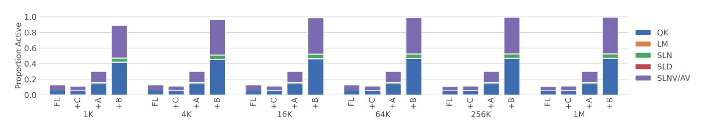
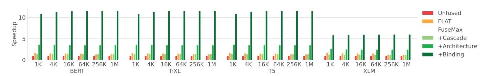

# VI. EVALUATION

In this section, we demonstrate how FuseMax's cascade, architecture, and binding work together to achieve improvements in both performance and energy relative to the state of the art, for both attention and end-to-end transformer inference.

### A. Experimental Set-Up

First, we present the experimental setup details common to all following subsections.

**Workloads.** We evaluate all accelerators and configurations using the same transformer models used by FLAT [28]: BERT-Base [17] (BERT), TrXL-wt103 [13] (TrXL), T5-small [49] (T5), and XLM [13]. We omit FlauBERT [31] because it uses the same hyperparameters as TrXL. We also note that though T5 is an encoder-decoder model, we only evaluate the encoder in this work. Following FLAT, we use a batch size B=64 for all evaluations.

Fig. 6: Utilization of the different PE arrays on the unfused baseline, FLAT, and three configurations building up FuseMax.

Fig. 7: 2D array utilization by Einsum across different configurations—FLAT (FL), +Cascade (+C), +Architecture (+A), and +Binding (+B)—and sequence lengths on BERT.

Fig. 8: Speedup of attention for FLAT and three configurations building up FuseMax over an unfused baseline.

Fig. 9: Energy consumption of attention for FLAT and three configurations building up FuseMax over an unfused baseline.

Fig. 10: Speedup of transformer inference on FLAT and three configurations building up FuseMax over an unfused baseline.

Fig. 11: Energy consumption of transformer inference on FLAT and three configurations building up FuseMax over an unfused baseline.

Modeling with Timeloop and Accelergy. We perform our evaluation using two tools for tensor algebra accelerator modeling and design space exploration: Timeloop [41] and Accelergy [56]. We use these tools to build models of the accelerator architectures at a 45nm technology node and evaluate each Einsum individually. Results from individual Einsums are combined using heuristics presented in prior work for evaluating full cascades [35]. Together, these tools allow us to evaluate execution time, energy, and area for all our designs. We perform floating-point division using the design in Xia et al. [59], scaled down to a 45nm technology node [56].

Unfused Baseline. We build the unfused baseline by combining the costs of three phases: QK (Einsum 22), the 3-pass softmax (Cascade 4), and AV (Einsum 24). Because this baseline is unfused, each phase can be scheduled independently, but proceed sequentially and require outputs to be written to memory between phases. We use Timeloop to search for efficient mappings to perform QK and AV. Additionally, we model the softmax for the unfused baseline by allowing the accelerator to load the M fibers of the input on-chip one-byone (spilling if there is not enough space) before performing the compute. We model the memory traffic, compute, and energy required to perform all Einsums required for attention.

**FLAT Baseline.** Our main baseline is the state-of-theart attention accelerator FLAT [28]. Though we started with the FLAT authors' original code, we found and corrected a number of bugs. Through private correspondence with the FLAT authors, we verified the bugs were indeed bugs. We also discovered a couple of larger conceptual errors, which the authors told us to avoid by restricting FLAT to only search through configurations without these issues.

Beyond correcting the FLAT codebase, we created and validated a Timeloop model that reproduces the FLAT authors' (corrected) code to within < 1% error. However, the FLAT codebase does not model the cost to perform the softmax. Specifically, their model ignores the cost of the data transfers required for the softmax (between any levels of the memory hierarchy) and uses  $2^{30}$  1D PEs for compute. When comparing FuseMax and FLAT in this work, we augment our Timeloop model to model softmax correctly per the 3-pass cascade implicitly assumed by FLAT using only 256 1D PEs.

**FuseMax Configurations.** To demonstrate the sources of the improvements achieved by FuseMax, we present three configurations, one associated with each of the major changes we propose: +Cascade uses the 1-pass cascade on the FLAT architecture, +Architecture adds the FuseMax architecture but

implements a binding that fully produces and consumes one  $M0 \times P0$  tile of BQK before starting the next, and +Binding adds FuseMax's pipelined/interleaved binding.

Hardware parameters. Figure 2 shows the selected hardware parameters. We chose the PE array dimension to match FLAT's cloud accelerator and then set the global buffer capacity so that the overall chip area was as close to FLAT's as possible. Also following FLAT, we use a 940 MHz frequency. We use Accelergy to model the area of both designs and find that FuseMax is 6.4% smaller.

