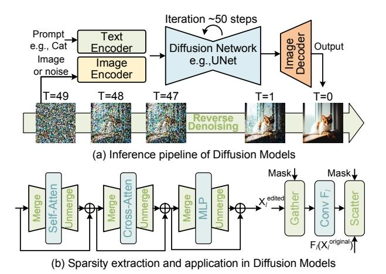
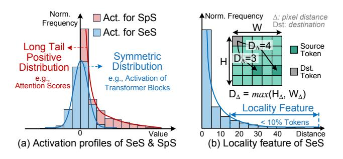
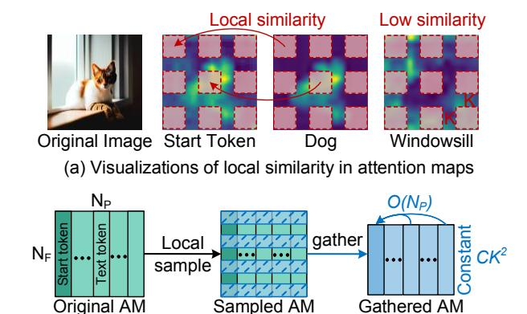
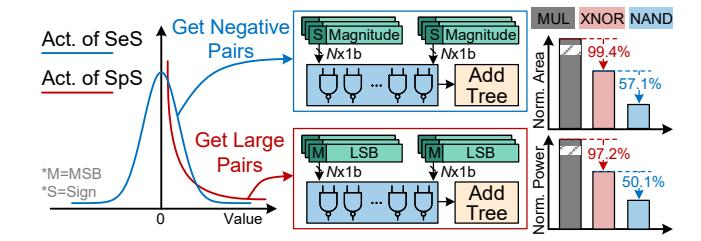
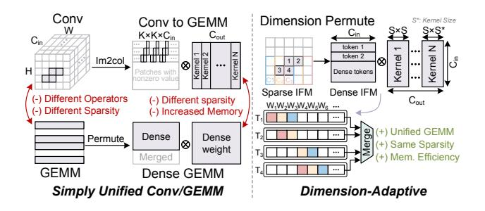
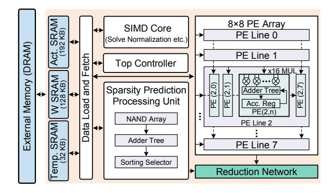
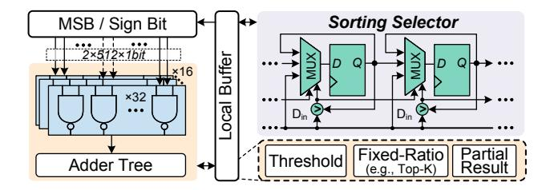

# 1 Introduction

Diffusion Models (DMs) have recently demonstrated outstanding performance across a wide range of image generation tasks, including image synthesis [\[16,](#page-12-1) [40\]](#page-12-2) and text-to-image generation [\[30,](#page-12-3) [34,](#page-12-4) [36\]](#page-12-5). By employing an iterative denoising process and integrating cross-attention mechanisms into the UNet architecture, DMs enable precise alignment between textual prompts and visual content, generating high-quality images. Despite their impressive performance, DMs suffer from substantial computational overheads and high inference latency due to their complex architectures and the intensive use of diverse operators. For example, generating a single image with 50 denoising steps takes nearly 13.9 seconds on an NVIDIA RTX 3090 GPU [\[18\]](#page-12-6). These computational constraints pose significant challenges for the deployment of DMs in latencysensitive or real-time applications.

<span id="page-1-0"></span>

Figure 1: Semantic and spatial sparsity in diffusion models for image generation and editing.

To address these limitations, leveraging inherent sparsity has emerged as a promising strategy to accelerate image generation. As shown in Fig. 1 (a), during the reverse denoising process, adjacent tokens usually exhibit similar features, allowing for token merging (ToMe) [3, 19] to enhance inference speed and this phenomenon is referred to as semantic sparsity (SeS). Additionally, spatial sparsity (SpS) arises during the image editing process [6, 23, 51], where only localized modifications are applied to the images based on input prompts and other areas remain consistent with the original images. However, when state-of-the-art (SOTA) sparsity-aware algorithms [3, 51] are deployed in DMs, their effectiveness is diminished by the additional computational overheads required for sparsity prediction. As illustrated in Fig. 1 (b) and Fig. 1 (c), the improvements achieved by SeS and SpS are constrained, exhibiting a degradation of approximately 15% to 40% compared to the ideal case, which assumes no overhead from the sparse inference algorithm. Moreover, various sparsity schemes lead to distinct sparsity patterns across operators, which constrain the efficiency of previous works and general computing platforms. For instance, AdapTiV [48] accelerates computation based on the SeS inherent in Vision Transformers, but it is not applicable to SpS. Similarly, EXION [13] focuses on the intrinsic sparsity of model parameters rather than SeS or SpS, and as such, it fails to provide further acceleration for conditional DMs. Additionally, several differential computing techniques [10, 20, 21] aim to reduce computational overhead during iterations, yet they do not effectively exploit the sparsity patterns discussed above. Therefore, existing co-design frameworks struggle to process the unique sparsity of DMs, leaving critical challenges to be addressed.

Challenge 1. Current sparsity-aware algorithms impose substantial computational overheads due to their global similaritybased prediction mechanisms. As illustrated in Fig. 2 (top left), SeS prediction methods such as ToMe first partition the input feature map (IFM) tokens into destination (dst) and source (src) sets. Then, pairwise similarities are computed to merge semantically redundant src tokens into their corresponding dst tokens. In SpS prediction, the attention maps (AMs) capture relationships between input prompts and the image to identify regions requiring modification. The similarity between the attention vector of the start token and those of all other tokens must be computed. Both SeS and SpS predictions involve costly similarity computations, with complexities of  $O(N^2)$  and  $O(N_F N_P)$ , respectively. Here, N is the number of feature tokens, while  $N_F$  and  $N_P$  denote the numbers of feature and prompt tokens. These high complexities limit the efficiency gains achievable from sparse acceleration, posing significant challenges in latency-sensitive scenarios.

Challenge 2. Existing sparsity prediction algorithms often incur substantial computational overhead, which undermines the potential benefits of sparsity. As shown in Fig. 2 (top middle), both SeS and SpS predictions rely on cosine similarity, involving costly operations such as multiply-and-accumulate (MAC) and normalization that significantly contribute to inference latency. These computations are typically applied to high-dimensional token embeddings, leading to considerable data movement. Due to the limited on-chip storage, the sparsity prediction process requires frequent off-chip memory accesses, further increasing both latency and energy consumption. Although AdapTiV employs an XNOR-based sign-bit similarity to replace multipliers, this method is unsuitable for DMs. This is because attention maps in DMs contain only non-negative values, which renders sign-bit comparisons ineffective for SpS.

Challenge 3. The U-Net architecture in DMs comprises diverse operators, including convolution and general matrix multiplication (GEMM), each exhibiting distinct sparsity patterns. As illustrated in Fig. 2 (top right), this feature leads to inefficient utilization of processing elements (PEs). Specifically, in transformer blocks, when applying SeS and SpS, the dst and unmerged tokens can be extracted and processed in dense GEMM format. In contrast, convolutional layers in the ResNet blocks inherently perform local computations and can only benefit from SpS. However, due to the irregular and non-uniform nature of sparse feature maps, convolutions suffer from poor data locality and load imbalance, resulting in significantly reduced PE utilization. In extreme cases, the utilization rate can drop to 12.5%, severely limiting acceleration efficiency.

To address the aforementioned challenges, we propose S-DMA, a software-hardware co-design framework. As summarized in Fig. 2, the key contributions of this work are as follows:

 A novel Spatiality-Aware Similarity (SpASim) prediction method is proposed, which exploits the local similarity inherent in DMs. By leveraging a local sampling strategy, SpASim significantly reduces the computational complexities of both SeS and SpS predictions. Specifically, it reduces the computational complexity from O(N²) and O(N<sub>F</sub>N<sub>P</sub>) to O(N) and O(N<sub>P</sub>), respectively, thus enabling efficient sparsity prediction with minimal accuracy degradation.

<span id="page-2-0"></span>

Figure 2: Challenges and co-design solutions for the acceleration of sparse Diffusion Models.

- A NAND-based similarity computation strategy is developed to accelerate sparsity prediction. By replacing expensive multipliers with efficient NAND-gate logic, this method supports both SeS and SpS predictions, substantially reducing latency and computational overheads.
- A fusion strategy for handling multi-operator with multisparsity is introduced to enable a unified GEMM operator in DMs. By applying dimension-adaptive transformation, this approach maps the convolution into a unified GEMM format without additional memory overheads.
- A dedicated hardware accelerator is designed to exploit the proposed algorithm optimizations. This accelerator features a sparsity prediction processing unit (SP<sup>2</sup>U) and a sparsityaware reduction network. SP<sup>2</sup>U applies early computation and pipeline techniques to hide the prediction latency, while minimizing area and power overheads via a NAND-gate array. The reduction network enhances PE utilization by fully leveraging the unified GEMM operator.
- Extensive experimental evaluations across a variety of DM benchmarks demonstrate that S-DMA achieves up to a 51.11× speedup and a 43.87× improvement in energy efficiency compared to the NVIDIA A100 GPU. Moreover, relative to SOTA accelerators, S-DMA delivers up to a 7.05× speedup gain and a 3.19× enhancement in energy efficiency. To the best of our knowledge, S-DMA is the first software-hardware co-design framework specifically tailored for accelerating both semantic and spatial sparsity in DMs.

## 2 Background and Motivation

#### 2.1 Sparse Diffusion Model

Diffusion models are a class of generative neural networks that have demonstrated SOTA performance across a range of tasks, including image synthesis, video generation, and image inpainting [11, 36, 38]. Denoising Diffusion Probabilistic Models (DDPM) serve as the basis of modern diffusion approaches, formulating the generative process as a Markov chain of iterative denoising steps [16]. To accelerate sampling, Denoising Diffusion Implicit Models (DDIM) introduce

a non-Markovian formulation, enabling faster generation while maintaining quality [40]. Latent Diffusion Models (LDM), such as Stable Diffusion [36], further improve sampling efficiency and image quality by operating in a compressed latent space rather than the pixel space, thus reducing computational overheads.

Fig. 3 (a) illustrates the typical reverse denoising process of DMs. An image encoder transforms the input, a clean image or randomly sampled noise, from the pixel space into the latent space. Simultaneously, a text encoder processes user-provided prompts, converting them into token representations that guide the generation process. At each timestep, DM produces a latent representation with incrementally less noise. This iterative denoising continues for numerous steps, with each output serving as the input for the next iteration. Upon completion, the final denoised latent representation is decoded back into the pixel space, yielding the generated image.

Fig. 3 (b) presents the integration of sparse inference in DMs, highlighting semantic and spatial sparsity. On the left, the workflow of sparse transformer blocks is depicted, which is applicable to both SeS and SpS. Due to the frequent presence of unedited or similar visual elements, many tokens can be merged during computation without loss of information. To accommodate the residual connections in transformer blocks, unmerging steps are performed following the attention and MLP layers. This token merging strategy achieves up to a 50% reduction in the token count with negligible impact on accuracy [3, 46]. The right side of Fig. 3 (b) illustrates an additional workflow, particularly relevant to spatial sparsity in image editing tasks. In such scenarios, the user provides an image along with a prompt indicating regions to be edited. Since modifications are typically confined to small regions, the computation exhibits high spatial sparsity. The SpS transformer workflow mirrors that of SeS but can be extended to convolutional operations, allowing computation to be restricted to only the edited regions of the feature map.

## <span id="page-2-1"></span>2.2 Sparsity Prediction of Diffusion Model

In image generation tasks, many regions share similar semantic features, which can be exploited to reduce computational overheads.

<span id="page-3-0"></span>

Figure 3: Overview of Diffusion Model inference and sparsity-aware processing.

Token merging is a widely adopted approach for compressing feature representations by merging tokens with similar semantic content [3, 46, 48]. For each source token  $X_{src}^{(i)} \in \mathbb{R}^{1 \times d}$ , the destination token  $X_{dst}^{(j)} \in \mathbb{R}^{1 \times d}$  with the highest cosine similarity is selected as:

$$D_i^* = \arg\max_{j \in \{1, \dots, M\}} \cos(X_{src}^{(i)}, X_{dst}^{(j)})$$
 (1)

Here,  $X_{src} \in \mathbb{R}^{N \times d}$  denotes the set of N source tokens, and  $X_{dst} \in \mathbb{R}^{M \times d}$  denotes the set of M destination tokens, where d is the embedding dimension. This pairwise similarity search assigns each source token to its most semantically similar destination token for potential merging. Computing all pairwise cosine similarities between N source and M destination tokens incurs a computational complexity of O(NM). In practice, the number of destination tokens M typically scales linearly with the number of source tokens N, making the overall complexity effectively  $O(N^2)$ .

In image editing tasks [6, 23, 51], only specific regions of the image are edited based on user-provided prompts or explicit masks, giving rise to spatial sparsity. This sparsity can be predicted using the attention maps generated by cross-attention layers, which capture the interaction between textual prompts and image tokens. To identify these sparse regions, the similarity values between the starting token and all other tokens are computed to extract the global semantics of the prompt. The prediction process follows:

$$P_{i \in [1,N]} = \begin{cases} 1 & cosine_{i \in [1,N]}(A_i^{\tau}, A_{index}^{\tau}) > \gamma_1, \\ -1 & cosine_{i \in [1,N]}(A_i^{\tau}, A_{index}^{\tau}) < \gamma_2, \\ 0 & others. \end{cases} \tag{2}$$

The equation defines a threshold-based decision rule for sparsity prediction.  $A_i^{\tau}$  denotes the attention map corresponding to the *i-th* prompt word in the cross-attention layer, where  $\tau$  indicates the timestep at which the denoising process begins.  $A_{index}^{\tau}$  represents the attention map of the index token, which fully captures the overall semantics of the prompt. The attention map in the cross-attention layer captures the degree of alignment between the textual prompt and the image, enabling the identification of mismatched

<span id="page-3-1"></span>

Figure 4: Statistical characteristics of activations for semantic and spatial sparsity prediction.

or aligned regions in the prompt. For each attention map  $A_{in}^{\tau}$ , the cosine similarity between  $A_{i}^{\tau}$  and the index attention map  $A_{index}^{\tau}$  is calculated. If the similarity exceeds a positive threshold  $\gamma_1$ , the feature is considered relevant ( $P_i = 1$ ); if it falls below a negative threshold  $\gamma_2$ , the feature is considered irrelevant ( $P_i = -1$ ); otherwise, the feature is marked neutral ( $P_i = 0$ ). This method allows for dynamic feature selection based on similarity, enabling efficient sparse computation. However, the computation complexity is still  $O(N^2)$  with one dimension for prompt tokens and another for image tokens.

**Distribution analysis.** Fig. 4 illustrates the activation distributions and spatial locality characteristics of SeS and SpS, which are evaluated using the Stable Diffusion V2 model [36] on the COCO 2014 dataset [25]. Additional analysis of local similarity across various models and tasks is presented in Section 5. The activation distribution of SeS exhibits approximately symmetric behavior, closely resembling a zero-centered profile. This symmetry enables efficient sparsity prediction using fast cosine similarity-based methods that leverage the sign of the vectors [48]. Since signs of similar vectors show high correlation in both positive and negative elements, signbased computations can significantly reduce the cost of similarity calculation while maintaining high prediction accuracy. In contrast, SpS activations exhibit a long-tail positive distribution due to the nature of attention maps. This deviation from symmetry renders sign-based similarity ineffective for SpS. To address this issue, a new optimization technique is required to handle the distinct sparsity patterns of both SpS and SeS, while maintaining computational efficiency and prediction accuracy. Fig. 4 (b) illustrates the normalized frequency distribution of the distances between src and dst tokens across the dataset, following work [3]. Empirical results indicate that most token pairs with high similarity are located in close spatial proximity, suggesting that global similarity computation may incur unnecessary overheads. This insight motivates the design of a locality-aware sparsity prediction mechanism.

#### 2.3 Workloads of Sparse DM Operators

The primary computational operators in DMs are general matrix multiplication (GEMM) and convolution (CONV), typically arising from transformer and convolutional blocks, respectively. Their core computation patterns can be formulated as Equation 3 and 4. In the GEMM formulation,  $A \in \mathbb{R}^{m \times n}$  and  $B \in \mathbb{R}^{n \times p}$  are input matrices,

<span id="page-4-2"></span>

Figure 5: Spatiality-aware similarity prediction for SeS.

and  $C \in \mathbb{R}^{m \times p}$  is the output matrix. For convolution, x(i, j) denotes the input feature map, w(m, n) represents the convolutional kernel, and C(i, j) denotes the resulting output feature map.

<span id="page-4-0"></span>GEMM: 
$$C_{i,j} = \sum_{k=1}^{n} A(i,k) \cdot B(k,j)$$
 (3)

<span id="page-4-1"></span>CONV: 
$$C_{i,j} = \sum_{m} \sum_{n} x(i+m, j+n) \cdot w(m, n)$$
 (4)

Due to the fundamentally different data reuse and access patterns between GEMM and CONV, designing a unified and efficient dataflow architecture to support both operations remains a key challenge. Furthermore, the introduction of SeS and SpS imposes additional complexity on hardware execution, requiring sparsity-aware support across both operator types. As shown in Fig. 2, SeS leads to irregular matrix shapes and variable token lengths, which significantly reduce PE utilization due to boundary inefficiency. In the case of SpS, two distinct issues arise. First, for GEMM operations, only the tokens identified for modification are extracted and processed, resulting in similar workloads to SeS. Second, SpS in convolution operations leads to partially missing channels in the activation tensor. These dynamic and heterogeneous sparsity patterns introduce substantial variability in workload dimensions, which place considerable pressure on the design of hardware.

## 2.4 Motivation

Sparsity prediction in DM introduces considerable overhead, offsetting the performance gains it aims to deliver. The high overheads of sparsity prediction stem from two key factors: the computational complexity and the lack of efficient general-purpose computational methods. Current sparsity prediction methods fail to effectively exploit the local similarity of the DM feature maps, leading to an  $O(N^2)$  computation complexity. Meanwhile, the advanced efficient similarity computation method is not suitable for SeS and SpS. These limitations motivate us to design a sparsity prediction framework that fully leverages the spatial locality of activation and adapts to different sparsity patterns.

Furthermore, the diversity of operators used in DMs introduces distinct sparsity patterns that limit the efficiency of sparsity methods on general platforms and existing accelerators. Unlike typical sparse computing techniques, which only consider sparsity across the same operator, sparse DMs demand PE arrays capable of handling varied and irregular sparsity patterns. These challenges motivate the need for a flexible hardware architecture and an efficient dataflow, capable of supporting multiple sparsity patterns while maintaining an optimal hardware efficiency.

<span id="page-4-3"></span>

(b) Complexity reduction via local AM sampling and gathering

Figure 6: Spatiality-aware similarity prediction for SpS.

## 3 Algorithm Optimization of S-DMA

This section explores the algorithm optimizations of S-DMA, which primarily consist of three key strategies: 1) The spatiality-aware similarity computation that leverages the local similarity in DMs; 2) A NAND-based similarity computation strategy that utilizes NAND operation to replace multiplication in similarity computation; 3) A dimension-adaptive dataflow that unifies heterogeneous sparsity patterns across different operator types.

#### <span id="page-4-4"></span>3.1 Spatiality-Aware Similarity Computation

As discussed in Section 2.2 and shown in Fig. 4, images generated by DMs exhibit strong locality in semantic sparsity. This indicates that computing global similarity between all pairwise tokens introduces substantially redundant computation. To address this, S-DMA adopts a Spatiality-Aware Similarity (SpASim) computation strategy for sparsity predictions, which restricts similarity evaluation to local regions, significantly reducing computational overheads.

**SpASim for SeS.** Fig. 5 presents the SpASim computation for SeS. The process begins by selecting a local window in the feature map, defined by the hyperparameter K, which constrains the scope of computation and determines the number of tokens involved. Within this window, the local similarity between source and destination tokens is calculated. The resulting similarity scores are then sorted and passed to sparsity prediction mechanisms, such as fixed-ratio selection or threshold-based filtering, to identify candidate token pairs for merging. This localized approach adjusts the computational complexity of SeS prediction from  $O(N^2)$  to O(N).

**SpASim for SpS.** As shown in Fig. 6 (a), in the prediction of SpS, the similarity between cross-attention maps is leveraged to accurately identify the image regions relevant to the given prompts. Observation of the attention maps reveals that only localized comparisons are sufficient for semantic positioning, while global comparisons introduce unnecessary computational overheads. Building on this insight, the SpASim strategy is extended to support SpS prediction through a localized sampling approach. As illustrated in Fig. 6 (b), we uniformly sample nine local windows (in a 3×3 grid) across the attention maps, with each window size determined by the

#### <span id="page-5-0"></span>Algorithm 1 Adaptive K Selection

```
1: Input: X: Activation for similarity computation
          IT: Target IoU Score
 2: Output: K
                                               // Window size K
 3: K = 0
 4: I_C = 0
                 // IoU score between real and approximate mask
 5: S_R = cosine(X)
                                        // Real cosine similarity
 6: MASK_R = MASKGen(S_R)
 7: while I_C < I_T do
     K = K + 1
     S_A = SpASim(K, X)
                                       // Approximate similarity
     MASK_A = MASKGen(S_A)
     I_C = IoU(MASK_R, MASK_A)
12: end while
13: return K
```

hyperparameter K. This design is inspired by common practices in vision models, where  $3\times3$  local receptive fields are widely adopted to balance expressiveness and efficiency [9, 45]. These sampled regions are then gathered for similarity computation. The use of local sampling significantly reduces the computational complexity from  $O(N_FN_P)$  to  $O(N_P)$ , enabling efficient and accurate SpS prediction with minimal overhead.

Algorithm 1 presents an adaptive window size selection strategy for the hyperparameter K, which governs the granularity of similarity approximation in both SeS and SpS. In practical settings, K is determined offline and fixed during inference. Given an input activation X and a target Intersection-over-Union (IoU) threshold  $I_T$ , the algorithm first computes the full-resolution cosine similarity to obtain a reference similarity map  $S_R$ . A ground-truth sparsity mask  $MASK_R$  is then generated from  $S_R$  using a standard mask generator. The algorithm proceeds by iteratively increasing *K* to identify the minimal window size that achieves sufficient approximation quality. In each iteration, approximate similarity  $S_A$  is computed using our proposed SpASim method with the current K, followed by the generation of an approximate mask  $MASK_A$ . The IoU between  $MASK_A$ and the reference mask  $MASK_R$  is then evaluated. Once the IoU exceeds the target threshold  $I_T$ , the corresponding K is returned as the optimal value. In our implementation, the target IoU is set to 0.75, following prior works [25, 35], to ensure sufficient alignment between the approximate and reference sparsity patterns.

#### <span id="page-5-2"></span>3.2 NAND-based Similarity

In SeS and SpS sparsity prediction, cosine similarity is commonly employed to measure the redundancy among tokens and the structural similarity within cross-attention maps, respectively. However, this approach introduces severe latency and hardware overhead due to the required MAC and normalization operations. As discussed in Section 2.2, the activations for sparsity prediction follow an approximately symmetric distribution. Leveraging this observation, we find that detecting negative value pairs alone, rather than computing full cosine similarity, can yield comparable effectiveness for sparsity prediction. In particular, we adopt a simplified approach similar to sign similarity for SeS, where only negative values are used to estimate similarity. For SpS prediction, the non-negative

<span id="page-5-1"></span>

Figure 7: Value-aware NAND-based similarity computation for sparsity prediction.

nature of attention maps limits the effectiveness of sign similarity. Instead, we utilize amplitude-based similarity by comparing the most significant bits (MSBs) of the values. Pairs of elements sharing the same MSB are considered similar, as highly similar vectors tend to exhibit large values in consistent channels.

As illustrated in Fig. 7, this computation can be efficiently implemented using a NAND-gate array that operates in parallel and generates valid results only when both inputs are negative or large (sign bits or MSBs are 1). The resulting outputs are then passed to an adder tree to accumulate the final similarity score, thereby eliminating the need for XNOR gates or even multipliers. Notably, a NAND gate requires only 4 transistors, compared to the 10 transistors typically needed for an XNOR gate. Fig. 7 further illustrates the hardware cost of the proposed NAND-based similarity computation. The results are evaluated at a 28nm technology using a core frequency of 400MHz. Compared to XNOR-based sign similarity, our NAND-based design achieves a 57.1% reduction in area and a 50.1% reduction in power consumption, highlighting the substantial benefits of NAND-based similarity computation.

#### <span id="page-5-3"></span>3.3 Dimension-Adaptive Dataflow

Building upon the challenges discussed above, an optimized dataflow design is required to efficiently support various sparse workloads in DMs. As illustrated in Fig. 8, token-wise permutation can transform sparse GEMM operations into dense formats, enabling more efficient computation. For convolution, the widely-used im2col [41] transformation converts convolutional operations into GEMM format to facilitate hardware acceleration. However, this approach often results in redundant data replication and suboptimal memory utilization. Furthermore, due to the intrinsic differences in sparsity distribution, the transformed GEMM still exhibits irregular sparsity, limiting overall efficiency.

Under the SpS workload, the channel dimension in convolutional layers remains structurally dense. This observation motivates a dimension transformation approach to optimize sparse convolution computations. To address the heterogeneous sparsity patterns in DMs, S-DMA introduces a fusion strategy that unifies both operator types and sparsity formats. As illustrated in Fig. 8, dense tokens within a sparse input feature map (IFM) are extracted and permuted along the channel dimension to form a compact representation. The corresponding convolution kernels are similarly permuted to preserve alignment. This dimension-adaptive transformation effectively reformulates sparse convolution into a structured GEMM operation. Compared to the conventional *im2col* approach, our

<span id="page-6-0"></span>

Figure 8: Unified GEMM with dimension-adaptive dataflow.

method offers three key advantages: (1) a unified GEMM framework for different operators, (2) consistent sparsity patterns across operators, and (3) elimination of additional memory overhead. However, due to fundamental differences in accumulation paths between convolution and GEMM, the output of the transformed convolution does not directly correspond to the final output feature map. To resolve this, a software-hardware co-designed reduction network is proposed to aggregate the associated partial results. The implementation details are further discussed in Sec. 4.4.

#### 4 Architecture Innovation of S-DMA

#### 4.1 Overview

Fig. 9 depicts the overall architecture, which consists of eight primary modules: off-chip DRAM storage, on-chip SRAM storage, a Data Load and Fetch (DLF) unit, a SIMD core, a top controller, a Sparsity Prediction Processing Unit (SP<sup>2</sup>U), a PE array, and a Sparsityaware Reduction Network. At the core of the architecture lies the SP<sup>2</sup>U, which predicts both SeS and SpS using a unified computation unit. This module comprises a NAND-gate array connected to an adder tree and a unified sorting unit capable of executing multiple selection strategies. Meanwhile, it transmits generated mask signals to the sparsity-aware reduction network, which enables dense computation of sparse workloads. To support high-throughput operation, a standard S-DMA is designed to be capable of processing 64×16 MACs in parallel, where each PE integrates 16 multipliers and a dedicated adder tree. The SIMD core handles nonlinear operations, such as normalization and activation functions, that are commonly encountered in modern neural network accelerators [10, 31]. Notably, the sparsity prediction and PE array inference are seamlessly pipelined. This ensures that the sparsity predictor does not introduce performance degradation, avoiding additional latency between sparsity prediction and formal computation.

## 4.2 Sparsity Prediction Processing Unit

To efficiently support the sparsity prediction optimizations proposed in Sections 3.1 and 3.2, we design a dedicated Sparsity Prediction Processing Unit (SP<sup>2</sup>U), as illustrated in Fig. 10. This unit enables hardware-efficient support for both SeS and SpS sparsity predictions. After feature maps and attention maps are generated by the PE array, the corresponding sign bits or most significant bits (MSBs) are buffered and forwarded to a NAND-based similarity engine. This engine comprises 16 groups, each containing 32 NAND

<span id="page-6-1"></span>

Figure 9: Overview of S-DMA accelerator.

<span id="page-6-2"></span>

Figure 10: Architecture of sparsity prediction processing unit.

gates, allowing scalable and highly parallel bit-wise similarity computation. This grouping strategy offers flexibility in adapting to varying feature dimensions and computational parallelism.

The outputs of the NAND-gate array are accumulated by an adder tree to produce approximate similarity scores, which are stored in a local buffer for downstream selection. A sorting-based selection mechanism is employed to support both threshold-based filtering and fixed-ratio (e.g., top-k) sparsity schemes. Given its impact on hardware cost and inference latency, the sorting logic must be carefully designed. Bitonic sorters [2] are widely adopted due to their inherent parallelism and relatively low sorting latency of  $O((\log_2 n)^2)$  cycles, where *n* is the number of elements to be sorted. However, such designs require  $O(n(\log_2 n)^2)$  comparators and a similar order of registers when fully pipelined. To mitigate this, we implement a lightweight direct-insertion sorting mechanism tailored to our prediction pipeline. The sorter consists of ncomparison units, each composed of a register, comparator, and multiplexer. During operation, each unit dynamically determines whether to retain its value, accept the incoming input, or shift data from the previous unit based on descending order priority. This enables progressive in-place sorting of similarity scores over n cycles. Notably, since the PE array produces feature maps and attention maps incrementally, the sorting process is fully overlapped with ongoing matrix computations. Thus, it introduces no additional inference latency. Following sorting, the top-ranked results are selected according to the active sparsity prediction policy, supporting both threshold-based and fixed-ratio selection strategies through a shared reconfigurable selection logic.

<span id="page-7-2"></span>

Figure 11: Sparsity-aware reduction network.

