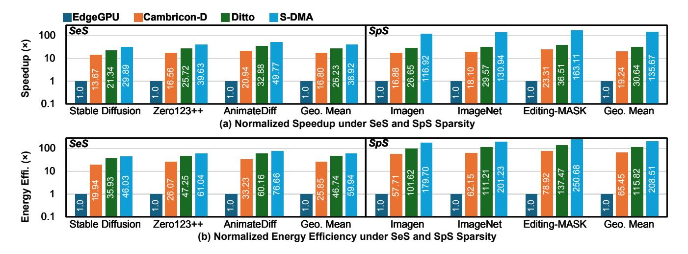

# 5.1 Experimental Setup

Software Configuration. Following the evaluation protocols established in prior work [\[46,](#page-12-14) [51\]](#page-12-9), we assess the performance of our approach across three distinct tasks for SeS and three datasets for SpS. To validate the generality of our method, we incorporate two SOTA sparsity prediction methods as baselines [\[3,](#page-11-0) [51\]](#page-12-9) for SeS and SpS. The threshold settings in these baselines are configured with their respective optimal values and are independent of the hyperparameter . Notably, S-DMA algorithm optimizations are broadly compatible with other similar sparsity prediction methods.

For SeS evaluation, we adopt Zero123++ v1.2 [\[38\]](#page-12-13) as the base model for the multi-view diffusion task. Zero123++ is an imageconditioned latent diffusion model designed to synthesize six consistent views from a single input image. We evaluate it on the GSO dataset [\[8\]](#page-11-7), which contains over 1,000 high-quality 3D-scanned objects. To enable comparison with ToMe, we report PSNR and LPIPS [\[50\]](#page-12-20) metrics, measuring perceptual and pixel-level fidelity. In the text-to-video task, we utilize AnimateDiff v3 [\[11\]](#page-11-4) as the backbone model, a SOTA diffusion framework that generates smooth and temporally coherent video sequences from either text prompts or reference frames. We conduct an evaluation on the VBench [\[17\]](#page-12-21) benchmark using semantic alignment and visual quality metrics. For the text-to-image task, we employ Stable Diffusion v2 [\[36\]](#page-12-5) at a

| Mo             | dels                             | Zero123++ v1.2              |                  |               | AnimateDiff v3              |                 |                  | Stable-Diffusion v2         |                  |       |                  |       |                  |
|----------------|----------------------------------|-----------------------------|------------------|---------------|-----------------------------|-----------------|------------------|-----------------------------|------------------|-------|------------------|-------|------------------|
| Ta             | asks Image-Conditioned Multiview |                             |                  | Text-to-Video |                             |                 | Text-to-Image    |                             |                  |       |                  |       |                  |
| Dat            | taset GSO                        |                             |                  |               | VBench                      |                 |                  |                             | COCO 2014        |       |                  |       |                  |
| Iterations 50  |                                  |                             |                  | 30            |                             |                 |                  | 50                          |                  |       |                  |       |                  |
| Metrics PSNR↑  |                                  | SNR↑                        | LPIPS↓           |               | Sen                         | Semantic↑ Quali |                  | ıality↑                     | FID↓             |       | CLIP↑            |       |                  |
| Method         |                                  | ToMe                        | +SpASim +NAND | ToMe          | +SpASim +NAND            | ToMe            | +SpASim +NAND | ToMe                        | +SpASim +NAND | ToMe  | +SpASim +NAND | ToMe  | +SpASim +NAND |
|                | 0.50                             | 14.76                       | 14.73            | 0.265         | 0.274                       | 74.71           | 74.68            | 81.64                       | 81.57            | 13.50 | 13.57            | 31.79 | 31.71            |
| Merge          | 0.60                             | 14.71                       | 14.66            | 0.272         | 0.283                       | 74.03           | 73.97            | 81.58                       | 81.49            | 14.81 | 14.89            | 31.80 | 31.69            |
| Ratio          | 0.70                             | 14.18                       | 14.09            | 0.302         | 0.327                       | 72.03           | 71.94            | 81.52                       | 81.41            | 17.46 | 17.58            | 31.78 | 31.68            |
|                | 0.75                             | 13.12                       | 12.97            | 0.349         | 0.378                       | 69.67           | 69.55            | 80.82                       | 80.68            | 20.89 | 21.03            | 31.71 | 31.57            |
| K; Improvement |                                  | K=14; 94% Prediction FLOPs↓ |                  |               | K=13; 95% Prediction FLOPs↓ |                 |                  | K=16; 92% Prediction FLOPs↓ |                  |       |                  |       |                  |
| Matche         | Matched Ratio                    |                             | 89%              |               |                             | 88%             |                  |                             | 91%              |       |                  |       |                  |

Table 2: Semantic sparsity accuracy and computation savings

Table 3: Spatial sparsity accuracy and computation savings

| Dataset          | et Metrics InstDiff. |       | +SpASim +NAND | Window K; Improvement |  |  |
|------------------|----------------------|-------|------------------|--------------------------|--|--|
| ImagaNat         | LPIPS↓               | 28.6  | 28.9             | K=10;                    |  |  |
| ImageNet         | CSFID↓               | 65.1  | 65.3             | 78% FLOPs↓               |  |  |
|                  | LPIPS↓               | 17.0  | 17.2             | V 12                     |  |  |
| Imagen           | FID↓                 | 55.3  | 55.6             | K=13; 63% FLOPs.      |  |  |
|                  | CLIP↑                | 0.249 | 0.246            | 05% FLOFS                |  |  |
| Editing- MASK | IoU↑                 | 56.2  | 55.8             | K=11; 73% FLOPs↓      |  |  |

resolution of 768×768. We use the COCO 2014 [25] dataset for quantitative comparison, reporting FID [15] and CLIP [14, 33] scores to assess visual quality and text-image consistency, respectively.

For SpS evaluation, we use Stable Diffusion as the base model and test on the ImageNet [7], Imagen [37], and Editing-MASK [51] datasets. On ImageNet, we compute LPIPS to quantify perceptual changes and CSFID [5] to measure distributional shifts. For Imagen, we evaluate LPIPS, FID [15], and CLIP to assess semantic fidelity and alignment with textual prompts. In Editing-MASK, we calculate IoU to measure the accuracy.

Hardware Configuration. We implement the RTL design of the S-DMA accelerator in Verilog and synthesize it through Synopsys Design Compiler, targeting commercial 28nm CMOS technology. The design operates reliably at 1V and a frequency of 1GHz, with no observed timing issues. On-chip area and power consumption are obtained from Design Compiler and PrimeTime PX, respectively. For external memory power modeling, we use a DDR4 memory model provided by DRAMSim3 [24]. Following the methodology of [4], all accelerators are evaluated under an iso-compute-area constraint. Each is equipped with a 224 KB activation buffer and a 128 KB weight buffer, which are implemented as on-chip SRAM and modeled using CACTI [1]. The on-chip memory configurations are consistent with the standardized single-instance S-DMA setup, as shown in Table 1.

**Hardware Baselines.** To evaluate the performance of S-DMA, we deploy the benchmarks on the general platform NVIDIA A100 GPU, NVIDIA Jetson Orin Nano, and two SOTA accelerators for comparison. The latency and power consumption of GPUs are

evaluated following prior respective works [13, 20, 48]. For the accelerator baselines, we select Cambricon-D [21] and Ditto [20], two representative accelerators that exploit inter-iteration sparsity for DM acceleration. For the comparison with the GPU, we use a set of S-DMA accelerators to extend the throughput, following the same methodology used in previous works [12, 13, 27, 32]. To enable fair comparison with prior SOTA accelerators implemented in different technology nodes, we normalize all designs to a common baseline of 28 nm CMOS at 1.0 V supply voltage. Following standard scaling models [26, 44], the operating frequency is scaled with s, and core power is scaled with  $s/V_{\rm cd}^2$ , where  $s = {\rm Tech}/28 \, {\rm nm}$ .

### 5.2 Algorithm Performance

As shown in Table 2 and Table 3, task-specific values of *K* lead to varying degrees of improvement in sparsity prediction performance. The hyperparameter K, which is determined offline by Algorithm 1, controls the window size for both SeS and SpS predictions. We conduct extensive experiments across multiple diffusion models and datasets to identify optimal values for K, balancing prediction accuracy with computational efficiency. Empirical results show that the optimal values of K are set to 14 for Zero123++, 13 for AnimateDiff, and 16 for Stable Diffusion, resulting in reductions of sparsity prediction computation by 94%, 95%, and 92% FLOPs, respectively. Compared to the matched src and dst tokens identified by the original global similarity, the selected token pairs by the K-based windows cover 89%, 88%, and 91% of them in the corresponding tasks. These results demonstrate the effectiveness of SpASim in balancing accuracy and computational efficiency. For spatial sparsity, we configure K=10 on ImageNet, K=13 on Imagen, and K=11 on Editing-MASK, achieving prediction FLOP reductions of 78%, 63%, and 73%, respectively.

For SeS tasks, we adopt the original ToMe method [3] as the baseline. As shown in Table 2, S-DMA achieves comparable generation quality across various models. For Zero123++, the PSNR drop remains under 1.15%. On AnimateDiff, both semantic consistency and perceptual quality metrics remain effectively unchanged. For Stable Diffusion, our method incurs a marginal FID increase of less than 0.7%, and a CLIP score drop within 0.45%. To evaluate performance on SpS tasks, Table 3 compares the generation quality of S-DMA with InstDiffEdit [51]. On ImageNet, the LPIPS and CSFID scores degrade by only 1.05% and 0.31%, respectively. On Imagen,

Figure 12: Speedup and energy efficiency comparison between S-DMA and GPU-based baselines.

all performance drops across LPIPS, FID, and CLIP remain within 1.2%. For editing-mask-based tasks, the IoU score drops by less than 1%, while S-DMA achieves a 73% reduction in sparsity prediction overhead. These results demonstrate that S-DMA maintains high generation fidelity across both SeS and SpS scenarios, with minimal impact on quality metrics and substantial computational savings.

#### 5.3 Architecture Evaluation

Hardware Breakdown. Table 1 summarizes the area and power distribution of the proposed S-DMA accelerator. The design integrates an  $8 \times 8$  PE array, a NAND-based SP2U, and a configurable reduction network, occupying a total silicon area of 1.676 mm2 and consuming 354.87 mW under a 1 GHz clock. Among all components, the PE array accounts for the largest area portion (46.3%) and significant power consumption (36.5%), reflecting its central role in high-throughput dense MAC computation. In contrast, the SP2U and the reduction network contribute only 7.4% and 4.5% of the total area, and 5.6% and 3.5% of the power, respectively. Their compact footprint stems from the design emphasis on reusability and configurability across SeS and SpS prediction stages. Memory buffers occupy 33.0% of the area and dominate the power consumption (53.4%). Overall, the results demonstrate that S-DMA achieves an efficient balance between computational throughput and hardware overhead. The lightweight SP2U and reduction modules impose minimal resource cost while enabling adaptive sparsity prediction and aggregation, contributing to S-DMA's high energy efficiency.

Comparison with GPU Baselines. Fig. 12 compares S-DMA against three GPU baselines: (1) a standard GPU without sparsity processing, (2) a GPU with conventional sparsity methods, and (3) a GPU further enhanced with our proposed SpASim algorithm. Under SeS workloads, S-DMA achieves 14.66× average speedup over the baseline GPU and further outperforms the GPU+Sparsity and GPU+Sparsity+SpASim configurations by 7.66× and 4.42×, respectively. Correspondingly, energy efficiency is improved by 12.56×, 8.61×, and 4.46× across the same configurations. For SpS

workloads, S-DMA delivers even more significant gains, achieving an average speedup of 51.11× and an energy efficiency gain of 43.87× over the baseline GPU. Compared to GPU+Sparsity and GPU+Sparsity+SpASim setups, S-DMA provides 7.52×/4.73× higher speedup and 7.37×/4.65× better energy efficiency, respectively. Notably, integrating SpASim into GPU-based systems yields tangible improvements in both speed and energy efficiency, validating the effectiveness of the algorithm itself. However, the proposed S-DMA further amplifies these benefits through its co-designed hardware optimizations, achieving significantly higher performance across both SeS and SpS sparsity patterns.

Comparison with SOTA Accelerators. To comprehensively assess S-DMA's performance, we compare it against SOTA diffusion model accelerators, Cambricon-D [21] and Ditto [20], in terms of speedup and energy efficiency. EdgeGPU is adopted as the baseline to reflect deployment scenarios in edge environments. Note that S-DMA is evaluated independently without integrating prior orthogonal acceleration strategies (e.g., differential computing), as the objective is to isolate and highlight the standalone benefits of our sparsity-centric architectural techniques. As shown in Fig. 13, all evaluated accelerators significantly outperform the EdgeGPU baseline across both SeS and SpS workloads due to their customized DM acceleration architectures. However, prior works fall short in fully exploiting the multi-granularity sparsity present in DMs. Under SeS workloads, S-DMA achieves geometric mean speedups of 2.32× and 1.48× over Cambricon-D and Ditto, respectively, delivering the highest performance across all evaluated accelerators. For SpS workloads, the performance gap further widens, with S-DMA offering 7.05× and 4.43× speedups over Cambricon-D and Ditto, respectively. These gains stem from S-DMA's unified support for both SeS and SpS through dimension-adaptive dataflow and efficient sparsity prediction, whereas Cambricon-D and Ditto primarily target inter-step reuse. In terms of energy efficiency, S-DMA also outperforms all competitors across multiple benchmarks. Specifically, under SeS tasks, it achieves 2.32× and 1.28× improvements over Cambricon-D and Ditto, respectively. The advantage becomes

Figure 13: Speedup and energy efficiency versus EdgeGPU and SOTA accelerators.

more pronounced in SpS scenarios, with S-DMA delivering  $3.19\times$  and  $1.80\times$  higher energy efficiency. This is attributed to the architecture's ability to jointly exploit sparsity in both computation and memory, whereas prior works lack sparsity co-optimization.

