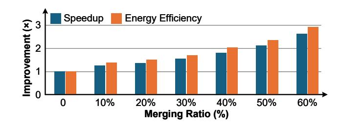
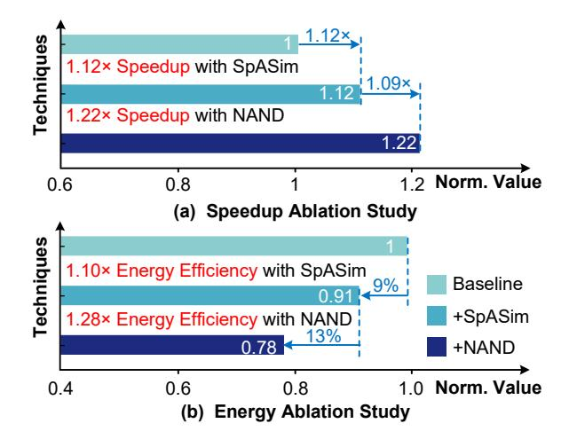

# 5.4 Ablation Study

To evaluate the impact of merging ratios on system performance, we conduct an ablation study by varying the merging ratio r from 0 to 0.6. In the context of SpS, the merging ratio refers to the proportion of pixels that do not require editing, while in SeS, it corresponds to the proportion of features that can be merged based on similarity. As shown in Fig. 14, both speedup and energy efficiency of the S-DMA accelerator improve consistently as the merging ratio increases. When no merging is applied (r = 0), the system operates as a standard accelerator without sparsity, and both speedup and energy efficiency are normalized to 1. With a modest merging ratio of r = 0.3, S-DMA achieves a speedup of  $1.53 \times$  and an energy efficiency improvement of 1.69×. At r = 0.5, the improvements grow to 2.12× speedup and 2.37× energy efficiency. Notably, when the merging ratio reaches 0.6, the S-DMA accelerator achieves a maximum speedup of 2.61× and an energy efficiency gain of 2.90×, demonstrating the significant benefit of the supporting sparsity. These improvements stem from reduced redundant computation and minimized memory access, particularly when larger portions of the input can be merged or skipped due to sparsity.

Fig. 15 presents the ablation study of S-DMA's sparsity prediction pipeline under a fixed sparsity ratio, normalized to the baseline design without SpASim or NAND-based similarity computation. Introducing SpASim yields a  $1.12\times$  speedup and a  $1.10\times$  energy efficiency improvement by selectively eliminating redundant computation based on local similarity. When the NAND-based similarity engine is further used, performance and energy efficiency improve to  $1.22\times$  and  $1.28\times$ , respectively. This is attributed to the hardware-friendly implementation of the NAND-based similarity computation, which leverages low-latency bitwise operations with minimal overhead. Even when SpASim is disabled, representing a

Figure 14: Speedup and energy efficiency of S-DMA under different merging ratios.

worst-case scenario with minimal local similarity, the system still benefits from the lightweight NAND-based similarity computation, demonstrating its robustness and low-cost effectiveness. Overall, this ablation confirms that both the SpASim and NAND engine components contribute synergistically to the gains in speedup and energy efficiency.

### 6 Related Work

#### 6.1 Diffusion Models

Since the introduction of Denoising Diffusion Probabilistic Models (DDPM) [16], a wide range of DMs have been developed, achieving SOTA performance across diverse generative tasks [11, 29, 33, 36, 38–40, 47]. In text-to-image generation, models such as Stable Diffusion, Imagen [37], and DALLE-2 [34] synthesize semantically aligned images by progressively denoising latent representations. In the video domain, models like AnimateDiff [11] and LaVie [43] extend the denoising process temporally, using prompts or reference frames as conditions. However, they introduce large parameters and complex computation, limiting their on-device application.

#### 6.2 Diffusion Models Acceleration

A variety of techniques have been proposed to accelerate diffusion model inference [6, 19, 22, 23, 42, 49]. Token merging [3] reduces

Figure 15: Ablation study of S-DMA sparsity prediction

redundancy in Transformer blocks by identifying and merging semantically similar tokens within feature maps. SIGE [23] observes that editing tasks often modify only a subset of the input, enabling selective computation. InstDiffEdit [51] introduces a mask generation mechanism based on attention maps in cross-attention layers, effectively identifying spatial regions for editing. DeepCache [28] skips computations in certain deep U-Net layers, leveraging the similarity of intermediate features across adjacent timesteps. While these methods demonstrate strong acceleration performance, they pose significant challenges for efficient deployment on hardware.

## **6.3 Diffusion Model Accelerators**

Recent works have explored specialized software-hardware codesigns to accelerate DM inference by leveraging various forms of inherent features in these models. Cambricon-D [21] focuses exclusively on temporal similarity across consecutive timesteps, utilizing it to enable reduced-precision computation. Exion [13] targets output sparsity through a novel ConMerge mechanism, coupled with a custom architecture optimized for broadcasting both input activations and weights efficiently. Ditto [20] extends this idea by incorporating dynamic value sparsity and bit-width reduction via lightweight logic. However, it does not address semantic or spatial sparsity, which remain critical for unlocking further efficiency gains. In contrast to these designs, our work holistically addresses spatial and semantic sparsity through an integrated prediction-acceleration pipeline, enabling more comprehensive exploitation of the sparsity spectrum in DMs.

#### 7 Conclusion

This paper presents S-DMA, a software-hardware co-design framework for accelerating sparse diffusion models (DMs). To address the overheads of diverse sparsity prediction strategies, we introduce a spatiality-aware sampling method that exploits the intrinsic locality in diffusion processes, reducing the complexity of similarity computation from  $O(N^2)$  to O(N). In parallel, we propose a NAND-based similarity to significantly lower the computational

cost, supporting both semantic and spatial sparsity. A dimension-adaptive dataflow is also developed, enabling efficient handling of both sparse convolution and sparse matrix multiplication within a single framework. Building on these algorithmic insights, we design a dedicated accelerator comprising three key components: a sparsity prediction processing unit, a 3D processing element array, and a sparsity-aware reduction network. Experimental results show that S-DMA delivers up to 51.11× speedup and 43.87× energy efficiency improvement over the NVIDIA A100 GPU. Compared to state-of-the-art DM accelerators, S-DMA achieves up to 7.05× speedup and 3.19× better energy efficiency.

## Acknowledgments

This work was supported by the National Key Research and Development Program of China under Grant 2023YFB4403103.

#### References

-  Rajeev Balasubramonian, Andrew B Kahng, Naveen Muralimanohar, Ali Shafiee, and Vaishnav Srinivas. 2017. CACTI 7: New tools for interconnect exploration in innovative off-chip memories. ACM Transactions on Architecture and Code Optimization (TACO) 14, 2 (2017), 1–25.
- [2] Kenneth E Batcher. 1968. Sorting networks and their applications. In Proceedings of the April 30–May 2, 1968, spring joint computer conference. 307–314.
- [3] Daniel Bolya and Judy Hoffman. 2023. Token merging for fast stable diffusion. In Proceedings of the IEEE/CVF conference on computer vision and pattern recognition. 4599–4603.
- [4] Yuzong Chen, Ahmed F AbouElhamayed, Xilai Dai, Yang Wang, Marta Andronic, George A Constantinides, and Mohamed S Abdelfattah. 2024. BitMoD: Bit-serial Mixture-of-Datatype LLM Acceleration. arXiv preprint arXiv:2411.11745 (2024).
- [5] Guillaume Couairon, Asya Grechka, Jakob Verbeek, Holger Schwenk, and Matthieu Cord. 2022. Flexit: Towards flexible semantic image translation. In Proceedings of the IEEE/CVF conference on computer vision and pattern recognition. 18270–18279.
- [6] Guillaume Couairon, Jakob Verbeek, Holger Schwenk, and Matthieu Cord. 2022. Diffedit: Diffusion-based semantic image editing with mask guidance. arXiv preprint arXiv:2210.11427 (2022).
- [7] Jia Deng, Wei Dong, Richard Socher, Li-Jia Li, Kai Li, and Li Fei-Fei. 2009. Imagenet: A large-scale hierarchical image database. In 2009 IEEE conference on computer vision and pattern recognition. Ieee, 248–255.
- [8] Laura Downs, Anthony Francis, Nate Koenig, Brandon Kinman, Ryan Hickman, Krista Reymann, Thomas B McHugh, and Vincent Vanhoucke. 2022. Google scanned objects: A high-quality dataset of 3d scanned household items. In 2022 International Conference on Robotics and Automation (ICRA). IEEE, 2553–2560.
- [9] Hang Gao, Xizhou Zhu, Steve Lin, and Jifeng Dai. 2019. Deformable kernels: Adapting effective receptive fields for object deformation. arXiv preprint arXiv:1910.02940 (2019).
- [10] Ruiqi Guo, Lei Wang, Xiaofeng Chen, Hao Sun, Zhiheng Yue, Yubin Qin, Huiming Han, Yang Wang, Fengbin Tu, Shaojun Wei, et al. 2024. 20.2 A 28nm 74.34 TFLOPS/W BF16 Heterogenous CIM-Based Accelerator Exploiting Denoising-Similarity for Diffusion Models. In 2024 IEEE International Solid-State Circuits Conference (ISSCC), Vol. 67. IEEE, 362–364.
- [11] Yuwei Guo, Ceyuan Yang, Anyi Rao, Zhengyang Liang, Yaohui Wang, Yu Qiao, Maneesh Agrawala, Dahua Lin, and Bo Dai. 2023. Animatediff: Animate your personalized text-to-image diffusion models without specific tuning. arXiv preprint arXiv:2307.04725 (2023).
- [12] Tae Jun Ham, Yejin Lee, Seong Hoon Seo, Soosung Kim, Hyunji Choi, Sung Jun Jung, and Jae W Lee. 2021. ELSA: Hardware-software co-design for efficient, lightweight self-attention mechanism in neural networks. In 2021 ACM/IEEE 48th Annual International Symposium on Computer Architecture (ISCA). IEEE, 692–705.
- [13] Jaehoon Heo, Adiwena Putra, Jieon Yoon, Sungwoong Yune, Hangyeol Lee, Ji-Hoon Kim, and Joo-Young Kim. 2025. EXION: Exploiting Inter-and Intra-Iteration Output Sparsity for Diffusion Models. In 2025 IEEE International Symposium on High Performance Computer Architecture (HPCA). 324–337. https://doi.org/10. 1109/HPCA61900.2025.00034
- [14] Jack Hessel, Ari Holtzman, Maxwell Forbes, Ronan Le Bras, and Yejin Choi. 2021. Clipscore: A reference-free evaluation metric for image captioning. arXiv preprint arXiv:2104.08718 (2021).
- [15] Martin Heusel, Hubert Ramsauer, Thomas Unterthiner, Bernhard Nessler, and Sepp Hochreiter. 2017. Gans trained by a two time-scale update rule converge to a local nash equilibrium. Advances in neural information processing systems 30 (2017).

- [16] Jonathan Ho, Ajay Jain, and Pieter Abbeel. 2020. Denoising diffusion probabilistic models. Advances in neural information processing systems 33 (2020), 6840–6851.
- [17] Ziqi Huang, Yinan He, Jiashuo Yu, Fan Zhang, Chenyang Si, Yuming Jiang, Yuanhan Zhang, Tianxing Wu, Qingyang Jin, Nattapol Chanpaisit, et al. 2024. Vbench: Comprehensive benchmark suite for video generative models. In Proceedings of the IEEE/CVF Conference on Computer Vision and Pattern Recognition. 21807– 21818.
- [18] Yiqi Jing, Meng Wu, Jiaqi Zhou, Yiyang Sun, Yufei Ma, Ru Huang, Tianyu Jia, and Le Ye. 2024. AIG-CIM: A Scalable Chiplet Module with Tri-Gear Heterogeneous Compute-in-Memory for Diffusion Acceleration. In Proceedings of the 61st ACM/IEEE Design Automation Conference. 1–6.
- [19] Minchul Kim, Shangqian Gao, Yen-Chang Hsu, Yilin Shen, and Hongxia Jin. 2024. Token fusion: Bridging the gap between token pruning and token merging. In Proceedings of the IEEE/CVF Winter Conference on Applications of Computer Vision. 1383–1392.
- [20] Sungbin Kim, Hyunwuk Lee, Wonho Cho, Mincheol Park, and Won Woo Ro. 2025. Ditto: Accelerating Diffusion Model via Temporal Value Similarity. In 2025 IEEE International Symposium on High Performance Computer Architecture (HPCA). 338–352.<https://doi.org/10.1109/HPCA61900.2025.00035>
- [21] Weihao Kong, Yifan Hao, Qi Guo, Yongwei Zhao, Xinkai Song, Xiaqing Li, Mo Zou, Zidong Du, Rui Zhang, Chang Liu, et al. 2024. Cambricon-d: Full-network differential acceleration for diffusion models. In 2024 ACM/IEEE 51st Annual International Symposium on Computer Architecture (ISCA). IEEE, 903–914.
- [22] Lijiang Li, Huixia Li, Xiawu Zheng, Jie Wu, Xuefeng Xiao, Rui Wang, Min Zheng, Xin Pan, Fei Chao, and Rongrong Ji. 2023. Autodiffusion: Training-free optimization of time steps and architectures for automated diffusion model acceleration. In Proceedings of the IEEE/CVF International Conference on Computer Vision. 7105– 7114.
- [23] Muyang Li, Ji Lin, Chenlin Meng, Stefano Ermon, Song Han, and Jun-Yan Zhu. 2022. Efficient spatially sparse inference for conditional gans and diffusion models. Advances in neural information processing systems 35 (2022), 28858–28873.
- [24] Shang Li, Zhiyuan Yang, Dhiraj Reddy, Ankur Srivastava, and Bruce Jacob. 2020. DRAMsim3: A cycle-accurate, thermal-capable DRAM simulator. IEEE Computer Architecture Letters 19, 2 (2020), 106–109.
- [25] Tsung-Yi Lin, Michael Maire, Serge Belongie, James Hays, Pietro Perona, Deva Ramanan, Piotr Dollár, and C Lawrence Zitnick. 2014. Microsoft coco: Common objects in context. In Computer vision–ECCV 2014: 13th European conference, zurich, Switzerland, September 6-12, 2014, proceedings, part v 13. Springer, 740– 755.
- [26] Leibo Liu, Guiqiang Peng, Pan Wang, Sheng Zhou, Qiushi Wei, Shouyi Yin, and Shaojun Wei. 2020. Energy-and area-efficient recursive-conjugate-gradient-based MMSE detector for massive MIMO systems. IEEE Transactions on Signal Processing 68 (2020), 573–588.
- [27] Liqiang Lu, Yicheng Jin, Hangrui Bi, Zizhang Luo, Peng Li, Tao Wang, and Yun Liang. 2021. Sanger: A co-design framework for enabling sparse attention using reconfigurable architecture. In MICRO-54: 54th Annual IEEE/ACM International Symposium on Microarchitecture. 977–991.
- [28] Xinyin Ma, Gongfan Fang, and Xinchao Wang. 2024. Deepcache: Accelerating diffusion models for free. In Proceedings of the IEEE/CVF conference on computer vision and pattern recognition. 15762–15772.
- [29] Gal Metzer, Elad Richardson, Or Patashnik, Raja Giryes, and Daniel Cohen-Or. 2023. Latent-nerf for shape-guided generation of 3d shapes and textures. In Proceedings of the IEEE/CVF conference on computer vision and pattern recognition. 12663–12673.
- [30] Alex Nichol, Prafulla Dhariwal, Aditya Ramesh, Pranav Shyam, Pamela Mishkin, Bob McGrew, Ilya Sutskever, and Mark Chen. 2021. Glide: Towards photorealistic image generation and editing with text-guided diffusion models. arXiv preprint arXiv:2112.10741 (2021).
- [31] Yubin Qin, Yang Wang, Zhiren Zhao, Xiaolong Yang, Yang Zhou, Shaojun Wei, Yang Hu, and Shouyi Yin. 2024. MECLA: Memory-Compute-Efficient LLM Accelerator with Scaling Sub-matrix Partition. In 2024 ACM/IEEE 51st Annual International Symposium on Computer Architecture (ISCA). IEEE, 1032–1047.
- [32] Zheng Qu, Liu Liu, Fengbin Tu, Zhaodong Chen, Yufei Ding, and Yuan Xie. 2022. Dota: detect and omit weak attentions for scalable transformer acceleration. In Proceedings of the 27th ACM International Conference on Architectural Support for Programming Languages and Operating Systems. 14–26.
- [33] Alec Radford, Jong Wook Kim, Chris Hallacy, Aditya Ramesh, Gabriel Goh, Sandhini Agarwal, Girish Sastry, Amanda Askell, Pamela Mishkin, Jack Clark, et al. 2021. Learning transferable visual models from natural language supervision. In International conference on machine learning. PmLR, 8748–8763.
- [34] Aditya Ramesh, Prafulla Dhariwal, Alex Nichol, Casey Chu, and Mark Chen. 2022. Hierarchical text-conditional image generation with clip latents. arXiv preprint arXiv:2204.06125 1, 2 (2022), 3.
- [35] Hamid Rezatofighi, Nathan Tsoi, JunYoung Gwak, Amir Sadeghian, Ian Reid, and Silvio Savarese. 2019. Generalized intersection over union: A metric and a loss for bounding box regression. In Proceedings of the IEEE/CVF conference on computer vision and pattern recognition. 658–666.

- [36] Robin Rombach, Andreas Blattmann, Dominik Lorenz, Patrick Esser, and Björn Ommer. 2022. High-resolution image synthesis with latent diffusion models. In Proceedings of the IEEE/CVF conference on computer vision and pattern recognition. 10684–10695.
- [37] Chitwan Saharia, William Chan, Saurabh Saxena, Lala Li, Jay Whang, Emily L Denton, Kamyar Ghasemipour, Raphael Gontijo Lopes, Burcu Karagol Ayan, Tim Salimans, et al. 2022. Photorealistic text-to-image diffusion models with deep language understanding. Advances in neural information processing systems 35 (2022), 36479–36494.
- [38] Ruoxi Shi, Hansheng Chen, Zhuoyang Zhang, Minghua Liu, Chao Xu, Xinyue Wei, Linghao Chen, Chong Zeng, and Hao Su. 2023. Zero123++: a single image to consistent multi-view diffusion base model. arXiv preprint arXiv:2310.15110 (2023).
- [39] Uriel Singer, Adam Polyak, Thomas Hayes, Xi Yin, Jie An, Songyang Zhang, Qiyuan Hu, Harry Yang, Oron Ashual, Oran Gafni, et al. 2022. Make-a-video: Text-to-video generation without text-video data. arXiv preprint arXiv:2209.14792 (2022).
- [40] Jiaming Song, Chenlin Meng, and Stefano Ermon. 2020. Denoising diffusion implicit models. arXiv preprint arXiv:2010.02502 (2020).
- [41] Haoyu Wang and Chengguang Ma. 2021. An optimization of im2col, an important method of CNNs, based on continuous address access. In 2021 IEEE International Conference on Consumer Electronics and Computer Engineering (ICCECE). 314–320. <https://doi.org/10.1109/ICCECE51280.2021.9342343>
- [42] Qian Wang, Biao Zhang, Michael Birsak, and Peter Wonka. 2023. Instructedit: Improving automatic masks for diffusion-based image editing with user instructions. arXiv preprint arXiv:2305.18047 (2023).
- [43] Yaohui Wang, Xinyuan Chen, Xin Ma, Shangchen Zhou, Ziqi Huang, Yi Wang, Ceyuan Yang, Yinan He, Jiashuo Yu, Peiqing Yang, et al. 2024. Lavie: High-quality video generation with cascaded latent diffusion models. International Journal of Computer Vision (2024), 1–20.
- [44] Yizhi Wang, Jun Lin, and Zhongfeng Wang. 2017. An energy-efficient architecture for binary weight convolutional neural networks. IEEE Transactions on Very Large Scale Integration (VLSI) Systems 26, 2 (2017), 280–293.
- [45] Yuqing Wang, Shuhuai Ren, Zhijie Lin, Yujin Han, Haoyuan Guo, Zhenheng Yang, Difan Zou, Jiashi Feng, and Xihui Liu. 2025. Parallelized autoregressive visual generation. In Proceedings of the Computer Vision and Pattern Recognition Conference. 12955–12965.
- [46] Haoyu Wu, Jingyi Xu, Hieu Le, and Dimitris Samaras. 2024. Importance-based Token Merging for Diffusion Models. arXiv preprint arXiv:2411.16720 (2024).
- [47] Ling Yang, Zhilin Huang, Yang Song, Shenda Hong, Guohao Li, Wentao Zhang, Bin Cui, Bernard Ghanem, and Ming-Hsuan Yang. 2022. Diffusion-based scene graph to image generation with masked contrastive pre-training. arXiv preprint arXiv:2211.11138 (2022).
- [48] Seungjae Yoo, Hangyeol Kim, and Joo-Young Kim. 2024. AdapTiV: Sign-Similarity Based Image-Adaptive Token Merging for Vision Transformer Acceleration. In 2024 57th IEEE/ACM International Symposium on Microarchitecture (MICRO). IEEE, 64–77.
- [49] Zihao Yu, Haoyang Li, Fangcheng Fu, Xupeng Miao, and Bin Cui. 2024. Accelerating text-to-image editing via cache-enabled sparse diffusion inference. In Proceedings of the AAAI Conference on Artificial Intelligence, Vol. 38. 16605–16613.
- [50] Richard Zhang, Phillip Isola, Alexei A Efros, Eli Shechtman, and Oliver Wang. 2018. The unreasonable effectiveness of deep features as a perceptual metric. In Proceedings of the IEEE conference on computer vision and pattern recognition. 586–595.
- [51] Siyu Zou, Jiji Tang, Yiyi Zhou, Jing He, Chaoyi Zhao, Rongsheng Zhang, Zhipeng Hu, and Xiaoshuai Sun. 2024. Towards efficient diffusion-based image editing with instant attention masks. In Proceedings of the AAAI Conference on Artificial Intelligence, Vol. 38. 7864–7872.