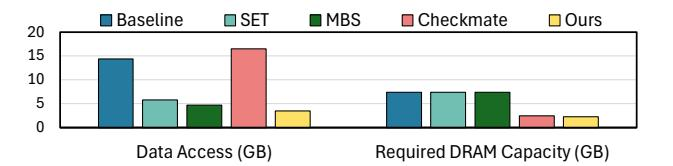

# 2 Background & Motivation

## 2.1 Inter-layer Scheduling

In general, inter-layer scheduling for tiled architecture is typically structured around the following four components:

1) Execution Scheme. This decision variable defines how the DNN workload consisting of multiple layers is mapped temporally and spatially across multiple computing cores. In general, three execution patterns are commonly adopted in practice: Sequential: Processes the model layer by layer in sequence; therefore, different layers are executed at different time steps, and each layer fully utilizes all the computational resources and on-chip memory; Pipeline: Coordinates several dependent layers to be processed concurrently in a pipelined fashion, sharing the hardware tiles across layers;

| Inter-layer Scheduler | Design Factors    | Search Alg. | Support Training | Search Space (Training)     | Schedule Flexible   |
|--------------------------|----------------------|----------------|---------------------|--------------------------------|------------------------|
| MBS                      | F+B                  | Greedy Slow | Yes Limited      | $O(2^n \log m)$ Sampled     | Yes                    |
| Tangram                  | F+B                  | DP Slow     | Hypothesized        | $O(2^n \log m)$ Thoroughly  | Yes                    |
| Checkmate                | R                    | MILP Fast   | Yes Limited      | $O(n^2)$ Thoroughly         | Batch -level Only   |
| TileFlow                 | E+F+B (Partially) | GA Slow     | No                  | N/A                            | Branchless Only     |
| SET                      | E+F+B                | SA Slow     | Hypothesized        | $O(9.899^n \log m)$ Sampled | Tied to Batch-level |
| Crane                    | E+F+R+B              | MILP Fast   | Yes                 | $O(m^{4n-1}\log m)$ Thoroughly | Yes                    |

Table 1: Comparison of various inter-layer schedulers. Some notes: i) E, F, R and B denote execution scheme, layer fusion, recomputation, and sub-batch splitting, respectively.

- ii) The search spaces is for n-layer model with batch size of m.
- iii) Tangram and SET are not designed for training and do not report any training results. We hypothesize their potential training support by directly applying their inference schedules to the backward pass. iv) DP: Dynamic Programming; GA: Genetic Algorithm; SA: Simulated Annealing; MILP: Mixed-Integer Linear Programming
- v) The resource binding and loop ordering of TileFlow are manually fixed and only loop tiling is explored in [21].

Parallel: Allows multiple layers to be processed simultaneously without needing to account for dependencies among them.

- 2) Fusion Strategy. This is another important design factor that determines how to directly transfer the output data from previous layers to the latter ones without expensive off-chip memory (DRAM) access. As the strategy aims at reducing data movement, fusion [2, 18, 26, 41] is typically considered along with the execution pattern. In the scenario of sequential, the intermediate results are calculated and retained within local hardware tiles; while in the scenario of pipeline, the mapped group of tiles for one layer sends the output data to another tile group allocated for the next layer.
- 3) Recomputation Scheme. This strategy decides the protocol that when and which intermediate results should be temporally discarded and recomputed in the future as needed. By trading additional computation for reduction in storage, the recomputation scheme aims to effectively free up memory capacity a critical advantage in various memory-constrained scenarios. In practice, the most common application of this strategy is in DNN training [4, 15, 19, 39], where DRAM capacity becomes a major bottleneck, especially as memory consumption for activation scales with batch size. Applying recomputation in this context enables the training of larger and more complex models using larger batch sizes without requiring extra hardware resources.
- 4) Batch Splitting Plan. This strategy determines how to partition a batch of data into smaller subsets, which are then processed sequentially to complete the computation for each layer [6, 14, 18, 34]. Batch splitting can be applied in both inference and training scenarios, particularly when memory capacity is insufficient to process an entire batch at once. By dividing the batch into manageable pieces, this approach allows the utilization of limited memory resources while still leveraging batch processing benefits.

#### 2.2 Limitations of Previous Works

Motivated by the critical role of inter-layer scheduling in enabling efficient DNN inference and training, a set of inter-layer schedulers have been proposed in recent years. Table 1 summarizes the most relevant works, highlighting the design factors they explore, the search algorithms they employ, and their target deployment scenarios. Based on this summary, we identify several key limitations:

Challenge #1. Incomplete Exploration of Design Factors. None of the existing works comprehensively and systematically explore all four key design factors. As shown in Table 1, even stateof-the-art inter-layer schedulers such as SET [5] and TileFlow [40] lack support for recomputation schemes (R), resulting in limited or no applicability to training workloads. On the other hand, while Checkmate [15] incorporates recomputation strategies, it does not account for the other design factors (such as E and F) and is incompatible with schedulers like SET due to fundamental differences in search algorithms and representation frameworks. Additionally, Checkmate's exploration is restricted to the batch level rather than the sub-batch level (B), significantly constraining its scheduling granularity and design space. As a result, existing inter-layer scheduling approaches cannot offer efficient, unified solutions particularly for training scenarios. For example, as illustrated in Fig. 1, in ResNet-50 training with a batch size of 64, prior works can only optimize either DRAM data access (e.g., SET) or capacity requirements (e.g., Checkmate), but not both simultaneously.

Challenge #2. Constrained Scheduling Flexibility. Even when optimizing solely for inference scenarios-where recomputation (R) is not required-existing schedulers such as SET and TileFlow, which consider P+F+B, still suffer from limited scheduling flexibility. Specifically, SET enforces that the processing order of sub-batches across layers is strictly tied to the batch-level execution pattern. For example, when the execution scheme for 3sub-batch Layer-A, Layer-B and Layer-C is set to a pipeline pattern, the identified sub-batch-level processing order can only be  $A_1 \rightarrow$  $(A_2, B_1) \rightarrow (A_3, B_2, C_1) \rightarrow (B_3, C_2) \rightarrow C_3$ . Alternative scheduling options, such as  $A_1A_2 \rightarrow (A_3, B_1) \rightarrow (B_2B_3, C_1C_2) \rightarrow C_3$ , are never explored (see Fig. 15(a) for a practical example). Evidently, this rigid constraint significantly narrows the design space and may miss more efficient scheduling solutions. Although TileFlow overcomes the rigid batch-level scheduling constraint by allowing layer partitioning along arbitrary dimensions, it has two key limitations. 1) It is limited to optimizing linear, chain-structured workloads, such as GEMM or convolution chains. This limitation stems from its tile-centric, layer-splitting representation, which cannot model control-flow structures like branches. 2) It cannot support training workloads. Partitioning along non-batch dimensions preserves correctness only in forward propagation; backward propagation-critical for training-requires additional halo exchanges, global reductions, and synchronized statistics.

Challenge #3. Incomplete and Inefficient Search. Most state-of-the-art inter-layer schedulers rely on heuristic search algorithms, leading to both insufficient solution quality and long runtime. This limitation manifests in two ways. 1) Incomplete scheduling space coverage: the search procedures do not comprehensively explore the full scheduling space but instead rely on sampling-based heuristics such as simulated annealing (SET) or genetic algorithms (TileFlow).

Figure 1: Required data access and DRAM capacity for training ResNet-50 with a batch size of 64. While SET and MBS reduce data access through batch splitting (B) and layer fusion (F), the overall DRAM capacity requirement remains high. Checkmate significantly lowers DRAM capacity by introducing recomputation (R), while having high data access. Crane effectively reduces both data access and DRAM capacity through comprehensive optimization strategies.

These methods inherently risk missing globally optimal solutions. 2) Long scheduling duration: due to their stochastic nature, these heuristics converge slowly, resulting in long search times even for moderately sized workloads. For example, scheduling Inception inference with a batch size of 128 on 144 hardware tiles takes over two hours using the SET framework on an AMD EPYC 7402P CPU.

