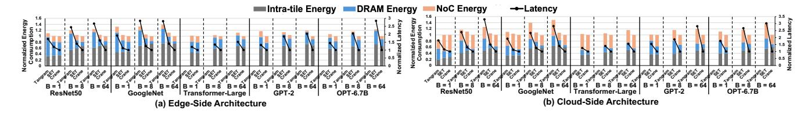
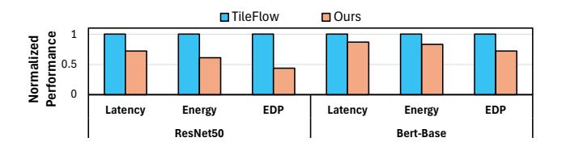
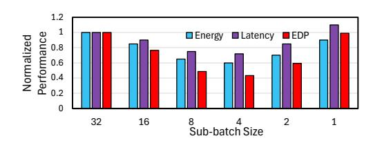
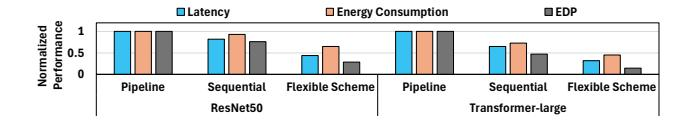
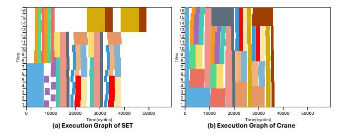
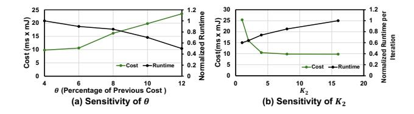

# 7.3 Evaluation on Training

Baseline. To evaluate training performance of Crane, we compare its results with those of MBS [23], an inter-layer scheduling method specialized for DNN training. MBS employs batch-splitting and layer fusion strategies to optimize data traffic and accelerate training on tiled accelerators. Additionally, since SET and Tangram are specifically designed for inference and its source code does not support training workloads, and in particular, it lacks support for recomputation, we estimate the potential performance of a hypothetical training-oriented SET and Tangram by applying the scheduling optimization from inference-only scheduling separately to forward and backward passes. The total estimated cost is then obtained by summing the resulting latency and energy metrics.

**Hardware Configuration.** For fair comparison, we follow the settings of MBS and configure the target computing platform with two tiled systolic array. Each hardware tile features a MAC array size of P=16384 ( $128\times128$ ) and 10 MB of SRAM. For high-bandwidth data movement, the on-chip NoC bandwidth ( $BW_{NoC}$ ) is set to 100 GB/s, with energy consumption of  $E_{NoC,unit}=0.7$  pJ/bit. Additionally, a 32 GB HBM2 off-chip memory provides a bandwidth of  $BW_D=300$  GB/s, consuming  $E_{DRAM,unit}=3.9$  pJ/bit [27]. Our evaluation follows the intra-layer computation scheme proposed in MBS. The search hyper-parameters are configured as  $K_3=\lceil 0.1\times N_{Candidate}\rceil$  and  $K_4=\lceil 0.05\times N_{Candidate}\rceil$ , while other parameters adhere to the configurations in Section 7.2. For the comparison with the hypothetical training-oriented SET, the cloud-side architecture is utilized and the configurations remain the same except DRAM size is set as 128 GB for training procedure.

**Workloads & Performance.** For the training evaluations with MSB, we select the ResNet-50, ResNet-101, Inception-V3, and Inception-V4 models. These models are trained on the ImageNet dataset using a batch size of 256. As illustrated in Fig. 11, the scheduling generated by our framework outperforms MBS's solution with respect to

Figure 9: Performance of inter-layer schedulers for inference workloads. Compared with Tangram, Crane reduces energy-delay product (EDP) by  $1.87 \times - 4.20 \times$  (averaging  $3.03 \times$ ) across all platforms, models, and batch sizes, and by  $1.13 \times - 4.17 \times$  (averaging  $1.84 \times$ ) compared with SET. The average runtime speedup for scheduling achieved by Crane is  $2.82 \times$  and  $156.20 \times$  compared to SET and Tangram, respectively.

Figure 10: Crane achieves 28%, 39%, and 56% reductions over TileFlow in latency, energy and EDP, respectively, on ResNet50. On Bert-Base, Crane delivers 13%, 17%, and 28% reductions in the same metrics.

Figure 11: Performance of inter-layer schedulers for training workload. (a) Crane outperforms MBS with  $1.42\times-2.22\times$  lower DRAM data traffic and  $3.62\times-5.36\times$  lower EDP. (b) Compared to training-oriented SET, Crane reduces DRAM traffic by  $2.76\times-2.97\times$  and EDP by  $11.01\times-21.01\times$ ; against Tangram, the reductions are  $4.81\times-5.72\times$  and  $45.43\times-64.73\times$ , respectively. Notably, SET and Tangram fail to schedule OPT-6.7B due to out-of-memory, while Crane successfully generates a DRAM-feasible schedule.

latency, energy consumption, DRAM data traffic, and total EDP cost per training step, achieving reduction of 1.64×, 2.54×, 1.67×, and 4.18× on average across various models. These advancements are attributed to two primary factors: 1) MBS adopts a layer sequential processing pattern, whereas Crane applies a combination of three patterns for scheduling; and 2) MBS relies on a heuristic approach to determine batch splitting and layer fusion settings, while our framework optimizes all the four design factors of scheduling.

To compare with hypothetical training-oriented SET and Tangram, we select ResNet-50 on ImageNet, Transformer-Large, GPT-2, and OPT-6.7B as models for training evaluation results. The batch size for training is 128. As shown in Fig. 11, Crane reduces latency by  $5.16\times-6.96\times$ , energy consumption by  $2.15\times-3.04\times$ , and DRAM traffic by  $2.76\times-2.97\times$  over SET, achieving  $11.01\times-21.01\times$  lower EDP.

Figure 12: Energy, latency, and EDP of ResNet-50 training under varying sub-batch sizes, with a fixed total batch size of 32. A sub-batch size of 32 (i.e., no batch splitting) results in much higher costs, highlighting the importance of effective batch splitting plan (B).

Figure 13: With recomputation enabled, Crane largely reduces DRAM capacity requirement with minor overhead (Batch size= 64).

Compared to Tangram, Crane reduces latency by 7.86×–10.26×, energy by 5.69×–6.41×, and DRAM traffic by 4.81×–5.72×, leading to 45.43×–64.73× EDP savings. Notably, the hypothetical training-oriented SET and Tangram cannot explore the inter-layer schedule for OPT-6.7B training due to an out-of-memory error. This occurs because the memory consumption for training this model exceeds DRAM capacity, while their searched schedule lacks the ability to explore recomputation opportunities that could reduce memory usage. In contrast, Crane successfully generates an optimized schedule that enables training within the given DRAM budget.

## 7.4 Ablation Study & Analysis

Impact of Batch Splitting (B). As shown in Figure 12, using no batch splitting (i.e., a sub-batch size of 32) results in higher energy, latency, and EDP compared to configurations with smaller sub-batches, demonstrating the effectiveness of batch-level partitioning. Additionally, the results reveal a trade-off between computation and data movement overhead. Smaller sub-batches improve on-chip buffer utilization and allow more aggressive layer fusion, thus reducing memory access cost. However, they also lead to lower PE utilization and repeated loading of weight data, which increases computation overhead. Crane's search process can systematically explore this trade-off to identify an optimal sub-batch configuration.

Figure 14: When exploring execution scheme is enabled, Crane identifies better scheduling solution with reduced latency, energy and EDP. Model inference on cloud architecture with batch size 64.

Figure 15: Tile-Time schedule for Inception inference (Crane vs SET).

**Impact of Recomputation (R).** Fig. 13 shows that enabling recomputation in Crane reduces DRAM capacity requirements by 2.2× on average, with only a modest 0.125× increase in data access overhead. This demonstrates the value of integrating recomputation strategies into the scheduling framework for training efficiency.

**Impact of Execution Scheme (E).** Fig. 14 highlights the importance of exploring execution schemes. With this exploration enabled, Crane achieves average reductions of  $2.6\times$  in latency,  $1.8\times$  in energy, and  $4.7\times$  in EDP compared to the case turning off execution scheme search. These gains stem from mitigating data reloading overheads in sequential scheduling and reducing pipeline bubbles in fully pipelined execution.

**Finer-Grained Sub-batch Optimization Analysis.** We use an inference example of Inception-ResNet-V1 model on edge-sided accelerator with BS=2 and  $BS_{sub}=1$  to demonstrate how the scheduling derived from our framework eliminates bubble overhead, as shown in Fig. 15. Each colored block represents a layer, with the horizontal axis representing the execution time and the vertical axis indicating the allocated tiles for that layer. Unlike SET, which restricts the search space to coarse-grained sub-batch scheduling, Crane expands the space to support flexible mappings across sub-batches of different layers. This broader exploration enables higher hardware performance through finer-grained scheduling.

**Runtime Analysis.** The end-to-end runtime of all frameworks is evaluated on an AMD EPYC 7402P CPU. Compared to SET and Tangram, Crane achieves  $2.82\times$  and  $156.20\times$  speedup, respectively. This substantial gain—despite Crane's larger search space—is enabled by three key factors: (1) For a given  $B_{\rm sub}$ , each block's optimization is formulated as an MILP problem solvable by efficient solvers; (2) The hierarchical search space is effectively pruned by (a) restricting sub-batch exploration to  ${\rm Top-}K_1$ ,  $K_2$  candidates based on  ${\rm Cost_{comp}}$  and  ${\rm Cost_{traffic}}$ , and (b) applying cost-driven block refinement to avoid enumerating poor nested structures; (3) The deterministic, hierarchical refinement process—alternating between

Figure 16: Runtime and EDP cost analysis of  $\theta$  and  $K_2$ . Increasing  $\theta$  and decreasing  $K_2$  reduce runtime but raise cost.

high-level and lower-level blocks—achieves fast convergence, unlike the slower, randomized simulated annealing used in SET.

Sensitivity Analysis. The parameters  $K_1$ – $K_4$  and  $\theta$  affect runtime and scheduling quality:  $K_1$ – $K_4$  control the number of subbatch candidates retained per iteration (impacting per-step runtime), while  $\theta$  sets the total number of iterations. Fig. 16 shows for VGG inference on an edge platform, increasing these values improves scheduling but increases runtime. Notably, the same  $K_1$ – $K_4$  and  $\theta$  are used across all experiments in Section 7.2 and 7.3.

#### 8 Conclusion

We present Crane, a unified inter-layer scheduling framework for tiled architectures that supports both inference and training. By leveraging a hierarchical table-format representation, Crane captures essential design factors, enables flexible scheduling, and transforms scheduling into a structured optimization problem. Experimental results show substantial gains over existing works.

