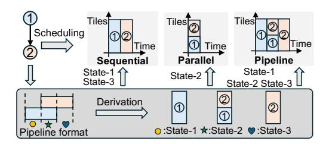
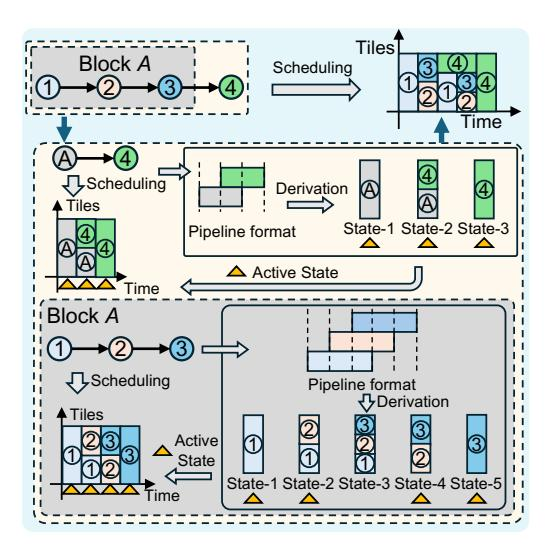

# 4 Hierarchical Representation of Scheduling

#### 4.1 Intuitive Glance

To efficiently explore the vast scheduling space, we propose a hierarchical representation of the scheduling schemes. The core of this representation is the concept of *Execution State*, which <u>captures the pattern of active layer execution</u> – that is, which layers are simultaneously involved in computation at each processing stage.

Example 1. Take the scheduling of a 2-layer model as an example. As shown in Fig. 2, when the two layers are processed sequentially, the execution involves exactly two distinct States: initially, only Layer-1 is active (State-1), followed by a stage where only Layer-2 is active (State-3). In contrast, when the layers are processed concurrently (i.e., in parallel), the execution involves only a single State – both Layer-1 and Layer-2 are active simultaneously (State-2). Finally, in the case of pipeline processing, the execution progresses through three distinct States, involving Layer-1 alone, then both layers concurrently, and finally Layer-2 alone – that is, all three States (State-1, State-2, and State-3) occur over time.

Notably, from the earlier example, we observe that the pipeline pattern naturally encompasses all *execution states* that also appear in the sequential and parallel patterns. This suggests that *pipeline scheduling may serve as a unifying structure, capable of capturing the full range of active layer configurations encountered across different scheduling strategies.* However, due to the simplicity of the 2-layer model, this observation may not generalize. To further examine its

Figure 2: Derive states of execution scheme from pipeline pattern.

Figure 3: The states of complex execution scheme of a 4-layer model can be derived from pipeline pattern in a hierarchical manner.

validity, we consider a more complex example involving a deeper model with a more intricate sub-batch-level scheduling scheme.

Example 2. As illustrated in Fig. 3, consider a 4-layer model whose scheduling behavior cannot be easily categorized into any single basic pattern. To analyze it, we group Layer-1 through Layer-3 into a single block A, effectively transforming the model into a 2-block structure: block A followed by Layer-4 (treated as a standalone block). At this level of abstraction, the overall schedule clearly follows a pipeline pattern between block A and Layer-4. All execution states involved in this 2-block view correspond to standard pipeline-derived states. Looking inside block A, its internal scheduling consists of four distinct execution states: (1) a state where only Layer-1 is active; (2) a state where Layer-1 and Layer-2 are active concurrently; (3) a state where Layer-2 and Layer-3 are active concurrently; and (4) a state where only Layer-3 is active. When we arrange Layer-1 through Layer-3 in a pure pipeline fashion, we observe five distinct pipeline-derived execution states. Crucially, the four states actually used within block A are all included in this set of five, reinforcing the observation that pipeline-derived execution states are expressive enough to represent even irregular or non-canonical schemes.

Hierarchical Generalization. This hierarchical interpretation naturally extends to deeper models with increasingly complex scheduling behavior. By recursively grouping subsets of layers into higher-level blocks, the overall scheduling can be abstracted into multiple hierarchical levels. While the interaction between blocks at each level may vary in form, we consistently observe that the execution states involved – regardless of complexity – are drawn from, or are subsets of, those generated by canonical pipeline scheduling. This reinforces the role of the pipeline pattern not only as a representational baseline, but as a structural foundation for expressing general inter-layer scheduling schemes.

**Table 2: Notation Description.** 

| Notation                             | Description                                                |  |  |
|--------------------------------------|------------------------------------------------------------|--|--|
| BS                                   | Batch size                                                 |  |  |
| $BS_{sub}$                           | Sub-batch size                                             |  |  |
| $d_{m,j}$                            | Dependency from Layer-m to Layer-j                         |  |  |
| $L^{-}$                              | Total number of layers in the model                        |  |  |
| N                                    | Number of sub-blocks in a composite block                  |  |  |
| $\mathcal{L}$                        | Set of all layers in the model                             |  |  |
| B                                    | A block (basic or composite)                               |  |  |
| $B_i$                                | The i-th sub-block of block B                              |  |  |
| $C_B$                                | Ordered sequence of sub-blocks within block B              |  |  |
| $\mathcal{L}_B$                      | Set of layers contained in block B                         |  |  |
| ${\mathcal H}$                       | Hierarchical block structure over $\mathcal L$             |  |  |
| $\mathcal{S}_B$                      | State index set of block $B: \{1,, 2N - 1\}$               |  |  |
| $\mathcal{J}_i$                      | Sub-blocks active in state-i                               |  |  |
| $s_i$                                | State workload: number of sub-batches processed in state-i |  |  |
| $\mathcal{A}_{B'}$                   | Set of states where sub-block $B'$ is active               |  |  |
| $\mathcal{L}_{\mathcal{J}_{\bm{i}}}$ | Layers active in state-i                                   |  |  |
| $\mathcal{A}_{\ell}$                 | States where layer $\ell$ is active                        |  |  |

**Observation 1.** With sufficient hierarchical abstraction, complex inter-layer scheduling schemes in deep models can be consistently represented by execution states derived from the pipeline pattern. This highlights pipeline scheduling as a unifying structural basis for expressing general execution behavior across all levels in models.

#### 4.2 Formal Notation

We now formalize the core concepts introduced in Section 4.1. **Definition 1** (**Block**). Let  $\mathcal{L} = \{1, 2, ..., L\}$  be the set of all layers in the model. A *block B* is a structural scheduling unit defined recursively as follows:

- (i) B is a basic block if it corresponds directly to a consecutive subset of layers from L, and contains no sub-blocks.
- (ii) B is a **composite block** if it consists of an ordered sequence of sub-blocks  $C_B = \{B_1, B_2, \dots, B_N\}$ , where each  $B_i$  is itself a block (either basic or composite).

The set of layers associated with block B, denoted  $\mathcal{L}_B$ , is defined recursively as:

$$\mathcal{L}_{B} = \begin{cases} \text{the given layer subset,} & \text{if } B \text{ is basic,} \\ \bigcup_{B_{i} \in C_{B}} \mathcal{L}_{B_{i}}, & \text{if } B \text{ is composite.} \end{cases}$$

A block is said to be *top-level* if the associated layer set spans the entire model, i.e.,  $\mathcal{L}_B = \mathcal{L}$ .

**Definition 2 (State).** Let B be a block with an ordered sequence of sub-blocks  $C_B = \{B_1, B_2, \ldots, B_N\}$ , where each  $B_i$  is a block (either basic or composite). The execution of block B proceeds through a set of pipeline-derived execution states, indexed by  $S_B = \{1, 2, \ldots, 2N - 1\}$ .

Each state index  $i \in S_B$  is associated with:

(i) an *involved sub-block set*  $\mathcal{J}_i \subseteq C_B$ , defined as:

$$\mathcal{J}_i = \begin{cases} \{B_1, B_2, \dots, B_i\}, & \text{if } i \leq N, \\ \{B_{i-N+1}, B_{i-N+2}, \dots, B_N\}, & \text{if } i > N; \end{cases}$$

(ii) a non-negative scalar  $s_i \in \mathbb{R}_{\geq 0}$ , called the *state workload*, representing the number of sub-batches processed during State-*i*. These scalars will participate in a later formulation of scheduling constraints.

**Definition 3** (**Involved State Set**). Let *B* be a block with subblock sequence  $C_B = \{B_1, B_2, ..., B_N\}$  and state index set  $S_B = \{1, 2, ..., 2N-1\}$ . The *involved state set* of an entity specifies indices of all states where that entity is active during execution of *B*.

(i) For a sub-block  $B' \in C_B$ , the involved state set is:

$$\mathcal{A}_{B'} = \{ i \in \mathcal{S}_B \mid B' \in \mathcal{J}_i \}.$$

(ii) For a layer  $\ell \in \mathcal{L}_B$ , let  $\mathcal{L}_{\mathcal{J}_i} = \bigcup_{B' \in \mathcal{J}_i} \mathcal{L}_{B'}$  be the set of layers active in state i. The involved state set of layer  $\ell$  is:

$$\mathcal{A}_{\ell} = \{ i \in \mathcal{S}_B \mid \ell \in \mathcal{L}_{\mathcal{T}_i} \}.$$

**Constraint 1** (Computation-Completeness). Let B be a block with state set  $S_B = \{1, 2, ..., 2N - 1\}$ , and let  $s_i \in \mathbb{R}_{\geq 0}$  denote the state workload for each state  $i \in S_B$ . Let  $\mathcal{L}_B$  be the set of all layers contained in block B, and let  $\mathcal{A}_{\ell} \subseteq S_B$  denote the involved state set for layer  $\ell \in \mathcal{L}_B$ .

The state workloads must satisfy the following constraint:

$$\sum_{i \in \mathcal{A}_\ell} s_i = \frac{BS}{BS_{\text{sub}}} \quad \text{for all layers } \ell \in \mathcal{L}_B,$$

where BS is the total batch size and  $BS_{\text{sub}}$  is the sub-batch size. This ensures that each layer processes the full batch exactly once, distributed across the states in which it is active.

Building on the above definitions, we now establish the expressive capacity of the hierarchical scheduling abstraction. Specifically, we prove that any valid inter-layer execution pattern in a model whose computational graph forms a DAG—including architectures with branching and merging structures—can be represented using a hierarchical block composition with pipeline-derived states.

**Theorem 1** (Universality of Hierarchical Block Representation). Any valid inter-layer scheduling behavior of a model with a DAG structure can be represented using a hierarchical block composition equipped with pipeline-derived execution states and associated workloads.

PROOF. Let computational graph of model be a DAG  $G = (\mathcal{L}, E)$ , where  $\mathcal{L}$  is set of layers and E denotes data dependencies. We construct a hierarchical representation by traversing G topologically.

**Step 1:** At every vertex with in-degree or out-degree exceeding one (branching or merging points), we partition G and encapsulate each linear segment (a path of vertices with in-degree and out-degree equal to one) into a *basic block*. Each branching or merging vertex, together with its directly connected linear segments, forms a higher-level *composite block*. Recursively composing these blocks yields the top-level hierarchical block  $B_T$ .

**Step 2:** Consider any composite block consisting of ordered subblocks  $C_B = \{B_1, \ldots, B_N\}$ , with canonical pipeline state set  $S_B = \{1, \ldots, 2N-1\}$ . By assigning  $s_i$ , we can flexibly represent diverse execution schemes—sequential, pipelined, parallel, or combinations thereof. For example, in a *fan-out* scenario (where sub-block  $B_1$ 

produces data consumed by subsequent branches), assigning  $s_1 = s_{N+1} = BS/BS_{\rm sub}$  and setting other  $s_i = 0$  demonstrates parallel execution. In a *fan-in* scenario (where sub-block  $B_N$  merges earlier branches), assigning  $s_{N-1} = s_{2N-1} = BS/BS_{\rm sub}$  captures merging behavior. These examples show workload assignments across state indices can express any valid sub-block execution pattern.

**Step 3:** By recursively applying Steps 1 and 2 across the DAG, both linear and branched structures are covered. As the same hierarchical abstraction and scheduling semantics apply uniformly to basic and composite blocks, the top-level block  $B_{\rm T}$  fully captures the execution behavior of the original model. Hence, all legal inter-layer schedules can be represented via hierarchical block abstraction.  $\Box$ 

Remark 1 (Expressiveness Across DAG-Based Architectures). Architectures such as self-attention layers, ResNet bottlenecks with skip connections, and Inception modules in GoogleNet are all representable as feed-forward DAGs. Therefore, they fall within the scope of Theorem 1 and are fully expressible using the proposed hierarchical block abstraction.

Having established that any valid inter-layer execution behavior can be represented through hierarchical blocks and pipeline-derived states, we now formulate the scheduling problem as a constrained optimization. This formulation captures both structural choices and numerical decisions:

**Problem 1 (Inter-layer Scheduling).** Let  $\mathcal{L} = \{1, 2, \dots, L\}$  be the set of all layers in the model. The inter-layer scheduling problem seeks to jointly determine:

- a hierarchical block structure H, which recursively partitions L into nested blocks; and
- a collection of state workloads  $\{s_i\}_{B \in \mathcal{H}, i \in \mathcal{S}_B}$ , where each  $s_i \in \mathbb{R}_{\geq 0}$  corresponds to a pipeline-derived execution state  $i \in \mathcal{S}_B$  of block B,

so as to minimize the total execution cost:

$$\min_{\mathcal{H}, \{s_i\}} \ C(\mathcal{H}, \{s_i\}) \quad \text{s.t.} \quad \sum_{i \in \mathcal{A}_{\ell}} s_i = \frac{BS}{BS_{\text{sub}}}, \ \forall \ell \in \mathcal{L}$$

Here,  $C(\mathcal{H}, \{s_i\})$  denotes the energy-delay product (EDP) of model execution, and  $\mathcal{A}_{\ell}$  is involved state set of layer  $\ell$ , as defined earlier.

Remark 2 (Addressing Challenge #2: Flexible and General Scheduling). The hierarchical block abstraction, through its pipeline-derived states and flexible workload assignments, supports diverse sub-batch execution patterns—sequential, pipelined, or parallel. It also generalizes across various architectures with branches or skip connections. These capabilities directly address Challenge #2 by broadening the feasible scheduling space.

The formulation above reveals that solving the scheduling problem involves two types of decisions: determining the workload configuration within each block, and selecting the hierarchical organization of blocks across the model. These two components are structurally decoupled – each block's schedule is governed by its local execution states, while the block hierarchy implicitly defines inter-block dependencies. In this paper Section 5 focuses on intra-block scheduling, and Section 6 explores construction and optimization of hierarchical block structure.

## 5 Table-format Intra-Block Scheduling

